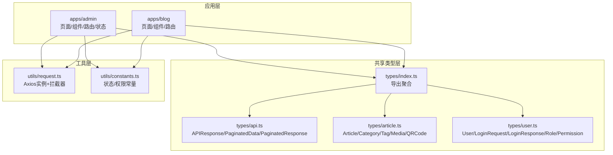
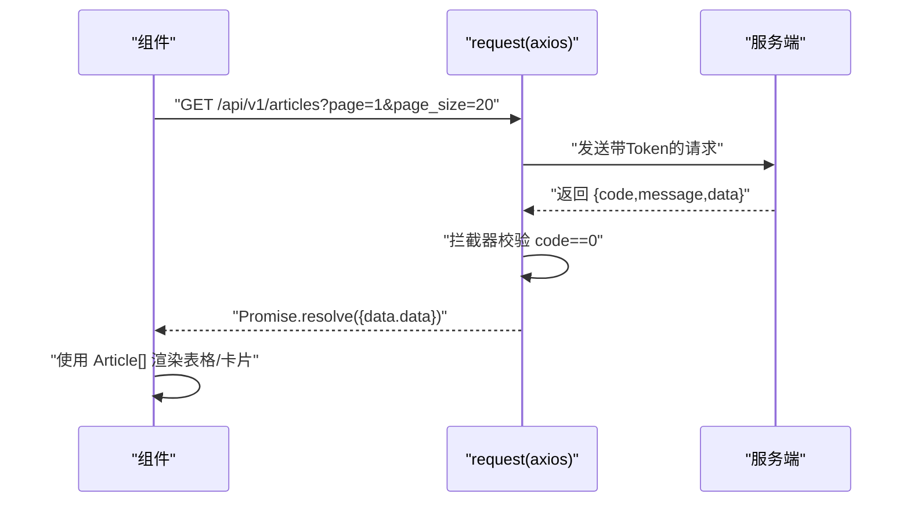
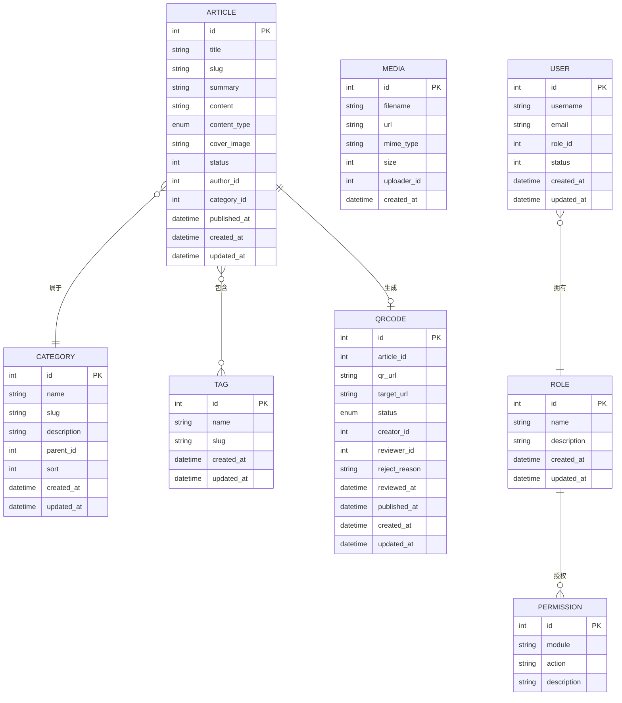
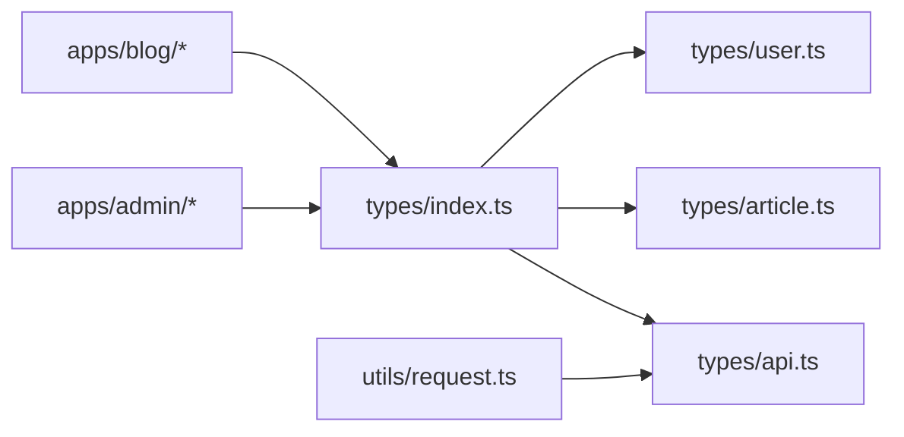

# TypeScript类型定义

<cite>
**本文引用的文件**
- [webSource/packages/shared/src/types/api.ts](file://webSource/packages/shared/src/types/api.ts)
- [webSource/packages/shared/src/types/article.ts](file://webSource/packages/shared/src/types/article.ts)
- [webSource/packages/shared/src/types/user.ts](file://webSource/packages/shared/src/types/user.ts)
- [webSource/packages/shared/src/types/index.ts](file://webSource/packages/shared/src/types/index.ts)
- [webSource/packages/shared/src/utils/request.ts](file://webSource/packages/shared/src/utils/request.ts)
- [webSource/packages/shared/src/utils/constants.ts](file://webSource/packages/shared/src/utils/constants.ts)
- [webSource/apps/admin/src/pages/articles/List.tsx](file://webSource/apps/admin/src/pages/articles/List.tsx)
- [webSource/apps/admin/src/pages/users/List.tsx](file://webSource/apps/admin/src/pages/users/List.tsx)
- [webSource/apps/blog/src/pages/Home.tsx](file://webSource/apps/blog/src/pages/Home.tsx)
- [webSource/apps/blog/src/components/ArticleCard.tsx](file://webSource/apps/blog/src/components/ArticleCard.tsx)
- [webSource/apps/blog/src/components/Pagination.tsx](file://webSource/apps/blog/src/components/Pagination.tsx)
- [webSource/apps/admin/src/store/authStore.ts](file://webSource/apps/admin/src/store/authStore.ts)
- [webSource/apps/admin/src/locales/zh-CN.ts](file://webSource/apps/admin/src/locales/zh-CN.ts)
- [webSource/apps/admin/src/locales/en-US.ts](file://webSource/apps/admin/src/locales/en-US.ts)
</cite>

## 目录
1. [引言](#引言)
2. [项目结构](#项目结构)
3. [核心组件](#核心组件)
4. [架构总览](#架构总览)
5. [详细组件分析](#详细组件分析)
6. [依赖分析](#依赖分析)
7. [性能考虑](#性能考虑)
8. [故障排查指南](#故障排查指南)
9. [结论](#结论)
10. [附录](#附录)

## 引言
本文件面向Xiangmuzs博客平台的前端TypeScript类型系统，系统性梳理API响应类型、业务实体类型与通用类型定义的组织原则与设计思路。重点覆盖以下方面：
- API类型：统一响应包装、分页数据结构与错误处理约定
- 业务实体：文章、分类、标签、媒体、二维码、用户、角色、权限等模型
- 通用类型：基础响应、分页响应、状态枚举与权限常量
- 类型安全最佳实践：泛型、接口继承、类型推导与运行时校验
- 实战示例：在React组件与API调用中如何正确使用类型定义

## 项目结构
类型定义集中于共享包packages/shared的types目录，并由各应用（admin、blog）按需导入使用；网络层通过shared的request封装统一拦截与错误处理。

图表来源
- [webSource/packages/shared/src/types/index.ts:1-4](file://webSource/packages/shared/src/types/index.ts#L1-L4)
- [webSource/packages/shared/src/types/api.ts:1-15](file://webSource/packages/shared/src/types/api.ts#L1-L15)
- [webSource/packages/shared/src/types/article.ts:1-74](file://webSource/packages/shared/src/types/article.ts#L1-L74)
- [webSource/packages/shared/src/types/user.ts:1-43](file://webSource/packages/shared/src/types/user.ts#L1-L43)
- [webSource/packages/shared/src/utils/request.ts:1-38](file://webSource/packages/shared/src/utils/request.ts#L1-L38)
- [webSource/packages/shared/src/utils/constants.ts:1-37](file://webSource/packages/shared/src/utils/constants.ts#L1-L37)

章节来源
- [webSource/packages/shared/src/types/index.ts:1-4](file://webSource/packages/shared/src/types/index.ts#L1-L4)
- [webSource/packages/shared/src/types/api.ts:1-15](file://webSource/packages/shared/src/types/api.ts#L1-L15)
- [webSource/packages/shared/src/types/article.ts:1-74](file://webSource/packages/shared/src/types/article.ts#L1-L74)
- [webSource/packages/shared/src/types/user.ts:1-43](file://webSource/packages/shared/src/types/user.ts#L1-L43)
- [webSource/packages/shared/src/utils/request.ts:1-38](file://webSource/packages/shared/src/utils/request.ts#L1-L38)
- [webSource/packages/shared/src/utils/constants.ts:1-37](file://webSource/packages/shared/src/utils/constants.ts#L1-L37)

## 核心组件
本节从“API类型”“业务实体类型”“通用类型”三个维度，系统阐述类型体系的设计与职责边界。

- API类型
  - 统一响应包装：所有HTTP响应遵循统一的响应结构，便于前端一致化处理与错误拦截
  - 分页数据结构：分页列表、总数、当前页、每页大小的标准化
  - 分页响应类型：基于统一响应包装的分页类型别名，减少重复声明

- 业务实体类型
  - 文章：标题、摘要、内容、封面、状态、作者、分类、标签、浏览量、二维码、发布时间等
  - 分类/标签/媒体：树形结构、计数、元信息等
  - 二维码：状态机、审批流程、关联文章与创建/审核者信息
  - 用户/角色/权限：用户角色映射、权限模块与动作集合

- 通用类型与常量
  - 响应与分页：APIResponse、PaginatedData、PaginatedResponse
  - 状态与权限：文章状态、用户状态、二维码状态、权限模块与动作

章节来源
- [webSource/packages/shared/src/types/api.ts:1-15](file://webSource/packages/shared/src/types/api.ts#L1-L15)
- [webSource/packages/shared/src/types/article.ts:1-74](file://webSource/packages/shared/src/types/article.ts#L1-L74)
- [webSource/packages/shared/src/types/user.ts:1-43](file://webSource/packages/shared/src/types/user.ts#L1-L43)
- [webSource/packages/shared/src/utils/constants.ts:1-37](file://webSource/packages/shared/src/utils/constants.ts#L1-L37)

## 架构总览
类型系统与运行时交互的整体流程如下：前端通过共享的request发起HTTP请求，后端返回统一响应结构；request拦截器对响应进行校验并抛出错误；组件接收类型化的数据并渲染。

图表来源
- [webSource/packages/shared/src/utils/request.ts:1-38](file://webSource/packages/shared/src/utils/request.ts#L1-L38)
- [webSource/packages/shared/src/types/api.ts:1-15](file://webSource/packages/shared/src/types/api.ts#L1-L15)
- [webSource/apps/admin/src/pages/articles/List.tsx:39-55](file://webSource/apps/admin/src/pages/articles/List.tsx#L39-L55)

章节来源
- [webSource/packages/shared/src/utils/request.ts:1-38](file://webSource/packages/shared/src/utils/request.ts#L1-L38)
- [webSource/packages/shared/src/types/api.ts:1-15](file://webSource/packages/shared/src/types/api.ts#L1-L15)
- [webSource/apps/admin/src/pages/articles/List.tsx:39-55](file://webSource/apps/admin/src/pages/articles/List.tsx#L39-L55)

## 详细组件分析

### API类型设计
- 设计要点
  - 泛型包裹：APIResponse<T>支持任意数据载荷
  - 分页解耦：PaginatedData<T>独立于具体业务，复用性强
  - 类型别名：PaginatedResponse<T>直接表达“分页响应”的语义
- 使用建议
  - 后端返回统一结构时，优先使用APIResponse<T>
  - 列表查询统一使用PaginatedResponse<T>，确保UI分页逻辑一致
  - 错误处理集中在拦截器，组件仅消费类型化的data

章节来源
- [webSource/packages/shared/src/types/api.ts:1-15](file://webSource/packages/shared/src/types/api.ts#L1-L15)

### 文章相关类型
- Article
  - 字段设计：标题、slug、摘要、内容、内容类型、封面、状态、作者、分类、标签、浏览量、二维码、发布时间、创建/更新时间
  - 关系映射：一对多（作者/分类）、多对多（标签），可选字段用于延迟加载或可空场景
- Category/Tag/Media
  - 支持树形结构（Category.children），便于构建层级导航
  - 提供article_count等统计字段，减少二次查询
- QRCode
  - 状态机：待审批/已审批/已驳回/已发布
  - 审批链路：creator/reviewer、reject_reason、reviewed_at/published_at

图表来源
- [webSource/packages/shared/src/types/article.ts:1-74](file://webSource/packages/shared/src/types/article.ts#L1-L74)
- [webSource/packages/shared/src/types/user.ts:1-43](file://webSource/packages/shared/src/types/user.ts#L1-L43)

章节来源
- [webSource/packages/shared/src/types/article.ts:1-74](file://webSource/packages/shared/src/types/article.ts#L1-L74)

### 用户相关类型
- User/LoginRequest/LoginResponse
  - 登录凭据与登录后返回的用户信息
- Role/Permission
  - 角色持有多个权限，权限由模块与动作组成
- RolePermission
  - 角色与权限的中间表映射

章节来源
- [webSource/packages/shared/src/types/user.ts:1-43](file://webSource/packages/shared/src/types/user.ts#L1-L43)

### 通用类型与常量
- APIResponse/PaginatedData/PaginatedResponse
  - 统一响应与分页结构
- 状态与权限常量
  - 文章状态、用户状态、二维码状态
  - 权限模块与动作集合，用于前端权限判断

章节来源
- [webSource/packages/shared/src/types/api.ts:1-15](file://webSource/packages/shared/src/types/api.ts#L1-L15)
- [webSource/packages/shared/src/utils/constants.ts:1-37](file://webSource/packages/shared/src/utils/constants.ts#L1-L37)

### 类型安全最佳实践
- 泛型使用
  - APIResponse<T>用于承载任意数据结构，避免any
  - PaginatedResponse<T>表达“分页响应”，约束列表与总数
- 接口继承
  - 将通用字段抽象到基础接口，派生出业务接口，提升复用性
- 类型推导
  - 在组件中通过导入类型，让props与状态具备静态类型检查
- 运行时校验
  - 拦截器内对code进行断言，异常统一抛出，组件只处理正常分支

章节来源
- [webSource/packages/shared/src/utils/request.ts:18-25](file://webSource/packages/shared/src/utils/request.ts#L18-L25)

### 具体使用场景与示例路径
- 管理端文章列表
  - 组件通过request.get获取分页数据，使用Article[]与QRCode渲染表格
  - 示例路径：[文章列表组件:39-55](file://webSource/apps/admin/src/pages/articles/List.tsx#L39-L55)
- 博客端首页
  - 组件通过request.get获取公开文章列表，使用Article[]渲染卡片
  - 示例路径：[博客首页:21-28](file://webSource/apps/blog/src/pages/Home.tsx#L21-L28)
- 博客端文章卡片
  - 组件接收Article类型props，渲染标题、摘要、分类、标签、浏览量等
  - 示例路径：[文章卡片组件:5-58](file://webSource/apps/blog/src/components/ArticleCard.tsx#L5-L58)
- 管理端用户列表
  - 组件通过request.get获取用户列表，结合Role/Permission进行权限控制
  - 示例路径：[用户列表组件:51-62](file://webSource/apps/admin/src/pages/users/List.tsx#L51-L62)
- 认证与权限
  - 登录接口返回LoginResponse，权限判断基于Permission.module/action
  - 示例路径：[认证状态管理:30-33](file://webSource/apps/admin/src/store/authStore.ts#L30-L33)

章节来源
- [webSource/apps/admin/src/pages/articles/List.tsx:39-55](file://webSource/apps/admin/src/pages/articles/List.tsx#L39-L55)
- [webSource/apps/blog/src/pages/Home.tsx:21-28](file://webSource/apps/blog/src/pages/Home.tsx#L21-L28)
- [webSource/apps/blog/src/components/ArticleCard.tsx:5-58](file://webSource/apps/blog/src/components/ArticleCard.tsx#L5-L58)
- [webSource/apps/admin/src/pages/users/List.tsx:51-62](file://webSource/apps/admin/src/pages/users/List.tsx#L51-L62)
- [webSource/apps/admin/src/store/authStore.ts:30-33](file://webSource/apps/admin/src/store/authStore.ts#L30-L33)

## 依赖分析
类型导出与使用关系如下：

图表来源
- [webSource/packages/shared/src/types/index.ts:1-4](file://webSource/packages/shared/src/types/index.ts#L1-L4)
- [webSource/packages/shared/src/types/api.ts:1-15](file://webSource/packages/shared/src/types/api.ts#L1-L15)
- [webSource/packages/shared/src/utils/request.ts:1-38](file://webSource/packages/shared/src/utils/request.ts#L1-L38)

章节来源
- [webSource/packages/shared/src/types/index.ts:1-4](file://webSource/packages/shared/src/types/index.ts#L1-L4)
- [webSource/packages/shared/src/utils/request.ts:1-38](file://webSource/packages/shared/src/utils/request.ts#L1-L38)

## 性能考虑
- 类型层面
  - 使用泛型与联合类型替代any，降低运行时错误，间接提升开发效率与稳定性
  - 将分页结构抽象为独立类型，减少重复定义与维护成本
- 运行时层面
  - 请求拦截器统一处理错误，避免在组件中分散处理，减少分支判断与渲染开销
  - 对可选字段（如QRCode、author/category名称）采用条件渲染，避免不必要的DOM节点

## 故障排查指南
- 常见问题
  - 401未授权：拦截器移除本地token并重定向至登录页
  - 响应code非0：拦截器抛出错误，组件捕获并提示
  - 数据为空：组件对list/total进行默认值处理，避免渲染异常
- 排查步骤
  - 检查拦截器是否正确拦截并抛错
  - 核对APIResponse.data结构与组件消费方式是否一致
  - 确认分页参数（page/page_size）传递是否正确

章节来源
- [webSource/packages/shared/src/utils/request.ts:18-35](file://webSource/packages/shared/src/utils/request.ts#L18-L35)

## 结论
Xiangmuzs博客平台的TypeScript类型系统以“统一响应+分页结构+业务实体”为核心，配合常量与工具函数，实现了前后端一致的契约与良好的类型安全。通过共享类型包与拦截器机制，既保证了组件层的简洁，又提升了可维护性与扩展性。建议在后续迭代中持续完善权限与状态的类型约束，并在组件中更多利用类型推导与严格模式，进一步提升代码质量。

## 附录
- 常用类型速览
  - API响应：APIResponse<T>、PaginatedData<T>、PaginatedResponse<T>
  - 业务实体：Article、Category、Tag、Media、QRCode、User、Role、Permission
  - 常量：文章状态、用户状态、二维码状态、权限模块与动作
- 常用工具
  - request：Axios实例封装，含拦截器与错误处理
  - 本地化：中英文文案键值，用于UI提示与状态文案

章节来源
- [webSource/packages/shared/src/types/api.ts:1-15](file://webSource/packages/shared/src/types/api.ts#L1-L15)
- [webSource/packages/shared/src/types/article.ts:1-74](file://webSource/packages/shared/src/types/article.ts#L1-L74)
- [webSource/packages/shared/src/types/user.ts:1-43](file://webSource/packages/shared/src/types/user.ts#L1-L43)
- [webSource/packages/shared/src/utils/constants.ts:1-37](file://webSource/packages/shared/src/utils/constants.ts#L1-L37)
- [webSource/packages/shared/src/utils/request.ts:1-38](file://webSource/packages/shared/src/utils/request.ts#L1-L38)
- [webSource/apps/admin/src/locales/zh-CN.ts:1-258](file://webSource/apps/admin/src/locales/zh-CN.ts#L1-L258)
- [webSource/apps/admin/src/locales/en-US.ts:1-259](file://webSource/apps/admin/src/locales/en-US.ts#L1-L259)