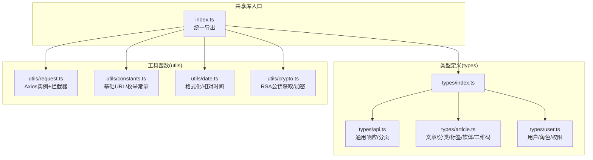
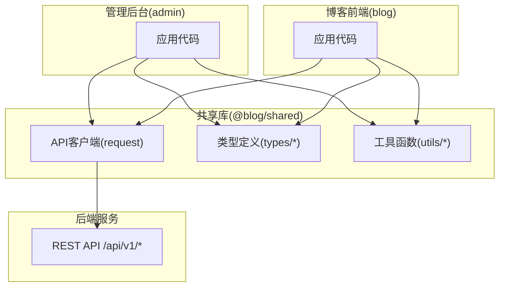
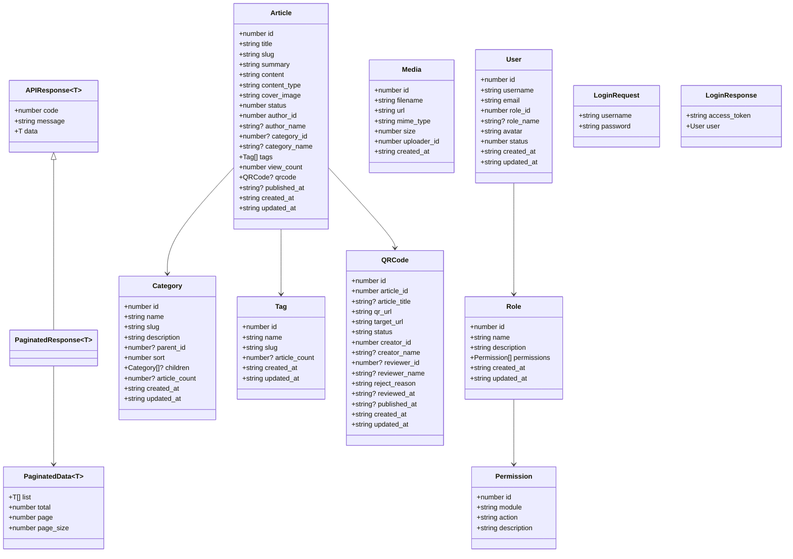
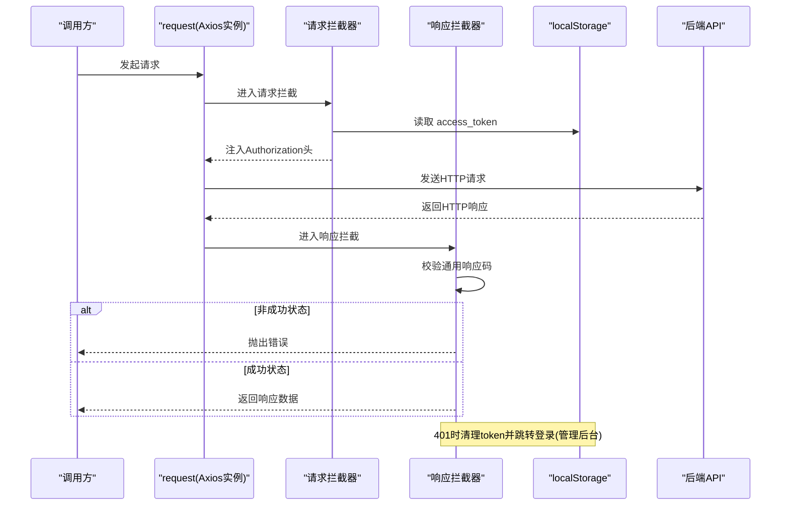
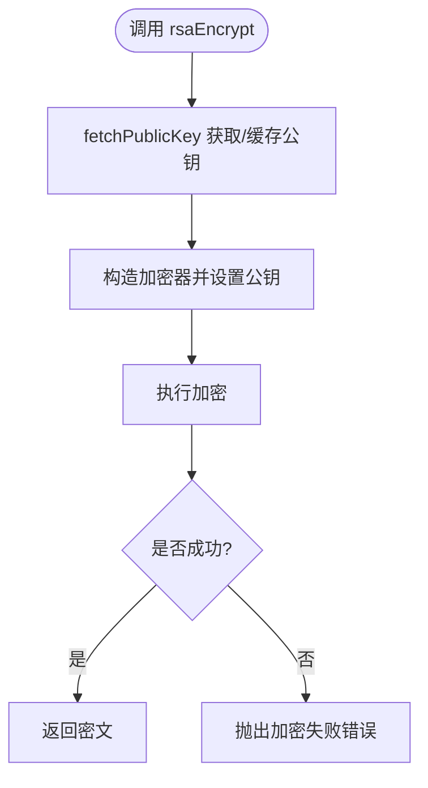
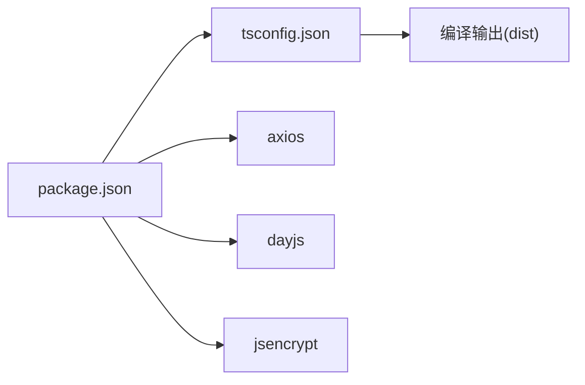

# 共享库设计

<cite>
**本文引用的文件**
- [webSource/packages/shared/src/index.ts](file://webSource/packages/shared/src/index.ts)
- [webSource/packages/shared/src/types/index.ts](file://webSource/packages/shared/src/types/index.ts)
- [webSource/packages/shared/src/types/api.ts](file://webSource/packages/shared/src/types/api.ts)
- [webSource/packages/shared/src/types/article.ts](file://webSource/packages/shared/src/types/article.ts)
- [webSource/packages/shared/src/types/user.ts](file://webSource/packages/shared/src/types/user.ts)
- [webSource/packages/shared/src/utils/request.ts](file://webSource/packages/shared/src/utils/request.ts)
- [webSource/packages/shared/src/utils/constants.ts](file://webSource/packages/shared/src/utils/constants.ts)
- [webSource/packages/shared/src/utils/crypto.ts](file://webSource/packages/shared/src/utils/crypto.ts)
- [webSource/packages/shared/src/utils/date.ts](file://webSource/packages/shared/src/utils/date.ts)
- [webSource/packages/shared/package.json](file://webSource/packages/shared/package.json)
- [webSource/packages/shared/tsconfig.json](file://webSource/packages/shared/tsconfig.json)
</cite>

## 目录
1. [简介](#简介)
2. [项目结构](#项目结构)
3. [核心组件](#核心组件)
4. [架构总览](#架构总览)
5. [详细组件分析](#详细组件分析)
6. [依赖分析](#依赖分析)
7. [性能考虑](#性能考虑)
8. [故障排查指南](#故障排查指南)
9. [结论](#结论)
10. [附录](#附录)

## 简介
本文件面向Xiangmuzs博客平台的共享库，系统性阐述其设计目标与架构原则，覆盖TypeScript类型定义、工具函数与API客户端的统一管理；详解API类型定义的设计思路（请求/响应接口、错误处理类型、分页数据结构）；梳理工具函数库的组织方式（网络请求封装、加密解密、日期处理、常量定义）；解释API客户端的设计模式（请求拦截、响应处理、鉴权与401自动登出）；并提供在管理后台与博客前端的使用指南、类型安全最佳实践、模块化与可扩展性建议、版本与维护策略。

## 项目结构
共享库采用“按功能域划分”的模块化组织：对外通过入口导出统一聚合；内部按职责拆分为类型定义与工具函数两大块，其中工具函数进一步细分为网络请求、常量、日期与加密等子模块。

图表来源
- [webSource/packages/shared/src/index.ts:1-6](file://webSource/packages/shared/src/index.ts#L1-L6)
- [webSource/packages/shared/src/types/index.ts:1-4](file://webSource/packages/shared/src/types/index.ts#L1-L4)
- [webSource/packages/shared/src/utils/request.ts:1-38](file://webSource/packages/shared/src/utils/request.ts#L1-L38)
- [webSource/packages/shared/src/utils/constants.ts:1-37](file://webSource/packages/shared/src/utils/constants.ts#L1-L37)
- [webSource/packages/shared/src/utils/date.ts:1-20](file://webSource/packages/shared/src/utils/date.ts#L1-L20)
- [webSource/packages/shared/src/utils/crypto.ts:1-24](file://webSource/packages/shared/src/utils/crypto.ts#L1-L24)

章节来源
- [webSource/packages/shared/src/index.ts:1-6](file://webSource/packages/shared/src/index.ts#L1-L6)
- [webSource/packages/shared/src/types/index.ts:1-4](file://webSource/packages/shared/src/types/index.ts#L1-L4)
- [webSource/packages/shared/src/utils/request.ts:1-38](file://webSource/packages/shared/src/utils/request.ts#L1-L38)
- [webSource/packages/shared/src/utils/constants.ts:1-37](file://webSource/packages/shared/src/utils/constants.ts#L1-L37)
- [webSource/packages/shared/src/utils/date.ts:1-20](file://webSource/packages/shared/src/utils/date.ts#L1-L20)
- [webSource/packages/shared/src/utils/crypto.ts:1-24](file://webSource/packages/shared/src/utils/crypto.ts#L1-L24)

## 核心组件
- 统一出口：入口文件聚合导出类型、请求客户端、常量、日期与加密工具，便于上层按需导入或整体引入。
- 类型体系：围绕通用响应与分页、文章/分类/标签/媒体/二维码、用户/角色/权限建立强类型模型，确保前后端契约一致。
- 工具函数：提供网络请求封装（含鉴权与错误处理）、常量配置、日期格式化、RSA加密等常用能力。
- 架构原则：单一职责、高内聚低耦合、类型驱动、可测试、可演进。

章节来源
- [webSource/packages/shared/src/index.ts:1-6](file://webSource/packages/shared/src/index.ts#L1-L6)
- [webSource/packages/shared/src/types/api.ts:1-15](file://webSource/packages/shared/src/types/api.ts#L1-L15)
- [webSource/packages/shared/src/types/article.ts:1-74](file://webSource/packages/shared/src/types/article.ts#L1-L74)
- [webSource/packages/shared/src/types/user.ts:1-43](file://webSource/packages/shared/src/types/user.ts#L1-L43)
- [webSource/packages/shared/src/utils/request.ts:1-38](file://webSource/packages/shared/src/utils/request.ts#L1-L38)
- [webSource/packages/shared/src/utils/constants.ts:1-37](file://webSource/packages/shared/src/utils/constants.ts#L1-L37)
- [webSource/packages/shared/src/utils/date.ts:1-20](file://webSource/packages/shared/src/utils/date.ts#L1-L20)
- [webSource/packages/shared/src/utils/crypto.ts:1-24](file://webSource/packages/shared/src/utils/crypto.ts#L1-L24)

## 架构总览
共享库与业务应用（管理后台与博客前端）通过统一的类型与工具进行对接，API客户端负责HTTP通信与鉴权，类型定义保证调用方的类型安全。

图表来源
- [webSource/packages/shared/src/utils/request.ts:1-38](file://webSource/packages/shared/src/utils/request.ts#L1-L38)
- [webSource/packages/shared/src/utils/constants.ts:1-1](file://webSource/packages/shared/src/utils/constants.ts#L1-L1)
- [webSource/packages/shared/src/types/index.ts:1-4](file://webSource/packages/shared/src/types/index.ts#L1-L4)

## 详细组件分析

### 类型定义体系
- 通用响应与分页
  - APIResponse<T>：统一响应载体，包含状态码、消息与泛型数据体。
  - 分页数据结构：列表、总数、当前页、页大小。
  - 分页响应：基于通用响应包装分页数据。
- 文章域模型
  - 文章：标题、摘要、内容、封面、作者、分类、标签、浏览数、二维码等。
  - 分类：树形父子关系、排序与计数。
  - 标签：名称、别名与计数。
  - 媒体：文件名、URL、MIME、大小、上传者。
  - 二维码：审批状态、跳转目标、审核信息与时间戳。
- 用户域模型
  - 用户：用户名、邮箱、角色、头像、状态与时间戳。
  - 登录：用户名/密码请求体与令牌+用户信息响应体。
  - 角色与权限：角色包含权限集合，权限由模块与动作组成。

图表来源
- [webSource/packages/shared/src/types/api.ts:1-15](file://webSource/packages/shared/src/types/api.ts#L1-L15)
- [webSource/packages/shared/src/types/article.ts:1-74](file://webSource/packages/shared/src/types/article.ts#L1-L74)
- [webSource/packages/shared/src/types/user.ts:1-43](file://webSource/packages/shared/src/types/user.ts#L1-L43)

章节来源
- [webSource/packages/shared/src/types/api.ts:1-15](file://webSource/packages/shared/src/types/api.ts#L1-L15)
- [webSource/packages/shared/src/types/article.ts:1-74](file://webSource/packages/shared/src/types/article.ts#L1-L74)
- [webSource/packages/shared/src/types/user.ts:1-43](file://webSource/packages/shared/src/types/user.ts#L1-L43)

### API客户端设计与拦截器
- 客户端初始化：基于Axios创建实例，设置基础路径与超时。
- 请求拦截：从本地存储读取访问令牌，自动注入到请求头。
- 响应拦截：校验通用响应码，非成功状态统一抛错；对401进行登出清理并跳转登录页（管理后台路径前缀判断）。
- 错误处理：保留原始错误对象，便于上层区分网络错误与业务错误。

图表来源
- [webSource/packages/shared/src/utils/request.ts:1-38](file://webSource/packages/shared/src/utils/request.ts#L1-L38)
- [webSource/packages/shared/src/utils/constants.ts:1-1](file://webSource/packages/shared/src/utils/constants.ts#L1-L1)

章节来源
- [webSource/packages/shared/src/utils/request.ts:1-38](file://webSource/packages/shared/src/utils/request.ts#L1-L38)

### 工具函数库
- 常量定义
  - 基础URL：统一API基础路径，便于切换环境。
  - 枚举常量：文章状态、用户状态、二维码状态、权限模块与动作，均使用只读字面量类型，提升类型安全性与可维护性。
- 日期处理
  - 提供日期格式化与相对时间显示，支持本地化。
- 加密工具
  - RSA公钥获取：首次调用拉取后缓存，避免重复请求。
  - RSA加密：对敏感数据进行加密传输。

图表来源
- [webSource/packages/shared/src/utils/crypto.ts:1-24](file://webSource/packages/shared/src/utils/crypto.ts#L1-L24)

章节来源
- [webSource/packages/shared/src/utils/constants.ts:1-37](file://webSource/packages/shared/src/utils/constants.ts#L1-L37)
- [webSource/packages/shared/src/utils/date.ts:1-20](file://webSource/packages/shared/src/utils/date.ts#L1-L20)
- [webSource/packages/shared/src/utils/crypto.ts:1-24](file://webSource/packages/shared/src/utils/crypto.ts#L1-L24)

### 使用指南与集成方法
- 在管理后台与博客前端中，通过统一入口导入所需类型与工具：
  - 导入API客户端用于HTTP请求；
  - 导入类型定义用于参数与响应的类型约束；
  - 导入常量、日期与加密工具用于配置、展示与安全。
- 集成要点
  - 在应用启动阶段确保鉴权令牌存在且有效，拦截器会自动注入；
  - 对于需要RSA加密的敏感字段，在发送前进行加密；
  - 使用分页响应类型接收后端分页数据，统一处理列表与总数。

章节来源
- [webSource/packages/shared/src/index.ts:1-6](file://webSource/packages/shared/src/index.ts#L1-L6)
- [webSource/packages/shared/src/utils/request.ts:1-38](file://webSource/packages/shared/src/utils/request.ts#L1-L38)
- [webSource/packages/shared/src/utils/constants.ts:1-37](file://webSource/packages/shared/src/utils/constants.ts#L1-L37)
- [webSource/packages/shared/src/utils/date.ts:1-20](file://webSource/packages/shared/src/utils/date.ts#L1-L20)
- [webSource/packages/shared/src/utils/crypto.ts:1-24](file://webSource/packages/shared/src/utils/crypto.ts#L1-L24)

### 类型安全与最佳实践
- 泛型使用
  - APIResponse<T>与PaginatedData<T>通过泛型承载具体业务数据，避免any污染。
- 接口继承与组合
  - 复杂实体（如Article）通过组合Tag、QRCode、Category等接口表达领域关系。
- 只读枚举
  - 使用as const定义状态与模块常量，生成字面量联合类型，减少运行期错误。
- 最佳实践
  - 严格区分业务错误与网络错误，利用拦截器统一处理；
  - 对外暴露稳定接口，内部实现可演进；
  - 保持类型定义与后端契约一致，避免隐式转换。

章节来源
- [webSource/packages/shared/src/types/api.ts:1-15](file://webSource/packages/shared/src/types/api.ts#L1-L15)
- [webSource/packages/shared/src/types/article.ts:1-74](file://webSource/packages/shared/src/types/article.ts#L1-L74)
- [webSource/packages/shared/src/types/user.ts:1-43](file://webSource/packages/shared/src/types/user.ts#L1-L43)
- [webSource/packages/shared/src/utils/constants.ts:3-36](file://webSource/packages/shared/src/utils/constants.ts#L3-L36)

### 模块化与可扩展性
- 模块化策略
  - 将类型与工具按职责拆分，入口统一导出，便于按需引入；
  - 工具函数尽量无副作用，必要时通过配置项扩展行为。
- 扩展建议
  - 新增类型：在对应域文件中补充接口，保持与现有命名与结构一致；
  - 新增工具：遵循现有命名与导出风格，提供清晰的错误处理；
  - 新增API：在拦截器中增加必要的通用逻辑（如重试、埋点），但优先通过上层封装实现。

章节来源
- [webSource/packages/shared/src/index.ts:1-6](file://webSource/packages/shared/src/index.ts#L1-L6)
- [webSource/packages/shared/src/utils/request.ts:1-38](file://webSource/packages/shared/src/utils/request.ts#L1-L38)

## 依赖分析
- 运行时依赖
  - axios：HTTP客户端，提供请求与响应拦截能力。
  - dayjs：日期处理，支持插件与本地化。
  - jsencrypt：RSA加密工具。
- 构建与开发依赖
  - typescript：类型检查与编译。
- 构建配置
  - ESNext模块、严格模式、声明文件输出、源码映射等，确保产物质量与调试体验。

图表来源
- [webSource/packages/shared/package.json:1-23](file://webSource/packages/shared/package.json#L1-L23)
- [webSource/packages/shared/tsconfig.json:1-25](file://webSource/packages/shared/tsconfig.json#L1-L25)

章节来源
- [webSource/packages/shared/package.json:15-22](file://webSource/packages/shared/package.json#L15-L22)
- [webSource/packages/shared/tsconfig.json:1-25](file://webSource/packages/shared/tsconfig.json#L1-L25)

## 性能考虑
- 请求缓存与去重：在上层业务中对相同查询进行缓存，避免重复请求。
- 资源加载优化：延迟加载加密公钥，仅在需要时发起获取请求并缓存。
- 渲染优化：日期格式化与相对时间计算尽量在渲染前完成，减少重复计算。
- 体积控制：按需导入类型与工具，避免打包冗余代码。

## 故障排查指南
- 401未授权
  - 现象：收到401错误后自动清除令牌并跳转登录页（管理后台路径前缀下生效）。
  - 排查：确认令牌是否过期或被撤销；检查拦截器是否正确注入Authorization头。
- 通用响应失败
  - 现象：响应码非0时统一抛错，message作为错误提示。
  - 排查：根据message定位业务问题；核对请求参数与后端契约。
- RSA加密失败
  - 现象：加密结果为空时抛出错误。
  - 排查：确认公钥已成功获取并缓存；检查输入文本长度与字符集。

章节来源
- [webSource/packages/shared/src/utils/request.ts:18-35](file://webSource/packages/shared/src/utils/request.ts#L18-L35)
- [webSource/packages/shared/src/utils/crypto.ts:14-23](file://webSource/packages/shared/src/utils/crypto.ts#L14-L23)

## 结论
该共享库以类型驱动为核心，结合统一的API客户端与实用工具函数，为管理后台与博客前端提供了稳定、可扩展的基础设施。通过清晰的模块划分、严格的类型约束与完善的错误处理，显著提升了开发效率与系统可靠性。后续可在不破坏现有契约的前提下，持续扩展类型与工具能力，完善错误重试与监控埋点等横切关注点。

## 附录
- 版本与发布
  - 当前版本：1.0.0（私有包，按需发布）。
  - 建议：采用语义化版本管理，变更类型明确标注（breaking/change/docs）。
- 更新维护
  - 类型变更需同步后端契约；工具函数变更需提供兼容方案或迁移指引。
  - 引入自动化检查（类型检查、构建、单元测试），确保质量门槛。
- 自定义与扩展
  - 新增类型：遵循现有命名与结构，保持向后兼容。
  - 新增工具：提供默认配置与错误处理，避免强制依赖。
  - 新增API：优先在上层封装重试与日志，避免在客户端硬编码复杂策略。