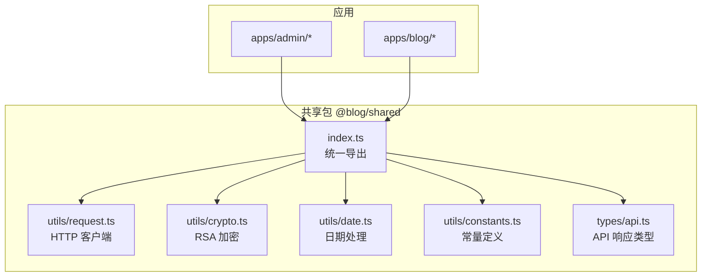
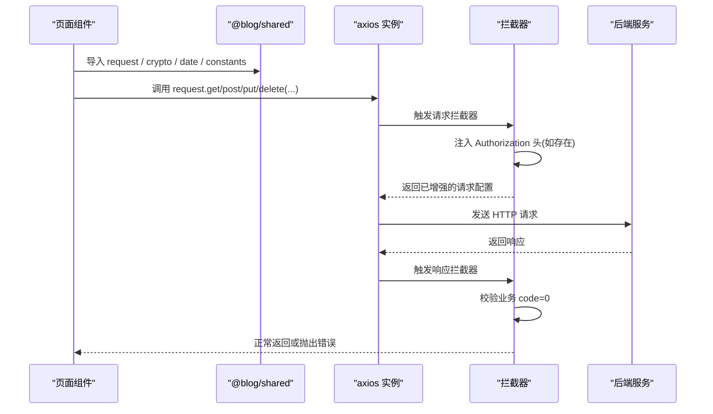
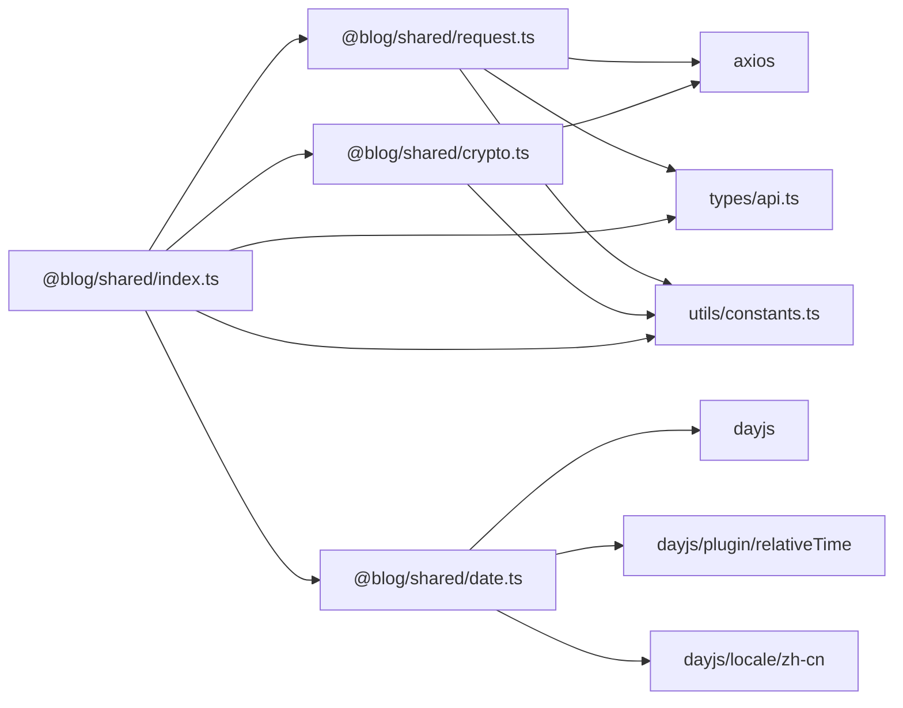

# 工具函数库

<cite>
**本文引用的文件**
- [webSource/packages/shared/src/utils/request.ts](file://webSource/packages/shared/src/utils/request.ts)
- [webSource/packages/shared/src/utils/crypto.ts](file://webSource/packages/shared/src/utils/crypto.ts)
- [webSource/packages/shared/src/utils/date.ts](file://webSource/packages/shared/src/utils/date.ts)
- [webSource/packages/shared/src/utils/constants.ts](file://webSource/packages/shared/src/utils/constants.ts)
- [webSource/packages/shared/src/index.ts](file://webSource/packages/shared/src/index.ts)
- [webSource/packages/shared/src/types/api.ts](file://webSource/packages/shared/src/types/api.ts)
- [webSource/packages/shared/package.json](file://webSource/packages/shared/package.json)
- [webSource/apps/admin/src/pages/users/List.tsx](file://webSource/apps/admin/src/pages/users/List.tsx)
- [webSource/apps/admin/src/pages/articles/List.tsx](file://webSource/apps/admin/src/pages/articles/List.tsx)
- [webSource/apps/blog/src/pages/Home.tsx](file://webSource/apps/blog/src/pages/Home.tsx)
</cite>

## 目录
1. [简介](#简介)
2. [项目结构](#项目结构)
3. [核心组件](#核心组件)
4. [架构总览](#架构总览)
5. [详细组件分析](#详细组件分析)
6. [依赖分析](#依赖分析)
7. [性能考虑](#性能考虑)
8. [故障排查指南](#故障排查指南)
9. [结论](#结论)
10. [附录](#附录)

## 简介
本文件系统性梳理 Xiangmuzs 博客平台前端共享包中的工具函数库，覆盖以下模块：
- 网络请求封装 request：基于 axios 的统一 HTTP 客户端，内置请求/响应拦截器与鉴权头注入。
- 加密解密工具 crypto：RSA 公钥拉取与加密流程，保障敏感数据传输安全。
- 日期处理工具 date：基于 dayjs 的格式化与相对时间显示。
- 常量定义 constants：集中管理 API 基础地址、业务状态码与权限枚举等静态常量。
- 类型定义：统一后端响应结构 APIResponse 与分页数据模型。

通过本文档，读者可以掌握各工具函数的设计原则（单一职责、无副作用、可测试）、API 使用方式、典型用法与最佳实践，并获得扩展与定制指导。

## 项目结构
共享工具库位于 webSource/packages/shared，采用按功能域划分的 utils 目录组织，入口 index.ts 统一导出，供 admin 与 blog 应用按需导入使用。

图表来源
- [webSource/packages/shared/src/index.ts:1-6](file://webSource/packages/shared/src/index.ts#L1-L6)
- [webSource/packages/shared/src/utils/request.ts:1-38](file://webSource/packages/shared/src/utils/request.ts#L1-L38)
- [webSource/packages/shared/src/utils/crypto.ts:1-24](file://webSource/packages/shared/src/utils/crypto.ts#L1-L24)
- [webSource/packages/shared/src/utils/date.ts:1-20](file://webSource/packages/shared/src/utils/date.ts#L1-L20)
- [webSource/packages/shared/src/utils/constants.ts:1-37](file://webSource/packages/shared/src/utils/constants.ts#L1-L37)
- [webSource/packages/shared/src/types/api.ts:1-15](file://webSource/packages/shared/src/types/api.ts#L1-L15)

章节来源
- [webSource/packages/shared/src/index.ts:1-6](file://webSource/packages/shared/src/index.ts#L1-L6)
- [webSource/packages/shared/package.json:1-23](file://webSource/packages/shared/package.json#L1-L23)

## 核心组件
- request：全局 axios 实例，统一设置 base URL、超时；自动注入 Bearer Token；对非业务成功响应进行拦截并抛错；对 401 进行登出清理与路由跳转。
- crypto：封装 RSA 公钥缓存与加密流程，提供异步获取公钥与加密函数。
- date：封装日期格式化与相对时间显示，支持本地化。
- constants：集中管理 API 基础地址与业务常量，避免魔法数与分散配置。
- 类型 APIResponse/PaginatedData：约束后端统一响应结构，便于强类型消费。

章节来源
- [webSource/packages/shared/src/utils/request.ts:1-38](file://webSource/packages/shared/src/utils/request.ts#L1-L38)
- [webSource/packages/shared/src/utils/crypto.ts:1-24](file://webSource/packages/shared/src/utils/crypto.ts#L1-L24)
- [webSource/packages/shared/src/utils/date.ts:1-20](file://webSource/packages/shared/src/utils/date.ts#L1-L20)
- [webSource/packages/shared/src/utils/constants.ts:1-37](file://webSource/packages/shared/src/utils/constants.ts#L1-L37)
- [webSource/packages/shared/src/types/api.ts:1-15](file://webSource/packages/shared/src/types/api.ts#L1-L15)

## 架构总览
下图展示了应用层调用共享工具库的整体交互路径，以及 request 的拦截器工作流。

图表来源
- [webSource/packages/shared/src/utils/request.ts:5-35](file://webSource/packages/shared/src/utils/request.ts#L5-L35)
- [webSource/apps/admin/src/pages/users/List.tsx:102-131](file://webSource/apps/admin/src/pages/users/List.tsx#L102-L131)
- [webSource/apps/blog/src/pages/Home.tsx:19-28](file://webSource/apps/blog/src/pages/Home.tsx#L19-L28)

## 详细组件分析

### 网络请求封装 request
- 设计目标
  - 统一 HTTP 客户端配置与行为，减少重复代码。
  - 自动携带鉴权信息，降低业务侧负担。
  - 对业务错误进行标准化处理，提升错误可见性。
- 关键特性
  - 基础配置：baseURL、timeout。
  - 请求拦截器：从 localStorage 读取 access_token 并注入 Authorization 头。
  - 响应拦截器：校验 APIResponse.code 是否为 0，否则统一 reject；对 401 清理本地 token 并跳转登录页（仅 admin 路由）。
- 使用建议
  - 在应用启动时确保 token 存储正确，避免无谓的 401。
  - 对于公开接口，可在调用前移除本地 token 或使用独立实例。
  - 错误处理建议在页面层统一捕获并提示用户。

API 文档
- 函数名：request（默认导出）
- 参数：遵循 axios.create 配置与 axios 请求方法签名
  - baseURL：字符串，来自 constants 中的 API_BASE_URL
  - timeout：数字（毫秒），默认 15000
  - headers：Authorization 将由拦截器自动注入
- 返回值：Promise<axios.AxiosResponse>
- 使用示例（路径）
  - [webSource/apps/admin/src/pages/users/List.tsx:51-62](file://webSource/apps/admin/src/pages/users/List.tsx#L51-L62)
  - [webSource/apps/blog/src/pages/Home.tsx:20-27](file://webSource/apps/blog/src/pages/Home.tsx#L20-L27)

设计原则
- 单一职责：仅负责 HTTP 通信与通用拦截逻辑。
- 无副作用：拦截器不修改业务数据；错误处理不改变外部状态。
- 可测试性：可通过 mock axios 实现隔离测试。

章节来源
- [webSource/packages/shared/src/utils/request.ts:1-38](file://webSource/packages/shared/src/utils/request.ts#L1-L38)
- [webSource/packages/shared/src/utils/constants.ts](file://webSource/packages/shared/src/utils/constants.ts#L1)
- [webSource/packages/shared/src/types/api.ts:1-5](file://webSource/packages/shared/src/types/api.ts#L1-L5)

### 加密解密工具 crypto
- 设计目标
  - 在客户端安全地对敏感数据（如密码）进行 RSA 加密，避免明文传输。
- 关键特性
  - fetchPublicKey：首次调用时向 /auth/public-key 拉取公钥并缓存；后续复用。
  - rsaEncrypt：使用公钥对明文进行加密，失败时抛出错误。
- 使用建议
  - 在提交表单前对密码字段执行加密；仅在必要时调用 fetchPublicKey。
  - 若后端接口变更公钥地址，请同步更新 constants 中的 API 地址。

API 文档
- 函数名：fetchPublicKey
  - 参数：无
  - 返回值：Promise<string>（公钥字符串）
  - 异常：无（内部已缓存，不会重复请求）
  - 使用示例（路径）
    - [webSource/apps/admin/src/pages/users/List.tsx:112-113](file://webSource/apps/admin/src/pages/users/List.tsx#L112-L113)
- 函数名：rsaEncrypt
  - 参数：plaintext: string（待加密明文）
  - 返回值：Promise<string>（加密结果）
  - 异常：当加密失败时抛出错误
  - 使用示例（路径）
    - [webSource/apps/admin/src/pages/users/List.tsx:111-113](file://webSource/apps/admin/src/pages/users/List.tsx#L111-L113)

设计原则
- 单一职责：仅负责公钥获取与 RSA 加密。
- 无副作用：不写入全局状态；加密失败显式抛错。
- 可测试性：可通过替换公钥与模拟加密库实现单元测试。

章节来源
- [webSource/packages/shared/src/utils/crypto.ts:1-24](file://webSource/packages/shared/src/utils/crypto.ts#L1-L24)

### 日期处理工具 date
- 设计目标
  - 提供简洁一致的日期格式化与相对时间显示能力，支持本地化。
- 关键特性
  - formatDate：支持自定义格式字符串，默认为“年-月-日 时:分”。
  - fromNow：显示相对时间（如“5 分钟前”），自动本地化为中文。
- 使用建议
  - 对空值进行防御性处理，返回占位符。
  - 在国际化场景下，确保 dayjs locale 已正确初始化。

API 文档
- 函数名：formatDate
  - 参数：
    - date: string | null | undefined（可选）
    - format: string（可选，默认为“YYYY-MM-DD HH:mm”）
  - 返回值：string（格式化后的日期字符串，空值返回“-”）
  - 使用示例（路径）
    - [webSource/apps/admin/src/pages/articles/List.tsx](file://webSource/apps/admin/src/pages/articles/List.tsx#L144)
- 函数名：fromNow
  - 参数：
    - date: string | null | undefined（可选）
  - 返回值：string（相对时间字符串，空值返回“-”）
  - 使用示例（路径）
    - [webSource/apps/admin/src/pages/articles/List.tsx](file://webSource/apps/admin/src/pages/articles/List.tsx#L144)

设计原则
- 单一职责：仅负责日期格式化与相对时间。
- 无副作用：不修改输入；返回纯字符串。
- 可测试性：可通过伪造当前时间实现时间相关断言。

章节来源
- [webSource/packages/shared/src/utils/date.ts:1-20](file://webSource/packages/shared/src/utils/date.ts#L1-L20)

### 常量定义 constants
- 设计目标
  - 将 API 基础地址与业务常量集中管理，避免散落配置与魔法数。
- 关键常量
  - API_BASE_URL：统一后端 API 基础路径。
  - ARTICLE_STATUS：文章状态枚举（草稿/已发布）。
  - USER_STATUS：用户状态枚举（禁用/激活）。
  - QRCODE_STATUS：二维码状态枚举。
  - PERMISSION_MODULES：权限模块列表。
  - PERMISSION_ACTIONS：权限动作列表。
- 使用建议
  - 新增业务状态时，保持枚举与后端一致。
  - 权限常量用于前端权限控制与 UI 展示。

API 文档
- 常量名：API_BASE_URL
  - 类型：string
  - 默认值："/api/v1"
  - 使用示例（路径）
    - [webSource/packages/shared/src/utils/request.ts](file://webSource/packages/shared/src/utils/request.ts#L3)
    - [webSource/packages/shared/src/utils/crypto.ts](file://webSource/packages/shared/src/utils/crypto.ts#L1)
- 常量名：ARTICLE_STATUS
  - 类型：Record<string, number>
  - 示例：DRAFT=0, PUBLISHED=1
  - 使用示例（路径）
    - [webSource/apps/admin/src/pages/articles/List.tsx:69-76](file://webSource/apps/admin/src/pages/articles/List.tsx#L69-L76)
- 常量名：USER_STATUS
  - 类型：Record<string, number>
  - 示例：DISABLED=0, ACTIVE=1
- 常量名：QRCODE_STATUS
  - 类型：Record<string, string>
  - 示例：pending/approved/rejected/published
- 常量名：PERMISSION_MODULES
  - 类型：string[]
  - 示例：['article','category','tag','media','user','role','qrcode','dashboard']
- 常量名：PERMISSION_ACTIONS
  - 类型：string[]
  - 示例：['create','read','update','delete']

设计原则
- 单一职责：集中管理静态配置。
- 无副作用：常量不可变，避免运行期修改。
- 可测试性：常量可直接被测试用例引用。

章节来源
- [webSource/packages/shared/src/utils/constants.ts:1-37](file://webSource/packages/shared/src/utils/constants.ts#L1-L37)

### 类型定义 APIResponse/PaginatedData
- 设计目标
  - 统一后端响应结构，便于前端强类型消费与错误处理。
- 关键类型
  - APIResponse<T>：包含 code、message、data 字段。
  - PaginatedData<T>：包含 list、total、page、page_size 字段。
  - PaginatedResponse<T>：APIResponse<PaginatedData<T>> 的别名。
- 使用建议
  - 在调用 request 后，通过泛型约束 data 结构，提升类型安全。

API 文档
- 接口：APIResponse<T>
  - 字段：code: number, message: string, data: T
  - 使用示例（路径）
    - [webSource/packages/shared/src/utils/request.ts:20-24](file://webSource/packages/shared/src/utils/request.ts#L20-L24)
- 接口：PaginatedData<T>
  - 字段：list: T[], total: number, page: number, page_size: number
- 接口：PaginatedResponse<T>
  - 定义：APIResponse<PaginatedData<T>>

章节来源
- [webSource/packages/shared/src/types/api.ts:1-15](file://webSource/packages/shared/src/types/api.ts#L1-L15)

## 依赖分析
- 内部依赖
  - request 依赖 constants 中的 API_BASE_URL。
  - crypto 依赖 constants 中的 API_BASE_URL 与 axios。
  - index.ts 统一导出各模块，供应用层按需导入。
- 外部依赖
  - axios：HTTP 客户端与拦截器。
  - dayjs：日期处理与相对时间插件。
  - jsencrypt：RSA 加密库。

图表来源
- [webSource/packages/shared/src/utils/request.ts:1-3](file://webSource/packages/shared/src/utils/request.ts#L1-L3)
- [webSource/packages/shared/src/utils/crypto.ts:1-3](file://webSource/packages/shared/src/utils/crypto.ts#L1-L3)
- [webSource/packages/shared/src/utils/date.ts:1-6](file://webSource/packages/shared/src/utils/date.ts#L1-L6)
- [webSource/packages/shared/src/index.ts:2-5](file://webSource/packages/shared/src/index.ts#L2-L5)
- [webSource/packages/shared/package.json:15-18](file://webSource/packages/shared/package.json#L15-L18)

章节来源
- [webSource/packages/shared/package.json:1-23](file://webSource/packages/shared/package.json#L1-L23)

## 性能考虑
- 请求拦截器开销极低，主要为字符串拼接与对象读取，影响可忽略。
- RSA 加密建议仅在必要时触发，避免频繁公钥拉取；当前实现已做缓存，无需额外优化。
- 日期处理使用 dayjs，性能稳定；建议在高频渲染场景中复用格式化模板，减少重复创建。
- 建议在应用层对高频请求进行防抖/节流与缓存策略配合，以减轻网络压力。

## 故障排查指南
- 401 未授权
  - 现象：响应拦截器检测到 401，清除本地 token 并跳转登录页。
  - 排查：确认本地是否存在有效的 access_token；检查后端签发与刷新策略。
  - 参考路径
    - [webSource/packages/shared/src/utils/request.ts:27-32](file://webSource/packages/shared/src/utils/request.ts#L27-L32)
- 业务错误
  - 现象：响应 code 非 0，拦截器统一 reject 并返回 message。
  - 排查：根据 message 提示定位问题；检查参数与权限。
  - 参考路径
    - [webSource/packages/shared/src/utils/request.ts:21-23](file://webSource/packages/shared/src/utils/request.ts#L21-L23)
- RSA 加密失败
  - 现象：rsaEncrypt 返回空或抛错。
  - 排查：确认公钥获取成功；检查 jsencrypt 版本与浏览器兼容性。
  - 参考路径
    - [webSource/packages/shared/src/utils/crypto.ts:14-23](file://webSource/packages/shared/src/utils/crypto.ts#L14-L23)
- 日期显示异常
  - 现象：formatDate/fromNow 返回占位符“-”。
  - 排查：确认传入日期为有效字符串；检查本地化是否正确初始化。
  - 参考路径
    - [webSource/packages/shared/src/utils/date.ts:8-19](file://webSource/packages/shared/src/utils/date.ts#L8-L19)

章节来源
- [webSource/packages/shared/src/utils/request.ts:18-35](file://webSource/packages/shared/src/utils/request.ts#L18-L35)
- [webSource/packages/shared/src/utils/crypto.ts:14-23](file://webSource/packages/shared/src/utils/crypto.ts#L14-L23)
- [webSource/packages/shared/src/utils/date.ts:8-19](file://webSource/packages/shared/src/utils/date.ts#L8-L19)

## 结论
该工具函数库以“统一、安全、易用”为目标，通过 request 的拦截器机制实现鉴权与错误标准化，通过 crypto 的 RSA 流程保障敏感数据安全，通过 date 的格式化与相对时间提升用户体验，通过 constants 的集中管理降低维护成本。整体设计遵循单一职责、无副作用与可测试性原则，适合在多页面应用中复用与扩展。

## 附录

### 实际使用案例与最佳实践
- 用户管理（密码加密）
  - 在新增/编辑用户时，若提供了密码，则先对明文执行 rsaEncrypt，再提交到后端。
  - 参考路径
    - [webSource/apps/admin/src/pages/users/List.tsx:102-131](file://webSource/apps/admin/src/pages/users/List.tsx#L102-L131)
- 文章列表（分页与状态）
  - 使用 request.get 获取分页数据；结合 ARTICLE_STATUS 常量渲染状态标签。
  - 参考路径
    - [webSource/apps/admin/src/pages/articles/List.tsx:39-55](file://webSource/apps/admin/src/pages/articles/List.tsx#L39-L55)
- 博客首页（公开接口）
  - 调用 /public/articles 获取公开文章列表，无需鉴权。
  - 参考路径
    - [webSource/apps/blog/src/pages/Home.tsx:19-28](file://webSource/apps/blog/src/pages/Home.tsx#L19-L28)

### 扩展与定制指导
- 新增工具函数
  - 建议新建独立文件，遵循单一职责；在 index.ts 中统一导出。
  - 为新函数编写类型定义与单元测试。
- request 扩展
  - 如需重试机制，可在拦截器外层封装 axios 实例或引入 axios-retry。
  - 如需并发限制，可结合信号量或队列策略。
- crypto 扩展
  - 如需支持更多算法，建议新增独立模块并在入口统一导出。
  - 注意公钥缓存策略与过期处理。
- date 扩展
  - 可增加更多格式化模板与本地化支持。
  - 对高频渲染场景，建议缓存常用格式化函数。
- constants 扩展
  - 新增常量时，保持命名规范与类型约束；在相关页面同步更新使用。