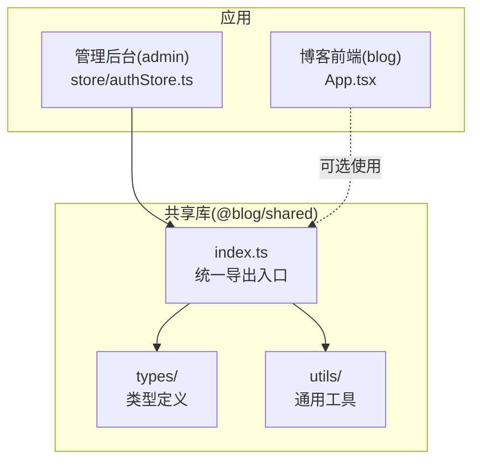
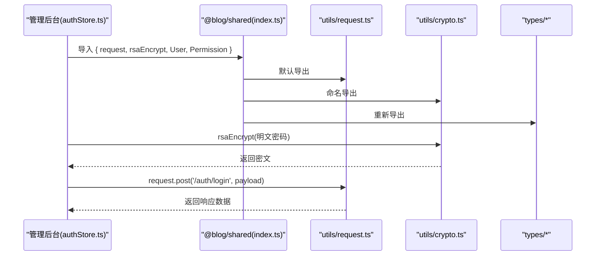
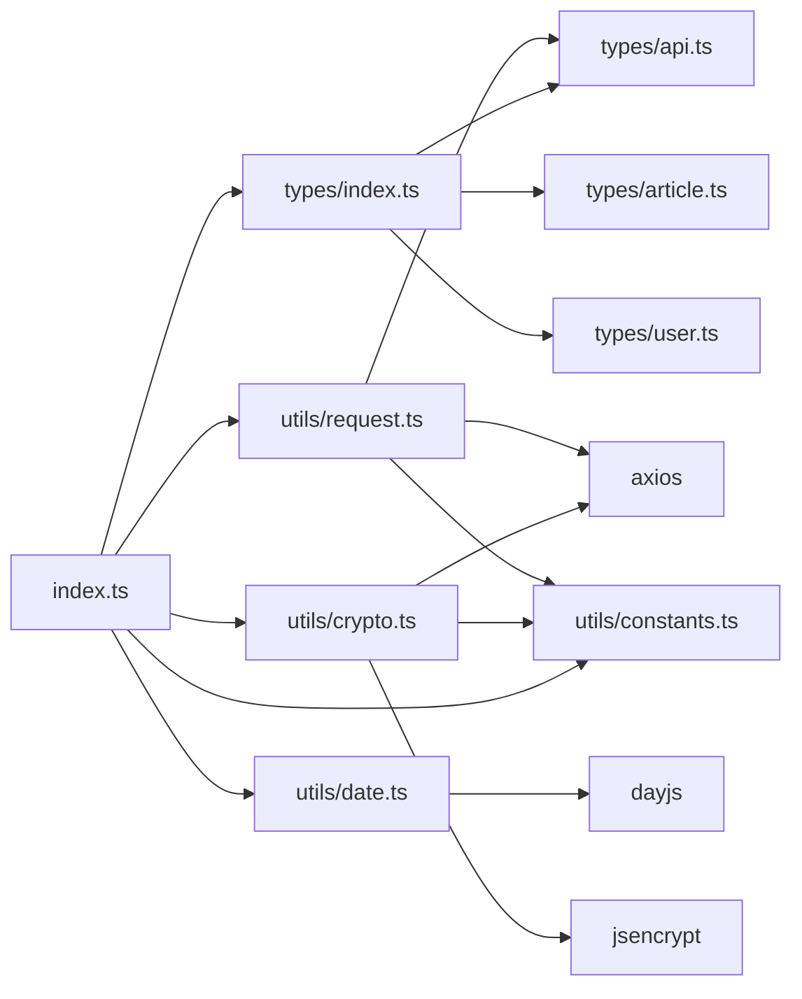

# 模块导出结构

<cite>
**本文档引用的文件**
- [webSource/packages/shared/src/index.ts](file://webSource/packages/shared/src/index.ts)
- [webSource/packages/shared/src/types/index.ts](file://webSource/packages/shared/src/types/index.ts)
- [webSource/packages/shared/src/types/api.ts](file://webSource/packages/shared/src/types/api.ts)
- [webSource/packages/shared/src/types/article.ts](file://webSource/packages/shared/src/types/article.ts)
- [webSource/packages/shared/src/types/user.ts](file://webSource/packages/shared/src/types/user.ts)
- [webSource/packages/shared/src/utils/request.ts](file://webSource/packages/shared/src/utils/request.ts)
- [webSource/packages/shared/src/utils/constants.ts](file://webSource/packages/shared/src/utils/constants.ts)
- [webSource/packages/shared/src/utils/date.ts](file://webSource/packages/shared/src/utils/date.ts)
- [webSource/packages/shared/src/utils/crypto.ts](file://webSource/packages/shared/src/utils/crypto.ts)
- [webSource/packages/shared/package.json](file://webSource/packages/shared/package.json)
- [webSource/packages/shared/tsconfig.json](file://webSource/packages/shared/tsconfig.json)
- [webSource/apps/admin/src/store/authStore.ts](file://webSource/apps/admin/src/store/authStore.ts)
</cite>

## 目录
1. [简介](#简介)
2. [项目结构](#项目结构)
3. [核心组件](#核心组件)
4. [架构总览](#架构总览)
5. [详细组件分析](#详细组件分析)
6. [依赖分析](#依赖分析)
7. [性能考虑](#性能考虑)
8. [故障排除指南](#故障排除指南)
9. [结论](#结论)
10. [附录](#附录)

## 简介
本文件系统性梳理 Xiangmuzs 博客平台中“共享库”模块的导出结构与使用规范，重点围绕以下目标展开：
- 解释 index.ts 作为统一出口的设计理念与模块聚合策略
- 明确各子模块的导出规则：命名导出、默认导出与重新导出的使用原则
- 总结模块导入的最佳实践：按需导入、批量导入与路径别名
- 阐述模块间依赖关系与循环引用的规避策略
- 提供在管理后台与博客前端中的完整使用示例
- 说明版本管理与向后兼容性维护策略
- 给出打包与 Tree Shaking 的优化建议
- 规范扩展新导出模块的命名与文档要求
- 提供调试与故障排除的方法与工具

## 项目结构
共享库位于 webSource/packages/shared，采用“按功能域分层”的组织方式：
- src/index.ts：统一导出入口，聚合 types、utils 与核心请求封装
- src/types：领域模型与 API 响应结构定义
- src/utils：通用工具函数与网络请求封装

图表来源
- [webSource/packages/shared/src/index.ts:1-6](file://webSource/packages/shared/src/index.ts#L1-L6)
- [webSource/packages/shared/src/types/index.ts:1-4](file://webSource/packages/shared/src/types/index.ts#L1-L4)
- [webSource/apps/admin/src/store/authStore.ts:1-56](file://webSource/apps/admin/src/store/authStore.ts#L1-L56)

章节来源
- [webSource/packages/shared/src/index.ts:1-6](file://webSource/packages/shared/src/index.ts#L1-L6)
- [webSource/packages/shared/src/types/index.ts:1-4](file://webSource/packages/shared/src/types/index.ts#L1-L4)
- [webSource/packages/shared/package.json:1-23](file://webSource/packages/shared/package.json#L1-L23)

## 核心组件
- 统一导出入口：通过 index.ts 聚合导出，形成“单一可信源”，便于按需导入与 Tree Shaking
- 类型体系：以 types 子目录聚合 API 响应、文章、用户等模型，支持强类型约束与 IDE 自动补全
- 工具集：包含请求封装、常量、日期格式化、加密等常用能力
- 请求封装：基于 axios 的二次封装，内置拦截器处理鉴权与错误处理

章节来源
- [webSource/packages/shared/src/index.ts:1-6](file://webSource/packages/shared/src/index.ts#L1-L6)
- [webSource/packages/shared/src/utils/request.ts:1-38](file://webSource/packages/shared/src/utils/request.ts#L1-L38)
- [webSource/packages/shared/src/utils/constants.ts:1-37](file://webSource/packages/shared/src/utils/constants.ts#L1-L37)
- [webSource/packages/shared/src/utils/date.ts:1-20](file://webSource/packages/shared/src/utils/date.ts#L1-L20)
- [webSource/packages/shared/src/utils/crypto.ts:1-24](file://webSource/packages/shared/src/utils/crypto.ts#L1-L24)

## 架构总览
下图展示共享库的导出与使用关系，以及在管理后台中的实际调用链。

图表来源
- [webSource/apps/admin/src/store/authStore.ts:1-56](file://webSource/apps/admin/src/store/authStore.ts#L1-L56)
- [webSource/packages/shared/src/index.ts:1-6](file://webSource/packages/shared/src/index.ts#L1-L6)
- [webSource/packages/shared/src/utils/request.ts:1-38](file://webSource/packages/shared/src/utils/request.ts#L1-L38)
- [webSource/packages/shared/src/utils/crypto.ts:1-24](file://webSource/packages/shared/src/utils/crypto.ts#L1-L24)
- [webSource/packages/shared/src/types/index.ts:1-4](file://webSource/packages/shared/src/types/index.ts#L1-L4)

## 详细组件分析

### 统一导出入口（index.ts）设计
- 设计理念
  - 将内部模块结构对使用者透明化，仅暴露稳定接口
  - 支持按需导入与 Tree Shaking，减少打包体积
  - 通过重新导出聚合类型与工具，提升开发体验
- 导出策略
  - 重新导出：将 types 下的多个模块集中导出，便于一次性导入所有类型
  - 命名导出：将默认导出的 request 以命名形式再次导出，满足不同导入习惯
  - 常量与工具：直接重新导出常量与工具模块，保持命名空间清晰

章节来源
- [webSource/packages/shared/src/index.ts:1-6](file://webSource/packages/shared/src/index.ts#L1-L6)
- [webSource/packages/shared/src/types/index.ts:1-4](file://webSource/packages/shared/src/types/index.ts#L1-L4)

### 类型模块（types）
- 结构与职责
  - types/index.ts：聚合导出 API 响应、文章、用户等类型
  - types/api.ts：定义统一响应结构与分页结构
  - types/article.ts：文章、分类、标签、媒体、二维码等实体模型
  - types/user.ts：用户、角色、权限等认证授权相关模型
- 导出规则
  - 使用命名导出暴露接口与类型
  - 对枚举值与字面量类型使用只读断言，确保类型安全

章节来源
- [webSource/packages/shared/src/types/index.ts:1-4](file://webSource/packages/shared/src/types/index.ts#L1-L4)
- [webSource/packages/shared/src/types/api.ts:1-15](file://webSource/packages/shared/src/types/api.ts#L1-L15)
- [webSource/packages/shared/src/types/article.ts:1-74](file://webSource/packages/shared/src/types/article.ts#L1-L74)
- [webSource/packages/shared/src/types/user.ts:1-43](file://webSource/packages/shared/src/types/user.ts#L1-L43)

### 工具模块（utils）
- request.ts：基于 axios 的请求封装，内置鉴权头注入与统一错误处理
- constants.ts：全局常量（如 API 基础地址、状态码、权限模块与动作）
- date.ts：日期格式化与相对时间显示
- crypto.ts：RSA 公钥获取与加密工具

章节来源
- [webSource/packages/shared/src/utils/request.ts:1-38](file://webSource/packages/shared/src/utils/request.ts#L1-L38)
- [webSource/packages/shared/src/utils/constants.ts:1-37](file://webSource/packages/shared/src/utils/constants.ts#L1-L37)
- [webSource/packages/shared/src/utils/date.ts:1-20](file://webSource/packages/shared/src/utils/date.ts#L1-L20)
- [webSource/packages/shared/src/utils/crypto.ts:1-24](file://webSource/packages/shared/src/utils/crypto.ts#L1-L24)

### 导入最佳实践
- 按需导入
  - 从统一入口按需导入所需成员，避免引入未使用代码
  - 示例路径参考：[webSource/packages/shared/src/index.ts:1-6](file://webSource/packages/shared/src/index.ts#L1-L6)
- 批量导入
  - 通过 types/index.ts 一次性导入全部类型，提升开发效率
  - 示例路径参考：[webSource/packages/shared/src/types/index.ts:1-4](file://webSource/packages/shared/src/types/index.ts#L1-L4)
- 路径别名
  - 在应用侧使用路径别名（如 @blog/shared）指向共享库，简化导入语句
  - 示例参考：管理后台中对 @blog/shared 的使用

章节来源
- [webSource/apps/admin/src/store/authStore.ts:1-56](file://webSource/apps/admin/src/store/authStore.ts#L1-L56)

### 模块间依赖与循环引用规避
- 依赖方向
  - utils/request 依赖 utils/constants 与 types/api
  - utils/crypto 依赖 utils/constants 与外部库
  - types/* 之间无相互依赖，仅被上层统一入口重新导出
- 循环引用规避
  - 将公共常量与类型拆分为独立模块，避免双向依赖
  - 将工具函数与业务逻辑解耦，通过明确的输入输出边界降低耦合

章节来源
- [webSource/packages/shared/src/utils/request.ts:1-38](file://webSource/packages/shared/src/utils/request.ts#L1-L38)
- [webSource/packages/shared/src/utils/constants.ts:1-37](file://webSource/packages/shared/src/utils/constants.ts#L1-L37)
- [webSource/packages/shared/src/utils/crypto.ts:1-24](file://webSource/packages/shared/src/utils/crypto.ts#L1-L24)
- [webSource/packages/shared/src/types/api.ts:1-15](file://webSource/packages/shared/src/types/api.ts#L1-L15)

### 使用示例

#### 管理后台（authStore.ts）
- 场景：登录时对密码进行 RSA 加密，随后通过统一请求封装发送登录请求
- 关键点
  - 导入：从 @blog/shared 同时导入 rsaEncrypt 与 request
  - 流程：rsaEncrypt -> request.post -> 处理返回数据
- 示例路径参考：
  - [webSource/apps/admin/src/store/authStore.ts:36-50](file://webSource/apps/admin/src/store/authStore.ts#L36-L50)

章节来源
- [webSource/apps/admin/src/store/authStore.ts:1-56](file://webSource/apps/admin/src/store/authStore.ts#L1-L56)

#### 博客前端（App.tsx）
- 场景：应用启动时挂载路由，可按需引入共享库中的类型或工具（视具体页面需要而定）
- 示例路径参考：
  - [webSource/apps/admin/src/store/authStore.ts:1-56](file://webSource/apps/admin/src/store/authStore.ts#L1-L56)

章节来源
- [webSource/apps/admin/src/store/authStore.ts:1-56](file://webSource/apps/admin/src/store/authStore.ts#L1-L56)

### 版本管理与向后兼容
- 版本策略
  - 采用语义化版本控制，主版本号变更时才引入破坏性改动
  - 通过 package.json 中的版本字段进行标识
- 向后兼容
  - 新增导出时优先采用重新导出，不改变既有导入路径
  - 对于类型变更，尽量使用可选属性或新增字段，避免移除现有字段
- 发布与回滚
  - 通过 CI/CD 进行构建与测试，确保发布前的稳定性
  - 如出现兼容问题，优先提供迁移指南与过渡期方案

章节来源
- [webSource/packages/shared/package.json:1-23](file://webSource/packages/shared/package.json#L1-L23)

### 打包与 Tree Shaking 优化
- 编译配置
  - 模块目标与解析策略：ESNext + bundler，有利于 Tree Shaking
  - 声明文件生成：开启 declaration 与 declarationMap，提升 DX
- 导出策略
  - 优先使用命名导出与默认导出分离，避免命名冲突
  - 通过统一入口重新导出，减少多级路径导入
- 应用侧实践
  - 使用按需导入，避免整包引入
  - 利用路径别名，减少相对路径复杂度

章节来源
- [webSource/packages/shared/tsconfig.json:1-25](file://webSource/packages/shared/tsconfig.json#L1-L25)
- [webSource/packages/shared/src/index.ts:1-6](file://webSource/packages/shared/src/index.ts#L1-L6)

## 依赖分析
- 内部依赖
  - utils/request 依赖 utils/constants 与 types/api
  - utils/crypto 依赖 utils/constants 与外部库
- 外部依赖
  - axios：网络请求
  - dayjs：日期处理
  - jsencrypt：RSA 加密
- 依赖可视化

图表来源
- [webSource/packages/shared/src/utils/request.ts:1-38](file://webSource/packages/shared/src/utils/request.ts#L1-L38)
- [webSource/packages/shared/src/utils/constants.ts:1-37](file://webSource/packages/shared/src/utils/constants.ts#L1-L37)
- [webSource/packages/shared/src/utils/date.ts:1-20](file://webSource/packages/shared/src/utils/date.ts#L1-L20)
- [webSource/packages/shared/src/utils/crypto.ts:1-24](file://webSource/packages/shared/src/utils/crypto.ts#L1-L24)
- [webSource/packages/shared/src/types/index.ts:1-4](file://webSource/packages/shared/src/types/index.ts#L1-L4)
- [webSource/packages/shared/src/types/api.ts:1-15](file://webSource/packages/shared/src/types/api.ts#L1-L15)
- [webSource/packages/shared/src/types/article.ts:1-74](file://webSource/packages/shared/src/types/article.ts#L1-L74)
- [webSource/packages/shared/src/types/user.ts:1-43](file://webSource/packages/shared/src/types/user.ts#L1-L43)
- [webSource/packages/shared/src/index.ts:1-6](file://webSource/packages/shared/src/index.ts#L1-L6)

## 性能考虑
- Tree Shaking
  - 使用 ES 模块语法与命名导出，确保未使用代码被剔除
  - 避免在工具函数中引入重型依赖，必要时延迟加载
- 网络请求
  - 在请求拦截器中统一处理鉴权与错误，减少重复逻辑
  - 对高频调用的接口进行缓存策略设计（如公钥缓存）
- 时间处理
  - 使用轻量级日期库，避免不必要的插件加载

## 故障排除指南
- 登录失败或 401
  - 检查本地存储中的访问令牌是否正确设置
  - 确认请求拦截器已注入 Authorization 头
  - 参考路径：[webSource/packages/shared/src/utils/request.ts:10-16](file://webSource/packages/shared/src/utils/request.ts#L10-L16)
- RSA 加密异常
  - 确认公钥获取接口可用且返回格式正确
  - 检查加密过程中的异常抛出与错误提示
  - 参考路径：[webSource/packages/shared/src/utils/crypto.ts:7-23](file://webSource/packages/shared/src/utils/crypto.ts#L7-L23)
- 类型不匹配
  - 核对 types/api.ts 中的响应结构与实际接口返回是否一致
  - 参考路径：[webSource/packages/shared/src/types/api.ts:1-15](file://webSource/packages/shared/src/types/api.ts#L1-L15)

章节来源
- [webSource/packages/shared/src/utils/request.ts:1-38](file://webSource/packages/shared/src/utils/request.ts#L1-L38)
- [webSource/packages/shared/src/utils/crypto.ts:1-24](file://webSource/packages/shared/src/utils/crypto.ts#L1-L24)
- [webSource/packages/shared/src/types/api.ts:1-15](file://webSource/packages/shared/src/types/api.ts#L1-L15)

## 结论
通过统一的导出入口与清晰的模块划分，@blog/shared 实现了高内聚、低耦合的共享能力复用。配合按需导入与 Tree Shaking，可在保证开发体验的同时显著降低打包体积。未来扩展新模块时，遵循本文档的命名规范与导出策略，将有助于维持长期的可维护性与向后兼容性。

## 附录

### 扩展新导出模块的规范与文档要求
- 命名规范
  - 工具函数：使用动词短语命名，如 fetchXxx、formatXxx
  - 常量：使用全大写与下划线分隔，如 API_BASE_URL
  - 类型：使用名词短语，首字母大写，如 ApiResponse
- 导出策略
  - 优先采用命名导出，必要时提供默认导出
  - 在 types/index.ts 中统一重新导出，保持入口一致性
- 文档要求
  - 为每个导出提供简要说明，描述用途与注意事项
  - 若涉及外部依赖，列出依赖名称与版本范围

### 调试与故障排除方法与工具
- 开发工具
  - TypeScript 编译器：启用严格模式与声明映射，提升类型检查准确性
  - 浏览器开发者工具：监控网络请求与本地存储状态
- 日志与错误
  - 在请求拦截器中记录关键信息，便于定位问题
  - 对加密流程增加异常捕获与错误提示

章节来源
- [webSource/packages/shared/tsconfig.json:1-25](file://webSource/packages/shared/tsconfig.json#L1-L25)
- [webSource/packages/shared/src/utils/request.ts:1-38](file://webSource/packages/shared/src/utils/request.ts#L1-L38)
- [webSource/packages/shared/src/utils/crypto.ts:1-24](file://webSource/packages/shared/src/utils/crypto.ts#L1-L24)