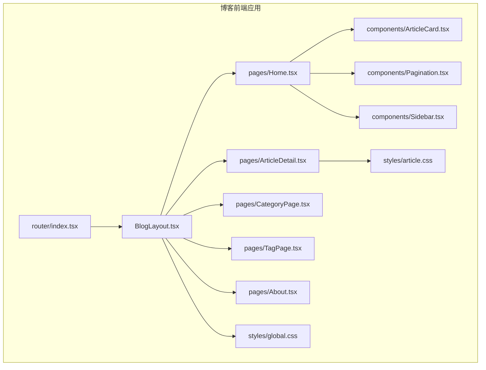
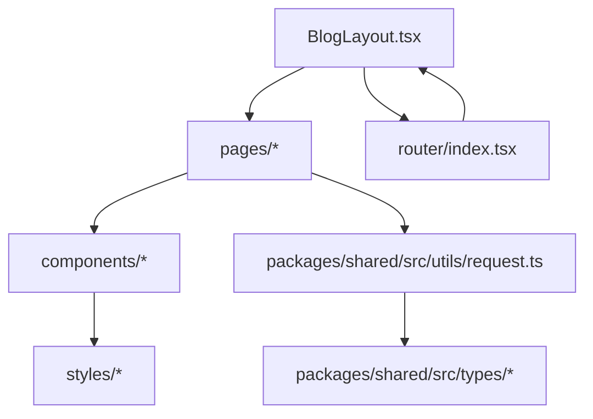
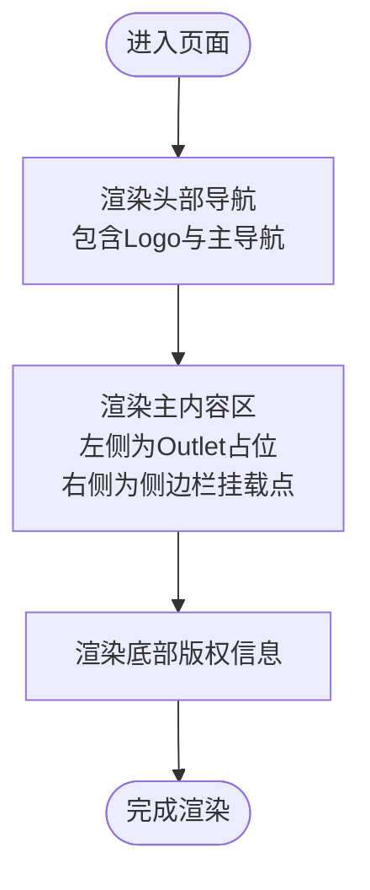
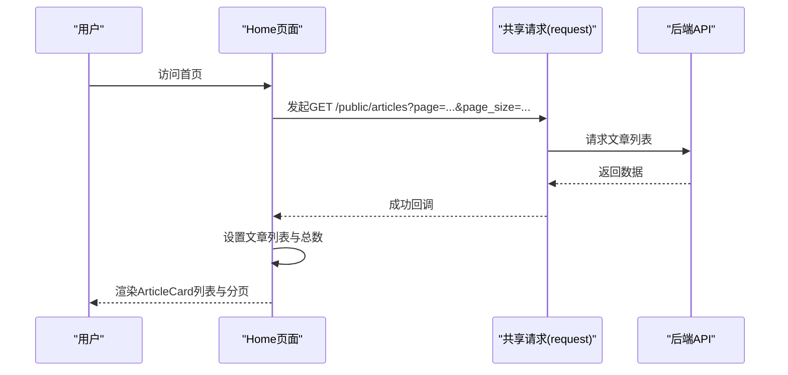
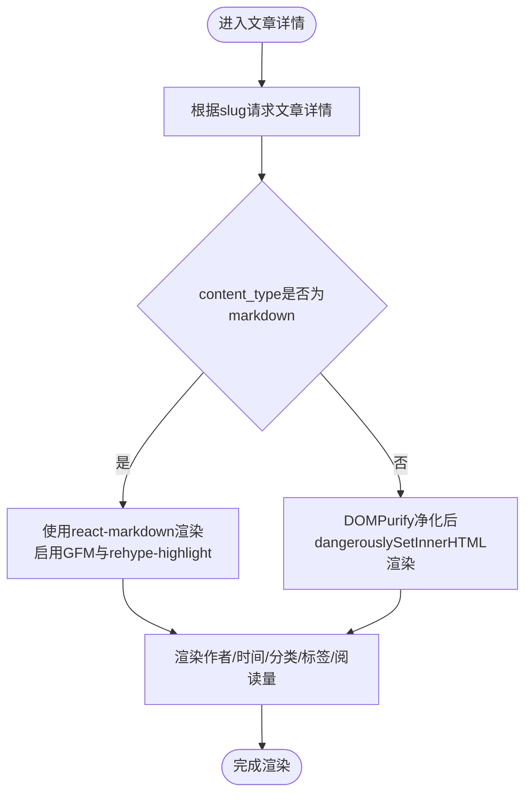
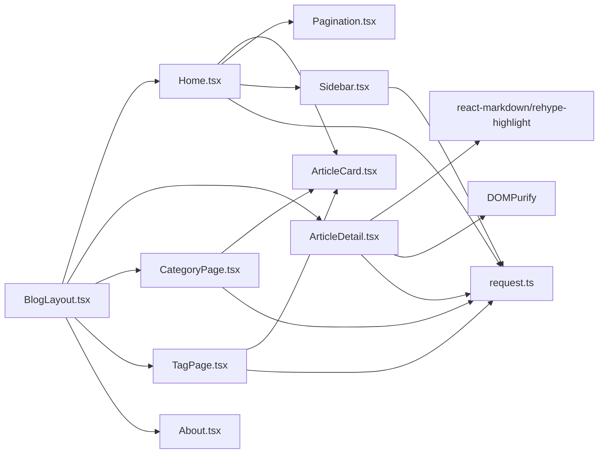

# 博客前端展示

<cite>
**本文引用的文件**
- [BlogLayout.tsx](file://webSource/apps/blog/src/layouts/BlogLayout.tsx)
- [Home.tsx](file://webSource/apps/blog/src/pages/Home.tsx)
- [ArticleDetail.tsx](file://webSource/apps/blog/src/pages/ArticleDetail.tsx)
- [CategoryPage.tsx](file://webSource/apps/blog/src/pages/CategoryPage.tsx)
- [TagPage.tsx](file://webSource/apps/blog/src/pages/TagPage.tsx)
- [About.tsx](file://webSource/apps/blog/src/pages/About.tsx)
- [Sidebar.tsx](file://webSource/apps/blog/src/components/Sidebar.tsx)
- [ArticleCard.tsx](file://webSource/apps/blog/src/components/ArticleCard.tsx)
- [Pagination.tsx](file://webSource/apps/blog/src/components/Pagination.tsx)
- [global.css](file://webSource/apps/blog/src/styles/global.css)
- [article.css](file://webSource/apps/blog/src/styles/article.css)
- [index.tsx](file://webSource/apps/blog/src/router/index.tsx)
- [request.ts](file://webSource/packages/shared/src/utils/request.ts)
- [article.ts](file://webSource/packages/shared/src/types/article.ts)
- [vite.config.ts](file://webSource/apps/blog/vite.config.ts)
</cite>

## 目录
1. [简介](#简介)
2. [项目结构](#项目结构)
3. [核心组件](#核心组件)
4. [架构总览](#架构总览)
5. [详细组件分析](#详细组件分析)
6. [依赖关系分析](#依赖关系分析)
7. [性能考虑](#性能考虑)
8. [故障排查指南](#故障排查指南)
9. [结论](#结论)
10. [附录](#附录)

## 简介
本文件面向Xiangmuzs博客前端展示系统，聚焦于博客前端的设计理念、用户体验目标与实现细节。系统采用React + Vite构建，使用React Router v6进行路由管理，通过共享包统一请求与类型定义，实现清晰的前后端分离与可维护性。整体设计强调：
- 响应式布局与移动端适配：容器宽度限制与弹性布局，确保在桌面与移动设备上的良好阅读体验。
- 无障碍访问：语义化HTML、链接可聚焦、颜色对比度合理，提升可访问性。
- Markdown内容渲染：基于react-markdown与rehype-highlight实现语法高亮与表格等增强；富文本内容通过DOMPurify净化后渲染。
- SEO友好：清晰的URL结构、语义化标题与元信息基础、结构化数据预留空间。
- 性能优化：图片懒加载、分页加载、请求拦截与错误处理、开发代理与生产构建输出。

## 项目结构
前端应用位于webSource/apps/blog，采用按功能模块划分的目录组织：
- layouts：全局布局组件（BlogLayout）
- pages：页面级组件（Home、ArticleDetail、CategoryPage、TagPage、About）
- components：可复用UI组件（ArticleCard、Pagination、Sidebar）
- styles：全局与页面样式（global.css、article.css）
- router：路由配置（index.tsx）
- 共享包webSource/packages/shared：类型定义与工具（request.ts、article.ts等）

**图表来源**
- [BlogLayout.tsx:1-47](file://webSource/apps/blog/src/layouts/BlogLayout.tsx#L1-L47)
- [index.tsx:1-24](file://webSource/apps/blog/src/router/index.tsx#L1-L24)
- [Home.tsx:1-48](file://webSource/apps/blog/src/pages/Home.tsx#L1-L48)
- [ArticleDetail.tsx:1-70](file://webSource/apps/blog/src/pages/ArticleDetail.tsx#L1-L70)
- [CategoryPage.tsx:1-45](file://webSource/apps/blog/src/pages/CategoryPage.tsx#L1-L45)
- [TagPage.tsx:1-38](file://webSource/apps/blog/src/pages/TagPage.tsx#L1-L38)
- [About.tsx:1-11](file://webSource/apps/blog/src/pages/About.tsx#L1-L11)
- [ArticleCard.tsx:1-59](file://webSource/apps/blog/src/components/ArticleCard.tsx#L1-L59)
- [Pagination.tsx:1-50](file://webSource/apps/blog/src/components/Pagination.tsx#L1-L50)
- [Sidebar.tsx:1-81](file://webSource/apps/blog/src/components/Sidebar.tsx#L1-L81)
- [global.css:1-28](file://webSource/apps/blog/src/styles/global.css#L1-L28)
- [article.css:1-93](file://webSource/apps/blog/src/styles/article.css#L1-L93)

**章节来源**
- [BlogLayout.tsx:1-47](file://webSource/apps/blog/src/layouts/BlogLayout.tsx#L1-L47)
- [index.tsx:1-24](file://webSource/apps/blog/src/router/index.tsx#L1-L24)

## 核心组件
- 布局组件BlogLayout：提供统一的头部导航、主内容区与侧边栏挂载点、底部版权信息，支撑所有页面的一致体验。
- 页面组件：首页文章列表、文章详情页、分类页、标签页、关于页，分别承担不同信息层级与交互需求。
- 可复用组件：ArticleCard用于文章卡片展示，Pagination用于分页导航，Sidebar用于侧边栏分类与标签展示。
- 样式系统：global.css提供全局字体、颜色与容器约束；article.css针对Markdown渲染内容进行排版与代码高亮美化。
- 路由系统：基于React Router v6的BrowserRouter，定义根路径与子路由，嵌套BlogLayout以复用布局。
- 请求与类型：共享包中的request封装Axios，统一处理鉴权与错误；类型定义集中于shared/types，保证前后端契约一致。

**章节来源**
- [BlogLayout.tsx:1-47](file://webSource/apps/blog/src/layouts/BlogLayout.tsx#L1-L47)
- [Home.tsx:1-48](file://webSource/apps/blog/src/pages/Home.tsx#L1-L48)
- [ArticleDetail.tsx:1-70](file://webSource/apps/blog/src/pages/ArticleDetail.tsx#L1-L70)
- [CategoryPage.tsx:1-45](file://webSource/apps/blog/src/pages/CategoryPage.tsx#L1-L45)
- [TagPage.tsx:1-38](file://webSource/apps/blog/src/pages/TagPage.tsx#L1-L38)
- [About.tsx:1-11](file://webSource/apps/blog/src/pages/About.tsx#L1-L11)
- [ArticleCard.tsx:1-59](file://webSource/apps/blog/src/components/ArticleCard.tsx#L1-L59)
- [Pagination.tsx:1-50](file://webSource/apps/blog/src/components/Pagination.tsx#L1-L50)
- [Sidebar.tsx:1-81](file://webSource/apps/blog/src/components/Sidebar.tsx#L1-L81)
- [global.css:1-28](file://webSource/apps/blog/src/styles/global.css#L1-L28)
- [article.css:1-93](file://webSource/apps/blog/src/styles/article.css#L1-L93)
- [index.tsx:1-24](file://webSource/apps/blog/src/router/index.tsx#L1-L24)
- [request.ts:1-38](file://webSource/packages/shared/src/utils/request.ts#L1-L38)
- [article.ts:1-74](file://webSource/packages/shared/src/types/article.ts#L1-L74)

## 架构总览
前端采用“布局-页面-组件-样式-路由-请求”的分层架构：
- 布局层：BlogLayout统一承载导航、主内容与侧边栏挂载点。
- 页面层：各页面负责数据获取、状态管理与视图渲染。
- 组件层：可复用UI组件提升一致性与可维护性。
- 样式层：全局样式与页面样式解耦，便于主题扩展。
- 路由层：集中定义路由与嵌套关系，控制页面切换。
- 请求层：共享包封装HTTP请求，统一鉴权与错误处理。

**图表来源**
- [BlogLayout.tsx:1-47](file://webSource/apps/blog/src/layouts/BlogLayout.tsx#L1-L47)
- [index.tsx:1-24](file://webSource/apps/blog/src/router/index.tsx#L1-L24)
- [request.ts:1-38](file://webSource/packages/shared/src/utils/request.ts#L1-L38)
- [article.ts:1-74](file://webSource/packages/shared/src/types/article.ts#L1-L74)

## 详细组件分析

### BlogLayout布局组件
- 头部导航：包含站点名称与主导航链接（首页、分类、标签、关于），使用Sticky定位确保滚动时保持在顶部。
- 主内容区：采用flex布局，左侧为主内容区域，右侧为固定宽度的侧边栏挂载点（#blog-sidebar）。
- 底部版权：简洁的版权信息，统一风格与颜色。
- 响应式策略：容器宽度限制与flex布局在小屏设备上自动换行，保证可读性与可用性。

**图表来源**
- [BlogLayout.tsx:1-47](file://webSource/apps/blog/src/layouts/BlogLayout.tsx#L1-L47)

**章节来源**
- [BlogLayout.tsx:1-47](file://webSource/apps/blog/src/layouts/BlogLayout.tsx#L1-L47)

### 首页文章列表（Home）
- 数据获取：通过共享请求工具调用后端公开接口，支持分页参数page与page_size。
- 渲染逻辑：根据加载状态显示加载提示或空状态；成功后渲染ArticleCard列表。
- 侧边栏挂载：使用React Portal将Sidebar挂载到布局指定的侧边栏容器，避免破坏主内容布局。
- 分页：使用Pagination组件生成页码导航，basePath为根路径。

**图表来源**
- [Home.tsx:1-48](file://webSource/apps/blog/src/pages/Home.tsx#L1-L48)
- [request.ts:1-38](file://webSource/packages/shared/src/utils/request.ts#L1-L38)

**章节来源**
- [Home.tsx:1-48](file://webSource/apps/blog/src/pages/Home.tsx#L1-L48)
- [ArticleCard.tsx:1-59](file://webSource/apps/blog/src/components/ArticleCard.tsx#L1-L59)
- [Pagination.tsx:1-50](file://webSource/apps/blog/src/components/Pagination.tsx#L1-L50)
- [Sidebar.tsx:1-81](file://webSource/apps/blog/src/components/Sidebar.tsx#L1-L81)

### 文章详情页（ArticleDetail）
- 内容渲染：根据content_type选择Markdown渲染或富文本净化渲染；Markdown启用GFM与代码高亮插件。
- 元信息展示：作者、发布时间、分类、阅读量与标签列表。
- 错误处理：当slug缺失或请求失败时，显示相应提示。

**图表来源**
- [ArticleDetail.tsx:1-70](file://webSource/apps/blog/src/pages/ArticleDetail.tsx#L1-L70)
- [article.css:1-93](file://webSource/apps/blog/src/styles/article.css#L1-L93)

**章节来源**
- [ArticleDetail.tsx:1-70](file://webSource/apps/blog/src/pages/ArticleDetail.tsx#L1-L70)
- [article.css:1-93](file://webSource/apps/blog/src/styles/article.css#L1-L93)

### 分类页面（CategoryPage）
- 数据获取：根据路由参数id查询对应分类下的文章列表，并同时获取分类名称用于展示。
- 渲染：展示分类名与ArticleCard列表，分页basePath为当前分类路径。

**章节来源**
- [CategoryPage.tsx:1-45](file://webSource/apps/blog/src/pages/CategoryPage.tsx#L1-L45)

### 标签页面（TagPage）
- 数据获取：根据路由参数slug查询对应标签下的文章列表。
- 渲染：展示标签名与ArticleCard列表，分页basePath为当前标签路径。

**章节来源**
- [TagPage.tsx:1-38](file://webSource/apps/blog/src/pages/TagPage.tsx#L1-L38)

### 关于页面（About）
- 设计：简洁的信息展示页面，采用统一卡片样式与阴影效果，突出内容可读性。

**章节来源**
- [About.tsx:1-11](file://webSource/apps/blog/src/pages/About.tsx#L1-L11)

### Sidebar侧边栏
- 功能：拉取分类与标签列表，展示分类名称与数量、标签云。
- 交互：点击分类/标签跳转至对应页面，保持导航一致性。

**章节来源**
- [Sidebar.tsx:1-81](file://webSource/apps/blog/src/components/Sidebar.tsx#L1-L81)

### ArticleCard文章卡片
- 展示：标题、摘要或截断正文、封面图（懒加载）、分类、发布日期、阅读量与标签。
- 交互：标题链接至文章详情页。

**章节来源**
- [ArticleCard.tsx:1-59](file://webSource/apps/blog/src/components/ArticleCard.tsx#L1-L59)

### Pagination分页组件
- 功能：计算总页数，渲染上一页/页码/下一页导航，支持自定义basePath与每页大小。
- 样式：激活页样式区分，按钮间距与尺寸统一。

**章节来源**
- [Pagination.tsx:1-50](file://webSource/apps/blog/src/components/Pagination.tsx#L1-L50)

### 样式系统
- global.css：重置默认样式、设置基础字体与行高、容器宽度限制、链接颜色与悬停效果。
- article.css：针对Markdown渲染内容的标题、段落、图片、代码块、引用、列表、表格等进行排版与美化，包含代码高亮背景与配色。

**章节来源**
- [global.css:1-28](file://webSource/apps/blog/src/styles/global.css#L1-L28)
- [article.css:1-93](file://webSource/apps/blog/src/styles/article.css#L1-L93)

### 路由系统
- 定义：根路径嵌套BlogLayout，子路由包括首页、文章详情、分类、标签、关于。
- 嵌套：通过Outlet渲染子页面，实现布局复用与页面隔离。

**章节来源**
- [index.tsx:1-24](file://webSource/apps/blog/src/router/index.tsx#L1-L24)

### 请求与类型
- request封装：创建Axios实例，设置超时、请求头携带Token、响应拦截器校验code并处理401。
- 类型定义：Article、Category、Tag、Media、QRCode等接口定义，统一前后端契约。

**章节来源**
- [request.ts:1-38](file://webSource/packages/shared/src/utils/request.ts#L1-L38)
- [article.ts:1-74](file://webSource/packages/shared/src/types/article.ts#L1-L74)

## 依赖关系分析
- 组件耦合：页面组件依赖可复用组件与共享请求；Sidebar与分类/标签接口耦合；ArticleDetail依赖Markdown渲染插件与样式。
- 外部依赖：react-markdown、rehype-highlight、remark-gfm、DOMPurify、Axios等。
- 开发与构建：Vite开发服务器配置代理到后端8080端口，生产构建输出至web/blog目录。

**图表来源**
- [Home.tsx:1-48](file://webSource/apps/blog/src/pages/Home.tsx#L1-L48)
- [ArticleDetail.tsx:1-70](file://webSource/apps/blog/src/pages/ArticleDetail.tsx#L1-L70)
- [CategoryPage.tsx:1-45](file://webSource/apps/blog/src/pages/CategoryPage.tsx#L1-L45)
- [TagPage.tsx:1-38](file://webSource/apps/blog/src/pages/TagPage.tsx#L1-L38)
- [ArticleCard.tsx:1-59](file://webSource/apps/blog/src/components/ArticleCard.tsx#L1-L59)
- [Pagination.tsx:1-50](file://webSource/apps/blog/src/components/Pagination.tsx#L1-L50)
- [Sidebar.tsx:1-81](file://webSource/apps/blog/src/components/Sidebar.tsx#L1-L81)
- [BlogLayout.tsx:1-47](file://webSource/apps/blog/src/layouts/BlogLayout.tsx#L1-L47)
- [request.ts:1-38](file://webSource/packages/shared/src/utils/request.ts#L1-L38)

**章节来源**
- [vite.config.ts:1-24](file://webSource/apps/blog/vite.config.ts#L1-L24)

## 性能考虑
- 图片懒加载：文章卡片中的封面图使用懒加载属性，减少首屏资源压力。
- 分页加载：首页与分类/标签页均采用分页，避免一次性加载大量数据。
- 请求拦截：统一设置超时与鉴权头，减少无效请求与重复登录开销。
- 构建输出：Vite生产构建输出至独立目录，便于CDN与静态部署。
- 代码分割：建议对大型页面或组件进一步拆分，结合React.lazy与Suspense实现按需加载（当前未见实现，属于优化建议）。
- 缓存策略：建议在服务端与CDN层面配置静态资源缓存头，前端可利用浏览器缓存与版本化资源。

**章节来源**
- [ArticleCard.tsx:1-59](file://webSource/apps/blog/src/components/ArticleCard.tsx#L1-L59)
- [Home.tsx:1-48](file://webSource/apps/blog/src/pages/Home.tsx#L1-L48)
- [CategoryPage.tsx:1-45](file://webSource/apps/blog/src/pages/CategoryPage.tsx#L1-L45)
- [TagPage.tsx:1-38](file://webSource/apps/blog/src/pages/TagPage.tsx#L1-L38)
- [request.ts:1-38](file://webSource/packages/shared/src/utils/request.ts#L1-L38)
- [vite.config.ts:1-24](file://webSource/apps/blog/vite.config.ts#L1-L24)

## 故障排查指南
- 文章详情为空或报错：检查slug参数是否正确传递，确认后端接口返回的数据结构；查看错误提示与加载状态。
- 分类/标签页面无数据：确认后端分类/标签接口返回格式，检查页面中对list字段的取值逻辑。
- Markdown渲染异常：确认content_type字段与渲染分支；检查react-markdown与rehype-highlight插件版本兼容性。
- 请求失败或401：检查本地存储的Token是否存在与有效；确认响应拦截器对401的处理逻辑是否触发跳转。
- 侧边栏不显示：确认BlogLayout中侧边栏挂载点id与Portal挂载位置一致。

**章节来源**
- [ArticleDetail.tsx:1-70](file://webSource/apps/blog/src/pages/ArticleDetail.tsx#L1-L70)
- [CategoryPage.tsx:1-45](file://webSource/apps/blog/src/pages/CategoryPage.tsx#L1-L45)
- [TagPage.tsx:1-38](file://webSource/apps/blog/src/pages/TagPage.tsx#L1-L38)
- [Sidebar.tsx:1-81](file://webSource/apps/blog/src/components/Sidebar.tsx#L1-L81)
- [request.ts:1-38](file://webSource/packages/shared/src/utils/request.ts#L1-L38)

## 结论
本前端系统以清晰的分层架构与模块化组件实现了博客展示的核心功能，具备良好的可维护性与扩展性。通过统一的样式体系与路由嵌套，确保了跨页面的一致性体验；借助Markdown渲染与代码高亮，提升了内容呈现质量。建议后续在代码分割、缓存策略与SEO元信息方面进一步完善，以获得更佳的性能与可发现性。

## 附录
- 主题定制与样式扩展：可在global.css中调整基础变量（如字体、颜色、容器宽度），在article.css中扩展Markdown渲染样式；新增组件样式建议遵循现有命名规范与间距体系。
- 无障碍访问建议：为图片提供alt描述、为链接提供明确文案、确保键盘可访问性；在表单与交互元素中提供焦点可见性。
- SEO优化建议：在页面中补充Meta标签（标题、描述、关键词）、结构化数据（Article Schema）、sitemap.xml与robots.txt；保持URL稳定且语义化（当前已具备良好基础）。
- 与后端API集成：通过共享请求工具统一调用，遵循后端接口约定；在开发阶段使用Vite代理转发至后端8080端口，生产环境配置正确的API_BASE_URL。