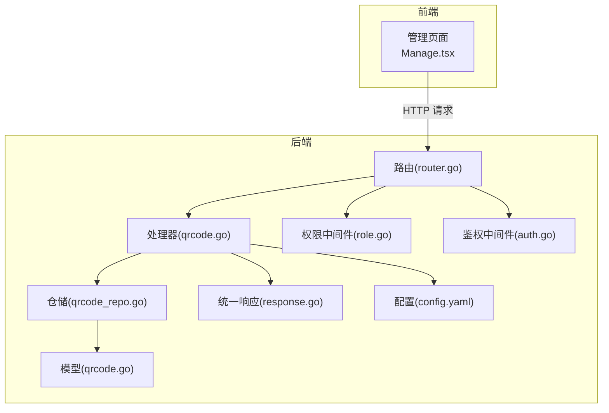
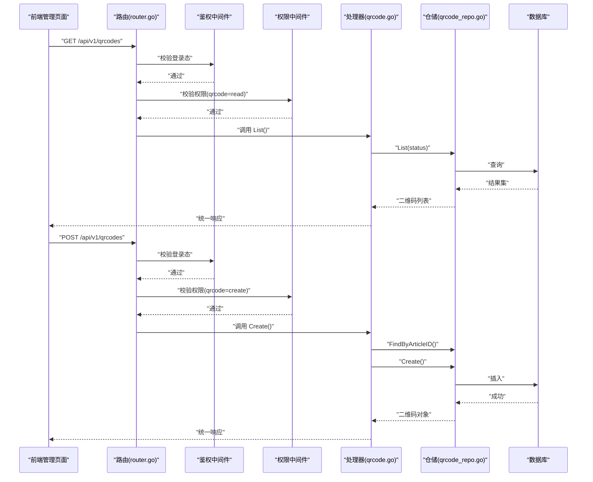
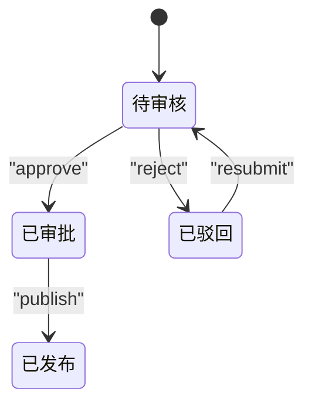
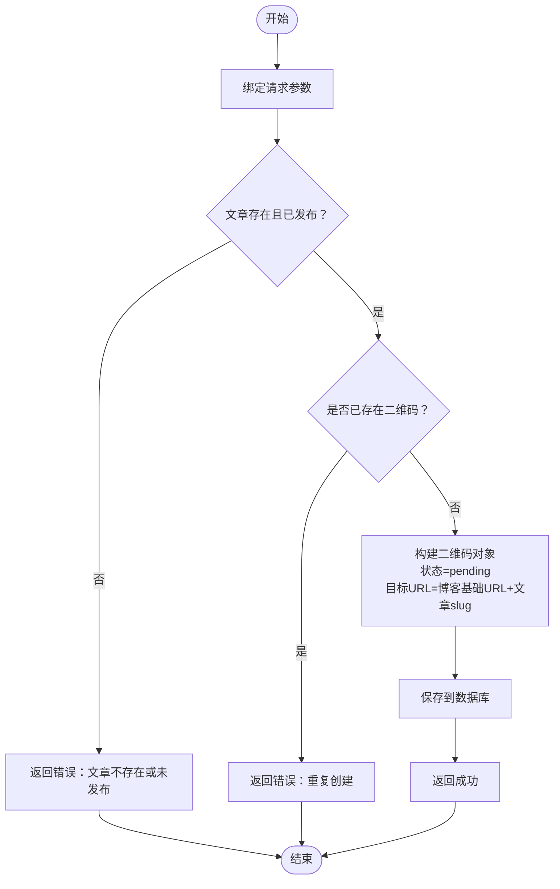
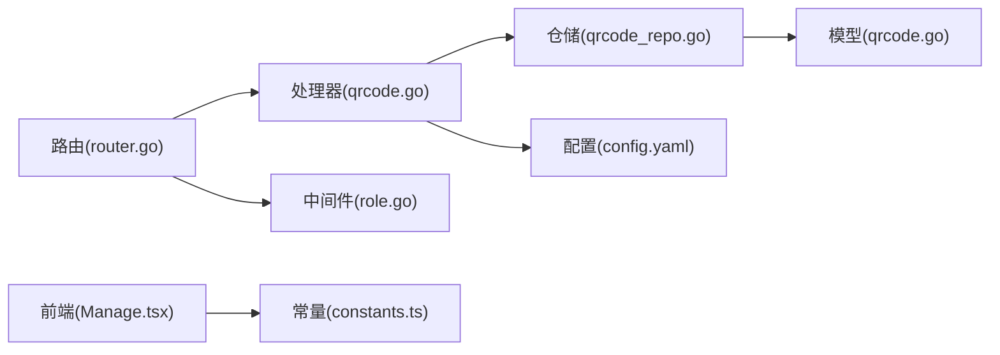
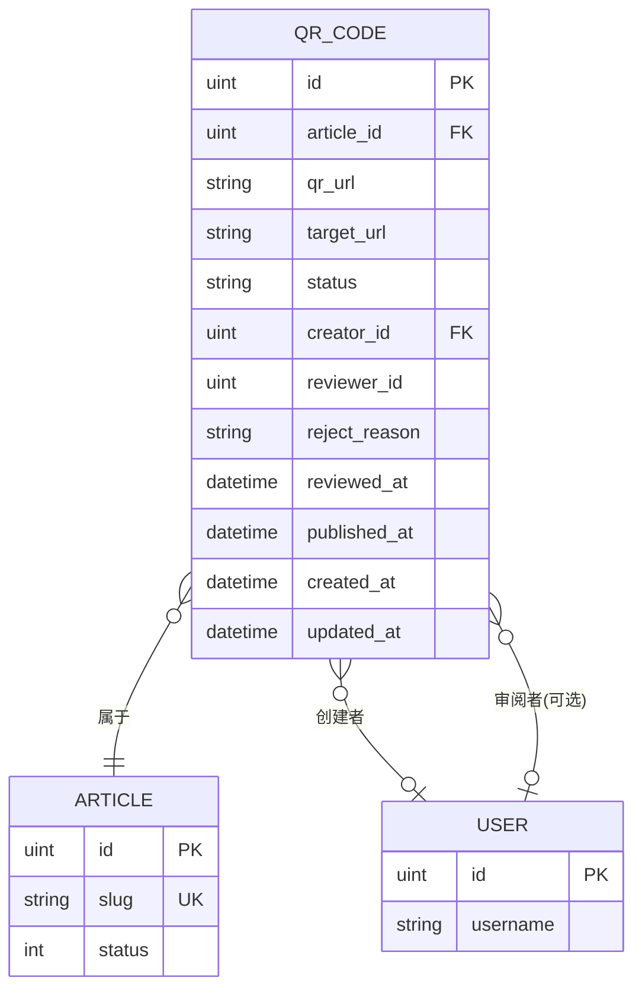
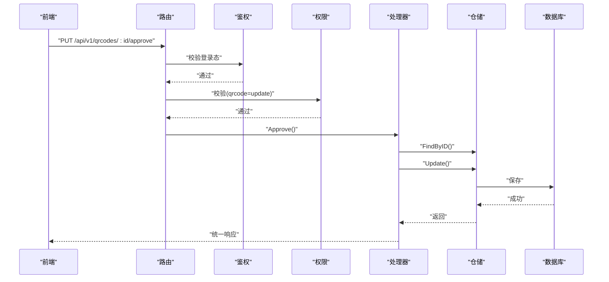
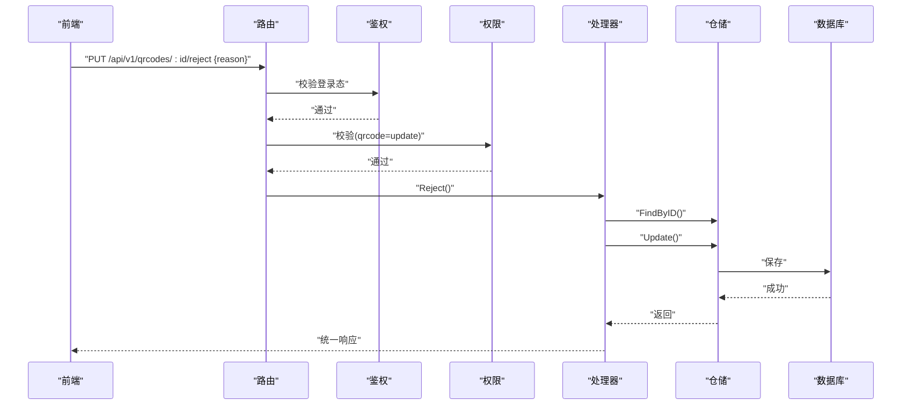

# 二维码管理API

<cite>
**本文引用的文件**
- [server/internal/handler/qrcode.go](file://server/internal/handler/qrcode.go)
- [server/internal/repository/qrcode_repo.go](file://server/internal/repository/qrcode_repo.go)
- [server/internal/model/qrcode.go](file://server/internal/model/qrcode.go)
- [server/router/router.go](file://server/router/router.go)
- [server/internal/middleware/role.go](file://server/internal/middleware/role.go)
- [server/internal/pkg/response.go](file://server/internal/pkg/response.go)
- [server/config/config.yaml](file://server/config/config.yaml)
- [webSource/apps/admin/src/pages/qrcode/Manage.tsx](file://webSource/apps/admin/src/pages/qrcode/Manage.tsx)
- [webSource/packages/shared/src/utils/constants.ts](file://webSource/packages/shared/src/utils/constants.ts)
- [server/internal/model/article.go](file://server/internal/model/article.go)
- [server/internal/model/user.go](file://server/internal/model/user.go)
- [server/main.go](file://server/main.go)
</cite>

## 目录
1. [简介](#简介)
2. [项目结构](#项目结构)
3. [核心组件](#核心组件)
4. [架构总览](#架构总览)
5. [详细组件分析](#详细组件分析)
6. [依赖分析](#依赖分析)
7. [性能考虑](#性能考虑)
8. [故障排查指南](#故障排查指南)
9. [结论](#结论)
10. [附录](#附录)

## 简介
本文件面向Xiangmuzs博客平台的“二维码管理API”，系统性梳理从创建、审核、发布到状态管理的完整流程与接口设计。文档覆盖：
- 二维码状态流转机制：创建(pending) → 审核(approved/rejected) → 发布(published)，以及被驳回后的重新提交(resubmit)。
- 内容验证与安全检查：文章存在性与发布状态校验、重复创建防护、权限控制与中间件拦截。
- 审批流程的权限控制与通知机制：基于角色模块与动作的权限校验，前端展示与交互提示。
- 列表查询、详情获取与批量管理：支持按状态过滤、分页（仓库层具备分页能力但处理器未使用）、预览二维码。
- 二维码生成算法与内容格式规范：目标URL由博客基础地址与文章slug拼接而成，状态字段采用统一枚举。
- 完整状态变更示例与错误处理机制：接口返回统一响应体，错误码与消息标准化。

## 项目结构
后端采用Gin + GORM分层架构，二维码功能位于以下模块：
- 路由层：注册REST接口，绑定鉴权与权限中间件。
- 处理器层：业务编排，参数校验、调用仓储、返回统一响应。
- 仓储层：数据库访问封装，提供创建、更新、查询方法。
- 模型层：数据结构定义，含状态枚举与关联关系。
- 中间件：CORS、鉴权、权限校验。
- 配置：应用配置与博客基础URL设置。

图表来源
- [server/router/router.go:78-84](file://server/router/router.go#L78-L84)
- [server/internal/handler/qrcode.go:17-27](file://server/internal/handler/qrcode.go#L17-L27)
- [server/internal/repository/qrcode_repo.go:8-14](file://server/internal/repository/qrcode_repo.go#L8-L14)
- [server/internal/model/qrcode.go:6-22](file://server/internal/model/qrcode.go#L6-L22)
- [server/internal/middleware/role.go:11-34](file://server/internal/middleware/role.go#L11-L34)
- [server/internal/pkg/response.go:22-69](file://server/internal/pkg/response.go#L22-L69)
- [server/config/config.yaml:27-29](file://server/config/config.yaml#L27-L29)

章节来源
- [server/router/router.go:11-103](file://server/router/router.go#L11-L103)
- [server/internal/handler/qrcode.go:17-27](file://server/internal/handler/qrcode.go#L17-L27)
- [server/internal/repository/qrcode_repo.go:8-14](file://server/internal/repository/qrcode_repo.go#L8-L14)
- [server/internal/model/qrcode.go:6-22](file://server/internal/model/qrcode.go#L6-L22)
- [server/internal/middleware/role.go:11-34](file://server/internal/middleware/role.go#L11-L34)
- [server/internal/pkg/response.go:22-69](file://server/internal/pkg/response.go#L22-L69)
- [server/config/config.yaml:27-29](file://server/config/config.yaml#L27-L29)

## 核心组件
- 路由与权限
  - 二维码相关路由均在认证组内，且部分操作需特定模块+动作权限。
  - 权限中间件通过角色-权限关联表进行校验，未授权直接返回禁止错误。
- 处理器
  - 提供列表、创建、审批、驳回、发布、重新提交等接口。
  - 参数校验、业务前置条件检查、状态机流转、统一响应返回。
- 仓储
  - 封装创建、更新、按ID/文章ID查询、按状态过滤列表等。
- 模型
  - 定义二维码状态枚举与字段约束；与文章、用户建立关联。
- 前端
  - 管理页面支持筛选状态、创建二维码、审批/驳回、发布、重新提交、二维码预览等。

章节来源
- [server/router/router.go:78-84](file://server/router/router.go#L78-L84)
- [server/internal/middleware/role.go:11-34](file://server/internal/middleware/role.go#L11-L34)
- [server/internal/handler/qrcode.go:29-196](file://server/internal/handler/qrcode.go#L29-L196)
- [server/internal/repository/qrcode_repo.go:16-44](file://server/internal/repository/qrcode_repo.go#L16-L44)
- [server/internal/model/qrcode.go:6-22](file://server/internal/model/qrcode.go#L6-L22)
- [webSource/apps/admin/src/pages/qrcode/Manage.tsx:36-109](file://webSource/apps/admin/src/pages/qrcode/Manage.tsx#L36-L109)

## 架构总览
下图展示二维码管理的端到端调用链路与关键节点：

图表来源
- [server/router/router.go:78-84](file://server/router/router.go#L78-L84)
- [server/internal/handler/qrcode.go:29-99](file://server/internal/handler/qrcode.go#L29-L99)
- [server/internal/repository/qrcode_repo.go:16-34](file://server/internal/repository/qrcode_repo.go#L16-L34)

## 详细组件分析

### 接口总览与权限
- GET /api/v1/qrcodes：列出二维码，支持按状态过滤；需要读取权限。
- POST /api/v1/qrcodes：创建二维码；需要创建权限。
- PUT /api/v1/qrcodes/:id/approve：审批通过；需要更新权限。
- PUT /api/v1/qrcodes/:id/reject：驳回并记录原因；需要更新权限。
- PUT /api/v1/qrcodes/:id/publish：发布；需要更新权限。
- PUT /api/v1/qrcodes/:id/resubmit：被驳回后重新提交；无需权限校验。

章节来源
- [server/router/router.go:78-84](file://server/router/router.go#L78-L84)
- [server/internal/middleware/role.go:11-34](file://server/internal/middleware/role.go#L11-L34)

### 状态机与流转
二维码状态枚举与流转规则：
- pending（待审核）：默认状态，创建时设定。
- approved（已审批）：审批通过后进入。
- rejected（已驳回）：审批被驳回，记录原因。
- published（已发布）：审批通过后可发布。

图表来源
- [server/internal/model/qrcode.go:5-12](file://server/internal/model/qrcode.go#L5-L12)
- [webSource/packages/shared/src/utils/constants.ts:13-18](file://webSource/packages/shared/src/utils/constants.ts#L13-L18)

章节来源
- [server/internal/model/qrcode.go:5-22](file://server/internal/model/qrcode.go#L5-L22)
- [webSource/packages/shared/src/utils/constants.ts:13-18](file://webSource/packages/shared/src/utils/constants.ts#L13-L18)

### 创建二维码（Create）
- 输入参数：article_id（必须为已发布的文章）。
- 校验逻辑：
  - 文章存在且状态为已发布。
  - 同一文章仅允许存在一个二维码，避免重复创建。
- 生成策略：
  - 目标URL = 博客基础URL + “/article/” + 文章slug。
  - 默认状态为pending，创建者为当前登录用户。
- 返回：创建成功的二维码对象。

图表来源
- [server/internal/handler/qrcode.go:57-99](file://server/internal/handler/qrcode.go#L57-L99)
- [server/config/config.yaml:27-29](file://server/config/config.yaml#L27-L29)

章节来源
- [server/internal/handler/qrcode.go:57-99](file://server/internal/handler/qrcode.go#L57-L99)
- [server/config/config.yaml:27-29](file://server/config/config.yaml#L27-L29)

### 审批（Approve）
- 仅对状态为pending的二维码有效。
- 更新字段：状态改为approved，记录审阅人ID与时间，清空驳回原因。
- 返回：更新后的二维码对象。

章节来源
- [server/internal/handler/qrcode.go:101-123](file://server/internal/handler/qrcode.go#L101-L123)

### 驳回（Reject）
- 仅对状态为pending的二维码有效。
- 需要传入reason（驳回原因）。
- 更新字段：状态改为rejected，记录审阅人ID与时间，写入驳回原因。
- 返回：更新后的二维码对象。

章节来源
- [server/internal/handler/qrcode.go:125-153](file://server/internal/handler/qrcode.go#L125-L153)

### 发布（Publish）
- 仅对状态为approved的二维码有效。
- 更新字段：状态改为published，记录发布时间。
- 返回：更新后的二维码对象。

章节来源
- [server/internal/handler/qrcode.go:155-174](file://server/internal/handler/qrcode.go#L155-L174)

### 重新提交（Resubmit）
- 仅对状态为rejected的二维码有效。
- 更新字段：状态改为pending，清空审阅人ID/时间与驳回原因。
- 返回：更新后的二维码对象。

章节来源
- [server/internal/handler/qrcode.go:176-196](file://server/internal/handler/qrcode.go#L176-L196)

### 列表查询与详情获取
- 列表查询：
  - 支持按status过滤。
  - 返回时补充文章标题、创建者用户名、审阅者用户名。
- 详情获取：
  - 通过ID查询，预加载文章、创建者、审阅者信息。

章节来源
- [server/internal/handler/qrcode.go:29-55](file://server/internal/handler/qrcode.go#L29-L55)
- [server/internal/repository/qrcode_repo.go:24-44](file://server/internal/repository/qrcode_repo.go#L24-L44)

### 权限控制与通知机制
- 权限控制：
  - 读取列表：qrcode=read。
  - 创建：qrcode=create。
  - 审批/驳回/发布：qrcode=update。
  - 重新提交：无需权限校验。
- 通知机制：
  - 当前代码未实现专门的通知服务；前端根据操作结果给出提示消息。

章节来源
- [server/router/router.go:78-84](file://server/router/router.go#L78-L84)
- [server/internal/middleware/role.go:11-34](file://server/internal/middleware/role.go#L11-L34)
- [webSource/apps/admin/src/pages/qrcode/Manage.tsx:149-180](file://webSource/apps/admin/src/pages/qrcode/Manage.tsx#L149-L180)

### 二维码生成算法与内容格式规范
- 目标URL生成：
  - 基于配置中的博客基础URL与文章slug拼接。
- 内容格式：
  - 二维码内容为纯文本URL，前端使用qrcode.react渲染。
- 状态字段：
  - 使用统一枚举：pending、approved、rejected、published。

章节来源
- [server/internal/handler/qrcode.go:82-84](file://server/internal/handler/qrcode.go#L82-L84)
- [server/config/config.yaml:27-29](file://server/config/config.yaml#L27-L29)
- [webSource/apps/admin/src/pages/qrcode/Manage.tsx:117-124](file://webSource/apps/admin/src/pages/qrcode/Manage.tsx#L117-L124)
- [webSource/packages/shared/src/utils/constants.ts:13-18](file://webSource/packages/shared/src/utils/constants.ts#L13-L18)

### 错误处理与统一响应
- 统一响应体字段：code、message、data。
- 常见错误：
  - 参数错误、资源不存在、状态不允许、无权限、内部错误等。
- 响应工具函数覆盖了常见HTTP状态码映射。

章节来源
- [server/internal/pkg/response.go:9-69](file://server/internal/pkg/response.go#L9-L69)
- [server/internal/handler/qrcode.go:29-99](file://server/internal/handler/qrcode.go#L29-L99)

## 依赖分析
- 处理器依赖仓储与配置；仓储依赖GORM；路由依赖处理器与中间件；前端依赖共享常量与请求封装。

图表来源
- [server/internal/handler/qrcode.go:17-27](file://server/internal/handler/qrcode.go#L17-L27)
- [server/internal/repository/qrcode_repo.go:8-14](file://server/internal/repository/qrcode_repo.go#L8-L14)
- [server/internal/model/qrcode.go:6-22](file://server/internal/model/qrcode.go#L6-L22)
- [server/router/router.go:11-103](file://server/router/router.go#L11-L103)
- [server/internal/middleware/role.go:11-34](file://server/internal/middleware/role.go#L11-L34)
- [webSource/apps/admin/src/pages/qrcode/Manage.tsx:1-266](file://webSource/apps/admin/src/pages/qrcode/Manage.tsx#L1-L266)
- [webSource/packages/shared/src/utils/constants.ts:13-18](file://webSource/packages/shared/src/utils/constants.ts#L13-L18)

章节来源
- [server/internal/handler/qrcode.go:17-27](file://server/internal/handler/qrcode.go#L17-L27)
- [server/internal/repository/qrcode_repo.go:8-14](file://server/internal/repository/qrcode_repo.go#L8-L14)
- [server/internal/model/qrcode.go:6-22](file://server/internal/model/qrcode.go#L6-L22)
- [server/router/router.go:11-103](file://server/router/router.go#L11-L103)
- [server/internal/middleware/role.go:11-34](file://server/internal/middleware/role.go#L11-L34)
- [webSource/apps/admin/src/pages/qrcode/Manage.tsx:1-266](file://webSource/apps/admin/src/pages/qrcode/Manage.tsx#L1-L266)
- [webSource/packages/shared/src/utils/constants.ts:13-18](file://webSource/packages/shared/src/utils/constants.ts#L13-L18)

## 性能考虑
- 查询优化：
  - 列表查询已启用预加载，减少N+1查询风险。
  - 支持按状态过滤，建议在数据库为status字段添加索引以提升过滤性能。
- 并发与锁：
  - 创建时对同一文章的重复创建做了存在性检查，避免并发重复创建。
- 前端渲染：
  - 使用qrcode.react渲染二维码，建议在预览时限制尺寸与缓存，避免频繁重绘。

## 故障排查指南
- 常见问题与定位要点：
  - 创建失败：检查文章是否存在且已发布；确认未重复创建；查看数据库约束与错误日志。
  - 审批/发布失败：确认当前状态是否符合要求；检查权限是否满足。
  - 列表为空：确认status过滤参数是否正确；检查数据库中是否存在对应记录。
  - 权限不足：确认当前用户角色是否拥有相应模块+动作权限。
- 统一响应参考：
  - code=-1表示业务错误；HTTP状态码用于区分客户端错误/服务端错误。

章节来源
- [server/internal/handler/qrcode.go:29-196](file://server/internal/handler/qrcode.go#L29-L196)
- [server/internal/pkg/response.go:43-69](file://server/internal/pkg/response.go#L43-L69)

## 结论
二维码管理API围绕“状态机+权限控制+统一响应”的设计实现了从创建到发布的闭环流程。通过严格的前置校验与状态约束，保证了业务正确性；通过权限中间件确保操作合规；前端提供了直观的管理界面与状态可视化。后续可在通知机制、二维码图片生成与存储、分页查询等方面进一步完善。

## 附录

### 数据模型关系

图表来源
- [server/internal/model/qrcode.go:6-22](file://server/internal/model/qrcode.go#L6-L22)
- [server/internal/model/article.go:5-23](file://server/internal/model/article.go#L5-L23)
- [server/internal/model/user.go:5-16](file://server/internal/model/user.go#L5-L16)

### 关键流程时序示例

#### 审批通过流程

图表来源
- [server/router/router.go:81-82](file://server/router/router.go#L81-L82)
- [server/internal/handler/qrcode.go:101-123](file://server/internal/handler/qrcode.go#L101-L123)
- [server/internal/repository/qrcode_repo.go:20-22](file://server/internal/repository/qrcode_repo.go#L20-L22)

#### 驳回并记录原因

图表来源
- [server/router/router.go:82-82](file://server/router/router.go#L82-L82)
- [server/internal/handler/qrcode.go:125-153](file://server/internal/handler/qrcode.go#L125-L153)
- [server/internal/repository/qrcode_repo.go:20-22](file://server/internal/repository/qrcode_repo.go#L20-L22)