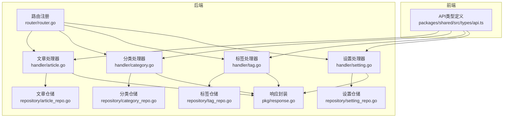
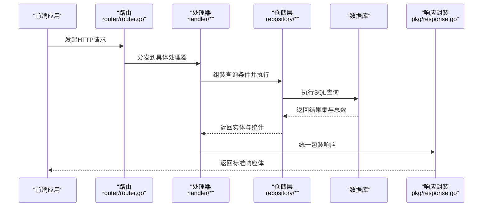
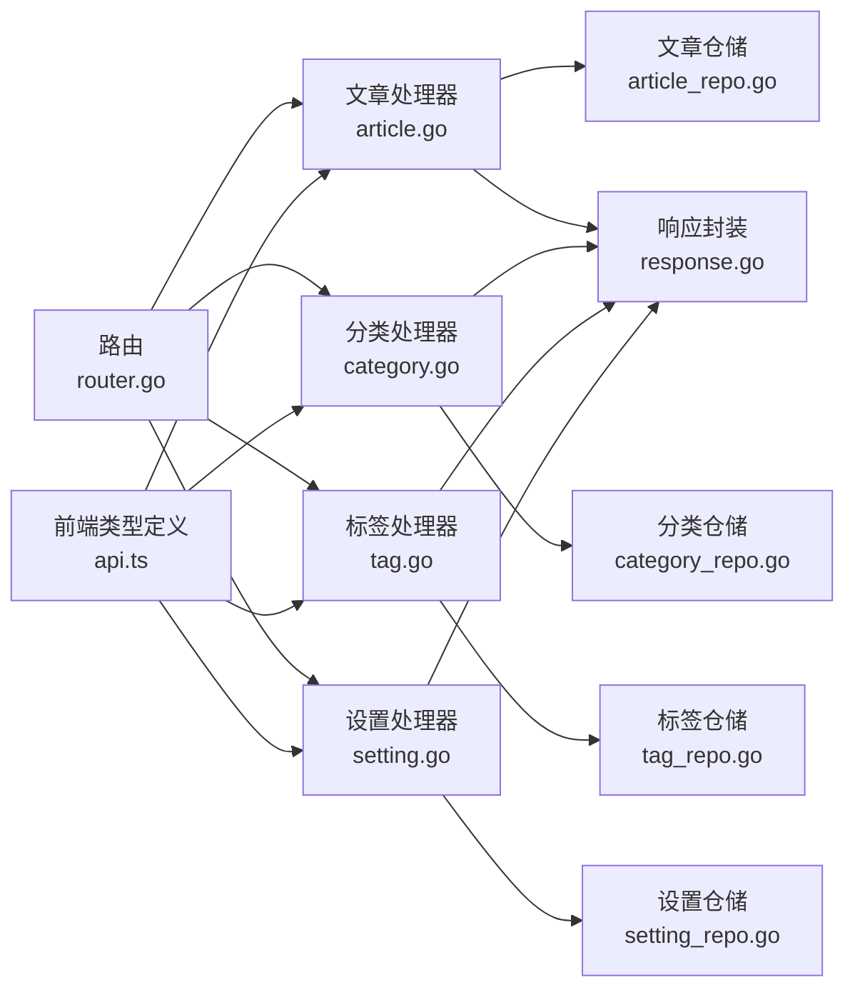

# 公开API

<cite>
**本文引用的文件**
- [router.go](file://server/router/router.go)
- [article.go](file://server/internal/handler/article.go)
- [category.go](file://server/internal/handler/category.go)
- [tag.go](file://server/internal/handler/tag.go)
- [setting.go](file://server/internal/handler/setting.go)
- [common.go](file://server/internal/dto/common.go)
- [article_repo.go](file://server/internal/repository/article_repo.go)
- [category_repo.go](file://server/internal/repository/category_repo.go)
- [tag_repo.go](file://server/internal/repository/tag_repo.go)
- [setting_repo.go](file://server/internal/repository/setting_repo.go)
- [article.go](file://server/internal/model/article.go)
- [category.go](file://server/internal/model/category.go)
- [tag.go](file://server/internal/model/tag.go)
- [response.go](file://server/internal/pkg/response.go)
- [api.ts](file://webSource/packages/shared/src/types/api.ts)
</cite>

## 目录
1. [简介](#简介)
2. [项目结构](#项目结构)
3. [核心组件](#核心组件)
4. [架构总览](#架构总览)
5. [详细组件分析](#详细组件分析)
6. [依赖分析](#依赖分析)
7. [性能考虑](#性能考虑)
8. [故障排查指南](#故障排查指南)
9. [结论](#结论)
10. [附录](#附录)

## 简介
本文件面向Xiangmuzs博客平台的前端开发者与集成方，系统性梳理公开API的设计目标、端点清单、请求参数、响应格式、分页与过滤机制、缓存策略以及性能优化建议。公开API主要服务于博客前端页面渲染与内容展示，包括文章列表、文章搜索、文章详情、分类列表、标签列表等；同时提供公开设置接口以支持主题配置与展示设置。

## 项目结构
后端采用Gin框架与GORM进行路由组织、业务处理、数据访问与响应封装；前端通过统一的API类型定义对接后端返回结构。公开API位于统一的版本前缀之下，并在路由层明确区分“公开”与“认证”两类接口。

图表来源
- [router.go:11-42](file://server/router/router.go#L11-L42)
- [article.go:19-29](file://server/internal/handler/article.go#L19-L29)
- [category.go:15-21](file://server/internal/handler/category.go#L15-L21)
- [tag.go:15-21](file://server/internal/handler/tag.go#L15-L21)
- [setting.go:11-19](file://server/internal/handler/setting.go#L11-L19)
- [article_repo.go:8-14](file://server/internal/repository/article_repo.go#L8-L14)
- [category_repo.go:8-14](file://server/internal/repository/category_repo.go#L8-L14)
- [tag_repo.go:8-14](file://server/internal/repository/tag_repo.go#L8-L14)
- [setting_repo.go:9-15](file://server/internal/repository/setting_repo.go#L9-L15)
- [response.go:9-21](file://server/internal/pkg/response.go#L9-L21)
- [api.ts:1-15](file://webSource/packages/shared/src/types/api.ts#L1-L15)

章节来源
- [router.go:11-42](file://server/router/router.go#L11-L42)

## 核心组件
- 路由与分组：统一在根路径下挂载/api/v1，公开接口置于/api/v1/public及/api/v1（无需鉴权）。
- 处理器：文章、分类、标签、设置处理器分别负责对应资源的增删改查与公开查询逻辑。
- 仓储层：封装数据库操作，提供分页、过滤、预加载关联数据的能力。
- 响应封装：统一的响应体结构，包含状态码、消息与数据体；分页数据包含列表、总数、页码与页大小。

章节来源
- [router.go:24-42](file://server/router/router.go#L24-L42)
- [response.go:9-41](file://server/internal/pkg/response.go#L9-L41)

## 架构总览
公开API的调用链路从Gin路由进入，经由处理器解析参数、调用仓储执行查询，最后通过统一响应封装返回给前端。前端通过共享类型定义对接统一的响应结构。

图表来源
- [router.go:11-42](file://server/router/router.go#L11-L42)
- [article.go:206-257](file://server/internal/handler/article.go#L206-L257)
- [article_repo.go:41-70](file://server/internal/repository/article_repo.go#L41-L70)
- [response.go:30-41](file://server/internal/pkg/response.go#L30-L41)

## 详细组件分析

### 文章公开接口
- 设计目的：为博客前端提供文章列表、按关键词搜索、按别名获取详情等能力，支撑首页、搜索页、详情页等页面渲染。
- 使用场景：首页分页列表、分类筛选、标签筛选、全文搜索、文章详情浏览（含阅读量自增）。
- 关键端点与行为
  - GET /api/v1/public/articles
    - 功能：公开文章列表（仅发布态）
    - 查询参数：page、page_size、keyword、category_id、tag
    - 过滤规则：status=1（已发布），可选category_id与tag进行二次过滤；keyword对标题与摘要进行模糊匹配
    - 排序：按创建时间降序
    - 响应：分页数据，包含文章基础字段、作者名、分类名、标签集合、阅读量与发布时间
  - GET /api/v1/public/articles/search
    - 功能：公开文章搜索
    - 查询参数：keyword（必填）、page、page_size
    - 过滤规则：status=1，keyword对标题与摘要进行模糊匹配
    - 响应：分页数据
  - GET /api/v1/public/articles/:slug
    - 功能：按别名获取公开文章详情
    - 行为：若文章不存在或未发布，返回404；命中则原子性递增阅读量并返回完整详情
    - 响应：单篇文章详情，包含作者名、分类名、标签、阅读量、发布时间等

- 请求参数与约束
  - 分页：page默认1，page_size默认20，最大100
  - 搜索：keyword非空校验（搜索接口）
  - 过滤：category_id为正整数，tag为字符串（slug）

- 响应格式
  - 统一响应体：code、message、data
  - 分页数据：list、total、page、page_size
  - 文章详情：包含id、title、slug、summary、content、content_type、cover_image、author_name、category_id、category_name、tags、view_count、published_at、created_at等

- 缓存策略建议
  - 列表与详情可采用多级缓存：浏览器/CDN缓存（短时效）、服务端内存缓存（热点数据）、数据库索引优化
  - 阅读量自增采用原子更新，避免并发竞争导致的不一致

- 性能优化
  - 数据库索引：文章status+published_at、slug唯一索引、category_id索引
  - 预加载：文章详情与列表均预加载作者、分类、标签，减少N+1查询
  - 分页：限制page_size上限，避免超大页请求

章节来源
- [router.go:33-38](file://server/router/router.go#L33-L38)
- [article.go:206-313](file://server/internal/handler/article.go#L206-L313)
- [article_repo.go:41-74](file://server/internal/repository/article_repo.go#L41-L74)
- [common.go:3-21](file://server/internal/dto/common.go#L3-L21)
- [response.go:9-41](file://server/internal/pkg/response.go#L9-L41)
- [article.go:5-23](file://server/internal/model/article.go#L5-L23)

### 分类公开接口
- 设计目的：为前端侧边栏与分类页提供分类列表，支持分类导航与筛选。
- 使用场景：博客侧边栏展示分类、分类详情页入口。
- 关键端点与行为
  - GET /api/v1/categories
    - 功能：获取所有分类列表
    - 过滤与排序：按sort升序、id升序排列
    - 响应：包含list字段的数组

- 请求参数与约束
  - 无查询参数

- 响应格式
  - 统一响应体，data为包含list的结构

- 性能优化
  - 分类数量通常较小，可结合浏览器缓存与短期CDN缓存

章节来源
- [router.go:41-42](file://server/router/router.go#L41-L42)
- [category.go:23-30](file://server/internal/handler/category.go#L23-L30)
- [category_repo.go:40-44](file://server/internal/repository/category_repo.go#L40-L44)
- [category.go:5-15](file://server/internal/model/category.go#L5-L15)

### 标签公开接口
- 设计目的：为前端侧边栏与标签云提供标签列表，支持标签筛选与聚合。
- 使用场景：博客侧边栏展示标签、标签详情页入口。
- 关键端点与行为
  - GET /api/v1/tags
    - 功能：获取所有标签列表
    - 排序：按id升序
    - 响应：包含list字段的数组

- 请求参数与约束
  - 无查询参数

- 响应格式
  - 统一响应体，data为包含list的结构

- 性能优化
  - 标签数量有限，适合短期缓存

章节来源
- [router.go:41-42](file://server/router/router.go#L41-L42)
- [tag.go:23-30](file://server/internal/handler/tag.go#L23-L30)
- [tag_repo.go:45-49](file://server/internal/repository/tag_repo.go#L45-L49)
- [tag.go:5-12](file://server/internal/model/tag.go#L5-L12)

### 公开设置接口
- 设计目的：为前端提供无需鉴权的站点公开配置，如是否启用验证码、Logo地址、站点名称等，用于主题渲染与展示。
- 使用场景：登录页验证码开关、站点标题、Logo展示。
- 关键端点与行为
  - GET /api/v1/settings/public
    - 功能：获取公开设置
    - 返回字段：captcha_enabled、logo_url、site_name
    - 响应：键值映射

- 请求参数与约束
  - 无查询参数

- 响应格式
  - 统一响应体，data为键值对

- 缓存策略建议
  - 设置项变化频率低，可采用较长缓存时长（如数小时）并提供手动刷新入口

章节来源
- [router.go:24-31](file://server/router/router.go#L24-L31)
- [setting.go:21-29](file://server/internal/handler/setting.go#L21-L29)
- [setting_repo.go:37-44](file://server/internal/repository/setting_repo.go#L37-L44)

### 公共验证与验证码接口
- 公钥获取：GET /api/v1/auth/public-key（用于加密敏感信息）
- 验证码：GET /api/v1/auth/captcha（返回验证码ID与Base64图片，用于登录/注册流程）
- 登录：POST /api/v1/auth/login（需公钥与验证码配合使用）

说明：上述接口属于公开接口范畴，但涉及安全凭证，前端应在受控环境下使用。

章节来源
- [router.go:27-30](file://server/router/router.go#L27-L30)

## 依赖分析
- 路由到处理器：路由层将/api/v1/public与/api/v1下的公开端点绑定至对应处理器。
- 处理器到仓储：处理器负责参数解析与业务编排，仓储负责数据访问与聚合查询。
- 仓储到模型：仓储基于GORM模型进行查询、关联预加载与统计。
- 响应到前端：统一响应封装与前端类型定义保持一致，便于跨端一致性。

图表来源
- [router.go:11-42](file://server/router/router.go#L11-L42)
- [article.go:19-29](file://server/internal/handler/article.go#L19-L29)
- [category.go:15-21](file://server/internal/handler/category.go#L15-L21)
- [tag.go:15-21](file://server/internal/handler/tag.go#L15-L21)
- [setting.go:11-19](file://server/internal/handler/setting.go#L11-L19)
- [article_repo.go:8-14](file://server/internal/repository/article_repo.go#L8-L14)
- [category_repo.go:8-14](file://server/internal/repository/category_repo.go#L8-L14)
- [tag_repo.go:8-14](file://server/internal/repository/tag_repo.go#L8-L14)
- [setting_repo.go:9-15](file://server/internal/repository/setting_repo.go#L9-L15)
- [response.go:9-21](file://server/internal/pkg/response.go#L9-L21)
- [api.ts:1-15](file://webSource/packages/shared/src/types/api.ts#L1-L15)

## 性能考虑
- 分页与查询
  - 限制page_size上限，避免超大页请求导致数据库压力
  - 对高频查询建立必要索引（如文章status+published_at、slug、category_id）
- 预加载与N+1
  - 文章详情与列表均预加载作者、分类、标签，减少额外查询
- 缓存策略
  - 列表与详情：短期缓存（如1-5分钟），热点文章可延长
  - 设置项：较长缓存（如数小时），变更时提供刷新
  - 阅读量：采用原子更新，避免高并发下的竞态
- 前端优化
  - 合理使用骨架屏与占位图，提升感知性能
  - 对搜索输入做防抖，减少无效请求

## 故障排查指南
- 通用错误
  - 参数错误：请求参数不合法或缺失，返回400
  - 资源不存在：请求的资源不存在，返回404
  - 服务器内部错误：服务异常，返回500
- 常见问题定位
  - 文章列表为空：确认status=1且过滤条件正确；检查page/page_size范围
  - 搜索无结果：确认keyword非空且与标题/摘要匹配
  - 文章详情404：确认slug正确且文章状态为已发布
  - 阅读量未增加：确认调用的是公开详情接口且未被缓存覆盖
- 响应结构核对
  - 确认前端使用统一的API类型定义，data中包含list/total/page/page_size或具体对象

章节来源
- [response.go:43-69](file://server/internal/pkg/response.go#L43-L69)
- [api.ts:1-15](file://webSource/packages/shared/src/types/api.ts#L1-L15)

## 结论
Xiangmuzs博客平台的公开API围绕“文章、分类、标签、设置”四大资源构建，重点满足前端页面渲染与内容展示需求。通过统一的路由分组、清晰的查询参数与分页规范、标准化的响应结构以及可扩展的缓存策略，能够有效支撑博客前端的首页、搜索、详情、分类与标签等页面。建议在生产环境中结合索引优化、预加载与多级缓存进一步提升性能与稳定性。

## 附录

### 统一响应结构
- 成功响应：code=0，message="ok"，data为具体数据
- 错误响应：code=-1，message为错误描述，data=null
- 分页响应：data包含list、total、page、page_size

章节来源
- [response.go:9-41](file://server/internal/pkg/response.go#L9-L41)
- [api.ts:1-15](file://webSource/packages/shared/src/types/api.ts#L1-L15)