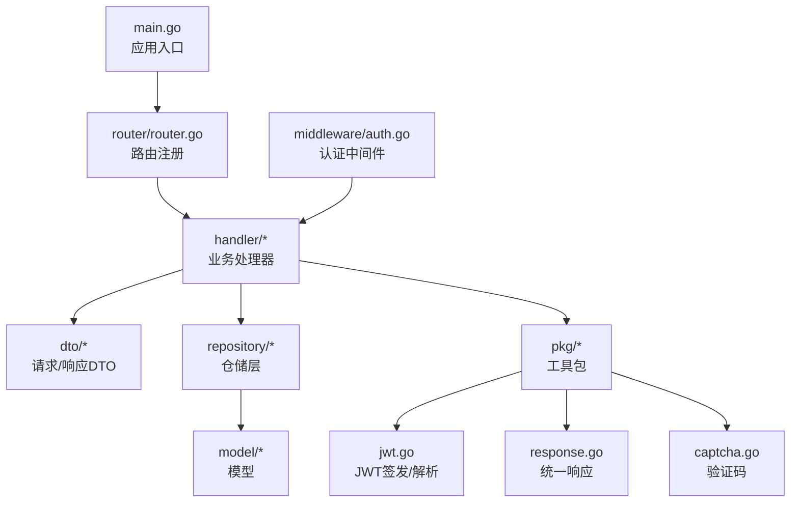
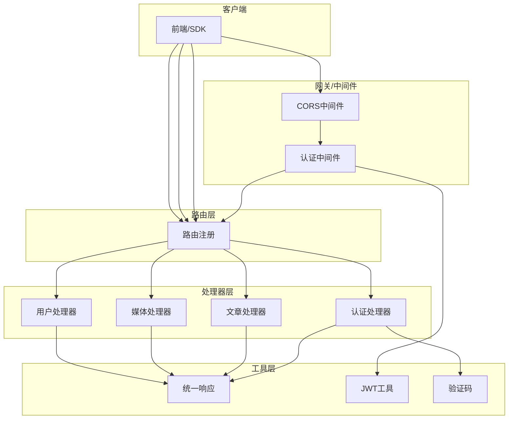
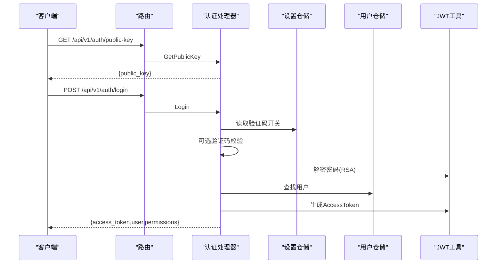
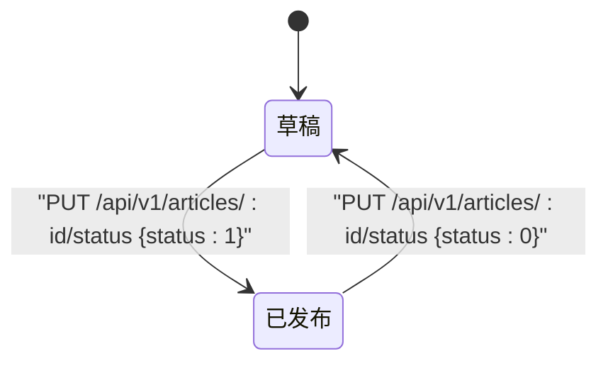
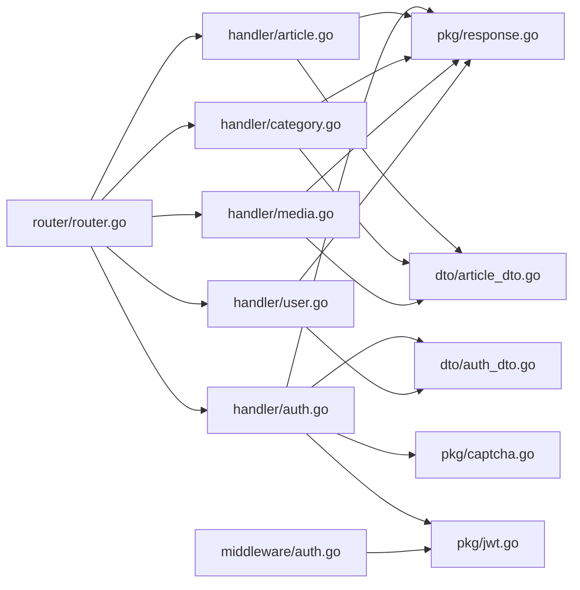

# 后端API文档

<cite>
**本文档引用的文件**
- [server/main.go](file://server/main.go)
- [server/router/router.go](file://server/router/router.go)
- [server/config/config.go](file://server/config/config.go)
- [server/internal/pkg/response.go](file://server/internal/pkg/response.go)
- [server/internal/pkg/jwt.go](file://server/internal/pkg/jwt.go)
- [server/internal/pkg/captcha.go](file://server/internal/pkg/captcha.go)
- [server/internal/middleware/auth.go](file://server/internal/middleware/auth.go)
- [server/internal/handler/auth.go](file://server/internal/handler/auth.go)
- [server/internal/handler/article.go](file://server/internal/handler/article.go)
- [server/internal/handler/category.go](file://server/internal/handler/category.go)
- [server/internal/handler/media.go](file://server/internal/handler/media.go)
- [server/internal/handler/user.go](file://server/internal/handler/user.go)
- [server/internal/dto/common.go](file://server/internal/dto/common.go)
- [server/internal/dto/auth_dto.go](file://server/internal/dto/auth_dto.go)
- [server/internal/dto/article_dto.go](file://server/internal/dto/article_dto.go)
</cite>

## 目录
1. [简介](#简介)
2. [项目结构](#项目结构)
3. [核心组件](#核心组件)
4. [架构总览](#架构总览)
5. [详细组件分析](#详细组件分析)
6. [依赖分析](#依赖分析)
7. [性能考虑](#性能考虑)
8. [故障排除指南](#故障排除指南)
9. [结论](#结论)
10. [附录](#附录)

## 简介
本文件为 Xiangmuzs 博客平台的后端 API 文档，覆盖 RESTful 接口的端点、请求与响应格式、认证机制、权限控制、错误码与最佳实践。系统采用 Go + Gin + GORM 构建，支持文章管理、用户认证、媒体管理、系统设置等核心功能，并提供公开与后台管理两类接口。

## 项目结构
后端服务入口在 main.go 中初始化配置、数据库连接、迁移、RSA 密钥与路由；路由在 router.go 中统一注册；各模块通过 handler 层暴露 API；DTO 定义请求/响应结构；中间件负责认证与权限校验；工具包提供统一响应、JWT、验证码等功能。

图表来源
- [server/main.go:19-76](file://server/main.go#L19-L76)
- [server/router/router.go:11-103](file://server/router/router.go#L11-L103)

章节来源
- [server/main.go:1-77](file://server/main.go#L1-L77)
- [server/router/router.go:1-104](file://server/router/router.go#L1-L104)

## 核心组件
- 路由与分组：统一前缀 /api/v1，公开接口无需认证，后台接口需携带 Bearer Token。
- 认证与权限：基于 JWT 的 Bearer Token，中间件解析并注入用户与角色信息；部分后台接口启用权限校验中间件。
- 统一响应：所有接口返回统一结构，包含 code、message、data；分页接口返回 list、total、page、page_size。
- 验证码：登录可选验证码，服务端生成并校验。
- 文件上传：支持媒体文件上传与存储路径静态映射。

章节来源
- [server/router/router.go:24-102](file://server/router/router.go#L24-L102)
- [server/internal/pkg/response.go:9-70](file://server/internal/pkg/response.go#L9-L70)
- [server/internal/middleware/auth.go:10-37](file://server/internal/middleware/auth.go#L10-L37)
- [server/internal/pkg/jwt.go:16-42](file://server/internal/pkg/jwt.go#L16-L42)
- [server/internal/pkg/captcha.go:24-58](file://server/internal/pkg/captcha.go#L24-L58)

## 架构总览
系统采用分层架构：路由层（Gin）→ 中间件层（认证/权限/CORS）→ 处理器层（业务逻辑）→ 仓储层（数据访问）→ 模型层（数据库映射）。公开接口与后台接口分离，后台接口统一受认证中间件保护。

图表来源
- [server/router/router.go:11-103](file://server/router/router.go#L11-L103)
- [server/internal/middleware/auth.go:10-37](file://server/internal/middleware/auth.go#L10-L37)
- [server/internal/pkg/response.go:22-69](file://server/internal/pkg/response.go#L22-L69)
- [server/internal/pkg/jwt.go:16-42](file://server/internal/pkg/jwt.go#L16-L42)
- [server/internal/pkg/captcha.go:24-58](file://server/internal/pkg/captcha.go#L24-L58)

## 详细组件分析

### 认证与用户管理
- 公开接口
  - GET /api/v1/auth/public-key：获取 RSA 公钥，用于前端加密密码。
  - GET /api/v1/auth/captcha：获取验证码图片与ID。
  - POST /api/v1/auth/login：用户名+密码（可选验证码）登录，返回 AccessToken、用户信息与权限列表。
  - GET /api/v1/settings/public：获取公开系统设置。
- 已认证接口
  - GET /api/v1/auth/profile：获取当前用户资料与权限。
  - PUT /api/v1/auth/password：修改密码（旧密码+新密码）。
- 用户管理（管理员）
  - GET /api/v1/users：分页列出用户。
  - POST /api/v1/users：创建用户（用户名、邮箱、密码、角色ID）。
  - PUT /api/v1/users/:id：更新用户（可改邮箱、角色、状态、密码）。
  - DELETE /api/v1/users/:id：删除用户（不可删除自己）。

请求参数与响应格式
- 登录请求（POST /api/v1/auth/login）
  - 请求体字段：username（必填）、password（必填，RSA加密）、captcha_id（可选）、captcha（可选）
  - 响应体字段：access_token（字符串）、user（对象，含id、username、email、role_id、avatar、status）、permissions（数组/对象）
- 修改密码请求（PUT /api/v1/auth/password）
  - 请求体字段：old_password（必填，RSA加密）、new_password（必填，RSA加密）
  - 响应体：空对象或统一成功结构
- 创建用户请求（POST /api/v1/users）
  - 请求体字段：username（必填）、email（必填且合法）、password（必填，RSA加密）、role_id（必填）

章节来源
- [server/router/router.go:27-29](file://server/router/router.go#L27-L29)
- [server/router/router.go:49-50](file://server/router/router.go#L49-L50)
- [server/router/router.go:94-97](file://server/router/router.go#L94-L97)
- [server/internal/handler/auth.go:31-93](file://server/internal/handler/auth.go#L31-L93)
- [server/internal/handler/auth.go:95-118](file://server/internal/handler/auth.go#L95-L118)
- [server/internal/handler/auth.go:120-162](file://server/internal/handler/auth.go#L120-L162)
- [server/internal/handler/user.go:41-75](file://server/internal/handler/user.go#L41-L75)
- [server/internal/handler/user.go:77-125](file://server/internal/handler/user.go#L77-L125)
- [server/internal/handler/user.go:127-145](file://server/internal/handler/user.go#L127-L145)
- [server/internal/dto/auth_dto.go:3-8](file://server/internal/dto/auth_dto.go#L3-L8)
- [server/internal/dto/auth_dto.go:26-31](file://server/internal/dto/auth_dto.go#L26-L31)

认证流程时序图

图表来源
- [server/router/router.go:27-29](file://server/router/router.go#L27-L29)
- [server/router/router.go:29](file://server/router/router.go#L29)
- [server/internal/handler/auth.go:27-93](file://server/internal/handler/auth.go#L27-L93)
- [server/internal/pkg/jwt.go:16-28](file://server/internal/pkg/jwt.go#L16-L28)

### 文章管理
- 公开接口（无需认证）
  - GET /api/v1/public/articles：分页获取已发布文章列表（支持 keyword、category_id、tag 查询）。
  - GET /api/v1/public/articles/search：关键字搜索已发布文章。
  - GET /api/v1/public/articles/:slug：按 slug 获取已发布文章详情（阅读量自增）。
- 后台接口（需认证）
  - GET /api/v1/articles：分页获取文章（支持 status、category_id、keyword、tag 查询）。
  - GET /api/v1/articles/:id：获取单篇文章。
  - POST /api/v1/articles：创建文章（默认草稿，content_type 默认 markdown）。
  - PUT /api/v1/articles/:id：更新文章。
  - DELETE /api/v1/articles/:id：删除文章。
  - PUT /api/v1/articles/:id/status：更新文章状态（0=草稿，1=已发布），发布时写入发布时间。

请求参数与响应格式
- 创建/更新文章请求（POST/PUT /api/v1/articles）
  - 请求体字段：title（必填）、slug（可选）、summary（可选）、content（必填）、content_type（可选，默认markdown）、cover_image（可选）、category_id（可选）、tag_ids（可选数组）
  - 响应体：文章对象（含作者名、分类名等）
- 更新状态请求（PUT /api/v1/articles/:id/status）
  - 请求体字段：status（必填，0或1）

章节来源
- [server/router/router.go:32-38](file://server/router/router.go#L32-L38)
- [server/router/router.go:56-61](file://server/router/router.go#L56-L61)
- [server/internal/handler/article.go:206-257](file://server/internal/handler/article.go#L206-L257)
- [server/internal/handler/article.go:259-291](file://server/internal/handler/article.go#L259-L291)
- [server/internal/handler/article.go:293-313](file://server/internal/handler/article.go#L293-L313)
- [server/internal/handler/article.go:31-75](file://server/internal/handler/article.go#L31-L75)
- [server/internal/handler/article.go:131-168](file://server/internal/handler/article.go#L131-L168)
- [server/internal/handler/article.go:170-177](file://server/internal/handler/article.go#L170-L177)
- [server/internal/handler/article.go:179-202](file://server/internal/handler/article.go#L179-L202)
- [server/internal/dto/article_dto.go:3-16](file://server/internal/dto/article_dto.go#L3-L16)

文章状态流转图

图表来源
- [server/router/router.go:61](file://server/router/router.go#L61)
- [server/internal/handler/article.go:179-202](file://server/internal/handler/article.go#L179-L202)

### 分类管理
- 接口
  - GET /api/v1/categories：获取全部分类树形列表。
  - POST /api/v1/categories：创建分类（支持父级分类与排序）。
  - PUT /api/v1/categories/:id：更新分类。
  - DELETE /api/v1/categories/:id：删除分类（若存在文章则禁止删除）。

请求参数与响应格式
- 创建/更新分类请求（POST/PUT /api/v1/categories）
  - 请求体字段：name（必填）、slug（必填）、description（可选）、parent_id（可选）、sort（可选）

章节来源
- [server/router/router.go:63-66](file://server/router/router.go#L63-L66)
- [server/internal/handler/category.go:23-30](file://server/internal/handler/category.go#L23-L30)
- [server/internal/handler/category.go:32-52](file://server/internal/handler/category.go#L32-L52)
- [server/internal/handler/category.go:54-76](file://server/internal/handler/category.go#L54-L76)
- [server/internal/handler/category.go:78-89](file://server/internal/handler/category.go#L78-L89)
- [server/internal/dto/article_dto.go:18-24](file://server/internal/dto/article_dto.go#L18-L24)

### 标签管理
- 接口
  - GET /api/v1/tags：获取全部标签列表。
  - POST /api/v1/tags：创建标签。
  - PUT /api/v1/tags/:id：更新标签。
  - DELETE /api/v1/tags/:id：删除标签。

请求参数与响应格式
- 创建/更新标签请求（POST/PUT /api/v1/tags）
  - 请求体字段：name（必填）、slug（必填）

章节来源
- [server/router/router.go:68-71](file://server/router/router.go#L68-L71)
- [server/internal/dto/article_dto.go:26-29](file://server/internal/dto/article_dto.go#L26-L29)

### 媒体管理
- 接口
  - POST /api/v1/media/upload：上传文件（表单字段 file），返回媒体信息（文件名、URL、MIME、大小、上传者）。
  - GET /api/v1/media：分页获取媒体列表。
  - DELETE /api/v1/media/:id：删除媒体。

请求参数与响应格式
- 上传文件请求（POST /api/v1/media/upload）
  - 表单字段：file（必填）
  - 响应体：媒体对象（包含 filename、url、mime_type、size、uploader_id）

章节来源
- [server/router/router.go:74-76](file://server/router/router.go#L74-L76)
- [server/internal/handler/media.go:24-52](file://server/internal/handler/media.go#L24-L52)
- [server/internal/handler/media.go:54-65](file://server/internal/handler/media.go#L54-L65)
- [server/internal/handler/media.go:67-79](file://server/internal/handler/media.go#L67-L79)

### 系统设置
- 公开接口
  - GET /api/v1/settings/public：获取公开系统设置。
- 管理员接口
  - GET /api/v1/settings：获取全部系统设置。
  - PUT /api/v1/settings：更新系统设置。

章节来源
- [server/router/router.go:29](file://server/router/router.go#L29)
- [server/router/router.go:100-101](file://server/router/router.go#L100-L101)

### 仪表盘统计
- 接口
  - GET /api/v1/dashboard/stats：获取仪表盘统计数据（如文章数、分类数、标签数、媒体数等）。

章节来源
- [server/router/router.go:53](file://server/router/router.go#L53)

## 依赖分析
- 路由到处理器：路由层根据 HTTP 方法与路径绑定到对应处理器函数。
- 处理器到仓储：处理器调用仓储层进行数据访问。
- 处理器到工具包：处理器使用统一响应、JWT、验证码等工具。
- 中间件：认证中间件在后台接口前执行，解析 Authorization 头并注入用户与角色信息。

图表来源
- [server/router/router.go:11-23](file://server/router/router.go#L11-L23)
- [server/internal/handler/auth.go:13-25](file://server/internal/handler/auth.go#L13-L25)
- [server/internal/handler/article.go:19-29](file://server/internal/handler/article.go#L19-L29)
- [server/internal/handler/category.go:15-21](file://server/internal/handler/category.go#L15-L21)
- [server/internal/handler/media.go:16-22](file://server/internal/handler/media.go#L16-L22)
- [server/internal/handler/user.go:13-23](file://server/internal/handler/user.go#L13-L23)
- [server/internal/pkg/response.go:9-13](file://server/internal/pkg/response.go#L9-L13)
- [server/internal/pkg/jwt.go:10-14](file://server/internal/pkg/jwt.go#L10-L14)
- [server/internal/pkg/captcha.go:19-22](file://server/internal/pkg/captcha.go#L19-L22)
- [server/internal/middleware/auth.go:10-37](file://server/internal/middleware/auth.go#L10-L37)

## 性能考虑
- 分页查询：统一使用 PageQuery 结构，规范化 page/page_size，避免超大页码与过大每页数量。
- 数据库日志：开发模式开启 GORM 日志，便于调试但生产环境建议关闭。
- 文件上传：限制最大文件大小与允许类型，上传后记录文件元信息以便后续清理。
- 缓存策略：当前未见缓存实现，可在高频读取场景引入缓存（如 Redis）以降低数据库压力。

章节来源
- [server/internal/dto/common.go:3-21](file://server/internal/dto/common.go#L3-L21)
- [server/main.go:36-40](file://server/main.go#L36-L40)
- [server/config/config.go:35-43](file://server/config/config.go#L35-L43)

## 故障排除指南
- 统一响应结构
  - 成功：code=0，message="ok"，data=具体数据或分页数据。
  - 错误：code=-1，message=错误描述，data=null。
  - 常见HTTP状态码：400（参数错误/业务错误）、401（未认证/令牌无效）、403（权限不足）、404（资源不存在）、500（服务器内部错误）。
- 常见问题
  - 未提供认证信息或格式不正确：检查 Authorization 头是否为 Bearer Token。
  - 令牌过期或无效：重新登录获取新令牌。
  - 验证码错误或过期：重新获取验证码并及时提交。
  - 删除分类失败（存在文章）：先移除或转移文章后再删除。
  - 上传文件失败：确认文件大小与类型符合配置要求。
- 调试技巧
  - 开启 debug 模式查看 SQL 日志。
  - 使用 Postman 或 curl 手动构造请求，观察响应结构。
  - 在处理器中打印关键变量（如 userID、roleID）辅助定位权限问题。

章节来源
- [server/internal/pkg/response.go:22-70](file://server/internal/pkg/response.go#L22-L70)
- [server/internal/middleware/auth.go:10-37](file://server/internal/middleware/auth.go#L10-L37)
- [server/internal/pkg/captcha.go:48-58](file://server/internal/pkg/captcha.go#L48-L58)
- [server/internal/handler/category.go:78-89](file://server/internal/handler/category.go#L78-L89)

## 结论
本 API 文档覆盖了 Xiangmuzs 博客平台的核心功能模块与接口规范，提供了认证机制、权限控制、统一响应格式与错误处理策略。开发者可据此快速集成文章、用户、媒体与系统设置相关功能，并遵循分页、安全与性能最佳实践。

## 附录

### 统一响应结构
- 成功响应
  - 字段：code（整数，0表示成功）、message（字符串，通常为"ok"）、data（对象/数组/分页对象）
- 分页响应
  - 字段：list（列表）、total（总数）、page（当前页）、page_size（每页条数）
- 错误响应
  - 字段：code（整数，-1）、message（字符串）、data（null）

章节来源
- [server/internal/pkg/response.go:9-21](file://server/internal/pkg/response.go#L9-L21)
- [server/internal/pkg/response.go:22-70](file://server/internal/pkg/response.go#L22-L70)

### 认证与权限
- 认证方式：Bearer Token（JWT），放置于 Authorization 头。
- 权限控制：中间件加载用户权限，部分接口需要特定权限（如 article:create、user:read 等）。
- 刷新机制：当前未实现刷新令牌接口，建议客户端在过期前主动重新登录获取新令牌。

章节来源
- [server/internal/middleware/auth.go:10-37](file://server/internal/middleware/auth.go#L10-L37)
- [server/internal/pkg/jwt.go:16-42](file://server/internal/pkg/jwt.go#L16-L42)
- [server/router/router.go:58-60](file://server/router/router.go#L58-L60)

### 配置项参考
- server.port：服务监听端口
- server.mode：运行模式（如 debug）
- jwt.secret：JWT签名密钥
- jwt.expire：访问令牌过期间秒数
- upload.path：上传文件本地存储路径
- upload.max_size：上传文件最大字节
- upload.allowed_types：允许的MIME类型列表
- blog.base_url：博客基础URL（用于公开链接）

章节来源
- [server/config/config.go:15-43](file://server/config/config.go#L15-L43)