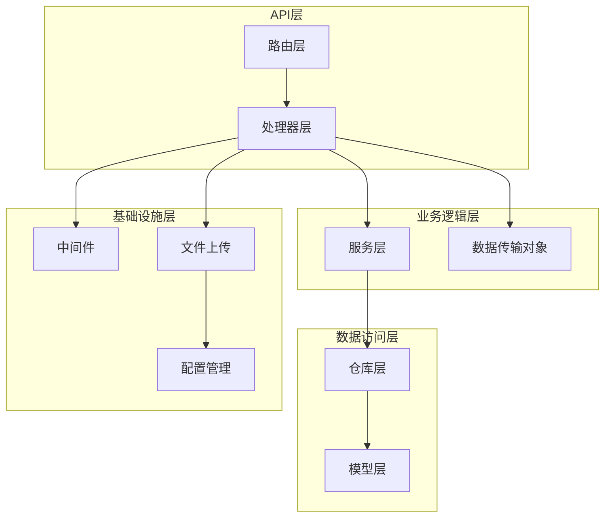
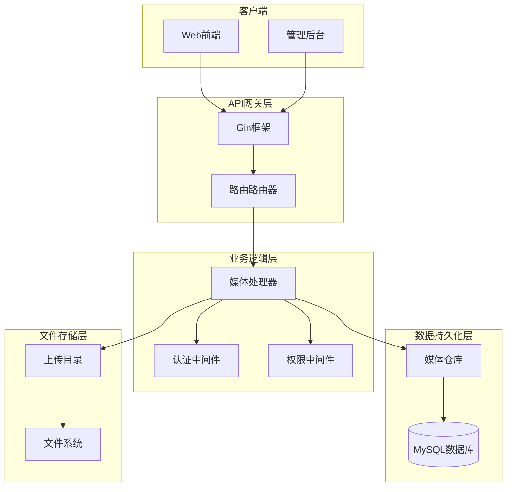
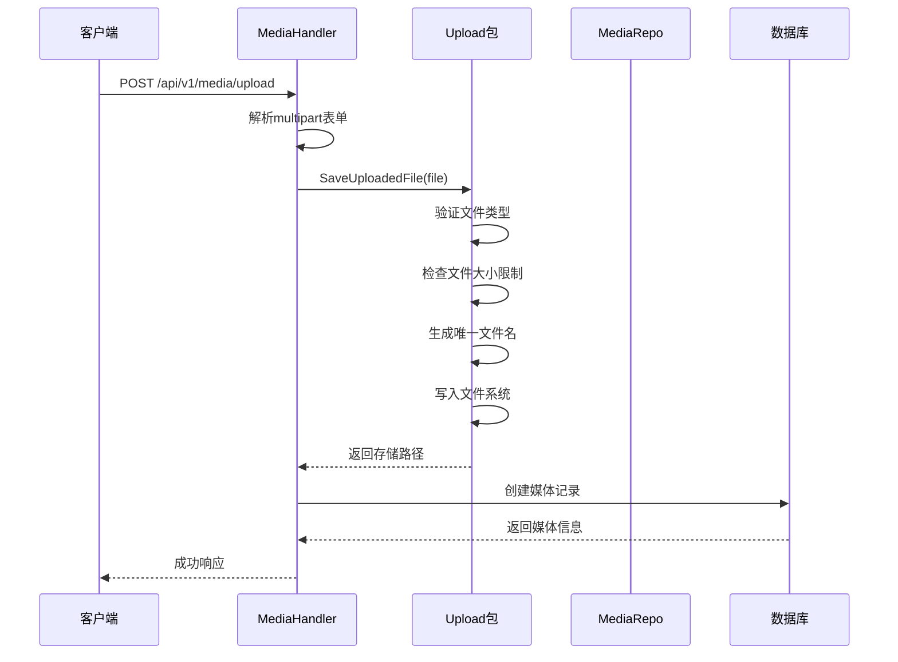
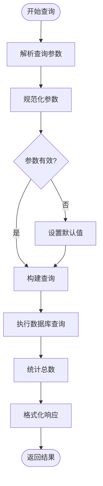
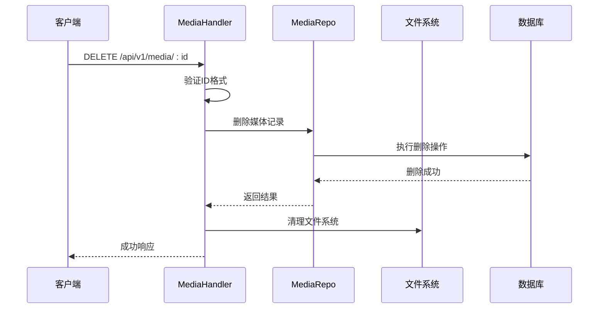
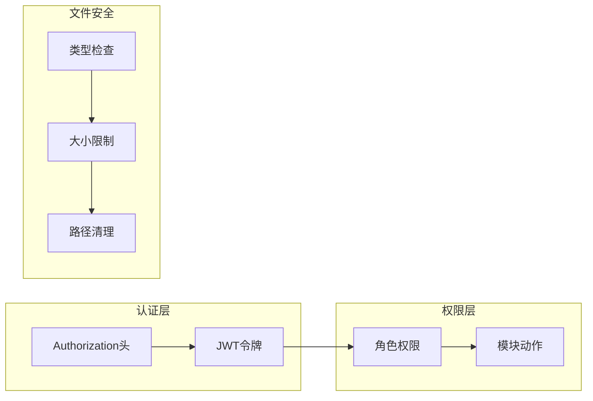
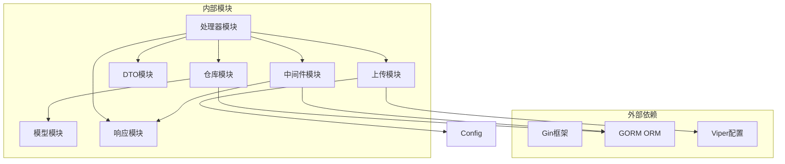

# 媒体管理API

<cite>
**本文档引用的文件**
- [server/internal/handler/media.go](file://server/internal/handler/media.go)
- [server/internal/model/media.go](file://server/internal/model/media.go)
- [server/internal/repository/media_repo.go](file://server/internal/repository/media_repo.go)
- [server/internal/pkg/upload.go](file://server/internal/pkg/upload.go)
- [server/router/router.go](file://server/router/router.go)
- [server/config/config.go](file://server/config/config.go)
- [server/config/config.yaml](file://server/config/config.yaml)
- [server/internal/dto/common.go](file://server/internal/dto/common.go)
- [server/internal/pkg/response.go](file://server/internal/pkg/response.go)
- [server/internal/middleware/auth.go](file://server/internal/middleware/auth.go)
- [server/internal/middleware/role.go](file://server/internal/middleware/role.go)
- [server/migration/migrate.go](file://server/migration/migrate.go)
</cite>

## 目录
1. [简介](#简介)
2. [项目结构](#项目结构)
3. [核心组件](#核心组件)
4. [架构概览](#架构概览)
5. [详细组件分析](#详细组件分析)
6. [依赖关系分析](#依赖关系分析)
7. [性能考虑](#性能考虑)
8. [故障排除指南](#故障排除指南)
9. [结论](#结论)
10. [附录](#附录)

## 简介

Xiangmuzs博客平台的媒体管理API是一个基于Go语言和Gin框架构建的RESTful服务，专门用于处理博客平台的媒体文件管理。该API提供了完整的图片上传、媒体库浏览和文件删除功能，支持多用户权限控制和安全验证机制。

本API采用分层架构设计，包括处理器层、业务逻辑层、数据访问层和中间件层，确保了代码的可维护性和扩展性。系统支持多种图片格式（JPEG、PNG、GIF、WebP），最大文件大小限制为10MB，并提供了完整的错误处理和安全防护机制。

## 项目结构

媒体管理API位于服务器端的内部模块中，采用标准的分层架构组织：



**图表来源**
- [server/router/router.go:11-104](file://server/router/router.go#L11-L104)
- [server/internal/handler/media.go:16-22](file://server/internal/handler/media.go#L16-L22)

**章节来源**
- [server/router/router.go:11-104](file://server/router/router.go#L11-L104)
- [server/internal/handler/media.go:16-22](file://server/internal/handler/media.go#L16-L22)

## 核心组件

媒体管理API由以下核心组件构成：

### 处理器组件
- **MediaHandler**: 主要负责处理媒体相关的HTTP请求
- **权限中间件**: 验证用户权限和执行权限检查
- **认证中间件**: 处理JWT令牌验证和用户身份识别

### 数据访问组件
- **MediaRepo**: 提供媒体数据的CRUD操作
- **Model**: 定义媒体数据结构和数据库映射
- **DTO**: 封装分页查询参数和数据传输格式

### 基础设施组件
- **上传包**: 处理文件上传、验证和存储
- **响应包**: 统一API响应格式
- **配置包**: 管理应用配置和上传设置

**章节来源**
- [server/internal/handler/media.go:16-22](file://server/internal/handler/media.go#L16-L22)
- [server/internal/repository/media_repo.go:8-14](file://server/internal/repository/media_repo.go#L8-L14)
- [server/internal/model/media.go:5-13](file://server/internal/model/media.go#L5-L13)

## 架构概览

媒体管理API采用经典的三层架构模式，实现了清晰的关注点分离：



**图表来源**
- [server/router/router.go:73-76](file://server/router/router.go#L73-L76)
- [server/internal/handler/media.go:24-51](file://server/internal/handler/media.go#L24-L51)

## 详细组件分析

### 上传处理流程

媒体文件上传是API的核心功能，涉及多个处理步骤：



**图表来源**
- [server/internal/handler/media.go:24-51](file://server/internal/handler/media.go#L24-L51)
- [server/internal/pkg/upload.go:15-63](file://server/internal/pkg/upload.go#L15-L63)

#### 文件上传请求格式

API使用multipart/form-data格式接收文件上传：

**请求头**
- Content-Type: multipart/form-data; boundary=----WebKitFormBoundary...

**表单字段**
- file: 必填，二进制文件数据

**支持的文件类型**
- image/jpeg
- image/png  
- image/gif
- image/webp

**文件大小限制**
- 最大: 10MB (10,485,760 字节)

**章节来源**
- [server/internal/handler/media.go:24-51](file://server/internal/handler/media.go#L24-L51)
- [server/internal/pkg/upload.go:15-63](file://server/internal/pkg/upload.go#L15-L63)
- [server/config/config.yaml:18-25](file://server/config/config.yaml#L18-L25)

### 媒体库浏览功能

媒体库浏览功能支持分页查询和文件信息管理：



**图表来源**
- [server/internal/handler/media.go:54-65](file://server/internal/handler/media.go#L54-L65)
- [server/internal/dto/common.go:9-20](file://server/internal/dto/common.go#L9-L20)

#### 分页查询参数

**查询参数**
- page: 页码，默认1，最小1
- page_size: 每页数量，默认20，最大100
- keyword: 搜索关键词

**响应格式**
```json
{
  "code": 0,
  "message": "ok",
  "data": {
    "list": [
      {
        "id": 1,
        "filename": "example.jpg",
        "url": "/uploads/unique-filename.jpg",
        "mime_type": "image/jpeg",
        "size": 1024000,
        "uploader_id": 1,
        "created_at": "2024-01-01T00:00:00Z"
      }
    ],
    "total": 100,
    "page": 1,
    "page_size": 20
  }
}
```

**章节来源**
- [server/internal/handler/media.go:54-65](file://server/internal/handler/media.go#L54-L65)
- [server/internal/dto/common.go:3-7](file://server/internal/dto/common.go#L3-L7)

### 文件删除功能

文件删除操作包含文件系统清理和数据库记录删除：



**图表来源**
- [server/internal/handler/media.go:67-79](file://server/internal/handler/media.go#L67-L79)

#### 删除权限要求

删除操作需要`media.delete`权限：
- 超级管理员: 全部权限
- 编辑: 部分权限（需要具体权限配置）

**章节来源**
- [server/internal/handler/media.go:67-79](file://server/internal/handler/media.go#L67-L79)
- [server/internal/middleware/role.go:11-35](file://server/internal/middleware/role.go#L11-L35)

### 安全验证机制

API实现了多层次的安全验证机制：



**图表来源**
- [server/internal/middleware/auth.go:10-37](file://server/internal/middleware/auth.go#L10-L37)
- [server/internal/middleware/role.go:11-35](file://server/internal/middleware/role.go#L11-L35)
- [server/internal/pkg/upload.go:18-34](file://server/internal/pkg/upload.go#L18-L34)

#### 认证流程

1. **请求拦截**: 中间件检查Authorization头
2. **令牌验证**: 验证JWT令牌的有效性和时效性
3. **用户识别**: 从令牌中提取用户ID和角色ID
4. **权限检查**: 验证用户是否具有相应模块的操作权限

**章节来源**
- [server/internal/middleware/auth.go:10-37](file://server/internal/middleware/auth.go#L10-L37)
- [server/internal/middleware/role.go:11-35](file://server/internal/middleware/role.go#L11-L35)

## 依赖关系分析

媒体管理API的依赖关系体现了清晰的分层架构：



**图表来源**
- [server/internal/handler/media.go:3-14](file://server/internal/handler/media.go#L3-L14)
- [server/internal/repository/media_repo.go:3-6](file://server/internal/repository/media_repo.go#L3-L6)
- [server/internal/pkg/upload.go:3-13](file://server/internal/pkg/upload.go#L3-L13)

### 关键依赖关系

1. **处理器到仓库**: MediaHandler依赖MediaRepo进行数据操作
2. **仓库到模型**: MediaRepo使用GORM操作Media模型
3. **上传到配置**: Upload包读取配置文件中的上传设置
4. **中间件到响应**: 中间件使用统一的响应格式

**章节来源**
- [server/internal/handler/media.go:3-14](file://server/internal/handler/media.go#L3-L14)
- [server/internal/repository/media_repo.go:3-6](file://server/internal/repository/media_repo.go#L3-L6)

## 性能考虑

媒体管理API在设计时充分考虑了性能优化：

### 存储策略
- **文件命名**: 使用UUID生成唯一文件名，避免冲突
- **目录结构**: 采用扁平化存储，减少目录层级
- **缓存机制**: 支持CDN缓存和浏览器缓存

### 查询优化
- **索引设计**: 媒体表按创建时间建立索引
- **分页查询**: 实现高效的分页查询机制
- **批量操作**: 支持批量删除和批量查询

### 安全优化
- **文件类型验证**: 在服务器端严格验证文件类型
- **大小限制**: 防止大文件占用过多带宽
- **路径清理**: 防止路径遍历攻击

## 故障排除指南

### 常见错误及解决方案

**文件上传错误**
- 错误: "请选择文件" - 检查前端是否正确设置multipart/form-data格式
- 错误: "file type is not allowed" - 确认文件类型在允许列表中
- 错误: "file size exceeds limit" - 检查文件大小是否超过10MB限制

**权限错误**
- 错误: "无权限" - 确认用户角色是否具有相应权限
- 错误: "认证已过期或无效" - 检查JWT令牌的有效期和格式

**数据库错误**
- 错误: "获取媒体列表失败" - 检查数据库连接和表结构
- 错误: "保存文件信息失败" - 确认数据库权限和表约束

**章节来源**
- [server/internal/pkg/response.go:43-69](file://server/internal/pkg/response.go#L43-L69)
- [server/internal/handler/media.go:26-48](file://server/internal/handler/media.go#L26-L48)

### 调试建议

1. **启用调试模式**: 在配置文件中设置`mode: debug`
2. **检查日志**: 查看服务器日志获取详细错误信息
3. **验证配置**: 确认上传目录权限和配置文件正确性
4. **测试连接**: 验证数据库连接和网络连通性

## 结论

Xiangmuzs博客平台的媒体管理API是一个功能完整、安全可靠的文件管理系统。通过采用分层架构设计、严格的权限控制和完善的错误处理机制，该API能够满足博客平台对媒体文件管理的各种需求。

系统的主要优势包括：
- **安全性**: 多层次的安全验证和防护机制
- **可扩展性**: 清晰的架构设计便于功能扩展
- **易用性**: 统一的API接口和响应格式
- **可靠性**: 完善的错误处理和异常恢复机制

未来可以考虑的功能增强包括：文件压缩、图像处理、CDN集成、并发上传支持等。

## 附录

### API端点定义

**上传媒体文件**
- 方法: POST
- 路径: `/api/v1/media/upload`
- 权限: `media.create`
- 请求: multipart/form-data
- 响应: 媒体文件信息

**获取媒体列表**
- 方法: GET  
- 路径: `/api/v1/media`
- 权限: 无需登录
- 查询参数: page, page_size, keyword
- 响应: 分页的媒体列表

**删除媒体文件**
- 方法: DELETE
- 路径: `/api/v1/media/:id`
- 权限: `media.delete`
- 参数: 媒体ID
- 响应: 操作结果

### 配置选项

**上传配置**
- path: 上传文件存储路径
- max_size: 最大文件大小（字节）
- allowed_types: 允许的文件类型列表

**安全配置**
- jwt.secret: JWT密钥
- jwt.expire: 访问令牌过期时间
- jwt.refresh_expire: 刷新令牌过期时间

**章节来源**
- [server/router/router.go:73-76](file://server/router/router.go#L73-L76)
- [server/config/config.yaml:18-25](file://server/config/config.yaml#L18-L25)