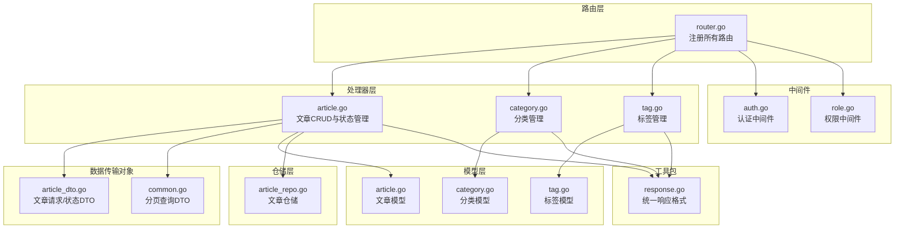
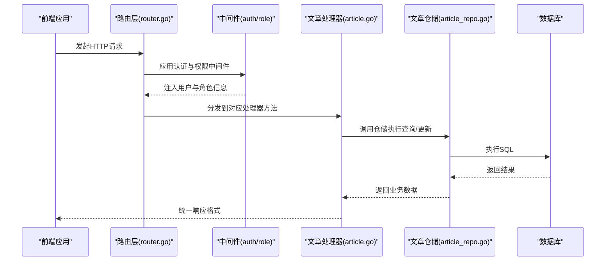
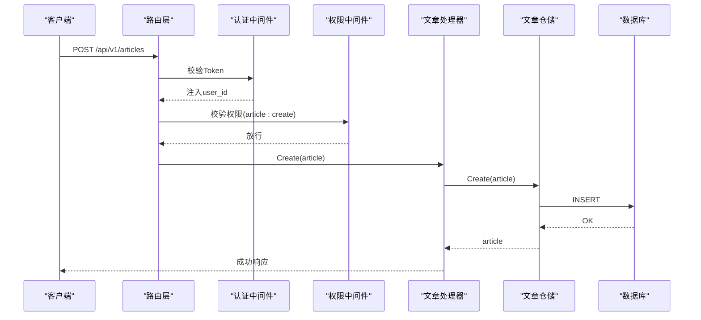
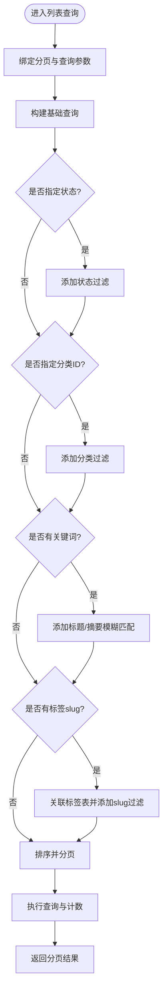
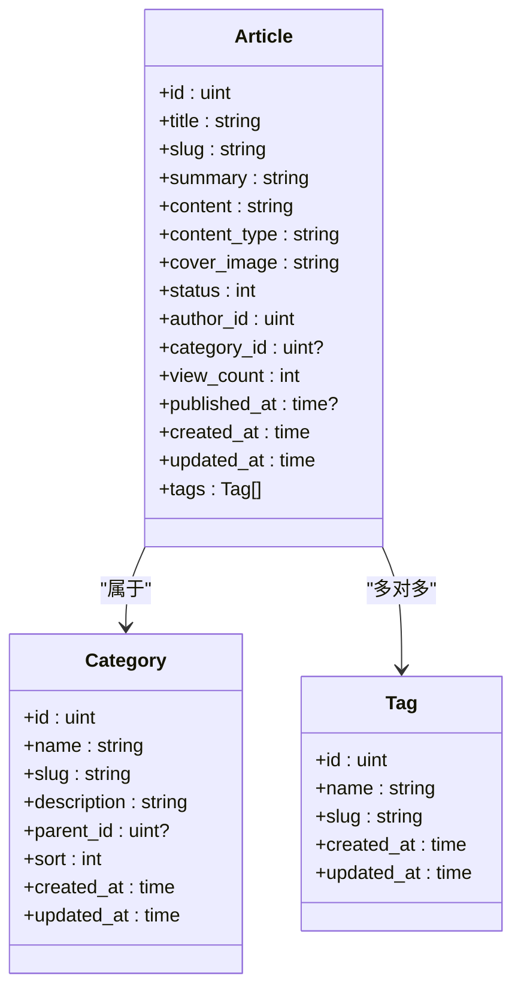
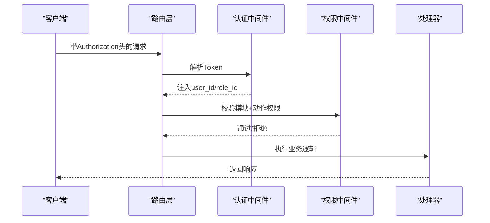
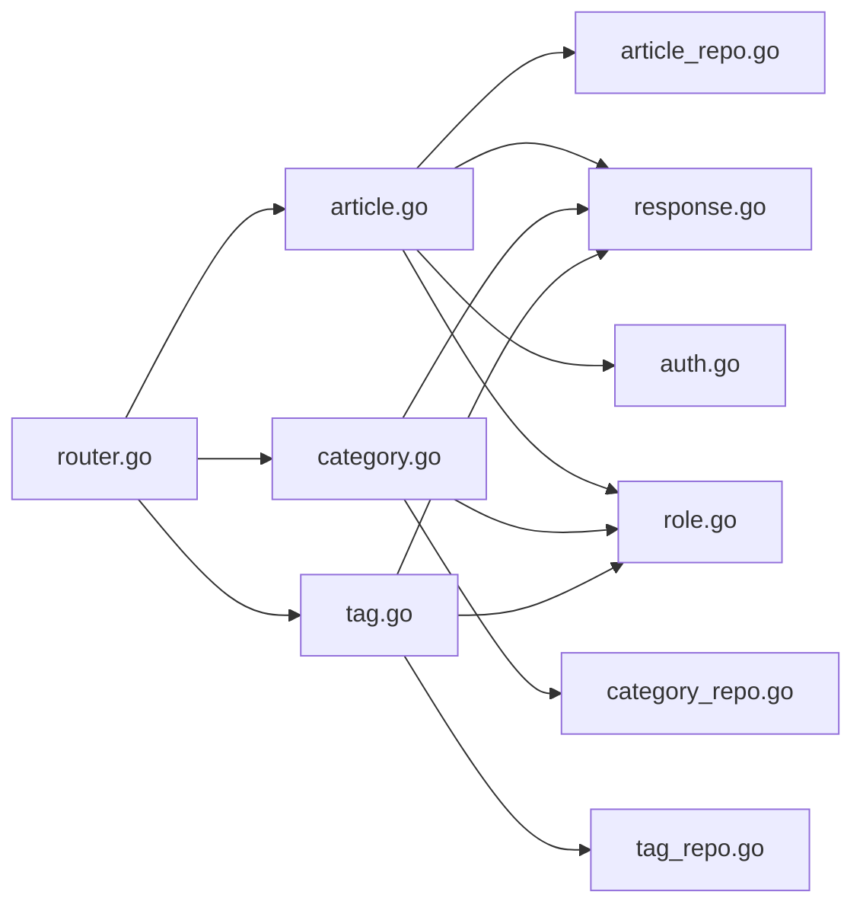

# 文章管理API

<cite>
**本文档引用的文件**
- [server/router/router.go](file://server/router/router.go)
- [server/internal/handler/article.go](file://server/internal/handler/article.go)
- [server/internal/handler/category.go](file://server/internal/handler/category.go)
- [server/internal/handler/tag.go](file://server/internal/handler/tag.go)
- [server/internal/dto/article_dto.go](file://server/internal/dto/article_dto.go)
- [server/internal/dto/common.go](file://server/internal/dto/common.go)
- [server/internal/model/article.go](file://server/internal/model/article.go)
- [server/internal/model/category.go](file://server/internal/model/category.go)
- [server/internal/model/tag.go](file://server/internal/model/tag.go)
- [server/internal/repository/article_repo.go](file://server/internal/repository/article_repo.go)
- [server/internal/pkg/response.go](file://server/internal/pkg/response.go)
- [server/internal/middleware/auth.go](file://server/internal/middleware/auth.go)
- [server/internal/middleware/role.go](file://server/internal/middleware/role.go)
- [server/main.go](file://server/main.go)
- [webSource/packages/shared/src/types/article.ts](file://webSource/packages/shared/src/types/article.ts)
</cite>

## 目录
1. [简介](#简介)
2. [项目结构](#项目结构)
3. [核心组件](#核心组件)
4. [架构总览](#架构总览)
5. [详细组件分析](#详细组件分析)
6. [依赖关系分析](#依赖关系分析)
7. [性能考虑](#性能考虑)
8. [故障排除指南](#故障排除指南)
9. [结论](#结论)
10. [附录](#附录)

## 简介
本文件为 Xiangmuzs 博客平台的文章管理API提供全面的技术文档。内容覆盖文章的CRUD操作（创建、读取、更新、删除）、状态管理（草稿、发布），以及高级查询接口（列表、搜索、按分类和标签筛选）。同时说明分类与标签的管理接口及其与文章的关联关系，权限控制机制，富文本内容处理与Markdown支持，以及统一的请求参数、响应格式与错误处理规范。

## 项目结构
后端采用Go语言与Gin框架实现REST API，按职责分层组织：路由层负责HTTP路由注册；处理器层（Handler）处理业务逻辑；数据传输对象（DTO）定义请求/响应结构；模型（Model）描述数据库实体；仓储层（Repository）封装数据访问；中间件（Middleware）提供认证与权限校验；工具包（pkg）提供统一响应格式与加密工具。

**图表来源**
- [server/router/router.go:11-104](file://server/router/router.go#L11-L104)
- [server/internal/handler/article.go:19-325](file://server/internal/handler/article.go#L19-L325)
- [server/internal/handler/category.go:15-90](file://server/internal/handler/category.go#L15-L90)
- [server/internal/handler/tag.go:15-75](file://server/internal/handler/tag.go#L15-L75)
- [server/internal/dto/article_dto.go:3-44](file://server/internal/dto/article_dto.go#L3-L44)
- [server/internal/dto/common.go:3-21](file://server/internal/dto/common.go#L3-L21)
- [server/internal/model/article.go:5-24](file://server/internal/model/article.go#L5-L24)
- [server/internal/model/category.go:5-15](file://server/internal/model/category.go#L5-L15)
- [server/internal/model/tag.go:5-12](file://server/internal/model/tag.go#L5-L12)
- [server/internal/repository/article_repo.go:8-91](file://server/internal/repository/article_repo.go#L8-L91)
- [server/internal/pkg/response.go:9-70](file://server/internal/pkg/response.go#L9-L70)
- [server/internal/middleware/auth.go:10-38](file://server/internal/middleware/auth.go#L10-L38)
- [server/internal/middleware/role.go:10-43](file://server/internal/middleware/role.go#L10-L43)

**章节来源**
- [server/router/router.go:11-104](file://server/router/router.go#L11-L104)
- [server/main.go:19-77](file://server/main.go#L19-L77)

## 核心组件
- 路由注册：在路由层集中注册公开与受保护的API，包括文章、分类、标签、媒体、角色与用户等模块。
- 处理器：文章处理器提供CRUD与状态管理，分类与标签处理器提供增删改查。
- DTO：定义请求参数结构，如文章创建/更新请求、状态变更请求、分页查询等。
- 模型：定义数据库实体及字段约束，含文章状态、富文本类型、多对多标签关联等。
- 仓储：封装数据库查询与更新，支持分页、过滤、排序与关联预加载。
- 中间件：认证中间件解析Bearer Token并注入用户信息；权限中间件基于模块+动作进行细粒度授权。
- 响应格式：统一返回结构，包含状态码、消息与数据体，支持分页数据包装。

**章节来源**
- [server/internal/handler/article.go:19-325](file://server/internal/handler/article.go#L19-L325)
- [server/internal/handler/category.go:15-90](file://server/internal/handler/category.go#L15-L90)
- [server/internal/handler/tag.go:15-75](file://server/internal/handler/tag.go#L15-L75)
- [server/internal/dto/article_dto.go:3-44](file://server/internal/dto/article_dto.go#L3-L44)
- [server/internal/dto/common.go:3-21](file://server/internal/dto/common.go#L3-L21)
- [server/internal/model/article.go:5-24](file://server/internal/model/article.go#L5-L24)
- [server/internal/repository/article_repo.go:8-91](file://server/internal/repository/article_repo.go#L8-L91)
- [server/internal/pkg/response.go:9-70](file://server/internal/pkg/response.go#L9-L70)
- [server/internal/middleware/auth.go:10-38](file://server/internal/middleware/auth.go#L10-L38)
- [server/internal/middleware/role.go:10-43](file://server/internal/middleware/role.go#L10-L43)

## 架构总览
系统采用分层架构，路由层负责HTTP协议细节，处理器层编排业务流程，仓储层抽象数据访问，中间件提供横切关注点（认证与授权）。前端通过REST API调用后端服务，支持公开与后台管理两种模式。

**图表来源**
- [server/router/router.go:11-104](file://server/router/router.go#L11-L104)
- [server/internal/middleware/auth.go:10-38](file://server/internal/middleware/auth.go#L10-L38)
- [server/internal/middleware/role.go:10-43](file://server/internal/middleware/role.go#L10-L43)
- [server/internal/handler/article.go:31-75](file://server/internal/handler/article.go#L31-L75)
- [server/internal/repository/article_repo.go:41-70](file://server/internal/repository/article_repo.go#L41-L70)

## 详细组件分析

### 文章CRUD与状态管理
- 创建文章
  - 请求路径：POST /api/v1/articles
  - 权限要求：需要具备模块"article"的动作"create"
  - 请求体：标题、摘要、内容、内容类型(markdown/richtext)、封面图、分类ID、标签ID数组等
  - 默认状态：草稿（0）
  - 内容类型：默认markdown，可选richtext
  - 成功响应：返回创建后的文章对象
- 读取文章详情
  - 请求路径：GET /api/v1/articles/:id
  - 权限要求：需要认证
  - 成功响应：返回文章详情（含作者、分类、标签）
- 更新文章
  - 请求路径：PUT /api/v1/articles/:id
  - 权限要求：需要具备模块"article"的动作"update"
  - 请求体：可选字段更新（标题、slug、摘要、内容、内容类型、封面图、分类ID、标签ID数组）
  - 成功响应：返回更新后的文章对象
- 删除文章
  - 请求路径：DELETE /api/v1/articles/:id
  - 权限要求：需要具备模块"article"的动作"delete"
  - 成功响应：空数据
- 更新文章状态
  - 请求路径：PUT /api/v1/articles/:id/status
  - 权限要求：需要具备模块"article"的动作"update"
  - 请求体：status（0=草稿，1=发布）
  - 发布行为：当设置为1且未设置发布时间时，自动写入当前时间

**图表来源**
- [server/router/router.go:58-61](file://server/router/router.go#L58-L61)
- [server/internal/handler/article.go:87-129](file://server/internal/handler/article.go#L87-L129)
- [server/internal/repository/article_repo.go:16-18](file://server/internal/repository/article_repo.go#L16-L18)

**章节来源**
- [server/router/router.go:55-61](file://server/router/router.go#L55-L61)
- [server/internal/handler/article.go:87-202](file://server/internal/handler/article.go#L87-L202)
- [server/internal/dto/article_dto.go:3-16](file://server/internal/dto/article_dto.go#L3-L16)
- [server/internal/model/article.go:11-13](file://server/internal/model/article.go#L11-L13)

### 高级查询接口
- 文章列表
  - 请求路径：GET /api/v1/articles
  - 查询参数：page/page_size(keyword可选)、status、category_id、keyword、tag
  - 过滤条件：按状态、分类、关键词（标题/摘要模糊匹配）、标签slug关联过滤
  - 排序：按创建时间降序
  - 成功响应：分页数据（列表、总数、页码、页大小）
- 公开文章列表
  - 请求路径：GET /api/v1/public/articles
  - 查询参数：page/page_size(keyword可选)、category_id、tag
  - 过滤条件：仅显示已发布文章
  - 成功响应：分页数据（公开视图，包含作者名、分类名、标签列表、浏览量等）
- 按Slug获取公开文章详情
  - 请求路径：GET /api/v1/public/articles/:slug
  - 过滤条件：仅显示已发布文章
  - 访问统计：每次成功读取增加浏览量
  - 成功响应：文章详情（含作者名、分类名、标签列表、浏览量、发布时间等）
- 公开文章搜索
  - 请求路径：GET /api/v1/public/articles/search
  - 查询参数：keyword（必填）、page/page_size
  - 过滤条件：仅显示已发布文章，按标题/摘要模糊匹配
  - 成功响应：分页数据

**图表来源**
- [server/internal/handler/article.go:31-75](file://server/internal/handler/article.go#L31-L75)
- [server/internal/repository/article_repo.go:41-70](file://server/internal/repository/article_repo.go#L41-L70)

**章节来源**
- [server/internal/handler/article.go:31-313](file://server/internal/handler/article.go#L31-L313)
- [server/internal/repository/article_repo.go:41-70](file://server/internal/repository/article_repo.go#L41-L70)
- [server/internal/dto/common.go:3-21](file://server/internal/dto/common.go#L3-L21)

### 分类与标签管理
- 分类管理
  - 列表：GET /api/v1/categories
  - 创建：POST /api/v1/categories（需权限：category:create）
  - 更新：PUT /api/v1/categories/:id（需权限：category:update）
  - 删除：DELETE /api/v1/categories/:id（若存在文章则拒绝删除）
- 标签管理
  - 列表：GET /api/v1/tags
  - 创建：POST /api/v1/tags（需权限：tag:create）
  - 更新：PUT /api/v1/tags/:id（需权限：tag:update）
  - 删除：DELETE /api/v1/tags/:id

**图表来源**
- [server/internal/model/article.go:5-24](file://server/internal/model/article.go#L5-L24)
- [server/internal/model/category.go:5-15](file://server/internal/model/category.go#L5-L15)
- [server/internal/model/tag.go:5-12](file://server/internal/model/tag.go#L5-L12)

**章节来源**
- [server/internal/handler/category.go:23-89](file://server/internal/handler/category.go#L23-L89)
- [server/internal/handler/tag.go:23-74](file://server/internal/handler/tag.go#L23-L74)
- [server/internal/model/article.go:15-18](file://server/internal/model/article.go#L15-L18)
- [server/internal/model/category.go:5-15](file://server/internal/model/category.go#L5-L15)
- [server/internal/model/tag.go:5-12](file://server/internal/model/tag.go#L5-L12)

### 权限控制机制
- 认证中间件：从Authorization头解析Bearer Token，验证有效性并注入user_id与role_id。
- 权限中间件：根据模块（如"article"）与动作（如"create/update/delete/read"）检查当前角色是否拥有相应权限。
- 路由层面：在注册路由时为需要鉴权或权限控制的接口挂载中间件。

**图表来源**
- [server/internal/middleware/auth.go:10-38](file://server/internal/middleware/auth.go#L10-L38)
- [server/internal/middleware/role.go:10-43](file://server/internal/middleware/role.go#L10-L43)
- [server/router/router.go:46-102](file://server/router/router.go#L46-L102)

**章节来源**
- [server/internal/middleware/auth.go:10-38](file://server/internal/middleware/auth.go#L10-L38)
- [server/internal/middleware/role.go:10-43](file://server/internal/middleware/role.go#L10-L43)
- [server/router/router.go:46-102](file://server/router/router.go#L46-L102)

### 富文本内容与Markdown支持
- 内容类型字段：文章模型包含content_type，默认为"markdown"，也可选择"richtext"。
- 前端类型定义：共享类型文件中明确content_type为'markdown' | 'richtext'。
- 处理建议：后端存储原始内容；前端渲染时根据content_type决定Markdown解析或富文本渲染策略。

**章节来源**
- [server/internal/model/article.go:11](file://server/internal/model/article.go#L11)
- [webSource/packages/shared/src/types/article.ts:7](file://webSource/packages/shared/src/types/article.ts#L7)

### 统一响应格式与错误处理
- 成功响应：统一返回结构，包含code(0表示成功)、message、data。
- 分页响应：data为PaginatedData，包含list、total、page、page_size。
- 错误响应：统一返回结构，包含code(-1)、message、data为空。
- 常见HTTP状态：
  - 400：参数错误
  - 401：未提供认证信息/认证格式错误/认证已过期或无效
  - 403：无权限
  - 404：资源不存在
  - 500：内部错误

**章节来源**
- [server/internal/pkg/response.go:9-70](file://server/internal/pkg/response.go#L9-L70)
- [server/internal/handler/article.go:54-56](file://server/internal/handler/article.go#L54-L56)
- [server/internal/handler/article.go:81](file://server/internal/handler/article.go#L81)
- [server/internal/handler/article.go:142](file://server/internal/handler/article.go#L142)
- [server/internal/handler/article.go:173](file://server/internal/handler/article.go#L173)
- [server/internal/handler/article.go:190](file://server/internal/handler/article.go#L190)
- [server/internal/handler/article.go:262-264](file://server/internal/handler/article.go#L262-L264)
- [server/internal/handler/article.go:296](file://server/internal/handler/article.go#L296)
- [server/internal/handler/article.go:308](file://server/internal/handler/article.go#L308)

## 依赖关系分析
- 路由依赖处理器：路由层通过构造函数注入各处理器实例。
- 处理器依赖仓储：处理器调用仓储执行数据操作。
- 仓储依赖GORM：使用GORM进行数据库操作与关联预加载。
- 中间件依赖处理器：权限中间件依赖权限表进行校验。
- 响应格式独立：统一响应工具不依赖业务逻辑，便于复用。

**图表来源**
- [server/router/router.go:11-22](file://server/router/router.go#L11-L22)
- [server/internal/handler/article.go:24-29](file://server/internal/handler/article.go#L24-L29)
- [server/internal/handler/category.go:19-21](file://server/internal/handler/category.go#L19-L21)
- [server/internal/handler/tag.go:19-21](file://server/internal/handler/tag.go#L19-L21)
- [server/internal/repository/article_repo.go:12-14](file://server/internal/repository/article_repo.go#L12-L14)
- [server/internal/pkg/response.go:22-41](file://server/internal/pkg/response.go#L22-L41)
- [server/internal/middleware/auth.go:10-38](file://server/internal/middleware/auth.go#L10-L38)
- [server/internal/middleware/role.go:10-43](file://server/internal/middleware/role.go#L10-L43)

**章节来源**
- [server/router/router.go:11-22](file://server/router/router.go#L11-L22)
- [server/internal/handler/article.go:24-29](file://server/internal/handler/article.go#L24-L29)
- [server/internal/repository/article_repo.go:12-14](file://server/internal/repository/article_repo.go#L12-L14)

## 性能考虑
- 分页与限制：分页参数默认每页20条，最大100条，避免一次性返回过多数据。
- 数据库索引：文章状态与发布时间建立索引，提升查询效率。
- 关联预加载：查询文章时预加载作者、分类与标签，减少N+1查询。
- 视图投影：公开接口仅返回必要字段，降低序列化开销。
- 浏览量更新：使用数据库列更新而非读取-更新，避免并发问题。

**章节来源**
- [server/internal/dto/common.go:9-16](file://server/internal/dto/common.go#L9-L16)
- [server/internal/repository/article_repo.go:26-27](file://server/internal/repository/article_repo.go#L26-L27)
- [server/internal/repository/article_repo.go:32-34](file://server/internal/repository/article_repo.go#L32-L34)
- [server/internal/repository/article_repo.go:72-74](file://server/internal/repository/article_repo.go#L72-L74)
- [server/internal/model/article.go:20](file://server/internal/model/article.go#L20)

## 故障排除指南
- 参数错误
  - 现象：返回400，提示参数错误
  - 排查：确认请求体字段与DTO定义一致，特别是必填字段
- 资源不存在
  - 现象：返回404，提示资源不存在
  - 排查：确认ID是否存在，公开接口仅返回已发布文章
- 权限不足
  - 现象：返回403，提示无权限
  - 排查：确认当前用户角色是否具备相应模块+动作权限
- 认证失败
  - 现象：返回401，提示未提供认证信息/认证格式错误/认证已过期或无效
  - 排查：确认Authorization头格式为Bearer Token，Token有效且未过期
- 内部错误
  - 现象：返回500，提示内部错误
  - 排查：查看服务器日志，定位具体异常位置

**章节来源**
- [server/internal/pkg/response.go:51-69](file://server/internal/pkg/response.go#L51-L69)
- [server/internal/handler/article.go:81](file://server/internal/handler/article.go#L81)
- [server/internal/handler/article.go:142](file://server/internal/handler/article.go#L142)
- [server/internal/handler/article.go:173](file://server/internal/handler/article.go#L173)
- [server/internal/handler/article.go:190](file://server/internal/handler/article.go#L190)
- [server/internal/handler/article.go:262-264](file://server/internal/handler/article.go#L262-L264)
- [server/internal/handler/article.go:296](file://server/internal/handler/article.go#L296)
- [server/internal/handler/article.go:308](file://server/internal/handler/article.go#L308)

## 结论
本文档系统性地梳理了Xiangmuzs博客平台文章管理API的设计与实现，覆盖CRUD、状态管理、高级查询、分类标签关联、权限控制与统一响应格式。通过清晰的分层架构与中间件机制，确保了系统的可维护性与安全性。前端可根据共享类型定义对接API，实现富文本与Markdown内容的灵活展示。

## 附录
- 状态码说明
  - 0：成功
  - -1：失败
- HTTP状态码映射
  - 200：成功
  - 400：参数错误
  - 401：未认证/认证失败
  - 403：无权限
  - 404：资源不存在
  - 500：内部错误