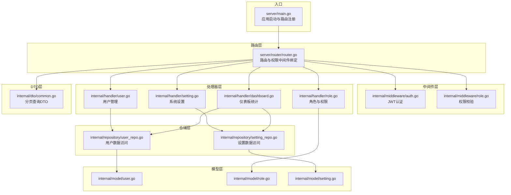
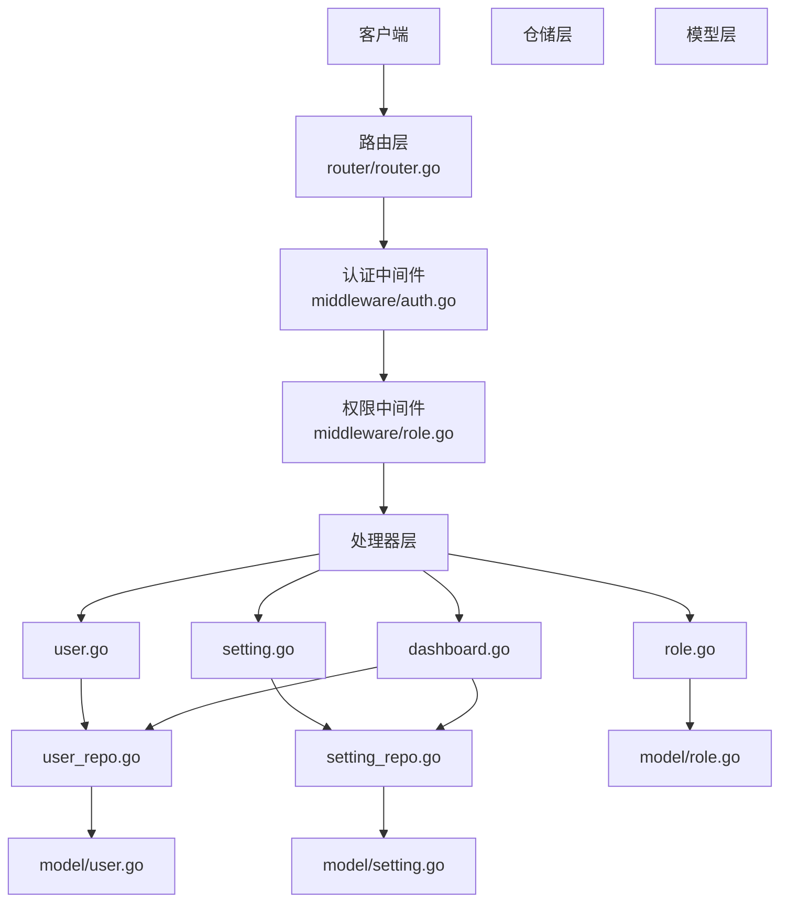
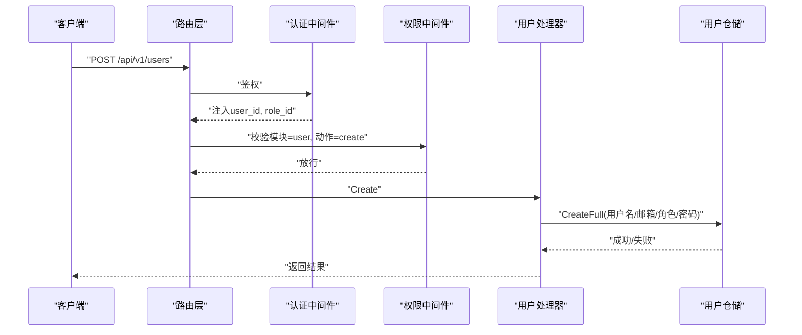
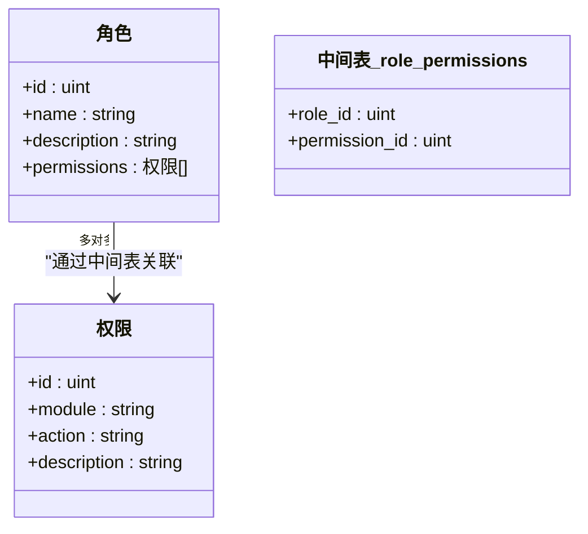
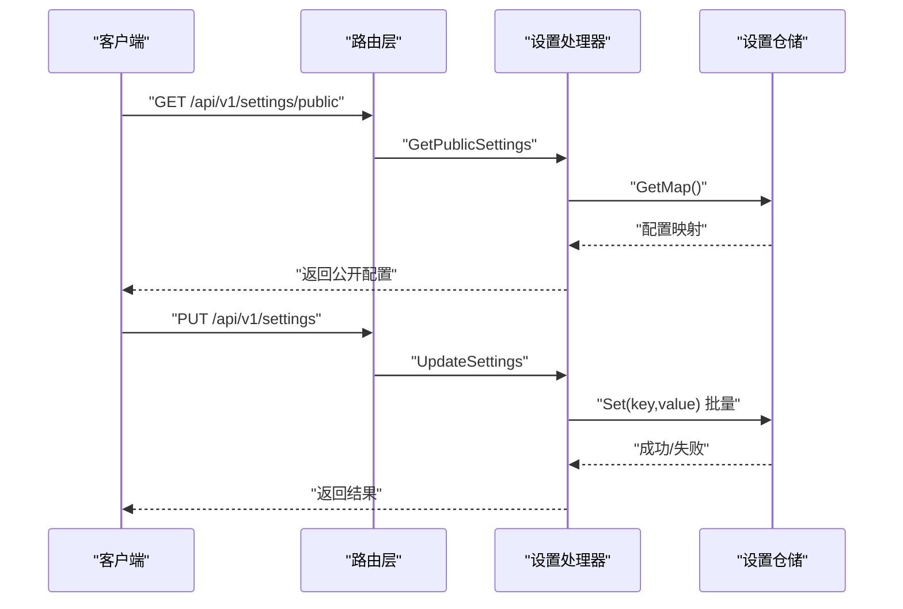
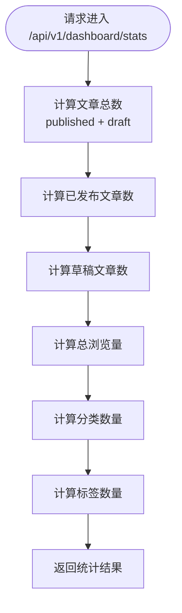
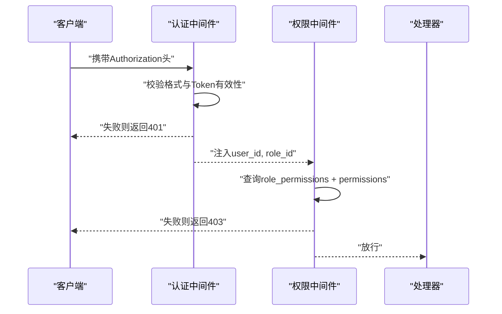
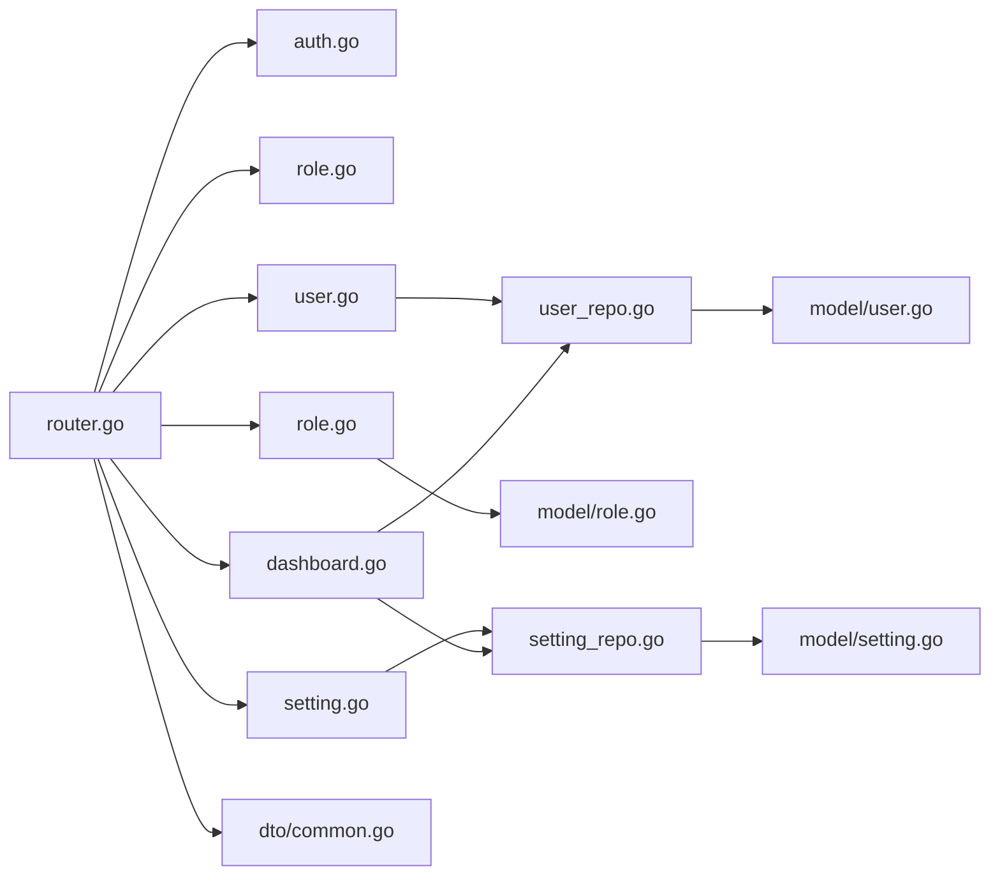

# 系统管理API

<cite>
**本文档引用的文件**
- [server/main.go](file://server/main.go)
- [server/router/router.go](file://server/router/router.go)
- [server/config/config.go](file://server/config/config.go)
- [server/internal/middleware/auth.go](file://server/internal/middleware/auth.go)
- [server/internal/middleware/role.go](file://server/internal/middleware/role.go)
- [server/internal/handler/user.go](file://server/internal/handler/user.go)
- [server/internal/handler/role.go](file://server/internal/handler/role.go)
- [server/internal/handler/setting.go](file://server/internal/handler/setting.go)
- [server/internal/handler/dashboard.go](file://server/internal/handler/dashboard.go)
- [server/internal/model/user.go](file://server/internal/model/user.go)
- [server/internal/model/role.go](file://server/internal/model/role.go)
- [server/internal/model/setting.go](file://server/internal/model/setting.go)
- [server/internal/dto/common.go](file://server/internal/dto/common.go)
- [server/internal/repository/user_repo.go](file://server/internal/repository/user_repo.go)
- [server/internal/repository/setting_repo.go](file://server/internal/repository/setting_repo.go)
</cite>

## 目录
1. [简介](#简介)
2. [项目结构](#项目结构)
3. [核心组件](#核心组件)
4. [架构总览](#架构总览)
5. [详细组件分析](#详细组件分析)
6. [依赖分析](#依赖分析)
7. [性能考虑](#性能考虑)
8. [故障排查指南](#故障排查指南)
9. [结论](#结论)
10. [附录](#附录)

## 简介
本文件面向Xiangmuzs博客平台的系统管理API，覆盖用户管理、角色与权限管理（RBAC）、系统设置与公开配置、以及仪表板统计等管理功能。文档重点说明：
- 用户的增删改查流程与权限分配机制
- 基于模块+动作的RBAC权限模型（含权限继承与细粒度控制）
- 系统配置管理接口（博客基础设置、验证码等）
- 仪表板关键指标统计（文章总数、发布数、草稿数、总浏览量、分类与标签数量）
- 管理员权限验证与中间件拦截策略
- 完整的管理操作示例与权限控制说明

## 项目结构
后端采用Gin框架，按领域分层组织：路由层负责请求分发，中间件层处理认证与权限校验，处理器层封装业务逻辑，仓储层负责数据持久化，模型层定义数据结构，DTO层承载请求/响应载体。

图表来源
- [server/main.go:19-76](file://server/main.go#L19-L76)
- [server/router/router.go:11-103](file://server/router/router.go#L11-L103)
- [server/internal/middleware/auth.go:10-37](file://server/internal/middleware/auth.go#L10-L37)
- [server/internal/middleware/role.go:10-42](file://server/internal/middleware/role.go#L10-L42)
- [server/internal/handler/user.go:13-23](file://server/internal/handler/user.go#L13-L23)
- [server/internal/handler/role.go:14-20](file://server/internal/handler/role.go#L14-L20)
- [server/internal/handler/setting.go:11-19](file://server/internal/handler/setting.go#L11-L19)
- [server/internal/handler/dashboard.go:11-23](file://server/internal/handler/dashboard.go#L11-L23)
- [server/internal/repository/user_repo.go:8-22](file://server/internal/repository/user_repo.go#L8-L22)
- [server/internal/repository/setting_repo.go:9-15](file://server/internal/repository/setting_repo.go#L9-L15)
- [server/internal/model/user.go:5-16](file://server/internal/model/user.go#L5-L16)
- [server/internal/model/role.go:5-19](file://server/internal/model/role.go#L5-L19)
- [server/internal/model/setting.go:5-10](file://server/internal/model/setting.go#L5-L10)
- [server/internal/dto/common.go:3-20](file://server/internal/dto/common.go#L3-L20)

章节来源
- [server/main.go:19-76](file://server/main.go#L19-L76)
- [server/router/router.go:11-103](file://server/router/router.go#L11-L103)

## 核心组件
- 应用入口与数据库初始化：加载配置、连接MySQL、运行迁移、初始化RSA密钥、注册静态资源、启动HTTP服务。
- 路由与权限：统一在路由层绑定认证与权限中间件，按模块+动作进行细粒度授权。
- 认证中间件：从Authorization头解析Bearer Token，解析用户ID与角色ID并注入上下文。
- 权限中间件：通过角色-权限关联表校验当前角色是否具备指定模块+动作权限。
- 处理器：用户、角色、设置、仪表板等管理功能的业务编排。
- 仓储：用户与设置的CRUD实现，支持分页、唯一键冲突更新等。
- 模型：用户、角色、权限、设置的数据结构及多对多关联。
- DTO：分页查询参数标准化与偏移计算。

章节来源
- [server/main.go:21-52](file://server/main.go#L21-L52)
- [server/router/router.go:44-102](file://server/router/router.go#L44-L102)
- [server/internal/middleware/auth.go:10-37](file://server/internal/middleware/auth.go#L10-L37)
- [server/internal/middleware/role.go:10-42](file://server/internal/middleware/role.go#L10-L42)
- [server/internal/repository/user_repo.go:59-65](file://server/internal/repository/user_repo.go#L59-L65)
- [server/internal/repository/setting_repo.go:23-29](file://server/internal/repository/setting_repo.go#L23-L29)
- [server/internal/model/user.go:5-16](file://server/internal/model/user.go#L5-L16)
- [server/internal/model/role.go:5-19](file://server/internal/model/role.go#L5-L19)
- [server/internal/model/setting.go:5-10](file://server/internal/model/setting.go#L5-L10)
- [server/internal/dto/common.go:3-20](file://server/internal/dto/common.go#L3-L20)

## 架构总览
系统采用“路由-中间件-处理器-仓储-模型”的清晰分层，权限控制贯穿所有管理接口。认证中间件负责鉴权，权限中间件负责授权；处理器调用仓储完成数据操作；模型定义数据结构与关联关系。

图表来源
- [server/router/router.go:11-103](file://server/router/router.go#L11-L103)
- [server/internal/middleware/auth.go:10-37](file://server/internal/middleware/auth.go#L10-L37)
- [server/internal/middleware/role.go:10-42](file://server/internal/middleware/role.go#L10-L42)
- [server/internal/handler/user.go:13-23](file://server/internal/handler/user.go#L13-L23)
- [server/internal/handler/role.go:14-20](file://server/internal/handler/role.go#L14-L20)
- [server/internal/handler/setting.go:11-19](file://server/internal/handler/setting.go#L11-L19)
- [server/internal/handler/dashboard.go:11-23](file://server/internal/handler/dashboard.go#L11-L23)
- [server/internal/repository/user_repo.go:8-22](file://server/internal/repository/user_repo.go#L8-L22)
- [server/internal/repository/setting_repo.go:9-15](file://server/internal/repository/setting_repo.go#L9-L15)
- [server/internal/model/user.go:5-16](file://server/internal/model/user.go#L5-L16)
- [server/internal/model/role.go:5-19](file://server/internal/model/role.go#L5-L19)
- [server/internal/model/setting.go:5-10](file://server/internal/model/setting.go#L5-L10)

## 详细组件分析

### 用户管理
- 功能范围：分页列出用户、创建用户（RSA解密密码、哈希存储）、更新用户（可改邮箱、角色、状态、密码）、删除用户（禁止删除自身）。
- 关键流程：处理器接收请求，DTO标准化分页参数，仓储执行数据库操作，返回统一响应。
- 权限控制：所有用户相关接口均受权限中间件保护，模块名为"user"，动作包括"read"、"create"、"update"、"delete"。

图表来源
- [server/router/router.go:94-97](file://server/router/router.go#L94-L97)
- [server/internal/middleware/role.go:10-35](file://server/internal/middleware/role.go#L10-L35)
- [server/internal/handler/user.go:41-75](file://server/internal/handler/user.go#L41-L75)
- [server/internal/repository/user_repo.go:40-49](file://server/internal/repository/user_repo.go#L40-L49)

章节来源
- [server/router/router.go:94-97](file://server/router/router.go#L94-L97)
- [server/internal/handler/user.go:25-145](file://server/internal/handler/user.go#L25-L145)
- [server/internal/repository/user_repo.go:59-65](file://server/internal/repository/user_repo.go#L59-L65)
- [server/internal/dto/common.go:3-20](file://server/internal/dto/common.go#L3-L20)

### 角色与权限管理（RBAC）
- 功能范围：列出角色（预加载权限）、创建角色并分配权限、更新角色并替换权限集合、删除角色（需确保无用户占用）、列出全部权限。
- 权限模型：角色与权限为多对多关系，通过中间表role_permissions存储；权限以(module, action)二元组标识，如"article:create"。
- 细粒度控制：每个管理接口都绑定RequirePermission(module, action)，仅当当前角色拥有对应权限时才允许访问。

图表来源
- [server/internal/model/role.go:5-19](file://server/internal/model/role.go#L5-L19)

章节来源
- [server/router/router.go:86-91](file://server/router/router.go#L86-L91)
- [server/internal/handler/role.go:22-110](file://server/internal/handler/role.go#L22-L110)
- [server/internal/middleware/role.go:10-35](file://server/internal/middleware/role.go#L10-L35)

### 系统设置与公开配置
- 公开设置：无需登录即可获取的配置项（如验证码开关、Logo地址、站点名称）。
- 管理设置：管理员批量更新配置，使用ON CONFLICT更新键值并自动更新时间戳。
- 验证码：生成新的验证码ID与Base64图片，供登录/注册时校验。

图表来源
- [server/router/router.go:29-30](file://server/router/router.go#L29-L30)
- [server/router/router.go:99-101](file://server/router/router.go#L99-L101)
- [server/internal/handler/setting.go:21-66](file://server/internal/handler/setting.go#L21-L66)
- [server/internal/repository/setting_repo.go:23-44](file://server/internal/repository/setting_repo.go#L23-L44)

章节来源
- [server/router/router.go:28-30](file://server/router/router.go#L28-L30)
- [server/router/router.go:99-101](file://server/router/router.go#L99-L101)
- [server/internal/handler/setting.go:21-66](file://server/internal/handler/setting.go#L21-L66)
- [server/internal/repository/setting_repo.go:17-44](file://server/internal/repository/setting_repo.go#L17-L44)

### 仪表板统计
- 统计指标：文章总数、已发布数、草稿数、总浏览量、分类数量、标签数量。
- 实现方式：处理器聚合调用文章、分类、标签仓储的计数与汇总方法，返回统一结构。

图表来源
- [server/router/router.go:52-53](file://server/router/router.go#L52-L53)
- [server/internal/handler/dashboard.go:25-37](file://server/internal/handler/dashboard.go#L25-L37)

章节来源
- [server/router/router.go:52-53](file://server/router/router.go#L52-L53)
- [server/internal/handler/dashboard.go:25-37](file://server/internal/handler/dashboard.go#L25-L37)

### 认证与权限验证流程
- 认证：要求Authorization头为Bearer Token，解析失败则拒绝访问。
- 授权：根据当前角色ID查询role_permissions + permissions表，匹配module与action。
- 上下文注入：认证成功后将user_id与role_id写入上下文，供后续中间件与处理器使用。

图表来源
- [server/internal/middleware/auth.go:10-37](file://server/internal/middleware/auth.go#L10-L37)
- [server/internal/middleware/role.go:10-35](file://server/internal/middleware/role.go#L10-L35)

章节来源
- [server/internal/middleware/auth.go:10-37](file://server/internal/middleware/auth.go#L10-L37)
- [server/internal/middleware/role.go:10-35](file://server/internal/middleware/role.go#L10-L35)

## 依赖分析
- 路由层依赖处理器与中间件，处理器依赖仓储与DTO，仓储依赖模型。
- 权限中间件依赖数据库查询角色权限关联表，处理器依赖仓储完成业务操作。
- 配置通过Viper加载，上传路径与日志模式等在入口处初始化。

图表来源
- [server/router/router.go:11-103](file://server/router/router.go#L11-L103)
- [server/internal/handler/user.go:13-23](file://server/internal/handler/user.go#L13-L23)
- [server/internal/handler/role.go:14-20](file://server/internal/handler/role.go#L14-L20)
- [server/internal/handler/setting.go:11-19](file://server/internal/handler/setting.go#L11-L19)
- [server/internal/handler/dashboard.go:11-23](file://server/internal/handler/dashboard.go#L11-L23)
- [server/internal/repository/user_repo.go:8-22](file://server/internal/repository/user_repo.go#L8-L22)
- [server/internal/repository/setting_repo.go:9-15](file://server/internal/repository/setting_repo.go#L9-L15)
- [server/internal/model/user.go:5-16](file://server/internal/model/user.go#L5-L16)
- [server/internal/model/role.go:5-19](file://server/internal/model/role.go#L5-L19)
- [server/internal/model/setting.go:5-10](file://server/internal/model/setting.go#L5-L10)
- [server/internal/dto/common.go:3-20](file://server/internal/dto/common.go#L3-L20)

章节来源
- [server/router/router.go:11-103](file://server/router/router.go#L11-L103)
- [server/internal/repository/user_repo.go:8-22](file://server/internal/repository/user_repo.go#L8-L22)
- [server/internal/repository/setting_repo.go:9-15](file://server/internal/repository/setting_repo.go#L9-L15)

## 性能考虑
- 分页优化：处理器统一使用DTO标准化分页参数，仓储按偏移与限制查询，避免一次性加载大量数据。
- 预加载策略：用户列表预加载角色信息，减少N+1查询；角色列表预加载权限，便于前端展示。
- 数据库索引：用户与设置键具有唯一索引，保障去重与快速查找。
- 日志级别：调试模式开启GORM详细日志，生产环境使用Release模式降低开销。
- 缓存建议：可在处理器层引入Redis缓存热点配置与统计结果，降低数据库压力。

## 故障排查指南
- 认证失败
  - 现象：返回401未授权
  - 可能原因：未提供Authorization头、格式不正确、Token无效或过期
  - 处理建议：确认请求头格式为Bearer Token，检查服务端JWT配置与有效期
- 权限不足
  - 现象：返回403禁止访问
  - 可能原因：当前角色未被授予目标模块+动作权限
  - 处理建议：通过角色管理接口为角色分配相应权限
- 用户操作异常
  - 现象：创建/更新失败或删除自身
  - 可能原因：用户名/邮箱重复、密码解密失败、尝试删除自己
  - 处理建议：检查输入参数、确认RSA密钥初始化正常、避免自我删除
- 设置更新失败
  - 现象：批量更新配置报错
  - 可能原因：键值冲突或数据库写入异常
  - 处理建议：确认键名存在且类型正确，查看数据库日志

章节来源
- [server/internal/middleware/auth.go:12-31](file://server/internal/middleware/auth.go#L12-L31)
- [server/internal/middleware/role.go:13-31](file://server/internal/middleware/role.go#L13-L31)
- [server/internal/handler/user.go:69-74](file://server/internal/handler/user.go#L69-L74)
- [server/internal/handler/user.go:134-137](file://server/internal/handler/user.go#L134-L137)
- [server/internal/handler/setting.go:45-50](file://server/internal/handler/setting.go#L45-L50)

## 结论
本系统管理API围绕RBAC模型构建，通过模块+动作的权限矩阵实现精细化控制；认证与权限中间件贯穿所有管理接口，确保安全可控。用户、角色、设置与仪表板四大模块覆盖了后台管理的核心需求，配合分页与预加载等优化策略，满足中等规模博客平台的管理场景。

## 附录

### 管理操作示例与权限对照
- 用户管理
  - 列表：需要权限"user:read"
  - 创建：需要权限"user:create"
  - 更新：需要权限"user:update"
  - 删除：需要权限"user:delete"
- 角色管理
  - 列表：需要权限"role:read"
  - 创建：需要权限"role:create"
  - 更新：需要权限"role:update"
  - 删除：需要权限"role:delete"
- 系统设置
  - 获取公开设置：无需登录
  - 批量更新设置：需要权限"setting:update"（若扩展）
- 仪表板统计
  - 获取统计：需要权限"dashboard:read"（若扩展）

章节来源
- [server/router/router.go:52-53](file://server/router/router.go#L52-L53)
- [server/router/router.go:86-91](file://server/router/router.go#L86-L91)
- [server/router/router.go:94-97](file://server/router/router.go#L94-L97)
- [server/internal/middleware/role.go:10-35](file://server/internal/middleware/role.go#L10-L35)