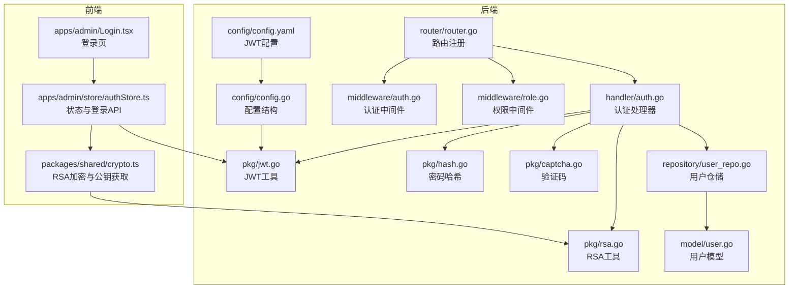
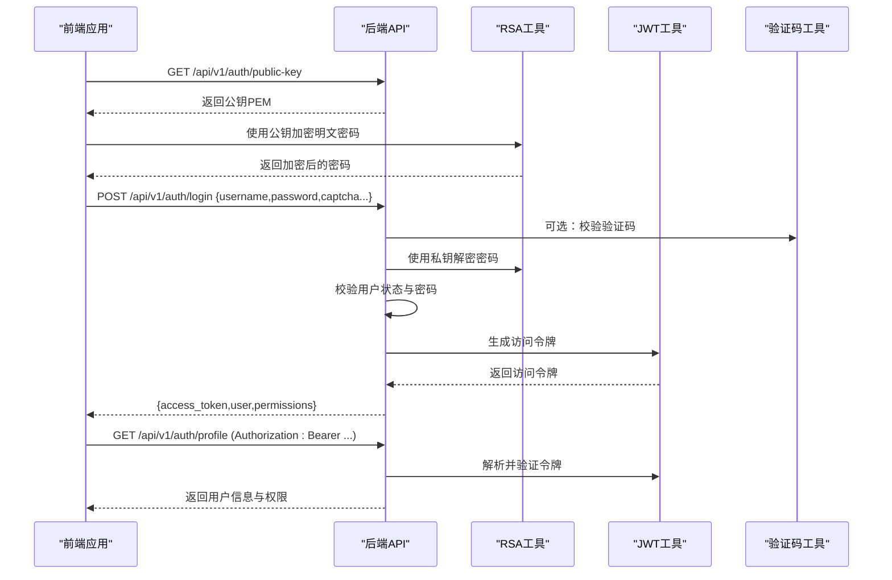
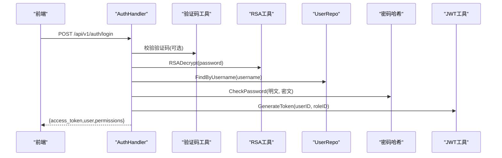
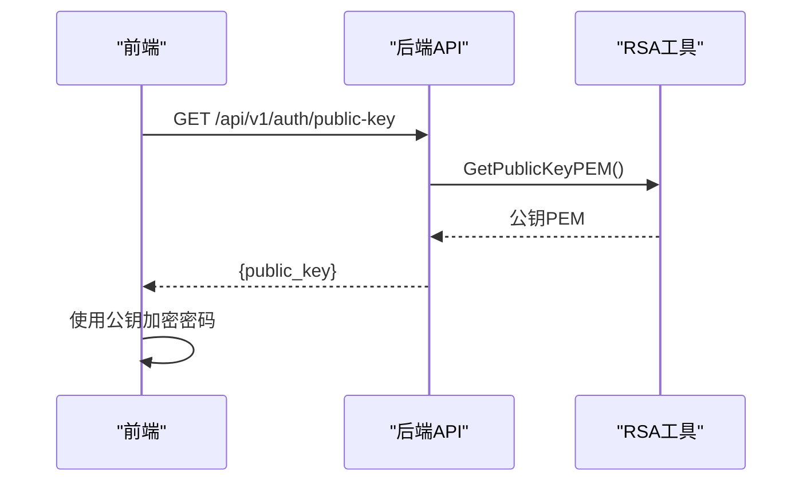
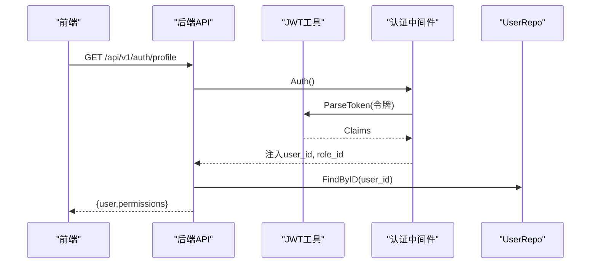
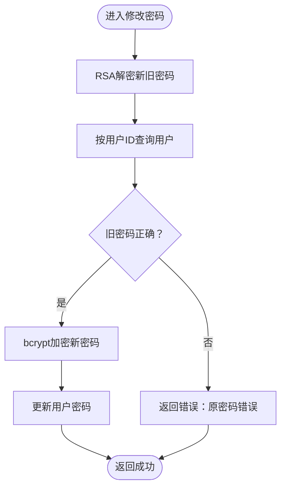
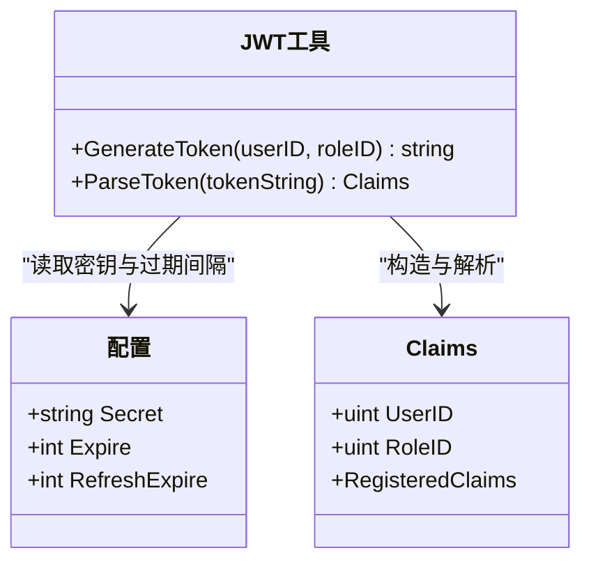
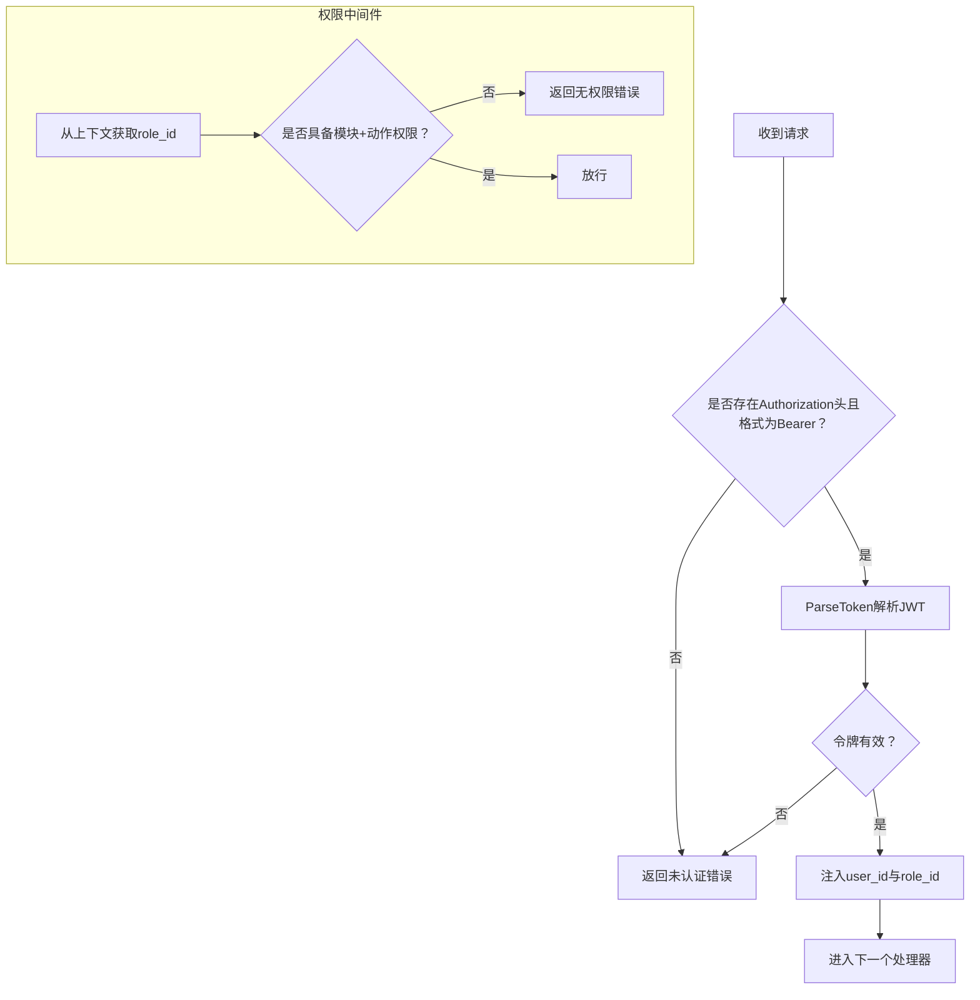
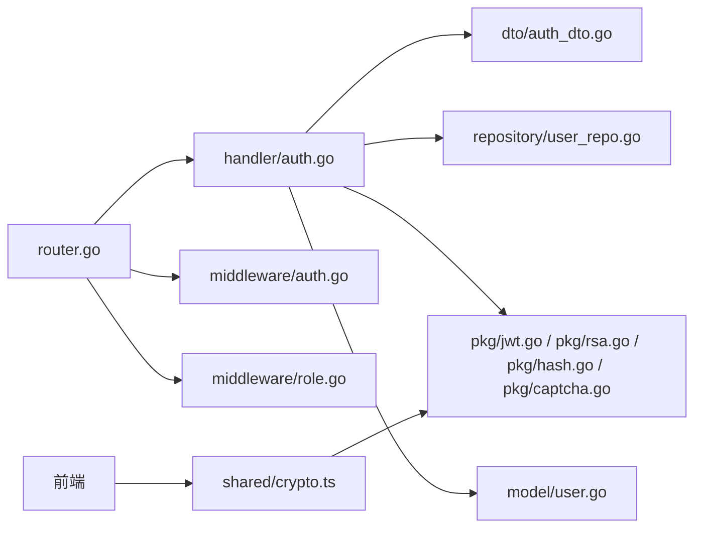

# 认证API

<cite>
**本文引用的文件**
- [server/internal/handler/auth.go](file://server/internal/handler/auth.go)
- [server/internal/middleware/auth.go](file://server/internal/middleware/auth.go)
- [server/internal/dto/auth_dto.go](file://server/internal/dto/auth_dto.go)
- [server/internal/pkg/jwt.go](file://server/internal/pkg/jwt.go)
- [server/internal/pkg/rsa.go](file://server/internal/pkg/rsa.go)
- [server/internal/repository/user_repo.go](file://server/internal/repository/user_repo.go)
- [server/internal/model/user.go](file://server/internal/model/user.go)
- [server/router/router.go](file://server/router/router.go)
- [server/config/config.go](file://server/config/config.go)
- [server/config/config.yaml](file://server/config/config.yaml)
- [server/internal/pkg/hash.go](file://server/internal/pkg/hash.go)
- [server/internal/middleware/role.go](file://server/internal/middleware/role.go)
- [server/internal/pkg/captcha.go](file://server/internal/pkg/captcha.go)
- [webSource/apps/admin/src/pages/Login.tsx](file://webSource/apps/admin/src/pages/Login.tsx)
- [webSource/apps/admin/src/store/authStore.ts](file://webSource/apps/admin/src/store/authStore.ts)
- [webSource/packages/shared/src/utils/crypto.ts](file://webSource/packages/shared/src/utils/crypto.ts)
</cite>

## 目录
1. [简介](#简介)
2. [项目结构](#项目结构)
3. [核心组件](#核心组件)
4. [架构总览](#架构总览)
5. [详细组件分析](#详细组件分析)
6. [依赖分析](#依赖分析)
7. [性能考虑](#性能考虑)
8. [故障排除指南](#故障排除指南)
9. [结论](#结论)
10. [附录](#附录)

## 简介
本文件面向Xiangmuzs博客平台的认证API，覆盖以下主题：
- 用户登录与会话建立（含验证码与RSA加密）
- 公钥获取接口与前端RSA加密流程
- 获取个人资料与权限加载
- 修改密码流程
- JWT访问令牌的生成、解析与有效期管理
- 认证中间件与权限校验中间件的使用方法
- 常见错误码与解决方案

## 项目结构
后端采用Gin框架与GORM，按领域分层组织：router负责路由注册，handler处理HTTP请求，middleware提供认证与权限控制，pkg封装通用工具（JWT、RSA、哈希、验证码），repository封装数据访问，model定义数据结构；前端通过共享包进行RSA加密与请求封装。

图表来源
- [server/router/router.go:11-104](file://server/router/router.go#L11-L104)
- [server/internal/handler/auth.go:13-163](file://server/internal/handler/auth.go#L13-L163)
- [server/internal/middleware/auth.go:10-38](file://server/internal/middleware/auth.go#L10-L38)
- [server/internal/middleware/role.go:10-43](file://server/internal/middleware/role.go#L10-L43)
- [server/internal/pkg/jwt.go:10-43](file://server/internal/pkg/jwt.go#L10-L43)
- [server/internal/pkg/rsa.go:12-54](file://server/internal/pkg/rsa.go#L12-L54)
- [server/internal/pkg/hash.go:5-14](file://server/internal/pkg/hash.go#L5-L14)
- [server/internal/pkg/captcha.go:19-58](file://server/internal/pkg/captcha.go#L19-L58)
- [server/internal/repository/user_repo.go:24-34](file://server/internal/repository/user_repo.go#L24-L34)
- [server/internal/model/user.go:5-16](file://server/internal/model/user.go#L5-L16)
- [server/config/config.go:29-33](file://server/config/config.go#L29-L33)
- [server/config/config.yaml:13-16](file://server/config/config.yaml#L13-L16)
- [webSource/apps/admin/src/pages/Login.tsx:10-119](file://webSource/apps/admin/src/pages/Login.tsx#L10-L119)
- [webSource/apps/admin/src/store/authStore.ts:36-56](file://webSource/apps/admin/src/store/authStore.ts#L36-L56)
- [webSource/packages/shared/src/utils/crypto.ts:7-24](file://webSource/packages/shared/src/utils/crypto.ts#L7-L24)

章节来源
- [server/router/router.go:11-104](file://server/router/router.go#L11-L104)

## 核心组件
- 路由与控制器
  - 登录、获取公钥、获取个人资料、修改密码在认证处理器中实现，路由在router中注册。
- 中间件
  - 认证中间件从Authorization头解析Bearer Token并注入用户信息。
  - 权限中间件基于角色与模块动作进行授权检查。
- 工具库
  - JWT：Claims结构体、签发与解析。
  - RSA：初始化、导出公钥、私钥解密。
  - 密码：bcrypt哈希与校验。
  - 验证码：生成与校验。
- 数据访问
  - 用户仓储提供按用户名与ID查询、更新等操作。
- 配置
  - JWT密钥、过期时间等在配置文件中集中管理。

章节来源
- [server/internal/handler/auth.go:13-163](file://server/internal/handler/auth.go#L13-L163)
- [server/internal/middleware/auth.go:10-38](file://server/internal/middleware/auth.go#L10-L38)
- [server/internal/middleware/role.go:10-43](file://server/internal/middleware/role.go#L10-L43)
- [server/internal/pkg/jwt.go:10-43](file://server/internal/pkg/jwt.go#L10-L43)
- [server/internal/pkg/rsa.go:12-54](file://server/internal/pkg/rsa.go#L12-L54)
- [server/internal/pkg/hash.go:5-14](file://server/internal/pkg/hash.go#L5-L14)
- [server/internal/pkg/captcha.go:19-58](file://server/internal/pkg/captcha.go#L19-L58)
- [server/internal/repository/user_repo.go:24-34](file://server/internal/repository/user_repo.go#L24-L34)
- [server/config/config.go:29-33](file://server/config/config.go#L29-L33)
- [server/config/config.yaml:13-16](file://server/config/config.yaml#L13-L16)

## 架构总览
认证API围绕“公钥获取—登录—携带令牌访问受保护资源—权限校验”的主路径工作。前端先获取公钥并用RSA加密密码，再发起登录请求；登录成功后后端签发JWT，前端存储令牌并在后续请求头中携带；后端中间件统一进行认证与权限校验。

图表来源
- [server/router/router.go:27-29](file://server/router/router.go#L27-L29)
- [server/internal/handler/auth.go:27-93](file://server/internal/handler/auth.go#L27-L93)
- [server/internal/pkg/rsa.go:39-53](file://server/internal/pkg/rsa.go#L39-L53)
- [server/internal/pkg/jwt.go:16-28](file://server/internal/pkg/jwt.go#L16-L28)
- [server/internal/pkg/captcha.go:24-58](file://server/internal/pkg/captcha.go#L24-L58)
- [webSource/packages/shared/src/utils/crypto.ts:7-24](file://webSource/packages/shared/src/utils/crypto.ts#L7-L24)
- [webSource/apps/admin/src/store/authStore.ts:36-50](file://webSource/apps/admin/src/store/authStore.ts#L36-L50)

## 详细组件分析

### 登录接口
- 接口路径与方法
  - GET /api/v1/auth/public-key
  - POST /api/v1/auth/login
- 请求参数
  - 登录请求体字段：username、password（需RSA加密）、可选captcha_id、captcha
- 处理流程
  - 可选验证码校验
  - RSA私钥解密密码
  - 按用户名查询用户并校验状态
  - bcrypt校验密码
  - 生成JWT访问令牌
  - 加载用户权限并返回
- 成功响应
  - access_token：JWT字符串
  - user：包含id、username、email、role_id、avatar、status
  - permissions：当前角色拥有的权限列表
- 失败响应
  - 参数错误、验证码错误、密码解密失败、用户名或密码错误、账号被禁用、内部错误等

图表来源
- [server/internal/handler/auth.go:31-93](file://server/internal/handler/auth.go#L31-L93)
- [server/internal/pkg/captcha.go:48-58](file://server/internal/pkg/captcha.go#L48-L58)
- [server/internal/pkg/rsa.go:43-53](file://server/internal/pkg/rsa.go#L43-L53)
- [server/internal/repository/user_repo.go:24-28](file://server/internal/repository/user_repo.go#L24-L28)
- [server/internal/pkg/hash.go:10-13](file://server/internal/pkg/hash.go#L10-L13)
- [server/internal/pkg/jwt.go:16-28](file://server/internal/pkg/jwt.go#L16-L28)

章节来源
- [server/router/router.go:27-29](file://server/router/router.go#L27-L29)
- [server/internal/dto/auth_dto.go:3-8](file://server/internal/dto/auth_dto.go#L3-L8)
- [server/internal/handler/auth.go:31-93](file://server/internal/handler/auth.go#L31-L93)

### 获取公钥接口
- 接口路径与方法
  - GET /api/v1/auth/public-key
- 功能
  - 返回服务器当前RSA公钥（PEM格式），供前端加密密码
- 前端使用
  - 首次登录前调用获取公钥，使用JSencrypt进行RSA加密后再提交

图表来源
- [server/router/router.go:27](file://server/router/router.go#L27)
- [server/internal/handler/auth.go:27-29](file://server/internal/handler/auth.go#L27-L29)
- [server/internal/pkg/rsa.go:39-41](file://server/internal/pkg/rsa.go#L39-L41)
- [webSource/packages/shared/src/utils/crypto.ts:7-12](file://webSource/packages/shared/src/utils/crypto.ts#L7-L12)

章节来源
- [server/internal/handler/auth.go:27-29](file://server/internal/handler/auth.go#L27-L29)
- [server/internal/pkg/rsa.go:18-41](file://server/internal/pkg/rsa.go#L18-L41)
- [webSource/packages/shared/src/utils/crypto.ts:7-24](file://webSource/packages/shared/src/utils/crypto.ts#L7-L24)

### 获取个人资料与权限
- 接口路径与方法
  - GET /api/v1/auth/profile
- 认证要求
  - 需要携带有效的Bearer Token
- 响应内容
  - user：同登录响应中的用户字段
  - permissions：当前角色权限列表

图表来源
- [server/router/router.go:49](file://server/router/router.go#L49)
- [server/internal/middleware/auth.go:10-38](file://server/internal/middleware/auth.go#L10-L38)
- [server/internal/pkg/jwt.go:30-42](file://server/internal/pkg/jwt.go#L30-L42)
- [server/internal/handler/auth.go:95-118](file://server/internal/handler/auth.go#L95-L118)
- [server/internal/repository/user_repo.go:30-34](file://server/internal/repository/user_repo.go#L30-L34)

章节来源
- [server/router/router.go:49](file://server/router/router.go#L49)
- [server/internal/middleware/auth.go:10-38](file://server/internal/middleware/auth.go#L10-L38)
- [server/internal/handler/auth.go:95-118](file://server/internal/handler/auth.go#L95-L118)

### 修改密码
- 接口路径与方法
  - PUT /api/v1/auth/password
- 请求参数
  - old_password、new_password（均需RSA加密）
- 处理流程
  - RSA私钥解密新旧密码
  - 校验旧密码正确性
  - bcrypt加密新密码并保存

图表来源
- [server/router/router.go:50](file://server/router/router.go#L50)
- [server/internal/handler/auth.go:120-162](file://server/internal/handler/auth.go#L120-L162)
- [server/internal/pkg/rsa.go:43-53](file://server/internal/pkg/rsa.go#L43-L53)
- [server/internal/pkg/hash.go:5-13](file://server/internal/pkg/hash.go#L5-L13)

章节来源
- [server/router/router.go:50](file://server/router/router.go#L50)
- [server/internal/handler/auth.go:120-162](file://server/internal/handler/auth.go#L120-L162)

### JWT令牌生成、验证与有效期
- 令牌生成
  - Claims包含user_id、role_id、签发时间与过期时间
  - 使用HS256签名，密钥来自配置
- 令牌解析
  - 校验签名与有效期，失败时返回认证无效
- 有效期管理
  - access_token默认2小时（配置项expire）
  - 配置文件提供refresh_expire（未在代码中直接使用）

图表来源
- [server/internal/pkg/jwt.go:10-43](file://server/internal/pkg/jwt.go#L10-L43)
- [server/config/config.go:29-33](file://server/config/config.go#L29-L33)
- [server/config/config.yaml:13-16](file://server/config/config.yaml#L13-L16)

章节来源
- [server/internal/pkg/jwt.go:16-42](file://server/internal/pkg/jwt.go#L16-L42)
- [server/config/config.go:47-64](file://server/config/config.go#L47-L64)
- [server/config/config.yaml:13-16](file://server/config/config.yaml#L13-L16)

### 认证中间件与权限验证
- 认证中间件
  - 从Authorization头提取Bearer令牌
  - 解析并验证JWT，注入user_id与role_id
- 权限中间件
  - 基于role_id与模块+动作组合进行授权检查
  - 通过预加载角色权限实现快速判断

图表来源
- [server/internal/middleware/auth.go:10-38](file://server/internal/middleware/auth.go#L10-L38)
- [server/internal/middleware/role.go:11-42](file://server/internal/middleware/role.go#L11-L42)
- [server/internal/pkg/jwt.go:30-42](file://server/internal/pkg/jwt.go#L30-L42)

章节来源
- [server/internal/middleware/auth.go:10-38](file://server/internal/middleware/auth.go#L10-L38)
- [server/internal/middleware/role.go:11-42](file://server/internal/middleware/role.go#L11-L42)

### 前端集成要点
- 登录页
  - 首次加载公共设置以判断是否启用验证码
  - 若启用，拉取验证码图片与ID
  - 调用登录API时传入用户名、RSA加密后的密码以及可选验证码
- 状态管理
  - 登录成功后将access_token存入本地存储并注入全局状态
- RSA加密
  - 首次使用前调用获取公钥接口，随后对密码进行RSA加密

章节来源
- [webSource/apps/admin/src/pages/Login.tsx:20-58](file://webSource/apps/admin/src/pages/Login.tsx#L20-L58)
- [webSource/apps/admin/src/store/authStore.ts:36-50](file://webSource/apps/admin/src/store/authStore.ts#L36-L50)
- [webSource/packages/shared/src/utils/crypto.ts:7-24](file://webSource/packages/shared/src/utils/crypto.ts#L7-L24)

## 依赖分析
- 组件耦合
  - 路由依赖处理器与中间件
  - 处理器依赖仓储、工具库与DTO
  - 中间件依赖JWT与数据库查询
  - 前端依赖共享包的RSA与请求封装
- 外部依赖
  - Gin（Web框架）、GORM（ORM）、golang-jwt（JWT）、jsencrypt（RSA加密）
- 安全与一致性
  - 密码仅以密文形式存储，传输阶段使用RSA加密
  - 令牌采用HS256签名，密钥集中配置

图表来源
- [server/router/router.go:11-104](file://server/router/router.go#L11-L104)
- [server/internal/handler/auth.go:13-163](file://server/internal/handler/auth.go#L13-L163)
- [server/internal/dto/auth_dto.go:1-39](file://server/internal/dto/auth_dto.go#L1-L39)
- [server/internal/repository/user_repo.go:1-66](file://server/internal/repository/user_repo.go#L1-L66)
- [server/internal/model/user.go:1-17](file://server/internal/model/user.go#L1-L17)
- [server/internal/middleware/auth.go:10-38](file://server/internal/middleware/auth.go#L10-L38)
- [server/internal/middleware/role.go:10-43](file://server/internal/middleware/role.go#L10-L43)
- [server/internal/pkg/jwt.go:10-43](file://server/internal/pkg/jwt.go#L10-L43)
- [server/internal/pkg/rsa.go:12-54](file://server/internal/pkg/rsa.go#L12-L54)
- [server/internal/pkg/hash.go:5-14](file://server/internal/pkg/hash.go#L5-L14)
- [server/internal/pkg/captcha.go:19-58](file://server/internal/pkg/captcha.go#L19-L58)
- [webSource/packages/shared/src/utils/crypto.ts:1-24](file://webSource/packages/shared/src/utils/crypto.ts#L1-L24)

## 性能考虑
- RSA密钥生成仅在服务启动时初始化一次，避免重复开销
- JWT签名与解析为轻量计算，建议在高并发场景下保持合理的过期时间
- 验证码采用内存存储，注意在多实例部署时的共享策略
- 建议对频繁的登录尝试增加速率限制与账户锁定策略（当前未在代码中体现）

## 故障排除指南
- 常见错误与排查
  - 未提供认证信息/认证格式错误/认证已过期或无效：检查Authorization头格式与令牌有效性
  - 参数错误：核对请求体字段与必填项
  - 验证码错误或已过期：重新获取验证码并确保在有效期内提交
  - 密码解密失败：确认前端已正确获取公钥并使用RSA加密
  - 用户名或密码错误/账号被禁用：核对凭据与用户状态
  - 内部错误：检查服务日志与数据库连接
- 错误码映射
  - 未提供认证信息 → 401 未认证
  - 认证格式错误 → 401 未认证
  - 认证已过期或无效 → 401 未认证
  - 无权限 → 403 禁止访问
  - 参数错误 → 400 错误请求
  - 用户名或密码错误 → 401 未认证
  - 账号已被禁用 → 403 禁止访问
  - 密码解密失败 → 400 错误请求
  - 生成Token失败 → 500 内部错误
  - 用户不存在 → 404 未找到
  - 验证码错误或已过期 → 400 错误请求
  - 密码加密失败 → 500 内部错误
  - 原密码错误 → 400 错误请求

章节来源
- [server/internal/middleware/auth.go:13-31](file://server/internal/middleware/auth.go#L13-L31)
- [server/internal/handler/auth.go:34-77](file://server/internal/handler/auth.go#L34-L77)
- [server/internal/pkg/captcha.go:48-58](file://server/internal/pkg/captcha.go#L48-L58)
- [server/internal/handler/auth.go:124-156](file://server/internal/handler/auth.go#L124-L156)

## 结论
本认证体系通过“公钥获取—RSA加密—JWT令牌”的组合，在保障传输安全的同时实现了简洁高效的认证与授权流程。建议在生产环境中强化密钥轮换、令牌刷新策略与速率限制，并完善审计与监控。

## 附录
- 接口一览
  - GET /api/v1/auth/public-key：获取RSA公钥
  - POST /api/v1/auth/login：用户登录
  - GET /api/v1/auth/profile：获取个人资料与权限
  - PUT /api/v1/auth/password：修改密码
- 配置项
  - jwt.secret：JWT签名密钥
  - jwt.expire：访问令牌过期秒数
  - jwt.refresh_expire：刷新令牌过期秒数（当前未在代码中使用）

章节来源
- [server/router/router.go:27-50](file://server/router/router.go#L27-L50)
- [server/config/config.yaml:13-16](file://server/config/config.yaml#L13-L16)