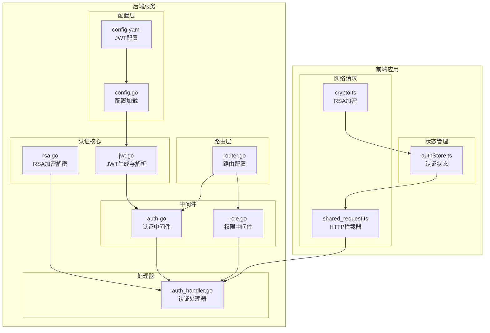
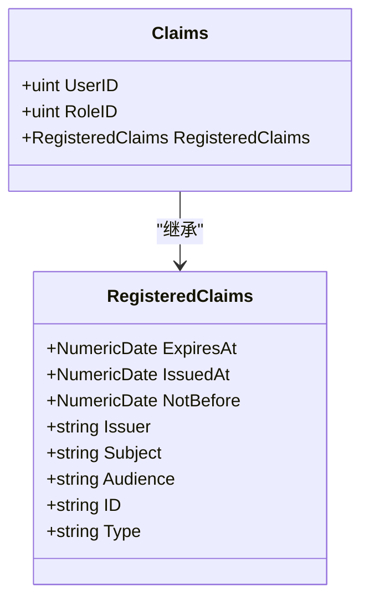
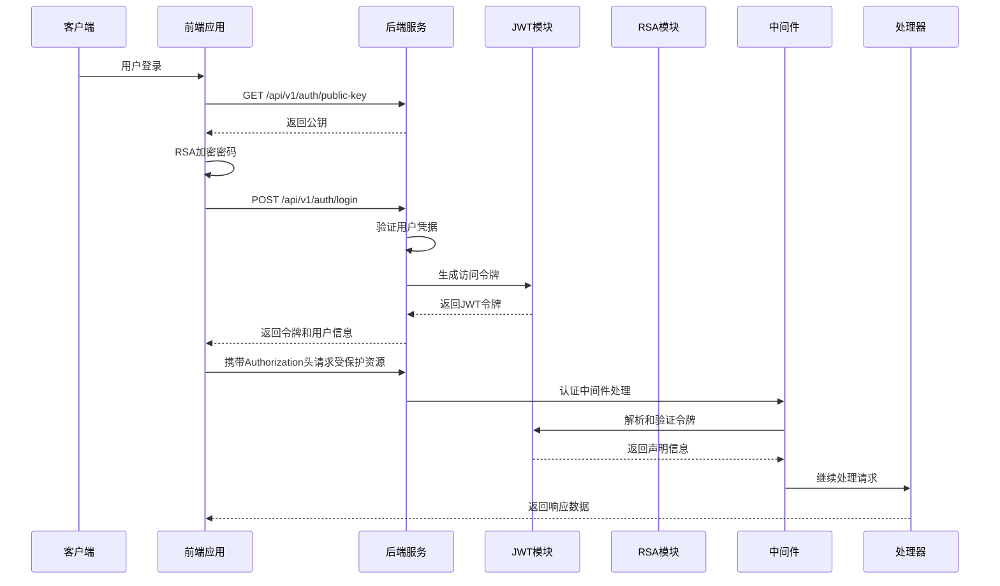
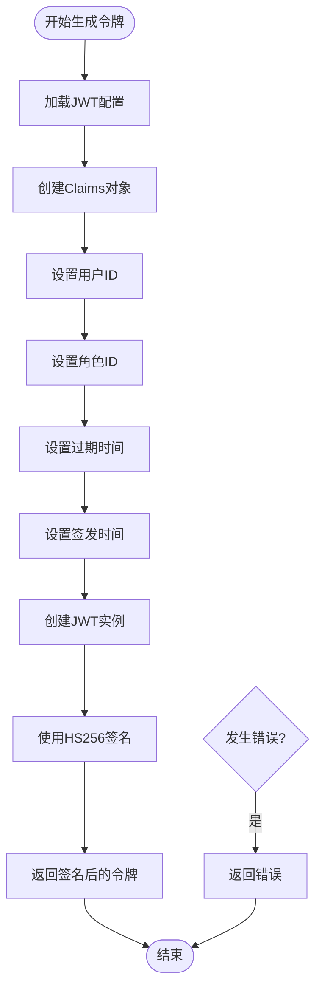
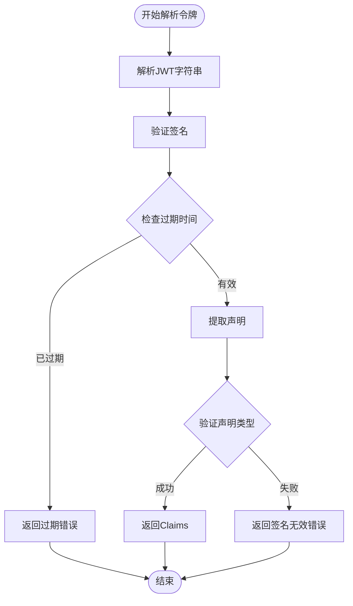
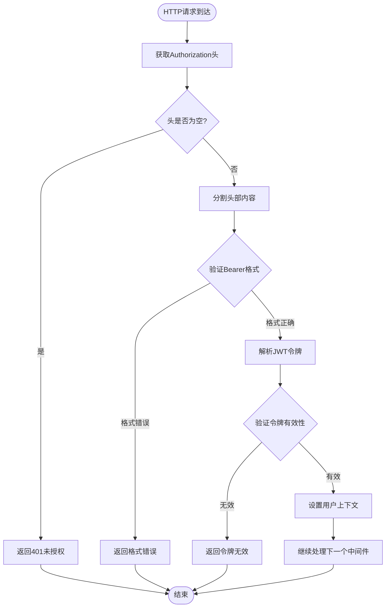
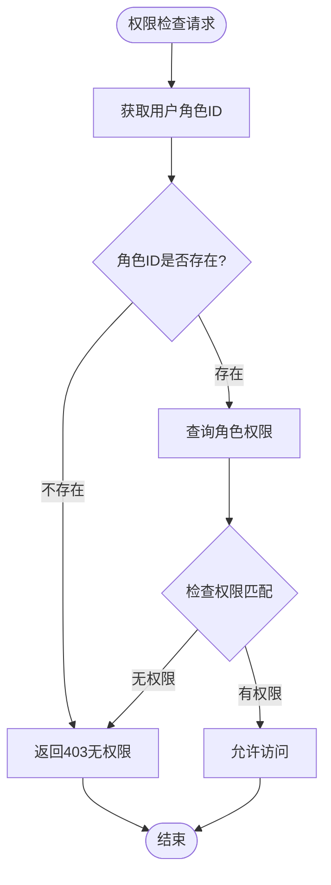
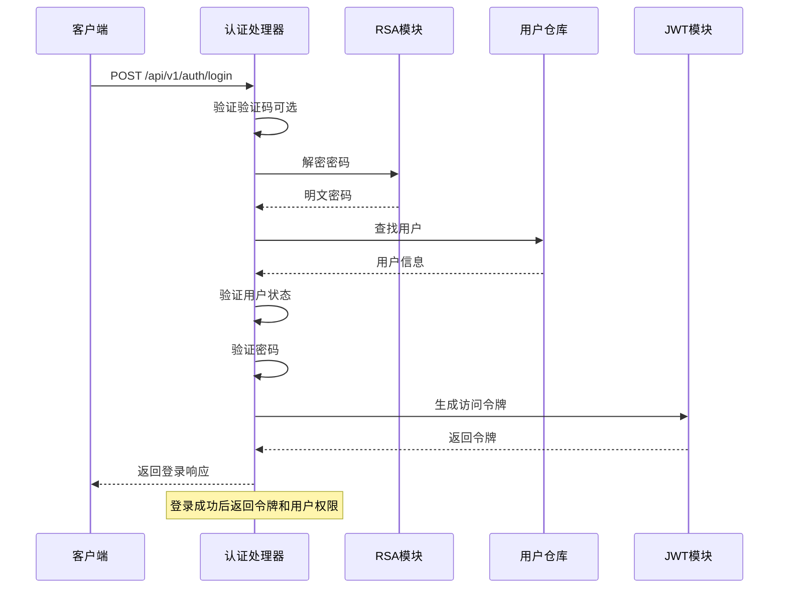
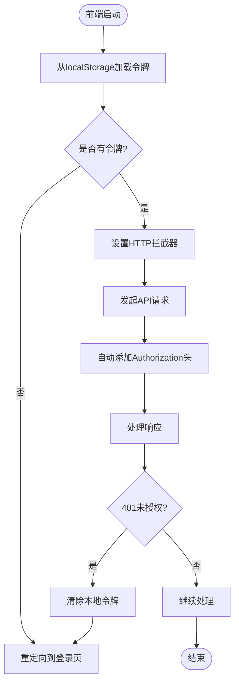
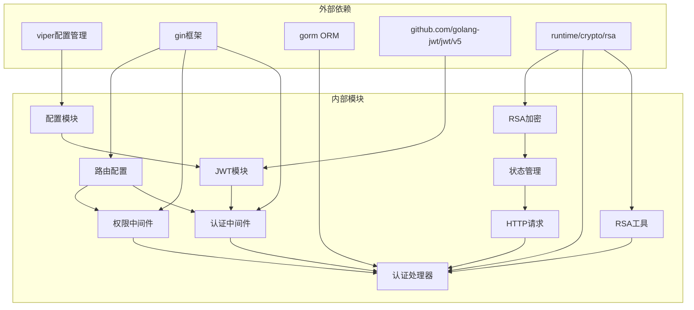

# JWT认证机制

<cite>
**本文档引用的文件**
- [jwt.go](file://server/internal/pkg/jwt.go)
- [auth.go](file://server/internal/middleware/auth.go)
- [config.go](file://server/config/config.go)
- [config.yaml](file://server/config/config.yaml)
- [auth_handler.go](file://server/internal/handler/auth.go)
- [rsa.go](file://server/internal/pkg/rsa.go)
- [role_middleware.go](file://server/internal/middleware/role.go)
- [router.go](file://server/router/router.go)
- [auth_store.ts](file://webSource/apps/admin/src/store/authStore.ts)
- [shared_request.ts](file://webSource/packages/shared/src/utils/request.ts)
- [crypto.ts](file://webSource/packages/shared/src/utils/crypto.ts)
</cite>

## 目录
1. [简介](#简介)
2. [项目结构](#项目结构)
3. [核心组件](#核心组件)
4. [架构概览](#架构概览)
5. [详细组件分析](#详细组件分析)
6. [依赖关系分析](#依赖关系分析)
7. [性能考虑](#性能考虑)
8. [故障排除指南](#故障排除指南)
9. [结论](#结论)

## 简介

本项目实现了基于JWT（JSON Web Token）的认证机制，采用HS256签名算法，支持用户登录认证、权限控制和安全访问。JWT认证机制通过在客户端和服务器之间传递经过数字签名的身份令牌来实现无状态认证，避免了服务器端会话存储的需求。

该实现具有以下特点：
- 使用HS256对称加密算法进行令牌签名
- 支持自定义过期时间配置
- 集成RSA加密保护密码传输
- 提供完整的权限控制系统
- 实现前后端分离的认证流程

## 项目结构

JWT认证机制在项目中的组织结构如下：

**图表来源**
- [config.go:1-65](file://server/config/config.go#L1-L65)
- [jwt.go:1-43](file://server/internal/pkg/jwt.go#L1-L43)
- [auth.go:1-38](file://server/internal/middleware/auth.go#L1-L38)
- [auth_handler.go:1-163](file://server/internal/handler/auth.go#L1-L163)

**章节来源**
- [config.go:1-65](file://server/config/config.go#L1-L65)
- [jwt.go:1-43](file://server/internal/pkg/jwt.go#L1-L43)
- [auth.go:1-38](file://server/internal/middleware/auth.go#L1-L38)
- [router.go:1-104](file://server/router/router.go#L1-L104)

## 核心组件

### JWT配置系统

JWT配置通过Viper配置管理器实现，支持从YAML文件动态加载配置参数。

**JWT配置参数说明：**

| 参数名称 | 类型 | 默认值 | 描述 |
|---------|------|--------|------|
| secret | string | `blog-jwt-secret-key-change-in-production` | JWT签名密钥，生产环境必须修改 |
| expire | int | 7200 | 访问令牌过期时间（秒），默认2小时 |
| refresh_expire | int | 604800 | 刷新令牌过期时间（秒），默认7天 |

**章节来源**
- [config.go:29-33](file://server/config/config.go#L29-L33)
- [config.yaml:13-16](file://server/config/config.yaml#L13-L16)

### JWT声明结构

JWT令牌包含标准声明和自定义声明：

**图表来源**
- [jwt.go:10-14](file://server/internal/pkg/jwt.go#L10-L14)

**章节来源**
- [jwt.go:10-14](file://server/internal/pkg/jwt.go#L10-L14)

## 架构概览

JWT认证系统的整体架构采用分层设计，确保安全性、可维护性和扩展性。

**图表来源**
- [auth_handler.go:31-93](file://server/internal/handler/auth.go#L31-L93)
- [auth.go:10-37](file://server/internal/middleware/auth.go#L10-L37)
- [jwt.go:16-28](file://server/internal/pkg/jwt.go#L16-L28)

## 详细组件分析

### JWT生成组件

JWT生成组件负责创建新的认证令牌，包含用户标识和角色信息。

**图表来源**
- [jwt.go:16-28](file://server/internal/pkg/jwt.go#L16-L28)

**实现要点：**
- 使用HS256对称加密算法进行签名
- 过期时间从配置中读取，支持自定义
- 包含标准注册声明（iat、exp）
- 自定义声明包含用户ID和角色ID

**章节来源**
- [jwt.go:16-28](file://server/internal/pkg/jwt.go#L16-L28)

### JWT解析组件

JWT解析组件负责验证传入令牌的有效性并提取声明信息。

**图表来源**
- [jwt.go:30-42](file://server/internal/pkg/jwt.go#L30-L42)

**实现要点：**
- 使用相同的密钥进行签名验证
- 自动检查过期时间和签发时间
- 返回标准化的Claims结构
- 错误处理包括签名无效和解析错误

**章节来源**
- [jwt.go:30-42](file://server/internal/pkg/jwt.go#L30-L42)

### 认证中间件

认证中间件是JWT认证的核心入口点，负责处理Authorization头并验证令牌。

**图表来源**
- [auth.go:10-37](file://server/internal/middleware/auth.go#L10-L37)

**实现逻辑：**
- 检查Authorization头是否存在
- 验证Bearer令牌格式
- 调用JWT解析函数验证令牌
- 将用户ID和角色ID注入到请求上下文中
- 继续处理后续中间件和处理器

**章节来源**
- [auth.go:10-37](file://server/internal/middleware/auth.go#L10-L37)

### 权限中间件

权限中间件基于角色权限模型实现细粒度的访问控制。

**图表来源**
- [role_middleware.go:11-35](file://server/internal/middleware/role.go#L11-L35)

**实现机制：**
- 通过数据库查询角色关联的权限
- 支持模块级权限控制（module.action）
- 动态权限检查，支持运行时权限变更
- 与认证中间件配合使用

**章节来源**
- [role_middleware.go:11-35](file://server/internal/middleware/role.go#L11-L35)

### 认证处理器

认证处理器处理用户登录、获取个人信息等认证相关操作。

**图表来源**
- [auth_handler.go:31-93](file://server/internal/handler/auth.go#L31-L93)

**功能特性：**
- 支持可选的验证码验证
- 使用RSA解密保护密码传输
- 验证用户状态和密码哈希
- 返回完整的用户权限信息
- 集成权限中间件的权限加载

**章节来源**
- [auth_handler.go:31-93](file://server/internal/handler/auth.go#L31-L93)

### 前端集成

前端应用通过状态管理和HTTP拦截器实现完整的JWT认证流程。

**图表来源**
- [auth_store.ts:15-34](file://webSource/apps/admin/src/store/authStore.ts#L15-L34)
- [shared_request.ts:10-16](file://webSource/packages/shared/src/utils/request.ts#L10-L16)

**实现细节：**
- 使用Zustand管理认证状态
- 本地存储访问令牌
- HTTP拦截器自动添加认证头
- 401响应时自动登出
- 支持权限检查和路由守卫

**章节来源**
- [auth_store.ts:15-34](file://webSource/apps/admin/src/store/authStore.ts#L15-L34)
- [shared_request.ts:10-16](file://webSource/packages/shared/src/utils/request.ts#L10-L16)

## 依赖关系分析

JWT认证机制的依赖关系体现了清晰的分层架构设计。

**图表来源**
- [config.go:3-8](file://server/config/config.go#L3-L8)
- [jwt.go:3-8](file://server/internal/pkg/jwt.go#L3-L8)
- [auth.go:3-8](file://server/internal/middleware/auth.go#L3-L8)

**依赖特点：**
- 最小化外部依赖，仅使用必要的第三方库
- 内部模块间依赖清晰，遵循单一职责原则
- 配置驱动的设计便于环境切换
- 中间件模式实现横切关注点

**章节来源**
- [config.go:3-8](file://server/config/config.go#L3-L8)
- [jwt.go:3-8](file://server/internal/pkg/jwt.go#L3-L8)

## 性能考虑

JWT认证机制在设计时充分考虑了性能优化：

### 缓存策略
- JWT令牌在内存中验证，避免频繁的数据库查询
- RSA公钥在应用启动时初始化并缓存
- 用户权限在首次查询后缓存到会话中

### 并发处理
- JWT解析使用并发安全的库实现
- 中间件处理采用轻量级的同步操作
- 数据库查询使用连接池优化

### 内存管理
- 令牌字符串在内存中处理，生命周期短
- RSA密钥对在进程启动时生成，避免重复开销
- 中间件不创建持久化对象

## 故障排除指南

### 常见问题及解决方案

**1. 401 未提供认证信息**
- 检查前端是否正确设置Authorization头
- 确认令牌是否存在于localStorage
- 验证HTTP拦截器是否正常工作

**2. 401 认证格式错误**
- 确保Authorization头格式为"Bearer {token}"
- 检查令牌字符串是否完整
- 验证令牌没有被截断或修改

**3. 401 认证已过期或无效**
- 检查JWT配置中的过期时间设置
- 验证服务器时间与时钟同步
- 确认密钥没有被更改

**4. 403 无权限**
- 检查用户角色是否正确分配
- 验证权限表中是否存在相应权限
- 确认模块和动作名称匹配

**5. RSA加密失败**
- 确认公钥接口正常返回
- 检查前端RSA库版本兼容性
- 验证密码长度限制

**章节来源**
- [auth.go:13-23](file://server/internal/middleware/auth.go#L13-L23)
- [auth_handler.go:58-71](file://server/internal/handler/auth.go#L58-L71)

### 调试技巧

**后端调试：**
- 启用详细日志记录JWT生成和解析过程
- 使用Postman测试API端点
- 检查配置文件加载是否正确

**前端调试：**
- 在浏览器开发者工具中查看Network标签
- 检查localStorage中的令牌存储
- 监控HTTP拦截器的请求头设置

**配置验证：**
- 验证JWT密钥在所有实例中一致
- 检查过期时间设置是否合理
- 确认环境变量覆盖正确

## 结论

本项目的JWT认证机制实现了现代化的无状态认证方案，具有以下优势：

**安全性方面：**
- 使用HS256对称加密确保令牌完整性
- RSA加密保护敏感密码传输
- 细粒度的权限控制机制
- 自动过期管理防止令牌滥用

**可维护性方面：**
- 清晰的分层架构便于理解和扩展
- 配置驱动的设计支持多环境部署
- 完整的错误处理和日志记录
- 前后端分离的架构模式

**性能方面：**
- 内存中令牌验证减少数据库负载
- 并发安全的实现保证高可用性
- 最小化的依赖降低维护成本

建议在生产环境中进一步增强的安全措施包括：
- 使用更安全的HS384或HS512算法
- 实现令牌撤销列表（RTLT）
- 添加IP绑定和设备指纹验证
- 实施多因素认证
- 定期轮换JWT密钥