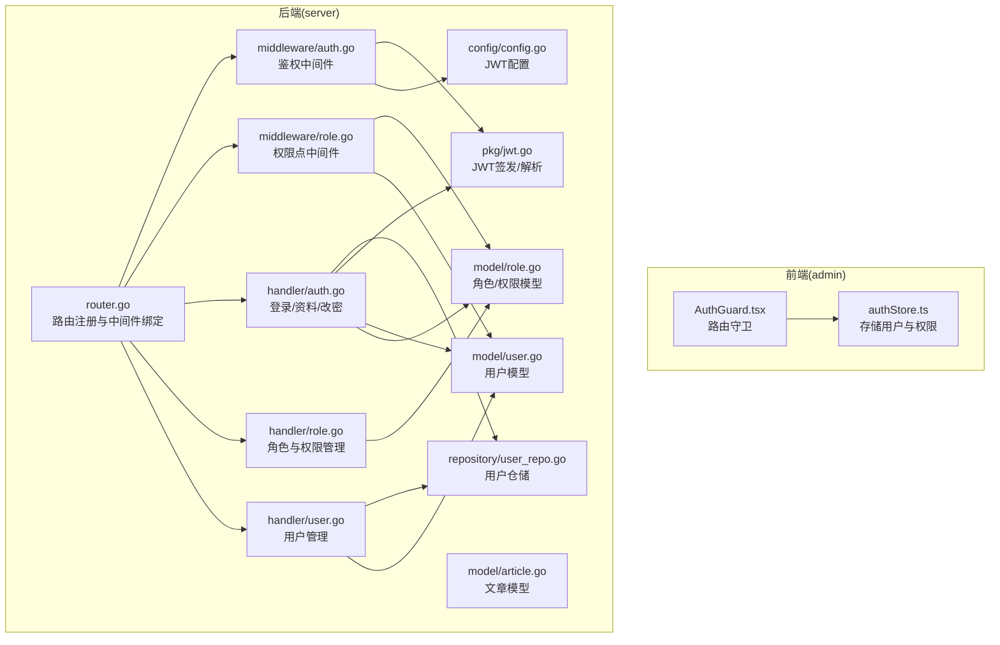
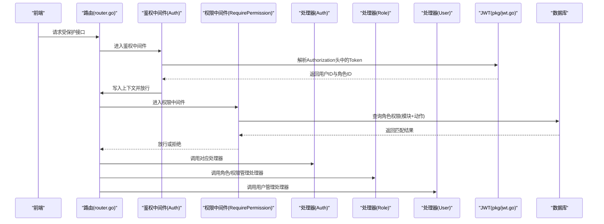
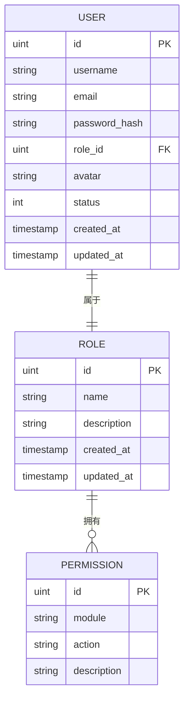
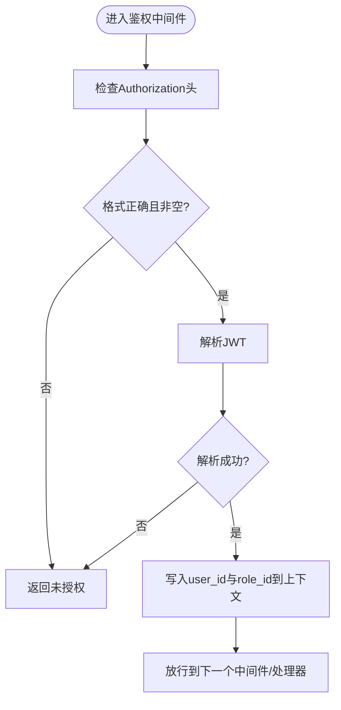
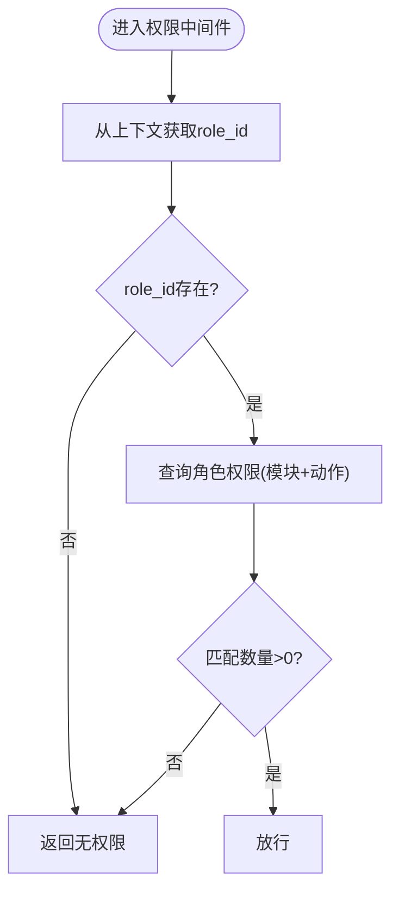
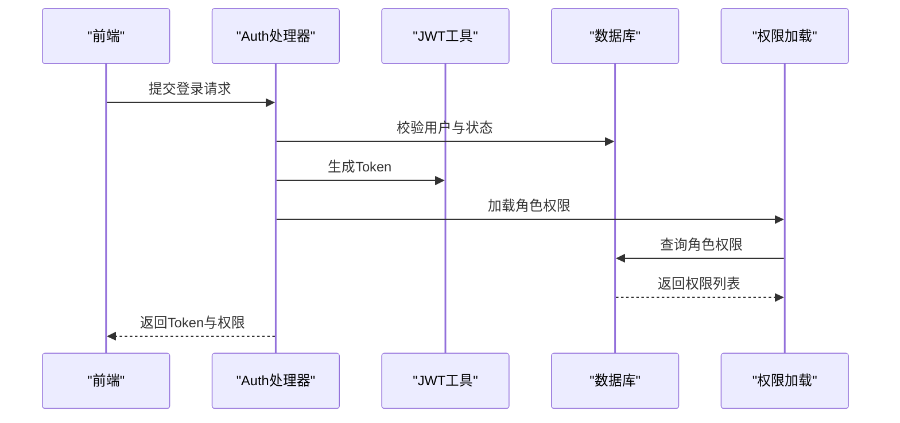
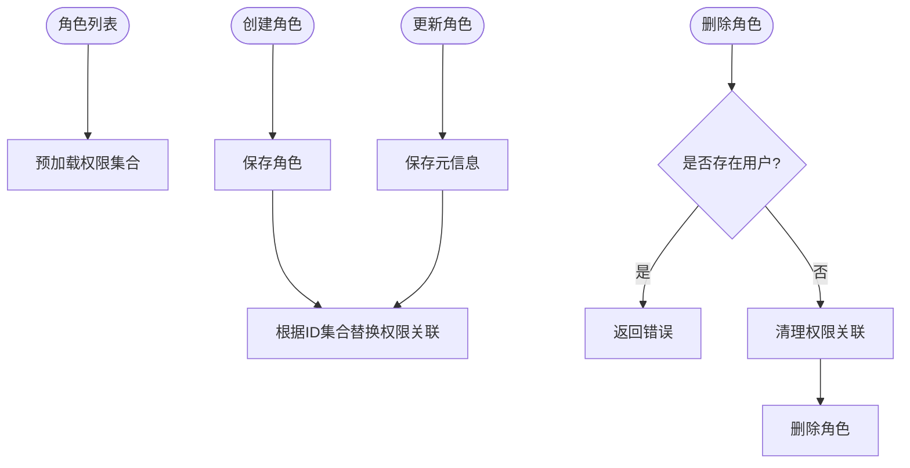
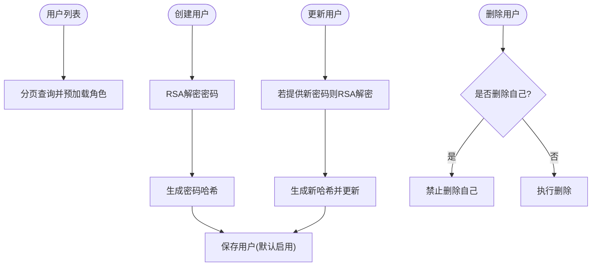
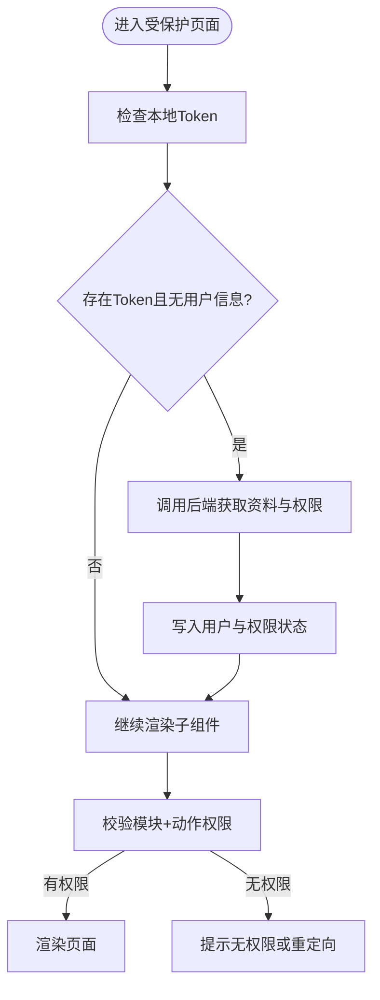
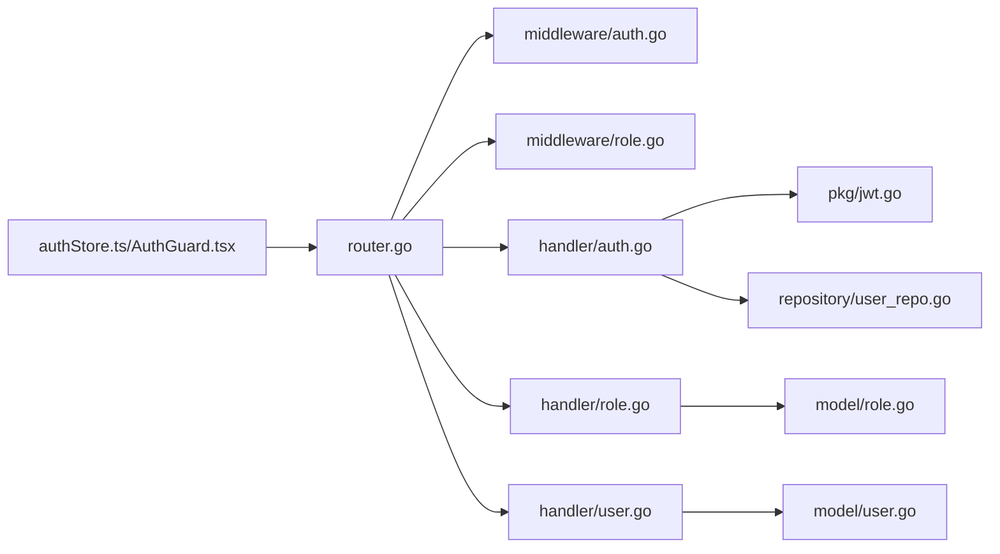

# RBAC权限控制

<cite>
**本文引用的文件**
- [server/internal/middleware/role.go](file://server/internal/middleware/role.go)
- [server/internal/middleware/auth.go](file://server/internal/middleware/auth.go)
- [server/internal/model/role.go](file://server/internal/model/role.go)
- [server/internal/model/user.go](file://server/internal/model/user.go)
- [server/internal/model/article.go](file://server/internal/model/article.go)
- [server/internal/handler/role.go](file://server/internal/handler/role.go)
- [server/internal/handler/auth.go](file://server/internal/handler/auth.go)
- [server/internal/handler/user.go](file://server/internal/handler/user.go)
- [server/internal/repository/user_repo.go](file://server/internal/repository/user_repo.go)
- [server/router/router.go](file://server/router/router.go)
- [server/internal/pkg/jwt.go](file://server/internal/pkg/jwt.go)
- [server/config/config.go](file://server/config/config.go)
- [webSource/apps/admin/src/store/authStore.ts](file://webSource/apps/admin/src/store/authStore.ts)
- [webSource/apps/admin/src/components/AuthGuard.tsx](file://webSource/apps/admin/src/components/AuthGuard.tsx)
</cite>

## 目录
1. [引言](#引言)
2. [项目结构](#项目结构)
3. [核心组件](#核心组件)
4. [架构总览](#架构总览)
5. [详细组件分析](#详细组件分析)
6. [依赖分析](#依赖分析)
7. [性能考虑](#性能考虑)
8. [故障排查指南](#故障排查指南)
9. [结论](#结论)
10. [附录](#附录)

## 引言
本文件面向RBAC（基于角色的访问控制）权限系统，系统采用“模块+动作”型权限模型，通过用户-角色-权限三层关系实现细粒度访问控制。后端使用Gin框架与GORM，前端使用React + Zustand 管理鉴权状态；权限校验在路由层以中间件方式注入，支持按模块与动作进行权限点校验。

## 项目结构
后端采用分层架构：router负责路由编排，handler处理业务请求，middleware提供鉴权与权限校验中间件，model定义数据模型，repository封装数据访问，service可扩展业务服务层。前端在admin应用中通过store维护用户与权限状态，并在路由层使用AuthGuard进行登录态与权限校验。

图示来源
- [server/router/router.go:11-104](file://server/router/router.go#L11-L104)
- [server/internal/middleware/auth.go:10-38](file://server/internal/middleware/auth.go#L10-L38)
- [server/internal/middleware/role.go:10-43](file://server/internal/middleware/role.go#L10-L43)
- [server/internal/handler/auth.go:13-163](file://server/internal/handler/auth.go#L13-L163)
- [server/internal/handler/role.go:14-111](file://server/internal/handler/role.go#L14-L111)
- [server/internal/handler/user.go:13-146](file://server/internal/handler/user.go#L13-L146)
- [server/internal/repository/user_repo.go:8-66](file://server/internal/repository/user_repo.go#L8-L66)
- [server/internal/model/role.go:5-20](file://server/internal/model/role.go#L5-L20)
- [server/internal/model/user.go:5-17](file://server/internal/model/user.go#L5-L17)
- [server/internal/model/article.go:5-24](file://server/internal/model/article.go#L5-L24)
- [server/internal/pkg/jwt.go:10-43](file://server/internal/pkg/jwt.go#L10-L43)
- [server/config/config.go:29-33](file://server/config/config.go#L29-L33)

章节来源
- [server/router/router.go:11-104](file://server/router/router.go#L11-L104)

## 核心组件
- 权限模型
  - 角色与权限：多对多关联，角色拥有若干权限点。
  - 权限点：由“模块+动作”构成唯一键，如“article:create”、“user:update”等。
- 用户与角色：用户属于一个角色，角色包含多个权限点。
- 鉴权中间件：从Authorization头解析JWT，提取用户ID与角色ID，写入上下文。
- 权限中间件：根据当前角色查询其权限集合，校验请求的模块+动作是否存在。

章节来源
- [server/internal/model/role.go:5-20](file://server/internal/model/role.go#L5-L20)
- [server/internal/model/user.go:5-17](file://server/internal/model/user.go#L5-L17)
- [server/internal/middleware/auth.go:10-38](file://server/internal/middleware/auth.go#L10-L38)
- [server/internal/middleware/role.go:10-43](file://server/internal/middleware/role.go#L10-L43)

## 架构总览
系统围绕“路由-中间件-处理器-仓储-模型”的链路工作。登录成功后返回用户信息与权限列表；后续每个受保护接口均需通过鉴权中间件与权限中间件；权限中间件会查询角色对应的权限集合，匹配模块+动作。

图示来源
- [server/router/router.go:44-102](file://server/router/router.go#L44-L102)
- [server/internal/middleware/auth.go:10-38](file://server/internal/middleware/auth.go#L10-L38)
- [server/internal/middleware/role.go:10-43](file://server/internal/middleware/role.go#L10-L43)
- [server/internal/handler/auth.go:31-93](file://server/internal/handler/auth.go#L31-L93)
- [server/internal/handler/role.go:22-54](file://server/internal/handler/role.go#L22-L54)
- [server/internal/handler/user.go:41-75](file://server/internal/handler/user.go#L41-L75)
- [server/internal/pkg/jwt.go:16-42](file://server/internal/pkg/jwt.go#L16-L42)

## 详细组件分析

### 数据模型与关系
- 用户模型包含角色ID与角色关联，便于直接获取用户角色。
- 角色模型包含权限集合，权限点由模块与动作组成，联合唯一索引保证不重复。
- 文章模型包含作者字段，用于资源级权限控制（如仅作者可编辑自己的文章）。

图示来源
- [server/internal/model/user.go:5-17](file://server/internal/model/user.go#L5-L17)
- [server/internal/model/role.go:5-20](file://server/internal/model/role.go#L5-L20)

章节来源
- [server/internal/model/user.go:5-17](file://server/internal/model/user.go#L5-L17)
- [server/internal/model/role.go:5-20](file://server/internal/model/role.go#L5-L20)
- [server/internal/model/article.go:5-24](file://server/internal/model/article.go#L5-L24)

### 鉴权中间件实现
- 从Authorization头解析Bare Token，解析失败则返回未授权。
- 使用JWT配置中的Secret与算法解析Token，成功后将用户ID与角色ID写入上下文供后续中间件与处理器使用。

图示来源
- [server/internal/middleware/auth.go:10-38](file://server/internal/middleware/auth.go#L10-L38)
- [server/internal/pkg/jwt.go:30-42](file://server/internal/pkg/jwt.go#L30-L42)
- [server/config/config.go:29-33](file://server/config/config.go#L29-L33)

章节来源
- [server/internal/middleware/auth.go:10-38](file://server/internal/middleware/auth.go#L10-L38)
- [server/internal/pkg/jwt.go:16-42](file://server/internal/pkg/jwt.go#L16-L42)
- [server/config/config.go:29-33](file://server/config/config.go#L29-L33)

### 权限检查中间件实现
- 从上下文读取角色ID，若缺失直接拒绝。
- 通过多表联接查询角色-权限关联表，统计满足“模块+动作”的记录数。
- 若计数为0，则拒绝访问；否则放行。

图示来源
- [server/internal/middleware/role.go:10-43](file://server/internal/middleware/role.go#L10-L43)

章节来源
- [server/internal/middleware/role.go:10-43](file://server/internal/middleware/role.go#L10-L43)

### 登录与权限下发
- 登录时先进行可选的验证码校验与RSA解密密码，再校验用户状态与密码哈希。
- 成功后签发JWT，并加载当前角色的所有权限点返回给前端。
- 前端将用户信息与权限保存至本地状态，供UI与路由守卫使用。

图示来源
- [server/internal/handler/auth.go:31-93](file://server/internal/handler/auth.go#L31-L93)
- [server/internal/middleware/role.go:37-42](file://server/internal/middleware/role.go#L37-L42)
- [server/internal/pkg/jwt.go:16-28](file://server/internal/pkg/jwt.go#L16-L28)

章节来源
- [server/internal/handler/auth.go:31-93](file://server/internal/handler/auth.go#L31-L93)
- [server/internal/middleware/role.go:37-42](file://server/internal/middleware/role.go#L37-L42)
- [server/internal/pkg/jwt.go:16-28](file://server/internal/pkg/jwt.go#L16-L28)

### 角色与权限管理
- 列表：预加载角色的权限集合返回。
- 创建：创建角色后，根据传入的权限ID集合替换角色的权限关联。
- 更新：更新角色元信息后，替换权限关联。
- 删除：若角色下仍有用户则拒绝删除；否则清理权限关联并删除角色。
- 权限列表：按模块与动作排序返回所有权限点。

图示来源
- [server/internal/handler/role.go:22-111](file://server/internal/handler/role.go#L22-L111)

章节来源
- [server/internal/handler/role.go:22-111](file://server/internal/handler/role.go#L22-L111)

### 用户管理与角色分配
- 列表：分页查询用户并预加载角色信息。
- 创建：RSA解密密码后生成哈希，创建用户并默认启用。
- 更新：支持修改邮箱、角色ID、状态与密码（需要RSA解密与哈希）。
- 删除：禁止删除自身，其余正常删除。

图示来源
- [server/internal/handler/user.go:25-146](file://server/internal/handler/user.go#L25-L146)
- [server/internal/repository/user_repo.go:59-66](file://server/internal/repository/user_repo.go#L59-L66)

章节来源
- [server/internal/handler/user.go:25-146](file://server/internal/handler/user.go#L25-L146)
- [server/internal/repository/user_repo.go:59-66](file://server/internal/repository/user_repo.go#L59-L66)

### 前端权限控制
- 认证状态：登录成功后将Token与用户信息、权限存入Zustand；登出时清除。
- 权限判断：通过hasPermission方法判断当前用户是否具备某模块+动作权限。
- 路由守卫：在首次有Token但无用户信息时拉取个人资料并填充权限；无Token则跳转登录。

图示来源
- [webSource/apps/admin/src/store/authStore.ts:15-34](file://webSource/apps/admin/src/store/authStore.ts#L15-L34)
- [webSource/apps/admin/src/components/AuthGuard.tsx:6-38](file://webSource/apps/admin/src/components/AuthGuard.tsx#L6-L38)

章节来源
- [webSource/apps/admin/src/store/authStore.ts:15-34](file://webSource/apps/admin/src/store/authStore.ts#L15-L34)
- [webSource/apps/admin/src/components/AuthGuard.tsx:6-38](file://webSource/apps/admin/src/components/AuthGuard.tsx#L6-L38)

## 依赖分析
- 路由层依赖中间件：鉴权中间件在所有受保护接口前执行；权限中间件按需绑定到具体模块+动作。
- 处理器依赖仓储与模型：用户与角色相关操作通过仓储访问数据库，权限点通过中间件加载。
- 中间件依赖JWT工具与配置：鉴权中间件依赖JWT解析，权限中间件依赖数据库查询。
- 前端依赖后端接口：登录、获取资料与权限，以及本地状态管理。

图示来源
- [server/router/router.go:11-104](file://server/router/router.go#L11-L104)
- [server/internal/middleware/auth.go:10-38](file://server/internal/middleware/auth.go#L10-L38)
- [server/internal/middleware/role.go:10-43](file://server/internal/middleware/role.go#L10-L43)
- [server/internal/handler/auth.go:13-163](file://server/internal/handler/auth.go#L13-L163)
- [server/internal/handler/role.go:14-111](file://server/internal/handler/role.go#L14-L111)
- [server/internal/handler/user.go:13-146](file://server/internal/handler/user.go#L13-L146)
- [server/internal/repository/user_repo.go:8-66](file://server/internal/repository/user_repo.go#L8-L66)
- [server/internal/pkg/jwt.go:10-43](file://server/internal/pkg/jwt.go#L10-L43)

章节来源
- [server/router/router.go:11-104](file://server/router/router.go#L11-L104)

## 性能考虑
- 权限查询：权限中间件每次都会查询角色权限，建议在处理器侧缓存当前用户的权限列表，避免重复查询。
- 预加载策略：角色列表与用户列表均使用预加载，减少N+1查询；可在高频接口进一步优化索引与分页。
- JWT开销：鉴权中间件每次解析Token有一定CPU开销，建议合理设置过期时间并启用HTTPOnly安全Cookie（如需）。
- 前端权限判断：前端hasPermission为O(n)遍历，建议在store内维护模块+动作到布尔值的映射以降低判断成本。

## 故障排查指南
- 401 未提供认证信息/认证格式错误
  - 检查请求头Authorization是否为Bearer Token格式。
  - 章节来源: [server/internal/middleware/auth.go:12-24](file://server/internal/middleware/auth.go#L12-L24)
- 401 认证已过期或无效
  - 检查JWT签名密钥与过期时间配置。
  - 章节来源: [server/internal/middleware/auth.go:26-31](file://server/internal/middleware/auth.go#L26-L31), [server/internal/pkg/jwt.go:30-42](file://server/internal/pkg/jwt.go#L30-L42), [server/config/config.go:29-33](file://server/config/config.go#L29-L33)
- 403 无权限
  - 检查当前角色是否具备对应模块+动作权限；确认权限点是否正确创建。
  - 章节来源: [server/internal/middleware/role.go:13-18](file://server/internal/middleware/role.go#L13-L18), [server/internal/middleware/role.go:20-31](file://server/internal/middleware/role.go#L20-L31)
- 登录失败/用户名或密码错误
  - 检查RSA解密与密码哈希是否正确；确认用户状态为启用。
  - 章节来源: [server/internal/handler/auth.go:57-71](file://server/internal/handler/auth.go#L57-L71)
- 创建/更新用户失败
  - 检查用户名/邮箱唯一性约束；确认RSA解密与哈希过程无误。
  - 章节来源: [server/internal/handler/user.go:41-75](file://server/internal/handler/user.go#L41-L75), [server/internal/handler/user.go:77-125](file://server/internal/handler/user.go#L77-L125)
- 删除角色失败
  - 检查是否存在用户仍绑定该角色；若存在则无法删除。
  - 章节来源: [server/internal/handler/role.go:89-95](file://server/internal/handler/role.go#L89-L95)

## 结论
本RBAC系统以“模块+动作”为核心权限模型，结合JWT鉴权与中间件式权限校验，实现了清晰的用户-角色-权限关系与细粒度访问控制。前端通过store统一管理权限状态，配合路由守卫实现UI层面的权限控制。建议在生产环境中引入权限缓存、更完善的审计日志与权限变更追踪，以提升性能与可观测性。

## 附录
- 最小权限原则
  - 为角色分配最少必要的权限点，避免过度授权。
- 权限分组
  - 将相似功能的模块+动作归类，便于角色批量授权与审计。
- 动态权限控制
  - 在处理器中根据资源归属（如文章作者）进行二次校验，确保越权访问被阻止。
- 自定义权限类型
  - 可扩展权限点的描述字段或新增权限维度（如资源ID范围），并在中间件与处理器中同步校验。
- 权限过滤器
  - 在列表接口中根据当前用户权限过滤可见资源，避免泄露不可见数据。
- 审计与监控
  - 记录登录、权限校验失败、角色/权限变更等事件；对高风险操作增加二次确认与审批流程。