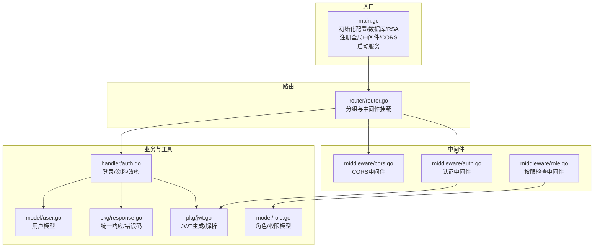
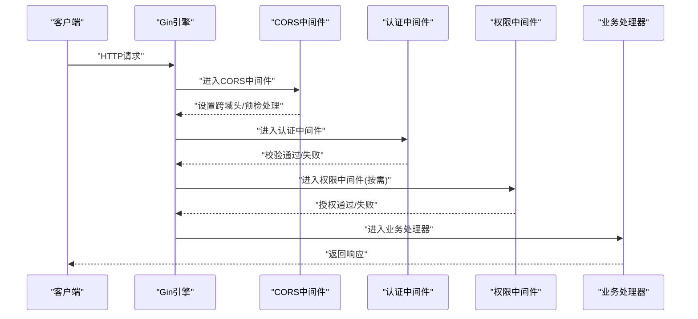
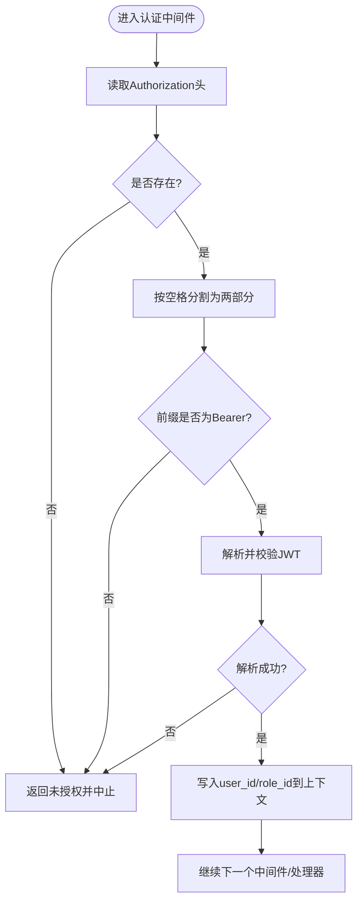
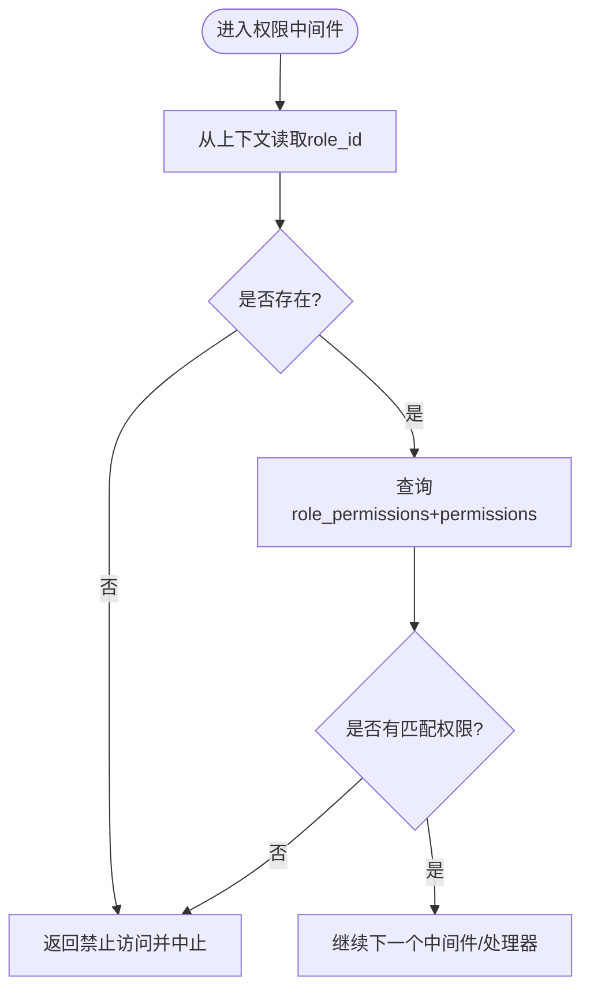
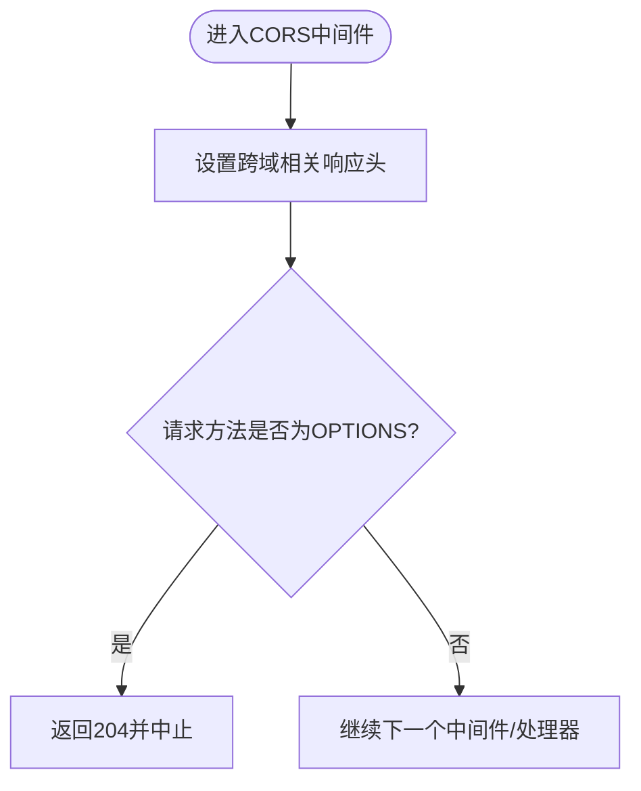
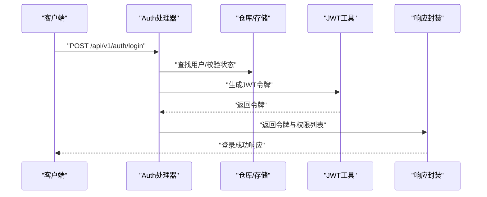
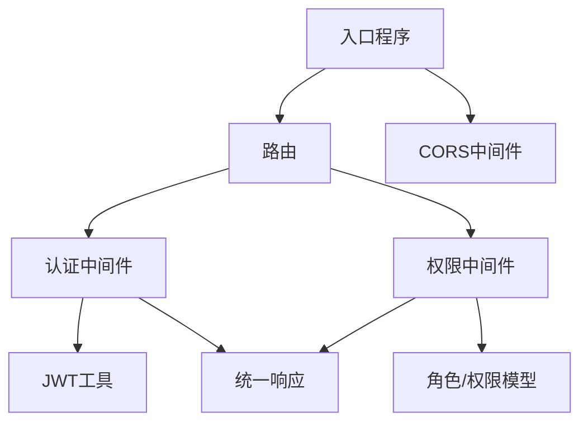

# 中间件安全控制

<cite>
**本文引用的文件**
- [server/main.go](file://server/main.go)
- [server/router/router.go](file://server/router/router.go)
- [server/internal/middleware/auth.go](file://server/internal/middleware/auth.go)
- [server/internal/middleware/cors.go](file://server/internal/middleware/cors.go)
- [server/internal/middleware/role.go](file://server/internal/middleware/role.go)
- [server/internal/pkg/jwt.go](file://server/internal/pkg/jwt.go)
- [server/internal/pkg/response.go](file://server/internal/pkg/response.go)
- [server/internal/handler/auth.go](file://server/internal/handler/auth.go)
- [server/internal/model/role.go](file://server/internal/model/role.go)
- [server/internal/model/user.go](file://server/internal/model/user.go)
</cite>

## 目录
1. [引言](#引言)
2. [项目结构](#项目结构)
3. [核心组件](#核心组件)
4. [架构总览](#架构总览)
5. [详细组件分析](#详细组件分析)
6. [依赖分析](#依赖分析)
7. [性能考量](#性能考量)
8. [故障排查指南](#故障排查指南)
9. [结论](#结论)
10. [附录](#附录)

## 引言
本文件系统性梳理后端中间件安全控制体系，围绕 Gin 框架中间件的工作原理与执行顺序展开，重点覆盖以下方面：
- 中间件链的构建与请求处理流程
- 认证中间件：请求头解析、令牌验证、用户上下文注入
- 权限检查中间件：权限映射、访问控制与错误处理
- CORS 跨域处理中间件：配置与安全注意事项
- 中间件组合最佳实践：执行顺序优化与性能考虑
- 自定义中间件开发指南：接口规范、错误处理与日志记录
- 安全漏洞预防与常见攻击防护

## 项目结构
后端采用分层架构，路由在 router 层注册，中间件在 middleware 层实现，业务处理器在 handler 层，数据模型与工具在 model 与 pkg 层。入口程序 main.go 初始化配置、数据库、迁移与 RSA 密钥，随后注册全局中间件（CORS）与路由。

图表来源
- [server/main.go:59-69](file://server/main.go#L59-L69)
- [server/router/router.go:11-103](file://server/router/router.go#L11-L103)
- [server/internal/middleware/auth.go:10-37](file://server/internal/middleware/auth.go#L10-L37)
- [server/internal/middleware/cors.go:7-21](file://server/internal/middleware/cors.go#L7-L21)
- [server/internal/middleware/role.go:10-35](file://server/internal/middleware/role.go#L10-L35)
- [server/internal/pkg/jwt.go:16-42](file://server/internal/pkg/jwt.go#L16-L42)
- [server/internal/pkg/response.go:22-69](file://server/internal/pkg/response.go#L22-L69)
- [server/internal/handler/auth.go:31-93](file://server/internal/handler/auth.go#L31-L93)
- [server/internal/model/user.go:5-16](file://server/internal/model/user.go#L5-L16)
- [server/internal/model/role.go:5-19](file://server/internal/model/role.go#L5-L19)

章节来源
- [server/main.go:19-76](file://server/main.go#L19-L76)
- [server/router/router.go:11-103](file://server/router/router.go#L11-L103)

## 核心组件
- 认证中间件：从 Authorization 请求头解析 Bearer 令牌，校验格式与签名，成功则将用户与角色信息写入上下文供后续处理器使用。
- 权限检查中间件：基于角色与模块动作进行权限匹配，若无权限直接返回禁止访问。
- CORS 中间件：设置跨域相关响应头，对预检请求快速返回。
- 统一响应与错误码：封装标准 JSON 响应结构与各类 HTTP 错误码输出。
- JWT 工具：生成与解析携带用户 ID 与角色 ID 的令牌。

章节来源
- [server/internal/middleware/auth.go:10-37](file://server/internal/middleware/auth.go#L10-L37)
- [server/internal/middleware/role.go:10-35](file://server/internal/middleware/role.go#L10-L35)
- [server/internal/middleware/cors.go:7-21](file://server/internal/middleware/cors.go#L7-L21)
- [server/internal/pkg/response.go:22-69](file://server/internal/pkg/response.go#L22-L69)
- [server/internal/pkg/jwt.go:16-42](file://server/internal/pkg/jwt.go#L16-L42)

## 架构总览
下图展示从客户端到处理器的完整调用链，以及中间件在链路中的位置与职责。

图表来源
- [server/main.go:61-62](file://server/main.go#L61-L62)
- [server/router/router.go:46](file://server/router/router.go#L46)
- [server/internal/middleware/auth.go:10-37](file://server/internal/middleware/auth.go#L10-L37)
- [server/internal/middleware/role.go:10-35](file://server/internal/middleware/role.go#L10-L35)

## 详细组件分析

### 认证中间件（Authorization）
- 请求头解析：读取 Authorization 头，要求格式为 Bearer <token>。
- 令牌验证：使用 JWT 工具解析并校验签名与有效期。
- 上下文注入：将用户 ID 与角色 ID 写入上下文，供后续中间件与处理器使用。
- 失败处理：未提供或格式错误、解析失败时返回未授权并中止后续处理。

图表来源
- [server/internal/middleware/auth.go:10-37](file://server/internal/middleware/auth.go#L10-L37)
- [server/internal/pkg/jwt.go:30-42](file://server/internal/pkg/jwt.go#L30-L42)

章节来源
- [server/internal/middleware/auth.go:10-37](file://server/internal/middleware/auth.go#L10-L37)
- [server/internal/pkg/jwt.go:16-42](file://server/internal/pkg/jwt.go#L16-L42)

### 权限检查中间件（RequirePermission）
- 上下文读取：从上下文获取角色 ID。
- 数据库查询：通过多表关联查询角色是否具备指定模块与动作的权限。
- 授权判定：若无匹配权限，返回禁止访问并中止；否则放行。
- 辅助函数：加载某角色的所有权限列表，用于登录后返回给前端。

图表来源
- [server/internal/middleware/role.go:10-35](file://server/internal/middleware/role.go#L10-L35)
- [server/internal/model/role.go:5-19](file://server/internal/model/role.go#L5-L19)

章节来源
- [server/internal/middleware/role.go:10-35](file://server/internal/middleware/role.go#L10-L35)
- [server/internal/model/role.go:5-19](file://server/internal/model/role.go#L5-L19)

### CORS 跨域中间件
- 允许源：设置为通配符，便于前端开发调试。
- 方法与头部：允许常用方法与必要的鉴权头部。
- 预检请求：对 OPTIONS 预检请求直接返回状态码并中止后续处理。
- 安全建议：生产环境建议限定具体源，避免通配符带来的风险。

图表来源
- [server/internal/middleware/cors.go:7-21](file://server/internal/middleware/cors.go#L7-L21)

章节来源
- [server/internal/middleware/cors.go:7-21](file://server/internal/middleware/cors.go#L7-L21)

### 路由与中间件组合
- 全局中间件：在入口处注册 CORS，确保所有路由均受跨域策略约束。
- 分组与局部中间件：在 /api/v1 下为需要鉴权的资源组挂载认证中间件；在具体路由上按需挂载权限中间件。
- 执行顺序：CORS → 认证 → 权限 → 处理器。

图表来源
- [server/main.go:61-62](file://server/main.go#L61-L62)
- [server/router/router.go:46](file://server/router/router.go#L46)
- [server/router/router.go:58-97](file://server/router/router.go#L58-L97)

章节来源
- [server/router/router.go:11-103](file://server/router/router.go#L11-L103)
- [server/main.go:59-69](file://server/main.go#L59-L69)

### 登录流程与权限下发
- 登录处理器接收用户名与加密后的密码，校验验证码（可选）、用户状态与密码哈希。
- 成功后生成 JWT 并返回给前端，同时查询该角色的全部权限列表返回给前端。
- 前端在后续请求中携带 Bearer 令牌，认证中间件负责解析并注入上下文。

图表来源
- [server/internal/handler/auth.go:31-93](file://server/internal/handler/auth.go#L31-L93)
- [server/internal/pkg/jwt.go:16-28](file://server/internal/pkg/jwt.go#L16-L28)
- [server/internal/pkg/response.go:22-41](file://server/internal/pkg/response.go#L22-L41)

章节来源
- [server/internal/handler/auth.go:31-93](file://server/internal/handler/auth.go#L31-L93)
- [server/internal/pkg/jwt.go:16-28](file://server/internal/pkg/jwt.go#L16-L28)
- [server/internal/pkg/response.go:22-41](file://server/internal/pkg/response.go#L22-L41)

## 依赖分析
- 认证中间件依赖 JWT 工具进行令牌解析，并通过统一响应工具输出错误。
- 权限中间件依赖角色/权限模型与数据库查询，结合处理器提供的角色权限加载辅助函数。
- 路由层在不同分组与路由上挂载中间件，形成“全局 -> 分组 -> 路由”的链式调用。
- 入口程序注册全局 CORS 中间件，保证所有请求均受跨域策略约束。

图表来源
- [server/internal/middleware/auth.go:10-37](file://server/internal/middleware/auth.go#L10-L37)
- [server/internal/middleware/role.go:10-35](file://server/internal/middleware/role.go#L10-L35)
- [server/internal/pkg/jwt.go:30-42](file://server/internal/pkg/jwt.go#L30-L42)
- [server/internal/pkg/response.go:22-69](file://server/internal/pkg/response.go#L22-L69)
- [server/router/router.go:11-103](file://server/router/router.go#L11-L103)
- [server/main.go:61-62](file://server/main.go#L61-L62)

章节来源
- [server/internal/middleware/auth.go:10-37](file://server/internal/middleware/auth.go#L10-L37)
- [server/internal/middleware/role.go:10-35](file://server/internal/middleware/role.go#L10-L35)
- [server/internal/pkg/jwt.go:30-42](file://server/internal/pkg/jwt.go#L30-L42)
- [server/internal/pkg/response.go:22-69](file://server/internal/pkg/response.go#L22-L69)
- [server/router/router.go:11-103](file://server/router/router.go#L11-L103)
- [server/main.go:61-62](file://server/main.go#L61-L62)

## 性能考量
- 中间件顺序优化：将轻量且可快速失败的中间件（如 CORS、认证）置于链路前端，尽早拒绝无效请求。
- 权限查询缓存：对角色权限查询结果进行缓存，减少数据库压力；在角色或权限变更时失效缓存。
- 令牌解析复用：避免重复解析同一令牌，可在处理器中复用已解析的上下文信息。
- 日志与指标：为关键中间件增加耗时统计与错误计数，便于定位性能瓶颈。
- 静态资源与上传目录：静态文件与上传目录独立部署与缓存，降低主业务中间件负担。

## 故障排查指南
- 未提供认证信息或格式错误：认证中间件会返回未授权并中止，检查前端是否正确携带 Bearer 令牌。
- 令牌过期或无效：JWT 解析失败导致未授权，检查令牌有效期与签发方配置。
- 无权限访问：权限中间件返回禁止访问，检查角色与模块动作映射是否正确。
- CORS 阻断：生产环境若出现跨域问题，检查允许源、方法与头部配置。
- 统一错误响应：通过统一响应工具输出标准化错误，便于前端与监控系统识别。

章节来源
- [server/internal/middleware/auth.go:13-31](file://server/internal/middleware/auth.go#L13-L31)
- [server/internal/middleware/role.go:14-31](file://server/internal/middleware/role.go#L14-L31)
- [server/internal/pkg/response.go:55-61](file://server/internal/pkg/response.go#L55-L61)

## 结论
本项目以 Gin 中间件为核心的安全控制体系，通过“全局 CORS → 认证 → 权限 → 处理器”的链路实现了清晰的请求拦截与授权控制。认证中间件负责令牌解析与上下文注入，权限中间件基于角色与模块动作进行细粒度授权，CORS 中间件保障跨域访问安全可控。配合统一响应与错误处理机制，整体具备良好的可维护性与扩展性。建议在生产环境中进一步收紧 CORS 策略、引入权限缓存与日志指标，持续提升安全性与性能。

## 附录

### 自定义中间件开发指南
- 接口规范：遵循 Gin 中间件函数签名，返回 gin.HandlerFunc，并在必要时调用 c.Next() 放行。
- 错误处理：使用统一响应工具输出标准化错误，避免泄露敏感信息。
- 日志记录：在关键节点记录请求 ID、用户 ID、中间件名称与耗时，便于审计与排障。
- 安全原则：最小权限、早失败、不可信输入、严格校验。

### 安全漏洞预防与常见攻击防护
- 认证绕过：严格校验 Authorization 头格式与令牌签名，避免明文传输敏感信息。
- 权限提升：权限检查必须基于角色与模块动作的强约束，避免宽泛授权。
- CORS 泄漏：生产环境限制允许源，避免通配符带来的跨站风险。
- 令牌滥用：缩短令牌有效期、启用刷新机制、定期轮换密钥。
- 输入验证：对所有外部输入进行白名单校验与长度限制，防止注入与越权。