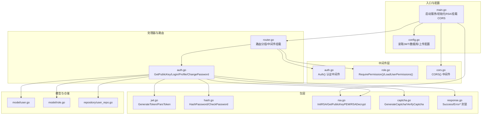
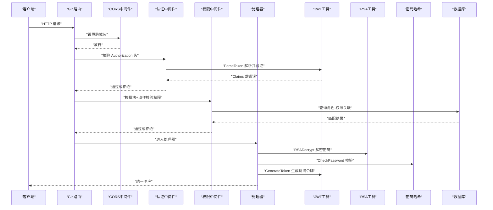
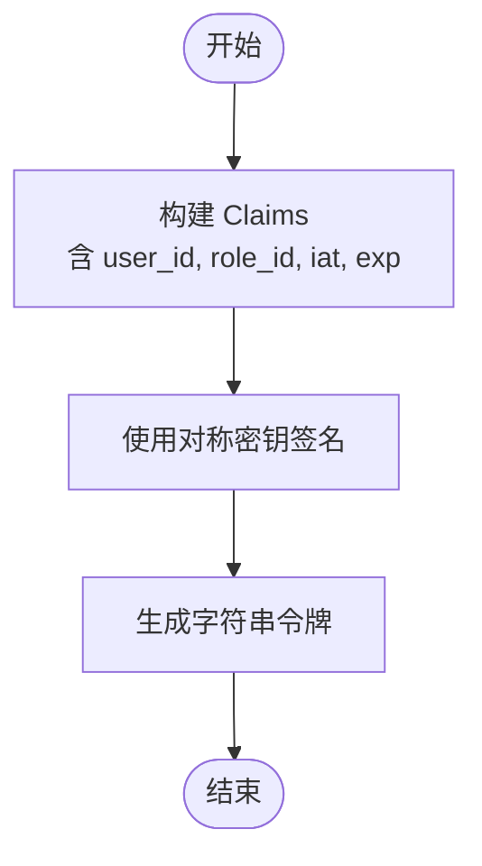
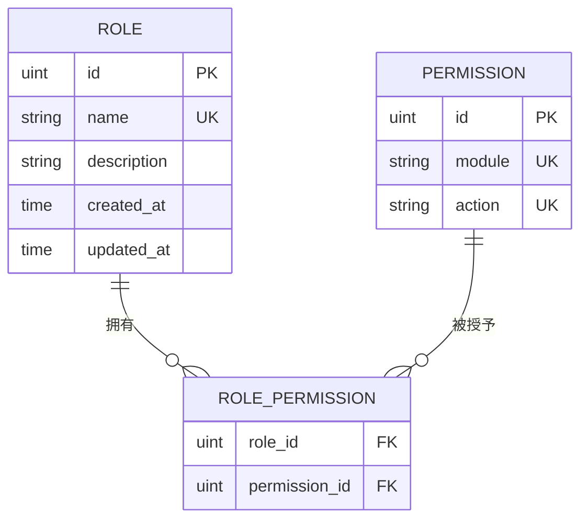
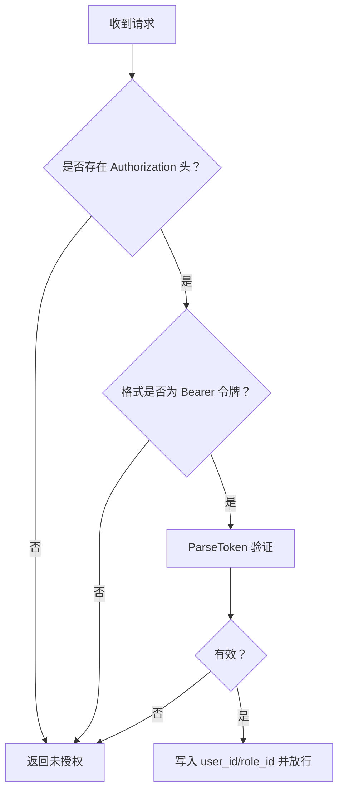
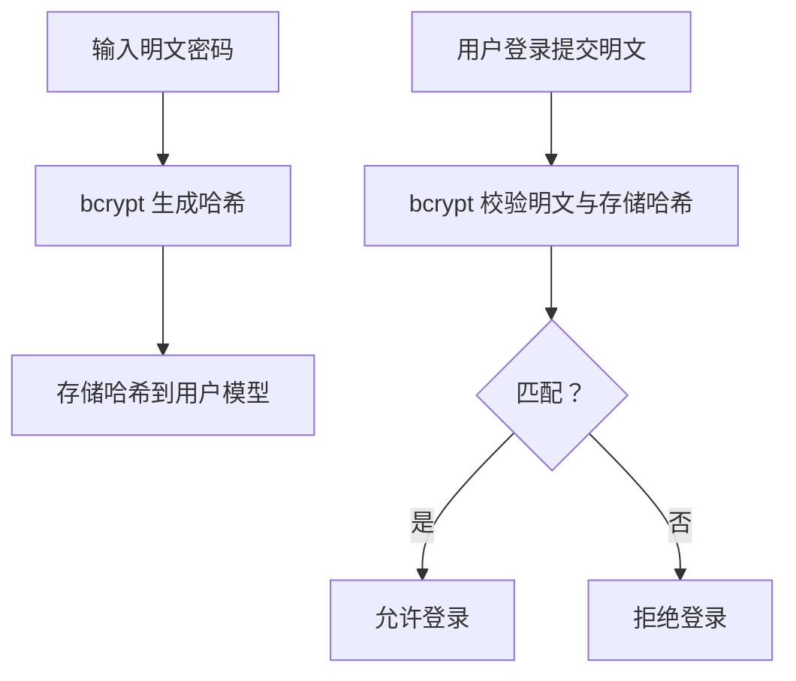
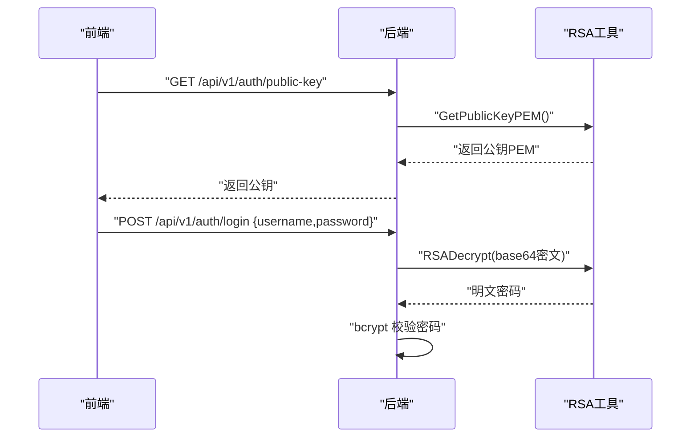
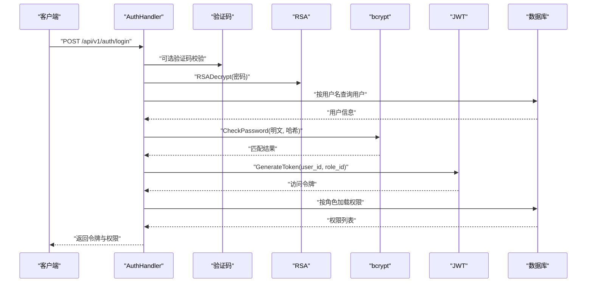
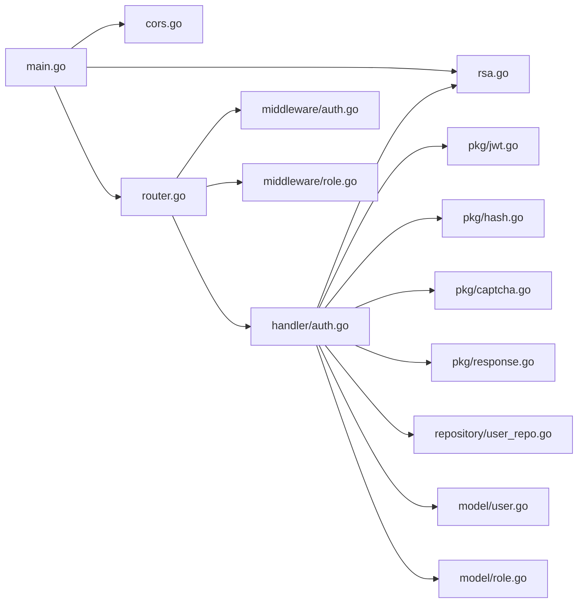

# 安全与认证

<cite>
**本文引用的文件**
- [server/main.go](file://server/main.go)
- [server/config/config.go](file://server/config/config.go)
- [server/internal/pkg/jwt.go](file://server/internal/pkg/jwt.go)
- [server/internal/middleware/auth.go](file://server/internal/middleware/auth.go)
- [server/internal/middleware/role.go](file://server/internal/middleware/role.go)
- [server/internal/middleware/cors.go](file://server/internal/middleware/cors.go)
- [server/internal/pkg/hash.go](file://server/internal/pkg/hash.go)
- [server/internal/pkg/rsa.go](file://server/internal/pkg/rsa.go)
- [server/internal/handler/auth.go](file://server/internal/handler/auth.go)
- [server/router/router.go](file://server/router/router.go)
- [server/internal/pkg/response.go](file://server/internal/pkg/response.go)
- [server/internal/pkg/captcha.go](file://server/internal/pkg/captcha.go)
- [server/internal/model/role.go](file://server/internal/model/role.go)
- [server/internal/model/user.go](file://server/internal/model/user.go)
- [server/internal/repository/user_repo.go](file://server/internal/repository/user_repo.go)
</cite>

## 目录
1. [引言](#引言)
2. [项目结构](#项目结构)
3. [核心组件](#核心组件)
4. [架构总览](#架构总览)
5. [详细组件分析](#详细组件分析)
6. [依赖分析](#依赖分析)
7. [性能考虑](#性能考虑)
8. [故障排查指南](#故障排查指南)
9. [结论](#结论)
10. [附录](#附录)

## 引言
本文件面向Xiangmuzs博客平台的安全与认证体系，系统性阐述以下主题：
- JWT认证机制：令牌生成、签名验证、过期处理与配置要点
- RBAC权限模型：角色定义、权限分配与访问控制策略
- 中间件体系：认证中间件、权限检查中间件、CORS处理中间件的作用与集成方式
- 密码加密与存储：bcrypt哈希算法与盐值管理
- RSA加密：公私钥生成、敏感数据传输保护（如登录密码）
- 安全最佳实践：输入验证、SQL注入防护、XSS防护、CSRF防护
- 会话与令牌刷新：当前实现状态与改进建议
- 审计与日志：现有返回封装与建议的日志记录方案
- 常见威胁防护与应急响应：基于代码实现的现状与加固建议

## 项目结构
后端采用Gin框架与GORM进行路由、数据库与业务处理，安全相关能力集中在以下模块：
- 配置层：加载JWT密钥、过期时间等安全配置
- 包层：JWT工具、密码哈希、RSA加解密、验证码生成与校验、统一响应封装
- 中间件层：认证、权限检查、CORS
- 处理器层：认证登录、个人资料、修改密码等接口
- 路由层：公开接口、认证接口、受控接口的分组与中间件挂载
- 模型与仓储：用户、角色、权限的数据结构与持久化

图表来源
- [server/main.go:19-76](file://server/main.go#L19-L76)
- [server/config/config.go:47-64](file://server/config/config.go#L47-L64)
- [server/internal/pkg/jwt.go:16-42](file://server/internal/pkg/jwt.go#L16-L42)
- [server/internal/pkg/hash.go:5-13](file://server/internal/pkg/hash.go#L5-L13)
- [server/internal/pkg/rsa.go:18-53](file://server/internal/pkg/rsa.go#L18-L53)
- [server/internal/pkg/captcha.go:24-58](file://server/internal/pkg/captcha.go#L24-L58)
- [server/internal/pkg/response.go:22-69](file://server/internal/pkg/response.go#L22-L69)
- [server/internal/middleware/auth.go:10-37](file://server/internal/middleware/auth.go#L10-L37)
- [server/internal/middleware/role.go:10-42](file://server/internal/middleware/role.go#L10-L42)
- [server/internal/middleware/cors.go:7-21](file://server/internal/middleware/cors.go#L7-L21)
- [server/internal/handler/auth.go:27-93](file://server/internal/handler/auth.go#L27-L93)
- [server/router/router.go:11-103](file://server/router/router.go#L11-L103)
- [server/internal/model/user.go:5-16](file://server/internal/model/user.go#L5-L16)
- [server/internal/model/role.go:5-19](file://server/internal/model/role.go#L5-L19)
- [server/internal/repository/user_repo.go:24-34](file://server/internal/repository/user_repo.go#L24-L34)

章节来源
- [server/main.go:19-76](file://server/main.go#L19-L76)
- [server/router/router.go:11-103](file://server/router/router.go#L11-L103)

## 核心组件
- JWT认证工具：提供Claims结构体、令牌生成与解析函数，使用对称签名与配置化的密钥与过期时间
- 认证中间件：从请求头提取Bearer令牌，调用解析函数验证有效性，并将用户标识写入上下文
- 权限中间件：基于角色-权限关联表进行模块+动作级权限校验
- 密码哈希：bcrypt用于密码存储，自动处理盐值
- RSA加解密：运行时生成RSA密钥对，暴露公钥给前端，后端使用私钥解密敏感数据
- 验证码：服务端生成图片验证码，内存缓存并校验，支持过期控制
- 统一响应：封装标准响应结构，便于前后端一致处理错误码与消息

章节来源
- [server/internal/pkg/jwt.go:10-42](file://server/internal/pkg/jwt.go#L10-L42)
- [server/internal/middleware/auth.go:10-37](file://server/internal/middleware/auth.go#L10-L37)
- [server/internal/middleware/role.go:10-42](file://server/internal/middleware/role.go#L10-L42)
- [server/internal/pkg/hash.go:5-13](file://server/internal/pkg/hash.go#L5-L13)
- [server/internal/pkg/rsa.go:18-53](file://server/internal/pkg/rsa.go#L18-L53)
- [server/internal/pkg/captcha.go:24-58](file://server/internal/pkg/captcha.go#L24-L58)
- [server/internal/pkg/response.go:22-69](file://server/internal/pkg/response.go#L22-L69)

## 架构总览
下图展示了从客户端到后端各层的安全交互路径，重点体现认证、权限与敏感数据保护：

图表来源
- [server/router/router.go:44-102](file://server/router/router.go#L44-L102)
- [server/internal/middleware/auth.go:10-37](file://server/internal/middleware/auth.go#L10-L37)
- [server/internal/middleware/role.go:10-35](file://server/internal/middleware/role.go#L10-L35)
- [server/internal/handler/auth.go:31-93](file://server/internal/handler/auth.go#L31-L93)
- [server/internal/pkg/jwt.go:16-42](file://server/internal/pkg/jwt.go#L16-L42)
- [server/internal/pkg/rsa.go:43-53](file://server/internal/pkg/rsa.go#L43-L53)
- [server/internal/pkg/hash.go:10-13](file://server/internal/pkg/hash.go#L10-L13)

## 详细组件分析

### JWT认证机制
- 令牌生成
  - Claims包含用户ID、角色ID以及注册声明（签发时间、过期时间）
  - 使用对称签名算法，密钥来自配置；过期时间来自配置项
- 令牌解析
  - 从请求头中提取Bearer令牌
  - 使用相同密钥与算法进行验证，返回Claims或错误
- 过期处理
  - 服务器端在解析阶段即判定过期，过期或无效时返回未授权

图表来源
- [server/internal/pkg/jwt.go:16-28](file://server/internal/pkg/jwt.go#L16-L28)

章节来源
- [server/internal/pkg/jwt.go:10-42](file://server/internal/pkg/jwt.go#L10-L42)
- [server/config/config.go:29-33](file://server/config/config.go#L29-L33)

### RBAC权限模型
- 角色与权限
  - 角色模型包含名称、描述与多对多权限集合
  - 权限模型包含模块与动作的唯一组合
- 权限校验
  - 中间件通过角色ID查询角色-权限关联表，匹配模块与动作
  - 未匹配则返回禁止访问
- 权限加载
  - 提供按角色加载全部权限的方法，供登录后返回给前端

图表来源
- [server/internal/model/role.go:5-19](file://server/internal/model/role.go#L5-L19)

章节来源
- [server/internal/middleware/role.go:10-42](file://server/internal/middleware/role.go#L10-L42)
- [server/internal/model/role.go:5-19](file://server/internal/model/role.go#L5-L19)

### 中间件体系
- 认证中间件
  - 校验Authorization头格式与存在性
  - 调用JWT解析，成功后将user_id与role_id写入上下文
- 权限中间件
  - 从上下文读取role_id，查询模块+动作权限
  - 未授权直接返回
- CORS中间件
  - 设置允许源、方法、头部与预检缓存
  - 对OPTIONS请求快速返回

图表来源
- [server/internal/middleware/auth.go:10-37](file://server/internal/middleware/auth.go#L10-L37)

章节来源
- [server/internal/middleware/auth.go:10-37](file://server/internal/middleware/auth.go#L10-L37)
- [server/internal/middleware/role.go:10-35](file://server/internal/middleware/role.go#L10-L35)
- [server/internal/middleware/cors.go:7-21](file://server/internal/middleware/cors.go#L7-L21)

### 密码加密与存储
- 算法选择：bcrypt
- 盐值管理：由bcrypt库自动生成并嵌入最终哈希值
- 存储策略：用户模型字段保存完整哈希字符串
- 校验流程：比较输入明文与存储哈希

图表来源
- [server/internal/pkg/hash.go:5-13](file://server/internal/pkg/hash.go#L5-L13)
- [server/internal/model/user.go:9](file://server/internal/model/user.go#L9)

章节来源
- [server/internal/pkg/hash.go:5-13](file://server/internal/pkg/hash.go#L5-L13)
- [server/internal/model/user.go:9](file://server/internal/model/user.go#L9)

### RSA加密与敏感数据处理
- 公私钥生成：运行时生成2048位RSA密钥对，导出公钥PEM
- 公钥暴露：登录接口返回公钥给前端
- 数据加解密：前端使用公钥加密敏感数据，后端使用私钥解密
- 安全要点：仅在内存中持有私钥，不落盘；避免在日志中输出密钥材料

图表来源
- [server/internal/handler/auth.go:27-55](file://server/internal/handler/auth.go#L27-L55)
- [server/internal/pkg/rsa.go:39-53](file://server/internal/pkg/rsa.go#L39-L53)

章节来源
- [server/internal/pkg/rsa.go:18-53](file://server/internal/pkg/rsa.go#L18-L53)
- [server/internal/handler/auth.go:27-55](file://server/internal/handler/auth.go#L27-L55)

### 登录与权限返回流程
- 登录接口
  - 可选验证码校验
  - 使用RSA私钥解密密码
  - 校验用户状态与密码
  - 生成JWT访问令牌
  - 加载并返回用户权限列表
- 个人资料与修改密码
  - 个人资料接口按角色加载权限
  - 修改密码接口同样使用RSA解密旧/新密码并校验

图表来源
- [server/internal/handler/auth.go:31-93](file://server/internal/handler/auth.go#L31-L93)
- [server/internal/middleware/role.go:37-42](file://server/internal/middleware/role.go#L37-L42)

章节来源
- [server/internal/handler/auth.go:31-93](file://server/internal/handler/auth.go#L31-L93)
- [server/internal/middleware/role.go:37-42](file://server/internal/middleware/role.go#L37-L42)

### 路由与中间件挂载
- 公开接口：无需认证
- 认证接口：统一挂载认证中间件
- 受控接口：在对应路由上挂载权限中间件，按模块与动作控制
- CORS：全局挂载，处理跨域与预检

章节来源
- [server/router/router.go:24-102](file://server/router/router.go#L24-L102)
- [server/internal/middleware/cors.go:7-21](file://server/internal/middleware/cors.go#L7-L21)

## 依赖分析
- 组件耦合
  - 认证中间件依赖JWT工具与统一响应
  - 权限中间件依赖GORM与角色模型
  - 处理器依赖仓库、配置、工具与响应封装
  - 主程序负责初始化RSA与挂载CORS
- 外部依赖
  - Gin路由与中间件生态
  - GORM ORM与MySQL驱动
  - Viper配置读取
  - bcrypt、RSA、JWT第三方库

图表来源
- [server/main.go:49-62](file://server/main.go#L49-L62)
- [server/router/router.go:11-25](file://server/router/router.go#L11-L25)
- [server/internal/handler/auth.go:13-25](file://server/internal/handler/auth.go#L13-L25)

章节来源
- [server/main.go:49-62](file://server/main.go#L49-L62)
- [server/router/router.go:11-25](file://server/router/router.go#L11-L25)

## 性能考虑
- JWT解析：单次密钥验证，成本极低
- bcrypt：默认成本适中，若并发量大可评估成本参数与硬件资源
- RSA：解密在CPU侧完成，建议限制请求频率与超时
- CORS：静态头部设置，开销很小
- 权限查询：按角色一次性加载权限，减少多次查询

## 故障排查指南
- 未提供认证信息或格式错误
  - 现象：返回未授权
  - 排查：确认Authorization头格式为Bearer
- 令牌过期或无效
  - 现象：返回未授权
  - 排查：检查服务器时间同步、密钥一致性、过期时间配置
- 无权限执行操作
  - 现象：返回禁止访问
  - 排查：确认角色是否绑定目标模块+动作权限
- 密码解密失败
  - 现象：返回参数错误
  - 排查：确认前端使用正确公钥加密、后端RSA初始化成功
- 用户名或密码错误
  - 现象：返回未授权
  - 排查：确认用户状态正常、bcrypt哈希匹配
- 验证码错误或过期
  - 现象：返回参数错误
  - 排查：确认验证码ID与过期时间

章节来源
- [server/internal/middleware/auth.go:13-31](file://server/internal/middleware/auth.go#L13-L31)
- [server/internal/middleware/role.go:14-31](file://server/internal/middleware/role.go#L14-L31)
- [server/internal/handler/auth.go:40-71](file://server/internal/handler/auth.go#L40-L71)
- [server/internal/pkg/captcha.go:48-58](file://server/internal/pkg/captcha.go#L48-L58)

## 结论
Xiangmuzs博客平台的安全体系以JWT认证为核心，结合bcrypt密码存储、RSA敏感数据保护与模块+动作级RBAC权限控制，配合CORS中间件与统一响应封装，形成了较为完整的后端安全基线。建议后续在令牌刷新、审计日志、输入验证与CSRF防护等方面进一步完善。

## 附录

### 安全最佳实践清单
- 输入验证
  - 对所有请求参数进行类型与范围校验，必要时引入白名单策略
- SQL注入防护
  - 已使用GORM ORM，避免原生SQL拼接；如需复杂SQL，使用参数化查询
- XSS防护
  - 前端渲染时对输出内容进行HTML转义；后端响应避免内联脚本
- CSRF防护
  - 当前未实现CSRF中间件；建议引入同源策略与CSRF Token机制
- 会话与令牌刷新
  - 当前未实现刷新令牌；建议引入短期访问令牌与长期刷新令牌，配合黑名单/白名单管理
- 审计与日志
  - 建议在认证、权限校验、敏感操作处增加结构化日志，记录用户ID、IP、时间戳、操作类型与结果
- 常见威胁防护
  - 速率限制：对登录与验证码接口实施限流
  - 强密码策略：在前端引导与后端校验中强制复杂度要求
  - 密钥管理：生产环境使用安全的密钥存储与轮换机制