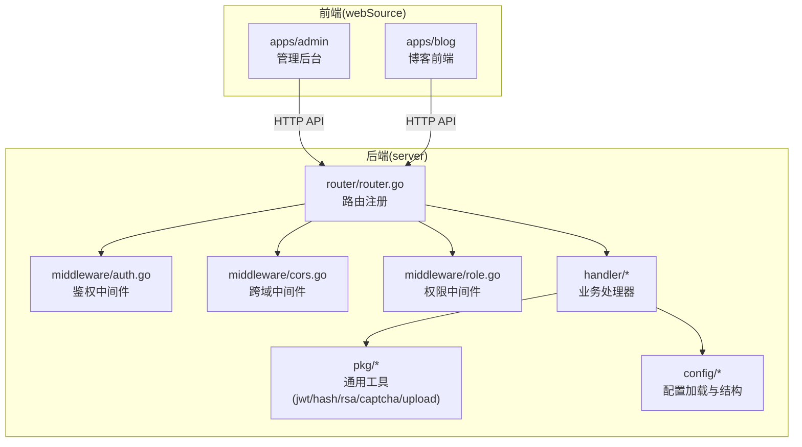
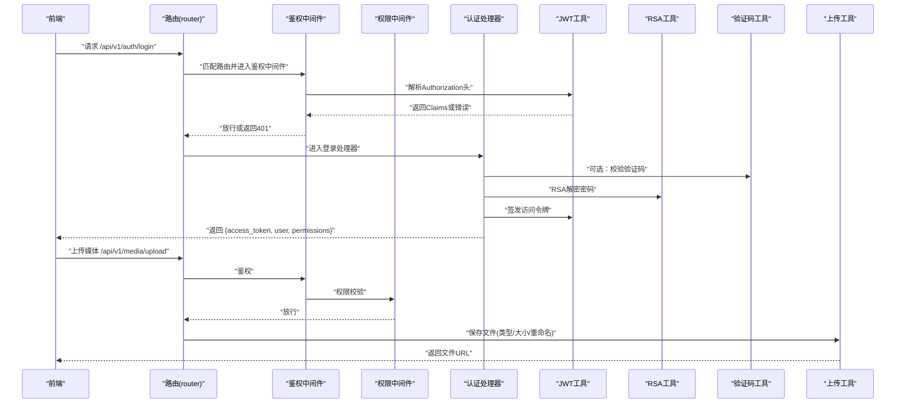
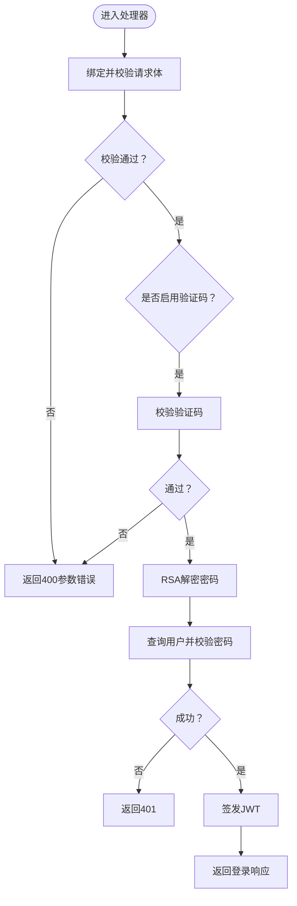
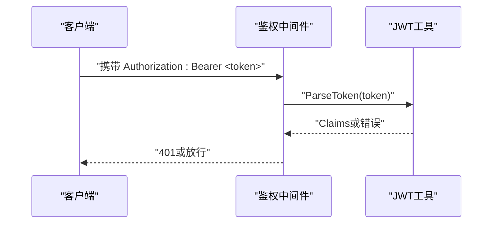
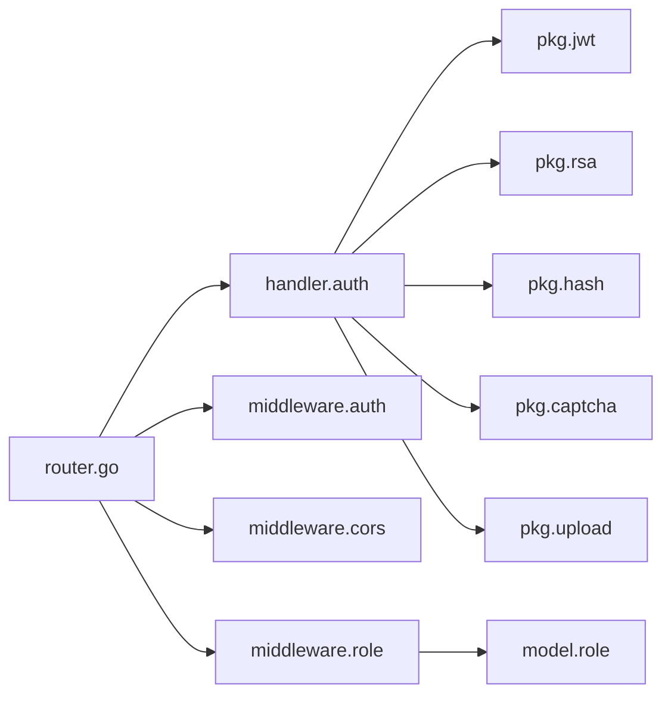

# 安全最佳实践

<cite>
**本文引用的文件**
- [server/main.go](file://server/main.go)
- [server/config/config.go](file://server/config/config.go)
- [server/config/config.yaml](file://server/config/config.yaml)
- [server/router/router.go](file://server/router/router.go)
- [server/internal/middleware/auth.go](file://server/internal/middleware/auth.go)
- [server/internal/middleware/cors.go](file://server/internal/middleware/cors.go)
- [server/internal/middleware/role.go](file://server/internal/middleware/role.go)
- [server/internal/pkg/jwt.go](file://server/internal/pkg/jwt.go)
- [server/internal/pkg/hash.go](file://server/internal/pkg/hash.go)
- [server/internal/pkg/rsa.go](file://server/internal/pkg/rsa.go)
- [server/internal/pkg/upload.go](file://server/internal/pkg/upload.go)
- [server/internal/pkg/captcha.go](file://server/internal/pkg/captcha.go)
- [server/internal/handler/auth.go](file://server/internal/handler/auth.go)
- [server/internal/dto/auth_dto.go](file://server/internal/dto/auth_dto.go)
- [server/internal/model/role.go](file://server/internal/model/role.go)
</cite>

## 目录
1. [引言](#引言)
2. [项目结构](#项目结构)
3. [核心组件](#核心组件)
4. [架构总览](#架构总览)
5. [详细组件分析](#详细组件分析)
6. [依赖分析](#依赖分析)
7. [性能考虑](#性能考虑)
8. [故障排查指南](#故障排查指南)
9. [结论](#结论)
10. [附录](#附录)

## 引言
本指南面向Xiangmuzs博客平台，基于现有代码实现，系统性梳理并提出安全最佳实践，覆盖输入验证与清理、会话与令牌安全、数据传输安全、配置管理、日志与监控、常见威胁防护、安全测试与应急响应等维度。文档以“可落地、可量化”为目标，既适合技术团队实施，也便于非技术读者理解。

## 项目结构
后端采用Gin框架与GORM，按领域分层组织：路由、中间件、处理器、服务/仓储、模型、DTO、通用包（JWT、哈希、RSA、验证码、上传等）。前端分为管理后台与博客前端两套应用，通过统一后端API交互。

图示来源
- [server/router/router.go:11-103](file://server/router/router.go#L11-L103)
- [server/internal/middleware/auth.go:10-37](file://server/internal/middleware/auth.go#L10-L37)
- [server/internal/middleware/cors.go:7-21](file://server/internal/middleware/cors.go#L7-L21)
- [server/internal/middleware/role.go:11-42](file://server/internal/middleware/role.go#L11-L42)
- [server/internal/handler/auth.go:13-93](file://server/internal/handler/auth.go#L13-L93)
- [server/internal/pkg/jwt.go:16-42](file://server/internal/pkg/jwt.go#L16-L42)
- [server/internal/pkg/hash.go:5-13](file://server/internal/pkg/hash.go#L5-L13)
- [server/internal/pkg/rsa.go:18-53](file://server/internal/pkg/rsa.go#L18-L53)
- [server/internal/pkg/captcha.go:24-58](file://server/internal/pkg/captcha.go#L24-L58)
- [server/internal/pkg/upload.go:15-63](file://server/internal/pkg/upload.go#L15-L63)
- [server/config/config.go:47-64](file://server/config/config.go#L47-L64)

章节来源
- [server/main.go:19-76](file://server/main.go#L19-L76)
- [server/router/router.go:11-103](file://server/router/router.go#L11-L103)

## 核心组件
- 配置管理：集中读取YAML配置，暴露服务器、数据库、JWT、上传、博客基础URL等关键参数。
- 路由与中间件：统一注册公开与受保护接口，鉴权与权限控制在中间件层完成。
- 认证与授权：基于JWT的访问令牌与RSA密码解密；角色-权限模型通过中间件校验。
- 数据安全：密码使用bcrypt哈希；上传文件进行类型与大小校验并生成唯一文件名。
- 可视化与验证码：内置验证码生成与校验，支持开关设置。

章节来源
- [server/config/config.go:7-43](file://server/config/config.go#L7-L43)
- [server/config/config.yaml:1-29](file://server/config/config.yaml#L1-L29)
- [server/router/router.go:24-102](file://server/router/router.go#L24-L102)
- [server/internal/middleware/auth.go:10-37](file://server/internal/middleware/auth.go#L10-L37)
- [server/internal/middleware/role.go:11-42](file://server/internal/middleware/role.go#L11-L42)
- [server/internal/pkg/jwt.go:16-42](file://server/internal/pkg/jwt.go#L16-L42)
- [server/internal/pkg/hash.go:5-13](file://server/internal/pkg/hash.go#L5-L13)
- [server/internal/pkg/rsa.go:18-53](file://server/internal/pkg/rsa.go#L18-L53)
- [server/internal/pkg/upload.go:15-63](file://server/internal/pkg/upload.go#L15-L63)
- [server/internal/pkg/captcha.go:24-58](file://server/internal/pkg/captcha.go#L24-L58)

## 架构总览
下图展示从客户端到后端的关键交互路径，以及安全控制点（鉴权、权限、输入校验、文件上传）。

图示来源
- [server/router/router.go:27-76](file://server/router/router.go#L27-L76)
- [server/internal/middleware/auth.go:10-37](file://server/internal/middleware/auth.go#L10-L37)
- [server/internal/middleware/role.go:11-42](file://server/internal/middleware/role.go#L11-L42)
- [server/internal/handler/auth.go:31-93](file://server/internal/handler/auth.go#L31-L93)
- [server/internal/pkg/jwt.go:16-42](file://server/internal/pkg/jwt.go#L16-L42)
- [server/internal/pkg/rsa.go:43-53](file://server/internal/pkg/rsa.go#L43-L53)
- [server/internal/pkg/captcha.go:24-58](file://server/internal/pkg/captcha.go#L24-L58)
- [server/internal/pkg/upload.go:15-63](file://server/internal/pkg/upload.go#L15-L63)

## 详细组件分析

### 输入验证与清理策略
- 参数绑定与校验
  - DTO中对必填字段与邮箱格式进行约束，处理器内使用绑定校验，非法请求直接返回错误。
  - 登录接口对验证码ID与验证码进行条件校验，避免空值绕过。
- SQL注入防护
  - 使用GORM ORM进行查询与更新，避免手写拼接SQL；权限中间件通过预编译条件构造查询。
- XSS与内容安全
  - 建议：对富文本输出进行HTML转义或使用白名单过滤；对上传文件仅允许图片类型并限制大小，避免恶意脚本嵌入。
- 文件上传安全
  - 已实现：类型白名单、大小限制、生成唯一文件名、目录隔离；建议补充：扩展名检查、MIME探测、二次渲染（如缩略图）、访问控制。

图示来源
- [server/internal/dto/auth_dto.go:3-31](file://server/internal/dto/auth_dto.go#L3-L31)
- [server/internal/handler/auth.go:31-93](file://server/internal/handler/auth.go#L31-L93)
- [server/internal/pkg/captcha.go:24-58](file://server/internal/pkg/captcha.go#L24-L58)
- [server/internal/pkg/rsa.go:43-53](file://server/internal/pkg/rsa.go#L43-L53)
- [server/internal/pkg/hash.go:5-13](file://server/internal/pkg/hash.go#L5-L13)

章节来源
- [server/internal/dto/auth_dto.go:3-31](file://server/internal/dto/auth_dto.go#L3-L31)
- [server/internal/handler/auth.go:31-93](file://server/internal/handler/auth.go#L31-L93)
- [server/internal/pkg/upload.go:15-63](file://server/internal/pkg/upload.go#L15-L63)

### 会话管理与令牌安全
- JWT配置
  - 密钥、有效期、刷新周期在配置中集中管理；签发时包含签发时间与过期时间。
- 令牌解析与校验
  - 中间件从Authorization头提取Bearer令牌并解析，失败即拒绝访问。
- 刷新与存储
  - 当前实现未见刷新令牌机制；建议引入刷新令牌表、黑名单与短期访问令牌，前端仅持久化刷新令牌并安全存储。

图示来源
- [server/internal/middleware/auth.go:10-37](file://server/internal/middleware/auth.go#L10-L37)
- [server/internal/pkg/jwt.go:30-42](file://server/internal/pkg/jwt.go#L30-L42)
- [server/config/config.yaml:13-16](file://server/config/config.yaml#L13-L16)

章节来源
- [server/internal/pkg/jwt.go:16-42](file://server/internal/pkg/jwt.go#L16-L42)
- [server/internal/middleware/auth.go:10-37](file://server/internal/middleware/auth.go#L10-L37)
- [server/config/config.yaml:13-16](file://server/config/config.yaml#L13-L16)

### 数据传输安全
- HTTPS与证书
  - 建议：生产环境强制HTTPS，配置TLS版本与密码套件，启用HSTS与浏览器预加载。
- 敏感数据加密
  - 密码使用bcrypt哈希；登录密码通过RSA解密后再比对；建议：对数据库连接凭据与敏感配置项采用KMS或Vault加密存储。
- API安全设计
  - 统一错误响应、状态码语义化；对敏感字段（如密码）不回显；对资源接口增加鉴权与权限校验。

章节来源
- [server/internal/pkg/hash.go:5-13](file://server/internal/pkg/hash.go#L5-L13)
- [server/internal/pkg/rsa.go:18-53](file://server/internal/pkg/rsa.go#L18-L53)
- [server/internal/handler/auth.go:50-55](file://server/internal/handler/auth.go#L50-L55)

### 配置安全管理
- 环境变量与密钥
  - 建议：将数据库密码、JWT密钥、RSA私钥放入环境变量或密管系统；禁止将明文写入仓库。
- 配置文件安全
  - 仅保留必要参数；对敏感字段进行加密；限制配置文件读写权限；CI/CD中使用占位符替换。
- 运行模式
  - 生产关闭调试日志；默认Release模式。

章节来源
- [server/config/config.go:47-64](file://server/config/config.go#L47-L64)
- [server/config/config.yaml:13-16](file://server/config/config.yaml#L13-L16)
- [server/main.go:55-57](file://server/main.go#L55-L57)

### 日志记录与监控
- 日志级别与输出
  - 生产环境建议Info级别以上；记录请求摘要（方法、路径、状态码、耗时、用户标识）。
- 安全事件追踪
  - 记录认证失败、权限拒绝、异常登录IP/UA、高危操作（删除/修改权限）。
- 审计日志
  - 对管理员操作进行审计留痕，保留至少90天；支持检索与导出。
- 监控告警
  - 结合指标（QPS、错误率、响应时间、会话数）与告警规则（异常峰值、失败率突增）。

（本节为通用指导，无需特定文件引用）

### 常见安全威胁防护
- CSRF防护
  - 建议：同站请求来源校验、SameSite Cookie、CSRF Token；对状态变更接口强制校验。
- 点击劫持
  - 建议：X-Frame-Options或Content-Security-Policy帧限制；前端iframe需明确来源。
- 文件上传安全
  - 已实现：类型白名单、大小限制、唯一文件名；建议补充：MIME探测、后缀与头部一致性检查、病毒扫描、只读访问路径。

章节来源
- [server/internal/pkg/upload.go:15-63](file://server/internal/pkg/upload.go#L15-L63)

### 安全测试与漏洞扫描
- 自动化测试
  - 单元测试覆盖：JWT签发/解析、密码哈希/校验、RSA解密、验证码校验、上传校验。
  - 接口测试：使用Swagger或Postman集合，覆盖正常/异常/边界场景。
- 手动渗透测试
  - 模拟SQL注入、XSS、暴力破解、越权访问、敏感文件泄露等。
- 漏洞扫描
  - 依赖扫描：gosec、静态分析；容器镜像扫描；第三方组件漏洞扫描。

章节来源
- [server/internal/pkg/jwt.go:16-42](file://server/internal/pkg/jwt.go#L16-L42)
- [server/internal/pkg/hash.go:5-13](file://server/internal/pkg/hash.go#L5-L13)
- [server/internal/pkg/rsa.go:43-53](file://server/internal/pkg/rsa.go#L43-L53)
- [server/internal/pkg/captcha.go:24-58](file://server/internal/pkg/captcha.go#L24-L58)
- [server/internal/pkg/upload.go:15-63](file://server/internal/pkg/upload.go#L15-L63)

### 应急响应与事件处理
- 事件分级
  - 低：弱密码、弱验证码；中：越权、爆破；高：凭证泄露、RCE；严重：数据泄露。
- 处置流程
  - 隔离受影响账户与令牌；撤销密钥；回滚可疑变更；修复漏洞并发布补丁；复盘与改进。
- 沟通与报告
  - 内部通报、合规部门、监管机构（如适用）。

（本节为通用指导，无需特定文件引用）

## 依赖分析
- 组件耦合
  - 路由依赖处理器与中间件；处理器依赖仓储与通用包；中间件依赖配置与通用包。
- 关键依赖链
  - 鉴权链：路由 -> 鉴权中间件 -> JWT解析；权限链：鉴权 -> 权限中间件 -> 角色-权限查询。
- 潜在风险
  - 配置集中于全局单例，需确保并发安全与密钥轮换；上传路径与权限需严格控制。

图示来源
- [server/router/router.go:11-103](file://server/router/router.go#L11-L103)
- [server/internal/handler/auth.go:13-93](file://server/internal/handler/auth.go#L13-L93)
- [server/internal/middleware/auth.go:10-37](file://server/internal/middleware/auth.go#L10-L37)
- [server/internal/middleware/cors.go:7-21](file://server/internal/middleware/cors.go#L7-L21)
- [server/internal/middleware/role.go:11-42](file://server/internal/middleware/role.go#L11-L42)
- [server/internal/pkg/jwt.go:16-42](file://server/internal/pkg/jwt.go#L16-L42)
- [server/internal/pkg/rsa.go:18-53](file://server/internal/pkg/rsa.go#L18-L53)
- [server/internal/pkg/hash.go:5-13](file://server/internal/pkg/hash.go#L5-L13)
- [server/internal/pkg/captcha.go:24-58](file://server/internal/pkg/captcha.go#L24-L58)
- [server/internal/pkg/upload.go:15-63](file://server/internal/pkg/upload.go#L15-L63)
- [server/internal/model/role.go:5-19](file://server/internal/model/role.go#L5-L19)

章节来源
- [server/router/router.go:11-103](file://server/router/router.go#L11-L103)
- [server/internal/model/role.go:5-19](file://server/internal/model/role.go#L5-L19)

## 性能考虑
- JWT解析与权限查询
  - 建议：对频繁调用的接口缓存用户权限列表；对权限中间件结果做短时缓存。
- 上传性能
  - 建议：使用流式写入、异步处理与CDN分发；对大文件增加断点续传。
- 数据库连接
  - 建议：连接池参数与超时配置；慢查询日志与索引优化。

（本节为通用指导，无需特定文件引用）

## 故障排查指南
- 认证失败
  - 检查Authorization头格式与令牌有效性；确认JWT密钥一致与时间同步。
- 权限不足
  - 检查角色-权限映射与中间件校验逻辑；确认用户角色正确。
- 上传失败
  - 检查文件类型、大小限制与磁盘权限；确认上传目录存在且可写。
- 验证码问题
  - 检查验证码存储与过期时间；确认前端传递的ID与输入一致。

章节来源
- [server/internal/middleware/auth.go:10-37](file://server/internal/middleware/auth.go#L10-L37)
- [server/internal/middleware/role.go:11-42](file://server/internal/middleware/role.go#L11-L42)
- [server/internal/pkg/upload.go:15-63](file://server/internal/pkg/upload.go#L15-L63)
- [server/internal/pkg/captcha.go:24-58](file://server/internal/pkg/captcha.go#L24-L58)

## 结论
Xiangmuzs当前具备基础的认证、权限、上传与验证码能力。建议优先补齐：HTTPS与证书、刷新令牌机制、密钥轮换与加密存储、严格的CSRF与点击劫持防护、完善的日志与监控、以及系统化的安全测试与应急流程。按本指南逐步落地，可显著提升平台整体安全性与韧性。

## 附录
- 配置清单（建议）
  - 数据库：主机、端口、用户、密码、字符集
  - JWT：密钥、访问令牌有效期、刷新令牌有效期
  - 上传：存储路径、最大大小、允许类型
  - 博客：基础URL
- 开发与运维建议
  - 分环境分离配置；CI/CD中禁用明文密钥；定期轮换密钥；启用WAF与DDoS防护。

章节来源
- [server/config/config.go:7-43](file://server/config/config.go#L7-L43)
- [server/config/config.yaml:1-29](file://server/config/config.yaml#L1-L29)