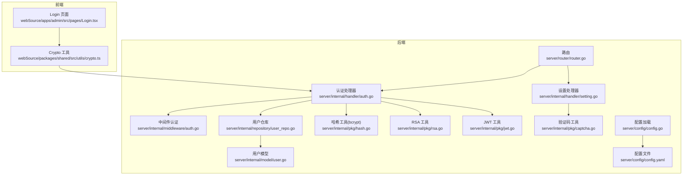
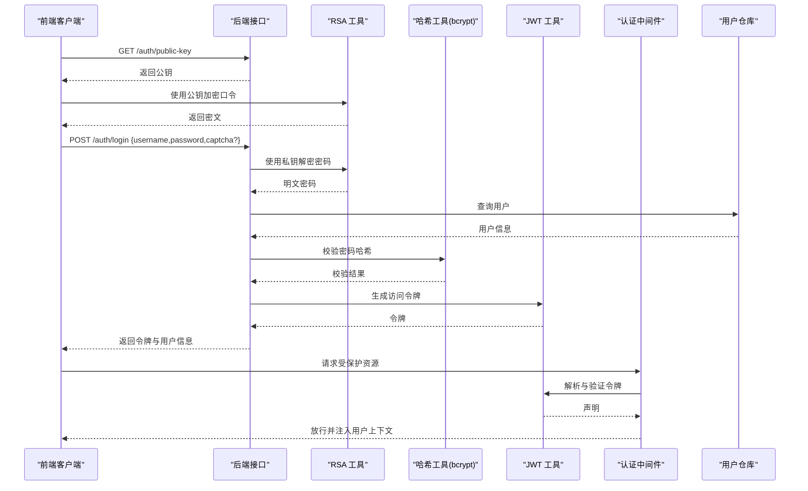
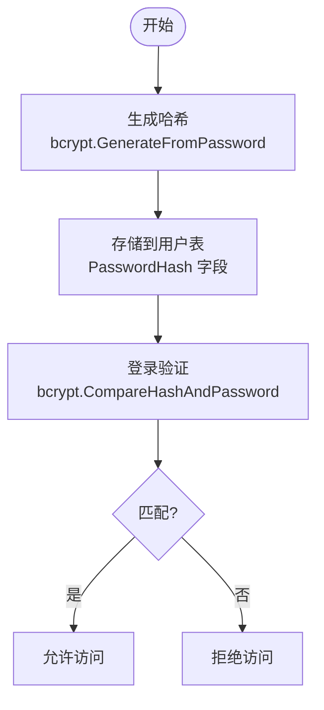
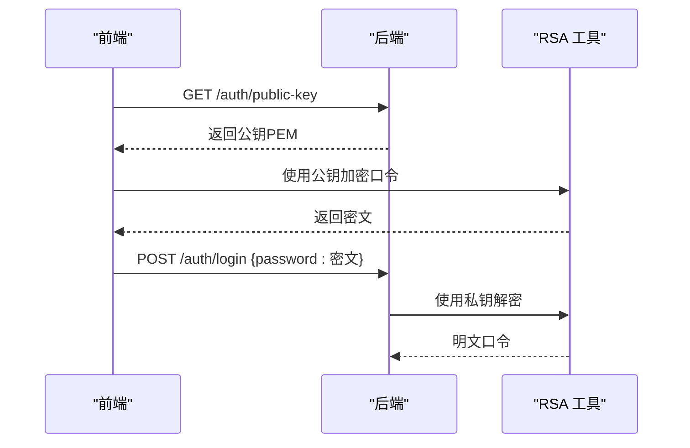
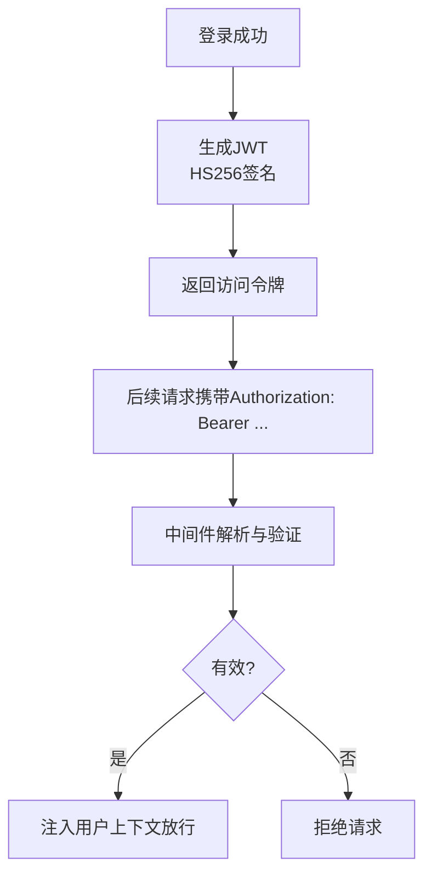
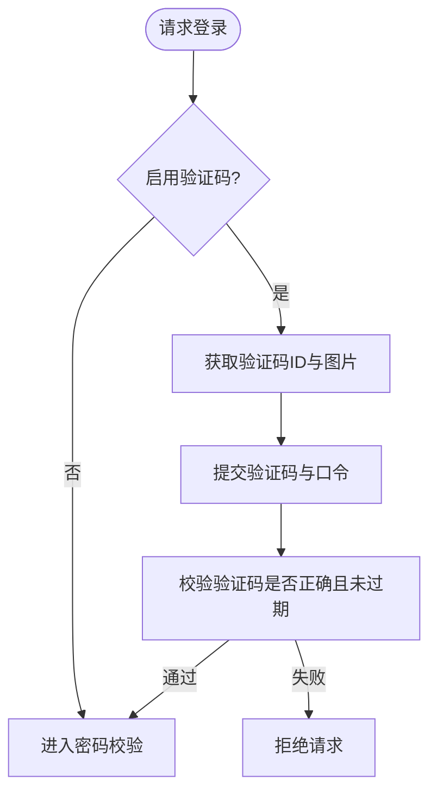
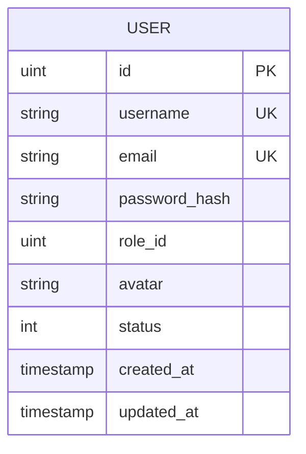
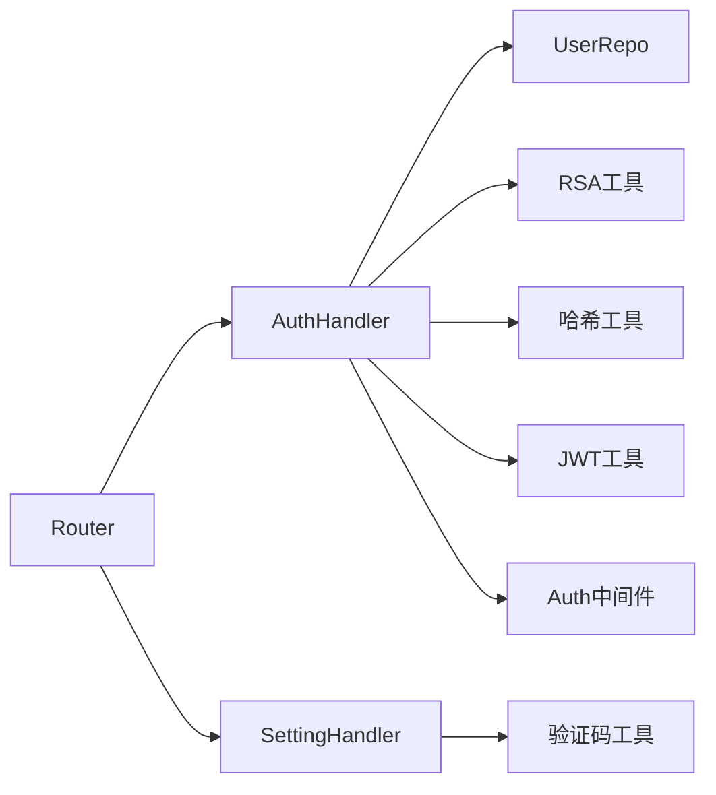

# 密码安全与加密

<cite>
**本文引用的文件**
- [server/internal/pkg/hash.go](file://server/internal/pkg/hash.go)
- [server/internal/pkg/rsa.go](file://server/internal/pkg/rsa.go)
- [server/internal/pkg/jwt.go](file://server/internal/pkg/jwt.go)
- [server/internal/pkg/captcha.go](file://server/internal/pkg/captcha.go)
- [server/internal/handler/auth.go](file://server/internal/handler/auth.go)
- [server/internal/handler/setting.go](file://server/internal/handler/setting.go)
- [server/internal/model/user.go](file://server/internal/model/user.go)
- [server/internal/repository/user_repo.go](file://server/internal/repository/user_repo.go)
- [server/internal/middleware/auth.go](file://server/internal/middleware/auth.go)
- [server/router/router.go](file://server/router/router.go)
- [server/config/config.go](file://server/config/config.go)
- [server/config/config.yaml](file://server/config/config.yaml)
- [webSource/packages/shared/src/utils/crypto.ts](file://webSource/packages/shared/src/utils/crypto.ts)
- [webSource/apps/admin/src/pages/Login.tsx](file://webSource/apps/admin/src/pages/Login.tsx)
</cite>

## 目录
1. [引言](#引言)
2. [项目结构](#项目结构)
3. [核心组件](#核心组件)
4. [架构总览](#架构总览)
5. [详细组件分析](#详细组件分析)
6. [依赖分析](#依赖分析)
7. [性能考量](#性能考量)
8. [故障排查指南](#故障排查指南)
9. [结论](#结论)
10. [附录](#附录)

## 引言
本文件围绕密码安全与加密机制，系统梳理后端密码哈希、RSA 加密、JWT 令牌、验证码与登录流程，并结合前端加密与交互，形成从设计到实现的完整技术文档。重点覆盖以下方面：
- 密码哈希算法选择与实现（bcrypt）
- 盐值生成与管理策略（哈希内置盐）
- RSA 在敏感数据保护中的应用（公私钥生成、密钥存储、加解密流程）
- 密码强度验证规则（复杂度、长度、弱密码检测建议）
- 密码安全存储最佳实践（哈希存储、密钥轮换、安全传输）
- 密码重置与修改流程的安全实现（验证码机制、会话安全）
- 法律法规与合规性考虑（GDPR、网络安全等级保护等）

## 项目结构
后端采用 Go Gin 框架，按领域分层组织：路由、中间件、处理器、服务/仓库、模型、工具包。前端使用 React + TypeScript，通过共享包进行 RSA 加密与 API 交互。

图表来源
- [server/router/router.go:11-103](file://server/router/router.go#L11-L103)
- [server/internal/handler/auth.go:13-25](file://server/internal/handler/auth.go#L13-L25)
- [server/internal/handler/setting.go:11-19](file://server/internal/handler/setting.go#L11-L19)
- [server/internal/repository/user_repo.go:8-22](file://server/internal/repository/user_repo.go#L8-L22)
- [server/internal/model/user.go:5-16](file://server/internal/model/user.go#L5-L16)
- [server/internal/pkg/hash.go:1-14](file://server/internal/pkg/hash.go#L1-L14)
- [server/internal/pkg/rsa.go:1-54](file://server/internal/pkg/rsa.go#L1-L54)
- [server/internal/pkg/jwt.go:1-43](file://server/internal/pkg/jwt.go#L1-L43)
- [server/internal/pkg/captcha.go:1-176](file://server/internal/pkg/captcha.go#L1-L176)
- [server/config/config.go:47-64](file://server/config/config.go#L47-L64)
- [server/config/config.yaml:13-16](file://server/config/config.yaml#L13-L16)
- [webSource/packages/shared/src/utils/crypto.ts:7-23](file://webSource/packages/shared/src/utils/crypto.ts#L7-L23)
- [webSource/apps/admin/src/pages/Login.tsx:43-57](file://webSource/apps/admin/src/pages/Login.tsx#L43-L57)

章节来源
- [server/router/router.go:11-103](file://server/router/router.go#L11-L103)
- [server/internal/handler/auth.go:13-25](file://server/internal/handler/auth.go#L13-L25)
- [server/internal/handler/setting.go:11-19](file://server/internal/handler/setting.go#L11-L19)
- [server/internal/repository/user_repo.go:8-22](file://server/internal/repository/user_repo.go#L8-L22)
- [server/internal/model/user.go:5-16](file://server/internal/model/user.go#L5-L16)
- [server/internal/pkg/hash.go:1-14](file://server/internal/pkg/hash.go#L1-L14)
- [server/internal/pkg/rsa.go:1-54](file://server/internal/pkg/rsa.go#L1-L54)
- [server/internal/pkg/jwt.go:1-43](file://server/internal/pkg/jwt.go#L1-L43)
- [server/internal/pkg/captcha.go:1-176](file://server/internal/pkg/captcha.go#L1-L176)
- [server/config/config.go:47-64](file://server/config/config.go#L47-L64)
- [server/config/config.yaml:13-16](file://server/config/config.yaml#L13-L16)
- [webSource/packages/shared/src/utils/crypto.ts:7-23](file://webSource/packages/shared/src/utils/crypto.ts#L7-L23)
- [webSource/apps/admin/src/pages/Login.tsx:43-57](file://webSource/apps/admin/src/pages/Login.tsx#L43-L57)

## 核心组件
- 密码哈希（bcrypt）：用于密码存储，自动处理盐值与成本因子。
- RSA 加密：前端使用公钥加密口令，后端使用私钥解密，避免明文在网络传输中暴露。
- JWT 令牌：基于 HS256 的签名令牌，承载用户身份与权限声明。
- 验证码：图形验证码，防暴力破解与自动化攻击。
- 用户模型与仓库：持久化用户凭据与状态。
- 路由与中间件：统一鉴权入口与受保护资源访问控制。

章节来源
- [server/internal/pkg/hash.go:5-13](file://server/internal/pkg/hash.go#L5-L13)
- [server/internal/pkg/rsa.go:18-53](file://server/internal/pkg/rsa.go#L18-L53)
- [server/internal/pkg/jwt.go:16-42](file://server/internal/pkg/jwt.go#L16-L42)
- [server/internal/pkg/captcha.go:24-58](file://server/internal/pkg/captcha.go#L24-L58)
- [server/internal/model/user.go:9](file://server/internal/model/user.go#L9)
- [server/internal/repository/user_repo.go:24-53](file://server/internal/repository/user_repo.go#L24-L53)
- [server/router/router.go:27-50](file://server/router/router.go#L27-L50)
- [server/internal/middleware/auth.go:10-36](file://server/internal/middleware/auth.go#L10-L36)

## 架构总览
下图展示登录与密码修改的关键流程，涵盖前端 RSA 加密、后端解密与哈希校验、JWT 签发与权限加载。

图表来源
- [server/internal/handler/auth.go:27-93](file://server/internal/handler/auth.go#L27-L93)
- [server/internal/pkg/rsa.go:39-53](file://server/internal/pkg/rsa.go#L39-L53)
- [server/internal/pkg/hash.go:10-13](file://server/internal/pkg/hash.go#L10-L13)
- [server/internal/pkg/jwt.go:16-42](file://server/internal/pkg/jwt.go#L16-L42)
- [server/internal/middleware/auth.go:10-36](file://server/internal/middleware/auth.go#L10-L36)
- [server/internal/repository/user_repo.go:24-53](file://server/internal/repository/user_repo.go#L24-L53)
- [webSource/packages/shared/src/utils/crypto.ts:7-23](file://webSource/packages/shared/src/utils/crypto.ts#L7-L23)

## 详细组件分析

### 密码哈希（bcrypt）
- 实现要点
  - 使用 bcrypt 生成哈希，内部包含盐值与成本因子，无需手动管理盐。
  - 提供哈希比较函数，用于登录时验证。
- 安全性考量
  - bcrypt 成本因子默认值已足够抵御常见暴力破解；生产环境可按硬件能力调优。
  - 不可逆性确保即使数据库泄露，攻击者也无法直接获取明文密码。
- 存储与验证流程
  - 注册/修改时对新口令进行哈希并存入用户表字段。
  - 登录时以明文口令与存储的哈希进行比对。

图表来源
- [server/internal/pkg/hash.go:5-13](file://server/internal/pkg/hash.go#L5-L13)
- [server/internal/model/user.go:9](file://server/internal/model/user.go#L9)

章节来源
- [server/internal/pkg/hash.go:5-13](file://server/internal/pkg/hash.go#L5-L13)
- [server/internal/model/user.go:9](file://server/internal/model/user.go#L9)

### 盐值生成与管理
- 内置盐策略
  - bcrypt 自动为每个密码生成唯一盐值，无需应用层干预。
  - 哈希字符串内嵌盐与成本参数，便于跨版本兼容与迁移。
- 最佳实践
  - 不要自定义盐；不要复用盐；不要对同一口令重复使用相同盐。
  - 若需迁移至更高成本因子，应重新对现有口令进行哈希并更新存储。

章节来源
- [server/internal/pkg/hash.go:6](file://server/internal/pkg/hash.go#L6)

### RSA 加密与密钥管理
- 公私钥生成
  - 后端初始化时生成 2048 位 RSA 密钥对，导出公钥 PEM 字符串供前端使用。
  - 私钥仅保留在内存中，不落盘，避免长期持久化带来的泄露风险。
- 密钥分发与使用
  - 前端首次请求获取公钥，随后对口令进行 RSA 加密再提交。
  - 后端使用私钥解密，得到明文口令后进行哈希校验。
- 安全传输
  - 整个登录过程避免明文口令在网络传输中出现，降低中间人攻击风险。

图表来源
- [server/internal/pkg/rsa.go:18-53](file://server/internal/pkg/rsa.go#L18-L53)
- [webSource/packages/shared/src/utils/crypto.ts:7-23](file://webSource/packages/shared/src/utils/crypto.ts#L7-L23)
- [server/internal/handler/auth.go:27-55](file://server/internal/handler/auth.go#L27-L55)

章节来源
- [server/internal/pkg/rsa.go:18-53](file://server/internal/pkg/rsa.go#L18-L53)
- [webSource/packages/shared/src/utils/crypto.ts:7-23](file://webSource/packages/shared/src/utils/crypto.ts#L7-L23)
- [server/internal/handler/auth.go:27-55](file://server/internal/handler/auth.go#L27-L55)

### JWT 令牌与会话安全
- 令牌签发
  - 使用 HS256 签名，载荷包含用户标识与角色标识，以及签发时间与过期时间。
  - 过期时间在配置中定义，支持短期访问令牌。
- 令牌解析
  - 中间件从 Authorization 头提取 Bearer 令牌并解析验证。
  - 验证失败或过期则拒绝请求。
- 会话安全
  - 建议配合 HTTPS、安全 Cookie、同源策略与 CSRF 防护。
  - 对高敏感操作可增加二次确认或刷新令牌流程。

图表来源
- [server/internal/pkg/jwt.go:16-42](file://server/internal/pkg/jwt.go#L16-L42)
- [server/internal/middleware/auth.go:10-36](file://server/internal/middleware/auth.go#L10-L36)
- [server/config/config.yaml:13-16](file://server/config/config.yaml#L13-L16)

章节来源
- [server/internal/pkg/jwt.go:16-42](file://server/internal/pkg/jwt.go#L16-L42)
- [server/internal/middleware/auth.go:10-36](file://server/internal/middleware/auth.go#L10-L36)
- [server/config/config.yaml:13-16](file://server/config/config.yaml#L13-L16)

### 验证码与防暴力破解
- 图形验证码
  - 后端生成 4 位数字验证码，带过期时间，存储于内存映射表。
  - 前端请求验证码图片与 ID，输入后随登录请求提交。
- 防护效果
  - 降低自动化脚本暴力破解成功率，缓解账户枚举与撞库风险。

图表来源
- [server/internal/handler/auth.go:38-48](file://server/internal/handler/auth.go#L38-L48)
- [server/internal/handler/setting.go:55-66](file://server/internal/handler/setting.go#L55-L66)
- [server/internal/pkg/captcha.go:24-58](file://server/internal/pkg/captcha.go#L24-L58)
- [webSource/apps/admin/src/pages/Login.tsx:20-41](file://webSource/apps/admin/src/pages/Login.tsx#L20-L41)

章节来源
- [server/internal/handler/auth.go:38-48](file://server/internal/handler/auth.go#L38-L48)
- [server/internal/handler/setting.go:55-66](file://server/internal/handler/setting.go#L55-L66)
- [server/internal/pkg/captcha.go:24-58](file://server/internal/pkg/captcha.go#L24-L58)
- [webSource/apps/admin/src/pages/Login.tsx:20-41](file://webSource/apps/admin/src/pages/Login.tsx#L20-L41)

### 密码强度验证规则
- 复杂度要求
  - 建议最小长度 8-12 字符，包含大小写字母、数字与特殊字符。
  - 避免使用连续字符、键盘序列、常见词典词汇。
- 常见弱口令检测
  - 可基于字典与模式匹配进行预检，阻止易被猜测的口令。
- 前端提示与后端校验
  - 前端即时反馈，后端严格校验并拒绝弱口令。

[本节为通用安全建议，不直接分析具体文件]

### 密码安全存储最佳实践
- 哈希存储
  - 仅存储 bcrypt 哈希，不存储明文或可逆加密。
- 密钥轮换
  - 更换 JWT 密钥时，建议滚动发布并逐步替换旧令牌。
- 安全传输
  - 强制 HTTPS，避免混合内容；令牌通过安全通道传输。
- 日志与审计
  - 记录登录尝试与异常事件，但不记录口令明文。

[本节为通用安全建议，不直接分析具体文件]

### 密码重置与修改流程
- 修改密码
  - 需要当前密码验证通过后，方可更新为新密码哈希。
- 密码重置
  - 建议采用“一次性链接”或“验证码”方式，限定有效期与使用次数。
  - 重置后立即撤销旧令牌或强制刷新。

章节来源
- [server/internal/handler/auth.go:120-162](file://server/internal/handler/auth.go#L120-L162)

### 数据模型与存储
- 用户模型包含用户名、邮箱、密码哈希、角色、状态等字段。
- 密码哈希字段用于 bcrypt 存储与校验。

图表来源
- [server/internal/model/user.go:5-16](file://server/internal/model/user.go#L5-L16)

章节来源
- [server/internal/model/user.go:5-16](file://server/internal/model/user.go#L5-L16)

## 依赖分析
- 组件耦合
  - 认证处理器依赖用户仓库、RSA 工具、哈希工具与 JWT 工具。
  - 中间件依赖 JWT 工具进行令牌解析。
  - 设置处理器提供验证码生成与公开配置。
- 外部依赖
  - bcrypt、RSA、JWT、图像处理、配置加载等第三方库。
- 潜在风险
  - 私钥生命周期管理与密钥轮换策略需纳入运维流程。
  - 验证码存储在内存映射表，重启后丢失，需评估分布式部署场景。

图表来源
- [server/router/router.go:11-103](file://server/router/router.go#L11-L103)
- [server/internal/handler/auth.go:13-25](file://server/internal/handler/auth.go#L13-L25)
- [server/internal/handler/setting.go:11-19](file://server/internal/handler/setting.go#L11-L19)
- [server/internal/middleware/auth.go:10-36](file://server/internal/middleware/auth.go#L10-L36)

章节来源
- [server/router/router.go:11-103](file://server/router/router.go#L11-L103)
- [server/internal/handler/auth.go:13-25](file://server/internal/handler/auth.go#L13-L25)
- [server/internal/handler/setting.go:11-19](file://server/internal/handler/setting.go#L11-L19)
- [server/internal/middleware/auth.go:10-36](file://server/internal/middleware/auth.go#L10-L36)

## 性能考量
- bcrypt 成本因子
  - 默认成本已适中；若登录延迟过高，可适度提高硬件成本上限。
- RSA 解密
  - 仅在登录与修改密码等少数场景执行，对整体吞吐影响有限。
- 验证码
  - 内存存储简单高效；若需水平扩展，建议迁移到分布式缓存并设置 TTL。

[本节提供通用指导，不直接分析具体文件]

## 故障排查指南
- 登录失败
  - 检查前端是否正确获取公钥并使用公钥加密口令。
  - 确认后端 RSA 私钥是否初始化成功，解密是否报错。
  - 核对用户是否存在、状态正常、密码哈希是否正确。
- 令牌无效
  - 检查 Authorization 头格式是否为 Bearer。
  - 核对 JWT 密钥与过期时间配置。
- 验证码问题
  - 确认验证码是否在有效期内，是否被提前消费。
  - 检查验证码开关设置与前端展示逻辑。

章节来源
- [server/internal/handler/auth.go:27-93](file://server/internal/handler/auth.go#L27-L93)
- [server/internal/pkg/rsa.go:18-53](file://server/internal/pkg/rsa.go#L18-L53)
- [server/internal/pkg/jwt.go:30-42](file://server/internal/pkg/jwt.go#L30-L42)
- [server/internal/pkg/captcha.go:48-58](file://server/internal/pkg/captcha.go#L48-L58)
- [server/internal/middleware/auth.go:10-36](file://server/internal/middleware/auth.go#L10-L36)

## 结论
本项目在密码安全方面采用了成熟的 bcrypt 哈希、RSA 传输加密、JWT 会话管理与验证码防护，形成了从传输、存储到会话的多层安全防线。建议在生产环境中进一步完善密钥轮换、HTTPS 强制、日志审计与弱口令检测策略，并结合法律法规要求持续优化合规性。

[本节为总结性内容，不直接分析具体文件]

## 附录

### 法律法规与合规性考虑
- 数据保护与隐私
  - 遵循个人信息保护法与数据最小化原则，仅收集必要信息。
- 加密与密钥管理
  - 采用行业标准算法与密钥轮换策略，确保密钥生命周期安全。
- 网络安全等级保护
  - 按照等级保护要求实施身份鉴别、访问控制与日志审计。
- 国际合规
  - 如涉及欧盟用户，遵循 GDPR 要求，保障用户权利与数据处理合法性。

[本节为通用合规建议，不直接分析具体文件]