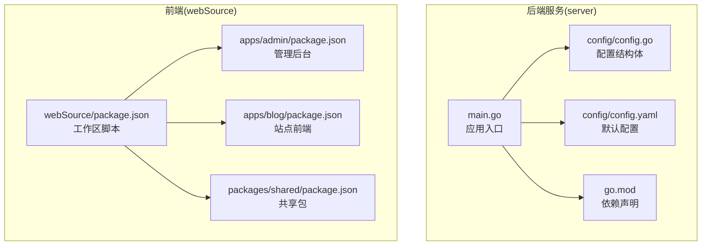
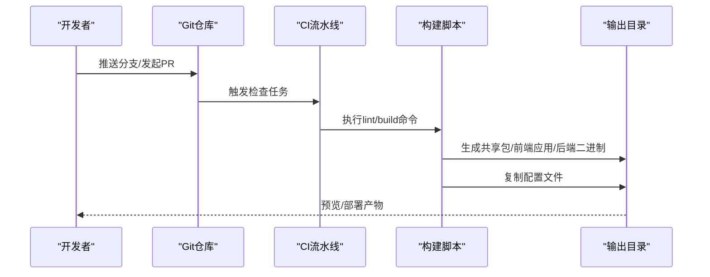
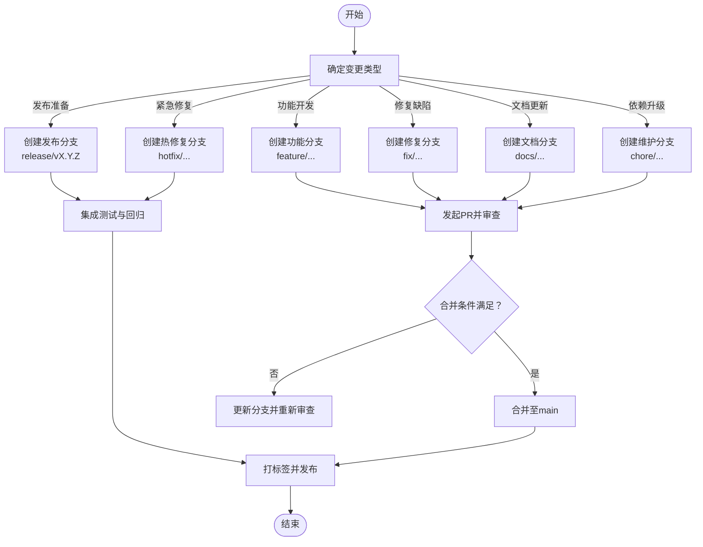
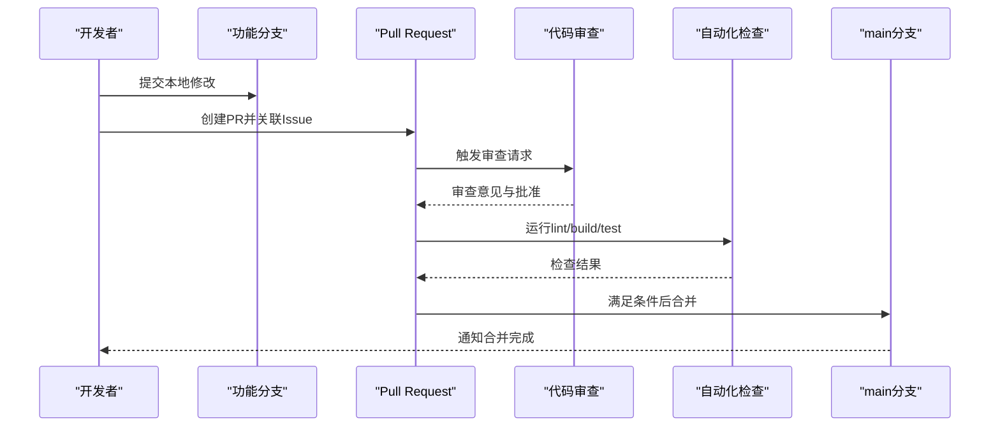
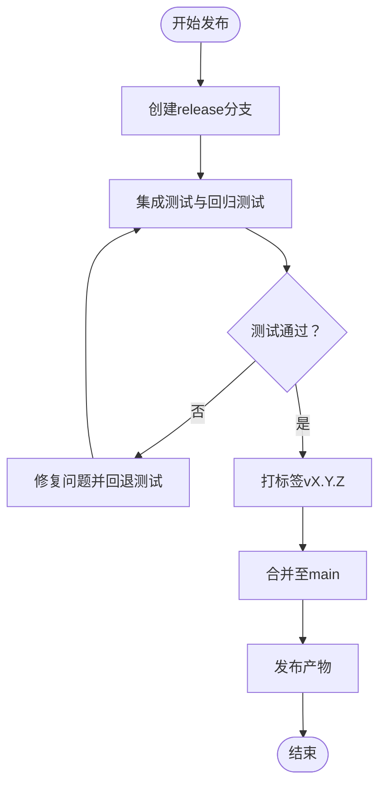
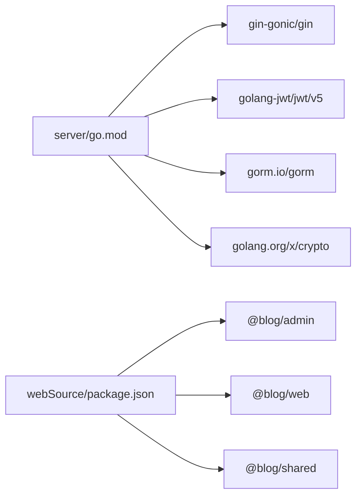

# Git工作流程与协作

<cite>
**本文引用的文件**
- [.gitignore](file://.gitignore)
- [server/go.mod](file://server/go.mod)
- [server/main.go](file://server/main.go)
- [server/config/config.go](file://server/config/config.go)
- [server/config/config.yaml](file://server/config/config.yaml)
- [webSource/package.json](file://webSource/package.json)
- [webSource/apps/admin/package.json](file://webSource/apps/admin/package.json)
- [webSource/apps/blog/package.json](file://webSource/apps/blog/package.json)
- [webSource/packages/shared/package.json](file://webSource/packages/shared/package.json)
</cite>

## 目录
1. [简介](#简介)
2. [项目结构](#项目结构)
3. [核心组件](#核心组件)
4. [架构总览](#架构总览)
5. [详细组件分析](#详细组件分析)
6. [依赖分析](#依赖分析)
7. [性能考虑](#性能考虑)
8. [故障排查指南](#故障排查指南)
9. [结论](#结论)
10. [附录](#附录)

## 简介
本指南面向Xiangmuzs博客平台的开发团队，提供一套完整的Git工作流程与协作规范，涵盖分支管理策略、提交信息规范、Pull Request（PR）流程、版本标签与发布管理、Git钩子与自动化检查，以及团队协作最佳实践与沟通规范。该指南结合当前仓库的前后端分层结构与构建脚本，确保流程可落地、可执行、可审计。

## 项目结构
Xiangmuzs采用前后端分离与多包工作区的组织方式：
- 后端服务位于 server 目录，使用Go语言与Gin框架，通过Viper加载YAML配置，支持数据库迁移与静态资源托管。
- 前端由两个应用组成：admin（管理后台）与blog（站点前端），共享包 shared 提供通用工具与类型定义；整体通过 pnpm 工作区统一管理。
- 根目录提供通用忽略规则，后端产物与上传目录在构建与运行时生成。

图表来源
- [server/main.go:1-77](file://server/main.go#L1-L77)
- [server/config/config.go:1-65](file://server/config/config.go#L1-L65)
- [server/config/config.yaml:1-29](file://server/config/config.yaml#L1-L29)
- [server/go.mod:1-60](file://server/go.mod#L1-L60)
- [webSource/package.json:1-22](file://webSource/package.json#L1-L22)
- [webSource/apps/admin/package.json:1-28](file://webSource/apps/admin/package.json#L1-L28)
- [webSource/apps/blog/package.json:1-30](file://webSource/apps/blog/package.json#L1-L30)
- [webSource/packages/shared/package.json:1-23](file://webSource/packages/shared/package.json#L1-L23)

章节来源
- [server/main.go:1-77](file://server/main.go#L1-L77)
- [server/config/config.go:1-65](file://server/config/config.go#L1-L65)
- [server/config/config.yaml:1-29](file://server/config/config.yaml#L1-L29)
- [server/go.mod:1-60](file://server/go.mod#L1-L60)
- [webSource/package.json:1-22](file://webSource/package.json#L1-L22)

## 核心组件
- 应用入口与启动：后端通过入口文件初始化配置、数据库连接、迁移、RSA密钥与路由，并根据模式选择运行模式。
- 配置系统：使用Viper从YAML读取配置，支持服务器端口、数据库参数、JWT密钥、上传路径与博客基础URL等。
- 构建与运行：根级构建脚本聚合共享包、前端应用与后端二进制产物，并复制配置文件到输出目录；前端应用分别独立构建。

章节来源
- [server/main.go:19-76](file://server/main.go#L19-L76)
- [server/config/config.go:47-64](file://server/config/config.go#L47-L64)
- [server/config/config.yaml:1-29](file://server/config/config.yaml#L1-L29)
- [webSource/package.json:4-16](file://webSource/package.json#L4-L16)

## 架构总览
下图展示从开发者本地到部署产物的关键流程：本地开发、代码提交、自动化检查、构建打包与产物输出。

图表来源
- [webSource/package.json:4-16](file://webSource/package.json#L4-L16)
- [server/main.go:19-76](file://server/main.go#L19-L76)

## 详细组件分析

### 分支管理策略
- 主分支保护
  - 仅允许通过受保护的分支（如main）合并，要求PR审查与状态检查通过。
  - 禁止直接推送至主分支，强制通过PR流程。
- 功能分支命名规范
  - 使用前缀区分功能域与类型，例如：feature/user-auth、feature/admin-dashboard、fix/bug-xxx、docs/readme-update、chore/deps-upgrade。
  - 分支名应简洁明确，避免长链式命名。
- 发布分支管理
  - 使用release/vX.Y.Z作为发布分支，限定变更范围与测试周期。
  - 发布完成后合并回main并打标签，随后删除release分支。
- 热修复分支
  - hotfix/xxx用于紧急修复，从最近标签创建，修复后同时合并回main与develop。

### Git工作流程选择与实施
- 推荐采用 GitHub Flow 或 GitLab Flow 的简化变体，以适应持续交付需求：
  - 每个功能从main派生，完成开发后通过PR合并回main。
  - main随时可部署，通过发布分支与标签进行版本化管理。
- 实施要点
  - 统一使用受保护分支策略，开启必需检查（构建、测试、代码扫描）。
  - 强制PR关联Issue，确保变更可追溯。
  - 使用squash合并保持提交历史整洁。

### 提交信息规范（Conventional Commits）
- 规范格式
  - type(scope): subject
  - body（可选）：详细说明变更内容、动机与影响范围
  - footer（可选）：关闭/关联Issue编号、破坏性变更说明
- 类型建议
  - feat：新功能
  - fix：缺陷修复
  - docs：文档更新
  - style：不影响逻辑的样式调整
  - refactor：重构但不修复缺陷或添加功能
  - perf：性能优化
  - test：新增或调整测试
  - build：构建相关
  - ci：持续集成相关
  - chore：日常维护
- 示例路径
  - 参考提交模板与约定式提交的实现位置：[webSource/package.json:4-16](file://webSource/package.json#L4-L16)

章节来源
- [webSource/package.json:4-16](file://webSource/package.json#L4-L16)

### Pull Request 流程
- 代码审查标准
  - 必须至少一名Reviewer批准，且无Changes Request。
  - 通过所有自动化检查（lint、构建、测试）。
  - PR描述清晰，包含背景、变更点、测试验证与风险提示。
- 合并策略
  - 使用squash合并，确保主分支提交信息清晰。
  - 合并后自动触发部署或预览环境更新。
- 冲突解决
  - 在PR创建后定期rebase或merge main，保持基线一致。
  - 若出现复杂冲突，拆分PR或退回讨论。

### 版本标签与发布管理
- 标签策略
  - 使用语义化版本：vMAJOR.MINOR.PATCH
  - 通过release分支稳定版本，合并后打标签并发布
- 发布流程
  - 在release分支完成集成测试与回归测试
  - 合并回main并创建对应标签
  - 产出部署包：前端应用、共享包与后端二进制，复制配置文件

章节来源
- [webSource/package.json:11-12](file://webSource/package.json#L11-L12)
- [server/main.go:46-47](file://server/main.go#L46-L47)

### Git钩子与自动化检查
- 推荐配置
  - pre-commit：运行lint与格式化检查
  - commit-msg：校验提交信息是否符合Conventional Commits
  - pre-push：运行构建与关键测试，避免污染远端
- 工具建议
  - 使用husky与commitlint配合实现本地钩子与提交信息校验
  - 在CI中重复相同检查，确保远端一致性

### 团队协作最佳实践与沟通规范
- 沟通渠道
  - 日常开发在团队即时通讯群组同步进展
  - 复杂设计与架构决策在评审会议记录并公开
- 任务分配
  - Issue驱动：每个PR对应一个Issue，便于追踪与复盘
- 文档与知识沉淀
  - 新增或变更重要模块需补充设计文档与接口文档
- 安全与合规
  - 敏感配置通过环境变量或密钥管理服务注入，不在仓库中存储明文
  - 定期更新依赖，关注安全通告

## 依赖分析
- 后端依赖
  - Web框架、JWT、数据库ORM、加密与配置解析等核心库在模块文件中集中声明，便于统一升级与审计。
- 前端依赖
  - 管理后台与站点前端分别声明依赖，共享包提供跨应用通用能力；工作区脚本统一编排构建流程。

图表来源
- [server/go.mod:5-13](file://server/go.mod#L5-L13)
- [webSource/package.json:1-22](file://webSource/package.json#L1-L22)

章节来源
- [server/go.mod:1-60](file://server/go.mod#L1-L60)
- [webSource/package.json:1-22](file://webSource/package.json#L1-L22)

## 性能考虑
- 构建性能
  - 利用工作区并行构建，减少重复编译时间
  - 对大型依赖启用增量构建与缓存
- 代码质量
  - 在PR阶段尽早发现性能退化与潜在问题
- 部署效率
  - 将构建产物与配置文件分离，便于灰度与回滚

## 故障排查指南
- 配置加载失败
  - 检查配置文件路径与YAML格式，确认默认值与环境变量覆盖顺序
- 数据库连接异常
  - 校验主机、端口、用户名、密码与字符集配置
- 上传目录不可写
  - 确认上传路径存在且具备写权限
- 构建失败
  - 查看工作区脚本中的构建顺序与产物输出路径

章节来源
- [server/config/config.go:47-64](file://server/config/config.go#L47-L64)
- [server/config/config.yaml:1-29](file://server/config/config.yaml#L1-L29)
- [server/main.go:26-66](file://server/main.go#L26-L66)
- [webSource/package.json:11-12](file://webSource/package.json#L11-L12)

## 结论
通过统一的分支策略、约定式提交、严格的PR审查与自动化检查，Xiangmuzs可以实现高效、可追溯、可审计的协作开发。结合语义化版本与发布分支管理，团队能够稳定地交付高质量版本，降低风险并提升交付速度。

## 附录
- 常用命令参考
  - 创建功能分支：git checkout -b feature/your-feature
  - 推送分支：git push origin feature/your-feature
  - 创建PR：在代码托管平台创建PR并关联Issue
  - 合并分支：squash合并至main并删除已合并分支
- 提交模板建议
  - 类型：feat/fix/docs/style/refactor/perf/test/build/ci/chore
  - 范围：模块或文件路径
  - 主题：简短描述变更
  - 详情：变更动机、影响范围、测试验证
  - 关联：Closes/Fixes #issue-number