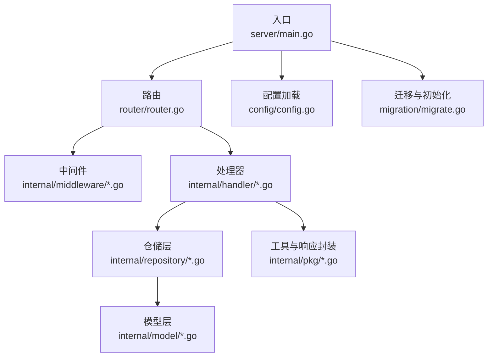
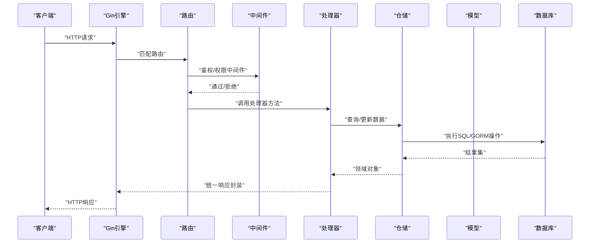
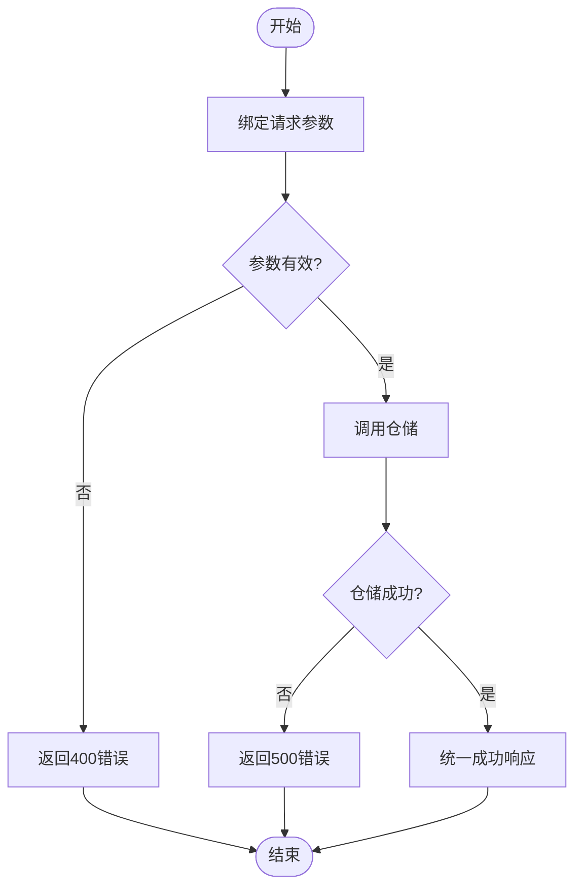
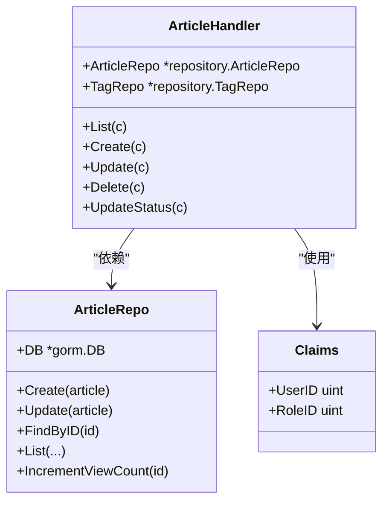
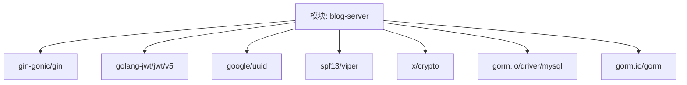

# Go语言编码规范

<cite>
**本文档引用的文件**
- [server/main.go](file://server/main.go)
- [server/go.mod](file://server/go.mod)
- [server/config/config.go](file://server/config/config.go)
- [server/router/router.go](file://server/router/router.go)
- [server/internal/handler/article.go](file://server/internal/handler/article.go)
- [server/internal/handler/auth.go](file://server/internal/handler/auth.go)
- [server/internal/middleware/auth.go](file://server/internal/middleware/auth.go)
- [server/internal/middleware/role.go](file://server/internal/middleware/role.go)
- [server/internal/pkg/response.go](file://server/internal/pkg/response.go)
- [server/internal/pkg/jwt.go](file://server/internal/pkg/jwt.go)
- [server/internal/pkg/hash.go](file://server/internal/pkg/hash.go)
- [server/internal/repository/article_repo.go](file://server/internal/repository/article_repo.go)
- [server/internal/dto/common.go](file://server/internal/dto/common.go)
- [server/internal/model/article.go](file://server/internal/model/article.go)
- [server/migration/migrate.go](file://server/migration/migrate.go)
</cite>

## 目录
1. [简介](#简介)
2. [项目结构](#项目结构)
3. [核心组件](#核心组件)
4. [架构总览](#架构总览)
5. [详细组件分析](#详细组件分析)
6. [依赖分析](#依赖分析)
7. [性能考虑](#性能考虑)
8. [故障排查指南](#故障排查指南)
9. [结论](#结论)
10. [附录](#附录)

## 简介
本规范基于Xiangmuzs项目的实际代码实现，总结出一套适用于该项目的Go语言编码规范。内容涵盖命名约定、项目结构组织、错误处理与日志、接口设计与依赖注入、代码注释、并发编程最佳实践以及性能优化与内存管理建议。目标是帮助开发者在保持一致性的同时提升代码质量与可维护性。

## 项目结构
项目采用分层清晰的内部模块化组织方式，遵循“入口-路由-中间件-处理器-服务/仓储-模型-配置”的分层结构，并通过统一的模块名与包名规范确保可读性与可扩展性。

图表来源
- [server/main.go:19-76](file://server/main.go#L19-L76)
- [server/router/router.go:11-103](file://server/router/router.go#L11-L103)
- [server/config/config.go:47-64](file://server/config/config.go#L47-L64)
- [server/migration/migrate.go:13-38](file://server/migration/migrate.go#L13-L38)

章节来源
- [server/main.go:1-77](file://server/main.go#L1-L77)
- [server/go.mod:1-60](file://server/go.mod#L1-L60)
- [server/config/config.go:1-65](file://server/config/config.go#L1-L65)
- [server/router/router.go:1-104](file://server/router/router.go#L1-L104)
- [server/migration/migrate.go:1-126](file://server/migration/migrate.go#L1-L126)

## 核心组件
- 入口与启动：负责配置加载、数据库连接、迁移、静态资源、中间件注册与路由挂载。
- 路由与中间件：统一管理公开与受保护的API分组、鉴权与权限校验。
- 处理器（Handler）：业务请求入口，负责参数绑定、调用仓储与返回统一响应。
- 仓储（Repository）：封装GORM访问，提供领域对象的增删改查与聚合查询。
- 模型（Model）：定义数据库表结构与关联关系，配合GORM标签进行映射。
- 工具与响应：统一封装HTTP响应格式、错误码与状态码，简化控制器逻辑。
- 配置与迁移：集中式配置加载与数据库自动迁移及种子数据初始化。

章节来源
- [server/main.go:19-76](file://server/main.go#L19-L76)
- [server/router/router.go:11-103](file://server/router/router.go#L11-L103)
- [server/internal/handler/article.go:19-29](file://server/internal/handler/article.go#L19-L29)
- [server/internal/repository/article_repo.go:8-14](file://server/internal/repository/article_repo.go#L8-L14)
- [server/internal/model/article.go:5-23](file://server/internal/model/article.go#L5-L23)
- [server/internal/pkg/response.go:9-69](file://server/internal/pkg/response.go#L9-L69)
- [server/config/config.go:47-64](file://server/config/config.go#L47-L64)
- [server/migration/migrate.go:13-38](file://server/migration/migrate.go#L13-L38)

## 架构总览
下图展示了从请求进入至响应返回的关键流程，体现各层之间的职责与交互。

图表来源
- [server/router/router.go:11-103](file://server/router/router.go#L11-L103)
- [server/internal/middleware/auth.go:10-37](file://server/internal/middleware/auth.go#L10-L37)
- [server/internal/handler/article.go:31-75](file://server/internal/handler/article.go#L31-L75)
- [server/internal/repository/article_repo.go:41-69](file://server/internal/repository/article_repo.go#L41-L69)

## 详细组件分析

### 命名约定
- 包名：采用小写、简洁、语义明确的名词短语，如config、handler、repository、pkg等。
- 变量与字段：采用驼峰命名，首字母小写；导出字段使用大写开头。
- 函数与方法：首字母小写用于包内函数，大写开头用于导出方法；动词+名词组合表达意图。
- 常量：全大写，单词间以下划线分隔，或使用大小写混合以增强可读性。
- 接口：以能力描述命名，如Handler、Repository等；若为单方法接口，可采用动词+er形式。
- 结构体：名词或复合词，首字母大写；字段遵循上述变量/字段规则。
- 文件名：采用小写短横线或下划线分隔的语义化名称，如article_repo.go、response.go。

章节来源
- [server/config/config.go:7-43](file://server/config/config.go#L7-L43)
- [server/internal/handler/article.go:19-29](file://server/internal/handler/article.go#L19-L29)
- [server/internal/repository/article_repo.go:8-14](file://server/internal/repository/article_repo.go#L8-L14)
- [server/internal/pkg/response.go:9-13](file://server/internal/pkg/response.go#L9-L13)

### 项目结构组织原则
- 分层清晰：入口(main) -> 路由(router) -> 中间件(middleware) -> 处理器(handler) -> 仓储(repository) -> 模型(model) -> 工具(pkg) -> 配置(config) -> 迁移(migration)。
- 包层次：按功能域划分，如internal/handler、internal/repository、internal/pkg等，避免跨域耦合。
- 导入路径：统一使用模块名作为前缀，如blog-server/internal/handler等，保证可移植性与可读性。
- 文件组织：每个功能域内的文件按职责细分，如article相关文件集中在对应目录，便于查找与维护。

章节来源
- [server/main.go:3-17](file://server/main.go#L3-L17)
- [server/router/router.go:3-9](file://server/router/router.go#L3-L9)
- [server/go.mod:1](file://server/go.mod#L1)

### 错误处理最佳实践
- 统一响应封装：通过pkg包的Success/Error系列函数统一输出响应结构，减少重复代码。
- 错误分类与状态码：根据业务场景选择合适的HTTP状态码，如400、401、403、404、500等。
- 错误传播：在处理器中捕获仓储层错误后，统一转换为用户友好的提示信息，避免泄露内部细节。
- 日志记录：使用标准库log记录致命错误，如配置加载失败、数据库连接失败、服务器启动失败等；对非致命错误通过统一响应返回。

图表来源
- [server/internal/handler/article.go:88-129](file://server/internal/handler/article.go#L88-L129)
- [server/internal/pkg/response.go:22-69](file://server/internal/pkg/response.go#L22-L69)

章节来源
- [server/internal/pkg/response.go:22-69](file://server/internal/pkg/response.go#L22-L69)
- [server/internal/handler/article.go:54-57](file://server/internal/handler/article.go#L54-L57)
- [server/internal/handler/auth.go:33-36](file://server/internal/handler/auth.go#L33-L36)

### 接口设计原则与依赖注入
- 接口定义：面向行为而非实现，如Repository接口抽象数据访问能力；Handler负责编排业务流程。
- 依赖注入：通过构造函数注入依赖（如db），在入口处集中创建实例并传递给上层组件，便于测试与替换。
- 中间件注入：在路由层统一注册中间件，实现横切关注点（鉴权、权限、CORS等）。
- 权限控制：通过RequirePermission中间件动态校验模块+动作权限，避免在处理器中重复校验。

图表来源
- [server/internal/handler/article.go:19-29](file://server/internal/handler/article.go#L19-L29)
- [server/internal/repository/article_repo.go:8-14](file://server/internal/repository/article_repo.go#L8-L14)
- [server/internal/pkg/jwt.go:10-14](file://server/internal/pkg/jwt.go#L10-L14)

章节来源
- [server/internal/handler/article.go:24-29](file://server/internal/handler/article.go#L24-L29)
- [server/internal/repository/article_repo.go:12-14](file://server/internal/repository/article_repo.go#L12-L14)
- [server/router/router.go:11-23](file://server/router/router.go#L11-L23)
- [server/internal/middleware/role.go:10-35](file://server/internal/middleware/role.go#L10-L35)

### 代码注释规范
- 包注释：在包声明后添加简洁明了的包功能说明，位于文件顶部。
- 函数注释：对导出函数提供简要用途、参数与返回值说明；复杂流程可在函数内使用行内注释标注关键步骤。
- 行内注释：仅在必要时使用，解释复杂的算法或业务规则；避免显而易见的注释。
- 常量与结构体：对关键常量与结构体字段添加注释，说明取值范围或业务含义。

章节来源
- [server/internal/pkg/response.go:1-70](file://server/internal/pkg/response.go#L1-L70)
- [server/internal/dto/common.go:1-21](file://server/internal/dto/common.go#L1-L21)
- [server/internal/model/article.go:5-23](file://server/internal/model/article.go#L5-L23)

### 并发编程最佳实践
- goroutine使用：项目当前未直接使用goroutine；如需异步任务，应通过独立的后台服务或队列机制实现，避免在HTTP请求处理中直接创建goroutine。
- channel通信：不涉及channel通信；如需跨组件解耦，优先考虑接口与依赖注入。
- sync包应用：未直接使用sync包；如需并发安全的数据结构，建议使用互斥锁或原子操作，并在高并发场景下评估锁粒度与性能影响。
- 建议：对于耗时操作（如发送邮件、文件上传），采用异步任务队列或定时任务框架，结合重试与幂等设计。

章节来源
- [server/main.go:19-76](file://server/main.go#L19-L76)
- [server/internal/handler/article.go:31-75](file://server/internal/handler/article.go#L31-L75)

### 性能优化与内存管理
- 数据库查询优化：仓储层使用预加载（Preload）与关联查询，注意避免N+1问题；对高频查询建立合适索引（如文章状态+发布时间）。
- DTO与分页：使用PageQuery进行分页规范化，限制每页最大数量，避免一次性返回过多数据。
- 字符串与正则：生成slug时使用正则替换，注意正则编译与重复使用的开销；可考虑缓存常用正则或复用编译后的对象。
- 内存分配：避免在热路径上频繁创建临时对象；复用切片容量，减少扩容带来的拷贝。
- 缓存策略：对热点数据（如设置项、权限列表）进行缓存，降低数据库压力。
- 日志级别：生产环境使用Release模式，减少调试日志输出；对错误日志进行分级处理。

章节来源
- [server/internal/repository/article_repo.go:41-69](file://server/internal/repository/article_repo.go#L41-L69)
- [server/internal/dto/common.go:9-20](file://server/internal/dto/common.go#L9-L20)
- [server/internal/handler/article.go:315-324](file://server/internal/handler/article.go#L315-L324)
- [server/main.go:55-57](file://server/main.go#L55-L57)

## 依赖分析
项目依赖通过go.mod集中管理，外部库包括Web框架、JWT、UUID、Viper配置、MySQL驱动与GORM ORM等。模块名为blog-server，所有内部包均以该前缀导入。

图表来源
- [server/go.mod:5-13](file://server/go.mod#L5-L13)

章节来源
- [server/go.mod:1-60](file://server/go.mod#L1-L60)

## 性能考虑
- 启动阶段：在debug模式下启用GORM详细日志，便于开发调试；生产环境关闭详细日志以降低I/O开销。
- 路由与中间件：将CORS等通用中间件置于全局，减少重复配置；鉴权中间件仅在需要的路由组中启用。
- 数据访问：仓储层统一使用事务与预加载，避免在控制器中分散处理；对批量操作使用事务包裹，确保一致性。
- 安全与加密：密码使用bcrypt加密存储；JWT密钥来自配置中心，避免硬编码；RSA公私钥在启动时初始化，供登录等敏感操作使用。
- 迁移与种子：数据库迁移在启动时执行，确保表结构与初始数据一致；种子数据仅在首次运行时创建，避免重复写入。

章节来源
- [server/main.go:36-44](file://server/main.go#L36-L44)
- [server/migration/migrate.go:13-38](file://server/migration/migrate.go#L13-L38)
- [server/internal/pkg/jwt.go:16-28](file://server/internal/pkg/jwt.go#L16-L28)
- [server/internal/pkg/hash.go:5-13](file://server/internal/pkg/hash.go#L5-L13)

## 故障排查指南
- 配置加载失败：检查配置文件路径与YAML格式；确认配置键名与结构体标签一致。
- 数据库连接失败：核对DSN参数（主机、端口、用户名、密码、数据库名、字符集）；确认数据库服务可用。
- 迁移失败：查看迁移日志，确认模型定义与数据库版本兼容；必要时手动执行迁移或回滚。
- 登录失败：检查RSA解密是否成功、密码哈希比对是否正确、用户状态是否正常；确认JWT密钥配置正确。
- 权限不足：确认用户角色与权限关联是否正确；检查模块与动作的权限是否存在。
- 响应异常：检查统一响应封装是否被正确调用；确认错误码与消息是否符合预期。

章节来源
- [server/config/config.go:47-64](file://server/config/config.go#L47-L64)
- [server/main.go:21-24](file://server/main.go#L21-L24)
- [server/main.go:41-44](file://server/main.go#L41-L44)
- [server/migration/migrate.go:26-28](file://server/migration/migrate.go#L26-L28)
- [server/internal/handler/auth.go:57-71](file://server/internal/handler/auth.go#L57-L71)
- [server/internal/middleware/role.go:20-31](file://server/internal/middleware/role.go#L20-L31)
- [server/internal/pkg/response.go:43-69](file://server/internal/pkg/response.go#L43-L69)

## 结论
本规范总结了Xiangmuzs项目在Go语言实践中的命名、结构、错误处理、接口设计、注释、并发与性能等方面的最佳实践。建议在后续开发中持续遵循这些规范，以提升代码一致性、可维护性与可扩展性。同时，针对并发与性能场景，建议引入异步任务与缓存策略，进一步优化用户体验与系统稳定性。

## 附录
- 关键流程参考路径
  - 请求处理流程：[server/router/router.go:11-103](file://server/router/router.go#L11-L103)
  - 鉴权中间件：[server/internal/middleware/auth.go:10-37](file://server/internal/middleware/auth.go#L10-L37)
  - 权限中间件：[server/internal/middleware/role.go:10-35](file://server/internal/middleware/role.go#L10-L35)
  - 统一响应封装：[server/internal/pkg/response.go:22-69](file://server/internal/pkg/response.go#L22-L69)
  - 文章仓储查询：[server/internal/repository/article_repo.go:41-69](file://server/internal/repository/article_repo.go#L41-L69)
  - DTO分页：[server/internal/dto/common.go:9-20](file://server/internal/dto/common.go#L9-L20)
  - JWT与密码处理：[server/internal/pkg/jwt.go:16-42](file://server/internal/pkg/jwt.go#L16-L42), [server/internal/pkg/hash.go:5-13](file://server/internal/pkg/hash.go#L5-L13)
  - 数据库迁移与种子：[server/migration/migrate.go:13-125](file://server/migration/migrate.go#L13-L125)