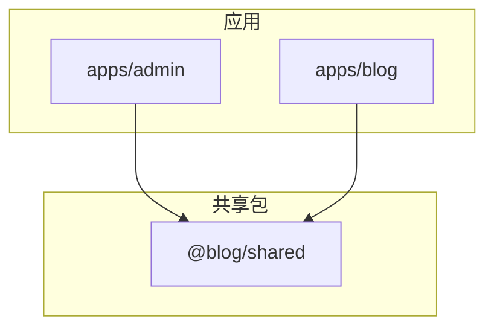
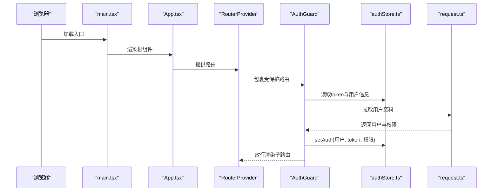
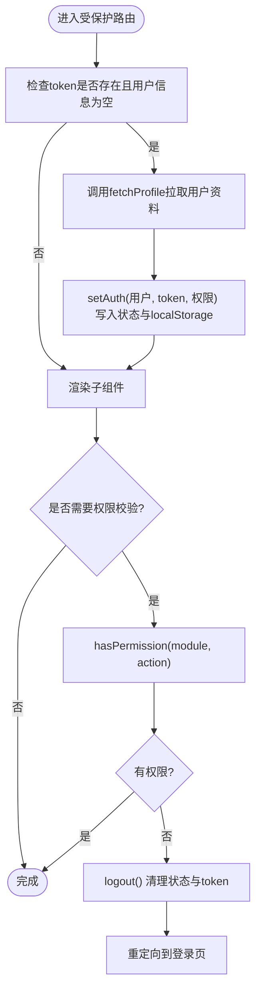
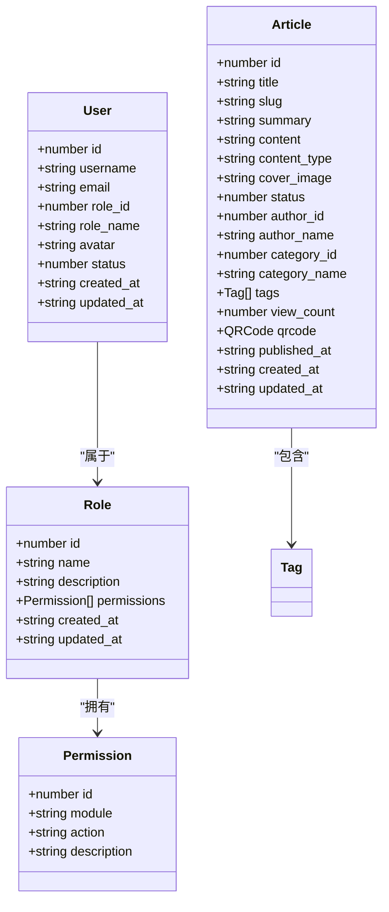
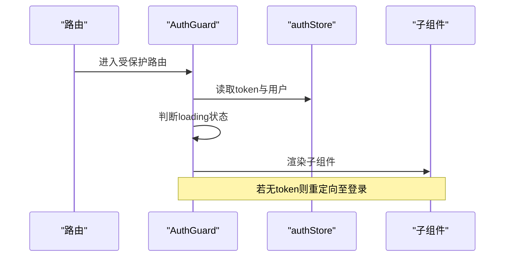
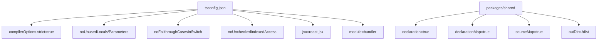
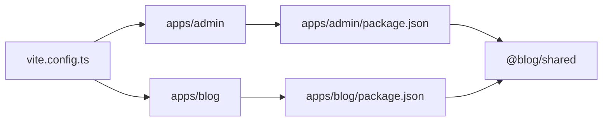

# React与TypeScript规范

<cite>
**本文引用的文件**
- [webSource/apps/admin/package.json](file://webSource/apps/admin/package.json)
- [webSource/apps/blog/package.json](file://webSource/apps/blog/package.json)
- [webSource/packages/shared/package.json](file://webSource/packages/shared/package.json)
- [webSource/apps/admin/tsconfig.json](file://webSource/apps/admin/tsconfig.json)
- [webSource/apps/blog/tsconfig.json](file://webSource/apps/blog/tsconfig.json)
- [webSource/packages/shared/tsconfig.json](file://webSource/packages/shared/tsconfig.json)
- [webSource/apps/admin/src/store/authStore.ts](file://webSource/apps/admin/src/store/authStore.ts)
- [webSource/apps/admin/src/components/AuthGuard.tsx](file://webSource/apps/admin/src/components/AuthGuard.tsx)
- [webSource/apps/admin/src/App.tsx](file://webSource/apps/admin/src/App.tsx)
- [webSource/apps/admin/src/main.tsx](file://webSource/apps/admin/src/main.tsx)
- [webSource/packages/shared/src/types/index.ts](file://webSource/packages/shared/src/types/index.ts)
- [webSource/packages/shared/src/types/user.ts](file://webSource/packages/shared/src/types/user.ts)
- [webSource/packages/shared/src/types/article.ts](file://webSource/packages/shared/src/types/article.ts)
- [webSource/packages/shared/src/utils/request.ts](file://webSource/packages/shared/src/utils/request.ts)
- [webSource/apps/admin/src/pages/Login.tsx](file://webSource/apps/admin/src/pages/Login.tsx)
- [webSource/apps/admin/src/pages/Dashboard.tsx](file://webSource/apps/admin/src/pages/Dashboard.tsx)
- [webSource/apps/admin/src/layouts/AdminLayout.tsx](file://webSource/apps/admin/src/layouts/AdminLayout.tsx)
- [webSource/apps/admin/vite.config.ts](file://webSource/apps/admin/vite.config.ts)
</cite>

## 目录
1. [简介](#简介)
2. [项目结构](#项目结构)
3. [核心组件](#核心组件)
4. [架构总览](#架构总览)
5. [详细组件分析](#详细组件分析)
6. [依赖关系分析](#依赖关系分析)
7. [性能考虑](#性能考虑)
8. [故障排查指南](#故障排查指南)
9. [结论](#结论)
10. [附录](#附录)

## 简介
本规范面向Xiangmuzs项目的前端工程，聚焦React与TypeScript编码实践，覆盖组件设计原则、Hooks使用规范、状态管理（Zustand）、类型系统最佳实践、组件组合模式、TS配置与构建、代码组织与模块化、以及性能优化建议。本文以仓库中现有实现为依据，提炼可复用的工程化标准，并提供可视化图示帮助理解。

## 项目结构
Xiangmuzs采用多包工作区（pnpm workspace）组织，包含两个应用与一个共享包：
- 应用层：admin（后台管理）与 blog（博客前台）
- 共享层：@blog/shared（公共类型、工具与HTTP客户端）

**图表来源**
- [webSource/apps/admin/package.json:12-27](file://webSource/apps/admin/package.json#L12-L27)
- [webSource/apps/blog/package.json:12-29](file://webSource/apps/blog/package.json#L12-L29)
- [webSource/packages/shared/package.json:15-22](file://webSource/packages/shared/package.json#L15-L22)

**章节来源**
- [webSource/apps/admin/package.json:1-28](file://webSource/apps/admin/package.json#L1-L28)
- [webSource/apps/blog/package.json:1-30](file://webSource/apps/blog/package.json#L1-L30)
- [webSource/packages/shared/package.json:1-23](file://webSource/packages/shared/package.json#L1-L23)

## 核心组件
- 函数组件优先：页面组件与布局组件均采用函数式写法，配合Hooks进行状态与副作用管理。
- Hooks使用规范：统一在组件顶层调用，避免条件分支内调用；对异步逻辑使用useEffect封装；对回调使用useCallback稳定引用。
- 组件生命周期管理：通过useEffect处理挂载、更新与卸载阶段的副作用；通过useMemo缓存昂贵计算结果。
- 类型系统：共享类型集中于packages/shared/types，应用侧严格使用这些类型，确保前后端契约一致。
- 状态管理：基于Zustand的轻量状态容器，支持本地存储持久化与权限校验逻辑。

**章节来源**
- [webSource/apps/admin/src/pages/Dashboard.tsx:24-67](file://webSource/apps/admin/src/pages/Dashboard.tsx#L24-L67)
- [webSource/apps/admin/src/pages/Login.tsx:10-118](file://webSource/apps/admin/src/pages/Login.tsx#L10-L118)
- [webSource/apps/admin/src/layouts/AdminLayout.tsx:26-158](file://webSource/apps/admin/src/layouts/AdminLayout.tsx#L26-L158)
- [webSource/apps/admin/src/store/authStore.ts:15-34](file://webSource/apps/admin/src/store/authStore.ts#L15-L34)

## 架构总览
应用启动流程与状态流如下：

**图表来源**
- [webSource/apps/admin/src/main.tsx:8-12](file://webSource/apps/admin/src/main.tsx#L8-L12)
- [webSource/apps/admin/src/App.tsx:6-21](file://webSource/apps/admin/src/App.tsx#L6-L21)
- [webSource/apps/admin/src/components/AuthGuard.tsx:6-37](file://webSource/apps/admin/src/components/AuthGuard.tsx#L6-L37)
- [webSource/apps/admin/src/store/authStore.ts:15-34](file://webSource/apps/admin/src/store/authStore.ts#L15-L34)
- [webSource/packages/shared/src/utils/request.ts:10-35](file://webSource/packages/shared/src/utils/request.ts#L10-L35)

## 详细组件分析

### 状态管理：Zustand与权限校验
- 状态模型：包含用户、权限列表、token三元组，提供setAuth、logout、hasPermission等方法。
- 持久化策略：登录成功后写入localStorage，初始化时从localStorage恢复token。
- 权限校验：hasPermission按module与action匹配，用于菜单与按钮级权限控制。

**图表来源**
- [webSource/apps/admin/src/components/AuthGuard.tsx:11-22](file://webSource/apps/admin/src/components/AuthGuard.tsx#L11-L22)
- [webSource/apps/admin/src/store/authStore.ts:20-33](file://webSource/apps/admin/src/store/authStore.ts#L20-L33)

**章节来源**
- [webSource/apps/admin/src/store/authStore.ts:15-56](file://webSource/apps/admin/src/store/authStore.ts#L15-L56)
- [webSource/apps/admin/src/components/AuthGuard.tsx:6-37](file://webSource/apps/admin/src/components/AuthGuard.tsx#L6-L37)

### 类型系统：接口设计与共享类型
- 用户与权限：User、Role、Permission等核心实体接口，确保前后端一致。
- 文章与媒体：Article、Category、Tag、Media、QRCode等业务类型，明确字段语义与可选属性。
- 导出聚合：通过index.ts统一导出，便于应用侧按需引入。

**图表来源**
- [webSource/packages/shared/src/types/user.ts:1-43](file://webSource/packages/shared/src/types/user.ts#L1-L43)
- [webSource/packages/shared/src/types/article.ts:1-74](file://webSource/packages/shared/src/types/article.ts#L1-L74)

**章节来源**
- [webSource/packages/shared/src/types/index.ts:1-4](file://webSource/packages/shared/src/types/index.ts#L1-L4)
- [webSource/packages/shared/src/types/user.ts:1-43](file://webSource/packages/shared/src/types/user.ts#L1-L43)
- [webSource/packages/shared/src/types/article.ts:1-74](file://webSource/packages/shared/src/types/article.ts#L1-L74)

### 组件组合模式
- 高阶组件（HOC）：AuthGuard作为路由守卫，包裹子组件实现鉴权与加载态。
- Hook组合：useEffect封装副作用，useState管理本地状态，useCallback稳定回调。
- Render Props：未在现有代码中出现，推荐通过自定义Hook替代以提升可测试性与可读性。

**图表来源**
- [webSource/apps/admin/src/components/AuthGuard.tsx:6-37](file://webSource/apps/admin/src/components/AuthGuard.tsx#L6-L37)

**章节来源**
- [webSource/apps/admin/src/components/AuthGuard.tsx:6-37](file://webSource/apps/admin/src/components/AuthGuard.tsx#L6-L37)

### TypeScript配置规范
- 编译目标与模块：ES2020目标、ESNext模块、bundler解析器，确保现代语法与打包器兼容。
- JSX与严格模式：启用react-jsx与严格模式，开启未使用变量/参数、switch穷举、索引访问检查等。
- 声明文件：shared包开启declaration/declarationMap/sourceMap，输出至dist，便于下游包消费。

**图表来源**
- [webSource/apps/admin/tsconfig.json:2-23](file://webSource/apps/admin/tsconfig.json#L2-L23)
- [webSource/apps/blog/tsconfig.json:2-23](file://webSource/apps/blog/tsconfig.json#L2-L23)
- [webSource/packages/shared/tsconfig.json:2-21](file://webSource/packages/shared/tsconfig.json#L2-L21)

**章节来源**
- [webSource/apps/admin/tsconfig.json:1-27](file://webSource/apps/admin/tsconfig.json#L1-L27)
- [webSource/apps/blog/tsconfig.json:1-27](file://webSource/apps/blog/tsconfig.json#L1-L27)
- [webSource/packages/shared/tsconfig.json:1-25](file://webSource/packages/shared/tsconfig.json#L1-L25)

### 代码组织规范
- 文件命名：页面组件采用帕斯卡命名（如Dashboard.tsx），工具与类型文件小驼峰或按功能分组。
- 目录结构：按功能域划分（pages、components、layouts、store、utils、types），避免交叉依赖。
- 模块导入导出：共享类型通过index.ts统一导出，应用侧按需引入，减少循环依赖风险。

**章节来源**
- [webSource/packages/shared/src/types/index.ts:1-4](file://webSource/packages/shared/src/types/index.ts#L1-L4)

### 性能优化建议
- React.memo：对纯展示组件（如统计卡片、列表项）使用memo，避免不必要重渲染。
- 懒加载与代码分割：使用动态import按路由拆分bundle，结合Suspense提升首屏性能。
- 事件与回调：对频繁触发的回调使用useCallback稳定引用，避免子组件因props变化而重渲染。
- 请求缓存：在请求层或状态层增加缓存策略，减少重复请求。
- 图片与资源：使用合适的尺寸与格式，结合懒加载与CDN加速。

[本节为通用指导，无需具体文件引用]

## 依赖关系分析
- 应用依赖共享包：admin与blog均依赖@blog/shared，共享类型与工具。
- 第三方依赖：admin使用@arco-design/web-react与zustand；blog使用react-markdown等生态库。
- 构建工具：Vite + @vitejs/plugin-react，开发代理指向Go后端服务。

**图表来源**
- [webSource/apps/admin/package.json:12-27](file://webSource/apps/admin/package.json#L12-L27)
- [webSource/apps/blog/package.json:12-29](file://webSource/apps/blog/package.json#L12-L29)
- [webSource/apps/admin/vite.config.ts:4-23](file://webSource/apps/admin/vite.config.ts#L4-L23)

**章节来源**
- [webSource/apps/admin/package.json:1-28](file://webSource/apps/admin/package.json#L1-L28)
- [webSource/apps/blog/package.json:1-30](file://webSource/apps/blog/package.json#L1-L30)
- [webSource/apps/admin/vite.config.ts:1-24](file://webSource/apps/admin/vite.config.ts#L1-L24)

## 性能考虑
- 状态粒度：Zustand适合小型到中型状态，避免过度分散；复杂场景可考虑分片store或集成更重的状态方案。
- 异步加载：登录与资料拉取采用异步流程，避免阻塞主线程；错误处理统一收敛至拦截器。
- 资源加载：静态资源与上传资源通过代理转发，减少跨域与额外网络跳转。

[本节为通用指导，无需具体文件引用]

## 故障排查指南
- 登录失败：检查登录表单提交流程与错误提示，确认密码加密与验证码逻辑。
- 401自动登出：拦截器检测401后清理token并跳转登录页，需确认路由前缀与页面跳转逻辑。
- 权限不足：hasPermission返回false时应隐藏相关菜单或按钮，避免误操作。

**章节来源**
- [webSource/apps/admin/src/pages/Login.tsx:43-58](file://webSource/apps/admin/src/pages/Login.tsx#L43-L58)
- [webSource/packages/shared/src/utils/request.ts:26-34](file://webSource/packages/shared/src/utils/request.ts#L26-L34)
- [webSource/apps/admin/src/store/authStore.ts:30-33](file://webSource/apps/admin/src/store/authStore.ts#L30-L33)

## 结论
本规范以现有实现为基础，总结了React函数式组件、Zustand状态管理、共享类型体系与TS配置的最佳实践。建议在后续迭代中持续完善组件抽象、增强单元测试与性能监控，确保代码质量与可维护性。

## 附录
- 启动与构建脚本：各应用通过Vite dev/build/lint/preview命令驱动开发与生产流程。
- 开发代理：admin应用配置/api与/uploads代理，便于联调后端接口与文件上传。

**章节来源**
- [webSource/apps/admin/package.json:6-11](file://webSource/apps/admin/package.json#L6-L11)
- [webSource/apps/blog/package.json:6-11](file://webSource/apps/blog/package.json#L6-L11)
- [webSource/apps/admin/vite.config.ts:10-22](file://webSource/apps/admin/vite.config.ts#L10-L22)