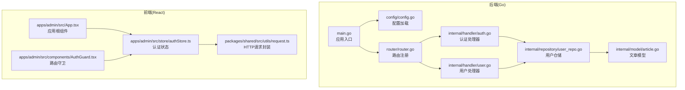
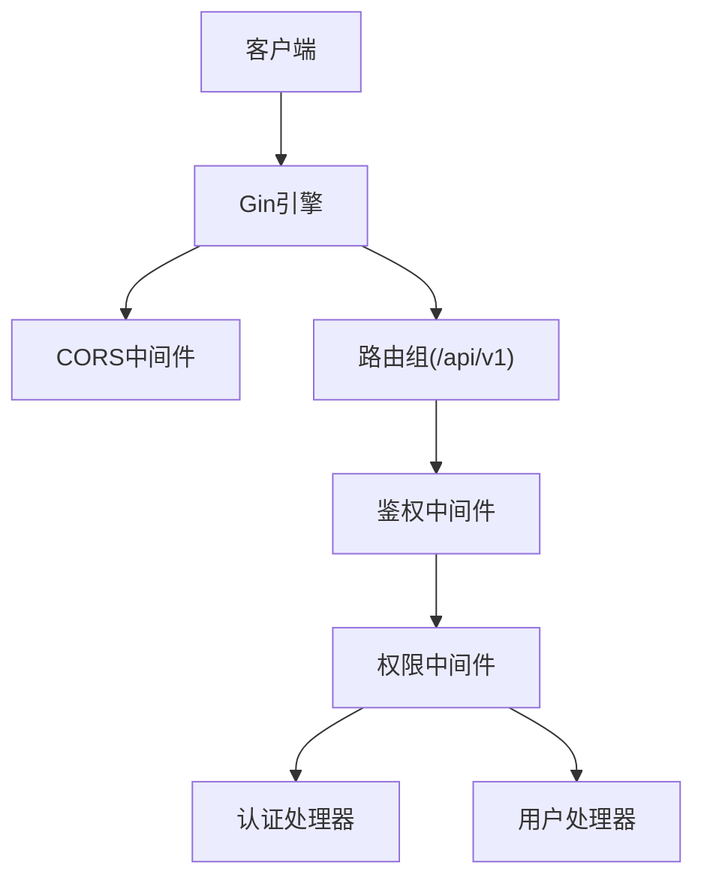
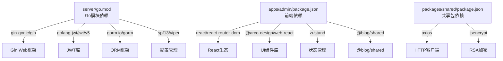
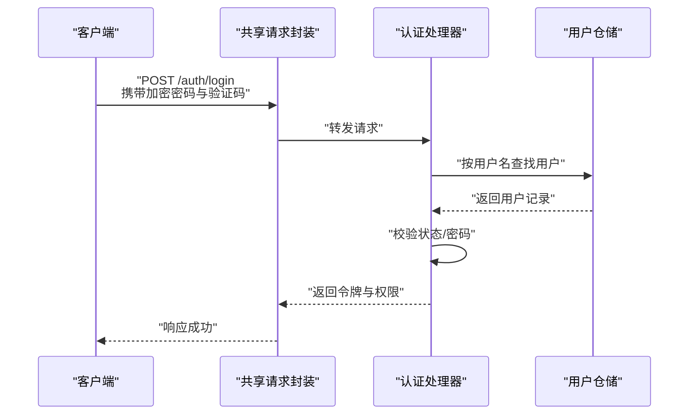
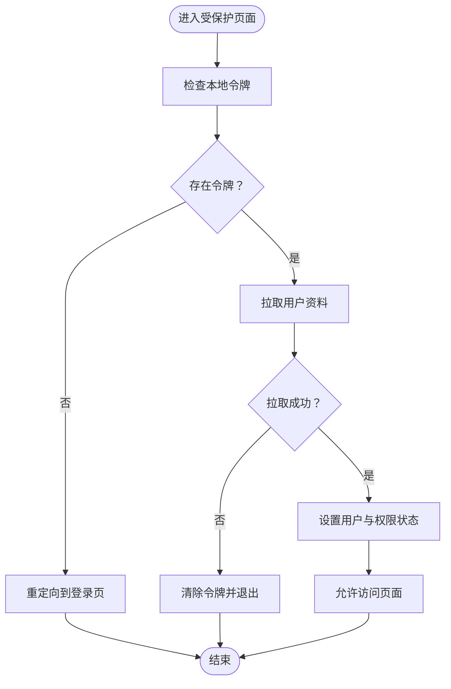

# 代码审查清单

<cite>
**本文档引用的文件**
- [server/main.go](file://server/main.go)
- [server/go.mod](file://server/go.mod)
- [server/config/config.go](file://server/config/config.go)
- [server/router/router.go](file://server/router/router.go)
- [server/internal/handler/auth.go](file://server/internal/handler/auth.go)
- [server/internal/handler/user.go](file://server/internal/handler/user.go)
- [server/internal/model/article.go](file://server/internal/model/article.go)
- [server/internal/repository/user_repo.go](file://server/internal/repository/user_repo.go)
- [webSource/apps/admin/src/App.tsx](file://webSource/apps/admin/src/App.tsx)
- [webSource/apps/admin/src/store/authStore.ts](file://webSource/apps/admin/src/store/authStore.ts)
- [webSource/apps/admin/src/components/AuthGuard.tsx](file://webSource/apps/admin/src/components/AuthGuard.tsx)
- [webSource/packages/shared/src/utils/request.ts](file://webSource/packages/shared/src/utils/request.ts)
- [webSource/apps/admin/package.json](file://webSource/apps/admin/package.json)
- [webSource/packages/shared/package.json](file://webSource/packages/shared/package.json)
</cite>

## 目录
1. [简介](#简介)
2. [项目结构](#项目结构)
3. [核心组件](#核心组件)
4. [架构总览](#架构总览)
5. [详细组件分析](#详细组件分析)
6. [依赖分析](#依赖分析)
7. [性能考虑](#性能考虑)
8. [故障排查指南](#故障排查指南)
9. [结论](#结论)
10. [附录](#附录)

## 简介
本清单面向Xiangmuzs项目的Go后端与React前端，提供系统化的代码审查要点，覆盖代码结构、错误处理、并发安全、性能优化、API设计、数据库操作、安全性、可维护性等维度。审查目标是确保系统在功能正确性、运行稳定性、扩展性与安全性方面达到工程化标准。

## 项目结构
项目采用前后端分离架构：
- 后端：基于Gin框架的Go服务，采用分层架构（handler/service/repository/model/dto/pkg），通过Viper加载配置，GORM进行数据库访问，路由按模块划分。
- 前端：采用Vite+React+TypeScript，使用Arco Design组件库，Zustand进行状态管理，Axios封装请求拦截器，共享包提供通用工具与类型定义。

**图表来源**
- [server/main.go:19-76](file://server/main.go#L19-L76)
- [server/config/config.go:47-64](file://server/config/config.go#L47-L64)
- [server/router/router.go:11-103](file://server/router/router.go#L11-L103)
- [server/internal/handler/auth.go:13-93](file://server/internal/handler/auth.go#L13-L93)
- [server/internal/handler/user.go:13-75](file://server/internal/handler/user.go#L13-L75)
- [server/internal/repository/user_repo.go:8-48](file://server/internal/repository/user_repo.go#L8-L48)
- [server/internal/model/article.go:5-23](file://server/internal/model/article.go#L5-L23)
- [webSource/apps/admin/src/App.tsx:15-21](file://webSource/apps/admin/src/App.tsx#L15-L21)
- [webSource/apps/admin/src/store/authStore.ts:15-34](file://webSource/apps/admin/src/store/authStore.ts#L15-L34)
- [webSource/apps/admin/src/components/AuthGuard.tsx:6-37](file://webSource/apps/admin/src/components/AuthGuard.tsx#L6-L37)
- [webSource/packages/shared/src/utils/request.ts:5-37](file://webSource/packages/shared/src/utils/request.ts#L5-L37)

**章节来源**
- [server/main.go:19-76](file://server/main.go#L19-L76)
- [server/router/router.go:11-103](file://server/router/router.go#L11-L103)
- [webSource/apps/admin/src/App.tsx:15-21](file://webSource/apps/admin/src/App.tsx#L15-L21)

## 核心组件
- 应用入口与初始化：负责配置加载、数据库连接、迁移执行、RSA初始化、中间件与路由装配、服务器启动。
- 路由与权限：按公开/认证/权限三类路由组织，使用中间件进行鉴权与权限校验。
- 处理器层：封装业务请求解析、参数校验、调用仓储、返回统一响应格式。
- 仓储层：封装数据库读写、分页查询、关联预加载。
- 前端状态与请求：Zustand集中管理登录态与权限，Axios统一拦截请求/响应，路由守卫控制访问。

**章节来源**
- [server/main.go:19-76](file://server/main.go#L19-L76)
- [server/router/router.go:11-103](file://server/router/router.go#L11-L103)
- [server/internal/handler/auth.go:13-93](file://server/internal/handler/auth.go#L13-L93)
- [server/internal/handler/user.go:13-75](file://server/internal/handler/user.go#L13-L75)
- [server/internal/repository/user_repo.go:8-48](file://server/internal/repository/user_repo.go#L8-L48)
- [webSource/apps/admin/src/store/authStore.ts:15-34](file://webSource/apps/admin/src/store/authStore.ts#L15-L34)
- [webSource/packages/shared/src/utils/request.ts:5-37](file://webSource/packages/shared/src/utils/request.ts#L5-L37)

## 架构总览
后端采用经典的分层架构，职责清晰：
- 入口层：main.go负责应用生命周期与全局配置。
- 路由层：router.go注册路由组与中间件。
- 处理器层：各模块处理器处理HTTP请求，调用仓储与工具。
- 仓储层：通过GORM对数据库进行CRUD与关联查询。
- 配置层：Viper从多路径加载YAML配置。
- 前端层：应用根组件、状态管理、请求封装与路由守卫。

**图表来源**
- [server/main.go:59-69](file://server/main.go#L59-L69)
- [server/router/router.go:24-102](file://server/router/router.go#L24-L102)

**章节来源**
- [server/main.go:59-69](file://server/main.go#L59-L69)
- [server/router/router.go:24-102](file://server/router/router.go#L24-L102)

## 详细组件分析

### Go后端代码审查要点

#### 代码结构与分层
- 分层是否清晰：handler/service/repository/model/dto/pkg职责明确，避免交叉耦合。
- 模块化程度：按领域拆分路由与处理器，便于维护与扩展。
- 依赖注入：处理器通过构造函数注入仓储与DB实例，利于测试与替换。

**章节来源**
- [server/router/router.go:11-23](file://server/router/router.go#L11-L23)
- [server/internal/handler/auth.go:19-25](file://server/internal/handler/auth.go#L19-L25)
- [server/internal/handler/user.go:18-23](file://server/internal/handler/user.go#L18-L23)

#### 错误处理
- 参数绑定：使用ShouldBindJSON/ShouldBindQuery进行强类型解析，失败时返回明确错误码。
- 业务异常：针对未找到、禁止访问、内部错误等场景返回一致的错误响应。
- 统一响应：通过工具方法输出成功/分页/错误响应，保持API一致性。

**章节来源**
- [server/internal/handler/auth.go:32-36](file://server/internal/handler/auth.go#L32-L36)
- [server/internal/handler/auth.go:57-71](file://server/internal/handler/auth.go#L57-L71)
- [server/internal/handler/user.go:26-30](file://server/internal/handler/user.go#L26-L30)
- [server/internal/handler/user.go:42-46](file://server/internal/handler/user.go#L42-L46)

#### 并发安全
- 中间件与全局状态：当前中间件与全局配置未见共享可变状态，整体并发风险较低。
- 仓储与GORM：GORM默认非并发安全，需确保在单例上下文中使用；必要时引入连接池与事务隔离。
- 建议：对高并发场景增加限流与熔断策略，避免数据库压力过大。

**章节来源**
- [server/main.go:41-44](file://server/main.go#L41-L44)
- [server/go.mod:5-13](file://server/go.mod#L5-L13)

#### 性能考虑
- 数据库日志：调试模式开启GORM日志，便于定位问题但会带来开销，建议生产关闭或降级。
- 预加载与分页：仓储层使用Preload与分页查询，避免N+1与全表扫描。
- 上传与静态资源：静态文件映射到上传目录，注意磁盘IO与缓存策略。

**章节来源**
- [server/main.go:36-39](file://server/main.go#L36-L39)
- [server/internal/repository/user_repo.go:63](file://server/internal/repository/user_repo.go#L63)

#### API接口审查清单
- RESTful设计：路由层次清晰，资源命名规范，动词与HTTP方法匹配。
- 权限控制：使用RequirePermission中间件对关键操作进行权限校验。
- 参数验证：请求体与查询参数均进行绑定与默认值处理。
- 文档完整性：当前未发现OpenAPI/Swagger自动生成，建议补充接口文档与示例。

**章节来源**
- [server/router/router.go:24-102](file://server/router/router.go#L24-L102)
- [server/internal/handler/auth.go:32-36](file://server/internal/handler/auth.go#L32-L36)
- [server/internal/handler/user.go:26-30](file://server/internal/handler/user.go#L26-L30)

#### 数据库操作审查要点
- SQL注入防护：使用GORM ORM与参数绑定，避免字符串拼接。
- 事务处理：当前未见显式事务包裹，建议对跨表写入与幂等性要求高的操作使用事务。
- 索引优化：模型中对常用查询字段建立索引（如状态+发布时间、分类ID）。
- 连接与超时：建议配置连接池大小、最大空闲连接数与查询超时。

**章节来源**
- [server/internal/model/article.go:13-20](file://server/internal/model/article.go#L13-L20)
- [server/internal/repository/user_repo.go:24-48](file://server/internal/repository/user_repo.go#L24-L48)

#### 安全性审查清单
- 输入验证：前端RSA加密、后端参数绑定与校验、验证码开关。
- 权限检查：JWT鉴权与模块/动作级权限校验。
- 敏感信息处理：密码哈希存储、本地存储令牌清理、错误信息不泄露具体细节。
- 传输安全：建议启用HTTPS与安全头设置。

**章节来源**
- [server/internal/handler/auth.go:50-55](file://server/internal/handler/auth.go#L50-L55)
- [server/internal/handler/auth.go:73-77](file://server/internal/handler/auth.go#L73-L77)
- [webSource/packages/shared/src/utils/request.ts:10-16](file://webSource/packages/shared/src/utils/request.ts#L10-L16)
- [webSource/apps/admin/src/store/authStore.ts:25-28](file://webSource/apps/admin/src/store/authStore.ts#L25-L28)

#### 可维护性评估
- 代码复杂度：处理器逻辑集中在单文件内，建议按功能拆分或引入service层进一步解耦。
- 测试覆盖率：当前未见测试文件，建议补充单元测试与集成测试。
- 文档质量：缺少接口文档与README，建议完善部署与开发环境说明。

**章节来源**
- [server/internal/handler/auth.go:13-93](file://server/internal/handler/auth.go#L13-L93)
- [server/internal/handler/user.go:13-75](file://server/internal/handler/user.go#L13-L75)

### React组件代码审查要点

#### 组件设计
- 结构清晰：应用根组件仅负责国际化与路由容器，子组件职责单一。
- 布局与主题：通过ConfigProvider统一主题与本地化。

**章节来源**
- [webSource/apps/admin/src/App.tsx:6-13](file://webSource/apps/admin/src/App.tsx#L6-L13)

#### 状态管理
- Zustand使用：集中管理用户、令牌与权限，提供hasPermission便捷判断。
- 本地存储：令牌持久化，登出时清理，避免重复登录态。

**章节来源**
- [webSource/apps/admin/src/store/authStore.ts:15-34](file://webSource/apps/admin/src/store/authStore.ts#L15-L34)

#### Hooks使用与TypeScript类型安全
- 类型约束：请求封装与状态接口均使用TypeScript类型，减少运行时错误。
- 生命周期：useEffect用于首次拉取用户资料，避免重复请求。

**章节来源**
- [webSource/apps/admin/src/store/authStore.ts:36-50](file://webSource/apps/admin/src/store/authStore.ts#L36-L50)
- [webSource/apps/admin/src/components/AuthGuard.tsx:11-22](file://webSource/apps/admin/src/components/AuthGuard.tsx#L11-L22)

#### 请求拦截与路由守卫
- Axios拦截器：统一封装请求头与错误处理，401自动跳转登录。
- 路由守卫：未登录或未完成初始化时显示加载态或重定向。

**章节来源**
- [webSource/packages/shared/src/utils/request.ts:18-35](file://webSource/packages/shared/src/utils/request.ts#L18-L35)
- [webSource/apps/admin/src/components/AuthGuard.tsx:6-37](file://webSource/apps/admin/src/components/AuthGuard.tsx#L6-L37)

## 依赖分析

**图表来源**
- [server/go.mod:5-13](file://server/go.mod#L5-L13)
- [webSource/apps/admin/package.json:12-27](file://webSource/apps/admin/package.json#L12-L27)
- [webSource/packages/shared/package.json:15-22](file://webSource/packages/shared/package.json#L15-L22)

**章节来源**
- [server/go.mod:5-13](file://server/go.mod#L5-L13)
- [webSource/apps/admin/package.json:12-27](file://webSource/apps/admin/package.json#L12-L27)
- [webSource/packages/shared/package.json:15-22](file://webSource/packages/shared/package.json#L15-L22)

## 性能考虑
- 后端
  - 日志级别：调试模式下GORM日志开启，建议生产关闭或降级。
  - 数据库连接：合理设置连接池参数，避免高并发下的连接争用。
  - 查询优化：对高频查询字段建立索引，避免SELECT *与N+1查询。
- 前端
  - 请求超时：统一15秒超时，避免长时间阻塞。
  - 状态粒度：Zustand状态按需拆分，避免不必要的重渲染。
  - 缓存策略：对静态资源与公共设置进行缓存。

[本节为通用指导，无需特定文件引用]

## 故障排查指南
- 启动失败
  - 配置加载：确认配置文件路径与键名正确。
  - 数据库连接：检查DSN参数与网络连通性。
- 认证问题
  - RSA密钥：确认初始化成功且前端加密一致。
  - JWT生成：检查密钥与过期时间配置。
- 权限问题
  - 中间件链路：确认鉴权与权限中间件顺序正确。
  - 用户权限：检查角色与权限映射是否正确。
- 前端登录态
  - 令牌存储：确认localStorage写入与清理逻辑。
  - 401处理：确认拦截器与路由守卫联动。

**章节来源**
- [server/config/config.go:47-64](file://server/config/config.go#L47-L64)
- [server/main.go:27-44](file://server/main.go#L27-L44)
- [server/internal/handler/auth.go:27-30](file://server/internal/handler/auth.go#L27-L30)
- [webSource/packages/shared/src/utils/request.ts:18-35](file://webSource/packages/shared/src/utils/request.ts#L18-L35)
- [webSource/apps/admin/src/store/authStore.ts:25-28](file://webSource/apps/admin/src/store/authStore.ts#L25-L28)

## 结论
Xiangmuzs项目在后端采用清晰的分层架构与中间件体系，在前端实现了统一的状态管理与请求拦截。建议后续重点补齐接口文档、测试覆盖与事务处理，同时完善数据库索引与连接池配置，以提升系统的稳定性与可维护性。

[本节为总结，无需特定文件引用]

## 附录

### API调用序列图（登录流程）

**图表来源**
- [webSource/packages/shared/src/utils/request.ts:42-50](file://webSource/packages/shared/src/utils/request.ts#L42-L50)
- [server/internal/handler/auth.go:31-93](file://server/internal/handler/auth.go#L31-L93)
- [server/internal/repository/user_repo.go:24-28](file://server/internal/repository/user_repo.go#L24-L28)

### 登录态与路由守卫流程

**图表来源**
- [webSource/apps/admin/src/components/AuthGuard.tsx:6-37](file://webSource/apps/admin/src/components/AuthGuard.tsx#L6-L37)
- [webSource/apps/admin/src/store/authStore.ts:15-34](file://webSource/apps/admin/src/store/authStore.ts#L15-L34)