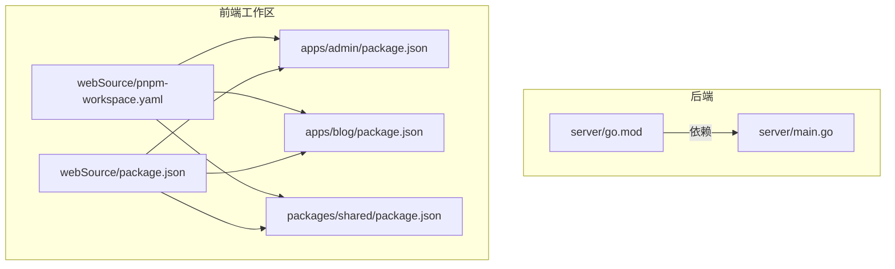
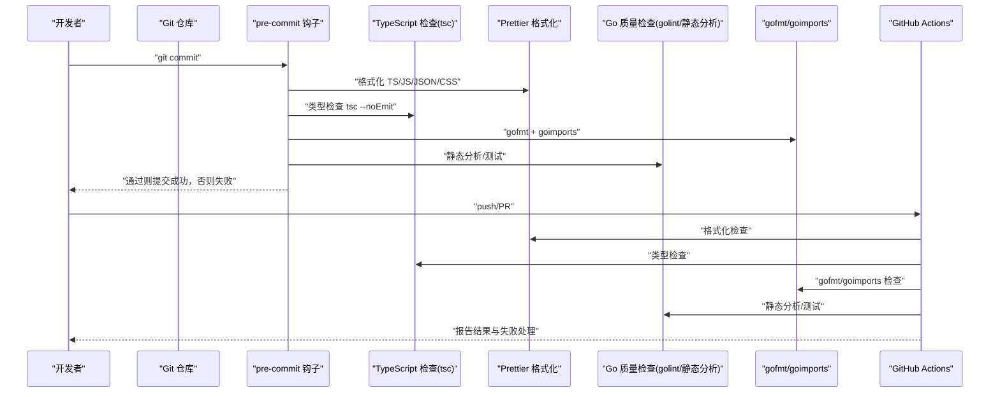
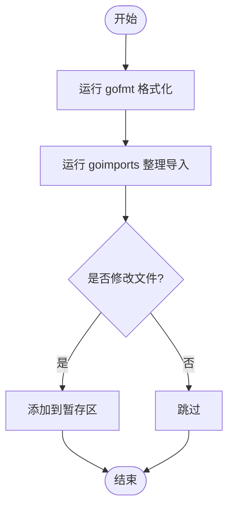
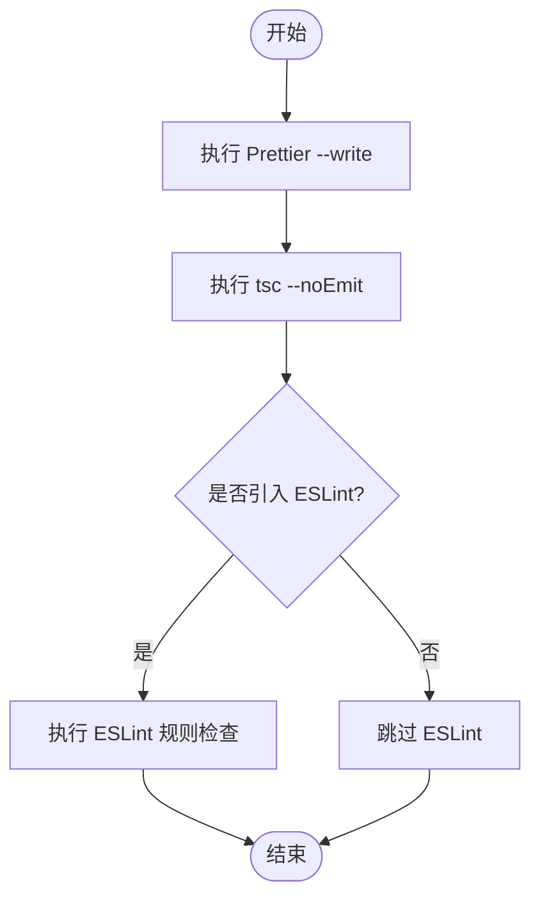
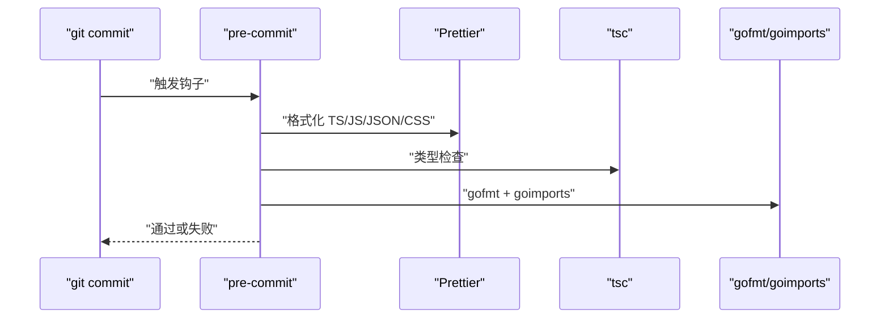
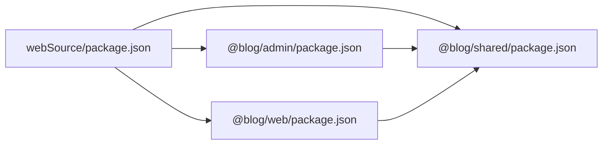

# 代码格式化工具配置

<cite>
**本文引用的文件**
- [server/go.mod](file://server/go.mod)
- [webSource/package.json](file://webSource/package.json)
- [webSource/pnpm-workspace.yaml](file://webSource/pnpm-workspace.yaml)
- [webSource/apps/admin/package.json](file://webSource/apps/admin/package.json)
- [webSource/apps/blog/package.json](file://webSource/apps/blog/package.json)
- [webSource/packages/shared/package.json](file://webSource/packages/shared/package.json)
- [webSource/apps/admin/tsconfig.json](file://webSource/apps/admin/tsconfig.json)
- [webSource/apps/blog/tsconfig.json](file://webSource/apps/blog/tsconfig.json)
- [webSource/packages/shared/tsconfig.json](file://webSource/packages/shared/tsconfig.json)
- [webSource/apps/admin/vite.config.ts](file://webSource/apps/admin/vite.config.ts)
- [webSource/apps/blog/vite.config.ts](file://webSource/apps/blog/vite.config.ts)
- [webSource/apps/admin/src/main.tsx](file://webSource/apps/admin/src/main.tsx)
- [webSource/apps/blog/src/main.tsx](file://webSource/apps/blog/src/main.tsx)
- [webSource/apps/admin/src/App.tsx](file://webSource/apps/admin/src/App.tsx)
- [webSource/apps/blog/src/App.tsx](file://webSource/apps/blog/src/App.tsx)
</cite>

## 目录
1. [简介](#简介)
2. [项目结构](#项目结构)
3. [核心组件](#核心组件)
4. [架构总览](#架构总览)
5. [详细组件分析](#详细组件分析)
6. [依赖分析](#依赖分析)
7. [性能考虑](#性能考虑)
8. [故障排除指南](#故障排除指南)
9. [结论](#结论)
10. [附录](#附录)

## 简介
本文件面向Xiangmuzs项目，系统性梳理并给出代码格式化与质量保障的完整配置方案，覆盖以下方面：
- Go语言格式化与导入整理：gofmt使用、goimports导入整理、代码格式化钩子
- TypeScript格式化：Prettier配置、ESLint规则（建议）、VS Code格式化扩展
- Git钩子：pre-commit钩子设置、代码检查自动化、格式化自动执行
- IDE配置：VS Code工作区设置、插件推荐、快捷键配置
- CI/CD：GitHub Actions配置思路、自动化代码质量检查与格式化失败处理
- 团队协作：格式化一致性保证方案

说明：当前仓库未包含Prettier配置文件、ESLint配置文件、pre-commit配置文件以及GitHub Actions工作流文件，本文在“现有能力”基础上提供可直接落地的配置建议与最佳实践。

## 项目结构
Xiangmuzs采用前后端分离与Monorepo组织方式：
- 后端：Go语言服务位于server目录，使用模块管理依赖
- 前端：webSource为多包工作区，包含admin、blog两个前端应用与shared共享包
- 工作区：通过pnpm工作区统一管理包脚本与依赖

**图表来源**
- [server/go.mod:1-60](file://server/go.mod#L1-L60)
- [webSource/pnpm-workspace.yaml:1-4](file://webSource/pnpm-workspace.yaml#L1-L4)
- [webSource/package.json:1-22](file://webSource/package.json#L1-L22)
- [webSource/apps/admin/package.json:1-28](file://webSource/apps/admin/package.json#L1-L28)
- [webSource/apps/blog/package.json:1-30](file://webSource/apps/blog/package.json#L1-L30)
- [webSource/packages/shared/package.json:1-23](file://webSource/packages/shared/package.json#L1-L23)

**章节来源**
- [server/go.mod:1-60](file://server/go.mod#L1-L60)
- [webSource/pnpm-workspace.yaml:1-4](file://webSource/pnpm-workspace.yaml#L1-L4)
- [webSource/package.json:1-22](file://webSource/package.json#L1-L22)

## 核心组件
- Go格式化与导入整理
  - 使用gofmt进行标准格式化
  - 使用goimports进行导入整理
  - 在本地与CI中统一执行
- TypeScript格式化与类型检查
  - 使用Prettier进行格式化
  - 使用TypeScript编译器进行类型检查（tsc）
  - 建议引入ESLint以补充规则（当前仓库未包含ESLint配置）
- Git钩子与CI集成
  - pre-commit钩子：在提交前自动运行格式化与检查
  - GitHub Actions：在PR与主分支推送时执行格式化与质量检查

**章节来源**
- [webSource/package.json:14-15](file://webSource/package.json#L14-L15)
- [webSource/apps/admin/package.json:9](file://webSource/apps/admin/package.json#L9)
- [webSource/apps/blog/package.json:9](file://webSource/apps/blog/package.json#L9)
- [webSource/packages/shared/package.json:13](file://webSource/packages/shared/package.json#L13)

## 架构总览
下图展示从开发到CI的格式化与质量检查流程：

[本图为概念性流程示意，不对应具体源码文件，故无图表来源]

## 详细组件分析

### Go语言格式化与导入整理
- 标准格式化：使用gofmt对所有Go源文件进行格式化
- 导入整理：使用goimports对导入块进行排序与去重
- 钩子集成：在pre-commit中调用gofmt与goimports，确保提交前格式一致
- CI集成：在GitHub Actions中增加gofmt与goimports检查步骤，失败即中断

[本图为概念性流程示意，不对应具体源码文件，故无图表来源]

**章节来源**
- [server/go.mod:1-60](file://server/go.mod#L1-L60)

### TypeScript格式化与类型检查
- Prettier格式化：通过根脚本统一执行格式化，支持TS/TSX/JSON/CSS等
- 类型检查：各包独立执行tsc --noEmit，避免生成输出文件
- VS Code建议：启用Prettier作为默认格式化程序，配合ESLint实现更严格的规则（建议）

[本图为概念性流程示意，不对应具体源码文件，故无图表来源]

**章节来源**
- [webSource/package.json:14-15](file://webSource/package.json#L14-L15)
- [webSource/apps/admin/package.json:9](file://webSource/apps/admin/package.json#L9)
- [webSource/apps/blog/package.json:9](file://webSource/apps/blog/package.json#L9)
- [webSource/packages/shared/package.json:13](file://webSource/packages/shared/package.json#L13)

### Git钩子与CI集成
- pre-commit钩子：在提交前自动执行Prettier与tsc检查；Go侧执行gofmt/goimports；如失败则阻止提交
- GitHub Actions：在PR与主分支推送时执行格式化与质量检查，失败时中断构建并反馈问题
- 失败处理：将格式化错误与类型检查错误标准化输出，便于定位修复

[本图为概念性流程示意，不对应具体源码文件，故无图表来源]

**章节来源**
- [webSource/package.json:14-15](file://webSource/package.json#L14-L15)

### IDE配置建议（VS Code）
- 默认格式化程序：设置Prettier为默认格式化器，确保保存时自动格式化
- 插件推荐：安装TypeScript相关插件、ESLint插件（如引入ESLint）、Go插件
- 快捷键：为格式化与类型检查绑定常用快捷键，提升开发效率
- 工作区设置：在工作区根目录配置格式化偏好，确保团队成员一致

[本节为通用IDE配置建议，不直接分析具体源码文件，故无章节来源]

### 团队协作与一致性保证
- 统一工具链：在项目根目录提供统一的脚本与配置，避免个人环境差异
- 提交规范：通过pre-commit强制执行格式化与检查，减少CI失败率
- 文档与培训：提供格式化工具配置文档与常见问题排查指南，降低协作成本

[本节为通用协作建议，不直接分析具体源码文件，故无章节来源]

## 依赖分析
- 前端Monorepo依赖关系
  - 根package.json定义统一脚本与依赖
  - admin与blog应用依赖shared共享包
  - 各包内部通过tsc进行类型检查

**图表来源**
- [webSource/package.json:1-22](file://webSource/package.json#L1-L22)
- [webSource/apps/admin/package.json:1-28](file://webSource/apps/admin/package.json#L1-L28)
- [webSource/apps/blog/package.json:1-30](file://webSource/apps/blog/package.json#L1-L30)
- [webSource/packages/shared/package.json:1-23](file://webSource/packages/shared/package.json#L1-L23)

**章节来源**
- [webSource/package.json:1-22](file://webSource/package.json#L1-L22)
- [webSource/pnpm-workspace.yaml:1-4](file://webSource/pnpm-workspace.yaml#L1-L4)

## 性能考虑
- 并行执行：在根脚本中并行执行多个包的类型检查与构建，缩短等待时间
- 缓存与增量：利用Vite与TypeScript的增量编译能力，减少重复工作
- 钩子优化：仅对变更文件执行格式化与检查，避免全量扫描

[本节为通用性能建议，不直接分析具体源码文件，故无章节来源]

## 故障排除指南
- Prettier格式化失败
  - 检查文件是否被忽略（.prettierignore/.gitignore）
  - 确认Prettier版本与配置兼容
- TypeScript类型检查失败
  - 查看tsc输出的具体类型错误
  - 确保类型声明与第三方库版本匹配
- gofmt/goimports失败
  - 检查Go版本与工具链
  - 确认模块路径与导入顺序
- pre-commit阻塞
  - 查看钩子日志，逐项修复格式化与类型错误
  - 将修复后的文件重新添加到暂存区并重试

[本节为通用故障排除建议，不直接分析具体源码文件，故无章节来源]

## 结论
Xiangmuzs项目已具备基础的格式化与类型检查能力：根脚本统一执行Prettier与tsc，Go模块管理清晰。建议进一步完善以下方面以提升团队协作效率与质量稳定性：
- 引入ESLint以增强前端规则约束
- 完善pre-commit与GitHub Actions配置，形成完整的自动化质量门禁
- 在团队内推广统一的IDE配置与快捷键，减少分歧

[本节为总结性内容，不直接分析具体源码文件，故无章节来源]

## 附录
- 现有配置要点速览
  - Go模块：模块名、Go版本、依赖列表
  - 前端工作区：pnpm工作区配置、各包脚本与依赖
  - 应用配置：Vite代理、构建输出目录、开发服务器端口
  - 共享包：严格模式、声明文件与输出目录

**章节来源**
- [server/go.mod:1-60](file://server/go.mod#L1-L60)
- [webSource/pnpm-workspace.yaml:1-4](file://webSource/pnpm-workspace.yaml#L1-L4)
- [webSource/apps/admin/vite.config.ts:1-24](file://webSource/apps/admin/vite.config.ts#L1-L24)
- [webSource/apps/blog/vite.config.ts:1-24](file://webSource/apps/blog/vite.config.ts#L1-L24)
- [webSource/apps/admin/tsconfig.json:1-27](file://webSource/apps/admin/tsconfig.json#L1-L27)
- [webSource/apps/blog/tsconfig.json:1-27](file://webSource/apps/blog/tsconfig.json#L1-L27)
- [webSource/packages/shared/tsconfig.json:1-25](file://webSource/packages/shared/tsconfig.json#L1-L25)
- [webSource/apps/admin/src/main.tsx:1-13](file://webSource/apps/admin/src/main.tsx#L1-L13)
- [webSource/apps/blog/src/main.tsx:1-12](file://webSource/apps/blog/src/main.tsx#L1-L12)
- [webSource/apps/admin/src/App.tsx:1-22](file://webSource/apps/admin/src/App.tsx#L1-L22)
- [webSource/apps/blog/src/App.tsx:1-7](file://webSource/apps/blog/src/App.tsx#L1-L7)