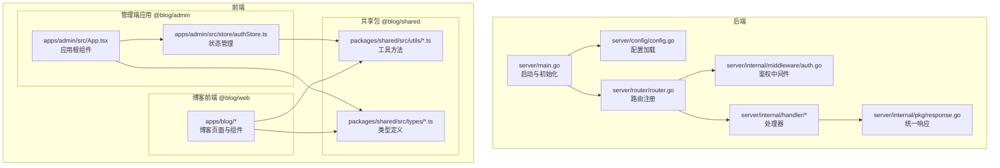
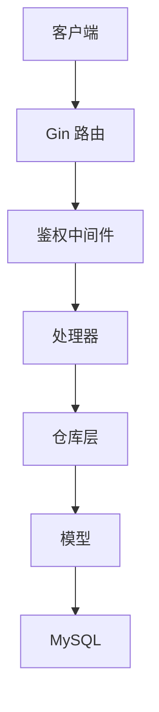
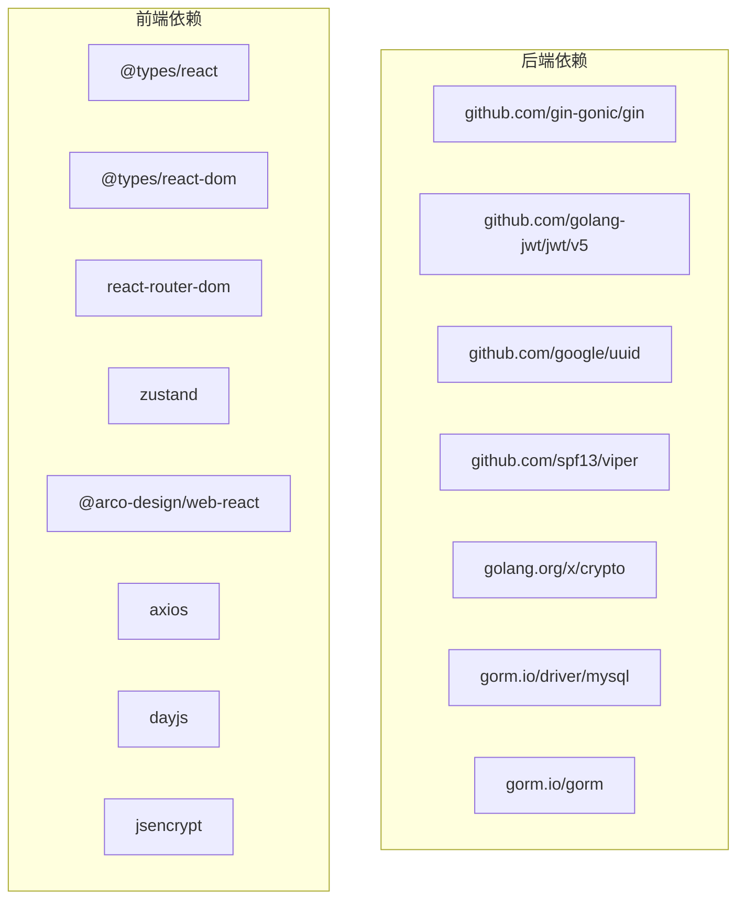
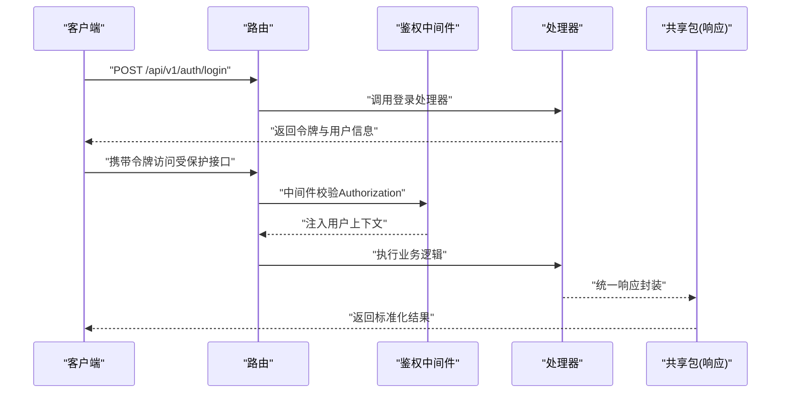

# 代码规范与最佳实践

<cite>
**本文引用的文件**
- [server/main.go](file://server/main.go)
- [server/go.mod](file://server/go.mod)
- [server/config/config.go](file://server/config/config.go)
- [server/router/router.go](file://server/router/router.go)
- [server/internal/middleware/auth.go](file://server/internal/middleware/auth.go)
- [server/internal/pkg/response.go](file://server/internal/pkg/response.go)
- [server/internal/handler/article.go](file://server/internal/handler/article.go)
- [webSource/apps/admin/package.json](file://webSource/apps/admin/package.json)
- [webSource/apps/blog/package.json](file://webSource/apps/blog/package.json)
- [webSource/packages/shared/package.json](file://webSource/packages/shared/package.json)
- [webSource/apps/admin/src/App.tsx](file://webSource/apps/admin/src/App.tsx)
- [webSource/apps/admin/src/store/authStore.ts](file://webSource/apps/admin/src/store/authStore.ts)
- [webSource/packages/shared/src/types/article.ts](file://webSource/packages/shared/src/types/article.ts)
- [webSource/packages/shared/src/utils/request.ts](file://webSource/packages/shared/src/utils/request.ts)
</cite>

## 目录
1. [引言](#引言)
2. [项目结构](#项目结构)
3. [核心组件](#核心组件)
4. [架构总览](#架构总览)
5. [详细组件分析](#详细组件分析)
6. [依赖分析](#依赖分析)
7. [性能考虑](#性能考虑)
8. [故障排查指南](#故障排查指南)
9. [结论](#结论)
10. [附录](#附录)

## 引言
本指南面向Xiangmuzs博客平台的开发团队，系统性地给出后端Go语言、前端React与TypeScript的编码规范、最佳实践与质量保障流程。内容涵盖命名约定、包结构组织、错误处理模式、接口设计原则、组件设计与状态管理、类型系统与泛型使用、代码格式化工具配置、注释与文档生成标准、代码审查清单以及性能优化与内存管理建议。

## 项目结构
后端采用分层架构：入口程序负责初始化配置、数据库连接、迁移与路由注册；路由层按模块划分；中间件统一处理鉴权与跨域；处理器层封装业务请求与响应；数据访问层通过仓库模式隔离持久化细节；通用包提供统一响应与工具能力。前端采用Vite+React多应用工作区，共享包提供公共类型与工具，应用间通过共享包解耦。

**图表来源**
- [server/main.go:19-76](file://server/main.go#L19-L76)
- [server/config/config.go:47-64](file://server/config/config.go#L47-L64)
- [server/router/router.go:11-103](file://server/router/router.go#L11-L103)
- [server/internal/middleware/auth.go:10-37](file://server/internal/middleware/auth.go#L10-L37)
- [server/internal/pkg/response.go:22-69](file://server/internal/pkg/response.go#L22-L69)
- [webSource/apps/admin/src/App.tsx:6-21](file://webSource/apps/admin/src/App.tsx#L6-L21)
- [webSource/apps/admin/src/store/authStore.ts:15-34](file://webSource/apps/admin/src/store/authStore.ts#L15-L34)
- [webSource/packages/shared/src/types/article.ts:1-74](file://webSource/packages/shared/src/types/article.ts#L1-L74)
- [webSource/packages/shared/src/utils/request.ts:5-37](file://webSource/packages/shared/src/utils/request.ts#L5-L37)

**章节来源**
- [server/main.go:19-76](file://server/main.go#L19-L76)
- [server/router/router.go:11-103](file://server/router/router.go#L11-L103)
- [webSource/apps/admin/src/App.tsx:6-21](file://webSource/apps/admin/src/App.tsx#L6-L21)

## 核心组件
- 统一响应与分页：通过统一响应体与分页包装，保证前后端一致的交互契约，便于前端统一处理。
- 鉴权中间件：集中校验Authorization头、解析令牌并注入用户上下文，简化处理器中的权限判断。
- 路由分组与权限控制：基于模块与动作的权限控制，结合中间件在路由层强制执行。
- 前端状态管理：使用轻量状态库进行登录态与权限缓存，结合拦截器自动注入令牌与处理401。
- 类型系统：共享包提供强类型模型，确保前后端数据结构一致性。

**章节来源**
- [server/internal/pkg/response.go:9-69](file://server/internal/pkg/response.go#L9-L69)
- [server/internal/middleware/auth.go:10-37](file://server/internal/middleware/auth.go#L10-L37)
- [server/router/router.go:44-102](file://server/router/router.go#L44-L102)
- [webSource/apps/admin/src/store/authStore.ts:15-34](file://webSource/apps/admin/src/store/authStore.ts#L15-L34)
- [webSource/packages/shared/src/types/article.ts:1-74](file://webSource/packages/shared/src/types/article.ts#L1-L74)

## 架构总览
后端以Gin为核心，配合Viper配置、GORM ORM与MySQL驱动；路由按模块拆分，处理器调用仓库层完成数据操作；前端通过Axios统一请求，拦截器处理鉴权与错误；共享包承载类型与工具，减少重复与不一致。

**图表来源**
- [server/router/router.go:11-103](file://server/router/router.go#L11-L103)
- [server/internal/middleware/auth.go:10-37](file://server/internal/middleware/auth.go#L10-L37)
- [server/internal/handler/article.go:31-75](file://server/internal/handler/article.go#L31-L75)

## 详细组件分析

### Go语言编码规范与最佳实践
- 命名约定
  - 包名小写、简短且语义明确；避免复数与缩写。
  - 结构体与字段采用驼峰命名；导出字段首字母大写。
  - 函数与方法遵循动词开头的清晰意图，如List、Create、Update等。
- 包结构组织
  - 按职责分层：config、internal/handler、internal/middleware、internal/repository、internal/service、internal/model、internal/pkg、migration、router。
  - 入口文件仅做初始化与装配，避免业务逻辑下沉。
- 错误处理模式
  - 使用统一响应包装，错误码与消息标准化；对可预期错误返回对应HTTP状态码。
  - 在处理器中优先校验输入参数与业务前置条件，尽早返回错误。
- 接口设计原则
  - 以功能为导向定义接口，避免过度抽象；接口方法聚焦单一职责。
  - 通过依赖注入传递接口，提升可测试性与可替换性。

**章节来源**
- [server/config/config.go:7-43](file://server/config/config.go#L7-L43)
- [server/internal/pkg/response.go:9-69](file://server/internal/pkg/response.go#L9-L69)
- [server/internal/handler/article.go:88-129](file://server/internal/handler/article.go#L88-L129)

### React组件设计原则
- 函数组件与Hooks
  - 优先使用函数组件与Hooks，保持组件简洁与可复用。
  - 将副作用与异步逻辑收敛到自定义Hook，避免在组件中分散处理。
- 状态管理
  - 应用内状态使用轻量状态库；全局状态仅存放必要数据（如用户、权限）。
  - 本地存储用于会话令牌持久化，避免在组件状态中重复同步。
- 组件组合模式
  - 使用布局组件与路由容器分离关注点；共享UI通过主题Provider统一配置。
  - 页面组件专注数据展示与交互，业务逻辑通过Hook抽离。

**章节来源**
- [webSource/apps/admin/src/App.tsx:6-21](file://webSource/apps/admin/src/App.tsx#L6-L21)
- [webSource/apps/admin/src/store/authStore.ts:15-34](file://webSource/apps/admin/src/store/authStore.ts#L15-L34)

### TypeScript使用指南
- 类型定义
  - 在共享包中集中定义实体类型，确保前后端一致；枚举值使用字面量联合类型表达取值范围。
  - 可选属性与可空字段明确标注，避免隐式undefined。
- 接口设计
  - 接口只描述契约，不包含实现；复杂对象拆分为多个小接口，提升可维护性。
- 泛型使用
  - 对通用工具函数与容器组件使用泛型约束输入输出，增强类型安全。

**章节来源**
- [webSource/packages/shared/src/types/article.ts:1-74](file://webSource/packages/shared/src/types/article.ts#L1-L74)

### 代码格式化与工具配置
- Go
  - 使用gofmt统一格式；在CI中加入格式检查与自动修复步骤。
- 前端
  - 使用Prettier统一格式；结合ESLint规则限制语法与潜在问题。
  - Vite构建脚本中集成类型检查，避免编译期错误流入生产。
- 版本与依赖
  - 后端使用Go模块管理依赖；前端使用pnpm workspace统一管理多包。

**章节来源**
- [server/go.mod:1-60](file://server/go.mod#L1-L60)
- [webSource/apps/admin/package.json:6-11](file://webSource/apps/admin/package.json#L6-L11)
- [webSource/apps/blog/package.json:6-11](file://webSource/apps/blog/package.json#L6-L11)
- [webSource/packages/shared/package.json:11-14](file://webSource/packages/shared/package.json#L11-L14)

### 注释规范与文档生成
- 注释风格
  - 包注释说明职责与边界；导出类型与函数提供简明用途说明。
  - 复杂逻辑处补充行内注释，解释关键分支与边界条件。
- 文档生成
  - 使用工具生成API文档与类型定义文档，保持与代码同步更新。

（本节为通用指导，无需特定文件引用）

### 代码审查清单与质量检查要点
- Go
  - 是否使用统一响应与错误处理；是否进行输入校验与边界检查。
  - 中间件是否覆盖所有受保护路由；权限控制是否与模块/动作匹配。
- 前端
  - 是否使用共享类型与工具；状态管理是否合理；请求拦截器是否正确处理鉴权与错误。
  - 组件是否职责单一；是否存在不必要的重渲染。
- 通用
  - 是否通过格式化与类型检查；是否有足够的单元/集成测试覆盖。

（本节为通用指导，无需特定文件引用）

## 依赖分析
后端依赖以模块化方式组织，核心框架与库职责清晰；前端通过workspace共享包实现多应用复用，降低重复与不一致风险。

**图表来源**
- [server/go.mod:5-13](file://server/go.mod#L5-L13)
- [webSource/apps/admin/package.json:12-27](file://webSource/apps/admin/package.json#L12-L27)
- [webSource/apps/blog/package.json:12-29](file://webSource/apps/blog/package.json#L12-L29)
- [webSource/packages/shared/package.json:15-22](file://webSource/packages/shared/package.json#L15-L22)

**章节来源**
- [server/go.mod:1-60](file://server/go.mod#L1-L60)
- [webSource/apps/admin/package.json:1-28](file://webSource/apps/admin/package.json#L1-L28)
- [webSource/apps/blog/package.json:1-30](file://webSource/apps/blog/package.json#L1-L30)
- [webSource/packages/shared/package.json:1-23](file://webSource/packages/shared/package.json#L1-L23)

## 性能考虑
- 后端
  - 数据库查询尽量使用分页与索引；避免N+1查询，采用预加载或批量查询。
  - 日志级别在生产环境降级，避免高频写入影响性能。
  - 控制响应体大小，必要时返回精简字段。
- 前端
  - 组件懒加载与分割打包；避免一次性加载过多资源。
  - 使用虚拟滚动处理长列表；减少不必要的重渲染。
  - 请求超时与重试策略合理设置，避免阻塞UI。

（本节为通用指导，无需特定文件引用）

## 故障排查指南
- 认证失败
  - 检查Authorization头格式与令牌有效性；确认中间件是否正确注入用户上下文。
- 请求异常
  - 查看统一响应中的错误码与消息；结合日志定位具体处理器与仓库层问题。
- 前端鉴权失效
  - 检查本地存储的令牌是否存在；确认拦截器是否正确附加令牌与处理401跳转。

**章节来源**
- [server/internal/middleware/auth.go:10-37](file://server/internal/middleware/auth.go#L10-L37)
- [server/internal/pkg/response.go:43-69](file://server/internal/pkg/response.go#L43-L69)
- [webSource/packages/shared/src/utils/request.ts:18-35](file://webSource/packages/shared/src/utils/request.ts#L18-L35)

## 结论
通过统一的响应与错误处理、清晰的分层与模块化组织、严格的类型系统与格式化规范，以及完善的鉴权与状态管理机制，Xiangmuzs博客平台能够在保证开发效率的同时，持续产出高质量、可维护的代码。建议在后续迭代中进一步完善自动化测试与监控体系，持续优化性能与用户体验。

## 附录
- 关键流程时序图：登录与鉴权

**图表来源**
- [server/router/router.go:29-31](file://server/router/router.go#L29-L31)
- [server/internal/middleware/auth.go:10-37](file://server/internal/middleware/auth.go#L10-L37)
- [server/internal/pkg/response.go:22-49](file://server/internal/pkg/response.go#L22-L49)
- [webSource/apps/admin/src/store/authStore.ts:36-50](file://webSource/apps/admin/src/store/authStore.ts#L36-L50)