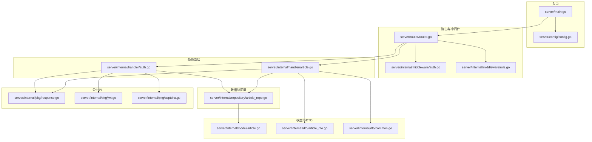
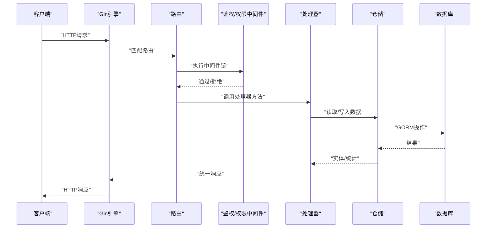
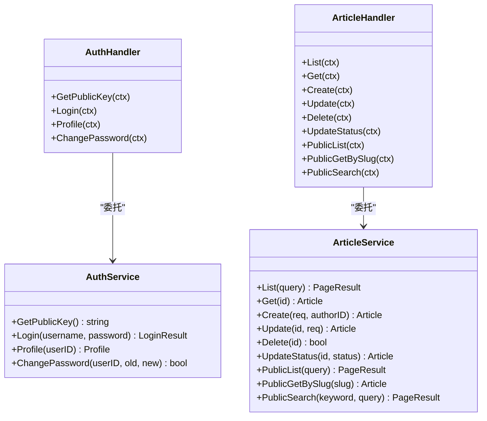
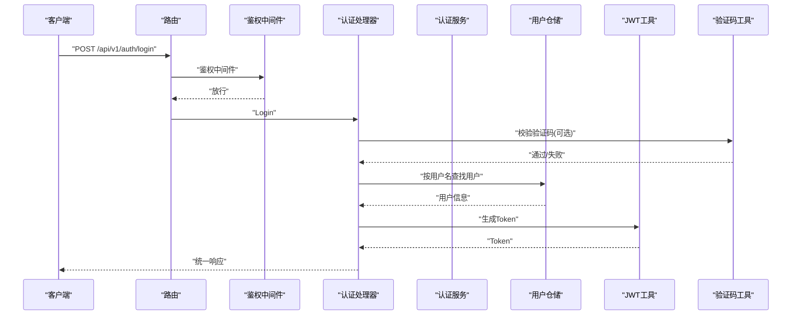
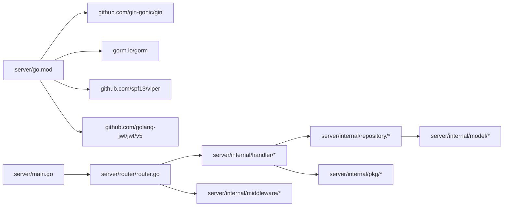

# 代码重构与架构演进

<cite>
**本文引用的文件**
- [server/main.go](file://server/main.go)
- [server/go.mod](file://server/go.mod)
- [server/router/router.go](file://server/router/router.go)
- [server/config/config.go](file://server/config/config.go)
- [server/internal/dto/common.go](file://server/internal/dto/common.go)
- [server/internal/dto/article_dto.go](file://server/internal/dto/article_dto.go)
- [server/internal/handler/auth.go](file://server/internal/handler/auth.go)
- [server/internal/handler/article.go](file://server/internal/handler/article.go)
- [server/internal/middleware/auth.go](file://server/internal/middleware/auth.go)
- [server/internal/middleware/role.go](file://server/internal/middleware/role.go)
- [server/internal/pkg/response.go](file://server/internal/pkg/response.go)
- [server/internal/pkg/jwt.go](file://server/internal/pkg/jwt.go)
- [server/internal/pkg/captcha.go](file://server/internal/pkg/captcha.go)
- [server/internal/repository/article_repo.go](file://server/internal/repository/article_repo.go)
- [server/internal/model/article.go](file://server/internal/model/article.go)
</cite>

## 目录
1. [引言](#引言)
2. [项目结构](#项目结构)
3. [核心组件](#核心组件)
4. [架构总览](#架构总览)
5. [详细组件分析](#详细组件分析)
6. [依赖分析](#依赖分析)
7. [性能考虑](#性能考虑)
8. [故障排查指南](#故障排查指南)
9. [结论](#结论)
10. [附录](#附录)

## 引言
本指南面向Xiangmuzs博客平台的后端代码重构与架构演进，目标是系统化地识别并处理技术债务，明确代码异味与重构优先级；阐述渐进式重构策略，确保不破坏既有功能；结合测试驱动与自动化测试，提升代码质量与可维护性；并通过具体Handler、Service与Middleware的重构案例，给出可落地的改进建议与前后性能/质量对比方法。

## 项目结构
后端采用Go语言与Gin框架，按领域分层组织：入口程序负责配置加载、数据库连接、迁移与启动；路由层集中注册API；中间件层提供鉴权与权限控制；处理器层封装业务请求与响应；数据访问层通过GORM实现；公共包提供通用工具（响应、JWT、验证码等）。

图表来源
- [server/main.go:1-77](file://server/main.go#L1-L77)
- [server/router/router.go:1-104](file://server/router/router.go#L1-L104)
- [server/internal/handler/auth.go:1-163](file://server/internal/handler/auth.go#L1-L163)
- [server/internal/handler/article.go:1-325](file://server/internal/handler/article.go#L1-L325)
- [server/internal/middleware/auth.go:1-38](file://server/internal/middleware/auth.go#L1-L38)
- [server/internal/middleware/role.go:1-43](file://server/internal/middleware/role.go#L1-L43)
- [server/internal/repository/article_repo.go:1-91](file://server/internal/repository/article_repo.go#L1-L91)
- [server/internal/model/article.go:1-24](file://server/internal/model/article.go#L1-L24)
- [server/internal/dto/article_dto.go:1-44](file://server/internal/dto/article_dto.go#L1-L44)
- [server/internal/dto/common.go:1-21](file://server/internal/dto/common.go#L1-L21)
- [server/internal/pkg/response.go:1-70](file://server/internal/pkg/response.go#L1-L70)
- [server/internal/pkg/jwt.go:1-43](file://server/internal/pkg/jwt.go#L1-L43)
- [server/internal/pkg/captcha.go:1-176](file://server/internal/pkg/captcha.go#L1-L176)

章节来源
- [server/main.go:1-77](file://server/main.go#L1-L77)
- [server/router/router.go:1-104](file://server/router/router.go#L1-L104)

## 核心组件
- 入口与配置：加载配置、建立数据库连接、运行迁移、初始化RSA、设置Gin模式、注册静态资源与路由、启动服务。
- 路由与中间件：统一挂载CORS，按模块分组API，鉴权中间件校验Bearer Token，权限中间件校验角色权限。
- 处理器：封装业务逻辑，调用仓库层，使用公共包输出统一响应。
- 数据访问层：基于GORM的仓储实现，提供CRUD与查询聚合。
- 公共包：统一响应体、JWT签发与解析、验证码生成与校验。

章节来源
- [server/main.go:19-76](file://server/main.go#L19-L76)
- [server/router/router.go:11-103](file://server/router/router.go#L11-L103)
- [server/internal/pkg/response.go:22-69](file://server/internal/pkg/response.go#L22-L69)

## 架构总览
整体采用“路由-中间件-处理器-仓储-模型”的分层架构，数据流从HTTP请求进入，经中间件校验与权限检查，交由处理器协调仓储完成数据读写，最终以统一响应返回。

图表来源
- [server/router/router.go:11-103](file://server/router/router.go#L11-L103)
- [server/internal/middleware/auth.go:10-37](file://server/internal/middleware/auth.go#L10-L37)
- [server/internal/middleware/role.go:11-35](file://server/internal/middleware/role.go#L11-L35)
- [server/internal/handler/auth.go:31-93](file://server/internal/handler/auth.go#L31-L93)
- [server/internal/handler/article.go:31-85](file://server/internal/handler/article.go#L31-L85)
- [server/internal/repository/article_repo.go:16-28](file://server/internal/repository/article_repo.go#L16-L28)

## 详细组件分析

### Handler层重构建议
现状与问题
- 处理器直接耦合多个仓库与公共包，职责分散且重复逻辑较多（如参数绑定、错误处理、分页归一化）。
- 文章处理器中存在大量内联视图类型与重复字段映射，影响可读性与扩展性。
- 认证处理器在登录流程中包含多处条件分支与重复错误处理。

重构策略
- 引入Service层：将业务逻辑从Handler中抽离，形成“Handler只做绑定与转发，Service承担业务编排”的模式。
- 统一错误处理：将错误处理封装到中间件或统一的错误包装器，减少重复代码。
- 分页与视图对象：将分页归一化与视图映射抽取为通用工具，降低重复代码。
- 参数校验与DTO：对请求DTO增加更严格的校验与默认值处理，减少Handler中的显式判断。

示例路径
- [server/internal/handler/auth.go:31-93](file://server/internal/handler/auth.go#L31-L93)
- [server/internal/handler/article.go:31-85](file://server/internal/handler/article.go#L31-L85)
- [server/internal/dto/common.go:9-20](file://server/internal/dto/common.go#L9-L20)
- [server/internal/dto/article_dto.go:3-16](file://server/internal/dto/article_dto.go#L3-L16)

章节来源
- [server/internal/handler/auth.go:13-25](file://server/internal/handler/auth.go#L13-L25)
- [server/internal/handler/article.go:19-29](file://server/internal/handler/article.go#L19-L29)
- [server/internal/dto/common.go:3-20](file://server/internal/dto/common.go#L3-L20)

### Service层设计（建议）
- 设计接口隔离：每个领域定义独立的Service接口，便于替换与测试。
- 事务与一致性：对需要一致性的操作（如创建文章并关联标签）放入同一Service方法中，并使用事务包裹。
- 缓存与降级：对热点查询（如分类、标签、设置）引入缓存，必要时支持降级策略。

图表来源
- [server/internal/handler/auth.go:13-25](file://server/internal/handler/auth.go#L13-L25)
- [server/internal/handler/article.go:19-29](file://server/internal/handler/article.go#L19-L29)

### 中间件重构建议
现状与问题
- 鉴权中间件仅验证Token有效性，未区分不同路由的白名单与例外。
- 权限中间件每次查询数据库，缺乏缓存与预加载，可能成为瓶颈。

重构策略
- 白名单与例外：在路由层或中间件中配置无需鉴权的公开接口，减少不必要的鉴权开销。
- 权限缓存：将角色权限预加载到内存，定期刷新，避免频繁查询数据库。
- 统一错误处理：将中间件中的错误响应标准化，与公共包保持一致。

示例路径
- [server/internal/middleware/auth.go:10-37](file://server/internal/middleware/auth.go#L10-L37)
- [server/internal/middleware/role.go:11-35](file://server/internal/middleware/role.go#L11-L35)

章节来源
- [server/internal/middleware/auth.go:10-37](file://server/internal/middleware/auth.go#L10-L37)
- [server/internal/middleware/role.go:11-35](file://server/internal/middleware/role.go#L11-L35)

### 仓储与模型优化建议
现状与问题
- 仓储方法较为基础，复杂查询分散在Handler中，违反单一职责。
- 模型字段较多，部分字段在不同场景下复用度不高，导致序列化开销增大。

重构策略
- 将复杂查询迁移到仓储层，提供领域专用的查询方法（如按状态、分类、标签聚合）。
- 使用投影查询与懒加载策略，减少不必要的字段加载。
- 对高频字段建立索引，优化查询性能。

示例路径
- [server/internal/repository/article_repo.go:41-70](file://server/internal/repository/article_repo.go#L41-L70)
- [server/internal/model/article.go:5-23](file://server/internal/model/article.go#L5-L23)

章节来源
- [server/internal/repository/article_repo.go:16-91](file://server/internal/repository/article_repo.go#L16-L91)
- [server/internal/model/article.go:5-23](file://server/internal/model/article.go#L5-L23)

### 统一响应与错误处理
现状与问题
- 错误处理分散在各处理器中，风格不一致，不利于前端统一处理。
- 响应体结构简单，缺少上下文信息（如请求ID、时间戳）。

重构策略
- 在中间件或统一包装器中拦截错误，输出统一格式的响应。
- 扩展响应体，加入请求ID、时间戳、版本号等元信息，便于日志追踪与调试。

示例路径
- [server/internal/pkg/response.go:22-69](file://server/internal/pkg/response.go#L22-L69)

章节来源
- [server/internal/pkg/response.go:9-20](file://server/internal/pkg/response.go#L9-L20)

### 登录流程序列图（重构前后对比）

图表来源
- [server/router/router.go:27-29](file://server/router/router.go#L27-L29)
- [server/internal/handler/auth.go:31-93](file://server/internal/handler/auth.go#L31-L93)
- [server/internal/pkg/jwt.go:16-28](file://server/internal/pkg/jwt.go#L16-L28)
- [server/internal/pkg/captcha.go:24-58](file://server/internal/pkg/captcha.go#L24-L58)

## 依赖分析
- 外部依赖：Gin、GORM、Viper、JWT、MySQL驱动等。
- 内部依赖：路由依赖处理器与中间件；处理器依赖仓储与公共包；仓储依赖模型与GORM；公共包被广泛使用。

图表来源
- [server/go.mod:5-12](file://server/go.mod#L5-L12)
- [server/main.go:3-16](file://server/main.go#L3-L16)
- [server/router/router.go:3-8](file://server/router/router.go#L3-L8)

章节来源
- [server/go.mod:1-60](file://server/go.mod#L1-L60)
- [server/main.go:3-16](file://server/main.go#L3-L16)

## 性能考虑
- 查询优化：对高频查询建立复合索引（如文章状态+发布时间），使用JOIN替代N+1查询，必要时引入投影查询。
- 缓存策略：对分类、标签、设置等静态数据引入Redis缓存，设置合理TTL与失效策略。
- 并发与限流：在网关或中间件层引入限流与熔断，防止突发流量击穿。
- 日志与监控：统一埋点与指标上报，关注慢查询与错误率。

## 故障排查指南
- 配置加载失败：检查配置文件路径与YAML格式，确认Viper读取顺序与键名一致。
- 数据库连接异常：核对DSN拼接参数与数据库连通性，确认GORM日志级别与时区设置。
- 鉴权失败：确认Authorization头格式、Token签名密钥与过期时间，检查中间件是否正确传递用户信息。
- 权限不足：核对角色权限表结构与中间件查询条件，确认权限缓存是否生效。
- 响应异常：检查统一响应包装器是否正确设置HTTP状态码与消息体。

章节来源
- [server/config/config.go:47-64](file://server/config/config.go#L47-L64)
- [server/main.go:27-44](file://server/main.go#L27-L44)
- [server/internal/middleware/auth.go:12-31](file://server/internal/middleware/auth.go#L12-L31)
- [server/internal/middleware/role.go:20-31](file://server/internal/middleware/role.go#L20-L31)
- [server/internal/pkg/response.go:43-69](file://server/internal/pkg/response.go#L43-L69)

## 结论
通过引入Service层、统一错误与响应处理、优化中间件与仓储查询、加强缓存与监控，Xiangmuzs博客平台可在保证现有功能稳定的同时，显著提升可维护性与性能。建议采用渐进式重构，优先处理高风险与高频路径，配合自动化测试与CI流程，持续迭代。

## 附录

### 渐进式重构优先级建议
- 高风险：鉴权与权限中间件、登录流程、统一响应包装。
- 高频：文章列表与详情查询、分页与视图映射、验证码与JWT工具。
- 可扩展：引入Service层、缓存策略、指标埋点。

### 测试驱动与自动化测试
- 单元测试：针对Handler与Service的关键方法编写单元测试，覆盖正常与异常路径。
- 集成测试：模拟HTTP请求，验证路由、中间件与仓储协作。
- 性能测试：对热点接口进行压测，评估缓存与索引效果。
- CI/CD：在合并前自动运行测试与静态分析，确保质量门槛。

### 重构前后评估方法
- 代码质量：通过静态分析工具（如golint、revive）与覆盖率工具（如cover）评估。
- 性能指标：QPS、P95/P99延迟、内存占用、数据库查询次数。
- 可维护性：圈复杂度、重复代码比率、模块耦合度。