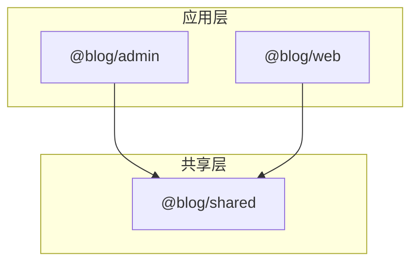
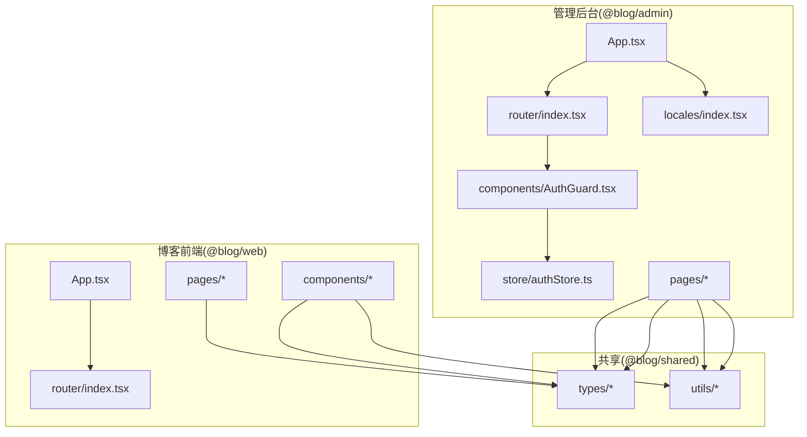
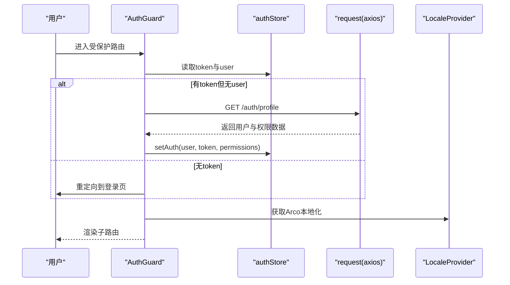
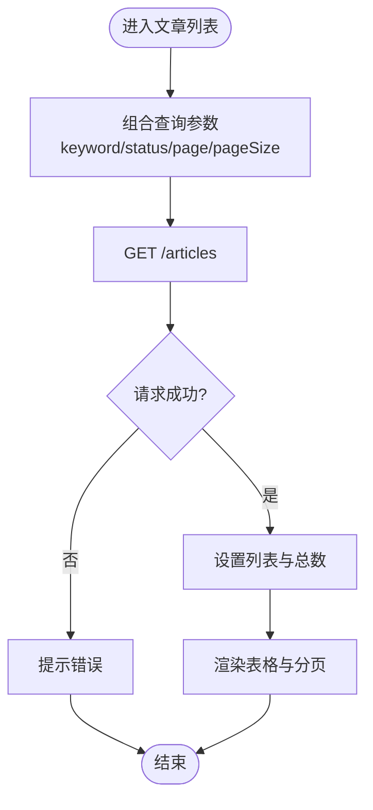
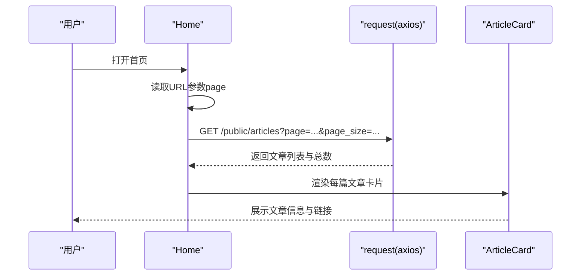
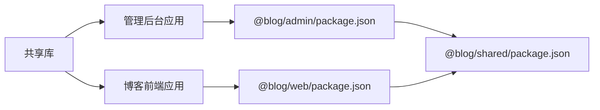

# 前端功能扩展

<cite>
**本文引用的文件**
- [webSource/apps/admin/package.json](file://webSource/apps/admin/package.json)
- [webSource/apps/blog/package.json](file://webSource/apps/blog/package.json)
- [webSource/packages/shared/package.json](file://webSource/packages/shared/package.json)
- [webSource/apps/admin/src/App.tsx](file://webSource/apps/admin/src/App.tsx)
- [webSource/apps/blog/src/App.tsx](file://webSource/apps/blog/src/App.tsx)
- [webSource/apps/admin/src/main.tsx](file://webSource/apps/admin/src/main.tsx)
- [webSource/apps/blog/src/main.tsx](file://webSource/apps/blog/src/main.tsx)
- [webSource/apps/admin/src/router/index.tsx](file://webSource/apps/admin/src/router/index.tsx)
- [webSource/apps/blog/src/router/index.tsx](file://webSource/apps/blog/src/router/index.tsx)
- [webSource/apps/admin/src/locales/index.tsx](file://webSource/apps/admin/src/locales/index.tsx)
- [webSource/apps/admin/src/store/authStore.ts](file://webSource/apps/admin/src/store/authStore.ts)
- [webSource/packages/shared/src/types/index.ts](file://webSource/packages/shared/src/types/index.ts)
- [webSource/packages/shared/src/types/article.ts](file://webSource/packages/shared/src/types/article.ts)
- [webSource/packages/shared/src/types/user.ts](file://webSource/packages/shared/src/types/user.ts)
- [webSource/packages/shared/src/utils/request.ts](file://webSource/packages/shared/src/utils/request.ts)
- [webSource/apps/admin/src/components/AuthGuard.tsx](file://webSource/apps/admin/src/components/AuthGuard.tsx)
- [webSource/apps/admin/src/pages/Dashboard.tsx](file://webSource/apps/admin/src/pages/Dashboard.tsx)
- [webSource/apps/admin/src/pages/articles/Editor.tsx](file://webSource/apps/admin/src/pages/articles/Editor.tsx)
- [webSource/apps/admin/src/pages/articles/List.tsx](file://webSource/apps/admin/src/pages/articles/List.tsx)
- [webSource/apps/blog/src/pages/Home.tsx](file://webSource/apps/blog/src/pages/Home.tsx)
- [webSource/apps/blog/src/components/ArticleCard.tsx](file://webSource/apps/blog/src/components/ArticleCard.tsx)
</cite>

## 目录
1. [简介](#简介)
2. [项目结构](#项目结构)
3. [核心组件](#核心组件)
4. [架构总览](#架构总览)
5. [详细组件分析](#详细组件分析)
6. [依赖关系分析](#依赖关系分析)
7. [性能考虑](#性能考虑)
8. [故障排查指南](#故障排查指南)
9. [结论](#结论)
10. [附录](#附录)

## 简介
本指南面向需要在Xiangmuzs博客平台的管理后台与博客前端进行功能扩展的开发者。内容涵盖：
- 在管理后台与博客前端新增页面组件与功能模块的方法
- React函数组件、Hooks使用与状态管理实践
- UI组件开发指南（Arco Design组件使用与自定义样式）
- 共享库类型定义与工具函数的扩展方式
- 路由配置扩展与页面导航设计
- 国际化扩展与多语言资源管理
- 前端性能优化建议与构建配置调整

## 项目结构
该仓库采用Monorepo结构，包含两个应用与一个共享包：
- 应用层
  - 管理后台：@blog/admin
  - 博客前端：@blog/web
- 共享层
  - @blog/shared：跨应用复用的类型、工具与HTTP请求封装

图表来源
- [webSource/apps/admin/package.json:1-28](file://webSource/apps/admin/package.json#L1-L28)
- [webSource/apps/blog/package.json:1-30](file://webSource/apps/blog/package.json#L1-L30)
- [webSource/packages/shared/package.json:1-23](file://webSource/packages/shared/package.json#L1-L23)

章节来源
- [webSource/apps/admin/package.json:1-28](file://webSource/apps/admin/package.json#L1-L28)
- [webSource/apps/blog/package.json:1-30](file://webSource/apps/blog/package.json#L1-L30)
- [webSource/packages/shared/package.json:1-23](file://webSource/packages/shared/package.json#L1-L23)

## 核心组件
- 应用入口与渲染
  - 管理后台入口：引入全局样式、Arco主题并在StrictMode下挂载应用
  - 博客前端入口：引入全局样式并挂载应用
- 国际化与主题
  - 管理后台通过LocaleProvider与useLocale提供中英切换，并映射Arco Design本地化
- 路由系统
  - 管理后台：登录页、仪表盘、文章、分类、标签、媒体、二维码、角色、用户、设置等
  - 博客前端：首页、文章详情、分类页、标签页、关于页
- 认证与权限
  - 使用Zustand存储用户信息、令牌与权限；提供hasPermission能力；登录加密传输；统一拦截器处理401
- 页面组件示例
  - 管理后台：Dashboard、文章列表与编辑器
  - 博客前端：首页文章卡片展示

章节来源
- [webSource/apps/admin/src/main.tsx:1-13](file://webSource/apps/admin/src/main.tsx#L1-L13)
- [webSource/apps/blog/src/main.tsx:1-12](file://webSource/apps/blog/src/main.tsx#L1-L12)
- [webSource/apps/admin/src/App.tsx:1-22](file://webSource/apps/admin/src/App.tsx#L1-L22)
- [webSource/apps/blog/src/App.tsx:1-7](file://webSource/apps/blog/src/App.tsx#L1-L7)
- [webSource/apps/admin/src/router/index.tsx:1-47](file://webSource/apps/admin/src/router/index.tsx#L1-L47)
- [webSource/apps/blog/src/router/index.tsx:1-24](file://webSource/apps/blog/src/router/index.tsx#L1-L24)
- [webSource/apps/admin/src/locales/index.tsx:1-53](file://webSource/apps/admin/src/locales/index.tsx#L1-L53)
- [webSource/apps/admin/src/store/authStore.ts:1-56](file://webSource/apps/admin/src/store/authStore.ts#L1-L56)
- [webSource/packages/shared/src/utils/request.ts:1-38](file://webSource/packages/shared/src/utils/request.ts#L1-L38)
- [webSource/apps/admin/src/pages/Dashboard.tsx:1-68](file://webSource/apps/admin/src/pages/Dashboard.tsx#L1-L68)
- [webSource/apps/admin/src/pages/articles/Editor.tsx:1-149](file://webSource/apps/admin/src/pages/articles/Editor.tsx#L1-L149)
- [webSource/apps/admin/src/pages/articles/List.tsx:1-246](file://webSource/apps/admin/src/pages/articles/List.tsx#L1-L246)
- [webSource/apps/blog/src/pages/Home.tsx:1-48](file://webSource/apps/blog/src/pages/Home.tsx#L1-L48)
- [webSource/apps/blog/src/components/ArticleCard.tsx:1-59](file://webSource/apps/blog/src/components/ArticleCard.tsx#L1-L59)

## 架构总览
整体架构围绕“应用层 + 共享层”的分层设计展开。应用层负责路由、页面与UI交互，共享层提供类型、工具与网络请求。

图表来源
- [webSource/apps/admin/src/App.tsx:1-22](file://webSource/apps/admin/src/App.tsx#L1-L22)
- [webSource/apps/admin/src/router/index.tsx:1-47](file://webSource/apps/admin/src/router/index.tsx#L1-L47)
- [webSource/apps/admin/src/locales/index.tsx:1-53](file://webSource/apps/admin/src/locales/index.tsx#L1-L53)
- [webSource/apps/admin/src/components/AuthGuard.tsx:1-38](file://webSource/apps/admin/src/components/AuthGuard.tsx#L1-L38)
- [webSource/apps/admin/src/store/authStore.ts:1-56](file://webSource/apps/admin/src/store/authStore.ts#L1-L56)
- [webSource/apps/blog/src/App.tsx:1-7](file://webSource/apps/blog/src/App.tsx#L1-L7)
- [webSource/apps/blog/src/router/index.tsx:1-24](file://webSource/apps/blog/src/router/index.tsx#L1-L24)
- [webSource/packages/shared/src/types/index.ts:1-4](file://webSource/packages/shared/src/types/index.ts#L1-L4)
- [webSource/packages/shared/src/utils/request.ts:1-38](file://webSource/packages/shared/src/utils/request.ts#L1-L38)

## 详细组件分析

### 管理后台：认证守卫与状态管理
- 认证守卫(AuthGuard)
  - 作用：在进入受保护路由前检查token与用户信息，必要时拉取用户资料或重定向到登录页
  - 关键点：使用useEffect在首次有token但无用户信息时调用后端接口填充store；对401统一处理
- 状态管理(authStore)
  - 使用Zustand管理用户、权限、token；提供setAuth、logout、hasPermission等方法
  - 登录流程：密码RSA加密后提交，成功后持久化token并写入store
- 国际化
  - LocaleProvider维护当前语言与翻译函数；getArcoLocale将应用层语言映射到Arco Design本地化

图表来源
- [webSource/apps/admin/src/components/AuthGuard.tsx:1-38](file://webSource/apps/admin/src/components/AuthGuard.tsx#L1-L38)
- [webSource/apps/admin/src/store/authStore.ts:1-56](file://webSource/apps/admin/src/store/authStore.ts#L1-L56)
- [webSource/packages/shared/src/utils/request.ts:1-38](file://webSource/packages/shared/src/utils/request.ts#L1-L38)
- [webSource/apps/admin/src/locales/index.tsx:1-53](file://webSource/apps/admin/src/locales/index.tsx#L1-L53)

章节来源
- [webSource/apps/admin/src/components/AuthGuard.tsx:1-38](file://webSource/apps/admin/src/components/AuthGuard.tsx#L1-L38)
- [webSource/apps/admin/src/store/authStore.ts:1-56](file://webSource/apps/admin/src/store/authStore.ts#L1-L56)
- [webSource/apps/admin/src/locales/index.tsx:1-53](file://webSource/apps/admin/src/locales/index.tsx#L1-L53)

### 管理后台：文章管理页面
- 文章列表(List)
  - 功能：分页、搜索、状态筛选、发布/撤销、二维码预览与弹窗、删除确认
  - 数据流：useCallback封装查询逻辑；Table列渲染结合Arco Design组件；Modal展示二维码
- 文章编辑(Editor)
  - 功能：标题、摘要、分类树选择、标签多选、封面图、Markdown/富文本切换、表单校验与提交
  - 数据流：编辑态根据URL参数加载文章详情；提交时区分新建与更新

图表来源
- [webSource/apps/admin/src/pages/articles/List.tsx:1-246](file://webSource/apps/admin/src/pages/articles/List.tsx#L1-L246)

章节来源
- [webSource/apps/admin/src/pages/articles/List.tsx:1-246](file://webSource/apps/admin/src/pages/articles/List.tsx#L1-L246)
- [webSource/apps/admin/src/pages/articles/Editor.tsx:1-149](file://webSource/apps/admin/src/pages/articles/Editor.tsx#L1-L149)

### 博客前端：首页与文章卡片
- 首页(Hope)
  - 功能：分页参数读取、文章列表加载、空态与加载态处理、侧边栏Portal挂载
  - 数据流：useEffect在页码变化时请求数据；将Sidebar渲染到指定容器
- 文章卡片(ArticleCard)
  - 功能：标题、摘要、封面图、分类/标签/阅读量/日期等信息展示

图表来源
- [webSource/apps/blog/src/pages/Home.tsx:1-48](file://webSource/apps/blog/src/pages/Home.tsx#L1-L48)
- [webSource/apps/blog/src/components/ArticleCard.tsx:1-59](file://webSource/apps/blog/src/components/ArticleCard.tsx#L1-L59)

章节来源
- [webSource/apps/blog/src/pages/Home.tsx:1-48](file://webSource/apps/blog/src/pages/Home.tsx#L1-L48)
- [webSource/apps/blog/src/components/ArticleCard.tsx:1-59](file://webSource/apps/blog/src/components/ArticleCard.tsx#L1-L59)

### 类型与工具扩展指南
- 类型定义扩展
  - 新增领域模型：在共享类型目录添加新接口，如新增“评论”相关类型
  - 导出聚合：确保在index.ts中导出新类型以便应用层统一导入
- 工具函数扩展
  - 请求封装：基于shared/utils/request.ts扩展新接口；保持拦截器一致行为
  - 常量与加密：在constants.ts与crypto.ts中新增常量与工具，供应用层使用

章节来源
- [webSource/packages/shared/src/types/index.ts:1-4](file://webSource/packages/shared/src/types/index.ts#L1-L4)
- [webSource/packages/shared/src/types/article.ts:1-74](file://webSource/packages/shared/src/types/article.ts#L1-L74)
- [webSource/packages/shared/src/types/user.ts:1-43](file://webSource/packages/shared/src/types/user.ts#L1-L43)
- [webSource/packages/shared/src/utils/request.ts:1-38](file://webSource/packages/shared/src/utils/request.ts#L1-L38)

### 路由与导航扩展指南
- 管理后台
  - 新增页面：在router/index.tsx中注册路径与组件；如需权限保护，包裹AuthGuard
  - 导航设计：在AdminLayout中增加菜单项，确保与路由path一致
- 博客前端
  - 新增页面：在router/index.tsx中注册路径；在BlogLayout中增加导航
  - 外链与SEO：注意相对路径与绝对路径，避免破坏SPA路由

章节来源
- [webSource/apps/admin/src/router/index.tsx:1-47](file://webSource/apps/admin/src/router/index.tsx#L1-L47)
- [webSource/apps/blog/src/router/index.tsx:1-24](file://webSource/apps/blog/src/router/index.tsx#L1-L24)

### 国际化扩展指南
- 新增语言资源
  - 在locales目录新增语言文件，遵循现有键名结构
  - 在locales/index.tsx中注册字典与Arco Design本地化映射
- 组件内使用
  - 通过useLocale获取t函数，按需翻译静态文案
- 存储与回显
  - 语言偏好存储于localStorage，启动时读取并初始化

章节来源
- [webSource/apps/admin/src/locales/index.tsx:1-53](file://webSource/apps/admin/src/locales/index.tsx#L1-L53)

### UI组件开发指南（Arco Design）
- 组件选择与组合
  - 表单：Form + Input/Select/TreeSelect/Radio等
  - 表格：Table + Tag/Tooltip/Popconfirm/Button等
  - 弹窗：Modal + QRCodeSVG等
- 自定义样式
  - 通过CSS变量与类名覆盖Arco默认样式；注意与ConfigProvider主题协同
  - Arco Design主题已在入口处注入，确保组件正确显示

章节来源
- [webSource/apps/admin/src/pages/articles/List.tsx:1-246](file://webSource/apps/admin/src/pages/articles/List.tsx#L1-L246)
- [webSource/apps/admin/src/pages/articles/Editor.tsx:1-149](file://webSource/apps/admin/src/pages/articles/Editor.tsx#L1-L149)
- [webSource/apps/admin/src/App.tsx:1-22](file://webSource/apps/admin/src/App.tsx#L1-L22)

## 依赖关系分析
- 应用与共享库
  - @blog/admin与@blog/web均依赖@blog/shared，共享类型与工具
- 第三方依赖
  - 管理后台：@arco-design/web-react、react-router-dom、zustand、qrcode.react
  - 博客前端：react-router-dom、react-markdown、remark-gfm、rehype-highlight、dompurify
- 构建与脚本
  - Vite + TypeScript；工作区使用pnpm workspace

图表来源
- [webSource/apps/admin/package.json:1-28](file://webSource/apps/admin/package.json#L1-L28)
- [webSource/apps/blog/package.json:1-30](file://webSource/apps/blog/package.json#L1-L30)
- [webSource/packages/shared/package.json:1-23](file://webSource/packages/shared/package.json#L1-L23)

章节来源
- [webSource/apps/admin/package.json:1-28](file://webSource/apps/admin/package.json#L1-L28)
- [webSource/apps/blog/package.json:1-30](file://webSource/apps/blog/package.json#L1-L30)
- [webSource/packages/shared/package.json:1-23](file://webSource/packages/shared/package.json#L1-L23)

## 性能考虑
- 懒加载与分割
  - 将大型页面组件按需加载，减少首屏体积
- 列表渲染优化
  - 使用稳定key、虚拟滚动（如Table）与分页，避免一次性渲染大量节点
- 图片与资源
  - 使用懒加载属性与合适的尺寸，避免阻塞主线程
- 网络请求
  - 合理缓存与去抖（如搜索输入），减少重复请求
- 构建优化
  - 启用生产环境压缩与Tree Shaking；按需引入Arco Design组件以减小体积

## 故障排查指南
- 登录失败或频繁跳转登录
  - 检查登录接口返回与token持久化；确认拦截器是否正确设置Authorization头
- 权限不足导致页面不可访问
  - 使用hasPermission判断模块与动作；确认后端权限数据正确下发
- 国际化文案缺失
  - 检查locales字典中是否存在对应键；确认useLocale上下文包裹范围

章节来源
- [webSource/packages/shared/src/utils/request.ts:1-38](file://webSource/packages/shared/src/utils/request.ts#L1-L38)
- [webSource/apps/admin/src/store/authStore.ts:1-56](file://webSource/apps/admin/src/store/authStore.ts#L1-L56)
- [webSource/apps/admin/src/locales/index.tsx:1-53](file://webSource/apps/admin/src/locales/index.tsx#L1-L53)

## 结论
通过共享库抽象公共类型与工具、以Zustand管理轻量状态、以Arco Design提升UI一致性，并配合完善的路由与国际化机制，Xiangmuzs平台实现了清晰的前后端分离与可扩展的前端架构。按照本指南进行扩展，可在保证一致性的同时快速迭代新功能。

## 附录
- 新增页面组件步骤（示例）
  - 管理后台
    - 在pages目录创建新组件
    - 在router/index.tsx中注册路由并按需包裹AuthGuard
    - 如需权限控制，在authStore中补充权限点并使用hasPermission判断
  - 博客前端
    - 在pages目录创建新组件
    - 在router/index.tsx中注册路由
    - 在布局中增加导航项
- 新增类型与工具步骤
  - 在packages/shared/src/types中新增接口并在index.ts导出
  - 在packages/shared/src/utils中新增工具函数并复用request封装
- 国际化新增步骤
  - 在locales新增语言文件并注册字典
  - 在组件中使用useLocale与t函数进行文案输出