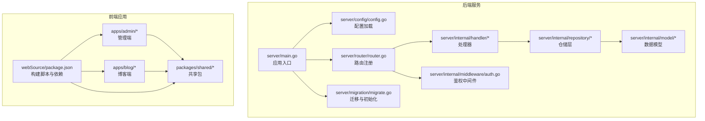
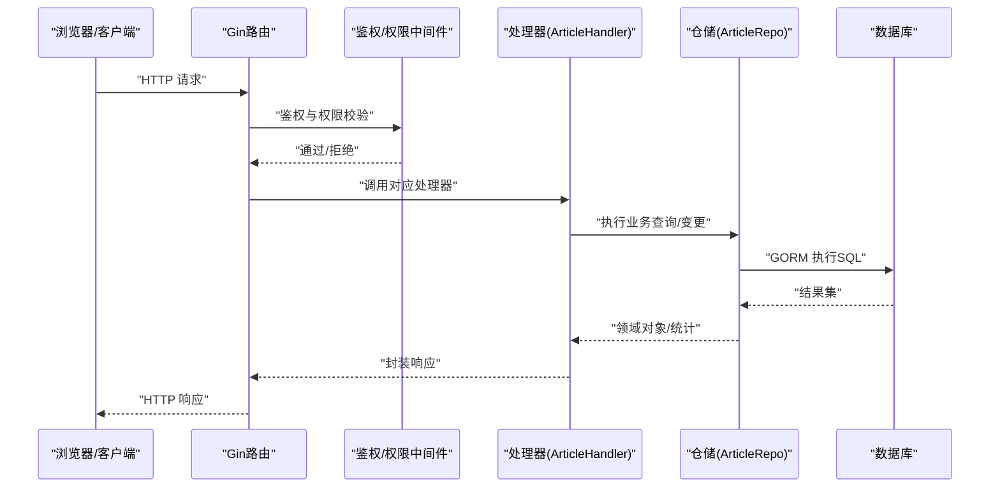
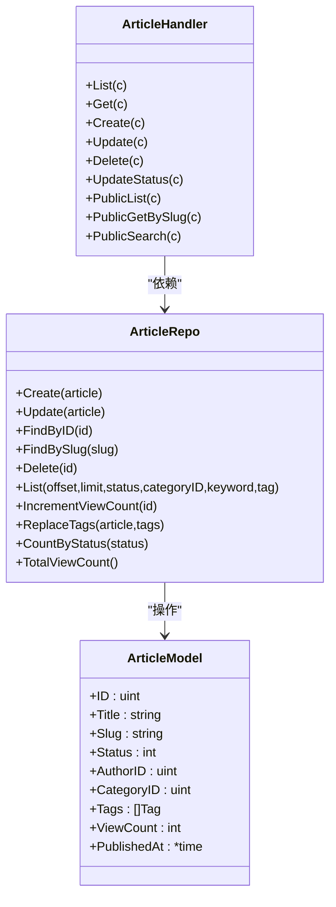
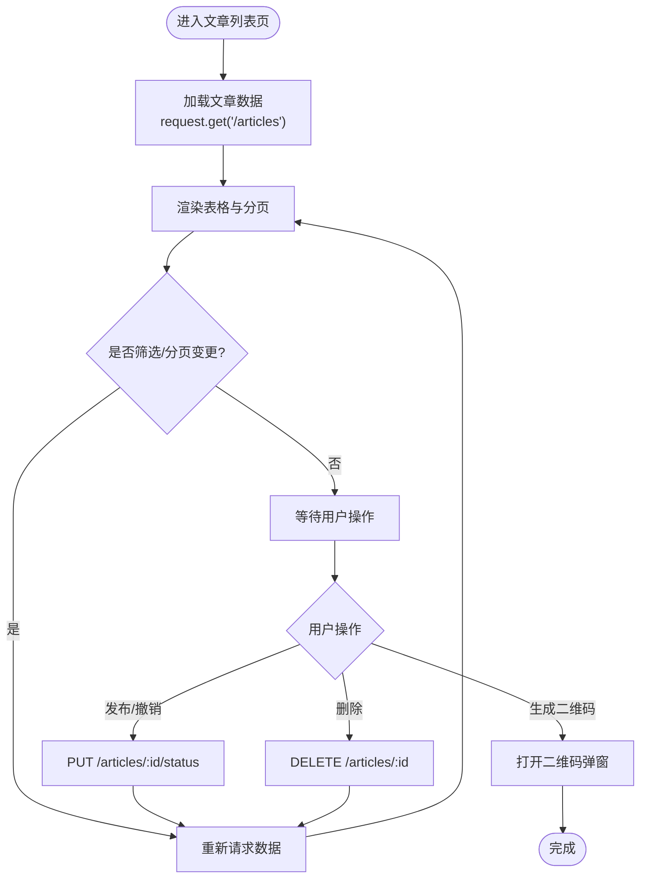
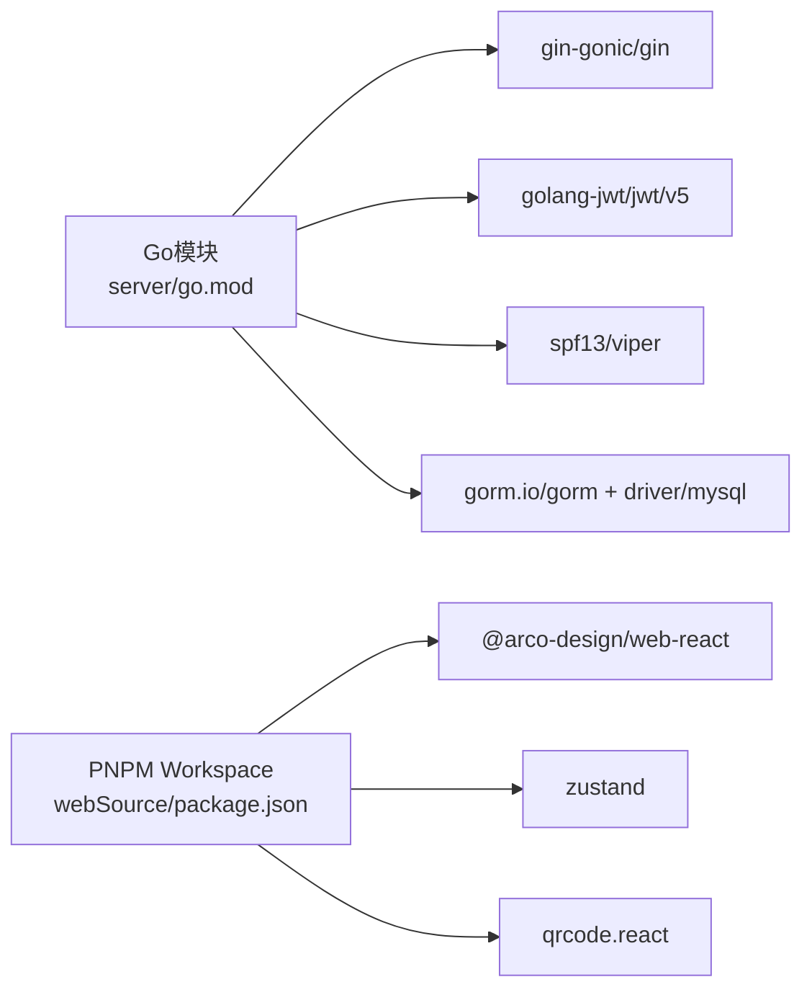

# 功能扩展与维护

<cite>
**本文引用的文件**
- [server/main.go](file://server/main.go)
- [server/go.mod](file://server/go.mod)
- [server/config/config.go](file://server/config/config.go)
- [server/router/router.go](file://server/router/router.go)
- [server/migration/migrate.go](file://server/migration/migrate.go)
- [server/internal/middleware/auth.go](file://server/internal/middleware/auth.go)
- [server/internal/handler/article.go](file://server/internal/handler/article.go)
- [server/internal/repository/article_repo.go](file://server/internal/repository/article_repo.go)
- [server/internal/model/article.go](file://server/internal/model/article.go)
- [webSource/package.json](file://webSource/package.json)
- [webSource/apps/admin/src/App.tsx](file://webSource/apps/admin/src/App.tsx)
- [webSource/apps/admin/src/pages/articles/List.tsx](file://webSource/apps/admin/src/pages/articles/List.tsx)
- [webSource/apps/admin/src/store/authStore.ts](file://webSource/apps/admin/src/store/authStore.ts)
- [webSource/packages/shared/src/index.ts](file://webSource/packages/shared/src/index.ts)
</cite>

## 目录
1. [简介](#简介)
2. [项目结构](#项目结构)
3. [核心组件](#核心组件)
4. [架构总览](#架构总览)
5. [详细组件分析](#详细组件分析)
6. [依赖分析](#依赖分析)
7. [性能考虑](#性能考虑)
8. [故障排查指南](#故障排查指南)
9. [结论](#结论)
10. [附录](#附录)

## 简介
本指南面向Xiangmuzs博客平台的功能扩展与长期维护，围绕后端API扩展、前端组件开发、数据库模型更新三大方向，系统阐述扩展原则（分层架构、依赖注入、接口设计）、标准流程（从需求到测试部署）、向后兼容与版本管理策略、第三方库集成与依赖管理最佳实践、代码重构与架构演进策略，以及维护任务清单与定期检查流程，并给出技术债务与遗留代码处理建议。

## 项目结构
项目采用前后端分离的多包工作区结构：
- 后端：Go语言实现，基于Gin框架，采用分层架构（handler/service/repository/model），配置通过Viper加载，数据库迁移与初始化在启动时完成。
- 前端：基于React + TypeScript，采用PNPM Workspace组织，包含管理端应用、博客端应用与共享包，统一构建脚本与依赖管理。

图表来源
- [server/main.go:1-77](file://server/main.go#L1-L77)
- [server/config/config.go:1-65](file://server/config/config.go#L1-L65)
- [server/router/router.go:1-104](file://server/router/router.go#L1-L104)
- [server/migration/migrate.go:1-126](file://server/migration/migrate.go#L1-L126)
- [webSource/package.json:1-22](file://webSource/package.json#L1-L22)

章节来源
- [server/main.go:19-76](file://server/main.go#L19-L76)
- [server/config/config.go:47-64](file://server/config/config.go#L47-L64)
- [server/router/router.go:11-103](file://server/router/router.go#L11-L103)
- [webSource/package.json:4-15](file://webSource/package.json#L4-L15)

## 核心组件
- 应用入口与生命周期
  - 负责加载配置、连接数据库、执行迁移、初始化RSA密钥、设置CORS与静态资源、注册路由、启动HTTP服务。
- 配置系统
  - 使用Viper从YAML读取配置，支持运行时热更新（需重启生效）。
- 路由与中间件
  - 统一前缀/api/v1；公开路由无需鉴权；认证路由使用鉴权中间件；权限路由使用基于模块-动作的权限校验中间件。
- 数据访问层
  - GORM模型定义与仓储方法封装，提供CRUD、关联预加载、统计查询等能力。
- 迁移与种子数据
  - 自动迁移所有模型；生成默认权限、角色与管理员账户。
- 前端应用
  - 管理端与博客端分别构建；共享包提供类型、工具与请求封装；Zustand状态管理鉴权信息与权限集合。

章节来源
- [server/main.go:19-76](file://server/main.go#L19-L76)
- [server/config/config.go:7-64](file://server/config/config.go#L7-L64)
- [server/router/router.go:11-103](file://server/router/router.go#L11-L103)
- [server/migration/migrate.go:13-38](file://server/migration/migrate.go#L13-L38)
- [server/internal/repository/article_repo.go:8-91](file://server/internal/repository/article_repo.go#L8-L91)
- [webSource/apps/admin/src/store/authStore.ts:15-56](file://webSource/apps/admin/src/store/authStore.ts#L15-L56)

## 架构总览
下图展示从客户端到数据库的典型请求链路，体现分层解耦与职责边界：

图表来源
- [server/router/router.go:11-103](file://server/router/router.go#L11-L103)
- [server/internal/middleware/auth.go:10-37](file://server/internal/middleware/auth.go#L10-L37)
- [server/internal/handler/article.go:19-325](file://server/internal/handler/article.go#L19-L325)
- [server/internal/repository/article_repo.go:8-91](file://server/internal/repository/article_repo.go#L8-L91)

## 详细组件分析

### 后端API扩展（以文章模块为例）
- 处理器层
  - 提供列表、详情、创建、更新、删除、状态变更、公开列表/搜索/按slug获取等接口。
  - 参数绑定、分页规范化、状态机转换、视图组装与返回。
- 仓储层
  - 封装GORM查询：条件过滤（状态、分类、关键词、标签）、关联预加载、排序与分页、计数与统计。
- 模型层
  - 定义字段约束、索引、关联关系（作者、分类、标签多对多）。
- 中间件
  - 鉴权中间件解析Bearer Token并注入用户上下文；权限中间件按模块-动作进行授权。
- 路由
  - 在统一前缀下注册公开与受保护接口组，按需挂载鉴权与权限中间件。

图表来源
- [server/internal/handler/article.go:19-325](file://server/internal/handler/article.go#L19-L325)
- [server/internal/repository/article_repo.go:8-91](file://server/internal/repository/article_repo.go#L8-L91)
- [server/internal/model/article.go:5-24](file://server/internal/model/article.go#L5-L24)

章节来源
- [server/internal/handler/article.go:31-325](file://server/internal/handler/article.go#L31-L325)
- [server/internal/repository/article_repo.go:16-91](file://server/internal/repository/article_repo.go#L16-L91)
- [server/internal/model/article.go:5-24](file://server/internal/model/article.go#L5-L24)
- [server/router/router.go:11-103](file://server/router/router.go#L11-L103)
- [server/internal/middleware/auth.go:10-37](file://server/internal/middleware/auth.go#L10-L37)

### 前端组件开发（以管理端文章列表为例）
- 页面组件
  - 列表渲染、分页、筛选（关键词、状态）、批量操作（发布/撤销、删除、二维码）、弹窗展示二维码。
- 状态管理
  - 使用Zustand存储用户、令牌与权限集合；提供登录、登出与权限判断方法。
- 共享包
  - 统一导出类型、常量、日期与加密工具，以及HTTP请求封装，便于跨应用复用。

图表来源
- [webSource/apps/admin/src/pages/articles/List.tsx:39-246](file://webSource/apps/admin/src/pages/articles/List.tsx#L39-L246)
- [webSource/apps/admin/src/store/authStore.ts:15-56](file://webSource/apps/admin/src/store/authStore.ts#L15-L56)
- [webSource/packages/shared/src/index.ts:1-6](file://webSource/packages/shared/src/index.ts#L1-L6)

章节来源
- [webSource/apps/admin/src/pages/articles/List.tsx:26-246](file://webSource/apps/admin/src/pages/articles/List.tsx#L26-L246)
- [webSource/apps/admin/src/store/authStore.ts:15-56](file://webSource/apps/admin/src/store/authStore.ts#L15-L56)
- [webSource/packages/shared/src/index.ts:1-6](file://webSource/packages/shared/src/index.ts#L1-L6)

### 数据库模型更新与迁移
- 新增实体
  - 在模型目录新增结构体定义，确保主键、索引、默认值与关联关系完整。
  - 在迁移中加入AutoMigrate列表，运行后自动创建/更新表结构。
  - 如需初始数据，可在迁移中补充种子逻辑。
- 字段变更
  - 优先使用非破坏性变更（新增列、添加索引、修改默认值）；如必须破坏性变更，结合版本化迁移策略与回滚方案。
- 关联关系
  - 明确外键与多对多中间表，仓储查询中合理使用Joins与Preload。

章节来源
- [server/migration/migrate.go:13-38](file://server/migration/migrate.go#L13-L38)
- [server/internal/model/article.go:5-24](file://server/internal/model/article.go#L5-L24)
- [server/internal/repository/article_repo.go:41-70](file://server/internal/repository/article_repo.go#L41-L70)

## 依赖分析
- 后端依赖
  - Web框架：Gin；数据库：GORM + MySQL驱动；配置：Viper；JWT：golang-jwt；加密：x/crypto；UUID：google/uuid。
- 前端依赖
  - React生态、Arco Design、Zustand、qrcode.react等；通过PNPM Workspace统一管理。
- 版本与兼容
  - Go版本要求与依赖锁定在go.mod；前端通过pnpm-lock.yaml锁定；建议遵循语义化版本与最小升级策略。

图表来源
- [server/go.mod:1-60](file://server/go.mod#L1-L60)
- [webSource/package.json:1-22](file://webSource/package.json#L1-L22)

章节来源
- [server/go.mod:1-60](file://server/go.mod#L1-L60)
- [webSource/package.json:1-22](file://webSource/package.json#L1-L22)

## 性能考虑
- 查询优化
  - 为高频查询字段建立索引（如状态+发布时间、分类ID、标签关联）；避免N+1查询，使用Preload/Joins一次性加载关联。
- 缓存策略
  - 对热点内容（如公开文章列表、分类/标签聚合）引入缓存层，降低数据库压力。
- 分页与限制
  - 默认分页大小与最大限制控制，防止大结果集导致内存与网络压力。
- 并发与日志
  - 生产环境使用Release模式；根据需要调整GORM日志级别。

章节来源
- [server/internal/repository/article_repo.go:41-70](file://server/internal/repository/article_repo.go#L41-L70)
- [server/main.go:36-40](file://server/main.go#L36-L40)

## 故障排查指南
- 启动阶段
  - 配置加载失败：检查配置文件路径与YAML格式；确认必要字段存在。
  - 数据库连接失败：核对DSN参数与网络连通性；查看GORM日志。
  - 迁移失败：检查模型定义与权限；查看迁移输出日志。
- 接口问题
  - 鉴权失败：确认Authorization头格式与Token有效性；检查中间件日志。
  - 权限不足：核对角色权限集合；确认模块-动作匹配。
  - 数据异常：检查仓储查询条件与关联加载；定位具体SQL。
- 前端问题
  - 登录失败：确认密码加密流程与共享包RSA工具；检查本地存储令牌。
  - 列表不刷新：确认分页参数与筛选条件；检查请求拦截与状态管理。

章节来源
- [server/config/config.go:47-64](file://server/config/config.go#L47-L64)
- [server/main.go:26-44](file://server/main.go#L26-L44)
- [server/migration/migrate.go:13-38](file://server/migration/migrate.go#L13-L38)
- [server/internal/middleware/auth.go:10-37](file://server/internal/middleware/auth.go#L10-L37)
- [webSource/apps/admin/src/store/authStore.ts:36-56](file://webSource/apps/admin/src/store/authStore.ts#L36-L56)

## 结论
通过严格的分层架构、明确的依赖注入与接口设计、完善的迁移与权限体系，以及统一的前后端构建与依赖管理，Xiangmuzs平台具备良好的扩展性与可维护性。遵循本文提出的扩展原则、流程与最佳实践，可高效、安全地交付新功能并持续演进系统架构。

## 附录

### 新功能开发标准流程
- 需求分析
  - 明确业务目标、接口范围、数据模型与权限需求。
- 设计与评审
  - 输出接口文档、ER图与分层设计；评审后形成开发计划。
- 后端实现
  - 新增/修改模型 → 编写仓储方法 → 实现处理器 → 注册路由 → 中间件接入 → 单元测试。
- 前端实现
  - 更新共享类型与工具 → 开发页面组件 → 集成状态管理 → 调试与联调。
- 数据库变更
  - 在迁移中新增模型或字段；必要时编写种子数据。
- 测试与部署
  - 单测/集成测 → 端到端测试 → 构建产物 → 部署与灰度 → 回滚预案。
- 文档与复盘
  - 更新API文档与运维手册；总结经验教训。

### 向后兼容与版本管理策略
- API版本
  - 使用/api/v1作为当前稳定版本；新增功能先在独立分支实现，合并后再开放。
- 数据库
  - 严格遵循非破坏性变更；对破坏性变更制定迁移脚本与回滚策略。
- 前端
  - 采用语义化版本；对破坏性变更提供迁移指南与兼容层。

### 第三方库集成与依赖管理最佳实践
- 后端
  - 通过go.mod集中声明与锁定版本；定期扫描安全漏洞；优先选择活跃维护与文档完善的库。
- 前端
  - 使用pnpm统一管理；锁定版本；定期更新与安全扫描；避免重复依赖。

### 代码重构与架构演进策略
- 渐进式重构
  - 小步快跑，优先解决阻塞开发与性能瓶颈；保持单测覆盖。
- 抽象与解耦
  - 明确接口契约；减少循环依赖；引入适配器与工厂模式提升可替换性。
- 可观测性
  - 增加指标与日志；完善告警；记录关键链路追踪。

### 维护任务清单与定期检查流程
- 日常
  - 健康检查、日志巡检、备份验证、依赖安全扫描。
- 周期
  - 依赖升级评估与回归测试、容量与性能压测、灾难恢复演练。
- 季度
  - 架构回顾、技术债盘点、知识沉淀与培训。

### 技术债务与遗留代码处理
- 识别与分级
  - 通过代码审查与静态分析识别高风险区域；按影响面与修复成本分级。
- 规划与拆分
  - 将大重构拆分为小迭代；优先处理阻塞性问题。
- 保障措施
  - 强化测试覆盖；完善文档；建立回滚与监控机制。