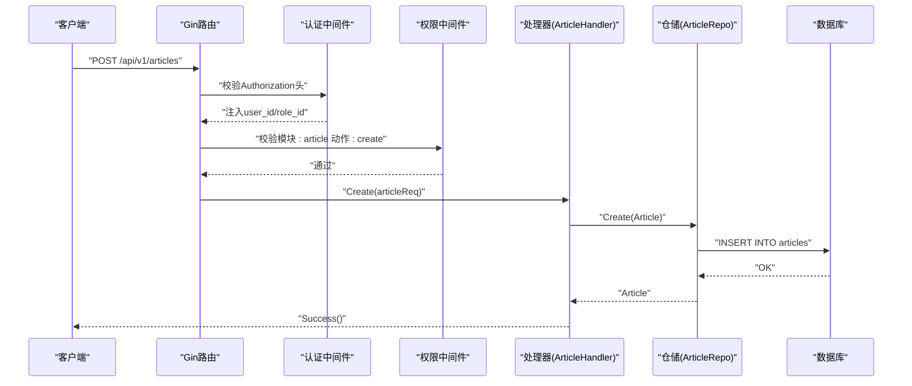
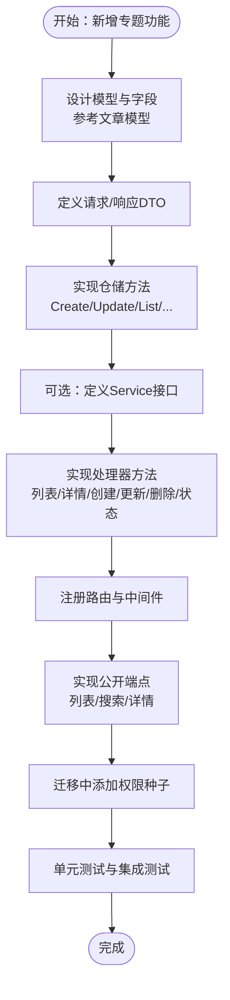
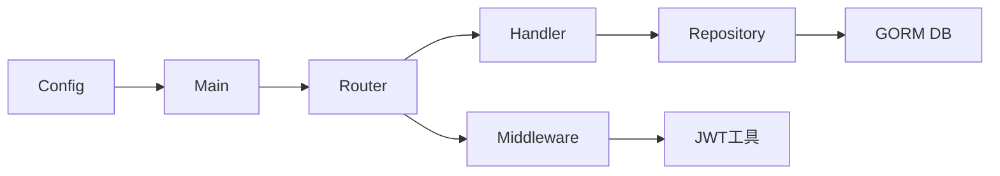

# 后端功能扩展

<cite>
**本文引用的文件**
- [server/main.go](file://server/main.go)
- [server/router/router.go](file://server/router/router.go)
- [server/config/config.go](file://server/config/config.go)
- [server/internal/handler/article.go](file://server/internal/handler/article.go)
- [server/internal/handler/category.go](file://server/internal/handler/category.go)
- [server/internal/handler/tag.go](file://server/internal/handler/tag.go)
- [server/internal/handler/media.go](file://server/internal/handler/media.go)
- [server/internal/handler/qrcode.go](file://server/internal/handler/qrcode.go)
- [server/internal/handler/user.go](file://server/internal/handler/user.go)
- [server/internal/handler/role.go](file://server/internal/handler/role.go)
- [server/internal/handler/dashboard.go](file://server/internal/handler/dashboard.go)
- [server/internal/handler/setting.go](file://server/internal/handler/setting.go)
- [server/internal/handler/auth.go](file://server/internal/handler/auth.go)
- [server/internal/middleware/auth.go](file://server/internal/middleware/auth.go)
- [server/internal/middleware/role.go](file://server/internal/middleware/role.go)
- [server/internal/middleware/cors.go](file://server/internal/middleware/cors.go)
- [server/internal/model/article.go](file://server/internal/model/article.go)
- [server/internal/model/category.go](file://server/internal/model/category.go)
- [server/internal/model/tag.go](file://server/internal/model/tag.go)
- [server/internal/model/media.go](file://server/internal/model/media.go)
- [server/internal/model/qrcode.go](file://server/internal/model/qrcode.go)
- [server/internal/model/user.go](file://server/internal/model/user.go)
- [server/internal/model/role.go](file://server/internal/model/role.go)
- [server/internal/model/setting.go](file://server/internal/model/setting.go)
- [server/internal/repository/article_repo.go](file://server/internal/repository/article_repo.go)
- [server/internal/repository/category_repo.go](file://server/internal/repository/category_repo.go)
- [server/internal/repository/tag_repo.go](file://server/internal/repository/tag_repo.go)
- [server/internal/repository/media_repo.go](file://server/internal/repository/media_repo.go)
- [server/internal/repository/qrcode_repo.go](file://server/internal/repository/qrcode_repo.go)
- [server/internal/repository/user_repo.go](file://server/internal/repository/user_repo.go)
- [server/internal/repository/setting_repo.go](file://server/internal/repository/setting_repo.go)
- [server/internal/dto/article_dto.go](file://server/internal/dto/article_dto.go)
- [server/internal/dto/auth_dto.go](file://server/internal/dto/auth_dto.go)
- [server/internal/dto/common.go](file://server/internal/dto/common.go)
- [server/internal/pkg/response.go](file://server/internal/pkg/response.go)
- [server/internal/pkg/jwt.go](file://server/internal/pkg/jwt.go)
- [server/internal/pkg/hash.go](file://server/internal/pkg/hash.go)
- [server/internal/pkg/upload.go](file://server/internal/pkg/upload.go)
- [server/migration/migrate.go](file://server/migration/migrate.go)
</cite>

## 目录
1. [简介](#简介)
2. [项目结构](#项目结构)
3. [核心组件](#核心组件)
4. [架构总览](#架构总览)
5. [详细组件分析](#详细组件分析)
6. [依赖分析](#依赖分析)
7. [性能考虑](#性能考虑)
8. [故障排查指南](#故障排查指南)
9. [结论](#结论)
10. [附录](#附录)

## 简介
本指南面向需要在Xiangmuzs博客平台后端新增API端点与功能的开发者，系统性讲解如何遵循分层架构（Handler、Service、Repository、Model）扩展新功能，覆盖从需求分析、数据库模型设计、路由配置、中间件集成到权限控制的完整流程。同时提供扩展现有文章管理能力到新内容类型的实践路径，并总结依赖注入与接口设计的最佳实践。

## 项目结构
后端采用Go语言与Gin框架，按领域与职责分层组织：
- 配置层：读取配置文件，初始化数据库连接与迁移
- 路由层：集中注册公开与受保护的API路由组
- 中间件层：认证、跨域、权限校验
- 处理器层（Handler）：HTTP请求入口，参数绑定与响应封装
- 服务层（Service）：业务逻辑编排（当前仓库中Service层以接口形式存在，具体实现通过依赖注入在各Handler中直接组合Repository）
- 数据访问层（Repository）：对GORM的封装，提供领域模型的CRUD与复杂查询
- 模型层（Model）：GORM模型定义与字段约束
- DTO层：请求/响应数据结构
- 工具包：统一响应、JWT、哈希、上传等通用能力
- 迁移与种子：自动迁移与默认角色、权限、管理员初始化

```mermaid
graph TB
subgraph "入口与配置"
MAIN["main.go<br/>启动与路由装配"]
CFG["config.go<br/>配置加载"]
end
subgraph "路由与中间件"
ROUTER["router.go<br/>路由注册"]
M_AUTH["auth.go<br/>认证中间件"]
M_ROLE["role.go<br/>权限中间件"]
M_CORS["cors.go<br/>跨域中间件"]
end
subgraph "处理器层"
H_ARTICLE["article.go"]
H_CATEGORY["category.go"]
H_TAG["tag.go"]
H_MEDIA["media.go"]
H_QRCODE["qrcode.go"]
H_USER["user.go"]
H_ROLE["role.go"]
H_DASHBOARD["dashboard.go"]
H_SETTING["setting.go"]
H_AUTH["auth.go"]
end
subgraph "服务层"
S_ARTICLE["ArticleService 接口"]
S_CATEGORY["CategoryService 接口"]
S_TAG["TagService 接口"]
S_MEDIA["MediaService 接口"]
S_QRCODE["QRCodeService 接口"]
S_USER["UserService 接口"]
S_ROLE["RoleService 接口"]
S_DASHBOARD["DashboardService 接口"]
S_SETTING["SettingService 接口"]
end
subgraph "数据访问层"
R_ARTICLE["article_repo.go"]
R_CATEGORY["category_repo.go"]
R_TAG["tag_repo.go"]
R_MEDIA["media_repo.go"]
R_QRCODE["qrcode_repo.go"]
R_USER["user_repo.go"]
R_ROLE["role_repo.go"]
R_SETTING["setting_repo.go"]
end
subgraph "模型与DTO"
M_MODEL["model/*"]
M_DTO["dto/*"]
end
MAIN --> ROUTER
CFG --> MAIN
ROUTER --> H_ARTICLE
ROUTER --> H_CATEGORY
ROUTER --> H_TAG
ROUTER --> H_MEDIA
ROUTER --> H_QRCODE
ROUTER --> H_USER
ROUTER --> H_ROLE
ROUTER --> H_DASHBOARD
ROUTER --> H_SETTING
ROUTER --> H_AUTH
H_ARTICLE --> R_ARTICLE
H_CATEGORY --> R_CATEGORY
H_TAG --> R_TAG
H_MEDIA --> R_MEDIA
H_QRCODE --> R_QRCODE
H_USER --> R_USER
H_ROLE --> R_ROLE
H_SETTING --> R_SETTING
H_ARTICLE --> M_DTO
H_CATEGORY --> M_DTO
H_TAG --> M_DTO
H_MEDIA --> M_DTO
H_QRCODE --> M_DTO
H_USER --> M_DTO
H_ROLE --> M_DTO
H_SETTING --> M_DTO
H_AUTH --> M_DTO
H_ARTICLE --> S_ARTICLE
H_CATEGORY --> S_CATEGORY
H_TAG --> S_TAG
H_MEDIA --> S_MEDIA
H_QRCODE --> S_QRCODE
H_USER --> S_USER
H_ROLE --> S_ROLE
H_SETTING --> S_SETTING
ROUTER --> M_AUTH
ROUTER --> M_ROLE
ROUTER --> M_CORS
```

图表来源
- [server/main.go:19-76](file://server/main.go#L19-L76)
- [server/router/router.go:11-103](file://server/router/router.go#L11-L103)

章节来源
- [server/main.go:19-76](file://server/main.go#L19-L76)
- [server/router/router.go:11-103](file://server/router/router.go#L11-L103)
- [server/config/config.go:47-64](file://server/config/config.go#L47-L64)

## 核心组件
- 入口与配置
  - 通过配置加载数据库连接参数，按运行模式设置GORM日志级别
  - 初始化RSA密钥、设置Gin模式、注册静态资源、调用路由装配函数
- 路由与中间件
  - 统一前缀/api/v1，分公开、认证、权限三类路由
  - 认证中间件解析Authorization头，解析JWT并注入用户与角色信息
  - 权限中间件基于模块+动作进行细粒度授权
- 处理器层
  - 承接HTTP请求，绑定查询/请求体DTO，调用Repository并返回统一响应
  - 提供公开与后台管理两类端点
- 数据访问层
  - 对GORM进行封装，提供常用CRUD与复杂查询方法
- 模型层
  - 定义字段约束、索引、关联关系
- 工具包
  - 统一响应结构、HTTP状态封装、JWT签发与解析、密码哈希、上传工具

章节来源
- [server/main.go:19-76](file://server/main.go#L19-L76)
- [server/router/router.go:11-103](file://server/router/router.go#L11-L103)
- [server/internal/middleware/auth.go:10-37](file://server/internal/middleware/auth.go#L10-L37)
- [server/internal/middleware/role.go:10-42](file://server/internal/middleware/role.go#L10-L42)
- [server/internal/pkg/response.go:22-69](file://server/internal/pkg/response.go#L22-L69)
- [server/internal/pkg/jwt.go:16-42](file://server/internal/pkg/jwt.go#L16-L42)

## 架构总览
下图展示了从客户端请求到数据库写入的关键交互路径，体现Handler-Repository-Model的分层职责与依赖方向。

图表来源
- [server/router/router.go:58-60](file://server/router/router.go#L58-L60)
- [server/internal/handler/article.go:87-129](file://server/internal/handler/article.go#L87-L129)
- [server/internal/repository/article_repo.go:16-18](file://server/internal/repository/article_repo.go#L16-L18)

## 详细组件分析

### Handler层职责与扩展原则
- 职责边界
  - 参数绑定与校验（Query/Body DTO）
  - 调用Repository执行数据操作
  - 统一响应封装（成功/分页/错误）
- 扩展步骤
  - 在DTO层定义请求/响应结构
  - 在Model层补充或复用实体
  - 在Repository层实现数据访问方法
  - 在Handler中编写HTTP处理函数
  - 在路由层注册新端点
  - 如需细粒度权限，使用RequirePermission中间件
- 示例参考
  - 文章增删改查与公开端点：[server/internal/handler/article.go:31-325](file://server/internal/handler/article.go#L31-L325)
  - 分类增删改查：[server/internal/handler/category.go](file://server/internal/handler/category.go)
  - 标签CRUD：[server/internal/handler/tag.go](file://server/internal/handler/tag.go)
  - 媒体上传/列表/删除：[server/internal/handler/media.go](file://server/internal/handler/media.go)
  - 二维码审核与发布：[server/internal/handler/qrcode.go](file://server/internal/handler/qrcode.go)
  - 用户与角色管理：[server/internal/handler/user.go](file://server/internal/handler/user.go)、[server/internal/handler/role.go](file://server/internal/handler/role.go)
  - 仪表盘统计：[server/internal/handler/dashboard.go](file://server/internal/handler/dashboard.go)
  - 设置管理：[server/internal/handler/setting.go](file://server/internal/handler/setting.go)
  - 登录与公钥：[server/internal/handler/auth.go](file://server/internal/handler/auth.go)

章节来源
- [server/internal/handler/article.go:31-325](file://server/internal/handler/article.go#L31-L325)
- [server/internal/handler/category.go](file://server/internal/handler/category.go)
- [server/internal/handler/tag.go](file://server/internal/handler/tag.go)
- [server/internal/handler/media.go](file://server/internal/handler/media.go)
- [server/internal/handler/qrcode.go](file://server/internal/handler/qrcode.go)
- [server/internal/handler/user.go](file://server/internal/handler/user.go)
- [server/internal/handler/role.go](file://server/internal/handler/role.go)
- [server/internal/handler/dashboard.go](file://server/internal/handler/dashboard.go)
- [server/internal/handler/setting.go](file://server/internal/handler/setting.go)
- [server/internal/handler/auth.go](file://server/internal/handler/auth.go)

### Service层接口与依赖注入最佳实践
- 当前实现模式
  - Handler直接持有Repository实例，形成“轻Service”模式
  - 优点：简单直观，适合快速迭代
  - 缺点：测试时需要构造真实DB或Mock，耦合度略高
- 推荐的Service接口模式
  - 定义Service接口（如ArticleService），在Handler中注入接口而非具体实现
  - 通过NewXxxService(db)工厂函数或全局容器注入
  - 单元测试时可用Mock替换真实实现
- 依赖注入建议
  - 使用构造函数注入（NewXxxHandler(db) -> NewXxxService(repo) -> NewXxxRepo(db)）
  - 避免在Handler内直接new Repository，便于替换与测试
  - 将共享依赖（如DB、加密、JWT配置）作为全局单例或注入容器的一部分

章节来源
- [server/internal/handler/article.go:19-29](file://server/internal/handler/article.go#L19-L29)
- [server/internal/repository/article_repo.go:8-14](file://server/internal/repository/article_repo.go#L8-L14)

### Repository层扩展与复杂查询
- 扩展原则
  - 保持单一职责：每个Repository对应一个领域模型
  - 方法命名清晰：Create/Update/Delete/List/FindBy*/CountBy*
  - 复杂查询使用链式Where/Joins/Preload，避免在Handler中拼SQL
  - 返回错误给上层处理，不要吞掉错误
- 查询优化
  - 合理使用索引字段（如状态、发布时间、分类ID）
  - 使用Preload/Joins预加载必要关联，减少N+1查询
  - 分页查询使用Offset/Limit并配合Count统计总数
- 示例参考
  - 文章仓储：分页、过滤、标签关联、浏览量自增、按状态计数
  - 分类仓储：删除前检查外键约束
  - 其他模型仓储：[server/internal/repository/category_repo.go:16-32](file://server/internal/repository/category_repo.go#L16-L32)

章节来源
- [server/internal/repository/article_repo.go:41-90](file://server/internal/repository/article_repo.go#L41-L90)
- [server/internal/repository/category_repo.go:24-32](file://server/internal/repository/category_repo.go#L24-L32)

### Model层与数据库迁移
- 设计原则
  - 字段长度与约束明确，索引合理（如唯一索引、复合索引）
  - 关联关系清晰（一对多、多对多、外键）
  - 默认值与时间戳字段规范化
- 迁移与种子
  - 自动迁移所有模型
  - 种子数据：权限、角色（含编辑角色）、管理员用户
- 示例参考
  - 文章模型：状态、作者、分类、标签多对多、浏览量、发布时间
  - 分类模型：层级父ID、排序
  - 其他模型：[server/internal/model/article.go:5-23](file://server/internal/model/article.go#L5-L23)、[server/internal/model/category.go:5-14](file://server/internal/model/category.go#L5-L14)

章节来源
- [server/migration/migrate.go:13-38](file://server/migration/migrate.go#L13-L38)
- [server/internal/model/article.go:5-23](file://server/internal/model/article.go#L5-L23)
- [server/internal/model/category.go:5-14](file://server/internal/model/category.go#L5-L14)

### DTO层与请求/响应规范
- 请求DTO：绑定必填字段、枚举值校验
- 响应DTO：统一包装Response/PaginatedData
- 扩展建议
  - 新增字段时同步更新DTO与Handler中的映射
  - 对于公开端点，避免泄露敏感字段
- 示例参考
  - 文章请求/状态请求：[server/internal/dto/article_dto.go:3-16](file://server/internal/dto/article_dto.go#L3-L16)
  - 通用分页查询：[server/internal/dto/common.go](file://server/internal/dto/common.go)

章节来源
- [server/internal/dto/article_dto.go:3-16](file://server/internal/dto/article_dto.go#L3-L16)
- [server/internal/dto/common.go](file://server/internal/dto/common.go)

### 中间件：认证与权限控制
- 认证中间件
  - 解析Authorization头，校验Bearer Token
  - 解析JWT并注入user_id/role_id
- 权限中间件
  - 模块+动作授权（create/read/update/delete）
  - 支持加载用户全部权限
- 跨域中间件
  - 统一CORS策略，支持前端跨域访问
- 示例参考
  - 认证中间件：[server/internal/middleware/auth.go:10-37](file://server/internal/middleware/auth.go#L10-L37)
  - 权限中间件：[server/internal/middleware/role.go:10-42](file://server/internal/middleware/role.go#L10-L42)
  - 路由注册与中间件使用：[server/router/router.go:44-102](file://server/router/router.go#L44-L102)

章节来源
- [server/internal/middleware/auth.go:10-37](file://server/internal/middleware/auth.go#L10-L37)
- [server/internal/middleware/role.go:10-42](file://server/internal/middleware/role.go#L10-L42)
- [server/router/router.go:44-102](file://server/router/router.go#L44-L102)

### 扩展现有文章管理到新内容类型（以“专题”为例）
目标：新增“专题”内容类型，具备与文章类似的CRUD与公开列表/详情能力，但字段与业务略有差异。

- 需求分析
  - 字段：标题、描述、封面图、状态、作者、发布时间、浏览量
  - 公开端点：列表、搜索、详情（按标识）
  - 权限：与文章一致的模块+动作
- 数据库模型设计
  - 新建模型：专题表（如专题、专题文章关联表）
  - 参考文章模型字段与索引设计：[server/internal/model/article.go:5-23](file://server/internal/model/article.go#L5-L23)
- DTO定义
  - 新增专题请求/状态DTO，字段与模型一致
  - 参考文章请求DTO：[server/internal/dto/article_dto.go:3-16](file://server/internal/dto/article_dto.go#L3-L16)
- 仓储扩展
  - 实现Create/Update/FindByID/FindBySlug/List/IncrementViewCount/CountByStatus等方法
  - 参考文章仓储：[server/internal/repository/article_repo.go:16-90](file://server/internal/repository/article_repo.go#L16-L90)
- 服务层（可选）
  - 定义专题Service接口，注入Repository
  - 在Handler中注入Service接口，便于测试与替换
- 处理器扩展
  - 新建专题Handler，实现列表、详情、创建、更新、删除、状态变更等方法
  - 参考文章处理器：[server/internal/handler/article.go:31-325](file://server/internal/handler/article.go#L31-L325)
- 路由注册
  - 在路由层注册专题相关端点，使用RequirePermission中间件
  - 参考文章路由注册：[server/router/router.go:55-61](file://server/router/router.go#L55-L61)
- 公开端点
  - 列表/搜索/详情公开端点，注意只返回已发布状态
  - 参考文章公开端点：[server/internal/handler/article.go:206-313](file://server/internal/handler/article.go#L206-L313)
- 权限控制
  - 在迁移中为专题模块生成权限种子，或在路由中指定模块为“专题”
  - 参考权限种子：[server/migration/migrate.go:40-66](file://server/migration/migrate.go#L40-L66)

图表来源
- [server/internal/model/article.go:5-23](file://server/internal/model/article.go#L5-L23)
- [server/internal/dto/article_dto.go:3-16](file://server/internal/dto/article_dto.go#L3-L16)
- [server/internal/repository/article_repo.go:16-90](file://server/internal/repository/article_repo.go#L16-L90)
- [server/internal/handler/article.go:31-325](file://server/internal/handler/article.go#L31-L325)
- [server/router/router.go:55-61](file://server/router/router.go#L55-L61)
- [server/migration/migrate.go:40-66](file://server/migration/migrate.go#L40-L66)

## 依赖分析
- 组件耦合
  - Handler依赖Repository；Repository依赖GORM DB
  - 中间件依赖JWT解析与配置
  - 路由层集中装配Handler与中间件
- 外部依赖
  - Gin Web框架、GORM ORM、Viper配置、JWT库
- 循环依赖
  - 当前结构清晰，无循环导入

图表来源
- [server/router/router.go:11-23](file://server/router/router.go#L11-L23)
- [server/internal/middleware/auth.go:10-37](file://server/internal/middleware/auth.go#L10-L37)
- [server/internal/pkg/jwt.go:16-42](file://server/internal/pkg/jwt.go#L16-L42)
- [server/main.go:19-76](file://server/main.go#L19-L76)

章节来源
- [server/router/router.go:11-23](file://server/router/router.go#L11-L23)
- [server/internal/middleware/auth.go:10-37](file://server/internal/middleware/auth.go#L10-L37)
- [server/internal/pkg/jwt.go:16-42](file://server/internal/pkg/jwt.go#L16-L42)
- [server/main.go:19-76](file://server/main.go#L19-L76)

## 性能考虑
- 查询优化
  - 为高频过滤字段建立索引（状态、发布时间、分类ID）
  - 使用Preload/Joins预加载必要关联，避免N+1
  - 分页查询配合Count统计，避免全表扫描
- 缓存策略
  - 公开列表/详情可引入缓存（如Redis），降低DB压力
  - 注意缓存失效策略与一致性
- 日志与监控
  - Debug模式开启GORM日志，生产关闭
  - 记录关键操作耗时与错误率

## 故障排查指南
- 认证失败
  - 检查Authorization头格式是否为Bearer Token
  - 校验JWT签名与有效期
  - 参考：[server/internal/middleware/auth.go:10-37](file://server/internal/middleware/auth.go#L10-L37)、[server/internal/pkg/jwt.go:30-42](file://server/internal/pkg/jwt.go#L30-L42)
- 权限不足
  - 确认角色是否具备模块+动作权限
  - 检查权限种子是否正确生成
  - 参考：[server/internal/middleware/role.go:10-42](file://server/internal/middleware/role.go#L10-L42)、[server/migration/migrate.go:40-66](file://server/migration/migrate.go#L40-L66)
- 数据库错误
  - 外键约束导致删除失败（如分类被文章引用）
  - 参考：[server/internal/repository/category_repo.go:24-32](file://server/internal/repository/category_repo.go#L24-L32)
- 响应异常
  - 统一使用Success/Error系列方法，确保返回结构一致
  - 参考：[server/internal/pkg/response.go:22-69](file://server/internal/pkg/response.go#L22-L69)

章节来源
- [server/internal/middleware/auth.go:10-37](file://server/internal/middleware/auth.go#L10-L37)
- [server/internal/pkg/jwt.go:30-42](file://server/internal/pkg/jwt.go#L30-L42)
- [server/internal/middleware/role.go:10-42](file://server/internal/middleware/role.go#L10-L42)
- [server/migration/migrate.go:40-66](file://server/migration/migrate.go#L40-L66)
- [server/internal/repository/category_repo.go:24-32](file://server/internal/repository/category_repo.go#L24-L32)
- [server/internal/pkg/response.go:22-69](file://server/internal/pkg/response.go#L22-L69)

## 结论
通过遵循Handler-Service-Repository-Model的分层架构与依赖注入原则，结合统一的DTO与响应封装、严格的中间件认证与权限控制，可以高效、安全地扩展Xiangmuzs博客平台的新功能。建议在新增内容类型时，优先采用Service接口与依赖注入，提升可测试性与可维护性；同时完善迁移与权限种子，确保上线即具备完整的权限体系。

## 附录
- 新增端点标准流程清单
  - 需求评审与领域建模
  - DTO定义与校验规则
  - Model设计与迁移
  - Repository方法实现
  - Service接口与实现（可选）
  - Handler方法与路由注册
  - 中间件集成（认证/权限）
  - 公开端点与权限控制
  - 单元测试与集成测试
  - 文档与回归测试