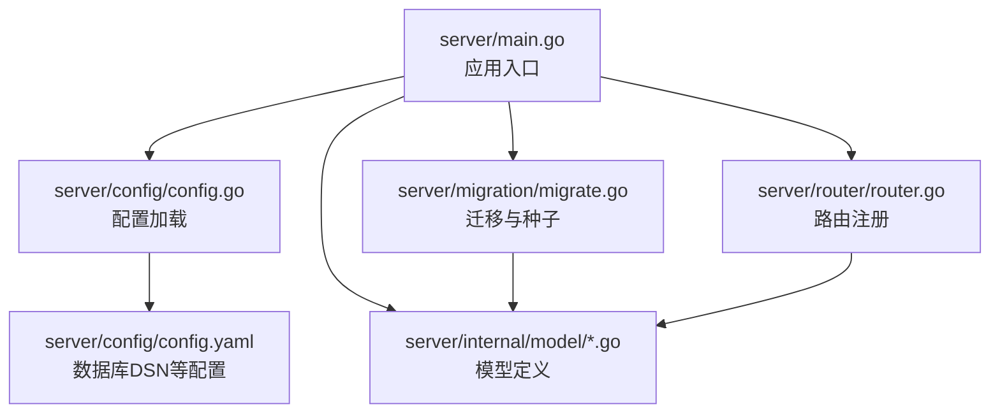
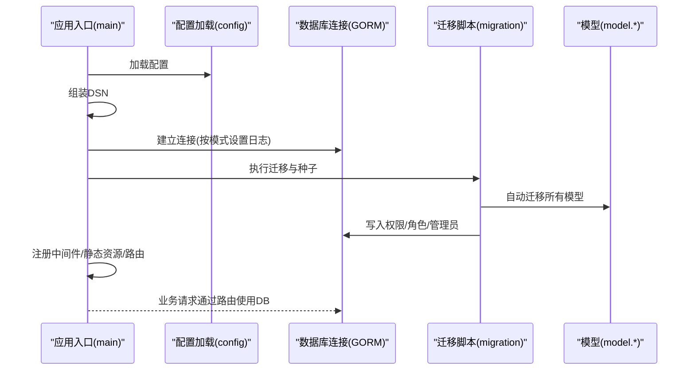
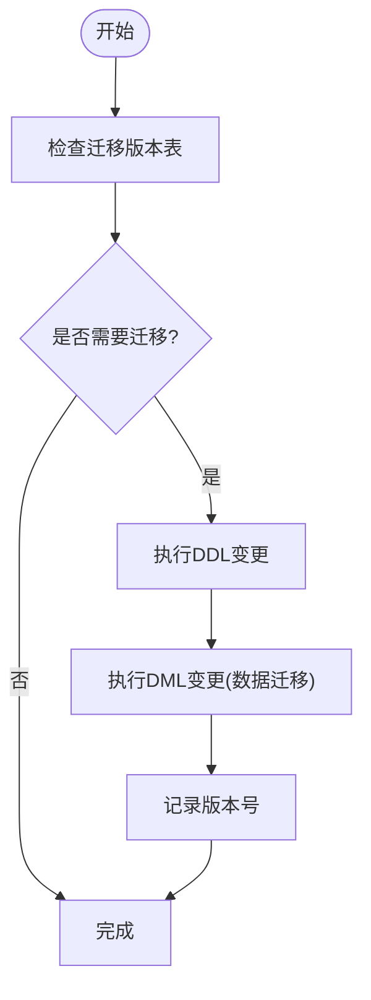
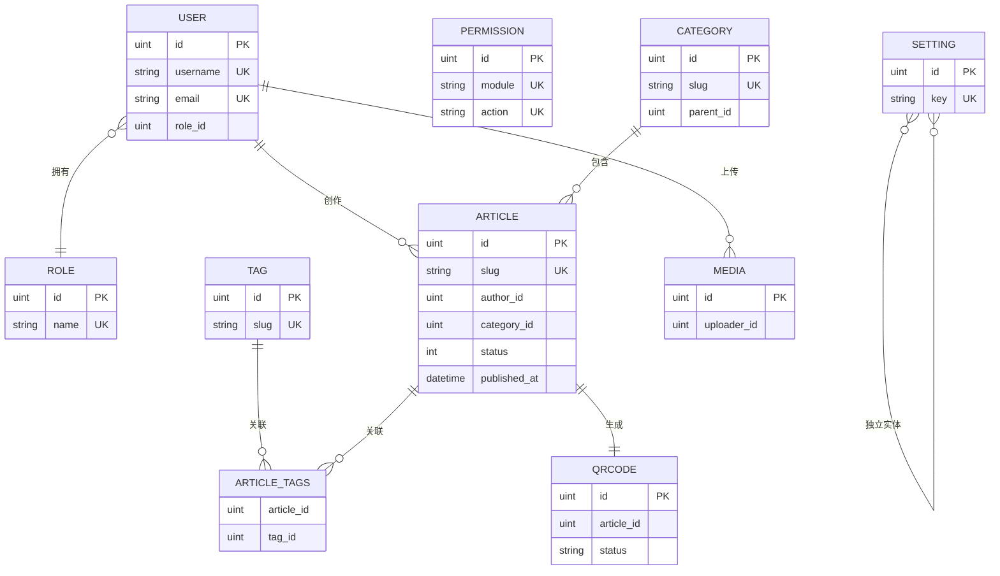
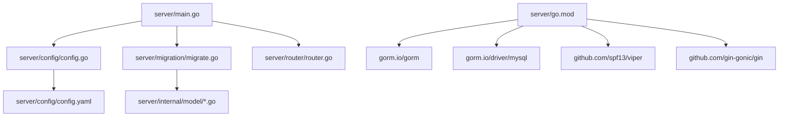

# 数据库演进与迁移

<cite>
**本文引用的文件**
- [server/main.go](file://server/main.go)
- [server/config/config.go](file://server/config/config.go)
- [server/config/config.yaml](file://server/config/config.yaml)
- [server/migration/migrate.go](file://server/migration/migrate.go)
- [server/internal/model/article.go](file://server/internal/model/article.go)
- [server/internal/model/user.go](file://server/internal/model/user.go)
- [server/internal/model/category.go](file://server/internal/model/category.go)
- [server/internal/model/tag.go](file://server/internal/model/tag.go)
- [server/internal/model/role.go](file://server/internal/model/role.go)
- [server/internal/model/media.go](file://server/internal/model/media.go)
- [server/internal/model/qrcode.go](file://server/internal/model/qrcode.go)
- [server/internal/model/setting.go](file://server/internal/model/setting.go)
- [server/go.mod](file://server/go.mod)
</cite>

## 目录
1. [简介](#简介)
2. [项目结构](#项目结构)
3. [核心组件](#核心组件)
4. [架构总览](#架构总览)
5. [详细组件分析](#详细组件分析)
6. [依赖分析](#依赖分析)
7. [性能考虑](#性能考虑)
8. [故障排查指南](#故障排查指南)
9. [结论](#结论)
10. [附录](#附录)

## 简介
本指南面向Xiangmuzs博客平台的数据库演进与迁移场景，围绕以下目标展开：安全地进行表结构变更、索引优化与约束调整；规范编写数据库迁移脚本与版本管理策略；确保向后兼容性的最佳实践（数据迁移与回滚）；处理数据库性能问题（查询优化、索引设计、缓存策略）；明确生产环境的备份、恢复与变更管理流程；提供具体迁移示例（新增数据模型与字段）；给出数据库监控与维护建议（慢查询分析与性能调优）。

## 项目结构
后端采用Go语言与GORM框架，数据库连接通过DSN配置，启动时执行自动迁移与种子数据初始化，并在路由层注入数据库连接供业务使用。迁移脚本集中于迁移包，模型定义位于内部model目录，配置通过Viper从YAML加载。

**图表来源**
- [server/main.go:19-76](file://server/main.go#L19-L76)
- [server/config/config.go:47-64](file://server/config/config.go#L47-L64)
- [server/config/config.yaml:1-29](file://server/config/config.yaml#L1-L29)
- [server/migration/migrate.go:13-38](file://server/migration/migrate.go#L13-L38)

**章节来源**
- [server/main.go:19-76](file://server/main.go#L19-L76)
- [server/config/config.go:47-64](file://server/config/config.go#L47-L64)
- [server/config/config.yaml:1-29](file://server/config/config.yaml#L1-L29)
- [server/migration/migrate.go:13-38](file://server/migration/migrate.go#L13-L38)

## 核心组件
- 应用入口与数据库连接
  - 通过配置加载数据库DSN，按运行模式设置GORM日志级别，建立数据库连接。
  - 启动迁移与种子数据初始化，随后注册中间件、静态资源与路由。
- 迁移与种子
  - 自动迁移所有模型，确保表结构与模型一致。
  - 种子数据包括权限、角色与默认管理员用户，支持幂等初始化。
- 模型与索引
  - 模型注解中包含主键、唯一索引、普通索引、字段长度与默认值等约束。
  - 部分字段具备复合索引或单列索引，用于加速查询与保证唯一性。

**章节来源**
- [server/main.go:26-47](file://server/main.go#L26-L47)
- [server/migration/migrate.go:13-38](file://server/migration/migrate.go#L13-L38)
- [server/migration/migrate.go:40-125](file://server/migration/migrate.go#L40-L125)
- [server/internal/model/article.go:5-23](file://server/internal/model/article.go#L5-L23)
- [server/internal/model/user.go:5-16](file://server/internal/model/user.go#L5-L16)
- [server/internal/model/category.go:5-14](file://server/internal/model/category.go#L5-L14)
- [server/internal/model/tag.go:5-11](file://server/internal/model/tag.go#L5-L11)
- [server/internal/model/role.go:5-19](file://server/internal/model/role.go#L5-L19)
- [server/internal/model/media.go:5-13](file://server/internal/model/media.go#L5-L13)
- [server/internal/model/qrcode.go:5-22](file://server/internal/model/qrcode.go#L5-L22)
- [server/internal/model/setting.go:5-10](file://server/internal/model/setting.go#L5-L10)

## 架构总览
下图展示了应用启动到数据库迁移与模型使用的整体流程。

**图表来源**
- [server/main.go:19-76](file://server/main.go#L19-L76)
- [server/config/config.go:47-64](file://server/config/config.go#L47-L64)
- [server/migration/migrate.go:13-38](file://server/migration/migrate.go#L13-L38)

## 详细组件分析

### 迁移脚本与版本管理策略
- 自动迁移
  - 在启动阶段对所有模型执行自动迁移，确保数据库结构与模型定义保持一致。
  - 若需扩展迁移能力，可在现有Run函数基础上增加条件判断与版本号记录，以支持增量迁移。
- 幂等性与种子数据
  - 权限、角色与管理员用户的种子逻辑均包含存在性检查，避免重复初始化。
  - 建议在正式迁移脚本中保留相同的存在性检查，确保多次执行的安全性。
- 版本管理建议
  - 引入迁移版本表，记录已执行的迁移版本号，防止重复执行与遗漏。
  - 将复杂变更拆分为多个小版本迁移，每个版本仅做最小必要改动，便于回滚与追踪。
  - 对DDL变更（如新增列、索引、外键）与DML变更（数据转换）分离，分别编写脚本并按顺序执行。

**章节来源**
- [server/migration/migrate.go:13-38](file://server/migration/migrate.go#L13-L38)
- [server/migration/migrate.go:40-125](file://server/migration/migrate.go#L40-L125)

### 表结构修改与索引优化
- 现有索引与约束
  - 唯一索引：用户名、邮箱、标签名、分类别名、设置键等，保证业务唯一性。
  - 普通索引：文章状态+发布时间、文章作者、文章分类、二维码状态、媒体上传者等，提升查询效率。
  - 复合索引：权限模块与动作的联合唯一索引，减少冗余数据。
- 修改建议
  - 新增字段时优先考虑默认值与非空约束，避免影响存量数据。
  - 对高频查询字段（如文章状态、发布时间、用户角色）建立合适索引，避免全表扫描。
  - 删除不再使用的索引，平衡写入性能与读取性能。

**图表来源**
- [server/internal/model/user.go:5-16](file://server/internal/model/user.go#L5-L16)
- [server/internal/model/role.go:5-19](file://server/internal/model/role.go#L5-L19)
- [server/internal/model/article.go:5-23](file://server/internal/model/article.go#L5-L23)
- [server/internal/model/category.go:5-14](file://server/internal/model/category.go#L5-L14)
- [server/internal/model/tag.go:5-11](file://server/internal/model/tag.go#L5-L11)
- [server/internal/model/media.go:5-13](file://server/internal/model/media.go#L5-L13)
- [server/internal/model/qrcode.go:5-22](file://server/internal/model/qrcode.go#L5-L22)
- [server/internal/model/setting.go:5-10](file://server/internal/model/setting.go#L5-L10)

**章节来源**
- [server/internal/model/user.go:5-16](file://server/internal/model/user.go#L5-L16)
- [server/internal/model/role.go:5-19](file://server/internal/model/role.go#L5-L19)
- [server/internal/model/article.go:5-23](file://server/internal/model/article.go#L5-L23)
- [server/internal/model/category.go:5-14](file://server/internal/model/category.go#L5-L14)
- [server/internal/model/tag.go:5-11](file://server/internal/model/tag.go#L5-L11)
- [server/internal/model/media.go:5-13](file://server/internal/model/media.go#L5-L13)
- [server/internal/model/qrcode.go:5-22](file://server/internal/model/qrcode.go#L5-L22)
- [server/internal/model/setting.go:5-10](file://server/internal/model/setting.go#L5-L10)

### 约束调整与向后兼容性
- 约束调整
  - 新增非空字段时，先添加默认值，再逐步清理历史空值，最后启用非空约束。
  - 修改字段长度或类型前，评估对索引的影响，必要时重建索引。
- 向后兼容性
  - 字段重命名或删除时，先添加新字段，迁移数据后再删除旧字段，期间双写保障一致性。
  - 对外接口返回结构体字段变更遵循语义化版本控制，避免破坏客户端解析。
- 回滚机制
  - 为每个迁移版本保存逆向SQL脚本，回滚时按相反顺序执行。
  - 使用事务包裹关键DDL/DML操作，失败即回滚，确保原子性。

**章节来源**
- [server/migration/migrate.go:13-38](file://server/migration/migrate.go#L13-L38)

### 查询优化与索引设计
- 索引策略
  - 文章列表按状态+发布时间排序，应确保该组合索引命中。
  - 用户登录凭据查询基于唯一索引（用户名/邮箱），避免额外索引。
  - 分类树形结构查询基于父节点索引，支持层级遍历。
- 缓存策略
  - 对热点配置项（Setting）进行缓存，降低数据库压力。
  - 对文章详情、分类聚合结果进行短期缓存，结合失效时间与更新通知。
- 查询优化建议
  - 使用EXPLAIN分析慢查询，识别缺失索引与全表扫描。
  - 避免SELECT *，只取必要字段，减少网络与内存开销。
  - 对分页查询使用覆盖索引，避免回表。

**章节来源**
- [server/internal/model/article.go:13-20](file://server/internal/model/article.go#L13-L20)
- [server/internal/model/user.go:7-8](file://server/internal/model/user.go#L7-L8)
- [server/internal/model/category.go:10](file://server/internal/model/category.go#L10)
- [server/internal/model/setting.go:7-8](file://server/internal/model/setting.go#L7-L8)

### 数据备份与恢复流程
- 备份
  - 全量备份：mysqldump导出结构与数据，定期归档至安全存储。
  - 增量备份：开启binlog，按时间点备份，缩短RPO。
- 恢复
  - 恢复流程：停止服务 -> 恢复全量备份 -> 应用增量binlog -> 启动服务。
  - 验证：校验关键表记录数、索引完整性与关键查询性能。
- 生产变更管理
  - 变更窗口：选择低峰时段执行DDL/DML。
  - 审批与回滚：变更前评审，准备回滚脚本，变更后监控指标。

**章节来源**
- [server/config/config.yaml:5-11](file://server/config/config.yaml#L5-L11)

### 具体迁移示例
- 示例一：为文章模型新增“置顶排序”字段
  - 步骤：添加字段并设置默认值，批量填充排序值，建立索引，最后启用非空约束。
  - 注意：若历史数据为空，先迁移默认值，再收紧约束。
- 示例二：为用户模型新增“个人简介”字段
  - 步骤：添加字段，迁移默认值，更新索引策略（如有需要），对外接口兼容旧结构。
- 示例三：为二维码模型新增“审核备注”字段
  - 步骤：添加字段，迁移历史数据（可为空），更新索引与查询条件。

**章节来源**
- [server/internal/model/article.go:5-23](file://server/internal/model/article.go#L5-L23)
- [server/internal/model/user.go:5-16](file://server/internal/model/user.go#L5-L16)
- [server/internal/model/qrcode.go:5-22](file://server/internal/model/qrcode.go#L5-L22)

## 依赖分析
- 外部依赖
  - GORM与MySQL驱动：负责ORM映射与数据库访问。
  - Viper：负责配置加载与解析。
  - Gin：负责HTTP路由与中间件。
- 内部耦合
  - 应用入口依赖配置加载、迁移脚本与路由注册。
  - 迁移脚本依赖模型定义与工具包（如密码哈希）。
  - 路由与服务层通过注入的数据库连接访问模型。

**图表来源**
- [server/go.mod:5-12](file://server/go.mod#L5-L12)
- [server/main.go:19-76](file://server/main.go#L19-L76)
- [server/config/config.go:47-64](file://server/config/config.go#L47-L64)
- [server/config/config.yaml:1-29](file://server/config/config.yaml#L1-L29)
- [server/migration/migrate.go:13-38](file://server/migration/migrate.go#L13-L38)

**章节来源**
- [server/go.mod:5-12](file://server/go.mod#L5-L12)
- [server/main.go:19-76](file://server/main.go#L19-L76)
- [server/config/config.go:47-64](file://server/config/config.go#L47-L64)
- [server/config/config.yaml:1-29](file://server/config/config.yaml#L1-L29)
- [server/migration/migrate.go:13-38](file://server/migration/migrate.go#L13-L38)

## 性能考虑
- 查询优化
  - 使用EXPLAIN分析慢查询，识别缺失索引与全表扫描。
  - 对高频过滤字段（如文章状态、发布时间）建立复合索引。
- 索引设计
  - 避免过度索引，平衡写入与读取性能。
  - 对唯一性约束字段建立唯一索引，减少重复数据。
- 缓存策略
  - 对热点配置与聚合结果进行缓存，降低数据库负载。
  - 结合失效时间与更新通知，保证缓存一致性。
- 监控与调优
  - 开启慢查询日志，定期分析并优化。
  - 监控QPS、连接数、锁等待与磁盘IO，及时发现瓶颈。

**章节来源**
- [server/internal/model/article.go:13-20](file://server/internal/model/article.go#L13-L20)
- [server/internal/model/setting.go:7-8](file://server/internal/model/setting.go#L7-L8)

## 故障排查指南
- 迁移失败
  - 检查数据库连接参数与权限，确认DSN正确。
  - 查看GORM日志输出，定位具体错误位置。
  - 对幂等性逻辑进行验证，避免重复初始化。
- 性能问题
  - 使用EXPLAIN分析慢查询，补充缺失索引。
  - 检查是否存在长事务与锁竞争。
- 数据不一致
  - 校验迁移脚本的事务边界与回滚逻辑。
  - 对关键字段变更进行数据校验与补丁修复。

**章节来源**
- [server/main.go:26-47](file://server/main.go#L26-L47)
- [server/migration/migrate.go:13-38](file://server/migration/migrate.go#L13-L38)

## 结论
Xiangmuzs博客平台当前采用GORM自动迁移与种子初始化的方式，具备良好的初始结构与基础约束。为支撑持续演进，建议引入版本化迁移脚本、完善幂等性与回滚机制、加强索引与查询优化、建立完善的备份与变更管理流程，并持续监控与调优数据库性能。

## 附录
- 配置项说明
  - 服务器端口与运行模式：用于控制日志级别与部署形态。
  - 数据库主机、端口、账号、库名与字符集：用于构建DSN。
  - JWT密钥与过期时间：用于鉴权令牌生成与校验。
  - 上传路径与允许类型：用于静态资源服务与文件上传。
  - 博客基础URL：用于前端链接生成与分享。

**章节来源**
- [server/config/config.yaml:1-29](file://server/config/config.yaml#L1-L29)