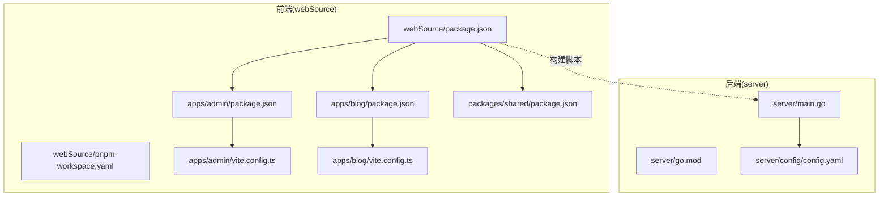
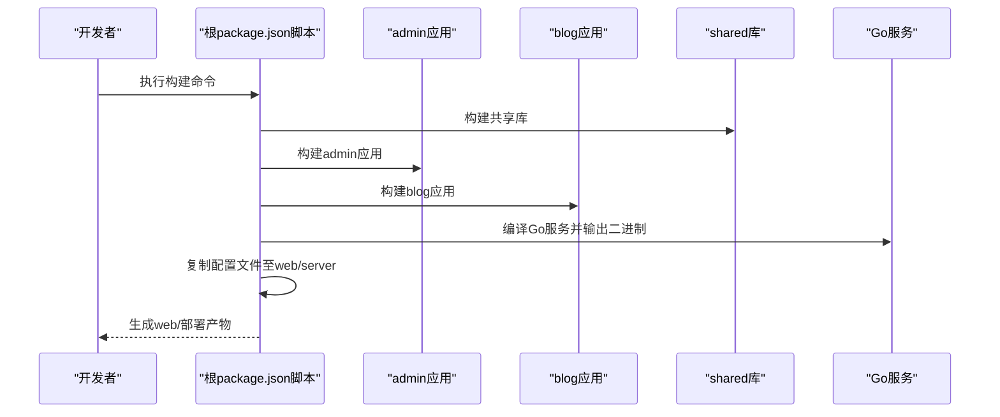
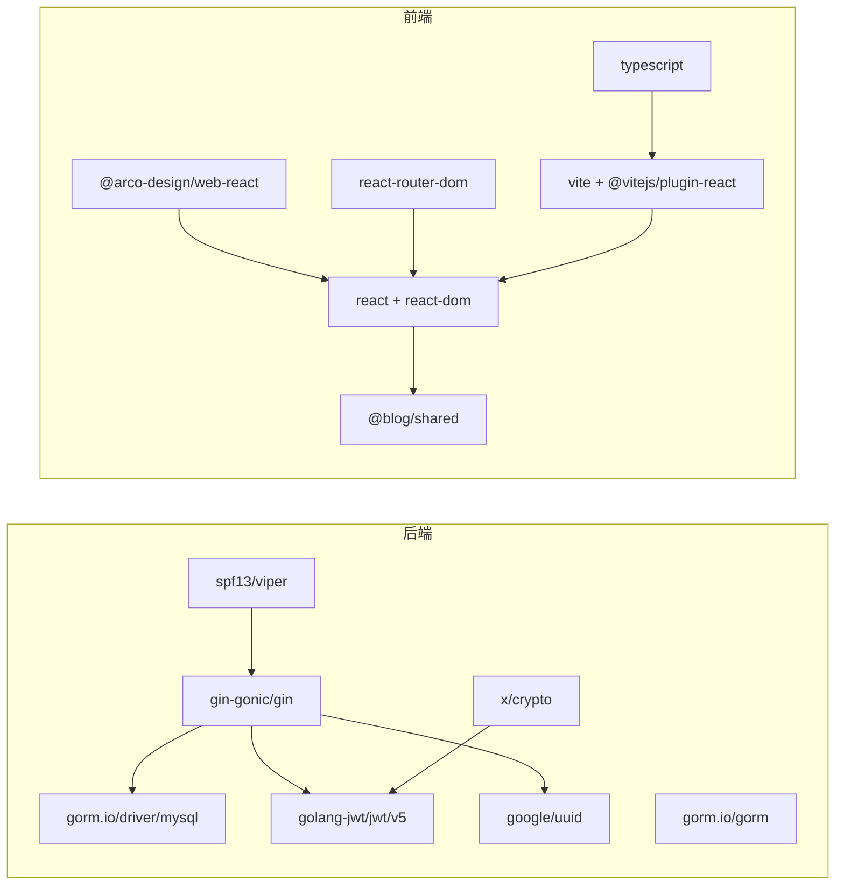

# 版本管理与发布

<cite>
**本文引用的文件**
- [server/go.mod](file://server/go.mod)
- [server/go.sum](file://server/go.sum)
- [server/main.go](file://server/main.go)
- [server/config/config.yaml](file://server/config/config.yaml)
- [webSource/package.json](file://webSource/package.json)
- [webSource/pnpm-workspace.yaml](file://webSource/pnpm-workspace.yaml)
- [webSource/pnpm-lock.yaml](file://webSource/pnpm-lock.yaml)
- [webSource/apps/admin/package.json](file://webSource/apps/admin/package.json)
- [webSource/apps/admin/vite.config.ts](file://webSource/apps/admin/vite.config.ts)
- [webSource/apps/admin/tsconfig.json](file://webSource/apps/admin/tsconfig.json)
- [webSource/apps/blog/package.json](file://webSource/apps/blog/package.json)
- [webSource/apps/blog/vite.config.ts](file://webSource/apps/blog/vite.config.ts)
- [webSource/apps/blog/tsconfig.json](file://webSource/apps/blog/tsconfig.json)
- [webSource/packages/shared/package.json](file://webSource/packages/shared/package.json)
- [webSource/packages/shared/tsconfig.json](file://webSource/packages/shared/tsconfig.json)
- [webSource/apps/admin/tsconfig.json](file://webSource/apps/admin/tsconfig.json)
- [.gitignore](file://.gitignore)
</cite>

## 目录
1. [简介](#简介)
2. [项目结构](#项目结构)
3. [核心组件](#核心组件)
4. [架构总览](#架构总览)
5. [详细组件分析](#详细组件分析)
6. [依赖关系分析](#依赖关系分析)
7. [性能考虑](#性能考虑)
8. [故障排查指南](#故障排查指南)
9. [结论](#结论)
10. [附录](#附录)

## 简介
本指南面向Xiangmuzs博客平台的版本管理与发布流程，覆盖以下方面：
- Go模块依赖与前端包依赖的管理、版本升级策略与兼容性检查
- Git分支管理策略（功能分支、发布分支、热修复分支）
- 语义化版本控制应用与版本号管理规范
- CI/CD流水线配置与自动化部署流程建议
- 发布前质量检查清单（代码审查、测试验证、安全扫描）
- 具体版本发布示例（从开发到生产）
- 回滚策略与应急处理方案

## 项目结构
该仓库采用前后端一体化工作区布局：
- 后端：Go模块位于 server/，使用标准模块路径与go.mod
- 前端：基于pnpm workspaces的多包结构，apps/包含两个前端应用（admin、blog），packages/包含共享库shared
- 构建产物统一输出至web/目录，供部署使用

图表来源
- [server/go.mod:1-60](file://server/go.mod#L1-L60)
- [server/main.go:1-77](file://server/main.go#L1-L77)
- [server/config/config.yaml:1-29](file://server/config/config.yaml#L1-L29)
- [webSource/package.json:1-22](file://webSource/package.json#L1-L22)
- [webSource/pnpm-workspace.yaml:1-4](file://webSource/pnpm-workspace.yaml#L1-L4)
- [webSource/apps/admin/package.json:1-28](file://webSource/apps/admin/package.json#L1-L28)
- [webSource/apps/blog/package.json:1-30](file://webSource/apps/blog/package.json#L1-L30)
- [webSource/packages/shared/package.json:1-23](file://webSource/packages/shared/package.json#L1-L23)
- [webSource/apps/admin/vite.config.ts:1-24](file://webSource/apps/admin/vite.config.ts#L1-L24)
- [webSource/apps/blog/vite.config.ts:1-24](file://webSource/apps/blog/vite.config.ts#L1-L24)

章节来源
- [server/go.mod:1-60](file://server/go.mod#L1-L60)
- [webSource/package.json:1-22](file://webSource/package.json#L1-L22)
- [webSource/pnpm-workspace.yaml:1-4](file://webSource/pnpm-workspace.yaml#L1-L4)

## 核心组件
- 后端服务启动与配置加载：后端入口负责加载配置、连接数据库、执行迁移、初始化RSA密钥、设置中间件与路由，并根据运行模式选择日志级别与Gin模式。
- 前端应用与共享库：admin与blog应用通过Vite构建，共享库shared提供通用工具与类型定义；整体通过根package.json的脚本统一编排。

章节来源
- [server/main.go:19-76](file://server/main.go#L19-L76)
- [server/config/config.yaml:1-29](file://server/config/config.yaml#L1-L29)
- [webSource/apps/admin/vite.config.ts:4-9](file://webSource/apps/admin/vite.config.ts#L4-L9)
- [webSource/apps/blog/vite.config.ts:4-9](file://webSource/apps/blog/vite.config.ts#L4-L9)
- [webSource/packages/shared/package.json:1-23](file://webSource/packages/shared/package.json#L1-L23)

## 架构总览
下图展示了从开发到部署的关键流程：前端多包构建、后端Go二进制生成、配置复制与产物打包。

图表来源
- [webSource/package.json:11-12](file://webSource/package.json#L11-L12)
- [webSource/apps/admin/vite.config.ts:6-8](file://webSource/apps/admin/vite.config.ts#L6-L8)
- [webSource/apps/blog/vite.config.ts:6-8](file://webSource/apps/blog/vite.config.ts#L6-L8)
- [server/main.go:19-76](file://server/main.go#L19-L76)

## 详细组件分析

### 后端Go模块依赖管理
- 模块与Go版本：模块名为blog-server，Go版本要求为1.22，便于在CI中统一镜像。
- 主要依赖：Web框架、JWT、UUID、配置解析、加密库、MySQL驱动与ORM等。
- 间接依赖：大量通过go.sum与require块中的间接依赖，建议在升级时关注间接依赖变更对行为的影响。
- 升级策略：
  - 小版本升级：优先使用语义化版本范围（如^）以获得补丁更新，但需在CI中进行回归测试。
  - 大版本升级：先在本地与测试环境验证，再在预发布分支进行灰度。
  - 兼容性检查：结合go mod tidy与go vet、静态分析工具，确保API与数据结构未被破坏。
- 版本锁定：go.mod与go.sum共同保证可重复构建，发布前务必提交两者的同步变更。

章节来源
- [server/go.mod:1-60](file://server/go.mod#L1-L60)
- [server/go.sum](file://server/go.sum)

### 前端包依赖管理（pnpm workspace）
- 工作区组织：apps/与packages/均纳入工作区，实现跨包依赖与统一锁文件。
- 依赖范围：
  - 应用层：admin与blog分别声明React、路由、UI库与构建工具。
  - 共享层：shared提供HTTP客户端、日期工具、加解密等基础能力。
- 升级策略：
  - 使用^或~范围限定，优先小版本更新，配合pnpm audit与集成测试。
  - 对UI库与构建工具进行分组升级，避免同时引入多个不兼容变更。
  - 兼容性检查：通过TypeScript严格模式与lint规则，确保类型与语法一致性。
- 锁文件与缓存：pnpm-lock.yaml记录精确版本，发布前应提交最新锁文件以确保可复现构建。

章节来源
- [webSource/pnpm-workspace.yaml:1-4](file://webSource/pnpm-workspace.yaml#L1-L4)
- [webSource/pnpm-lock.yaml](file://webSource/pnpm-lock.yaml)
- [webSource/apps/admin/package.json:12-20](file://webSource/apps/admin/package.json#L12-L20)
- [webSource/apps/blog/package.json:12-21](file://webSource/apps/blog/package.json#L12-L21)
- [webSource/packages/shared/package.json:15-19](file://webSource/packages/shared/package.json#L15-L19)

### 构建与产物输出
- 前端构建：admin与blog分别输出至web/admin与web/blog，构建目录由各应用的vite.config.ts指定。
- 后端构建：根脚本在server目录编译Go服务并输出二进制，随后复制配置文件至web/server。
- 部署产物：.gitignore明确忽略node_modules与构建产物，仅保留web/用于部署。

章节来源
- [webSource/apps/admin/vite.config.ts:6-9](file://webSource/apps/admin/vite.config.ts#L6-L9)
- [webSource/apps/blog/vite.config.ts:6-9](file://webSource/apps/blog/vite.config.ts#L6-L9)
- [webSource/package.json:11-12](file://webSource/package.json#L11-L12)
- [.gitignore:13-14](file://.gitignore#L13-L14)

### 配置管理
- 后端配置：通过config.yaml集中管理服务器端口、运行模式、数据库连接、JWT密钥与上传限制、博客基础URL等。
- 开发与生产差异：开发模式启用更详细的日志与Gin调试模式；生产模式切换为Release并使用环境变量覆盖敏感配置。

章节来源
- [server/config/config.yaml:1-29](file://server/config/config.yaml#L1-L29)
- [server/main.go:36-57](file://server/main.go#L36-L57)

### 类型与工具链配置
- TypeScript配置：apps与shared均采用严格模式与bundler解析，确保类型安全与模块检测一致。
- 构建脚本：根package.json提供统一的开发、构建、格式化与清理脚本，便于本地与CI复用。

章节来源
- [webSource/apps/admin/tsconfig.json:2-22](file://webSource/apps/admin/tsconfig.json#L2-L22)
- [webSource/apps/blog/tsconfig.json:2-22](file://webSource/apps/blog/tsconfig.json#L2-L22)
- [webSource/packages/shared/tsconfig.json:2-20](file://webSource/packages/shared/tsconfig.json#L2-L20)
- [webSource/package.json:4-16](file://webSource/package.json#L4-L16)

## 依赖关系分析
- 后端依赖耦合：Web框架、ORM与数据库驱动存在直接耦合；JWT与加密库用于认证与安全；配置库用于环境变量与文件合并。
- 前端依赖耦合：admin与blog共享@blog/shared；各自依赖React与UI生态；构建工具链统一由Vite与TypeScript组成。
- 跨语言依赖：前端构建产物作为静态资源由后端路由提供，上传文件通过静态路由暴露。

图表来源
- [server/go.mod:5-13](file://server/go.mod#L5-L13)
- [webSource/apps/admin/package.json:12-19](file://webSource/apps/admin/package.json#L12-L19)
- [webSource/apps/blog/package.json:12-21](file://webSource/apps/blog/package.json#L12-L21)
- [webSource/packages/shared/package.json:15-19](file://webSource/packages/shared/package.json#L15-L19)

## 性能考虑
- 后端性能：合理设置数据库连接池参数与GORM日志级别；在生产模式关闭冗余日志；对热点接口进行缓存与限流。
- 前端性能：按需加载与代码分割；压缩与Tree Shaking；CDN加速静态资源。
- 构建性能：pnpm的硬链接与缓存机制提升安装速度；Vite快速冷启动与热更新；Go编译开启优化标志。

## 故障排查指南
- 后端启动失败
  - 检查配置文件加载是否成功，确认数据库连接参数与凭据。
  - 查看日志输出定位迁移或RSA初始化错误。
- 前端无法访问后端接口
  - 检查Vite代理配置与后端监听地址端口。
  - 确认跨域中间件已正确启用。
- 构建产物缺失
  - 确认根脚本已执行，且输出目录映射正确。
  - 检查.gitignore是否误排除了web/目录。

章节来源
- [server/main.go:20-24](file://server/main.go#L20-L24)
- [server/main.go:41-44](file://server/main.go#L41-L44)
- [server/main.go:62-68](file://server/main.go#L62-L68)
- [webSource/apps/admin/vite.config.ts:12-21](file://webSource/apps/admin/vite.config.ts#L12-L21)
- [webSource/apps/blog/vite.config.ts:12-21](file://webSource/apps/blog/vite.config.ts#L12-L21)
- [.gitignore:13-14](file://.gitignore#L13-L14)

## 结论
本指南提供了Xiangmuzs博客平台在依赖管理、分支策略、版本控制、CI/CD与发布流程方面的系统化实践建议。通过统一的工作区与模块化结构，结合严格的升级与兼容性检查流程，可显著提升发布质量与稳定性。

## 附录

### Git分支管理策略
- 功能分支（Feature Branch）
  - 命名：feature/xxx 或 feat/xxx
  - 合并：通过Pull Request进行代码审查，合并后删除分支
- 发布分支（Release Branch）
  - 命名：release/vX.Y.Z
  - 用途：准备发布、修复紧急问题、最终验证
  - 合并：合并至main与develop，打标签并推送
- 热修复分支（Hotfix Branch）
  - 命名：hotfix/vX.Y.Z
  - 来源：从main切出，修复后合并回main与develop，并打新补丁标签

### 语义化版本控制（SemVer）
- 主版本号：破坏性变更
- 次版本号：向后兼容的功能新增
- 补丁版本号：向后兼容的问题修正
- 预发布标识：alpha/beta/rc等
- 版本号管理规范
  - 发布前：确保go.mod与各package.json版本号同步更新
  - 打标签：遵循vX.Y.Z格式并在CI中触发发布流程
  - 变更日志：记录破坏性变更与重要修复

### CI/CD流水线配置与自动化部署（建议）
- 触发条件
  - develop：单元测试与静态分析
  - release/*：集成测试与安全扫描
  - main：构建产物、打标签、部署到预生产/生产
- 关键步骤
  - 安装依赖：后端go install，前端pnpm install
  - 测试：后端go test，前端lint与类型检查
  - 构建：后端编译二进制，前端多应用构建
  - 打包：复制配置与产物至web/
  - 部署：将web/部署至目标环境
- 安全扫描：在CI中集成依赖漏洞扫描与密码泄露检测

### 发布前质量检查清单
- 代码审查：PR必须至少一名维护者批准
- 测试验证：后端单元测试与集成测试通过；前端端到端测试通过
- 安全扫描：依赖漏洞扫描、敏感信息检查
- 文档更新：变更日志、README更新
- 回归验证：在预发布环境进行冒烟测试

### 版本发布示例（从开发到生产）
- 步骤
  - 在develop上创建功能分支并完成开发
  - 合并至develop并通过CI
  - 创建release/vX.Y.Z分支进行最终验证
  - 在release分支打vX.Y.Z标签并合并回main与develop
  - CI触发构建与部署，生成web/部署产物
- 注意事项
  - 发布前确保go.mod/go.sum与各package.json版本号一致
  - 生产环境使用独立配置文件覆盖默认值

### 回滚策略与应急处理
- 回滚策略
  - 快速回滚：回退到上一个稳定标签的构建产物
  - 渐进式回滚：逐步回退部分实例，观察指标恢复
- 应急处理
  - 临时降级：禁用高风险功能或切换到备用服务
  - 配置热修复：通过配置中心或环境变量快速修复
  - 运维监控：建立告警阈值与自动通知机制