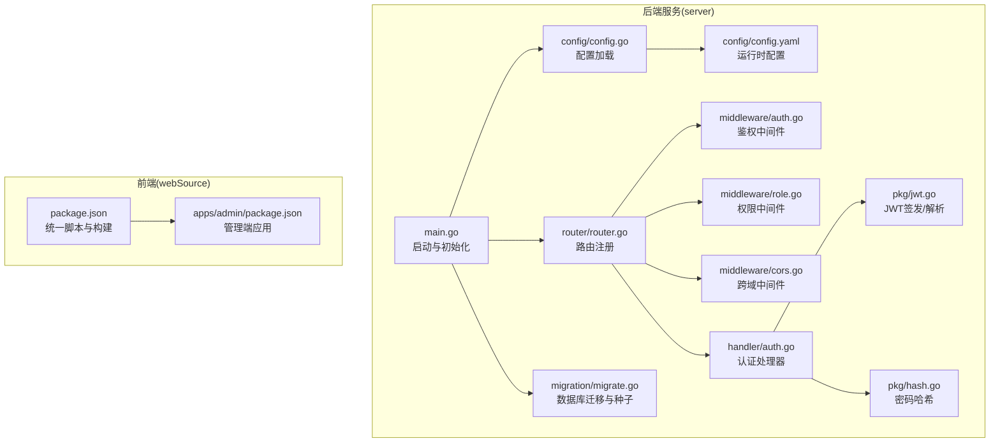
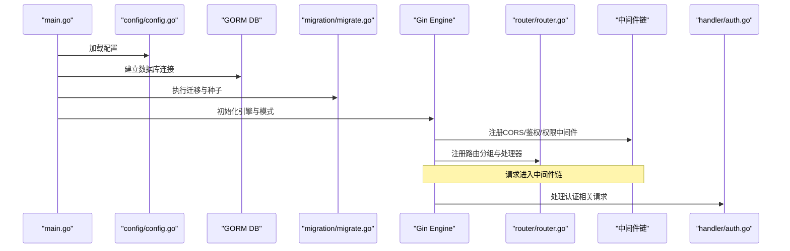
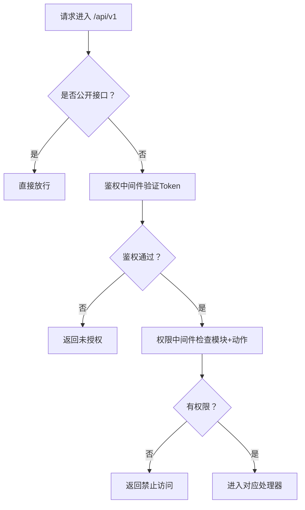
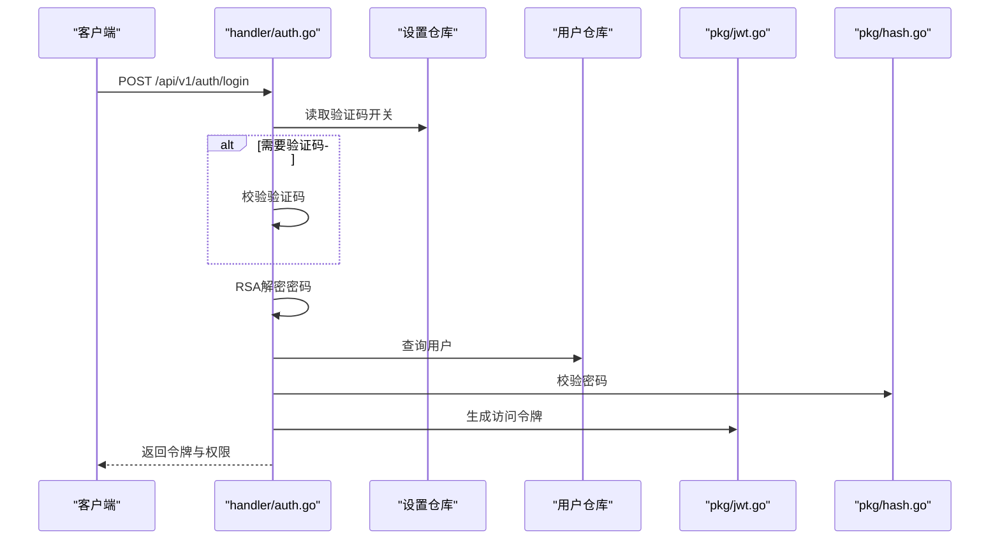
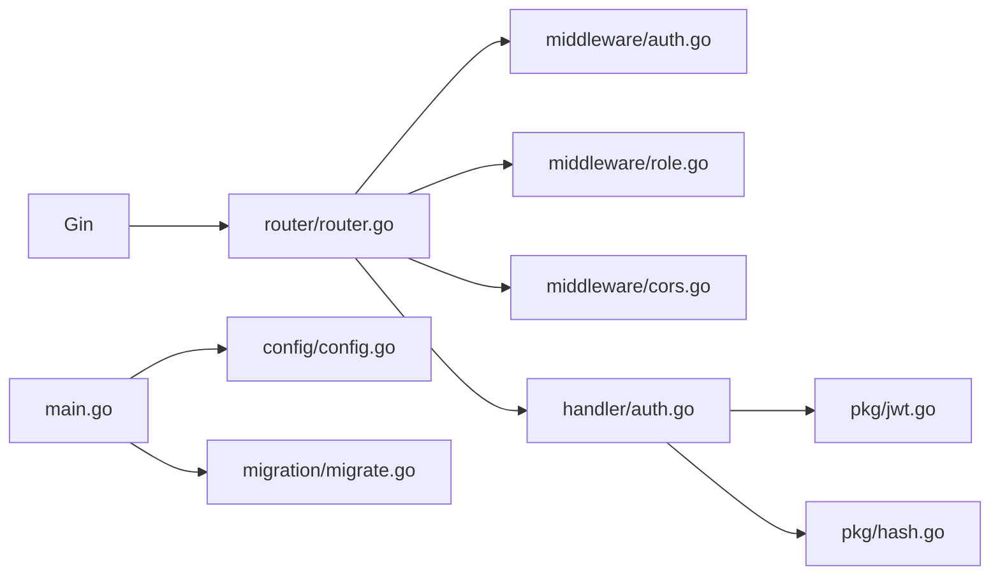

# 维护任务与检查清单

<cite>
**本文引用的文件**
- [server/main.go](file://server/main.go)
- [server/config/config.go](file://server/config/config.go)
- [server/config/config.yaml](file://server/config/config.yaml)
- [server/router/router.go](file://server/router/router.go)
- [server/migration/migrate.go](file://server/migration/migrate.go)
- [server/internal/middleware/auth.go](file://server/internal/middleware/auth.go)
- [server/internal/middleware/cors.go](file://server/internal/middleware/cors.go)
- [server/internal/middleware/role.go](file://server/internal/middleware/role.go)
- [server/internal/handler/auth.go](file://server/internal/handler/auth.go)
- [server/internal/pkg/jwt.go](file://server/internal/pkg/jwt.go)
- [server/internal/pkg/hash.go](file://server/internal/pkg/hash.go)
- [webSource/package.json](file://webSource/package.json)
- [webSource/apps/admin/package.json](file://webSource/apps/admin/package.json)
</cite>

## 目录
1. [简介](#简介)
2. [项目结构](#项目结构)
3. [核心组件](#核心组件)
4. [架构总览](#架构总览)
5. [详细组件分析](#详细组件分析)
6. [依赖分析](#依赖分析)
7. [性能考虑](#性能考虑)
8. [故障排查指南](#故障排查指南)
9. [结论](#结论)
10. [附录](#附录)

## 简介
本指南面向Xiangmuzs博客平台的运维与开发团队，围绕“安全更新、性能监控、日志分析、系统健康检查、故障排查、监控告警、备份与灾备、维护脚本与自动化”等维度，提供可落地的定期维护任务清单与实施建议。文档基于当前仓库中的后端Go服务、路由与中间件、配置与迁移脚本、以及前端构建脚本进行分析，并结合通用实践给出可操作的步骤与图示。

## 项目结构
后端采用Gin框架与GORM，按领域分层组织：配置、路由、中间件、处理器、仓储、服务、模型、工具包与迁移脚本；前端采用Vite + React多包工作区，通过统一的构建脚本完成打包与产物复制。

**图表来源**
- [server/main.go:19-76](file://server/main.go#L19-L76)
- [server/config/config.go:47-64](file://server/config/config.go#L47-L64)
- [server/config/config.yaml:1-29](file://server/config/config.yaml#L1-L29)
- [server/router/router.go:11-103](file://server/router/router.go#L11-L103)
- [server/internal/middleware/auth.go:10-37](file://server/internal/middleware/auth.go#L10-L37)
- [server/internal/middleware/role.go:10-42](file://server/internal/middleware/role.go#L10-L42)
- [server/internal/middleware/cors.go:7-21](file://server/internal/middleware/cors.go#L7-L21)
- [server/internal/handler/auth.go:19-93](file://server/internal/handler/auth.go#L19-L93)
- [server/internal/pkg/jwt.go:16-42](file://server/internal/pkg/jwt.go#L16-L42)
- [server/internal/pkg/hash.go:5-13](file://server/internal/pkg/hash.go#L5-L13)
- [server/migration/migrate.go:13-38](file://server/migration/migrate.go#L13-L38)
- [webSource/package.json:4-15](file://webSource/package.json#L4-L15)
- [webSource/apps/admin/package.json:6-10](file://webSource/apps/admin/package.json#L6-L10)

**章节来源**
- [server/main.go:19-76](file://server/main.go#L19-L76)
- [server/config/config.go:47-64](file://server/config/config.go#L47-L64)
- [server/config/config.yaml:1-29](file://server/config/config.yaml#L1-L29)
- [server/router/router.go:11-103](file://server/router/router.go#L11-L103)
- [webSource/package.json:4-15](file://webSource/package.json#L4-L15)

## 核心组件
- 配置系统：通过Viper从YAML读取配置，支持运行模式、数据库、JWT、上传与博客基础URL等键值。
- 路由与中间件：统一注册公开与受保护接口，内置CORS、鉴权与权限校验中间件。
- 认证与授权：基于JWT令牌与RBAC权限矩阵，支持登录、获取公钥、修改密码与权限加载。
- 数据库迁移与种子：自动迁移模型并注入默认权限、角色与管理员账户。
- 前端构建：统一脚本负责共享包、管理端、博客端与后端二进制的构建与复制。

**章节来源**
- [server/config/config.go:7-43](file://server/config/config.go#L7-L43)
- [server/config/config.yaml:1-29](file://server/config/config.yaml#L1-L29)
- [server/router/router.go:24-102](file://server/router/router.go#L24-L102)
- [server/internal/middleware/auth.go:10-37](file://server/internal/middleware/auth.go#L10-L37)
- [server/internal/middleware/role.go:10-42](file://server/internal/middleware/role.go#L10-L42)
- [server/internal/handler/auth.go:27-93](file://server/internal/handler/auth.go#L27-L93)
- [server/migration/migrate.go:13-125](file://server/migration/migrate.go#L13-L125)
- [webSource/package.json:4-15](file://webSource/package.json#L4-L15)

## 架构总览
下图展示启动流程、路由分组、中间件链路与关键处理函数之间的调用关系。

**图表来源**
- [server/main.go:19-76](file://server/main.go#L19-L76)
- [server/config/config.go:47-64](file://server/config/config.go#L47-L64)
- [server/migration/migrate.go:13-38](file://server/migration/migrate.go#L13-L38)
- [server/router/router.go:11-103](file://server/router/router.go#L11-L103)
- [server/internal/middleware/auth.go:10-37](file://server/internal/middleware/auth.go#L10-L37)
- [server/internal/middleware/role.go:10-42](file://server/internal/middleware/role.go#L10-L42)
- [server/internal/middleware/cors.go:7-21](file://server/internal/middleware/cors.go#L7-L21)
- [server/internal/handler/auth.go:19-93](file://server/internal/handler/auth.go#L19-L93)

## 详细组件分析

### 配置与启动流程
- 启动顺序：加载配置 → 连接数据库 → 运行迁移与种子 → 初始化RSA密钥（用于登录加密）→ 设置Gin模式 → 注册CORS → 暴露上传目录 → 注册路由 → 启动服务。
- 关键配置项：server.port、server.mode、database.*、jwt.secret/expiry、upload.*、blog.base_url。
- 建议：生产环境应关闭debug模式，设置强JWT密钥与合理过期时间，限制上传类型与大小。

**章节来源**
- [server/main.go:19-76](file://server/main.go#L19-L76)
- [server/config/config.go:7-43](file://server/config/config.go#L7-L43)
- [server/config/config.yaml:1-29](file://server/config/config.yaml#L1-L29)

### 路由与权限控制
- 公开接口：获取公钥、验证码、登录、公开文章列表/搜索/详情、分类/标签列表、公开设置。
- 受保护接口：在/api/v1下按模块分组，启用鉴权中间件；部分CRUD接口进一步绑定权限中间件，实现细粒度RBAC。
- 权限加载：登录成功后根据角色加载权限集合返回给前端。

**图表来源**
- [server/router/router.go:24-102](file://server/router/router.go#L24-L102)
- [server/internal/middleware/auth.go:10-37](file://server/internal/middleware/auth.go#L10-L37)
- [server/internal/middleware/role.go:10-42](file://server/internal/middleware/role.go#L10-L42)

**章节来源**
- [server/router/router.go:11-103](file://server/router/router.go#L11-L103)
- [server/internal/middleware/auth.go:10-37](file://server/internal/middleware/auth.go#L10-L37)
- [server/internal/middleware/role.go:10-42](file://server/internal/middleware/role.go#L10-L42)

### 认证与安全
- 登录流程：可选验证码校验 → RSA解密密码 → 用户查询与状态校验 → 密码校验 → 生成JWT → 返回用户信息与权限。
- Token管理：JWT签发与解析依赖配置中的secret与过期时间；密码存储使用bcrypt。
- 安全建议：生产环境必须开启HTTPS、缩短access token有效期、启用刷新token策略、定期轮换JWT密钥。

**图表来源**
- [server/internal/handler/auth.go:31-93](file://server/internal/handler/auth.go#L31-L93)
- [server/internal/pkg/jwt.go:16-42](file://server/internal/pkg/jwt.go#L16-L42)
- [server/internal/pkg/hash.go:5-13](file://server/internal/pkg/hash.go#L5-L13)

**章节来源**
- [server/internal/handler/auth.go:27-93](file://server/internal/handler/auth.go#L27-L93)
- [server/internal/pkg/jwt.go:16-42](file://server/internal/pkg/jwt.go#L16-L42)
- [server/internal/pkg/hash.go:5-13](file://server/internal/pkg/hash.go#L5-L13)

### 数据库迁移与种子
- 自动迁移：对权限、角色、用户、分类、标签、文章、媒体、二维码、设置等模型执行迁移。
- 种子数据：插入权限矩阵、超级管理员与编辑角色、默认管理员用户（仅在不存在时创建）。

**章节来源**
- [server/migration/migrate.go:13-125](file://server/migration/migrate.go#L13-L125)

### 前端构建与部署
- 统一脚本：构建共享包、管理端、博客端与后端二进制，并复制配置文件到输出目录。
- 开发模式：支持同时启动管理端与博客端前端服务。

**章节来源**
- [webSource/package.json:4-15](file://webSource/package.json#L4-L15)
- [webSource/apps/admin/package.json:6-10](file://webSource/apps/admin/package.json#L6-L10)

## 依赖分析
- 后端依赖：Gin、GORM、Viper、golang-jwt、bcrypt、MySQL驱动。
- 前端依赖：React、ArcoDesign、React Router、Zustand、QRCode组件等。
- 关键耦合点：路由依赖中间件；处理器依赖仓库与工具包；启动流程依赖配置与迁移。

**图表来源**
- [server/main.go:19-76](file://server/main.go#L19-L76)
- [server/router/router.go:11-103](file://server/router/router.go#L11-L103)
- [server/internal/middleware/auth.go:10-37](file://server/internal/middleware/auth.go#L10-L37)
- [server/internal/middleware/role.go:10-42](file://server/internal/middleware/role.go#L10-L42)
- [server/internal/middleware/cors.go:7-21](file://server/internal/middleware/cors.go#L7-L21)
- [server/internal/handler/auth.go:19-93](file://server/internal/handler/auth.go#L19-L93)
- [server/internal/pkg/jwt.go:16-42](file://server/internal/pkg/jwt.go#L16-L42)
- [server/internal/pkg/hash.go:5-13](file://server/internal/pkg/hash.go#L5-L13)
- [server/config/config.go:47-64](file://server/config/config.go#L47-L64)
- [server/migration/migrate.go:13-38](file://server/migration/migrate.go#L13-L38)

**章节来源**
- [server/main.go:19-76](file://server/main.go#L19-L76)
- [server/router/router.go:11-103](file://server/router/router.go#L11-L103)
- [server/internal/middleware/auth.go:10-37](file://server/internal/middleware/auth.go#L10-L37)
- [server/internal/middleware/role.go:10-42](file://server/internal/middleware/role.go#L10-L42)
- [server/internal/middleware/cors.go:7-21](file://server/internal/middleware/cors.go#L7-L21)
- [server/internal/handler/auth.go:19-93](file://server/internal/handler/auth.go#L19-L93)
- [server/internal/pkg/jwt.go:16-42](file://server/internal/pkg/jwt.go#L16-L42)
- [server/internal/pkg/hash.go:5-13](file://server/internal/pkg/hash.go#L5-L13)
- [server/config/config.go:47-64](file://server/config/config.go#L47-L64)
- [server/migration/migrate.go:13-38](file://server/migration/migrate.go#L13-L38)

## 性能考虑
- 日志级别：生产模式建议使用Release模式，避免冗余日志影响性能。
- 数据库连接：合理设置连接池参数（最大打开/空闲连接数），避免频繁重建连接。
- 缓存策略：对热点接口（如公开文章列表、分类/标签）引入缓存层，降低数据库压力。
- 上传优化：限制上传大小与类型，启用CDN加速静态资源。
- 前端构建：启用压缩与分包策略，减少首屏加载时间。

[本节为通用指导，无需列出章节来源]

## 故障排查指南
- 启动失败
  - 检查配置文件路径与键名是否正确，确认数据库连通性与凭据。
  - 查看启动日志中关于数据库连接与迁移失败的信息。
- 认证失败
  - 确认JWT密钥一致且未被篡改；检查Token是否过期；核对用户状态与权限。
- 权限拒绝
  - 检查角色是否绑定相应权限；确认模块与动作匹配。
- 接口异常
  - 使用浏览器开发者工具查看网络请求与响应；关注CORS头是否正确设置。
- 数据库问题
  - 检查迁移是否成功；核对表结构与索引；必要时回滚并重试。

**章节来源**
- [server/main.go:21-24](file://server/main.go#L21-L24)
- [server/config/config.go:53-60](file://server/config/config.go#L53-L60)
- [server/migration/migrate.go:26-28](file://server/migration/migrate.go#L26-L28)
- [server/internal/middleware/auth.go:12-31](file://server/internal/middleware/auth.go#L12-L31)
- [server/internal/middleware/role.go:20-31](file://server/internal/middleware/role.go#L20-L31)

## 结论
通过明确的配置管理、严格的中间件链路、完善的迁移与种子机制，以及清晰的前后端构建流程，Xiangmuzs博客平台具备了可维护与可扩展的基础。建议在生产环境中强化安全配置、完善监控告警与备份策略，并持续优化性能与用户体验。

[本节为总结性内容，无需列出章节来源]

## 附录

### 定期维护任务清单
- 安全更新
  - 每月评估并升级后端与前端依赖版本，修复已知漏洞。
  - 更换JWT密钥与RSA密钥对，清理旧密钥材料。
- 性能监控
  - 监控CPU、内存、磁盘与数据库连接数；观察接口P95/P99延迟。
  - 分析慢查询日志，优化索引与SQL。
- 日志分析
  - 收集GIN与业务日志，建立关键词过滤与异常告警。
  - 对登录、权限变更、媒体上传等高风险操作做审计日志。
- 健康检查
  - API可用性：定时调用公开接口与鉴权接口，检查响应时间与状态码。
  - 数据库连接：定时执行SELECT 1或查询最小主键，确保连通性。
  - 前端资源：检查静态资源CDN可达性与缓存命中率。

[本节为通用指导，无需列出章节来源]

### 系统健康检查机制
- API可用性检查：编写脚本轮询公开文章列表、登录接口与公钥接口，统计成功率与平均耗时。
- 数据库连接监控：通过数据库驱动自带的Ping或最小查询，判断连接池健康。
- 前端资源加载检测：对/dist目录下的关键资源发起HEAD/GET请求，记录状态码与响应时间。

[本节为通用指导，无需列出章节来源]

### 故障排查流程与常见问题
- 性能瓶颈定位
  - 使用pprof或APM工具采集CPU/内存火焰图；定位热点函数与阻塞点。
  - 分析慢查询与高并发场景下的锁竞争。
- 错误日志分析
  - 将GIN错误日志与业务错误日志分离，建立统一格式化输出。
  - 对高频错误建立告警阈值，快速定位根因。

[本节为通用指导，无需列出章节来源]

### 监控告警系统
- 关键指标
  - QPS、错误率、响应时间、数据库连接数、队列长度、缓存命中率。
- 异常通知
  - 集成邮件/SMS/IM通道，针对不同严重等级触发不同级别的通知。

[本节为通用指导，无需列出章节来源]

### 备份策略与灾难恢复
- 数据库备份
  - 全量+增量备份策略，保留至少7天滚动快照；定期校验恢复流程。
- 文件备份
  - 上传目录与静态资源定期归档；与数据库备份时间对齐。
- 灾难恢复
  - 制定RTO/RPO目标；演练跨机房切换；确保配置与密钥材料同步。

[本节为通用指导，无需列出章节来源]

### 维护脚本示例与自动化工具
- 构建与发布
  - 使用统一脚本完成共享包、管理端、博客端与后端二进制的构建，并复制配置文件。
- 部署自动化
  - 通过CI/CD流水线集成上述脚本，实现一键部署与回滚。
- 健康检查脚本
  - 编写curl/wget脚本轮询关键接口，输出JSON报告供监控系统消费。

**章节来源**
- [webSource/package.json:4-15](file://webSource/package.json#L4-L15)

### 维护文档模板与变更记录规范
- 维护文档模板
  - 版本号、日期、维护人员、变更摘要、影响范围、回滚方案。
- 变更记录规范
  - 以“功能/修复/安全”三类命名；记录受影响模块、测试验证结果与上线时间。

[本节为通用指导，无需列出章节来源]