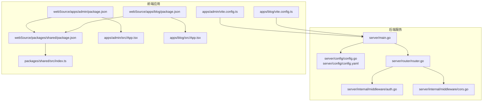
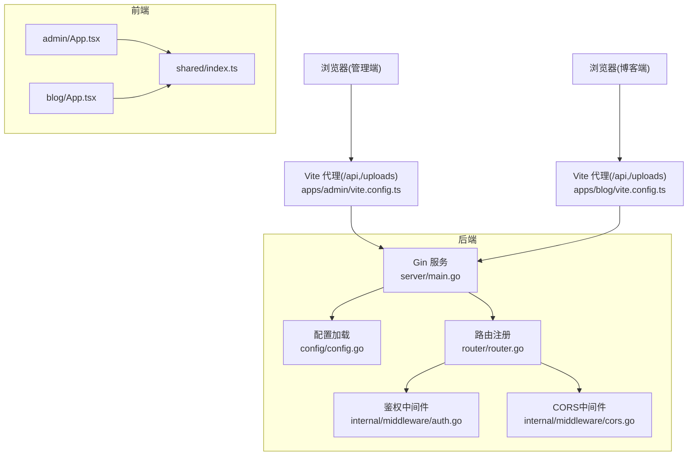
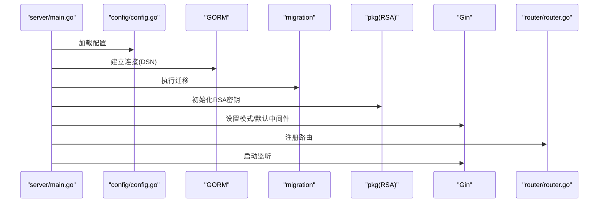
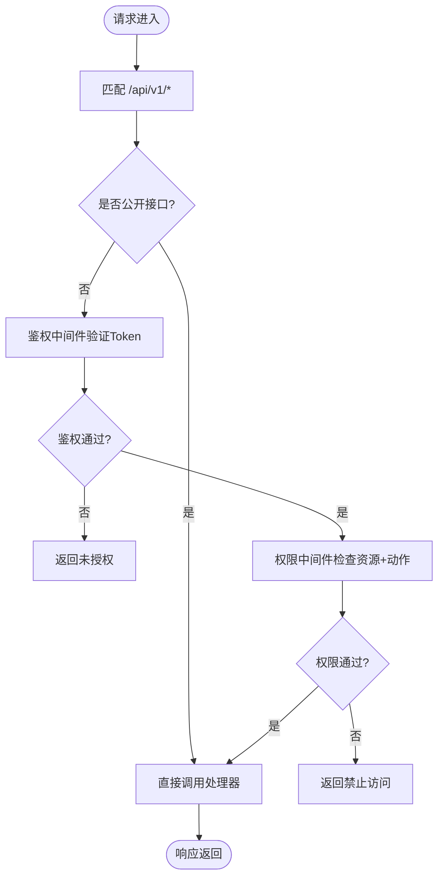
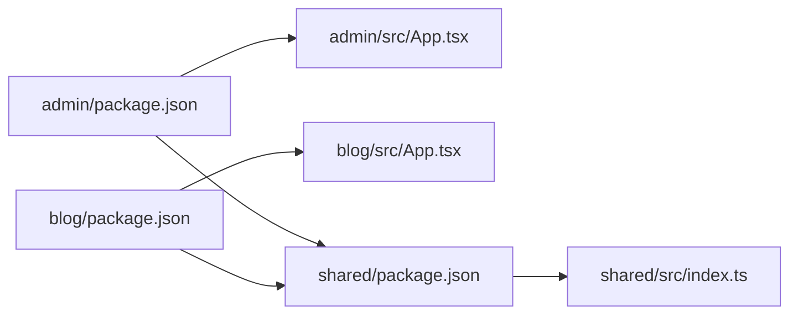
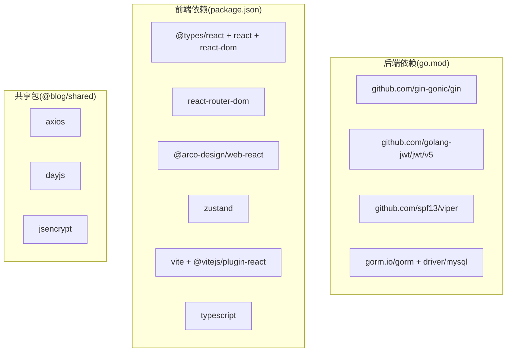

# 开发指南

<cite>
**本文引用的文件**
- [server/main.go](file://server/main.go)
- [server/config/config.go](file://server/config/config.go)
- [server/config/config.yaml](file://server/config/config.yaml)
- [server/router/router.go](file://server/router/router.go)
- [server/internal/middleware/auth.go](file://server/internal/middleware/auth.go)
- [server/internal/middleware/cors.go](file://server/internal/middleware/cors.go)
- [server/go.mod](file://server/go.mod)
- [webSource/apps/admin/package.json](file://webSource/apps/admin/package.json)
- [webSource/apps/blog/package.json](file://webSource/apps/blog/package.json)
- [webSource/packages/shared/package.json](file://webSource/packages/shared/package.json)
- [webSource/apps/admin/vite.config.ts](file://webSource/apps/admin/vite.config.ts)
- [webSource/apps/blog/vite.config.ts](file://webSource/apps/blog/vite.config.ts)
- [webSource/apps/admin/src/App.tsx](file://webSource/apps/admin/src/App.tsx)
- [webSource/apps/blog/src/App.tsx](file://webSource/apps/blog/src/App.tsx)
- [webSource/packages/shared/src/index.ts](file://webSource/packages/shared/src/index.ts)
</cite>

## 目录
1. [简介](#简介)
2. [项目结构](#项目结构)
3. [核心组件](#核心组件)
4. [架构总览](#架构总览)
5. [详细组件分析](#详细组件分析)
6. [依赖分析](#依赖分析)
7. [性能考虑](#性能考虑)
8. [故障排除指南](#故障排除指南)
9. [结论](#结论)
10. [附录](#附录)

## 简介
本开发指南面向Xiangmuzs博客平台的开发者，覆盖后端Go服务与前端React应用的开发规范、环境配置、Git工作流、测试策略、性能优化、调试技巧、CI/CD配置以及常见问题排查。文档以仓库中的实际实现为依据，确保可操作性与一致性。

## 项目结构
项目采用前后端分离与多包工作区（monorepo）组织方式：
- 后端：基于Gin框架的Go服务，集中于 server/ 目录，包含配置、路由、中间件、模型、仓储、服务、DTO等分层。
- 前端：采用Vite + React + TypeScript，分为两个应用：
  - admin 应用：后台管理界面，使用 Arco Design 组件库。
  - blog 应用：博客前台展示页面。
- 共享包：packages/shared 提供类型定义、通用工具与HTTP请求封装，被两个应用复用。

图表来源
- [server/main.go:1-77](file://server/main.go#L1-L77)
- [server/config/config.go:1-65](file://server/config/config.go#L1-L65)
- [server/config/config.yaml:1-29](file://server/config/config.yaml#L1-L29)
- [server/router/router.go:1-104](file://server/router/router.go#L1-L104)
- [server/internal/middleware/auth.go:1-38](file://server/internal/middleware/auth.go#L1-L38)
- [server/internal/middleware/cors.go:1-22](file://server/internal/middleware/cors.go#L1-L22)
- [webSource/apps/admin/package.json:1-28](file://webSource/apps/admin/package.json#L1-L28)
- [webSource/apps/blog/package.json:1-30](file://webSource/apps/blog/package.json#L1-L30)
- [webSource/packages/shared/package.json:1-23](file://webSource/packages/shared/package.json#L1-L23)
- [webSource/apps/admin/vite.config.ts:1-24](file://webSource/apps/admin/vite.config.ts#L1-L24)
- [webSource/apps/blog/vite.config.ts:1-24](file://webSource/apps/blog/vite.config.ts#L1-L24)
- [webSource/apps/admin/src/App.tsx:1-22](file://webSource/apps/admin/src/App.tsx#L1-L22)
- [webSource/apps/blog/src/App.tsx:1-7](file://webSource/apps/blog/src/App.tsx#L1-L7)
- [webSource/packages/shared/src/index.ts:1-6](file://webSource/packages/shared/src/index.ts#L1-L6)

章节来源
- [server/main.go:1-77](file://server/main.go#L1-L77)
- [server/router/router.go:1-104](file://server/router/router.go#L1-L104)
- [webSource/apps/admin/package.json:1-28](file://webSource/apps/admin/package.json#L1-L28)
- [webSource/apps/blog/package.json:1-30](file://webSource/apps/blog/package.json#L1-L30)
- [webSource/packages/shared/package.json:1-23](file://webSource/packages/shared/package.json#L1-L23)

## 核心组件
- 配置系统：通过Viper加载YAML配置，支持运行模式、数据库连接、JWT密钥、上传限制与博客基础URL等。
- 路由体系：统一前缀 /api/v1，公开接口无需鉴权，受保护接口按权限控制；提供文章、分类、标签、媒体、二维码、角色、用户与设置等REST资源。
- 中间件：CORS跨域与JWT鉴权，鉴权中间件解析Bearer Token并注入用户与角色信息。
- 前端应用：admin 使用 Arco Design，blog 使用 Markdown 渲染与高亮；共享包提供HTTP请求、日期与加密等工具。
- 构建与代理：Vite分别构建两个前端应用，并通过代理将 /api 与 /uploads 指向后端服务。

章节来源
- [server/config/config.go:1-65](file://server/config/config.go#L1-L65)
- [server/config/config.yaml:1-29](file://server/config/config.yaml#L1-L29)
- [server/router/router.go:1-104](file://server/router/router.go#L1-L104)
- [server/internal/middleware/auth.go:1-38](file://server/internal/middleware/auth.go#L1-L38)
- [server/internal/middleware/cors.go:1-22](file://server/internal/middleware/cors.go#L1-L22)
- [webSource/apps/admin/src/App.tsx:1-22](file://webSource/apps/admin/src/App.tsx#L1-L22)
- [webSource/apps/blog/src/App.tsx:1-7](file://webSource/apps/blog/src/App.tsx#L1-L7)
- [webSource/packages/shared/src/index.ts:1-6](file://webSource/packages/shared/src/index.ts#L1-L6)

## 架构总览
后端以Gin为核心，结合GORM进行MySQL访问；前端通过Vite开发服务器与代理联调，生产环境分别构建至 web/admin 与 web/blog。

图表来源
- [server/main.go:1-77](file://server/main.go#L1-L77)
- [server/router/router.go:1-104](file://server/router/router.go#L1-L104)
- [server/internal/middleware/auth.go:1-38](file://server/internal/middleware/auth.go#L1-L38)
- [server/internal/middleware/cors.go:1-22](file://server/internal/middleware/cors.go#L1-L22)
- [webSource/apps/admin/vite.config.ts:1-24](file://webSource/apps/admin/vite.config.ts#L1-L24)
- [webSource/apps/blog/vite.config.ts:1-24](file://webSource/apps/blog/vite.config.ts#L1-L24)
- [webSource/apps/admin/src/App.tsx:1-22](file://webSource/apps/admin/src/App.tsx#L1-L22)
- [webSource/apps/blog/src/App.tsx:1-7](file://webSource/apps/blog/src/App.tsx#L1-L7)
- [webSource/packages/shared/src/index.ts:1-6](file://webSource/packages/shared/src/index.ts#L1-L6)

## 详细组件分析

### 后端启动与配置加载
- 启动流程：加载配置 -> 连接数据库 -> 执行迁移 -> 初始化RSA密钥 -> 设置Gin模式 -> 注册中间件与静态资源 -> 注册路由 -> 启动服务。
- 配置项：server.port、server.mode、database.*、jwt.secret/expire、upload.*、blog.base_url。
- 数据库日志：在调试模式下启用GORM日志。

图表来源
- [server/main.go:19-76](file://server/main.go#L19-L76)
- [server/config/config.go:47-64](file://server/config/config.go#L47-L64)
- [server/router/router.go:11-103](file://server/router/router.go#L11-L103)

章节来源
- [server/main.go:19-76](file://server/main.go#L19-L76)
- [server/config/config.yaml:1-29](file://server/config/config.yaml#L1-L29)

### 路由与权限控制
- 路由分组：/api/v1 下的公开接口与需要鉴权的接口；公开文章、分类、标签查询；受保护接口按资源与动作进行权限校验。
- 权限中间件：RequirePermission("resource","action")，结合鉴权中间件共同生效。
- 静态资源：/uploads 挂载上传目录，便于前端预览与展示。

图表来源
- [server/router/router.go:24-102](file://server/router/router.go#L24-L102)
- [server/internal/middleware/auth.go:10-37](file://server/internal/middleware/auth.go#L10-L37)

章节来源
- [server/router/router.go:11-103](file://server/router/router.go#L11-L103)
- [server/internal/middleware/auth.go:10-37](file://server/internal/middleware/auth.go#L10-L37)

### 前端应用与共享包
- 管理端：使用 Arco Design，国际化通过本地化模块注入；路由基于 React Router。
- 博客端：Markdown渲染、GFM支持与代码高亮；路由基于 React Router。
- 共享包：导出类型、请求封装、常量、日期与加密工具，供两端复用。

图表来源
- [webSource/apps/admin/package.json:1-28](file://webSource/apps/admin/package.json#L1-L28)
- [webSource/apps/blog/package.json:1-30](file://webSource/apps/blog/package.json#L1-L30)
- [webSource/packages/shared/package.json:1-23](file://webSource/packages/shared/package.json#L1-L23)
- [webSource/apps/admin/src/App.tsx:1-22](file://webSource/apps/admin/src/App.tsx#L1-L22)
- [webSource/apps/blog/src/App.tsx:1-7](file://webSource/apps/blog/src/App.tsx#L1-L7)
- [webSource/packages/shared/src/index.ts:1-6](file://webSource/packages/shared/src/index.ts#L1-L6)

章节来源
- [webSource/apps/admin/src/App.tsx:1-22](file://webSource/apps/admin/src/App.tsx#L1-L22)
- [webSource/apps/blog/src/App.tsx:1-7](file://webSource/apps/blog/src/App.tsx#L1-L7)
- [webSource/packages/shared/src/index.ts:1-6](file://webSource/packages/shared/src/index.ts#L1-L6)

## 依赖分析
- 后端依赖：Gin、GORM、MySQL驱动、JWT、UUID、Viper等，版本由 go.mod 管控。
- 前端依赖：React、React Router、Arco Design、Zustand、Vite、TypeScript等，分别在各应用与共享包的 package.json 中声明。
- 工作区：pnpm workspace 配合 pnpm-workspace.yaml，实现多包统一管理。

图表来源
- [server/go.mod:1-60](file://server/go.mod#L1-L60)
- [webSource/apps/admin/package.json:1-28](file://webSource/apps/admin/package.json#L1-L28)
- [webSource/apps/blog/package.json:1-30](file://webSource/apps/blog/package.json#L1-L30)
- [webSource/packages/shared/package.json:1-23](file://webSource/packages/shared/package.json#L1-L23)

章节来源
- [server/go.mod:1-60](file://server/go.mod#L1-L60)
- [webSource/apps/admin/package.json:1-28](file://webSource/apps/admin/package.json#L1-L28)
- [webSource/apps/blog/package.json:1-30](file://webSource/apps/blog/package.json#L1-L30)
- [webSource/packages/shared/package.json:1-23](file://webSource/packages/shared/package.json#L1-L23)

## 性能考虑
- 后端
  - 日志级别：调试模式开启GORM日志，生产关闭以降低开销。
  - 数据库连接：使用连接池与合适超时；避免N+1查询，优先使用预加载与批量操作。
  - 中间件：CORS对预检请求快速返回，减少不必要的处理。
  - 静态资源：/uploads 直接由Gin提供，注意磁盘IO与缓存策略。
- 前端
  - 构建产物输出：Vite分别构建至 web/admin 与 web/blog，避免重复打包。
  - 代理：开发时通过Vite代理转发 /api 与 /uploads，减少跨域与额外配置。
  - 组件库：Arco Design按需引入样式与组件，避免全量引入导致体积增大。
- 共享包
  - 请求封装：统一拦截器与错误处理，减少重复逻辑。
  - 工具函数：日期与加密工具尽量复用，避免重复计算。

章节来源
- [server/main.go:36-39](file://server/main.go#L36-L39)
- [server/internal/middleware/cors.go:7-21](file://server/internal/middleware/cors.go#L7-L21)
- [webSource/apps/admin/vite.config.ts:6-9](file://webSource/apps/admin/vite.config.ts#L6-L9)
- [webSource/apps/blog/vite.config.ts:6-9](file://webSource/apps/blog/vite.config.ts#L6-L9)

## 故障排除指南
- 启动失败
  - 配置读取：确认 config.yaml 存在且字段正确；检查配置路径与权限。
  - 数据库连接：核对 DSN 参数（主机、端口、用户名、密码、数据库名、字符集）。
  - RSA初始化：若失败，检查密钥生成与写入权限。
- 认证相关
  - 缺少或格式错误的 Authorization 头会导致未授权；确认前端携带 Bearer Token。
  - Token过期或无效会触发未授权；检查JWT密钥与过期时间。
- 跨域问题
  - CORS中间件已允许常用方法与头，如遇到自定义头或复杂场景，可在中间件调整。
- 前端联调
  - 确认Vite代理目标地址与端口与后端一致；/api 与 /uploads 代理均需生效。
  - 生产环境需将构建产物部署至 web/admin 与 web/blog 对应目录。

章节来源
- [server/config/config.yaml:1-29](file://server/config/config.yaml#L1-L29)
- [server/main.go:27-44](file://server/main.go#L27-L44)
- [server/internal/middleware/auth.go:12-31](file://server/internal/middleware/auth.go#L12-L31)
- [server/internal/middleware/cors.go:8-19](file://server/internal/middleware/cors.go#L8-L19)
- [webSource/apps/admin/vite.config.ts:10-22](file://webSource/apps/admin/vite.config.ts#L10-L22)
- [webSource/apps/blog/vite.config.ts:10-22](file://webSource/apps/blog/vite.config.ts#L10-L22)

## 结论
本指南基于仓库现有实现，提供了从环境搭建、代码规范、路由与权限、前端联调到性能与故障排除的完整开发指引。建议在后续迭代中补充测试与CI/CD配置，以进一步提升质量与交付效率。

## 附录

### 开发环境配置与IDE设置
- Go后端
  - 使用Go 1.22，依赖通过 go.mod 管理；推荐IDE启用导入路径自动补全与vet/gofmt钩子。
  - 配置文件：将 config.yaml 放置于 server/ 根目录或 ./config，确保Viper可读取。
- 前端
  - 使用 pnpm workspace，安装依赖后分别在 apps/admin 与 apps/blog 目录执行 dev/build。
  - IDE建议：启用TypeScript与ESLint/Stylelint插件，保持格式统一。
- 热重载与代理
  - 管理端：Vite默认端口5173，代理 /api 与 /uploads 到后端。
  - 博客端：Vite默认端口5174，代理 /api 与 /uploads 到后端。

章节来源
- [server/go.mod:3](file://server/go.mod#L3)
- [server/config/config.yaml:1-29](file://server/config/config.yaml#L1-L29)
- [webSource/apps/admin/package.json:6-11](file://webSource/apps/admin/package.json#L6-L11)
- [webSource/apps/blog/package.json:6-11](file://webSource/apps/blog/package.json#L6-L11)
- [webSource/apps/admin/vite.config.ts:10-22](file://webSource/apps/admin/vite.config.ts#L10-L22)
- [webSource/apps/blog/vite.config.ts:10-22](file://webSource/apps/blog/vite.config.ts#L10-L22)

### Git工作流程与提交规范
- 分支策略
  - main：稳定发布分支。
  - develop：日常开发分支，合并前需通过代码审查与测试。
  - feature/*：功能开发分支，完成后合并至 develop。
  - hotfix/*：紧急修复分支，直接从 main 切出并回并 main/release。
- 提交信息格式
  - 类型(scope): 摘要
  - 示例：feat(server): 添加JWT刷新接口；fix(blog): 修复Markdown渲染空白
- Pull Request流程
  - 在合并前至少一次代码审查与自动化检查通过；描述变更内容与影响范围。

[本节为通用实践说明，不直接分析具体文件，故不附“章节来源”]

### 测试策略与质量保证
- 单元测试
  - Go：为业务逻辑与工具函数编写单元测试，使用标准库 testing；对鉴权与中间件行为进行Mock。
  - React：为组件与Hook编写单元测试，使用测试库；对共享包工具函数进行断言。
- 集成测试
  - Go：针对路由与处理器编写集成测试，使用内存数据库或测试数据库实例。
  - React：端到端测试可使用Playwright或Cypress，覆盖登录、文章增删改查等关键流程。
- 质量门禁
  - 代码覆盖率：为关键模块设定阈值。
  - Lint：Go使用golangci-lint，前端使用ESLint + Prettier。

[本节为通用实践说明，不直接分析具体文件，故不附“章节来源”]

### 性能优化与调试技巧
- 内存与GC
  - Go：使用pprof分析CPU与内存，定位热点与逃逸；避免大对象频繁分配。
  - React：使用React DevTools Profiler分析重渲染；拆分大型组件与合理使用memo。
- 性能瓶颈
  - 后端：关注慢查询与并发瓶颈，必要时引入Redis缓存热点数据。
  - 前端：懒加载与分割代码，减少首屏体积；图片与静态资源CDN加速。
- 错误追踪
  - 后端：统一错误响应结构，记录请求ID与堆栈；接入日志收集与告警。
  - 前端：全局错误边界与网络错误上报；结合Source Map定位问题。

[本节为通用实践说明，不直接分析具体文件，故不附“章节来源”]

### 代码审查清单与质量标准
- Go
  - 变量命名清晰，函数单一职责；错误处理完整；日志信息明确。
  - 配置项集中管理，敏感信息不硬编码；数据库事务使用恰当。
- React
  - 组件可复用、可测试；状态管理合理；类型定义完整。
  - 国际化与无障碍访问；样式与主题一致性。
- 共享包
  - 接口稳定、版本语义化；工具函数无副作用；文档与示例完善。

[本节为通用实践说明，不直接分析具体文件，故不附“章节来源”]

### 持续集成与持续部署
- CI流水线建议
  - 触发：push到develop/main/hotfix/*等分支；PR打开/更新。
  - 步骤：安装依赖 -> Lint -> 单元测试 -> 构建前端产物 -> 运行集成测试 -> 生成报告。
- CD部署
  - 后端：容器化镜像推送至私有仓库，Kubernetes或Docker Compose部署。
  - 前端：将构建产物部署至Nginx或CDN，配置缓存与HTTPS。
- 安全
  - 密钥与配置通过环境变量注入；最小权限原则；定期轮换JWT密钥。

[本节为通用实践说明，不直接分析具体文件，故不附“章节来源”]

### 常见开发问题与解决方案
- 配置无法读取
  - 检查配置文件路径与权限；确认Viper配置路径包含 server/ 与 ./config。
- 数据库连接失败
  - 核对 DSN 字段；确认MySQL服务可达与账号权限。
- JWT鉴权失败
  - 检查密钥一致性与过期时间；确认前端携带正确的Authorization头。
- 前端代理无效
  - 确认Vite代理target与端口；检查防火墙与端口占用。

章节来源
- [server/config/config.go:47-64](file://server/config/config.go#L47-L64)
- [server/main.go:27-44](file://server/main.go#L27-L44)
- [server/internal/middleware/auth.go:12-31](file://server/internal/middleware/auth.go#L12-L31)
- [webSource/apps/admin/vite.config.ts:12-20](file://webSource/apps/admin/vite.config.ts#L12-L20)
- [webSource/apps/blog/vite.config.ts:12-20](file://webSource/apps/blog/vite.config.ts#L12-L20)

### 如何扩展新功能与维护现有代码
- 新增后端接口
  - 在 router/router.go 中注册路由，新增对应 handler 并在内部使用中间件与权限控制。
  - 在 internal/model/repository/service 层按分层职责扩展，DTO与数据库交互解耦。
- 新增前端页面
  - 在对应应用的 pages/components 中添加页面与组件；在 router 中注册路由。
  - 如需复用逻辑，放入 shared 包并导出类型与工具函数。
- 维护与演进
  - 保持配置集中化与环境隔离；对共享包升级遵循语义化版本。
  - 逐步替换旧实现，保留兼容过渡期；完善单元测试与集成测试。

章节来源
- [server/router/router.go:11-103](file://server/router/router.go#L11-L103)
- [webSource/packages/shared/src/index.ts:1-6](file://webSource/packages/shared/src/index.ts#L1-L6)