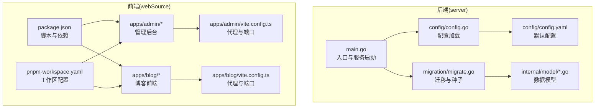
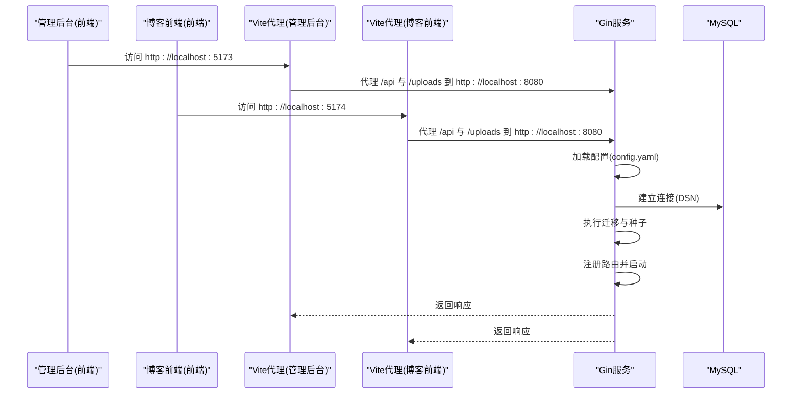
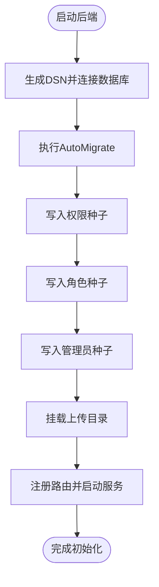
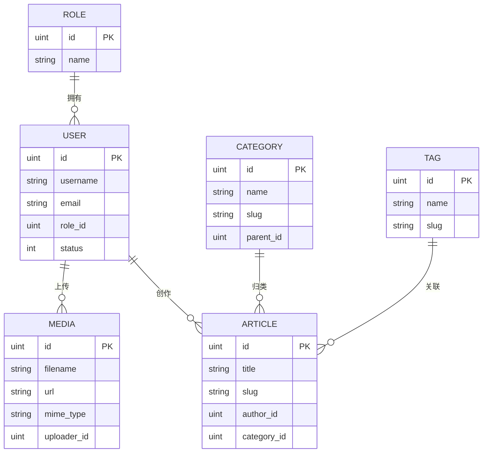
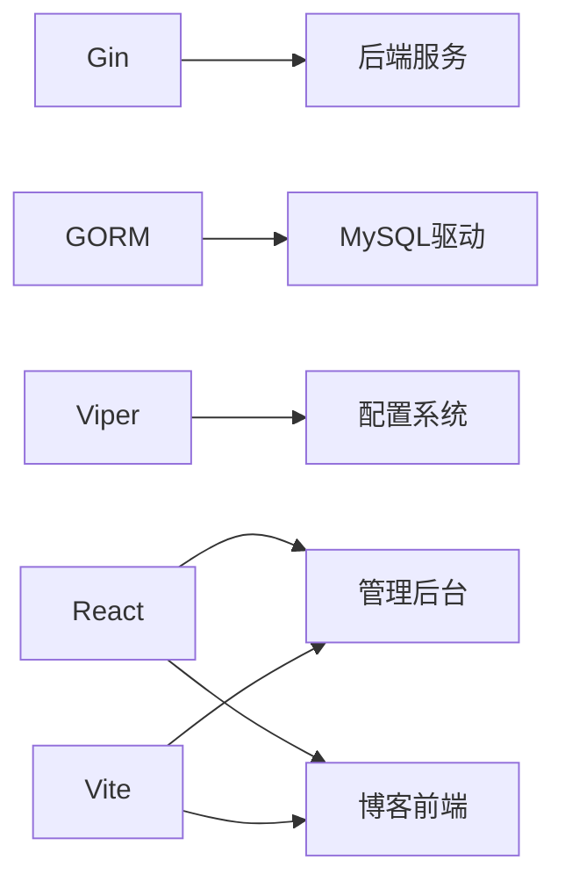

# 开发环境配置

<cite>
**本文引用的文件**
- [server/go.mod](file://server/go.mod)
- [server/config/config.go](file://server/config/config.go)
- [server/config/config.yaml](file://server/config/config.yaml)
- [server/main.go](file://server/main.go)
- [server/migration/migrate.go](file://server/migration/migrate.go)
- [server/internal/model/user.go](file://server/internal/model/user.go)
- [server/internal/model/article.go](file://server/internal/model/article.go)
- [server/internal/model/category.go](file://server/internal/model/category.go)
- [server/internal/model/tag.go](file://server/internal/model/tag.go)
- [server/internal/model/media.go](file://server/internal/model/media.go)
- [webSource/package.json](file://webSource/package.json)
- [webSource/apps/admin/package.json](file://webSource/apps/admin/package.json)
- [webSource/apps/blog/package.json](file://webSource/apps/blog/package.json)
- [webSource/apps/admin/vite.config.ts](file://webSource/apps/admin/vite.config.ts)
- [webSource/apps/blog/vite.config.ts](file://webSource/apps/blog/vite.config.ts)
- [webSource/pnpm-workspace.yaml](file://webSource/pnpm-workspace.yaml)
</cite>

## 目录
1. [简介](#简介)
2. [项目结构](#项目结构)
3. [核心组件](#核心组件)
4. [架构总览](#架构总览)
5. [详细组件分析](#详细组件分析)
6. [依赖分析](#依赖分析)
7. [性能考虑](#性能考虑)
8. [故障排查指南](#故障排查指南)
9. [结论](#结论)
10. [附录](#附录)

## 简介
本指南面向Xiangmuzs博客平台的开发者，提供从系统要求、前置依赖、IDE配置、数据库初始化、环境变量与配置文件管理、Docker开发选项到调试与热重载的完整开发环境搭建流程。文档以仓库中现有配置为依据，确保所有步骤均可在本地复现。

## 项目结构
项目采用前后端分离的多包工作区（monorepo）结构：
- 后端：Go语言实现，使用Gin框架与GORM进行数据库访问，配置通过Viper加载YAML文件。
- 前端：基于React与Vite的双应用（管理后台与博客前端），通过PNPM工作区统一管理。
- 构建脚本：根级脚本聚合构建与打包流程，自动复制后端配置至产物目录。

图表来源
- [server/main.go:1-77](file://server/main.go#L1-L77)
- [server/config/config.go:1-65](file://server/config/config.go#L1-L65)
- [server/config/config.yaml:1-29](file://server/config/config.yaml#L1-L29)
- [server/migration/migrate.go:1-126](file://server/migration/migrate.go#L1-L126)
- [webSource/package.json:1-22](file://webSource/package.json#L1-L22)
- [webSource/pnpm-workspace.yaml:1-4](file://webSource/pnpm-workspace.yaml#L1-L4)
- [webSource/apps/admin/vite.config.ts:1-24](file://webSource/apps/admin/vite.config.ts#L1-L24)
- [webSource/apps/blog/vite.config.ts:1-24](file://webSource/apps/blog/vite.config.ts#L1-L24)

章节来源
- [server/go.mod:1-60](file://server/go.mod#L1-L60)
- [webSource/package.json:1-22](file://webSource/package.json#L1-L22)
- [webSource/pnpm-workspace.yaml:1-4](file://webSource/pnpm-workspace.yaml#L1-L4)

## 核心组件
- 配置系统：通过Viper读取YAML配置，支持运行时覆盖与反序列化为结构体。
- 数据库连接：根据配置生成DSN，按运行模式启用不同日志级别。
- 迁移与种子：自动迁移模型并注入默认权限、角色与管理员账户。
- 前端代理：管理后台与博客前端分别监听不同端口，并将/api与/uploads代理到后端。

章节来源
- [server/config/config.go:1-65](file://server/config/config.go#L1-L65)
- [server/config/config.yaml:1-29](file://server/config/config.yaml#L1-L29)
- [server/main.go:1-77](file://server/main.go#L1-L77)
- [server/migration/migrate.go:1-126](file://server/migration/migrate.go#L1-L126)
- [webSource/apps/admin/vite.config.ts:1-24](file://webSource/apps/admin/vite.config.ts#L1-L24)
- [webSource/apps/blog/vite.config.ts:1-24](file://webSource/apps/blog/vite.config.ts#L1-L24)

## 架构总览
下图展示开发环境中的请求流：前端应用通过Vite代理访问后端API；后端加载配置、连接数据库、执行迁移与种子、注册路由并启动HTTP服务。

图表来源
- [server/config/config.yaml:1-29](file://server/config/config.yaml#L1-L29)
- [server/main.go:1-77](file://server/main.go#L1-L77)
- [webSource/apps/admin/vite.config.ts:1-24](file://webSource/apps/admin/vite.config.ts#L1-L24)
- [webSource/apps/blog/vite.config.ts:1-24](file://webSource/apps/blog/vite.config.ts#L1-L24)

## 详细组件分析

### 系统要求与前置依赖
- Go版本：1.22及以上（由模块声明指定）
- Node.js版本：18及以上（前端应用使用Vite与TypeScript，需满足现代工具链）
- MySQL版本：8.0及以上（GORM驱动与SQL特性适配）
- 包管理器：PNPM（工作区与脚本依赖）

章节来源
- [server/go.mod:1-60](file://server/go.mod#L1-L60)
- [webSource/apps/admin/package.json:1-28](file://webSource/apps/admin/package.json#L1-L28)
- [webSource/apps/blog/package.json:1-30](file://webSource/apps/blog/package.json#L1-L30)
- [webSource/pnpm-workspace.yaml:1-4](file://webSource/pnpm-workspace.yaml#L1-L4)

### IDE配置建议
- VS Code
  - 推荐插件：Go、ESLint、Prettier、TypeScript Importer、DotENV、YAML
  - Go工作区：启用Go工作区与模块路径，确保导入解析正确
  - 前端工作区：启用TypeScript与React插件，保持格式化与类型检查一致
- GoLand
  - 使用Go模块与工作区视图，启用GORM与数据库工具窗口
  - 配置Vite代理端口映射，便于断点调试
- WebStorm
  - 启用React与TypeScript支持，配置Vite预览与代理
  - 使用ESLint/Prettier统一代码风格

注：本节为通用IDE配置建议，不直接引用具体文件。

### 环境变量与配置文件管理
- 后端配置加载
  - 配置文件名与类型：config.yaml
  - 搜索路径：当前目录与./config
  - 反序列化：通过Viper将YAML映射到结构体
- 默认配置项
  - 服务器：端口、运行模式
  - 数据库：主机、端口、用户名、密码、数据库名、字符集
  - JWT：密钥、过期时间、刷新过期时间
  - 上传：存储路径、最大大小、允许类型
  - 博客：基础URL
- 配置覆盖策略
  - 优先读取已存在的配置文件；如需覆盖，可在运行时通过环境变量或命令行参数配合Viper进行扩展

章节来源
- [server/config/config.go:1-65](file://server/config/config.go#L1-L65)
- [server/config/config.yaml:1-29](file://server/config/config.yaml#L1-L29)

### 数据库初始化步骤
- 连接参数
  - 依据配置生成DSN，包含用户、密码、主机、端口、数据库名与字符集
- 自动迁移
  - 对权限、角色、用户、分类、标签、文章、媒体、二维码、设置等模型执行AutoMigrate
- 种子数据
  - 权限：按模块与动作组合生成
  - 角色：超级管理员与编辑角色，分配对应权限
  - 用户：默认管理员账号（用户名与密码见迁移脚本）
- 上传目录
  - 后端静态挂载上传目录，供前端访问

图表来源
- [server/main.go:1-77](file://server/main.go#L1-L77)
- [server/migration/migrate.go:1-126](file://server/migration/migrate.go#L1-L126)

章节来源
- [server/main.go:1-77](file://server/main.go#L1-L77)
- [server/migration/migrate.go:1-126](file://server/migration/migrate.go#L1-L126)

### 数据模型概览
- 用户：用户名、邮箱唯一索引、角色外键、状态、头像
- 文章：标题、别名、摘要、内容、封面、状态、作者、分类、标签、浏览量、发布时间
- 分类：名称、别名、描述、父级、排序
- 标签：名称、别名
- 媒体：文件名、URL、MIME类型、大小、上传者

图表来源
- [server/internal/model/user.go:1-17](file://server/internal/model/user.go#L1-L17)
- [server/internal/model/article.go:1-24](file://server/internal/model/article.go#L1-L24)
- [server/internal/model/category.go:1-15](file://server/internal/model/category.go#L1-L15)
- [server/internal/model/tag.go:1-12](file://server/internal/model/tag.go#L1-L12)
- [server/internal/model/media.go:1-14](file://server/internal/model/media.go#L1-L14)

章节来源
- [server/internal/model/user.go:1-17](file://server/internal/model/user.go#L1-L17)
- [server/internal/model/article.go:1-24](file://server/internal/model/article.go#L1-L24)
- [server/internal/model/category.go:1-15](file://server/internal/model/category.go#L1-L15)
- [server/internal/model/tag.go:1-12](file://server/internal/model/tag.go#L1-L12)
- [server/internal/model/media.go:1-14](file://server/internal/model/media.go#L1-L14)

### 前端开发与代理配置
- 管理后台
  - 开发端口：5173
  - 代理：/api 与 /uploads 指向后端地址
- 博客前端
  - 开发端口：5174
  - 代理：/api 与 /uploads 指向后端地址
- 工作区与脚本
  - PNPM工作区：apps与packages
  - 根脚本：聚合开发、构建与打包流程

章节来源
- [webSource/apps/admin/vite.config.ts:1-24](file://webSource/apps/admin/vite.config.ts#L1-L24)
- [webSource/apps/blog/vite.config.ts:1-24](file://webSource/apps/blog/vite.config.ts#L1-L24)
- [webSource/pnpm-workspace.yaml:1-4](file://webSource/pnpm-workspace.yaml#L1-L4)
- [webSource/package.json:1-22](file://webSource/package.json#L1-L22)

### Docker开发环境配置选项
- 方案一：使用官方镜像
  - MySQL：8.0+，持久卷映射，初始化脚本或容器内迁移
  - Go：使用多阶段构建，编译二进制后复制至精简镜像
  - Node.js：使用官方Node镜像构建前端，再复制到Nginx或静态服务镜像
- 方案二：Compose编排
  - 服务：MySQL、后端、前端代理（Nginx/Vite）
  - 网络：统一网络，服务间通过服务名通信
  - 环境变量：通过.env或Compose secrets管理敏感信息
- 注意事项
  - 端口冲突：调整宿主机端口映射
  - 数据持久化：MySQL与上传目录需挂载持久卷
  - 代理与CORS：生产环境需在网关层统一处理跨域

注：本节为通用容器化建议，不直接引用具体文件。

### 调试配置
- 断点设置
  - 后端：在路由处理函数、业务逻辑与中间件处设置断点
  - 前端：在页面组件、路由守卫与API调用处设置断点
- 日志配置
  - 后端：根据运行模式切换GORM日志级别；GIN默认日志输出请求与响应
  - 前端：浏览器控制台与网络面板查看请求与错误
- 远程调试
  - Go：使用Delve在IDE中附加进程或通过Docker容器暴露调试端口
  - Node：使用Node Inspector或VS Code内置调试器附加Vite进程

章节来源
- [server/main.go:1-77](file://server/main.go#L1-L77)
- [webSource/apps/admin/vite.config.ts:1-24](file://webSource/apps/admin/vite.config.ts#L1-L24)
- [webSource/apps/blog/vite.config.ts:1-24](file://webSource/apps/blog/vite.config.ts#L1-L24)

### 热重载与开发服务器
- 后端
  - 当前未集成热重载；建议在开发模式下手动重启或使用外部工具监控文件变更
- 前端
  - Vite提供快速热重载与模块热替换，修改源码后自动刷新
  - 管理后台与博客前端分别监听不同端口，互不影响
- 构建与部署
  - 根脚本负责共享包构建、各应用构建以及后端Go构建与配置复制

章节来源
- [webSource/apps/admin/vite.config.ts:1-24](file://webSource/apps/admin/vite.config.ts#L1-L24)
- [webSource/apps/blog/vite.config.ts:1-24](file://webSource/apps/blog/vite.config.ts#L1-L24)
- [webSource/package.json:1-22](file://webSource/package.json#L1-L22)

## 依赖分析
- 后端依赖
  - Web框架：Gin
  - ORM：GORM + MySQL驱动
  - 配置：Viper
  - 安全：JWT、RSA、哈希
- 前端依赖
  - React生态：React、React Router、Zustand
  - 构建：Vite、TypeScript
  - 工具：ESLint、Prettier、并发执行工具

图表来源
- [server/go.mod:1-60](file://server/go.mod#L1-L60)
- [webSource/apps/admin/package.json:1-28](file://webSource/apps/admin/package.json#L1-L28)
- [webSource/apps/blog/package.json:1-30](file://webSource/apps/blog/package.json#L1-L30)

章节来源
- [server/go.mod:1-60](file://server/go.mod#L1-L60)
- [webSource/apps/admin/package.json:1-28](file://webSource/apps/admin/package.json#L1-L28)
- [webSource/apps/blog/package.json:1-30](file://webSource/apps/blog/package.json#L1-L30)

## 性能考虑
- 数据库连接池与超时：结合实际负载调整连接数与查询超时
- 前端资源：开启压缩与懒加载，减少首屏体积
- 缓存策略：对静态资源与API结果进行合理缓存
- 日志级别：生产环境降低日志量，避免I/O瓶颈

## 故障排查指南
- 启动失败
  - 检查数据库连接参数与可达性
  - 确认配置文件存在且格式正确
- 迁移失败
  - 查看迁移日志，确认数据库权限与字符集设置
- CORS与代理问题
  - 确认前端代理目标与端口与后端一致
- 上传异常
  - 检查上传目录权限与挂载路径

章节来源
- [server/main.go:1-77](file://server/main.go#L1-L77)
- [server/migration/migrate.go:1-126](file://server/migration/migrate.go#L1-L126)
- [webSource/apps/admin/vite.config.ts:1-24](file://webSource/apps/admin/vite.config.ts#L1-L24)
- [webSource/apps/blog/vite.config.ts:1-24](file://webSource/apps/blog/vite.config.ts#L1-L24)

## 结论
通过本指南，您可以在本地完成Xiangmuzs博客平台的开发环境搭建：安装并配置系统与依赖、准备数据库、加载默认配置、启动前后端服务并进行调试。建议在团队内统一IDE插件与代码规范，使用Docker进行一致性交付，并在生产环境中加强安全与性能优化。

## 附录
- 快速启动清单
  - 安装Go 1.22+、Node.js 18+、MySQL 8.0+
  - 初始化数据库与用户权限
  - 复制并调整配置文件
  - 启动前端与后端服务
  - 在IDE中设置断点与日志
  - 如需容器化，参考Docker方案