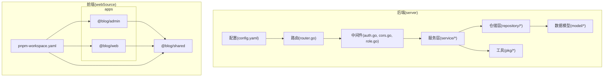
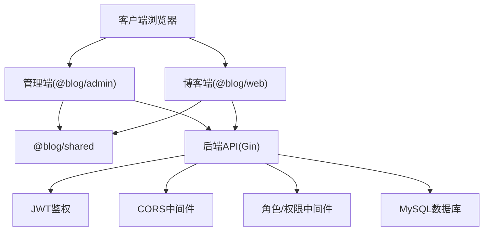
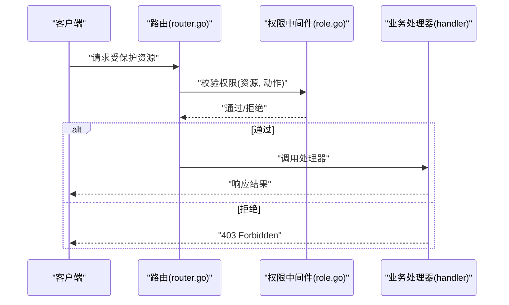
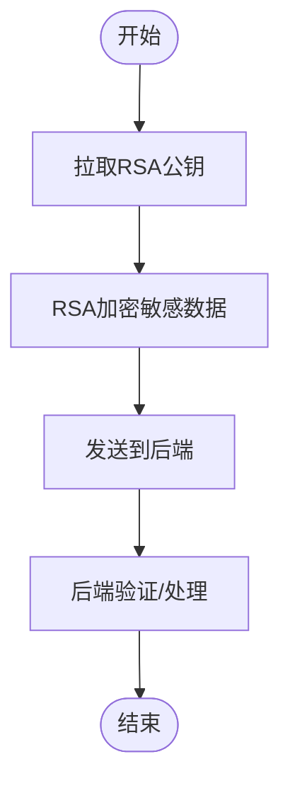
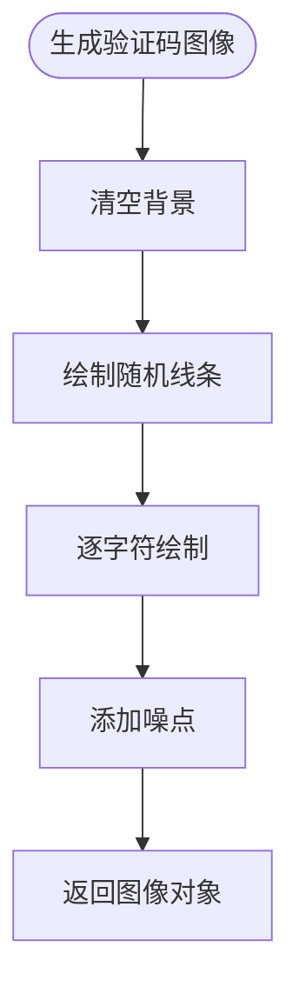
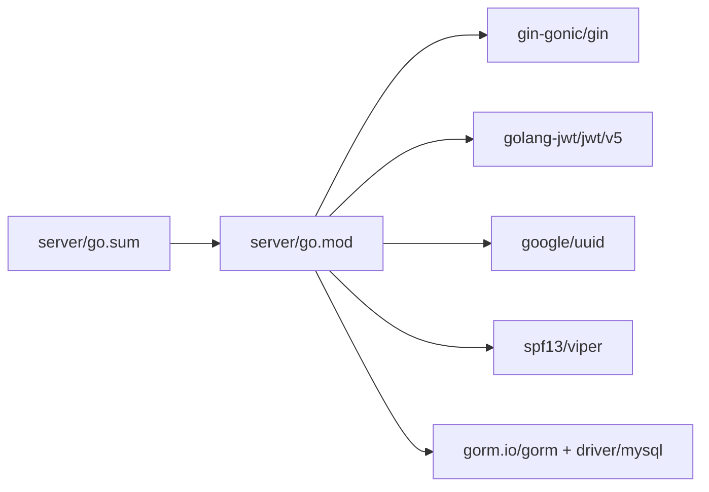

# 代码质量保证

<cite>
**本文引用的文件**
- [server/go.mod](file://server/go.mod)
- [server/go.sum](file://server/go.sum)
- [server/config/config.yaml](file://server/config/config.yaml)
- [.gitignore](file://.gitignore)
- [webSource/package.json](file://webSource/package.json)
- [webSource/apps/admin/package.json](file://webSource/apps/admin/package.json)
- [webSource/apps/blog/package.json](file://webSource/apps/blog/package.json)
- [webSource/packages/shared/package.json](file://webSource/packages/shared/package.json)
- [webSource/pnpm-workspace.yaml](file://webSource/pnpm-workspace.yaml)
- [server/router/router.go](file://server/router/router.go)
- [server/internal/pkg/hash.go](file://server/internal/pkg/hash.go)
- [webSource/packages/shared/src/utils/crypto.ts](file://webSource/packages/shared/src/utils/crypto.ts)
- [server/internal/pkg/captcha.go](file://server/internal/pkg/captcha.go)
</cite>

## 目录
1. [简介](#简介)
2. [项目结构](#项目结构)
3. [核心组件](#核心组件)
4. [架构总览](#架构总览)
5. [详细组件分析](#详细组件分析)
6. [依赖分析](#依赖分析)
7. [性能考虑](#性能考虑)
8. [故障排查指南](#故障排查指南)
9. [结论](#结论)
10. [附录](#附录)

## 简介
本文件面向Xiangmuzs博客平台，系统化构建代码质量保证体系，覆盖后端Go与前端TypeScript生态的质量基线，包括：
- 静态代码分析工具（gofmt、go vet、golint）的集成与落地
- 安全扫描（依赖漏洞与敏感信息检测）策略
- 复杂度分析与重构建议（圈复杂度与代码异味）
- 代码审查流程与标准（PR模板与审查清单）
- 持续集成中的质量门禁（覆盖率与质量评分）
- 代码风格指南与最佳实践（命名、错误处理、注释）
- 自动化质量检查（GitHub Actions工作流与质量报告）

## 项目结构
项目采用前后端分离与多包工作区组织：
- 后端：Go模块，集中于server目录，包含配置、路由、中间件、模型、仓储、服务、工具包等
- 前端：基于pnpm workspaces的monorepo，包含admin管理端、blog展示端与shared共享库
- 构建与脚本：根级package.json统一编排前端构建与后端编译，并复制配置文件

图表来源
- [server/config/config.yaml:1-29](file://server/config/config.yaml#L1-L29)
- [server/router/router.go:78-103](file://server/router/router.go#L78-L103)
- [webSource/pnpm-workspace.yaml:1-4](file://webSource/pnpm-workspace.yaml#L1-L4)

章节来源
- [server/go.mod:1-60](file://server/go.mod#L1-L60)
- [webSource/package.json:1-22](file://webSource/package.json#L1-L22)
- [webSource/pnpm-workspace.yaml:1-4](file://webSource/pnpm-workspace.yaml#L1-L4)

## 核心组件
- 配置管理：后端通过YAML配置集中管理服务器端口、数据库连接、JWT密钥、上传路径与大小、博客基础URL等
- 路由与权限：路由中对资源操作进行权限校验，体现最小权限与细粒度控制
- 安全工具：密码哈希采用bcrypt；RSA公钥拉取与加密在前端实现；验证码生成含噪声与随机性
- 包管理：Go模块与pnpm工作区分别管理后端与前端依赖，确保版本一致性与可复现构建

章节来源
- [server/config/config.yaml:1-29](file://server/config/config.yaml#L1-L29)
- [server/router/router.go:78-103](file://server/router/router.go#L78-L103)
- [server/internal/pkg/hash.go:1-13](file://server/internal/pkg/hash.go#L1-L13)
- [webSource/packages/shared/src/utils/crypto.ts:1-23](file://webSource/packages/shared/src/utils/crypto.ts#L1-L23)
- [server/internal/pkg/captcha.go:64-138](file://server/internal/pkg/captcha.go#L64-L138)

## 架构总览
后端以Gin框架为核心，结合Viper读取配置、GORM访问MySQL、JWT鉴权与权限中间件；前端采用React + Vite，共享库封装通用类型与工具。

图表来源
- [server/router/router.go:78-103](file://server/router/router.go#L78-L103)
- [server/config/config.yaml:1-29](file://server/config/config.yaml#L1-L29)
- [webSource/apps/admin/package.json:1-28](file://webSource/apps/admin/package.json#L1-L28)
- [webSource/apps/blog/package.json:1-30](file://webSource/apps/blog/package.json#L1-L30)
- [webSource/packages/shared/package.json:1-23](file://webSource/packages/shared/package.json#L1-L23)

## 详细组件分析

### 组件A：认证与权限中间件
- 权限校验：在路由层对各资源操作（如二维码审批、角色管理、用户管理）进行权限校验
- 最小权限：仅授权具备对应“create/update/read/delete”权限的用户执行相应操作
- 可扩展性：权限键位统一，便于新增资源与权限维度

图表来源
- [server/router/router.go:78-103](file://server/router/router.go#L78-L103)

章节来源
- [server/router/router.go:78-103](file://server/router/router.go#L78-L103)

### 组件B：密码哈希与RSA加密
- 密码安全：使用bcrypt进行哈希存储，避免明文或弱散列
- 前端加密：RSA公钥从后端接口动态拉取，加密敏感字段后再传输

图表来源
- [server/internal/pkg/hash.go:1-13](file://server/internal/pkg/hash.go#L1-L13)
- [webSource/packages/shared/src/utils/crypto.ts:1-23](file://webSource/packages/shared/src/utils/crypto.ts#L1-L23)

章节来源
- [server/internal/pkg/hash.go:1-13](file://server/internal/pkg/hash.go#L1-L13)
- [webSource/packages/shared/src/utils/crypto.ts:1-23](file://webSource/packages/shared/src/utils/crypto.ts#L1-L23)

### 组件C：验证码生成
- 图像噪声与字符绘制：包含随机线条、点阵噪声与字符绘制，提升抗机器识别能力
- 边界与颜色：使用颜色数组与随机偏移，增强视觉干扰

图表来源
- [server/internal/pkg/captcha.go:64-138](file://server/internal/pkg/captcha.go#L64-L138)

章节来源
- [server/internal/pkg/captcha.go:64-138](file://server/internal/pkg/captcha.go#L64-L138)

## 依赖分析
- Go模块依赖：后端使用Gin、JWT、UUID、Viper、GORM、MySQL驱动等，版本在go.mod与go.sum中明确
- 前端工作区：pnpm-workspace统一管理apps与packages，各应用独立脚本与依赖

图表来源
- [server/go.mod:1-60](file://server/go.mod#L1-L60)
- [server/go.sum:1-146](file://server/go.sum#L1-L146)

章节来源
- [server/go.mod:1-60](file://server/go.mod#L1-L60)
- [server/go.sum:1-146](file://server/go.sum#L1-L146)
- [webSource/pnpm-workspace.yaml:1-4](file://webSource/pnpm-workspace.yaml#L1-L4)

## 性能考虑
- 数据库连接与超时：建议在配置中增加连接池参数与查询超时，避免长事务阻塞
- 缓存策略：对热点配置与权限字典引入缓存，减少重复查询
- 前端构建：Vite按需加载与分包策略，配合pnpm monorepo减少重复依赖
- 日志与追踪：统一日志级别与上下文追踪ID，便于定位性能瓶颈

## 故障排查指南
- 配置问题：确认config.yaml中端口、数据库凭据、JWT密钥与上传路径正确
- 依赖冲突：核对go.mod与go.sum一致性；前端使用pnpm install同步锁文件
- 权限异常：检查路由权限键位是否与后端中间件一致
- 加密失败：确认RSA公钥接口可用且前端已成功缓存公钥

章节来源
- [server/config/config.yaml:1-29](file://server/config/config.yaml#L1-L29)
- [server/go.mod:1-60](file://server/go.mod#L1-L60)
- [server/go.sum:1-146](file://server/go.sum#L1-L146)
- [server/router/router.go:78-103](file://server/router/router.go#L78-L103)
- [webSource/packages/shared/src/utils/crypto.ts:1-23](file://webSource/packages/shared/src/utils/crypto.ts#L1-L23)

## 结论
通过建立完善的静态分析、安全扫描、复杂度与审查流程、CI质量门禁以及风格规范，Xiangmuzs博客平台可在功能演进的同时保持高质量与可维护性。建议逐步引入自动化工具链并在团队内推广最佳实践。

## 附录

### 静态代码分析工具集成方案
- Go后端
  - gofmt：统一格式化，作为提交前钩子
  - go vet：静态检查常见错误
  - golint：风格提示（可选），建议结合go fmt使用
- 前端
  - TypeScript：tsc --noEmit用于类型检查
  - Prettier：统一格式化，配合Git钩子

章节来源
- [webSource/package.json:14-15](file://webSource/package.json#L14-L15)
- [webSource/apps/admin/package.json](file://webSource/apps/admin/package.json#L9)
- [webSource/apps/blog/package.json](file://webSource/apps/blog/package.json#L9)
- [webSource/packages/shared/package.json](file://webSource/packages/shared/package.json#L13)

### 代码安全扫描
- 依赖漏洞扫描
  - Go：使用govulncheck或类似工具定期扫描
  - 前端：使用npm audit或类似工具
- 敏感信息检测
  - Git钩子：禁止提交包含密钥、Token等敏感内容
  - 配置文件：确保config.yaml不包含生产密钥，使用环境变量注入

章节来源
- [server/config/config.yaml:13-16](file://server/config/config.yaml#L13-L16)
- [.gitignore:1-15](file://.gitignore#L1-L15)

### 代码复杂度分析与重构建议
- 圈复杂度
  - 建议使用gocyclo或类似工具对函数与方法进行评估，设定阈值（如>10需拆分）
  - 对权限中间件与路由处理函数优先评估
- 代码异味
  - 过长函数：拆分为职责单一的小函数
  - 重复代码：抽象为公共工具或服务
  - 过深嵌套：提前返回与卫语句优化

章节来源
- [server/router/router.go:78-103](file://server/router/router.go#L78-L103)

### 代码审查流程与标准
- Pull Request模板
  - 变更摘要、影响范围、测试用例、风险评估、回滚预案
- 审查清单
  - 代码风格与静态分析通过
  - 安全扫描无高危项
  - 单元/集成测试覆盖关键路径
  - 配置与密钥未泄露
  - 文档与注释更新

### 持续集成质量门禁
- 测试覆盖率
  - Go：设定行覆盖率阈值（如≥70%），使用go test -coverprofile
  - 前端：类型检查通过，关键逻辑单元测试通过
- 质量评分
  - 使用SonarQube或CodeClimate对接CI，设定质量阈值与坏味道拦截

### 代码风格指南与最佳实践
- 命名规范
  - Go：驼峰命名，常量大写，接口以er/able结尾
  - TS：组件首字母大写，hooks以use开头，类型导出带前缀
- 错误处理
  - 明确错误传播与包装，避免吞错
- 注释要求
  - 公共API与复杂逻辑需有清晰注释

### 自动化质量检查（GitHub Actions）
- 工作流建议步骤
  - 检出代码 → 安装依赖 → 格式化检查（gofmt、Prettier）→ 类型检查（tsc）→ 静态分析（go vet、golint）→ 安全扫描（govulncheck、npm audit）→ 单测与覆盖率 → 构建产物与配置打包
- 报告生成
  - 将测试报告与覆盖率上传至CI平台，作为质量门禁依据