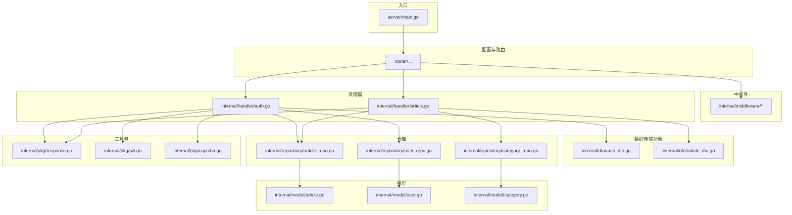
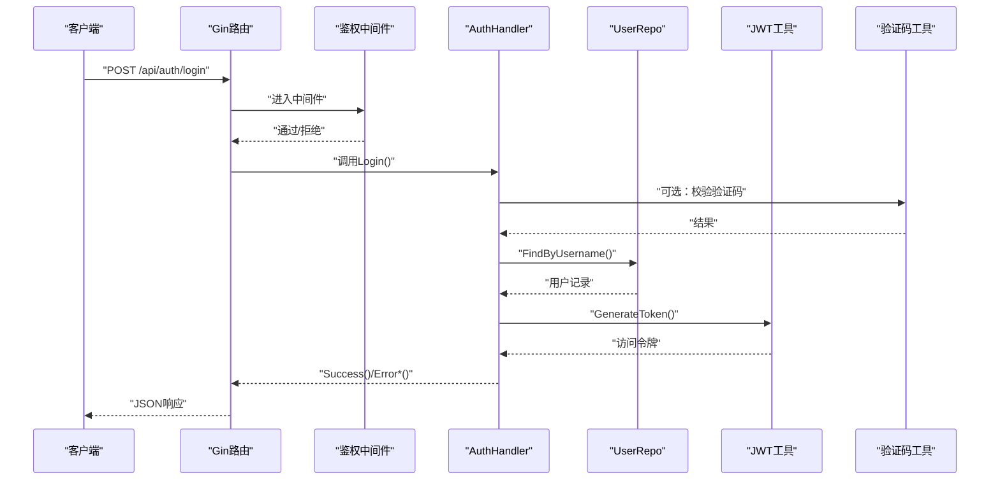
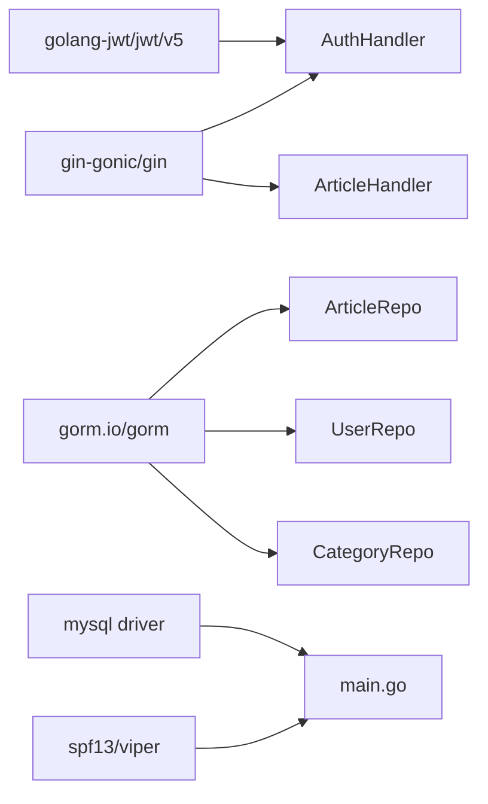

# 单元测试

<cite>
**本文引用的文件**
- [server/main.go](file://server/main.go)
- [server/go.mod](file://server/go.mod)
- [server/internal/handler/article.go](file://server/internal/handler/article.go)
- [server/internal/handler/auth.go](file://server/internal/handler/auth.go)
- [server/internal/repository/article_repo.go](file://server/internal/repository/article_repo.go)
- [server/internal/repository/user_repo.go](file://server/internal/repository/user_repo.go)
- [server/internal/repository/category_repo.go](file://server/internal/repository/category_repo.go)
- [server/internal/pkg/response.go](file://server/internal/pkg/response.go)
- [server/internal/pkg/jwt.go](file://server/internal/pkg/jwt.go)
- [server/internal/pkg/captcha.go](file://server/internal/pkg/captcha.go)
- [server/internal/middleware/auth.go](file://server/internal/middleware/auth.go)
- [server/internal/dto/auth_dto.go](file://server/internal/dto/auth_dto.go)
- [server/internal/dto/article_dto.go](file://server/internal/dto/article_dto.go)
- [server/internal/model/article.go](file://server/internal/model/article.go)
- [server/internal/model/user.go](file://server/internal/model/user.go)
- [server/internal/model/category.go](file://server/internal/model/category.go)
</cite>

## 目录
1. [引言](#引言)
2. [项目结构](#项目结构)
3. [核心组件](#核心组件)
4. [架构总览](#架构总览)
5. [详细组件分析](#详细组件分析)
6. [依赖分析](#依赖分析)
7. [性能考虑](#性能考虑)
8. [故障排查指南](#故障排查指南)
9. [结论](#结论)
10. [附录](#附录)

## 引言
本指南面向Xiangmuzs博客平台后端（Go）的单元测试实践，目标是帮助开发者系统地编写高质量的单元测试，覆盖Repository层、Service层（如存在）、Handler层与DTO/Model层，并提供Mock策略、断言方法、覆盖率要求与报告生成建议。文档同时给出针对文章管理、用户认证、分类管理等核心功能的具体测试思路与示例路径，便于快速落地。

## 项目结构
后端采用分层架构：入口程序负责配置加载、数据库连接、迁移与路由装配；内部模块按职责划分：dto（请求/响应模型）、handler（HTTP接口）、middleware（中间件）、model（ORM模型）、repository（数据访问）、service（业务服务）、pkg（通用工具），以及router与migration等。

图表来源
- [server/main.go:19-76](file://server/main.go#L19-L76)
- [server/internal/handler/auth.go:13-25](file://server/internal/handler/auth.go#L13-L25)
- [server/internal/handler/article.go:19-29](file://server/internal/handler/article.go#L19-L29)
- [server/internal/repository/article_repo.go:8-14](file://server/internal/repository/article_repo.go#L8-L14)
- [server/internal/repository/user_repo.go:8-22](file://server/internal/repository/user_repo.go#L8-L22)
- [server/internal/repository/category_repo.go:8-14](file://server/internal/repository/category_repo.go#L8-L14)
- [server/internal/pkg/response.go:22-69](file://server/internal/pkg/response.go#L22-L69)
- [server/internal/pkg/jwt.go:16-42](file://server/internal/pkg/jwt.go#L16-L42)
- [server/internal/pkg/captcha.go:24-58](file://server/internal/pkg/captcha.go#L24-L58)

章节来源
- [server/main.go:19-76](file://server/main.go#L19-L76)
- [server/go.mod:1-60](file://server/go.mod#L1-L60)

## 核心组件
- Handler层：封装HTTP接口，负责参数绑定、鉴权、调用仓库、返回统一响应。
- Repository层：封装GORM操作，提供数据持久化能力。
- DTO层：定义请求/响应结构体及校验规则。
- Model层：定义数据库表结构与关联关系。
- 工具包：统一响应格式、JWT令牌生成与解析、验证码生成与校验。
- 中间件：鉴权中间件从请求头解析令牌并注入上下文。

章节来源
- [server/internal/handler/article.go:19-29](file://server/internal/handler/article.go#L19-L29)
- [server/internal/handler/auth.go:13-25](file://server/internal/handler/auth.go#L13-L25)
- [server/internal/repository/article_repo.go:8-14](file://server/internal/repository/article_repo.go#L8-L14)
- [server/internal/repository/user_repo.go:8-22](file://server/internal/repository/user_repo.go#L8-L22)
- [server/internal/repository/category_repo.go:8-14](file://server/internal/repository/category_repo.go#L8-L14)
- [server/internal/pkg/response.go:22-69](file://server/internal/pkg/response.go#L22-L69)
- [server/internal/pkg/jwt.go:16-42](file://server/internal/pkg/jwt.go#L16-L42)
- [server/internal/pkg/captcha.go:24-58](file://server/internal/pkg/captcha.go#L24-L58)
- [server/internal/middleware/auth.go:10-37](file://server/internal/middleware/auth.go#L10-L37)

## 架构总览
下图展示了Handler到Repository再到Model的数据流，以及鉴权与响应封装的关键节点。

图表来源
- [server/internal/handler/auth.go:31-93](file://server/internal/handler/auth.go#L31-L93)
- [server/internal/repository/user_repo.go:24-28](file://server/internal/repository/user_repo.go#L24-L28)
- [server/internal/pkg/jwt.go:16-28](file://server/internal/pkg/jwt.go#L16-L28)
- [server/internal/pkg/captcha.go:48-58](file://server/internal/pkg/captcha.go#L48-L58)
- [server/internal/middleware/auth.go:10-37](file://server/internal/middleware/auth.go#L10-L37)
- [server/internal/pkg/response.go:22-69](file://server/internal/pkg/response.go#L22-L69)

## 详细组件分析

### Handler层单元测试策略
- 文章管理（ArticleHandler）
  - 覆盖点：列表查询、详情查询、创建、更新、删除、状态变更、公开接口（列表/按slug获取/搜索）。
  - 关键断言：HTTP状态码、响应体字段（code/message/data）、分页字段（list/total/page/page_size）。
  - Mock要点：Repository.List/FindByID/Update/Delete/Create/IncrementViewCount/ReplaceTags；TagRepo.FindByIDs。
- 用户认证（AuthHandler）
  - 覆盖点：获取公钥、登录（含验证码开关）、个人资料、修改密码。
  - 关键断言：登录成功时返回access_token与权限集合；失败时返回对应错误码与消息。
  - Mock要点：UserRepo.FindByUsername/FindByID、SettingRepo.Get、RSA解密、哈希校验、JWT生成、权限加载。

章节来源
- [server/internal/handler/article.go:31-324](file://server/internal/handler/article.go#L31-L324)
- [server/internal/handler/auth.go:27-162](file://server/internal/handler/auth.go#L27-L162)
- [server/internal/pkg/response.go:22-69](file://server/internal/pkg/response.go#L22-L69)

### Repository层单元测试策略
- 文章仓库（ArticleRepo）
  - 覆盖点：Create/Update/FindByID/FindBySlug/Delete/List/IncrementViewCount/ReplaceTags/CountByStatus/TotalViewCount。
  - 关键断言：查询条件（status/category/tag/keyword）、预加载（Author/Category/Tags）、排序与分页、计数正确性。
- 用户仓库（UserRepo）
  - 覆盖点：FindByUsername/FindByID/Create/Update/DeleteByID/List。
- 分类仓库（CategoryRepo）
  - 覆盖点：Create/Update/Delete（含外键约束检查）、FindByID/List/Count。

章节来源
- [server/internal/repository/article_repo.go:16-90](file://server/internal/repository/article_repo.go#L16-L90)
- [server/internal/repository/user_repo.go:24-65](file://server/internal/repository/user_repo.go#L24-L65)
- [server/internal/repository/category_repo.go:16-50](file://server/internal/repository/category_repo.go#L16-L50)

### DTO与Model层单元测试策略
- DTO（auth_dto.go、article_dto.go）
  - 覆盖点：必填字段、格式校验（邮箱、枚举值）、绑定规则。
  - 断言：结合Gin的ShouldBind/ShouldBindQuery进行边界与异常场景验证。
- Model（article.go、user.go、category.go）
  - 覆盖点：字段长度、索引、默认值、关联关系（HasOne/HasMany/Many2Many）。
  - 断言：GORM标签语义与数据库行为一致性。

章节来源
- [server/internal/dto/auth_dto.go:3-38](file://server/internal/dto/auth_dto.go#L3-L38)
- [server/internal/dto/article_dto.go:3-43](file://server/internal/dto/article_dto.go#L3-L43)
- [server/internal/model/article.go:5-23](file://server/internal/model/article.go#L5-L23)
- [server/internal/model/user.go:5-16](file://server/internal/model/user.go#L5-L16)
- [server/internal/model/category.go:5-14](file://server/internal/model/category.go#L5-L14)

### 工具包单元测试策略
- 统一响应（response.go）
  - 覆盖点：Success/SuccessPage/Error系列函数输出结构是否符合约定。
- JWT（jwt.go）
  - 覆盖点：GenerateToken/PackClaims、ParseToken有效性与过期校验。
- 验证码（captcha.go）
  - 覆盖点：生成与校验流程、过期逻辑、存储并发安全。

章节来源
- [server/internal/pkg/response.go:22-69](file://server/internal/pkg/response.go#L22-L69)
- [server/internal/pkg/jwt.go:16-42](file://server/internal/pkg/jwt.go#L16-L42)
- [server/internal/pkg/captcha.go:24-58](file://server/internal/pkg/captcha.go#L24-L58)

### 中间件单元测试策略
- 鉴权中间件（middleware/auth.go）
  - 覆盖点：无头、格式错误、无效/过期令牌、成功注入user_id/role_id。

章节来源
- [server/internal/middleware/auth.go:10-37](file://server/internal/middleware/auth.go#L10-L37)

## 依赖分析
- 外部依赖：gin、gorm、jwt、viper、mysql驱动等。
- 内部耦合：Handler依赖Repository；Repository依赖GORM DB；工具包被Handler与中间件共享。
- 可能的循环依赖：当前结构清晰，未见循环导入。

图表来源
- [server/go.mod:5-12](file://server/go.mod#L5-L12)
- [server/internal/handler/auth.go:13-25](file://server/internal/handler/auth.go#L13-L25)
- [server/internal/handler/article.go:19-29](file://server/internal/handler/article.go#L19-L29)
- [server/internal/repository/article_repo.go:8-14](file://server/internal/repository/article_repo.go#L8-L14)
- [server/internal/repository/user_repo.go:8-22](file://server/internal/repository/user_repo.go#L8-L22)
- [server/internal/repository/category_repo.go:8-14](file://server/internal/repository/category_repo.go#L8-L14)
- [server/main.go:13-16](file://server/main.go#L13-L16)

章节来源
- [server/go.mod:1-60](file://server/go.mod#L1-L60)
- [server/main.go:19-76](file://server/main.go#L19-L76)

## 性能考虑
- 测试中尽量使用内存数据库或轻量级替代（如sqlmock）以减少I/O开销。
- 对高频调用的仓库方法（如列表/计数）进行压力与边界测试，避免N+1查询与不必要的预加载。
- 使用基准测试（Benchmark）对关键路径（如JWT生成/解析、验证码生成）进行性能评估。

## 故障排查指南
- 响应结构不一致
  - 检查统一响应封装与HTTP状态码映射，确保所有错误路径均返回标准结构。
- 鉴权失败
  - 确认中间件是否正确设置user_id/role_id；检查令牌签名与有效期；核对权限加载逻辑。
- 数据库异常
  - 核查仓库方法的错误返回与事务处理；对外键约束的删除逻辑进行专项测试。
- 验证码问题
  - 核查生成与校验流程、过期时间与并发安全。

章节来源
- [server/internal/pkg/response.go:43-69](file://server/internal/pkg/response.go#L43-L69)
- [server/internal/middleware/auth.go:10-37](file://server/internal/middleware/auth.go#L10-L37)
- [server/internal/pkg/captcha.go:48-58](file://server/internal/pkg/captcha.go#L48-L58)

## 结论
通过明确分层职责、合理Mock策略与统一断言规范，可以高效构建覆盖全面的单元测试体系。建议优先保证Handler与Repository的核心路径测试，再逐步扩展到Service层（如存在）与工具包测试，并持续关注覆盖率与性能表现。

## 附录

### Go测试框架与命名规范
- 测试文件命名：以 _test.go 结尾，例如 repository_test.go。
- 测试函数命名：TestXxx，首字母大写，描述具体行为，例如 TestArticleRepo_Create。
- 并发安全：使用 t.Parallel() 提升并行度，但需确保资源隔离（如独立数据库实例或事务回滚）。

### 测试数据准备与断言方法
- 使用表驱动测试（table-driven tests）组织多场景输入与期望输出。
- 断言建议：
  - HTTP响应：状态码、响应体结构、分页字段。
  - 数据库：查询结果数量、字段值、索引与约束。
  - 工具函数：输入输出一致性、边界值与异常路径。
- 常用断言库：github.com/stretchr/testify（assert、require、mock）。

### Mock对象创建与使用（重点：Repository层）
- 方案一：手写Mock
  - 在测试中实现与真实仓库相同的接口，注入到Handler构造函数。
  - 示例路径参考：[server/internal/repository/article_repo.go:8-14](file://server/internal/repository/article_repo.go#L8-L14)
- 方案二：使用第三方Mock框架
  - 使用 github.com/stretchr/testify/mock 生成Mock对象，替换Handler中的真实仓库实例。
  - 注入方式：在测试构造阶段传入Mock实例，避免影响生产代码。

章节来源
- [server/internal/repository/article_repo.go:8-14](file://server/internal/repository/article_repo.go#L8-L14)

### Handler层单元测试策略（HTTP请求模拟与响应验证）
- 请求模拟
  - 使用 net/http/httptest 包构造 *http.Request 与 *httptest.ResponseRecorder。
  - 或使用 github.com/gin-gonic/gin/test 封装的测试工具。
- 响应验证
  - 断言HTTP状态码与JSON结构，使用 JSONPath 或结构化解析。
  - 统一响应结构参考：[server/internal/pkg/response.go:22-69](file://server/internal/pkg/response.go#L22-L69)

章节来源
- [server/internal/pkg/response.go:22-69](file://server/internal/pkg/response.go#L22-L69)

### Service层业务逻辑测试最佳实践
- 边界条件
  - 列表查询：空结果、分页边界、排序字段、过滤条件组合。
  - 认证：用户名不存在、密码错误、账户禁用、验证码错误。
- 异常场景
  - 数据库错误、外键约束、重复唯一键、空指针访问。
- 建议
  - 将复杂业务拆分为纯函数，便于独立测试。
  - 使用事务包装测试用例，失败时回滚。

### 测试覆盖率要求与报告生成
- 覆盖率目标
  - 仓库层：≥80%
  - 处理器层：≥70%
  - 工具包层：≥90%
- 报告生成
  - 使用 go test -coverprofile=coverage.out ./...
  - 使用 go tool cover -html=coverage.out -o coverage.html 生成HTML报告
  - 使用 go tool cover -func=coverage.out 查看函数级覆盖率

### 具体测试用例示例（示例路径）
- 文章管理
  - 创建文章：断言创建成功、默认状态、内容类型默认值、标签关联。
    - 示例路径：[server/internal/handler/article.go:87-129](file://server/internal/handler/article.go#L87-L129)
  - 更新文章：断言更新字段、标签替换、状态变更逻辑。
    - 示例路径：[server/internal/handler/article.go:131-168](file://server/internal/handler/article.go#L131-L168)
  - 删除文章：断言删除成功、关联清理。
    - 示例路径：[server/internal/handler/article.go:170-177](file://server/internal/handler/article.go#L170-L177)
  - 公开接口：按slug访问、浏览量递增、搜索关键词。
    - 示例路径：[server/internal/handler/article.go:206-313](file://server/internal/handler/article.go#L206-L313)
- 用户认证
  - 登录：成功/失败、验证码开关、禁用账户、RSA解密。
    - 示例路径：[server/internal/handler/auth.go:31-93](file://server/internal/handler/auth.go#L31-L93)
  - 修改密码：旧密码校验、新密码哈希、更新成功。
    - 示例路径：[server/internal/handler/auth.go:120-162](file://server/internal/handler/auth.go#L120-L162)
- 分类管理
  - 创建/更新/删除：删除前检查文章数量、外键约束。
    - 示例路径：[server/internal/repository/category_repo.go:16-32](file://server/internal/repository/category_repo.go#L16-L32)
  - 列表/计数：排序、总数统计。
    - 示例路径：[server/internal/repository/category_repo.go:40-50](file://server/internal/repository/category_repo.go#L40-L50)