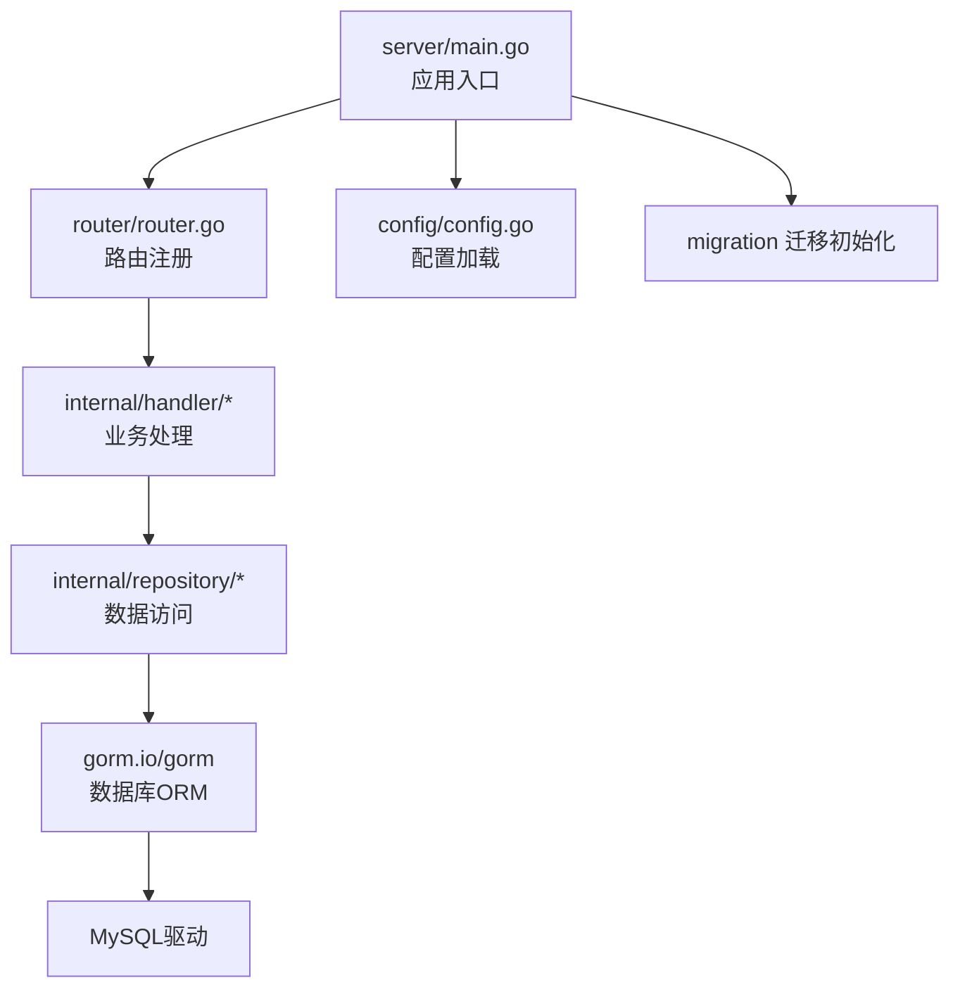
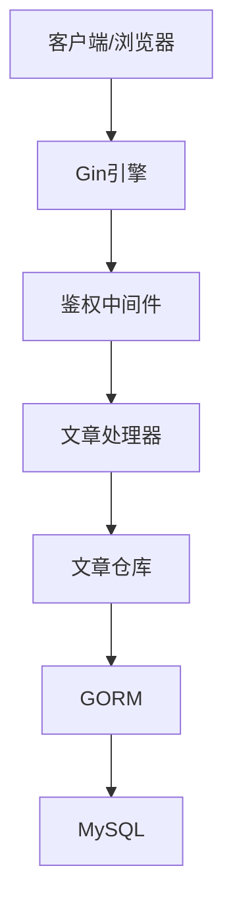
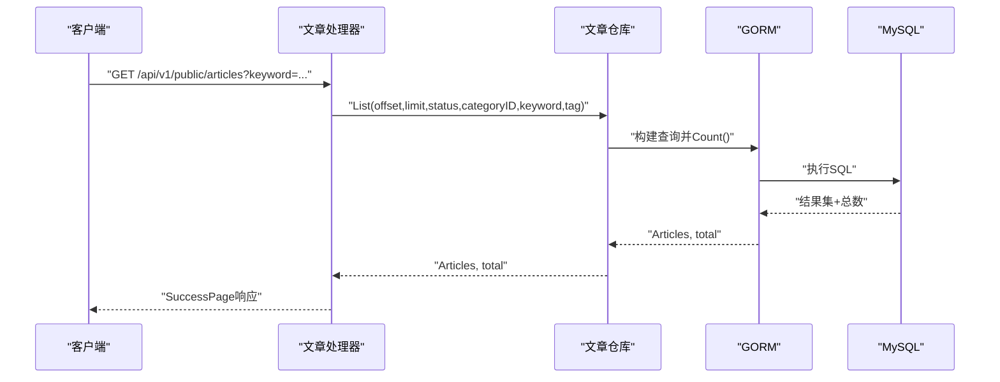
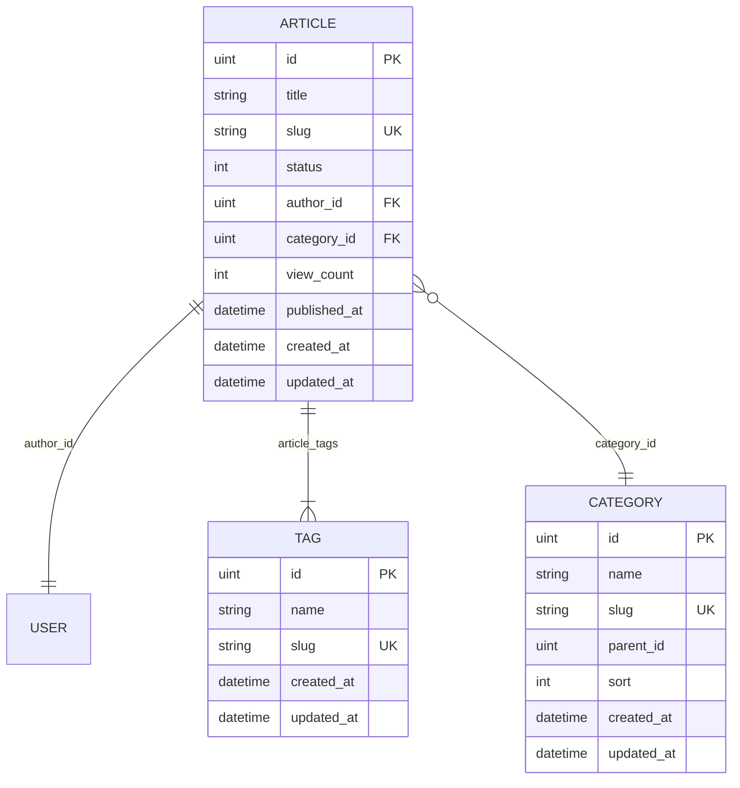
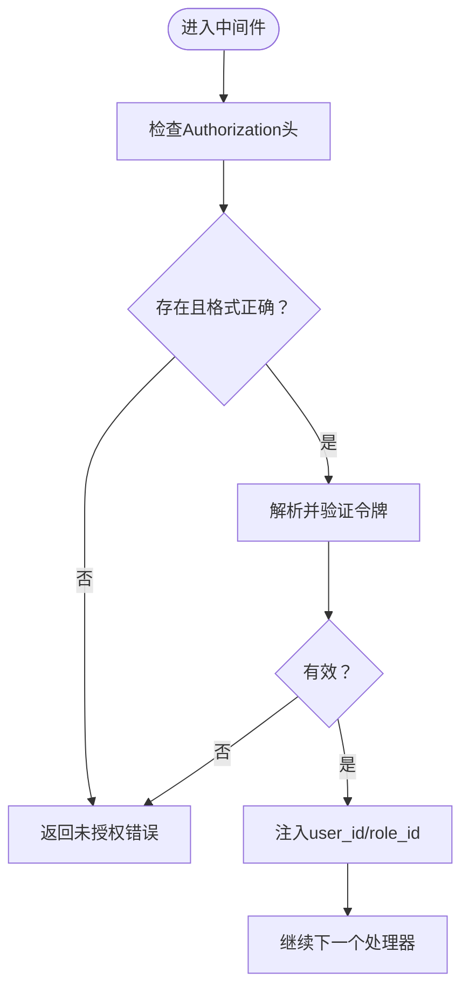
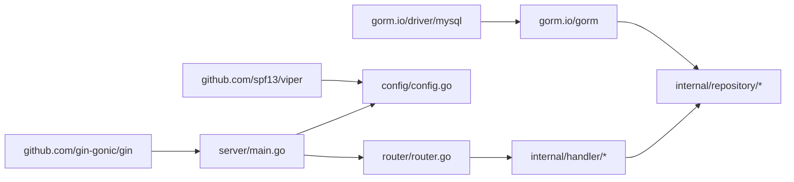

# 性能测试

<cite>
**本文引用的文件**
- [server/main.go](file://server/main.go)
- [server/go.mod](file://server/go.mod)
- [server/config/config.go](file://server/config/config.go)
- [server/config/config.yaml](file://server/config/config.yaml)
- [server/router/router.go](file://server/router/router.go)
- [server/internal/handler/article.go](file://server/internal/handler/article.go)
- [server/internal/repository/article_repo.go](file://server/internal/repository/article_repo.go)
- [server/internal/repository/category_repo.go](file://server/internal/repository/category_repo.go)
- [server/internal/repository/tag_repo.go](file://server/internal/repository/tag_repo.go)
- [server/internal/model/article.go](file://server/internal/model/article.go)
- [server/internal/model/category.go](file://server/internal/model/category.go)
- [server/internal/model/tag.go](file://server/internal/model/tag.go)
- [server/internal/middleware/auth.go](file://server/internal/middleware/auth.go)
- [server/internal/pkg/response.go](file://server/internal/pkg/response.go)
- [server/internal/dto/common.go](file://server/internal/dto/common.go)
- [server/internal/dto/article_dto.go](file://server/internal/dto/article_dto.go)
</cite>

## 目录
1. [简介](#简介)
2. [项目结构](#项目结构)
3. [核心组件](#核心组件)
4. [架构总览](#架构总览)
5. [详细组件分析](#详细组件分析)
6. [依赖分析](#依赖分析)
7. [性能考虑](#性能考虑)
8. [故障排查指南](#故障排查指南)
9. [结论](#结论)
10. [附录](#附录)

## 简介
本指南面向Xiangmuzs博客平台的性能测试与优化，围绕以下目标展开：  
- 负载测试：并发用户模拟、请求频率控制、响应时间监控  
- 压力测试：数据库连接池、内存与CPU占用分析  
- 基准与回归：关键API性能指标设定与回归测试流程  
- 瓶颈识别与优化：数据库查询、缓存策略、代码层面优化  
- 工具链：Go内置测试与基准、第三方分析工具  
- 典型场景：高并发文章浏览、批量数据导入、复杂查询优化  
- 结果分析与报告：指标采集、可视化与报告模板

## 项目结构
后端基于Gin框架与GORM，采用分层设计（路由、处理器、中间件、仓库、模型、DTO、通用包）。  
- 启动入口负责加载配置、连接数据库、初始化迁移、设置路由与中间件，并启动HTTP服务。  
- 路由定义公开与鉴权两类接口，公开接口用于博客前端展示，鉴权接口用于管理后台。  
- 处理器调用仓库执行数据访问，仓库通过GORM进行SQL操作。  
- 配置模块提供服务器、数据库、JWT、上传与博客基础URL等配置项。

图表来源
- [server/main.go:19-76](file://server/main.go#L19-L76)
- [server/router/router.go:11-103](file://server/router/router.go#L11-L103)

章节来源
- [server/main.go:19-76](file://server/main.go#L19-L76)
- [server/go.mod:1-60](file://server/go.mod#L1-60)
- [server/config/config.go:47-64](file://server/config/config.go#L47-L64)
- [server/config/config.yaml:1-29](file://server/config/config.yaml#L1-L29)
- [server/router/router.go:11-103](file://server/router/router.go#L11-L103)

## 核心组件
- 应用入口与配置：负责读取YAML配置、连接数据库、初始化RSA密钥、设置Gin模式与静态资源、注册路由并启动服务。  
- 路由与中间件：统一前缀/api/v1，公开路由无需鉴权；鉴权路由使用中间件校验JWT并注入用户上下文。  
- 文章处理器与仓库：实现文章列表、详情、搜索、浏览量自增等逻辑；支持按状态、分类、标签、关键词过滤；预加载作者、分类、标签关联数据。  
- DTO与模型：定义分页查询、文章请求体、文章状态请求、文章模型及关联字段；模型包含索引与约束以支撑查询性能。  
- 响应封装：统一封装成功与错误响应，便于测试中对返回码与结构进行断言。

章节来源
- [server/main.go:19-76](file://server/main.go#L19-L76)
- [server/config/config.go:7-43](file://server/config/config.go#L7-L43)
- [server/config/config.yaml:1-29](file://server/config/config.yaml#L1-L29)
- [server/router/router.go:11-103](file://server/router/router.go#L11-L103)
- [server/internal/handler/article.go:19-325](file://server/internal/handler/article.go#L19-L325)
- [server/internal/repository/article_repo.go:8-91](file://server/internal/repository/article_repo.go#L8-L91)
- [server/internal/model/article.go:5-23](file://server/internal/model/article.go#L5-L23)
- [server/internal/dto/common.go:3-21](file://server/internal/dto/common.go#L3-L21)
- [server/internal/dto/article_dto.go:3-44](file://server/internal/dto/article_dto.go#L3-L44)
- [server/internal/pkg/response.go:9-70](file://server/internal/pkg/response.go#L9-L70)

## 架构总览
下图展示了从客户端到数据库的关键路径，以及鉴权与预加载对性能的影响。

图表来源
- [server/router/router.go:11-103](file://server/router/router.go#L11-L103)
- [server/internal/middleware/auth.go:10-37](file://server/internal/middleware/auth.go#L10-L37)
- [server/internal/handler/article.go:19-325](file://server/internal/handler/article.go#L19-L325)
- [server/internal/repository/article_repo.go:8-91](file://server/internal/repository/article_repo.go#L8-L91)

## 详细组件分析

### 文章处理器与仓库：性能关键点
- 列表查询：支持状态、分类、关键词、标签过滤，使用预加载关联作者、分类、标签；分页偏移与限制需结合索引与LIMIT优化。  
- 按Slug查询：单条记录查找并自增浏览量，注意并发下的原子性更新。  
- 搜索：标题与摘要模糊匹配，需评估LIKE索引与全文检索方案。  
- 关联替换：文章标签的多对多替换，涉及中间表写入，批量导入时应合并事务以降低开销。

图表来源
- [server/internal/handler/article.go:293-313](file://server/internal/handler/article.go#L293-L313)
- [server/internal/repository/article_repo.go:41-69](file://server/internal/repository/article_repo.go#L41-L69)

章节来源
- [server/internal/handler/article.go:206-257](file://server/internal/handler/article.go#L206-L257)
- [server/internal/handler/article.go:259-291](file://server/internal/handler/article.go#L259-L291)
- [server/internal/handler/article.go:293-313](file://server/internal/handler/article.go#L293-L313)
- [server/internal/repository/article_repo.go:41-74](file://server/internal/repository/article_repo.go#L41-L74)

### 数据模型与索引：查询性能基础
- 文章模型包含状态与发布时间的复合索引，有利于筛选已发布内容与排序。  
- 分类与标签模型具备唯一索引的Slug字段，适合高并发查找。  
- 文章与作者、分类、标签的关联关系在查询时被预加载，减少N+1查询风险。

图表来源
- [server/internal/model/article.go:5-23](file://server/internal/model/article.go#L5-L23)
- [server/internal/model/category.go:5-14](file://server/internal/model/category.go#L5-L14)
- [server/internal/model/tag.go:5-11](file://server/internal/model/tag.go#L5-L11)

章节来源
- [server/internal/model/article.go:5-23](file://server/internal/model/article.go#L5-L23)
- [server/internal/model/category.go:5-14](file://server/internal/model/category.go#L5-L14)
- [server/internal/model/tag.go:5-11](file://server/internal/model/tag.go#L5-L11)

### 鉴权中间件与响应封装：测试可测性
- 鉴权中间件解析Authorization头并校验令牌，失败时直接返回未授权错误，便于测试断言。  
- 统一响应封装了成功与各类错误码，测试可用断言返回码与Message字段。

图表来源
- [server/internal/middleware/auth.go:10-37](file://server/internal/middleware/auth.go#L10-L37)
- [server/internal/pkg/response.go:43-69](file://server/internal/pkg/response.go#L43-L69)

章节来源
- [server/internal/middleware/auth.go:10-37](file://server/internal/middleware/auth.go#L10-L37)
- [server/internal/pkg/response.go:22-41](file://server/internal/pkg/response.go#L22-L41)

## 依赖分析
- 语言与框架：Go 1.22、Gin Web框架、GORM ORM、MySQL驱动。  
- 配置管理：Viper读取YAML配置，支持运行时覆盖。  
- 依赖耦合：处理器依赖仓库接口，仓库依赖GORM DB；路由依赖处理器实例化；中间件依赖通用包与JWT解析。

图表来源
- [server/go.mod:5-12](file://server/go.mod#L5-L12)
- [server/main.go:3-16](file://server/main.go#L3-L16)
- [server/config/config.go:47-64](file://server/config/config.go#L47-L64)

章节来源
- [server/go.mod:1-60](file://server/go.mod#L1-L60)
- [server/main.go:3-16](file://server/main.go#L3-L16)
- [server/config/config.go:47-64](file://server/config/config.go#L47-L64)

## 性能考虑

### 负载测试实施
- 并发用户模拟：使用压测工具（如wrk、JMeter、k6）针对公开文章列表、详情、搜索接口构造并发场景。  
- 请求频率控制：从低QPS逐步提升至峰值，观察P95/P99延迟与错误率拐点。  
- 响应时间监控：关注接口平均响应、P50/P90/P95/P99，区分数据库耗时与序列化耗时。  
- 场景建议：
  - 高并发文章浏览：GET /api/v1/public/articles 与 GET /api/v1/public/articles/:slug  
  - 搜索压力：GET /api/v1/public/articles/search?keyword=...  
  - 分类/标签侧栏：GET /api/v1/categories 与 GET /api/v1/tags  

章节来源
- [server/router/router.go:26-42](file://server/router/router.go#L26-L42)
- [server/internal/handler/article.go:206-257](file://server/internal/handler/article.go#L206-L257)
- [server/internal/handler/article.go:259-291](file://server/internal/handler/article.go#L259-L291)
- [server/internal/handler/article.go:293-313](file://server/internal/handler/article.go#L293-L313)

### 压力测试设计
- 数据库连接池：调整最大打开连接数与空闲连接数，观察连接池饱和与等待时间。  
- 内存与CPU：结合pprof与系统监控，定位热点函数与GC压力。  
- 场景建议：
  - 批量数据导入：POST /api/v1/articles + 标签批量关联，评估事务与索引写入成本  
  - 复杂查询：带条件组合的列表查询，评估索引命中与排序成本  

章节来源
- [server/internal/handler/article.go:87-129](file://server/internal/handler/article.go#L87-L129)
- [server/internal/repository/article_repo.go:76-78](file://server/internal/repository/article_repo.go#L76-L78)

### 基准与回归测试
- 关键API基准：使用Go测试基准（-bench）对高频接口进行微基准，如文章列表、详情、浏览量自增。  
- 指标设定：定义每秒请求数、平均/分位延迟、错误率阈值、内存分配次数与字节数。  
- 回归流程：每次变更后运行基准与负载脚本，对比历史基线，发现回归立即阻断发布。  

章节来源
- [server/internal/handler/article.go:77-85](file://server/internal/handler/article.go#L77-L85)
- [server/internal/repository/article_repo.go:72-74](file://server/internal/repository/article_repo.go#L72-L74)

### 瓶颈识别与优化策略
- 数据库查询：
  - 为常用过滤字段（状态、分类、标签、关键词）建立复合索引，避免全表扫描  
  - 使用预加载减少N+1查询，但注意关联数据大小，必要时分页或懒加载  
  - 将COUNT与主查询分离，避免重复扫描  
- 缓存策略：
  - 对热门文章详情与列表做只读缓存，设置合理TTL与失效策略  
  - 分类/标签列表作为静态数据可常驻缓存  
- 代码优化：
  - 减少不必要的字符串拼接与正则处理  
  - 合理使用事务批量写入，避免短事务频繁提交  
  - 控制响应体大小，避免大字段冗余传输  

章节来源
- [server/internal/repository/article_repo.go:41-69](file://server/internal/repository/article_repo.go#L41-L69)
- [server/internal/handler/article.go:315-324](file://server/internal/handler/article.go#L315-L324)

### 性能测试工具
- Go内置工具：go test -bench=. -run=^$，结合pprof生成CPU/内存剖析  
- 第三方工具：k6/wrk/JMeter用于高并发场景；Prometheus+Grafana监控生产态指标  
- 日志与追踪：开启GORM日志（调试模式）辅助定位慢查询；结合分布式追踪定位跨服务延迟  

章节来源
- [server/main.go:36-44](file://server/main.go#L36-L44)
- [server/config/config.go:47-64](file://server/config/config.go#L47-L64)

### 典型性能测试场景
- 高并发文章浏览：模拟大量用户同时访问文章列表与详情，观察延迟与吞吐变化  
- 批量数据导入：构造大量文章与标签，验证导入流程的吞吐与稳定性  
- 复杂查询优化：组合状态、分类、标签、关键词的查询，评估索引与分页策略  

章节来源
- [server/internal/handler/article.go:206-257](file://server/internal/handler/article.go#L206-L257)
- [server/internal/handler/article.go:293-313](file://server/internal/handler/article.go#L293-L313)
- [server/internal/repository/article_repo.go:41-69](file://server/internal/repository/article_repo.go#L41-L69)

### 测试结果分析与报告
- 指标采集：记录QPS、延迟分布、错误率、数据库连接池使用率、CPU/内存占用  
- 可视化：使用Grafana仪表盘展示关键指标随时间的变化趋势  
- 报告模板：包含场景描述、环境配置、基线数据、回归对比、优化建议与后续计划  

## 故障排查指南
- 认证失败：检查Authorization头格式与令牌有效性，确认中间件是否正确注入用户上下文。  
- 数据库连接异常：核对DSN配置与网络连通性，检查连接池参数与慢查询日志。  
- 响应异常：利用统一响应封装的错误码快速定位问题类型（参数、未授权、内部错误）。  
- 性能退化：启用pprof定位热点函数，结合数据库慢查询分析索引与执行计划。  

章节来源
- [server/internal/middleware/auth.go:10-37](file://server/internal/middleware/auth.go#L10-L37)
- [server/internal/pkg/response.go:43-69](file://server/internal/pkg/response.go#L43-L69)
- [server/main.go:27-44](file://server/main.go#L27-L44)

## 结论
通过明确的测试场景、完善的指标体系与持续的回归流程，可在开发与运维阶段及时发现并解决性能问题。建议优先优化数据库索引与查询路径，配合合理的缓存与限流策略，在保证用户体验的同时提升系统的稳定与扩展性。

## 附录
- 配置项参考：服务器端口与模式、数据库连接、JWT密钥与过期、上传路径与类型、博客基础URL  
- 路由清单：公开路由（无需鉴权）、鉴权路由（CRUD与管理接口）  
- 关键模型：文章、分类、标签及其关联关系与索引设计  

章节来源
- [server/config/config.yaml:1-29](file://server/config/config.yaml#L1-L29)
- [server/router/router.go:26-102](file://server/router/router.go#L26-L102)
- [server/internal/model/article.go:5-23](file://server/internal/model/article.go#L5-L23)
- [server/internal/model/category.go:5-14](file://server/internal/model/category.go#L5-L14)
- [server/internal/model/tag.go:5-11](file://server/internal/model/tag.go#L5-L11)