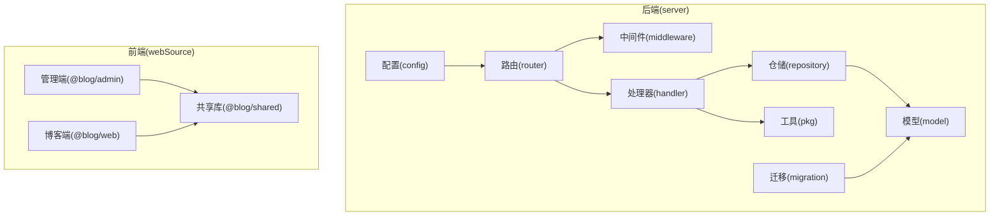
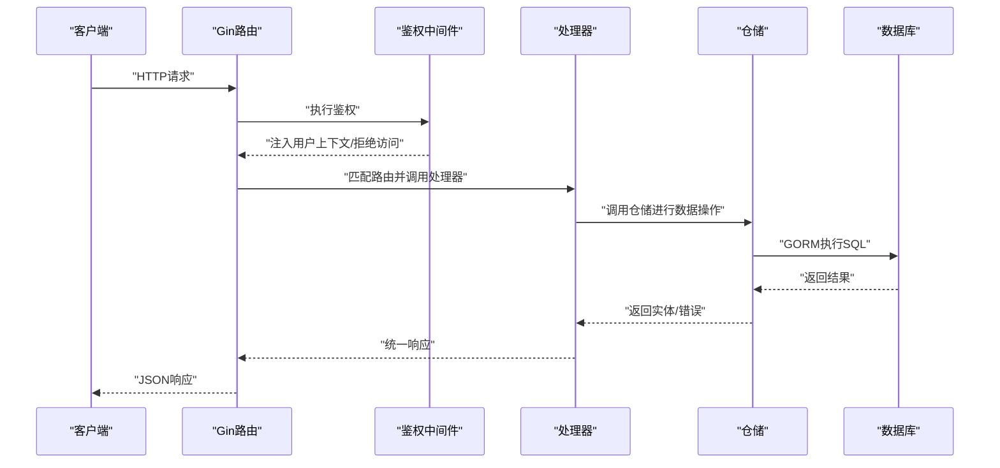
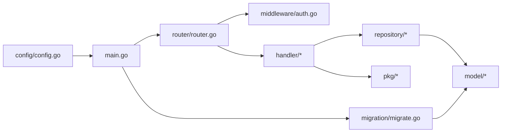

# 测试策略与质量保证

<cite>
**本文引用的文件**
- [server/go.mod](file://server/go.mod)
- [server/main.go](file://server/main.go)
- [server/config/config.go](file://server/config/config.go)
- [server/router/router.go](file://server/router/router.go)
- [server/internal/handler/auth.go](file://server/internal/handler/auth.go)
- [server/internal/handler/user.go](file://server/internal/handler/user.go)
- [server/internal/middleware/auth.go](file://server/internal/middleware/auth.go)
- [server/internal/repository/user_repo.go](file://server/internal/repository/user_repo.go)
- [server/internal/model/user.go](file://server/internal/model/user.go)
- [server/internal/pkg/response.go](file://server/internal/pkg/response.go)
- [server/internal/pkg/jwt.go](file://server/internal/pkg/jwt.go)
- [server/migration/migrate.go](file://server/migration/migrate.go)
- [webSource/package.json](file://webSource/package.json)
- [webSource/apps/admin/package.json](file://webSource/apps/admin/package.json)
- [webSource/apps/blog/package.json](file://webSource/apps/blog/package.json)
</cite>

## 目录
1. [引言](#引言)
2. [项目结构](#项目结构)
3. [核心组件](#核心组件)
4. [架构总览](#架构总览)
5. [详细组件分析](#详细组件分析)
6. [依赖分析](#依赖分析)
7. [性能考虑](#性能考虑)
8. [故障排查指南](#故障排查指南)
9. [结论](#结论)
10. [附录](#附录)

## 引言
本指南面向Xiangmuzs博客平台，提供从单元测试、集成测试到端到端测试的完整测试策略与质量保证方案。内容覆盖Go后端测试框架与Mock对象、测试覆盖率要求、数据库与API测试策略、测试数据管理与清理、性能与负载测试、代码质量检查工具（静态分析、安全扫描、复杂度分析）、持续集成中的测试自动化配置以及测试报告与质量门禁设置。

## 项目结构
后端采用Go语言与Gin框架，按领域分层组织：配置、路由、中间件、处理器、仓储、模型、服务与工具包。前端采用Vite+React多包工作区，分别构建管理端与博客端应用。整体结构清晰，便于分层测试与隔离。

图表来源
- [server/main.go:19-76](file://server/main.go#L19-L76)
- [server/router/router.go:11-103](file://server/router/router.go#L11-L103)
- [server/config/config.go:47-64](file://server/config/config.go#L47-L64)
- [server/migration/migrate.go:13-38](file://server/migration/migrate.go#L13-L38)
- [webSource/package.json:1-22](file://webSource/package.json#L1-L22)

章节来源
- [server/main.go:19-76](file://server/main.go#L19-L76)
- [server/router/router.go:11-103](file://server/router/router.go#L11-L103)
- [server/config/config.go:47-64](file://server/config/config.go#L47-L64)
- [server/migration/migrate.go:13-38](file://server/migration/migrate.go#L13-L38)
- [webSource/package.json:1-22](file://webSource/package.json#L1-L22)

## 核心组件
- 配置加载：通过Viper加载YAML配置，支持服务器端口、模式、数据库连接、JWT密钥、上传路径与博客基础URL等。
- 路由与中间件：统一挂载CORS，按权限组划分公开与受保护接口；鉴权中间件解析Bearer Token并注入用户上下文。
- 处理器层：封装业务请求校验、调用仓储、返回统一响应格式；涉及登录、用户管理、文章、分类、标签、媒体、二维码、角色与设置等模块。
- 仓储层：基于GORM实现CRUD与分页查询，负责与数据库交互。
- 工具包：统一响应体、JWT签发与解析、RSA加解密、密码哈希等。
- 迁移与种子：自动迁移模型并初始化权限、角色与管理员账户。

章节来源
- [server/config/config.go:7-43](file://server/config/config.go#L7-L43)
- [server/router/router.go:11-103](file://server/router/router.go#L11-L103)
- [server/internal/middleware/auth.go:10-37](file://server/internal/middleware/auth.go#L10-L37)
- [server/internal/handler/auth.go:13-93](file://server/internal/handler/auth.go#L13-L93)
- [server/internal/handler/user.go:13-146](file://server/internal/handler/user.go#L13-L146)
- [server/internal/repository/user_repo.go:8-66](file://server/internal/repository/user_repo.go#L8-L66)
- [server/internal/pkg/response.go:9-70](file://server/internal/pkg/response.go#L9-L70)
- [server/internal/pkg/jwt.go:10-43](file://server/internal/pkg/jwt.go#L10-L43)
- [server/migration/migrate.go:13-126](file://server/migration/migrate.go#L13-L126)

## 架构总览
下图展示从客户端到后端的典型请求链路，包括鉴权、路由、处理器、仓储与数据库交互。

图表来源
- [server/router/router.go:11-103](file://server/router/router.go#L11-L103)
- [server/internal/middleware/auth.go:10-37](file://server/internal/middleware/auth.go#L10-L37)
- [server/internal/handler/auth.go:31-93](file://server/internal/handler/auth.go#L31-L93)
- [server/internal/repository/user_repo.go:24-65](file://server/internal/repository/user_repo.go#L24-L65)

## 详细组件分析

### 单元测试策略与覆盖率要求
- 测试框架与命令
  - 使用标准库testing与testify辅助断言，建议在每个包内以_test.go命名进行单元测试。
  - 建议在CI中使用覆盖率收集与阈值控制，例如对关键包设置最低覆盖率阈值（如60%-80%），并在PR中阻断低于阈值的合并。
- Mock对象与依赖注入
  - 对处理器依赖的仓储接口进行抽象，使用接口注入方式替换真实仓储，以便在单元测试中注入Mock仓储。
  - 对JWT与RSA工具函数进行包装或注入，避免直接依赖全局状态与配置。
- 典型测试场景
  - 登录处理器：验证参数校验、验证码开关、RSA解密、密码校验、Token生成与权限加载。
  - 用户处理器：验证分页查询、创建用户（含RSA解密与密码哈希）、更新用户（条件字段更新）、删除用户（禁止自删）。
  - 中间件：验证缺失/错误格式的Authorization头、无效或过期Token的处理。
- 覆盖率目标
  - 关键业务逻辑（处理器、仓储、工具包）覆盖率不低于70%，核心路径不低于80%。
  - 对错误分支与边界条件进行充分覆盖（空输入、越界、重复键、权限不足等）。

章节来源
- [server/internal/handler/auth.go:31-93](file://server/internal/handler/auth.go#L31-L93)
- [server/internal/handler/user.go:41-146](file://server/internal/handler/user.go#L41-L146)
- [server/internal/middleware/auth.go:10-37](file://server/internal/middleware/auth.go#L10-L37)
- [server/internal/repository/user_repo.go:24-65](file://server/internal/repository/user_repo.go#L24-L65)
- [server/internal/pkg/jwt.go:16-42](file://server/internal/pkg/jwt.go#L16-L42)

### 集成测试设计
- 数据库测试
  - 使用独立的测试数据库实例或容器化MySQL，确保测试隔离与可重复性。
  - 在测试前执行迁移，插入最小化种子数据（如默认角色、权限与管理员用户），测试后清理或回滚事务。
  - 针对处理器的数据库交互进行集成测试，覆盖CRUD与关联查询。
- API测试
  - 使用HTTP客户端（如Go net/http/httptest或第三方库）对路由进行端到端测试。
  - 覆盖公开接口与受保护接口，验证鉴权中间件、权限中间件与统一响应格式。
  - 对敏感操作（创建、更新、删除）进行权限不足与资源不存在的错误场景测试。
- 端到端测试（可选）
  - 结合前端应用，使用端到端测试框架（如Playwright/Cypress）模拟真实用户流程（登录、文章管理、媒体上传等）。
  - 将后端与前端打包部署至测试环境，确保跨域、静态资源与上传目录可用。

章节来源
- [server/migration/migrate.go:13-126](file://server/migration/migrate.go#L13-L126)
- [server/router/router.go:26-102](file://server/router/router.go#L26-L102)
- [server/internal/pkg/response.go:22-69](file://server/internal/pkg/response.go#L22-L69)

### 测试数据管理与清理
- 测试数据库配置
  - 通过环境变量或独立的测试配置文件指定测试数据库DSN，避免污染开发/生产数据。
  - 在CI中使用容器化数据库，启动即迁移，关闭即销毁。
- 数据清理策略
  - 每个测试用例结束后回滚事务或删除新增记录；批量测试时使用事务包裹，失败回滚。
  - 对于需要持久化的种子数据（如默认角色、权限），在测试套件开始时写入，结束时清理，避免重复写入导致冲突。

章节来源
- [server/config/config.go:20-27](file://server/config/config.go#L20-L27)
- [server/migration/migrate.go:13-38](file://server/migration/migrate.go#L13-L38)

### 性能测试与负载测试
- 接口级性能测试
  - 使用压测工具（如wrk、vegeta或Go内置的net/http/httptest）对高频接口（登录、文章列表、搜索）进行并发与吞吐测试。
  - 关注P95/P99延迟、错误率与资源占用（CPU、内存、连接池）。
- 数据库性能
  - 针对分页查询、关联查询与高并发写入场景进行压力测试，观察索引命中与锁竞争。
- 前端性能
  - 使用浏览器开发者工具与Lighthouse检测首屏时间、交互延迟与资源加载；结合CDN与缓存策略优化静态资源。

章节来源
- [server/router/router.go:32-42](file://server/router/router.go#L32-L42)
- [server/internal/handler/auth.go:27-93](file://server/internal/handler/auth.go#L27-L93)

### 代码质量检查工具
- 静态分析
  - Go：golangci-lint（启用错误检查、未使用变量、复杂度与导入循环检查）。
  - 前端：ESLint（TypeScript规则）、Prettier（格式化）。
- 安全扫描
  - 依赖漏洞：govulncheck（Go）、npm audit（Node）。
  - 代码审计：SonarQube或CodeQL（GitHub）。
- 复杂度分析
  - 圈复杂度与函数长度：golangci-lint与SonarQube指标；对超过阈值的函数进行重构。
- 规范与风格
  - 统一提交信息、分支策略与PR模板；强制通过预提交钩子（husky + lint-staged）执行格式化与基础检查。

章节来源
- [server/go.mod:5-13](file://server/go.mod#L5-L13)
- [webSource/package.json:14-15](file://webSource/package.json#L14-L15)
- [webSource/apps/admin/package.json:9](file://webSource/apps/admin/package.json#L9)
- [webSource/apps/blog/package.json:9](file://webSource/apps/blog/package.json#L9)

### 持续集成中的测试自动化
- 构建与测试流水线
  - 后端：编译Go二进制、运行单元测试与覆盖率、执行集成测试（容器化数据库）、生成覆盖率报告。
  - 前端：安装依赖、类型检查、构建共享库与两个应用、复制后端配置文件。
- 质量门禁
  - 设置覆盖率阈值、静态分析告警阈值与安全漏洞阈值；任何不达标项阻断合并。
- 缓存与加速
  - 缓存Go与Node依赖，复用容器镜像，减少CI时间。

章节来源
- [webSource/package.json:4-16](file://webSource/package.json#L4-L16)
- [server/main.go:11-16](file://server/main.go#L11-L16)

### 测试报告生成与质量门禁
- 报告格式
  - 单元测试：Junit XML（用于CI可视化）；覆盖率：Clover或Cobertura格式。
  - 集成测试：HTML报告或JSON日志，包含响应码分布、平均延迟与错误详情。
- 质量门禁
  - 覆盖率：整体与关键包不低于阈值；分支覆盖不低于阈值。
  - 失败即阻断：测试失败、覆盖率不足、安全漏洞或静态分析严重问题均阻止合并。

章节来源
- [server/internal/pkg/response.go:22-69](file://server/internal/pkg/response.go#L22-L69)

## 依赖分析
后端依赖关系清晰，遵循分层与依赖倒置原则：路由依赖中间件与处理器；处理器依赖仓储；仓储依赖GORM；工具包提供通用能力；迁移负责模型与种子数据。

图表来源
- [server/router/router.go:11-103](file://server/router/router.go#L11-L103)
- [server/internal/middleware/auth.go:10-37](file://server/internal/middleware/auth.go#L10-L37)
- [server/internal/handler/auth.go:13-25](file://server/internal/handler/auth.go#L13-L25)
- [server/internal/repository/user_repo.go:8-22](file://server/internal/repository/user_repo.go#L8-L22)
- [server/migration/migrate.go:13-38](file://server/migration/migrate.go#L13-L38)
- [server/config/config.go:47-64](file://server/config/config.go#L47-L64)
- [server/main.go:19-76](file://server/main.go#L19-L76)

章节来源
- [server/router/router.go:11-103](file://server/router/router.go#L11-L103)
- [server/internal/middleware/auth.go:10-37](file://server/internal/middleware/auth.go#L10-L37)
- [server/internal/handler/auth.go:13-25](file://server/internal/handler/auth.go#L13-L25)
- [server/internal/repository/user_repo.go:8-22](file://server/internal/repository/user_repo.go#L8-L22)
- [server/migration/migrate.go:13-38](file://server/migration/migrate.go#L13-L38)
- [server/config/config.go:47-64](file://server/config/config.go#L47-L64)
- [server/main.go:19-76](file://server/main.go#L19-L76)

## 性能考虑
- 并发与限流
  - Gin默认并发友好；建议在网关或反向代理层配置限流与熔断，防止突发流量击穿后端。
- 数据库优化
  - 为高频查询字段建立索引；分页查询使用覆盖索引；避免N+1查询（Preload/Joins合理使用）。
- 缓存策略
  - 对热点配置与只读数据进行缓存；对JWT公钥与验证码可采用短期缓存。
- 日志与监控
  - 记录关键链路耗时与错误统计；结合APM（如Prometheus+Grafana）观测端到端延迟。

## 故障排查指南
- 常见错误定位
  - 参数校验失败：检查处理器绑定与DTO定义；确认请求体与查询参数格式。
  - 鉴权失败：核对Authorization头格式、Token签名与过期时间；检查JWT密钥配置。
  - 数据库异常：确认迁移是否完成、连接串是否正确、事务是否正确提交/回滚。
- 统一响应与错误码
  - 使用统一响应体，便于前端与测试一致处理；对不同HTTP状态映射到明确的错误消息。
- 日志与追踪
  - 在中间件与处理器中记录请求ID与关键步骤，便于定位问题。

章节来源
- [server/internal/pkg/response.go:43-69](file://server/internal/pkg/response.go#L43-L69)
- [server/internal/middleware/auth.go:12-31](file://server/internal/middleware/auth.go#L12-L31)
- [server/internal/handler/auth.go:33-77](file://server/internal/handler/auth.go#L33-L77)

## 结论
通过分层清晰的架构与完善的测试策略，Xiangmuzs博客平台可在快速迭代的同时保持高质量与稳定性。建议优先完善单元与集成测试，建立严格的覆盖率与质量门禁，并在CI中自动化执行，持续提升交付效率与可靠性。

## 附录
- 测试清单
  - 单元测试：处理器、仓储、工具包关键路径与边界条件。
  - 集成测试：路由、鉴权、权限中间件、数据库CRUD与分页。
  - 性能测试：高并发登录、文章列表与搜索接口。
  - 安全扫描：依赖漏洞与静态代码分析。
  - 质量门禁：覆盖率阈值、错误与安全告警阈值。