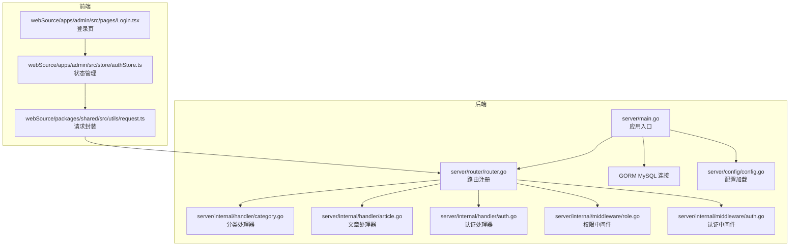
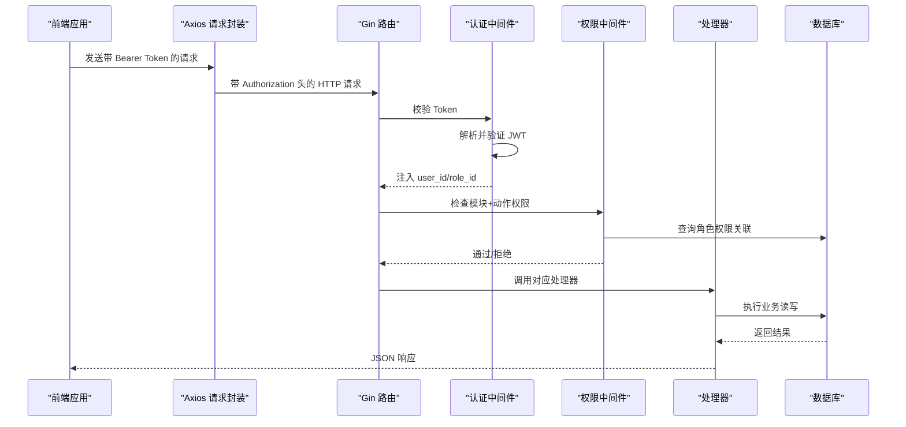
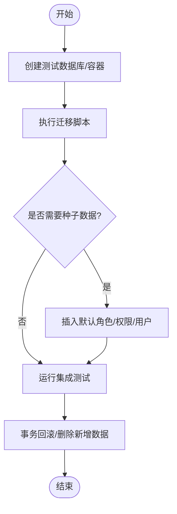
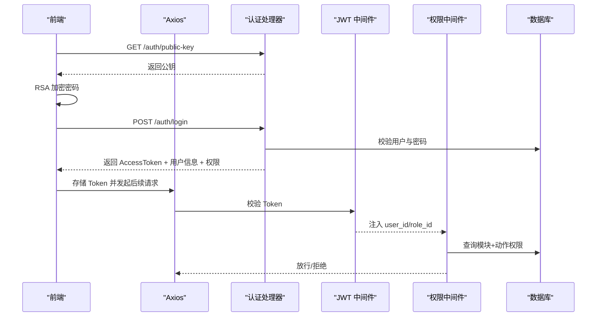
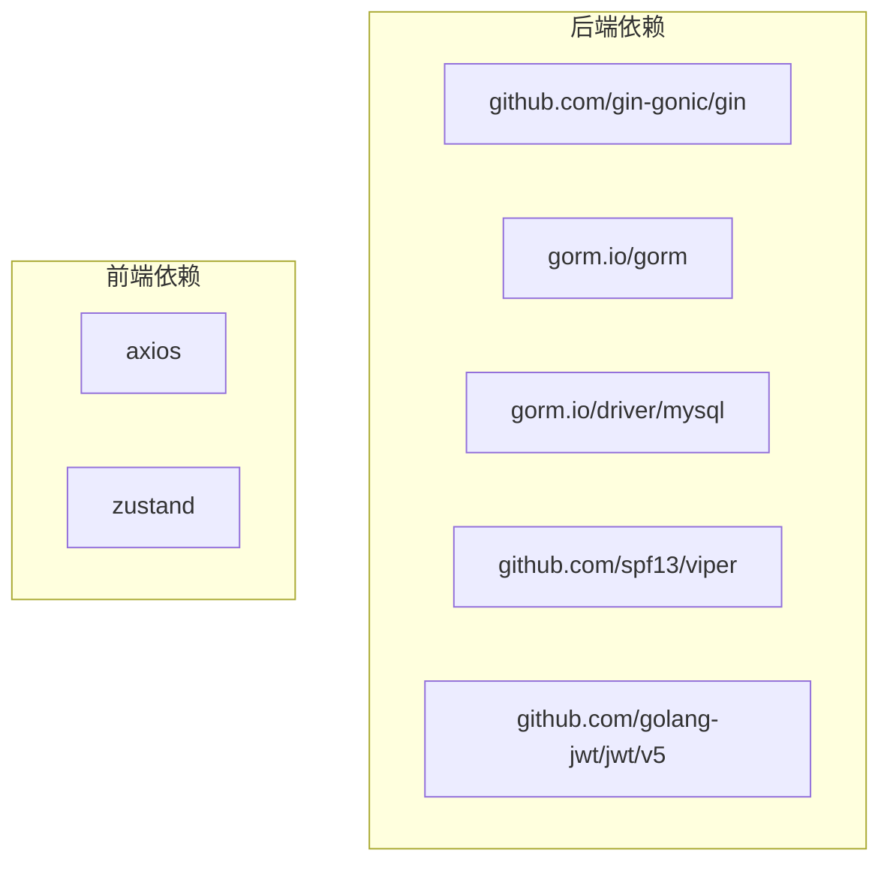

# 集成测试

<cite>
**本文引用的文件**
- [server/main.go](file://server/main.go)
- [server/config/config.go](file://server/config/config.go)
- [server/migration/migrate.go](file://server/migration/migrate.go)
- [server/router/router.go](file://server/router/router.go)
- [server/internal/middleware/auth.go](file://server/internal/middleware/auth.go)
- [server/internal/middleware/role.go](file://server/internal/middleware/role.go)
- [server/internal/handler/auth.go](file://server/internal/handler/auth.go)
- [server/internal/handler/article.go](file://server/internal/handler/article.go)
- [server/internal/handler/category.go](file://server/internal/handler/category.go)
- [server/go.mod](file://server/go.mod)
- [webSource/apps/admin/src/pages/Login.tsx](file://webSource/apps/admin/src/pages/Login.tsx)
- [webSource/packages/shared/src/utils/request.ts](file://webSource/packages/shared/src/utils/request.ts)
- [webSource/apps/admin/src/store/authStore.ts](file://webSource/apps/admin/src/store/authStore.ts)
</cite>

## 目录
1. [简介](#简介)
2. [项目结构](#项目结构)
3. [核心组件](#核心组件)
4. [架构总览](#架构总览)
5. [详细组件分析](#详细组件分析)
6. [依赖分析](#依赖分析)
7. [性能考虑](#性能考虑)
8. [故障排查指南](#故障排查指南)
9. [结论](#结论)
10. [附录](#附录)

## 简介
本文件为 Xiangmuzs 博客平台制定一套完整的集成测试策略，覆盖数据库集成测试与 API 集成测试两大方面。内容包括：
- 数据库集成测试：测试数据库的连接、迁移、种子数据、以及测试后数据清理策略
- API 集成测试：端到端请求测试与响应验证，涵盖认证与授权流程
- 测试流程：从数据库连接到业务逻辑执行再到数据持久化验证的完整闭环
- 环境隔离与测试数据管理：测试数据库与开发/生产数据库分离、测试数据隔离与回滚
- 认证与授权集成测试：基于 JWT 的登录、权限校验与资源访问控制
- 典型业务流程用例：用户登录、文章创建、分类管理等
- 失败调试与日志分析：常见问题定位与日志解读技巧

## 项目结构
后端采用 Go + Gin + GORM 架构，路由在统一入口注册；前端使用 React + Zustand + Axios，通过共享请求工具与后端交互。

图表来源
- [server/main.go:19-76](file://server/main.go#L19-L76)
- [server/config/config.go:47-64](file://server/config/config.go#L47-L64)
- [server/router/router.go:11-103](file://server/router/router.go#L11-L103)
- [server/internal/middleware/auth.go:10-37](file://server/internal/middleware/auth.go#L10-L37)
- [server/internal/middleware/role.go:10-42](file://server/internal/middleware/role.go#L10-L42)
- [server/internal/handler/auth.go:19-93](file://server/internal/handler/auth.go#L19-L93)
- [server/internal/handler/article.go:19-129](file://server/internal/handler/article.go#L19-L129)
- [server/internal/handler/category.go:15-89](file://server/internal/handler/category.go#L15-L89)
- [webSource/apps/admin/src/pages/Login.tsx:10-58](file://webSource/apps/admin/src/pages/Login.tsx#L10-L58)
- [webSource/packages/shared/src/utils/request.ts:5-37](file://webSource/packages/shared/src/utils/request.ts#L5-L37)
- [webSource/apps/admin/src/store/authStore.ts:15-50](file://webSource/apps/admin/src/store/authStore.ts#L15-L50)

章节来源
- [server/main.go:19-76](file://server/main.go#L19-L76)
- [server/router/router.go:11-103](file://server/router/router.go#L11-L103)

## 核心组件
- 应用入口与数据库连接：负责加载配置、建立数据库连接、执行迁移、初始化 RSA 密钥、设置路由与启动服务
- 路由与中间件：统一注册公开与受保护接口，注入认证与权限校验中间件
- 处理器层：实现具体业务逻辑（登录、文章、分类等）
- 前端请求封装：统一添加 Authorization 头、拦截 401 并跳转登录

章节来源
- [server/main.go:19-76](file://server/main.go#L19-L76)
- [server/router/router.go:11-103](file://server/router/router.go#L11-L103)
- [server/internal/middleware/auth.go:10-37](file://server/internal/middleware/auth.go#L10-L37)
- [server/internal/middleware/role.go:10-42](file://server/internal/middleware/role.go#L10-L42)
- [webSource/packages/shared/src/utils/request.ts:5-37](file://webSource/packages/shared/src/utils/request.ts#L5-L37)

## 架构总览
后端通过 Gin 注册路由，认证中间件负责解析 Authorization 头并校验 JWT，权限中间件根据模块与动作检查角色关联的权限。处理器层调用仓库层进行数据持久化，前端通过 Axios 统一发送请求并在本地存储 Token。

图表来源
- [server/internal/middleware/auth.go:10-37](file://server/internal/middleware/auth.go#L10-L37)
- [server/internal/middleware/role.go:10-42](file://server/internal/middleware/role.go#L10-L42)
- [server/router/router.go:44-102](file://server/router/router.go#L44-L102)
- [webSource/packages/shared/src/utils/request.ts:10-16](file://webSource/packages/shared/src/utils/request.ts#L10-L16)

## 详细组件分析

### 数据库集成测试策略
- 测试数据库准备
  - 使用独立的测试数据库实例或容器，避免与开发/生产数据库冲突
  - 在测试前清空或重建数据库，确保测试环境干净
- 迁移与种子数据
  - 在测试启动时运行迁移脚本，保证表结构一致
  - 可选择性地执行种子数据（如默认管理员、角色、权限），以便快速进入可用状态
- 数据清理
  - 测试结束后执行事务回滚或删除新增数据，保持数据库一致性
  - 对于外键约束导致的删除失败场景，需先清理子记录再删除父记录

图表来源
- [server/migration/migrate.go:13-38](file://server/migration/migrate.go#L13-L38)
- [server/migration/migrate.go:40-125](file://server/migration/migrate.go#L40-L125)

章节来源
- [server/migration/migrate.go:13-38](file://server/migration/migrate.go#L13-L38)
- [server/migration/migrate.go:40-125](file://server/migration/migrate.go#L40-L125)

### 认证与授权集成测试
- 登录流程
  - 获取公钥用于 RSA 加密密码
  - 可选：若启用验证码，先获取验证码 ID 与图片，提交验证码
  - 提交用户名与加密后的密码，获取 Access Token
  - 将 Token 写入本地存储，并在后续请求中携带 Authorization: Bearer
- 权限校验
  - 已登录用户访问受保护接口时，中间件会解析 Token 并注入用户与角色信息
  - 权限中间件根据模块与动作查询角色权限关联，无权限则返回 403
- 前端行为
  - 登录成功后保存 Token，后续请求自动附加 Authorization 头
  - 若收到 401，清除 Token 并跳转登录页

图表来源
- [server/internal/handler/auth.go:27-93](file://server/internal/handler/auth.go#L27-L93)
- [server/internal/middleware/auth.go:10-37](file://server/internal/middleware/auth.go#L10-L37)
- [server/internal/middleware/role.go:10-42](file://server/internal/middleware/role.go#L10-L42)
- [webSource/apps/admin/src/pages/Login.tsx:20-58](file://webSource/apps/admin/src/pages/Login.tsx#L20-L58)
- [webSource/packages/shared/src/utils/request.ts:10-16](file://webSource/packages/shared/src/utils/request.ts#L10-L16)

章节来源
- [server/internal/handler/auth.go:27-93](file://server/internal/handler/auth.go#L27-L93)
- [server/internal/middleware/auth.go:10-37](file://server/internal/middleware/auth.go#L10-L37)
- [server/internal/middleware/role.go:10-42](file://server/internal/middleware/role.go#L10-L42)
- [webSource/apps/admin/src/pages/Login.tsx:20-58](file://webSource/apps/admin/src/pages/Login.tsx#L20-L58)
- [webSource/packages/shared/src/utils/request.ts:10-16](file://webSource/packages/shared/src/utils/request.ts#L10-L16)

### API 集成测试设计
- 端到端请求测试
  - 使用 HTTP 客户端直接向后端发起请求，覆盖公开接口与受保护接口
  - 对于需要认证的接口，先完成登录流程获取 Token
- 响应验证
  - 校验状态码、响应体结构与关键字段
  - 对于分页接口，验证总数、页码与条目数量
- 典型场景
  - 文章列表与详情：公开与登录后访问差异
  - 分类增删改查：外键约束与删除保护
  - 设置与二维码：受权限控制的后台接口

章节来源
- [server/router/router.go:24-102](file://server/router/router.go#L24-L102)
- [server/internal/handler/article.go:31-291](file://server/internal/handler/article.go#L31-L291)
- [server/internal/handler/category.go:23-89](file://server/internal/handler/category.go#L23-L89)

### 典型业务流程用例

#### 用例一：用户登录与权限加载
- 步骤
  - 获取公钥
  - RSA 加密密码
  - 提交登录请求
  - 校验返回的用户信息与权限列表
- 断言
  - 状态码为成功
  - 响应包含 AccessToken、用户基础信息与权限数组
  - 后续受保护接口可正常访问

章节来源
- [server/internal/handler/auth.go:27-93](file://server/internal/handler/auth.go#L27-L93)
- [webSource/apps/admin/src/pages/Login.tsx:20-58](file://webSource/apps/admin/src/pages/Login.tsx#L20-L58)
- [webSource/packages/shared/src/utils/request.ts:10-16](file://webSource/packages/shared/src/utils/request.ts#L10-L16)

#### 用例二：文章创建与状态更新
- 步骤
  - 登录获取 Token
  - 调用创建文章接口，提交标题、内容、分类等
  - 更新文章状态为已发布（若需要）
- 断言
  - 创建成功并返回文章对象
  - 状态更新后返回最新状态与发布时间

章节来源
- [server/internal/handler/article.go:87-202](file://server/internal/handler/article.go#L87-L202)

#### 用例三：分类管理（增删改）
- 步骤
  - 登录并调用分类创建接口
  - 调用列表接口确认创建成功
  - 调用更新接口修改属性
  - 删除分类（若存在文章则拒绝删除）
- 断言
  - 创建/更新成功
  - 删除失败时返回合适的错误提示（如存在文章）

章节来源
- [server/internal/handler/category.go:32-89](file://server/internal/handler/category.go#L32-L89)

#### 用例四：权限控制（模块+动作）
- 步骤
  - 使用普通角色登录，尝试访问需要更高权限的接口
- 断言
  - 返回 403 且消息为“无权限”

章节来源
- [server/internal/middleware/role.go:10-42](file://server/internal/middleware/role.go#L10-L42)

## 依赖分析
- 后端依赖
  - Gin：Web 框架
  - GORM + MySQL Driver：ORM 与数据库驱动
  - Viper：配置管理
  - JWT：令牌处理
- 前端依赖
  - Axios：HTTP 客户端
  - Zustand：状态管理
  - RSA 加密：密码安全传输

图表来源
- [server/go.mod:5-12](file://server/go.mod#L5-L12)

章节来源
- [server/go.mod:5-12](file://server/go.mod#L5-L12)

## 性能考虑
- 数据库连接池与超时：合理设置连接数与查询超时，避免并发测试造成阻塞
- 迁移与种子数据：在测试启动阶段一次性完成，减少重复开销
- 前端请求拦截：统一处理 Token 与错误，避免重复逻辑影响性能
- 日志级别：集成测试阶段可降低日志级别以提升吞吐量

## 故障排查指南
- 数据库连接失败
  - 检查配置文件中的主机、端口、用户名、密码与字符集
  - 确认测试数据库已创建并允许连接
- 迁移失败
  - 查看迁移日志，确认模型定义与数据库版本兼容
  - 检查权限中间件是否正确注入 role_id
- 登录失败
  - 确认公钥获取与 RSA 加密流程
  - 校验用户是否存在且状态正常
- 权限不足
  - 检查角色是否具备相应模块+动作权限
  - 确认权限中间件已正确执行
- 前端 401 自动跳转
  - 检查本地存储中的 Token 是否存在
  - 确认请求头是否正确附加 Authorization

章节来源
- [server/config/config.go:47-64](file://server/config/config.go#L47-L64)
- [server/migration/migrate.go:13-38](file://server/migration/migrate.go#L13-L38)
- [server/internal/handler/auth.go:57-92](file://server/internal/handler/auth.go#L57-L92)
- [server/internal/middleware/role.go:20-31](file://server/internal/middleware/role.go#L20-L31)
- [webSource/packages/shared/src/utils/request.ts:18-35](file://webSource/packages/shared/src/utils/request.ts#L18-L35)

## 结论
通过明确的数据库集成测试策略与 API 集成测试流程，结合认证与授权的端到端验证，可以有效保障 Xiangmuzs 博客平台在复杂业务场景下的稳定性与一致性。建议在 CI/CD 中自动化执行这些测试，确保每次变更都能及时发现回归问题。

## 附录
- 测试环境变量建议
  - DATABASE_HOST/PORT/NAME/USER/PASSWORD/CHARSET
  - SERVER_MODE=debug（便于输出详细日志）
  - UPLOAD_PATH（上传目录路径）
- 建议的测试套件组织
  - 按功能模块划分：认证、文章、分类、媒体、角色与权限
  - 每个模块包含：前置条件（登录/种子数据）、正向用例、边界与异常用例