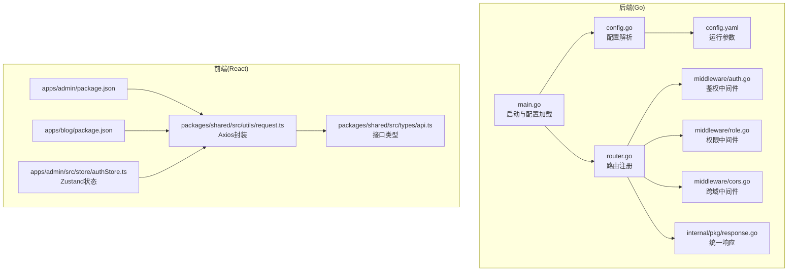
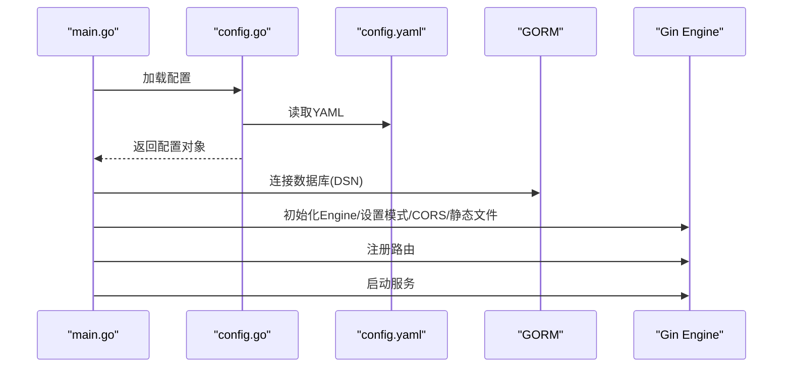
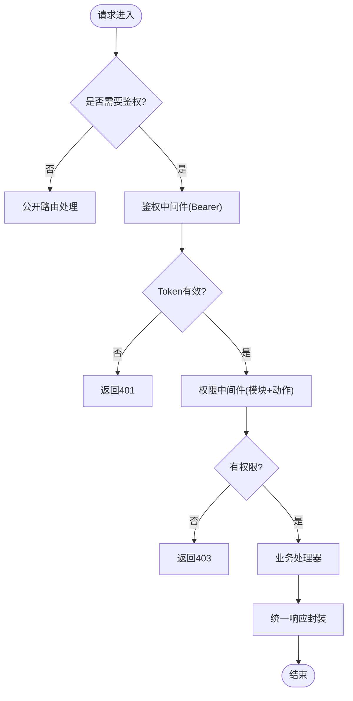
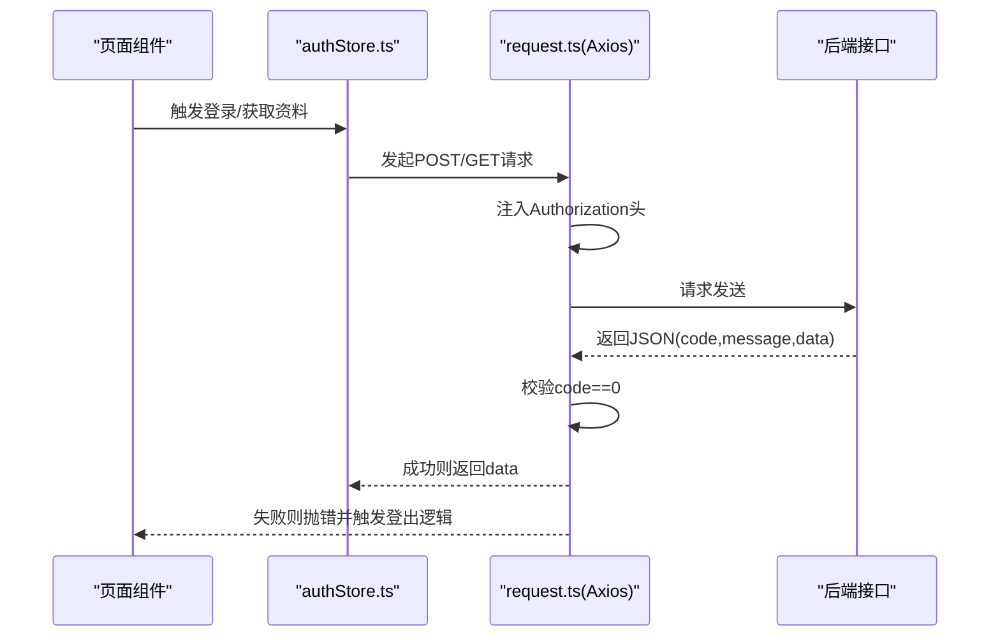
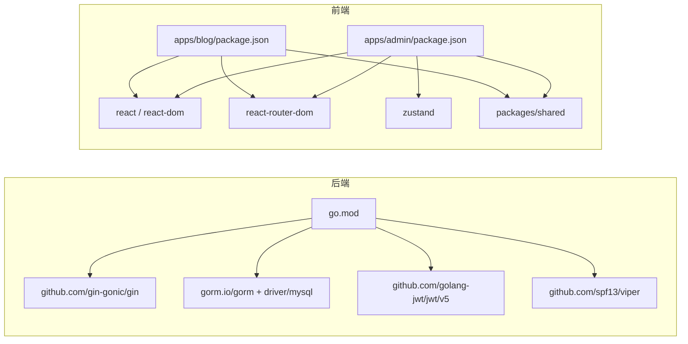

# 调试技巧与性能优化

<cite>
**本文引用的文件**
- [server/main.go](file://server/main.go)
- [server/go.mod](file://server/go.mod)
- [server/config/config.go](file://server/config/config.go)
- [server/config/config.yaml](file://server/config/config.yaml)
- [server/router/router.go](file://server/router/router.go)
- [server/internal/middleware/auth.go](file://server/internal/middleware/auth.go)
- [server/internal/middleware/cors.go](file://server/internal/middleware/cors.go)
- [server/internal/middleware/role.go](file://server/internal/middleware/role.go)
- [server/internal/pkg/response.go](file://server/internal/pkg/response.go)
- [webSource/apps/admin/package.json](file://webSource/apps/admin/package.json)
- [webSource/apps/blog/package.json](file://webSource/apps/blog/package.json)
- [webSource/packages/shared/src/utils/request.ts](file://webSource/packages/shared/src/utils/request.ts)
- [webSource/packages/shared/src/types/api.ts](file://webSource/packages/shared/src/types/api.ts)
- [webSource/apps/admin/src/store/authStore.ts](file://webSource/apps/admin/src/store/authStore.ts)
</cite>

## 目录
1. [简介](#简介)
2. [项目结构](#项目结构)
3. [核心组件](#核心组件)
4. [架构总览](#架构总览)
5. [详细组件分析](#详细组件分析)
6. [依赖分析](#依赖分析)
7. [性能考虑](#性能考虑)
8. [故障排查指南](#故障排查指南)
9. [结论](#结论)
10. [附录](#附录)

## 简介
本指南面向Xiangmuzs博客平台的开发者与运维人员，围绕后端Go服务与前端React应用，系统性地提供调试技巧与性能优化方法。内容涵盖：
- Go应用调试：pprof性能分析、内存泄漏检测、goroutine分析
- React应用调试：React DevTools使用、网络请求监控、状态检查
- 性能瓶颈分析：CPU使用率、内存使用优化、数据库查询优化
- 错误追踪与日志分析：统一响应结构、错误码规范、日志级别
- 缓存策略与性能监控：接口缓存、静态资源缓存、指标采集
- 生产问题排查与应急响应：快速定位、回滚与修复流程
- 基准测试与优化评估：压测方法、指标对比与回归验证

## 项目结构
后端采用Gin框架与GORM，路由按公开与鉴权分组；前端采用Vite + React + Zustand，共享库封装HTTP请求与类型定义。



**图表来源**
- [server/main.go:19-76](file://server/main.go#L19-L76)
- [server/config/config.go:47-64](file://server/config/config.go#L47-L64)
- [server/config/config.yaml:1-29](file://server/config/config.yaml#L1-L29)
- [server/router/router.go:11-103](file://server/router/router.go#L11-L103)
- [server/internal/middleware/auth.go:10-37](file://server/internal/middleware/auth.go#L10-L37)
- [server/internal/middleware/role.go:11-42](file://server/internal/middleware/role.go#L11-L42)
- [server/internal/middleware/cors.go:7-21](file://server/internal/middleware/cors.go#L7-L21)
- [server/internal/pkg/response.go:22-69](file://server/internal/pkg/response.go#L22-L69)
- [webSource/apps/admin/package.json:1-28](file://webSource/apps/admin/package.json#L1-L28)
- [webSource/apps/blog/package.json:1-30](file://webSource/apps/blog/package.json#L1-L30)
- [webSource/packages/shared/src/utils/request.ts:5-37](file://webSource/packages/shared/src/utils/request.ts#L5-L37)
- [webSource/packages/shared/src/types/api.ts:1-15](file://webSource/packages/shared/src/types/api.ts#L1-L15)
- [webSource/apps/admin/src/store/authStore.ts:15-34](file://webSource/apps/admin/src/store/authStore.ts#L15-L34)

**章节来源**
- [server/main.go:19-76](file://server/main.go#L19-L76)
- [server/router/router.go:11-103](file://server/router/router.go#L11-L103)
- [webSource/packages/shared/src/utils/request.ts:5-37](file://webSource/packages/shared/src/utils/request.ts#L5-L37)

## 核心组件
- 启动与配置：读取YAML配置、初始化数据库连接、迁移数据、设置Gin模式、注册路由与中间件
- 路由体系：公开接口（无需鉴权）、公开文章/分类/标签查询、鉴权后接口（CRUD、媒体、二维码、角色权限、用户、设置）
- 中间件链：CORS、鉴权（Bearer Token）、权限校验（模块+动作）
- 统一响应：标准化返回结构，便于前端错误处理与日志分析
- 前端请求层：Axios实例封装、拦截器、错误处理与自动登出
- 状态管理：Zustand存储登录态与权限，支持权限判断

**章节来源**
- [server/main.go:21-76](file://server/main.go#L21-L76)
- [server/router/router.go:24-102](file://server/router/router.go#L24-L102)
- [server/internal/middleware/cors.go:7-21](file://server/internal/middleware/cors.go#L7-L21)
- [server/internal/middleware/auth.go:10-37](file://server/internal/middleware/auth.go#L10-L37)
- [server/internal/middleware/role.go:11-42](file://server/internal/middleware/role.go#L11-L42)
- [server/internal/pkg/response.go:9-69](file://server/internal/pkg/response.go#L9-L69)
- [webSource/packages/shared/src/utils/request.ts:10-35](file://webSource/packages/shared/src/utils/request.ts#L10-L35)
- [webSource/apps/admin/src/store/authStore.ts:15-34](file://webSource/apps/admin/src/store/authStore.ts#L15-L34)

## 架构总览
后端以Gin为核心，通过中间件链实现跨域、鉴权与权限控制；路由分组清晰，便于扩展与维护。前端通过共享库发起请求，统一处理错误与鉴权失效场景，并在管理端使用Zustand进行状态管理。

```mermaid
graph TB
Client["浏览器/客户端"] --> API["Gin路由组 /api/v1"]
API --> CORS["CORS中间件"]
CORS --> AUTH["鉴权中间件(Bearer)"]
AUTH --> ROLE["权限中间件(模块+动作)"]
ROLE --> Handler["业务处理器"]
Handler --> GORM["GORM数据库访问"]
Handler --> RESP["统一响应封装"]
subgraph "前端"
AX["Axios实例"]
INT["请求/响应拦截器"]
ZS["Zustand状态(登录态/权限)"]
end
Client <- --> AX
AX < --> INT
ZS --> AX
```

**图表来源**
- [server/router/router.go:24-102](file://server/router/router.go#L24-L102)
- [server/internal/middleware/cors.go:7-21](file://server/internal/middleware/cors.go#L7-L21)
- [server/internal/middleware/auth.go:10-37](file://server/internal/middleware/auth.go#L10-L37)
- [server/internal/middleware/role.go:11-42](file://server/internal/middleware/role.go#L11-L42)
- [server/internal/pkg/response.go:22-69](file://server/internal/pkg/response.go#L22-L69)
- [webSource/packages/shared/src/utils/request.ts:5-37](file://webSource/packages/shared/src/utils/request.ts#L5-L37)
- [webSource/apps/admin/src/store/authStore.ts:15-34](file://webSource/apps/admin/src/store/authStore.ts#L15-L34)

## 详细组件分析

### 后端启动与配置组件
- 配置加载：Viper从多路径读取YAML，反序列化为结构体，支持运行模式与数据库参数
- 数据库连接：根据配置构建DSN，按运行模式调整GORM日志级别
- 服务器启动：设置Gin模式、注册CORS、静态文件、路由并监听端口



**图表来源**
- [server/main.go:21-76](file://server/main.go#L21-L76)
- [server/config/config.go:47-64](file://server/config/config.go#L47-L64)
- [server/config/config.yaml:1-29](file://server/config/config.yaml#L1-L29)

**章节来源**
- [server/main.go:21-76](file://server/main.go#L21-L76)
- [server/config/config.go:47-64](file://server/config/config.go#L47-L64)
- [server/config/config.yaml:1-29](file://server/config/config.yaml#L1-L29)

### 路由与中间件组件
- 路由分组：公开接口、公开文章/分类/标签、鉴权接口（CRUD、媒体、二维码、角色权限、用户、设置）
- 中间件：CORS允许任意源与常用方法/头；鉴权中间件解析Bearer Token并注入用户信息；权限中间件基于模块+动作进行细粒度授权



**图表来源**
- [server/router/router.go:24-102](file://server/router/router.go#L24-L102)
- [server/internal/middleware/auth.go:10-37](file://server/internal/middleware/auth.go#L10-L37)
- [server/internal/middleware/role.go:11-42](file://server/internal/middleware/role.go#L11-L42)
- [server/internal/pkg/response.go:22-69](file://server/internal/pkg/response.go#L22-L69)

**章节来源**
- [server/router/router.go:24-102](file://server/router/router.go#L24-L102)
- [server/internal/middleware/auth.go:10-37](file://server/internal/middleware/auth.go#L10-L37)
- [server/internal/middleware/role.go:11-42](file://server/internal/middleware/role.go#L11-L42)
- [server/internal/pkg/response.go:22-69](file://server/internal/pkg/response.go#L22-L69)

### 前端请求与状态组件
- Axios封装：基础URL、超时、请求头注入Token、响应拦截器校验code并处理401自动登出
- 类型定义：统一API响应结构与分页结构，便于强类型开发
- 状态管理：Zustand存储用户、权限与Token，提供权限判断函数



**图表来源**
- [webSource/packages/shared/src/utils/request.ts:5-37](file://webSource/packages/shared/src/utils/request.ts#L5-L37)
- [webSource/packages/shared/src/types/api.ts:1-15](file://webSource/packages/shared/src/types/api.ts#L1-L15)
- [webSource/apps/admin/src/store/authStore.ts:15-34](file://webSource/apps/admin/src/store/authStore.ts#L15-L34)

**章节来源**
- [webSource/packages/shared/src/utils/request.ts:5-37](file://webSource/packages/shared/src/utils/request.ts#L5-L37)
- [webSource/packages/shared/src/types/api.ts:1-15](file://webSource/packages/shared/src/types/api.ts#L1-L15)
- [webSource/apps/admin/src/store/authStore.ts:15-34](file://webSource/apps/admin/src/store/authStore.ts#L15-L34)

## 依赖分析
- 后端依赖：Gin、GORM、MySQL驱动、JWT、Viper等
- 前端依赖：React、React Router、Arco Design、Zustand、shared包



**图表来源**
- [server/go.mod:5-13](file://server/go.mod#L5-L13)
- [webSource/apps/admin/package.json:12-27](file://webSource/apps/admin/package.json#L12-L27)
- [webSource/apps/blog/package.json:12-29](file://webSource/apps/blog/package.json#L12-L29)

**章节来源**
- [server/go.mod:5-13](file://server/go.mod#L5-L13)
- [webSource/apps/admin/package.json:12-27](file://webSource/apps/admin/package.json#L12-L27)
- [webSource/apps/blog/package.json:12-29](file://webSource/apps/blog/package.json#L12-L29)

## 性能考虑
- CPU使用率分析
  - 使用pprof：在生产环境启用pprof端点，采集CPU与阻塞分析，定位热点函数与调用栈
  - 结合Gin中间件统计每路由耗时，识别慢接口
- 内存使用优化
  - 定期分析堆快照，识别大对象与长生命周期容器；避免闭包持有上下文导致逃逸
  - 控制响应体大小，对大列表分页返回
- 数据库查询优化
  - 使用GORM预加载与关联查询减少N+1；为高频字段建立索引；避免SELECT *
  - 对复杂查询使用EXPLAIN分析执行计划
- 前端性能
  - React DevTools检测重渲染与组件更新；使用React Profiler测量组件渲染时间
  - 分包与懒加载；减少不必要的全局状态更新
- 缓存策略
  - 接口缓存：对只读数据设置短时缓存；使用ETag/Last-Modified
  - 静态资源：CDN与长期缓存；版本化文件名
- 监控与告警
  - 指标：QPS、P95/P99延迟、错误率、内存与GC频率
  - 日志：结构化日志，区分level；记录trace ID以便串联

[本节为通用指导，不直接分析具体文件，故无“章节来源”]

## 故障排查指南
- 常见问题定位
  - 认证失败：检查Authorization头格式、Token是否过期、后端解析逻辑
  - 权限不足：确认角色与权限表数据、模块+动作匹配
  - 数据库异常：查看GORM日志、连接池配置、慢查询
- 日志与错误码
  - 后端统一响应包含code/message/data，前端拦截器按code判定错误
  - 建议在关键路径打点，记录请求ID与用户ID
- 快速恢复
  - 回滚最近变更；临时关闭高风险功能；切换备用数据库
- 应急响应流程
  - 发现问题 -> 快速定位 -> 降级/回滚 -> 修复 -> 验证 -> 公布结果

**章节来源**
- [server/internal/middleware/auth.go:10-37](file://server/internal/middleware/auth.go#L10-L37)
- [server/internal/middleware/role.go:11-42](file://server/internal/middleware/role.go#L11-L42)
- [server/internal/pkg/response.go:22-69](file://server/internal/pkg/response.go#L22-L69)
- [webSource/packages/shared/src/utils/request.ts:18-35](file://webSource/packages/shared/src/utils/request.ts#L18-L35)

## 结论
通过规范化的配置与中间件体系、统一的响应与请求封装，以及明确的调试与性能优化策略，Xiangmuzs博客平台可在开发与生产环境中保持稳定与高效。建议持续完善监控与告警体系，定期进行性能回归测试，确保系统在增长中保持可预测的性能表现。

[本节为总结，不直接分析具体文件，故无“章节来源”]

## 附录

### Go调试与性能分析清单
- 启用pprof：在main中注册pprof端点，采集CPU/内存/阻塞/互斥锁/垃圾回收等
- goroutine分析：生成堆快照与Goroutines列表，定位阻塞与泄漏
- 数据库性能：开启慢查询日志，结合EXPLAIN与索引优化
- 日志级别：开发环境INFO，生产环境WARN以上，关键路径DEBUG

**章节来源**
- [server/main.go:37-39](file://server/main.go#L37-L39)

### React调试与性能优化清单
- React DevTools：检测重渲染、组件树、Props/State变化
- 网络监控：浏览器Network面板观察请求耗时、重试与缓存命中
- 状态检查：Zustand DevTools或Redux DevTools（如使用）查看store变化
- 性能分析：React Profiler测量组件渲染时间，识别热点

**章节来源**
- [webSource/packages/shared/src/utils/request.ts:5-37](file://webSource/packages/shared/src/utils/request.ts#L5-L37)
- [webSource/apps/admin/src/store/authStore.ts:15-34](file://webSource/apps/admin/src/store/authStore.ts#L15-L34)

### 基准测试与优化评估
- 方法：使用wrk/JMeter进行并发压测，关注QPS、P95/P99延迟、错误率
- 指标对比：优化前后对比CPU/内存/GC次数与数据库查询次数
- 回归验证：自动化脚本定期跑基准，发现回归及时预警

[本节为通用指导，不直接分析具体文件，故无“章节来源”]