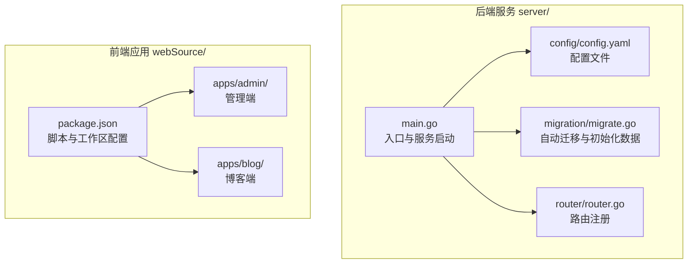
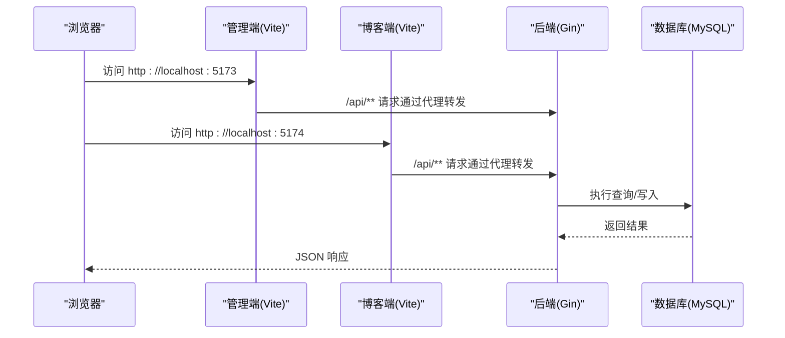
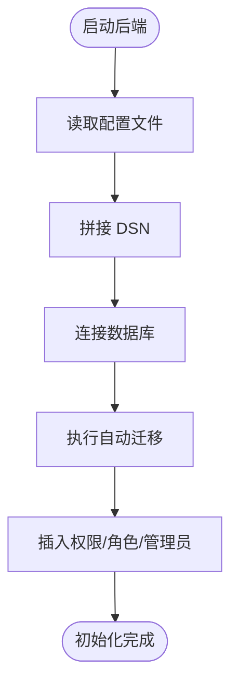
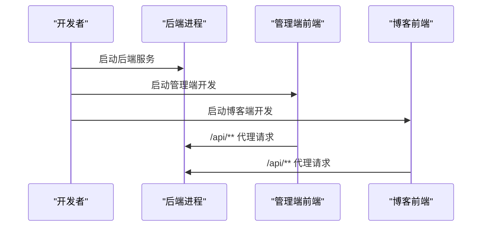
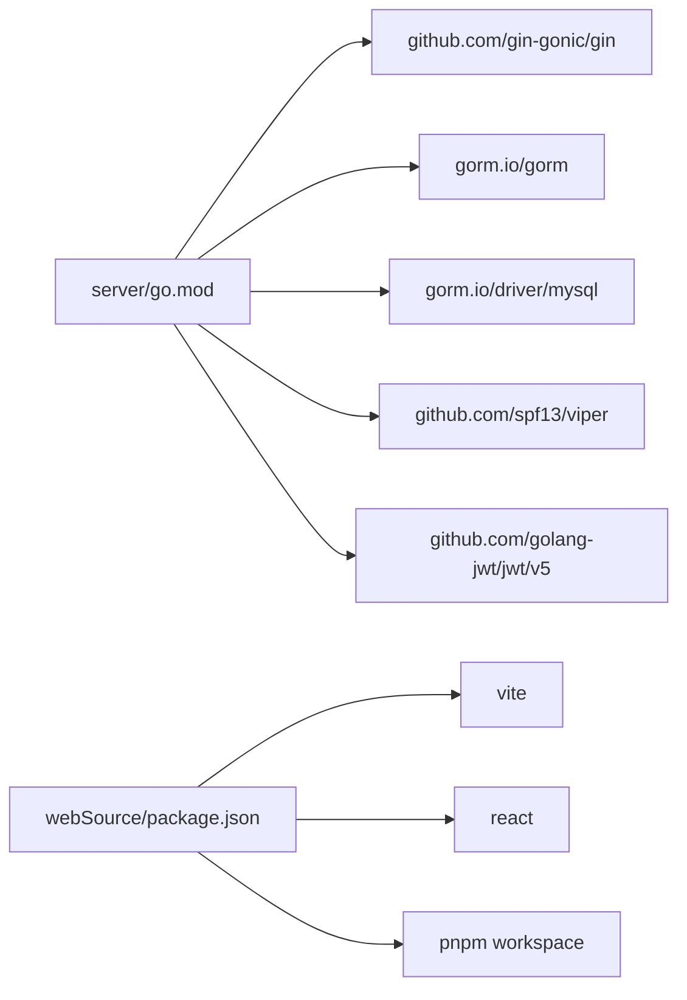

# 快速开始

<cite>
**本文引用的文件**
- [server/config/config.go](file://server/config/config.go)
- [server/config/config.yaml](file://server/config/config.yaml)
- [server/main.go](file://server/main.go)
- [server/migration/migrate.go](file://server/migration/migrate.go)
- [server/router/router.go](file://server/router/router.go)
- [server/go.mod](file://server/go.mod)
- [webSource/package.json](file://webSource/package.json)
- [webSource/apps/admin/vite.config.ts](file://webSource/apps/admin/vite.config.ts)
- [webSource/apps/blog/vite.config.ts](file://webSource/apps/blog/vite.config.ts)
- [server/internal/model/user.go](file://server/internal/model/user.go)
- [server/internal/model/article.go](file://server/internal/model/article.go)
</cite>

## 目录
1. [简介](#简介)
2. [项目结构](#项目结构)
3. [核心组件](#核心组件)
4. [架构总览](#架构总览)
5. [详细组件分析](#详细组件分析)
6. [依赖分析](#依赖分析)
7. [性能考虑](#性能考虑)
8. [故障排除指南](#故障排除指南)
9. [结论](#结论)
10. [附录](#附录)

## 简介
本指南面向新手开发者，帮助你在约30分钟内完成 Xiangmuzs 博客平台的环境准备、项目克隆、依赖安装、数据库配置、配置文件修改、开发服务器启动与首次访问系统。平台采用 Go 语言后端（Gin + GORM）与 React 前端（Vite），通过 YAML 配置文件集中管理数据库、JWT、上传与博客基础地址等关键参数。

## 项目结构
项目分为两大部分：
- 后端服务：位于 server/，使用 Go 语言，基于 Gin 框架与 GORM 进行数据库迁移与业务处理。
- 前端应用：位于 webSource/，采用 Vite + React 的多包工作区（pnpm workspace），包含后台管理端与博客展示端。

图表来源
- [server/main.go:1-77](file://server/main.go#L1-L77)
- [server/config/config.yaml:1-29](file://server/config/config.yaml#L1-L29)
- [server/migration/migrate.go:1-126](file://server/migration/migrate.go#L1-L126)
- [server/router/router.go:1-104](file://server/router/router.go#L1-L104)
- [webSource/package.json:1-22](file://webSource/package.json#L1-L22)

章节来源
- [server/main.go:1-77](file://server/main.go#L1-L77)
- [webSource/package.json:1-22](file://webSource/package.json#L1-L22)

## 核心组件
- 配置加载与结构：后端通过 Viper 加载 YAML 配置，支持 server、database、jwt、upload、blog 等模块化配置。
- 数据库连接与迁移：根据配置生成 DSN，使用 GORM 连接 MySQL 并执行自动迁移与种子数据插入。
- 路由与中间件：统一在路由层注册公开接口与鉴权接口，内置 CORS 中间件与静态资源服务。
- 前端开发与构建：使用 pnpm workspace 管理多包，分别提供管理端与博客端的开发与构建脚本。

章节来源
- [server/config/config.go:1-65](file://server/config/config.go#L1-L65)
- [server/config/config.yaml:1-29](file://server/config/config.yaml#L1-L29)
- [server/main.go:1-77](file://server/main.go#L1-L77)
- [server/migration/migrate.go:1-126](file://server/migration/migrate.go#L1-L126)
- [server/router/router.go:1-104](file://server/router/router.go#L1-L104)
- [webSource/package.json:1-22](file://webSource/package.json#L1-L22)

## 架构总览
下图展示了从浏览器到后端服务的整体交互流程，包括前端代理、后端路由与数据库访问。

图表来源
- [webSource/apps/admin/vite.config.ts:10-22](file://webSource/apps/admin/vite.config.ts#L10-L22)
- [webSource/apps/blog/vite.config.ts:10-22](file://webSource/apps/blog/vite.config.ts#L10-L22)
- [server/router/router.go:24-102](file://server/router/router.go#L24-L102)
- [server/main.go:64-68](file://server/main.go#L64-L68)

## 详细组件分析

### 环境准备与版本要求
- Go 版本：1.22 及以上（项目 go.mod 已声明）
- Node.js：用于前端开发与构建（版本建议与项目中使用的工具链一致）
- MySQL：8.0 及以上（与 GORM 驱动兼容）

章节来源
- [server/go.mod:1-60](file://server/go.mod#L1-L60)

### 克隆与依赖安装
- 克隆仓库后，进入根目录执行前端依赖安装与构建脚本：
  - 使用 pnpm 安装工作区依赖与各子包依赖
  - 开发模式同时启动管理端与博客端：执行前端脚本
- 后端依赖安装：
  - 在 server/ 目录下执行 Go 模块依赖安装

章节来源
- [webSource/package.json:4-16](file://webSource/package.json#L4-L16)
- [server/go.mod:1-60](file://server/go.mod#L1-L60)

### 数据库配置与初始化
- 创建数据库与用户：
  - 登录 MySQL，创建数据库与用户，并授予相应权限
- 修改配置文件：
  - 在 server/config/config.yaml 中设置数据库主机、端口、用户名、密码、库名与字符集
- 初始化流程：
  - 启动后端时会自动执行数据库迁移与种子数据插入，包括权限、角色与默认管理员用户

图表来源
- [server/main.go:26-47](file://server/main.go#L26-L47)
- [server/migration/migrate.go:13-38](file://server/migration/migrate.go#L13-L38)

章节来源
- [server/config/config.yaml:5-11](file://server/config/config.yaml#L5-L11)
- [server/main.go:26-47](file://server/main.go#L26-L47)
- [server/migration/migrate.go:13-38](file://server/migration/migrate.go#L13-L38)

### 配置文件修改要点
- 数据库连接参数：host、port、user、password、name、charset
- JWT 密钥与过期时间：secret、expire、refresh_expire
- 上传路径与限制：upload.path、upload.max_size、upload.allowed_types
- 博客基础地址：blog.base_url（前端代理指向后端端口）
- 服务器端口与模式：server.port、server.mode

章节来源
- [server/config/config.yaml:1-29](file://server/config/config.yaml#L1-L29)
- [server/config/config.go:7-43](file://server/config/config.go#L7-L43)

### 开发服务器启动流程
- 启动后端服务：
  - 在 server/ 目录执行后端启动命令，监听 server.port（默认 8080）
  - 启动时会加载配置、连接数据库、执行迁移、初始化 RSA 密钥并注册路由
- 启动前端应用：
  - 在根目录执行前端开发脚本，同时启动管理端（5173）与博客端（5174）
  - 前端通过 Vite 代理将 /api 与 /uploads 请求转发至后端

图表来源
- [server/main.go:19-76](file://server/main.go#L19-L76)
- [webSource/apps/admin/vite.config.ts:10-22](file://webSource/apps/admin/vite.config.ts#L10-L22)
- [webSource/apps/blog/vite.config.ts:10-22](file://webSource/apps/blog/vite.config.ts#L10-L22)

章节来源
- [server/main.go:19-76](file://server/main.go#L19-L76)
- [webSource/package.json:4-16](file://webSource/package.json#L4-L16)
- [webSource/apps/admin/vite.config.ts:1-24](file://webSource/apps/admin/vite.config.ts#L1-L24)
- [webSource/apps/blog/vite.config.ts:1-24](file://webSource/apps/blog/vite.config.ts#L1-L24)

### 首次访问与系统初始化
- 默认管理员账户：
  - 用户名：admin
  - 密码：admin123
  - 种子数据会在首次启动时自动创建
- 初始页面：
  - 管理端：http://localhost:5173
  - 博客端：http://localhost:5174

章节来源
- [server/migration/migrate.go:104-125](file://server/migration/migrate.go#L104-L125)
- [webSource/apps/admin/vite.config.ts:10-22](file://webSource/apps/admin/vite.config.ts#L10-L22)
- [webSource/apps/blog/vite.config.ts:10-22](file://webSource/apps/blog/vite.config.ts#L10-L22)

## 依赖分析
- 后端依赖：
  - Gin：Web 框架
  - GORM + MySQL 驱动：ORM 与数据库访问
  - Viper：配置解析
  - JWT：令牌处理
- 前端依赖：
  - Vite + React：开发与构建
  - pnpm workspace：多包管理

图表来源
- [server/go.mod:5-13](file://server/go.mod#L5-L13)
- [webSource/package.json:1-22](file://webSource/package.json#L1-L22)

章节来源
- [server/go.mod:1-60](file://server/go.mod#L1-L60)
- [webSource/package.json:1-22](file://webSource/package.json#L1-L22)

## 性能考虑
- 日志级别：调试模式下开启更详细的日志，生产模式建议关闭冗余日志以降低开销
- 上传限制：合理设置上传最大大小与允许类型，避免过大文件占用带宽与存储
- 数据库字符集：使用 utf8mb4 保证多语言与表情符号支持
- 前端代理：开发阶段通过 Vite 代理减少跨域与网络往返

## 故障排除指南
- 启动后端报数据库连接错误：
  - 检查配置文件中的数据库主机、端口、用户名、密码与库名是否正确
  - 确认 MySQL 服务已启动且网络可达
- 启动后端报迁移失败：
  - 查看控制台输出的迁移错误，确认数据库权限足够执行迁移
  - 清理或重置数据库后重新启动
- 前端无法访问后端接口：
  - 检查前端 Vite 代理配置是否指向正确的后端地址与端口
  - 确认后端已启动并监听对应端口
- 默认管理员未创建：
  - 删除数据库中相关表或清空数据后重启后端，种子数据会再次插入

章节来源
- [server/config/config.yaml:5-11](file://server/config/config.yaml#L5-L11)
- [server/main.go:26-47](file://server/main.go#L26-L47)
- [server/migration/migrate.go:13-38](file://server/migration/migrate.go#L13-L38)
- [webSource/apps/admin/vite.config.ts:12-21](file://webSource/apps/admin/vite.config.ts#L12-L21)
- [webSource/apps/blog/vite.config.ts:12-21](file://webSource/apps/blog/vite.config.ts#L12-L21)

## 结论
按照本指南，你可以在约 30 分钟内完成从环境准备到系统运行的全流程。建议在本地开发完成后，进一步完善生产环境的数据库权限、安全密钥与上传路径配置，并部署前后端静态资源与后端二进制文件。

## 附录

### 关键配置项一览
- 数据库：host、port、user、password、name、charset
- JWT：secret、expire、refresh_expire
- 上传：path、max_size、allowed_types
- 博客：base_url
- 服务器：port、mode

章节来源
- [server/config/config.yaml:1-29](file://server/config/config.yaml#L1-L29)
- [server/config/config.go:7-43](file://server/config/config.go#L7-L43)