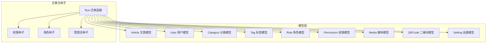
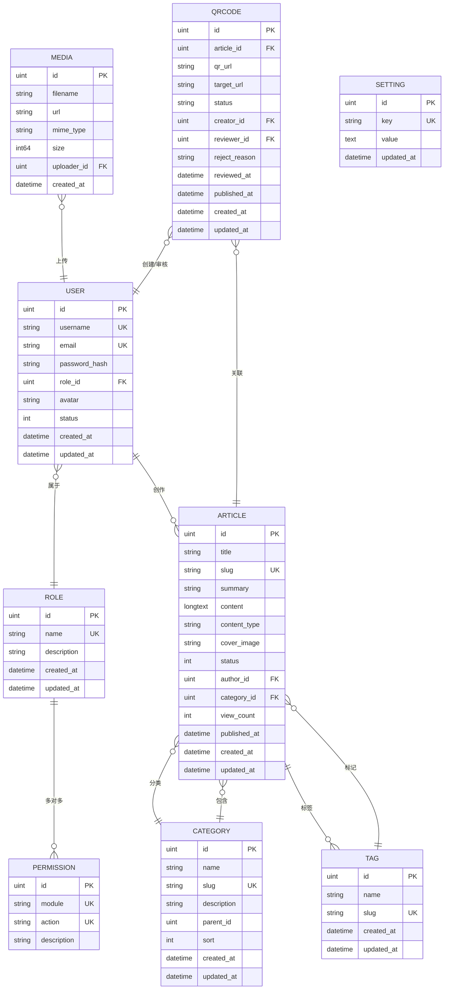
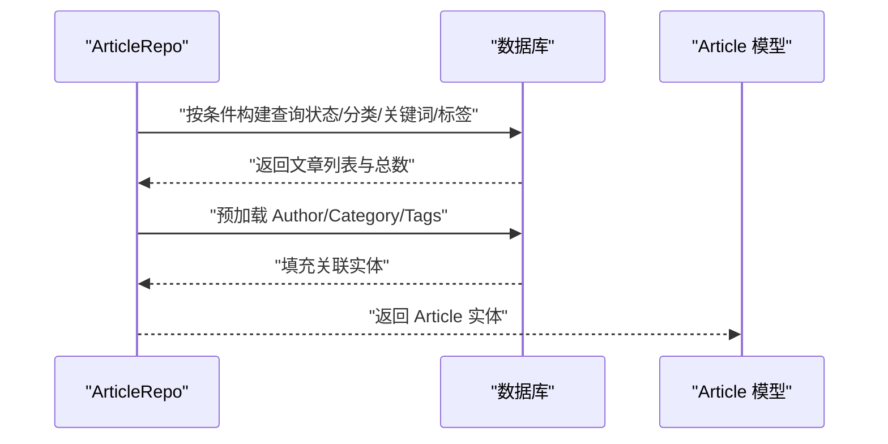
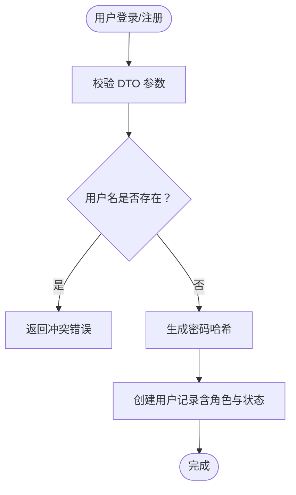
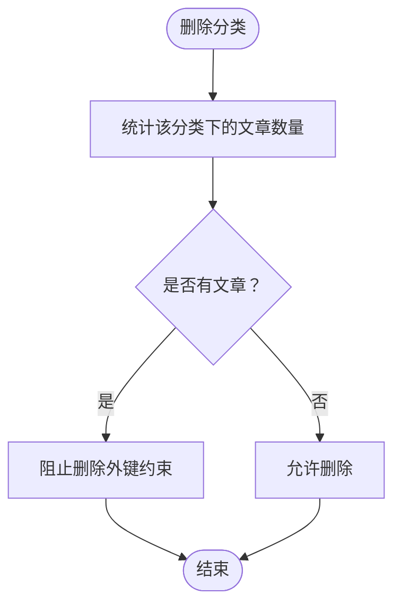
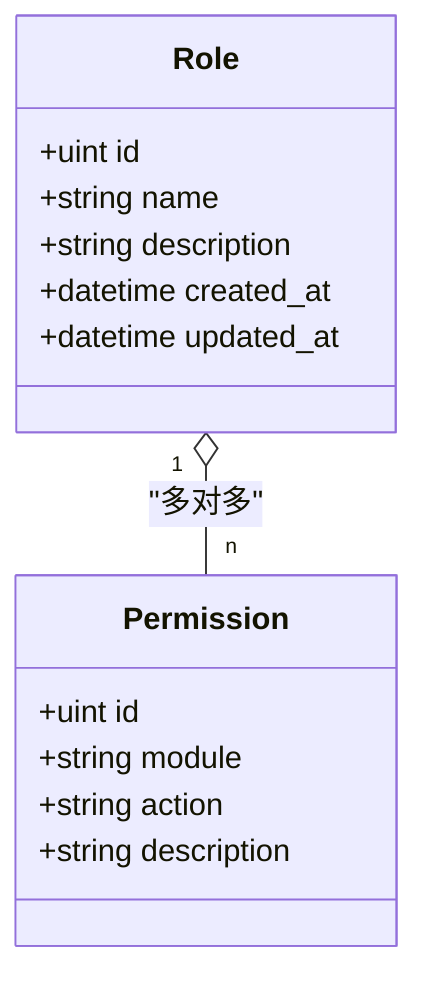
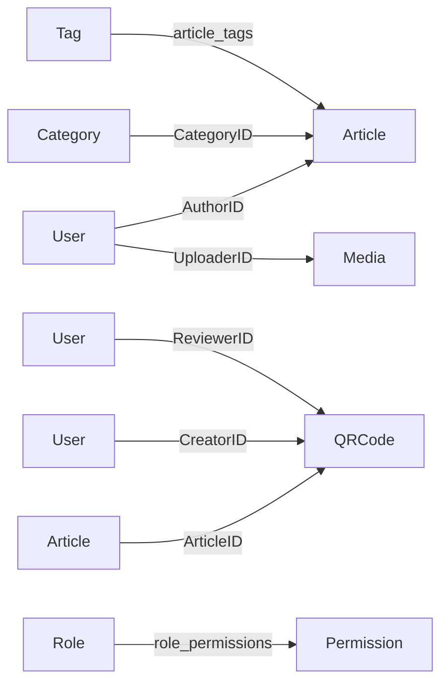

# 数据库设计

<cite>
**本文引用的文件**
- [server/internal/model/article.go](file://server/internal/model/article.go)
- [server/internal/model/user.go](file://server/internal/model/user.go)
- [server/internal/model/category.go](file://server/internal/model/category.go)
- [server/internal/model/tag.go](file://server/internal/model/tag.go)
- [server/internal/model/role.go](file://server/internal/model/role.go)
- [server/internal/model/media.go](file://server/internal/model/media.go)
- [server/internal/model/qrcode.go](file://server/internal/model/qrcode.go)
- [server/internal/model/setting.go](file://server/internal/model/setting.go)
- [server/migration/migrate.go](file://server/migration/migrate.go)
- [server/internal/repository/article_repo.go](file://server/internal/repository/article_repo.go)
- [server/internal/repository/user_repo.go](file://server/internal/repository/user_repo.go)
- [server/internal/repository/category_repo.go](file://server/internal/repository/category_repo.go)
- [server/internal/dto/article_dto.go](file://server/internal/dto/article_dto.go)
- [server/internal/dto/auth_dto.go](file://server/internal/dto/auth_dto.go)
- [server/internal/dto/common.go](file://server/internal/dto/common.go)
- [server/config/config.go](file://server/config/config.go)
</cite>

## 目录
1. [简介](#简介)
2. [项目结构](#项目结构)
3. [核心组件](#核心组件)
4. [架构总览](#架构总览)
5. [详细组件分析](#详细组件分析)
6. [依赖分析](#依赖分析)
7. [性能考量](#性能考量)
8. [故障排查指南](#故障排查指南)
9. [结论](#结论)
10. [附录](#附录)

## 简介
本文件为 Xiangmuzs 博客平台的数据库设计与建模文档，聚焦于核心业务实体（文章、用户、分类、标签）及其关联关系，提供完整的实体-关系图（ER 图）、表结构定义、索引与约束设计、查询优化建议、数据迁移与版本管理策略、备份与恢复最佳实践、数据安全与隐私保护措施，并附带数据字典与字段说明，帮助开发者快速理解与维护数据模型。

## 项目结构
后端采用 Go + GORM 架构，模型位于 server/internal/model，迁移脚本位于 server/migration，仓储层位于 server/internal/repository，DTO 位于 server/internal/dto，配置位于 server/config。数据库迁移通过 AutoMigrate 自动执行，包含权限、角色、默认管理员等种子数据初始化。

**图表来源**
- [server/migration/migrate.go:13-38](file://server/migration/migrate.go#L13-L38)
- [server/internal/model/article.go:5-23](file://server/internal/model/article.go#L5-L23)
- [server/internal/model/user.go:5-15](file://server/internal/model/user.go#L5-L15)
- [server/internal/model/category.go:5-14](file://server/internal/model/category.go#L5-L14)
- [server/internal/model/tag.go:5-11](file://server/internal/model/tag.go#L5-L11)
- [server/internal/model/role.go:5-19](file://server/internal/model/role.go#L5-L19)
- [server/internal/model/media.go:5-13](file://server/internal/model/media.go#L5-L13)
- [server/internal/model/qrcode.go:6-22](file://server/internal/model/qrcode.go#L6-L22)
- [server/internal/model/setting.go:5-10](file://server/internal/model/setting.go#L5-L10)

**章节来源**
- [server/migration/migrate.go:13-38](file://server/migration/migrate.go#L13-L38)
- [server/config/config.go:47-64](file://server/config/config.go#L47-L64)

## 核心组件
本节对核心业务实体进行深入解析：Article、User、Category、Tag 的字段、约束、索引与业务语义，以及多对多、一对多等关系映射。

- 文章 Article
  - 字段与约束要点
    - 主键：ID
    - 标题：长度限制、非空
    - 别名 Slug：唯一索引、非空
    - 摘要：长度限制
    - 内容：长文本类型
    - 内容类型：枚举值（markdown 或 rich-text），默认 markdown
    - 封面图：长度限制
    - 状态：整型状态码（草稿/已发布），带复合索引（状态+发布时间）
    - 作者：外键 AuthorID 关联 User
    - 分类：可空外键 CategoryID 关联 Category
    - 标签：多对多，中间表 article_tags
    - 浏览量：整型，默认 0
    - 发布时间：带索引
    - 时间戳：创建/更新时间
  - 业务逻辑
    - 草稿与发布状态分离；支持按状态、分类、关键词、标签聚合查询
    - 支持浏览量自增
    - 预加载作者、分类、标签以减少 N+1 查询

- 用户 User
  - 字段与约束要点
    - 主键：ID
    - 用户名：唯一索引、非空
    - 邮箱：唯一索引、非空
    - 密码哈希：长度限制（仅模型存储，不暴露到 JSON）
    - 角色：外键 RoleID 关联 Role
    - 头像：长度限制
    - 状态：整型（启用/禁用），默认启用
    - 时间戳：创建/更新时间
  - 业务逻辑
    - 与 Role 多对一；与 Article 一对多（作者）

- 分类 Category
  - 字段与约束要点
    - 主键：ID
    - 名称：非空
    - 别名 Slug：唯一索引、非空
    - 描述：长度限制
    - 父级：可空外键 ParentID（自引用）
    - 排序：整型，默认 0
    - 时间戳：创建/更新时间
  - 业务逻辑
    - 支持层级结构（父子关系）
    - 列表按排序与 ID 升序排列

- 标签 Tag
  - 字段与约束要点
    - 主键：ID
    - 名称：非空
    - 别名 Slug：唯一索引、非空
    - 时间戳：创建/更新时间
  - 业务逻辑
    - 与 Article 多对多，中间表 article_tags

- 角色 Role 与权限 Permission
  - 字段与约束要点
    - Role：主键、名称唯一索引、描述
    - Permission：主键、模块+动作唯一组合索引、描述
    - 多对多：Role 与 Permission 通过中间表 role_permissions 关联
  - 业务逻辑
    - 种子数据包含模块与动作的全集，超级管理员拥有全部权限，编辑角色有选择性权限

- 媒体 Media、二维码 QRCode、设置 Setting
  - 媒体：文件名、URL、MIME 类型、大小、上传者
  - 二维码：文章关联、目标 URL、状态、审核人、拒绝原因、时间戳
  - 设置：键值对，键唯一

**章节来源**
- [server/internal/model/article.go:5-23](file://server/internal/model/article.go#L5-L23)
- [server/internal/model/user.go:5-15](file://server/internal/model/user.go#L5-L15)
- [server/internal/model/category.go:5-14](file://server/internal/model/category.go#L5-L14)
- [server/internal/model/tag.go:5-11](file://server/internal/model/tag.go#L5-L11)
- [server/internal/model/role.go:5-19](file://server/internal/model/role.go#L5-L19)
- [server/internal/model/media.go:5-13](file://server/internal/model/media.go#L5-L13)
- [server/internal/model/qrcode.go:6-22](file://server/internal/model/qrcode.go#L6-L22)
- [server/internal/model/setting.go:5-10](file://server/internal/model/setting.go#L5-L10)

## 架构总览
下图展示数据库层面的核心实体与关系，标注外键与多对多中间表。

**图表来源**
- [server/internal/model/user.go:5-15](file://server/internal/model/user.go#L5-L15)
- [server/internal/model/role.go:5-19](file://server/internal/model/role.go#L5-L19)
- [server/internal/model/article.go:5-23](file://server/internal/model/article.go#L5-L23)
- [server/internal/model/category.go:5-14](file://server/internal/model/category.go#L5-L14)
- [server/internal/model/tag.go:5-11](file://server/internal/model/tag.go#L5-L11)
- [server/internal/model/media.go:5-13](file://server/internal/model/media.go#L5-L13)
- [server/internal/model/qrcode.go:6-22](file://server/internal/model/qrcode.go#L6-L22)
- [server/internal/model/setting.go:5-10](file://server/internal/model/setting.go#L5-L10)

## 详细组件分析

### 文章 Article 表
- 字段与约束
  - 主键：ID
  - 标题：长度上限、非空
  - 别名 Slug：唯一索引、非空，用于 SEO 友好链接
  - 摘要：长度上限
  - 内容：长文本
  - 内容类型：枚举值（markdown 或 rich-text），默认 markdown
  - 封面图：长度上限
  - 状态：整型（草稿/已发布），配合索引 idx_status_pub 提升查询效率
  - 作者：外键 AuthorID → USER
  - 分类：可空外键 CategoryID → CATEGORY
  - 标签：多对多，中间表 article_tags
  - 浏览量：整型，默认 0
  - 发布时间：带索引
  - 时间戳：创建/更新
- 业务逻辑
  - 支持按状态、分类、关键词、标签聚合查询
  - 支持浏览量自增表达式更新
  - 仓储层预加载作者、分类、标签，避免 N+1 查询
- 查询路径参考
  - [server/internal/repository/article_repo.go:41-70](file://server/internal/repository/article_repo.go#L41-L70)
  - [server/internal/repository/article_repo.go:72-74](file://server/internal/repository/article_repo.go#L72-L74)

**图表来源**
- [server/internal/repository/article_repo.go:41-70](file://server/internal/repository/article_repo.go#L41-L70)
- [server/internal/model/article.go:15-18](file://server/internal/model/article.go#L15-L18)

**章节来源**
- [server/internal/model/article.go:5-23](file://server/internal/model/article.go#L5-L23)
- [server/internal/repository/article_repo.go:41-70](file://server/internal/repository/article_repo.go#L41-L70)
- [server/internal/repository/article_repo.go:72-74](file://server/internal/repository/article_repo.go#L72-L74)

### 用户 User 表
- 字段与约束
  - 主键：ID
  - 用户名：唯一索引、非空
  - 邮箱：唯一索引、非空
  - 密码哈希：长度限制（仅模型存储，JSON 标记为私密）
  - 角色：外键 RoleID → ROLE
  - 头像：长度上限
  - 状态：整型（启用/禁用），默认启用
  - 时间戳：创建/更新
- 业务逻辑
  - 与 Role 多对一；与 Article 一对多（作者）
  - 仓储层支持按用户名查找、分页列表、按 ID 查找
- 查询路径参考
  - [server/internal/repository/user_repo.go:24-28](file://server/internal/repository/user_repo.go#L24-L28)
  - [server/internal/repository/user_repo.go:59-65](file://server/internal/repository/user_repo.go#L59-L65)

**图表来源**
- [server/internal/dto/auth_dto.go:26-31](file://server/internal/dto/auth_dto.go#L26-L31)
- [server/internal/repository/user_repo.go:40-49](file://server/internal/repository/user_repo.go#L40-L49)

**章节来源**
- [server/internal/model/user.go:5-15](file://server/internal/model/user.go#L5-L15)
- [server/internal/repository/user_repo.go:24-28](file://server/internal/repository/user_repo.go#L24-L28)
- [server/internal/repository/user_repo.go:59-65](file://server/internal/repository/user_repo.go#L59-L65)
- [server/internal/dto/auth_dto.go:26-31](file://server/internal/dto/auth_dto.go#L26-L31)

### 分类 Category 表
- 字段与约束
  - 主键：ID
  - 名称：非空
  - 别名 Slug：唯一索引、非空
  - 描述：长度上限
  - 父级：可空外键 ParentID（自引用）
  - 排序：整型，默认 0
  - 时间戳：创建/更新
- 业务逻辑
  - 支持层级结构（父子关系）
  - 列表按排序与 ID 升序排列
  - 删除前检查是否有关联文章，避免破坏外键约束
- 查询路径参考
  - [server/internal/repository/category_repo.go:40-44](file://server/internal/repository/category_repo.go#L40-L44)
  - [server/internal/repository/category_repo.go:24-32](file://server/internal/repository/category_repo.go#L24-L32)

**图表来源**
- [server/internal/repository/category_repo.go:24-32](file://server/internal/repository/category_repo.go#L24-L32)

**章节来源**
- [server/internal/model/category.go:5-14](file://server/internal/model/category.go#L5-L14)
- [server/internal/repository/category_repo.go:40-44](file://server/internal/repository/category_repo.go#L40-L44)
- [server/internal/repository/category_repo.go:24-32](file://server/internal/repository/category_repo.go#L24-L32)

### 标签 Tag 表
- 字段与约束
  - 主键：ID
  - 名称：非空
  - 别名 Slug：唯一索引、非空
  - 时间戳：创建/更新
- 业务逻辑
  - 与 Article 多对多，中间表 article_tags

**章节来源**
- [server/internal/model/tag.go:5-11](file://server/internal/model/tag.go#L5-L11)

### 角色与权限 Role/Permission
- 字段与约束
  - Role：主键、名称唯一索引、描述
  - Permission：主键、模块+动作唯一组合索引、描述
  - 多对多：Role 与 Permission 通过中间表 role_permissions 关联
- 业务逻辑
  - 种子数据包含模块与动作的全集，超级管理员拥有全部权限，编辑角色有选择性权限
- 种子数据路径参考
  - [server/migration/migrate.go:40-67](file://server/migration/migrate.go#L40-L67)
  - [server/migration/migrate.go:69-102](file://server/migration/migrate.go#L69-L102)
  - [server/migration/migrate.go:104-125](file://server/migration/migrate.go#L104-L125)

**图表来源**
- [server/internal/model/role.go:5-19](file://server/internal/model/role.go#L5-L19)

**章节来源**
- [server/internal/model/role.go:5-19](file://server/internal/model/role.go#L5-L19)
- [server/migration/migrate.go:40-67](file://server/migration/migrate.go#L40-L67)
- [server/migration/migrate.go:69-102](file://server/migration/migrate.go#L69-L102)
- [server/migration/migrate.go:104-125](file://server/migration/migrate.go#L104-L125)

### 媒体、二维码、设置
- 媒体 Media：文件名、URL、MIME 类型、大小、上传者
- 二维码 QRCode：文章关联、目标 URL、状态、审核人、拒绝原因、时间戳
- 设置 Setting：键值对，键唯一

**章节来源**
- [server/internal/model/media.go:5-13](file://server/internal/model/media.go#L5-L13)
- [server/internal/model/qrcode.go:6-22](file://server/internal/model/qrcode.go#L6-L22)
- [server/internal/model/setting.go:5-10](file://server/internal/model/setting.go#L5-L10)

## 依赖分析
- 外键关系
  - Article.AuthorID → User.ID
  - Article.CategoryID → Category.ID（可空）
  - Article.Tags → Tag（多对多，中间表 article_tags）
  - QRCode.ArticleID → Article.ID
  - QRCode.CreatorID/ReviewerID → User.ID
  - Media.UploaderID → User.ID
  - Role.Permissions → Permission（多对多，中间表 role_permissions）
- 约束与索引
  - 唯一索引：User.username、User.email、Category.slug、Tag.slug、Setting.key
  - 复合索引：Article.status + Article.published_at（提升状态筛选与时间排序）
  - 普通索引：Article.category_id、Article.published_at、Article.slug、Category.parent_id、QRCode.article_id、QRCode.status
- 参照完整性
  - 删除分类前检查 Article 关联，避免违反外键约束
  - 种子数据确保角色与权限存在，便于后续授权

**图表来源**
- [server/internal/model/article.go:14-18](file://server/internal/model/article.go#L14-L18)
- [server/internal/model/qrcode.go:8-14](file://server/internal/model/qrcode.go#L8-L14)
- [server/internal/model/media.go:11](file://server/internal/model/media.go#L11)
- [server/internal/model/role.go:9](file://server/internal/model/role.go#L9)

**章节来源**
- [server/internal/model/article.go:14-18](file://server/internal/model/article.go#L14-L18)
- [server/internal/model/qrcode.go:8-14](file://server/internal/model/qrcode.go#L8-L14)
- [server/internal/model/media.go:11](file://server/internal/model/media.go#L11)
- [server/internal/model/role.go:9](file://server/internal/model/role.go#L9)
- [server/internal/repository/category_repo.go:24-32](file://server/internal/repository/category_repo.go#L24-L32)

## 性能考量
- 索引设计
  - 复合索引 idx_status_pub（Article.status, Article.published_at）：加速状态筛选与时间排序
  - 单列索引：Article.category_id、Article.published_at、Article.slug、Category.parent_id、QRCode.article_id、QRCode.status
  - 唯一索引：User.username、User.email、Category.slug、Tag.slug、Setting.key
- 查询优化
  - 使用仓储层预加载（Preload）一次性获取关联实体，避免 N+1 查询
  - 聚合查询时尽量利用索引列（如 status、category_id、slug、tag.slug）
  - 分页查询使用 Offset/Limit，结合总记录数 Count
- 写入优化
  - 浏览量自增使用表达式更新，避免读取-计算-写回的竞态
- 存储与压缩
  - 长文本内容（Article.content、Setting.value）使用合适的数据类型，避免过度占用
  - 媒体文件路径与元信息分离，利于 CDN 与缓存

**章节来源**
- [server/internal/repository/article_repo.go:26-27](file://server/internal/repository/article_repo.go#L26-L27)
- [server/internal/repository/article_repo.go:32-34](file://server/internal/repository/article_repo.go#L32-L34)
- [server/internal/repository/article_repo.go:64-69](file://server/internal/repository/article_repo.go#L64-L69)
- [server/internal/repository/article_repo.go:72-74](file://server/internal/repository/article_repo.go#L72-L74)

## 故障排查指南
- 迁移失败
  - 现象：AutoMigrate 报错或日志提示失败
  - 排查：确认数据库连接配置正确，检查模型字段与数据库类型兼容性
  - 参考：[server/migration/migrate.go:13-38](file://server/migration/migrate.go#L13-L38)，[server/config/config.go:20-27](file://server/config/config.go#L20-L27)
- 删除分类报外键错误
  - 现象：删除分类时报外键约束错误
  - 排查：先清理或转移该分类下的文章，再执行删除
  - 参考：[server/internal/repository/category_repo.go:24-32](file://server/internal/repository/category_repo.go#L24-L32)
- 登录/注册参数校验失败
  - 现象：DTO 校验失败
  - 排查：核对请求体字段与绑定规则
  - 参考：[server/internal/dto/auth_dto.go:3-8](file://server/internal/dto/auth_dto.go#L3-L8)，[server/internal/dto/auth_dto.go:26-31](file://server/internal/dto/auth_dto.go#L26-L31)
- 分页参数异常
  - 现象：分页结果不符合预期
  - 排查：确认 Page/PageSize 归一化逻辑与 Offset 计算
  - 参考：[server/internal/dto/common.go:9-20](file://server/internal/dto/common.go#L9-L20)

**章节来源**
- [server/migration/migrate.go:13-38](file://server/migration/migrate.go#L13-L38)
- [server/config/config.go:20-27](file://server/config/config.go#L20-L27)
- [server/internal/repository/category_repo.go:24-32](file://server/internal/repository/category_repo.go#L24-L32)
- [server/internal/dto/auth_dto.go:3-8](file://server/internal/dto/auth_dto.go#L3-L8)
- [server/internal/dto/auth_dto.go:26-31](file://server/internal/dto/auth_dto.go#L26-L31)
- [server/internal/dto/common.go:9-20](file://server/internal/dto/common.go#L9-L20)

## 结论
本文档基于现有模型与仓储实现，系统梳理了 Xiangmuzs 博客平台的核心数据结构与关系，明确了外键与索引设计原则，给出了查询优化与性能建议，并提供了迁移、备份与安全方面的实践指导。建议在后续迭代中持续关注查询热点、索引维护与数据一致性，确保系统稳定与高性能。

## 附录

### 数据迁移策略与版本管理
- 自动迁移
  - 通过迁移函数统一执行 AutoMigrate，确保模型变更同步到数据库
  - 参考：[server/migration/migrate.go:13-38](file://server/migration/migrate.go#L13-L38)
- 种子数据
  - 初始化权限、角色与管理员用户，保证系统最小可用
  - 参考：[server/migration/migrate.go:40-67](file://server/migration/migrate.go#L40-L67)，[server/migration/migrate.go:69-102](file://server/migration/migrate.go#L69-L102)，[server/migration/migrate.go:104-125](file://server/migration/migrate.go#L104-L125)
- 版本管理
  - 建议引入迁移版本号与回滚策略，结合数据库事务与备份机制，确保变更可控

**章节来源**
- [server/migration/migrate.go:13-38](file://server/migration/migrate.go#L13-L38)
- [server/migration/migrate.go:40-67](file://server/migration/migrate.go#L40-L67)
- [server/migration/migrate.go:69-102](file://server/migration/migrate.go#L69-L102)
- [server/migration/migrate.go:104-125](file://server/migration/migrate.go#L104-L125)

### 数据备份与恢复最佳实践
- 备份
  - 定期导出数据库快照，保留多个历史版本
  - 对关键表（用户、文章、设置）增加增量备份
- 恢复
  - 使用事务包裹恢复流程，验证完整性后再切换服务
  - 恢复后运行一次迁移，确保结构一致

### 数据安全与隐私保护
- 密码处理
  - 用户密码仅以哈希形式存储，DTO 中不暴露明文
  - 参考：[server/internal/model/user.go:9](file://server/internal/model/user.go#L9)，[server/internal/dto/auth_dto.go:21-24](file://server/internal/dto/auth_dto.go#L21-L24)
- 最小权限
  - 基于角色与权限模型控制访问范围，遵循最小权限原则
  - 参考：[server/internal/model/role.go:5-19](file://server/internal/model/role.go#L5-L19)，[server/migration/migrate.go:69-102](file://server/migration/migrate.go#L69-L102)
- 数据脱敏
  - 日志与监控避免输出敏感字段（如密码哈希）

**章节来源**
- [server/internal/model/user.go:9](file://server/internal/model/user.go#L9)
- [server/internal/dto/auth_dto.go:21-24](file://server/internal/dto/auth_dto.go#L21-L24)
- [server/internal/model/role.go:5-19](file://server/internal/model/role.go#L5-L19)
- [server/migration/migrate.go:69-102](file://server/migration/migrate.go#L69-L102)

### 数据字典与字段说明
- 文章 Article
  - id：主键
  - title：标题
  - slug：别名（唯一）
  - summary：摘要
  - content：内容（长文本）
  - content_type：内容类型（markdown/rich-text）
  - cover_image：封面图
  - status：状态（草稿/已发布）
  - author_id：作者（外键）
  - category_id：分类（外键，可空）
  - view_count：浏览量
  - published_at：发布时间
  - created_at/updated_at：时间戳
- 用户 User
  - id：主键
  - username：用户名（唯一）
  - email：邮箱（唯一）
  - password_hash：密码哈希
  - role_id：角色（外键）
  - avatar：头像
  - status：状态（启用/禁用）
  - created_at/updated_at：时间戳
- 分类 Category
  - id：主键
  - name：名称
  - slug：别名（唯一）
  - description：描述
  - parent_id：父级（自引用）
  - sort：排序
  - created_at/updated_at：时间戳
- 标签 Tag
  - id：主键
  - name：名称
  - slug：别名（唯一）
  - created_at/updated_at：时间戳
- 角色 Role
  - id：主键
  - name：名称（唯一）
  - description：描述
  - permissions：权限集合（多对多）
  - created_at/updated_at：时间戳
- 权限 Permission
  - id：主键
  - module：模块
  - action：动作
  - description：描述
- 媒体 Media
  - id：主键
  - filename：文件名
  - url：URL
  - mime_type：MIME 类型
  - size：大小
  - uploader_id：上传者（外键）
  - created_at：创建时间
- 二维码 QRCode
  - id：主键
  - article_id：文章（外键）
  - qr_url：二维码图片路径
  - target_url：目标 URL
  - status：状态（待审核/通过/拒绝）
  - creator_id：创建者（外键）
  - reviewer_id：审核者（外键，可空）
  - reject_reason：拒绝原因
  - reviewed_at：审核时间
  - published_at：发布时间
  - created_at/updated_at：时间戳
- 设置 Setting
  - id：主键
  - key：键（唯一）
  - value：值（文本）
  - updated_at：更新时间

**章节来源**
- [server/internal/model/article.go:5-23](file://server/internal/model/article.go#L5-L23)
- [server/internal/model/user.go:5-15](file://server/internal/model/user.go#L5-L15)
- [server/internal/model/category.go:5-14](file://server/internal/model/category.go#L5-L14)
- [server/internal/model/tag.go:5-11](file://server/internal/model/tag.go#L5-L11)
- [server/internal/model/role.go:5-19](file://server/internal/model/role.go#L5-L19)
- [server/internal/model/media.go:5-13](file://server/internal/model/media.go#L5-L13)
- [server/internal/model/qrcode.go:6-22](file://server/internal/model/qrcode.go#L6-L22)
- [server/internal/model/setting.go:5-10](file://server/internal/model/setting.go#L5-L10)