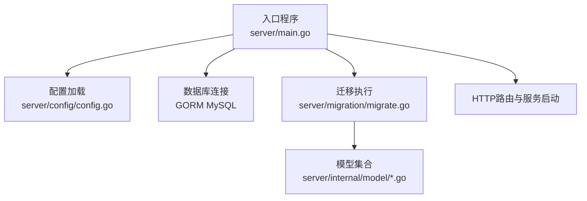
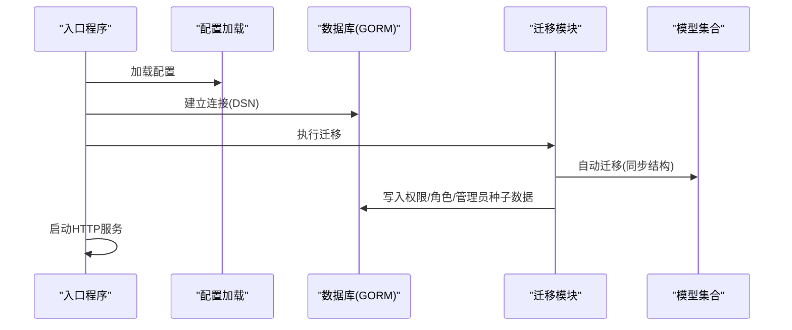
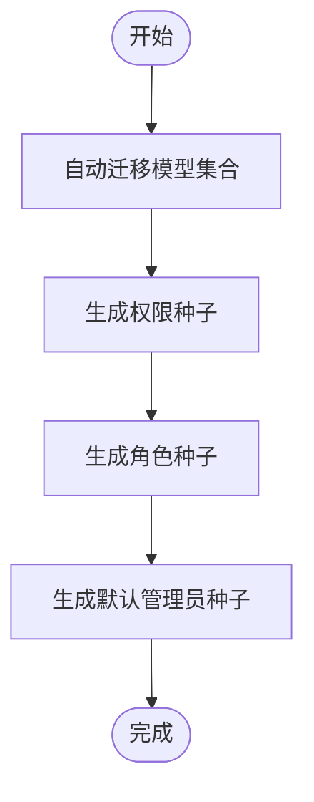
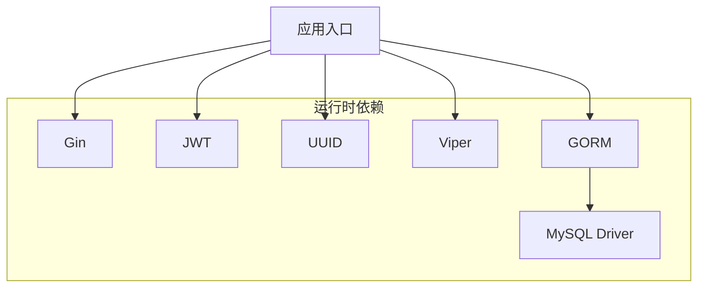

# 数据迁移策略

<cite>
**本文引用的文件**
- [server/main.go](file://server/main.go)
- [server/migration/migrate.go](file://server/migration/migrate.go)
- [server/config/config.go](file://server/config/config.go)
- [server/config/config.yaml](file://server/config/config.yaml)
- [server/go.mod](file://server/go.mod)
- [server/internal/model/article.go](file://server/internal/model/article.go)
- [server/internal/model/user.go](file://server/internal/model/user.go)
- [server/internal/model/role.go](file://server/internal/model/role.go)
- [server/internal/model/category.go](file://server/internal/model/category.go)
- [server/internal/model/tag.go](file://server/internal/model/tag.go)
- [server/internal/model/media.go](file://server/internal/model/media.go)
- [server/internal/model/qrcode.go](file://server/internal/model/qrcode.go)
</cite>

## 目录
1. [简介](#简介)
2. [项目结构](#项目结构)
3. [核心组件](#核心组件)
4. [架构总览](#架构总览)
5. [详细组件分析](#详细组件分析)
6. [依赖分析](#依赖分析)
7. [性能考虑](#性能考虑)
8. [故障排查指南](#故障排查指南)
9. [结论](#结论)
10. [附录](#附录)

## 简介
本文件面向Xiangmuzs博客平台，系统化阐述数据库迁移策略与最佳实践。当前仓库采用GORM自动迁移与种子数据初始化的方式，在应用启动时统一执行。本文将基于现有实现，补充版本化迁移、回滚与生产环境迁移的策略建议，并提供增量/全量迁移选择、备份与验证流程、以及迁移脚本编写与测试规范。

## 项目结构
后端服务通过入口程序加载配置、连接数据库、执行迁移与种子数据初始化，随后启动HTTP服务。迁移逻辑集中在迁移模块中，模型定义位于模型目录，配置由Viper从YAML读取。

图表来源
- [server/main.go:19-47](file://server/main.go#L19-L47)
- [server/migration/migrate.go:13-38](file://server/migration/migrate.go#L13-L38)
- [server/config/config.go:47-64](file://server/config/config.go#L47-L64)

章节来源
- [server/main.go:19-47](file://server/main.go#L19-L47)
- [server/config/config.go:47-64](file://server/config/config.go#L47-L64)
- [server/config/config.yaml:1-29](file://server/config/config.yaml#L1-29)

## 核心组件
- 迁移执行器：在应用启动阶段调用自动迁移，确保数据库结构与模型一致；同时执行权限、角色与默认管理员的种子数据初始化。
- 模型层：定义了文章、用户、角色、分类、标签、媒体、二维码等实体及其字段约束、索引与关联关系。
- 配置层：通过Viper从YAML读取数据库连接参数与运行模式，支持开发/调试模式下的日志输出。

章节来源
- [server/migration/migrate.go:13-38](file://server/migration/migrate.go#L13-L38)
- [server/internal/model/article.go:5-23](file://server/internal/model/article.go#L5-L23)
- [server/internal/model/user.go:5-16](file://server/internal/model/user.go#L5-L16)
- [server/internal/model/role.go:5-19](file://server/internal/model/role.go#L5-L19)
- [server/config/config.go:20-27](file://server/config/config.go#L20-L27)

## 架构总览
下图展示启动流程中的迁移与数据初始化路径，以及与模型的关系。

图表来源
- [server/main.go:19-47](file://server/main.go#L19-L47)
- [server/migration/migrate.go:13-38](file://server/migration/migrate.go#L13-L38)

## 详细组件分析

### 迁移执行器（自动迁移与种子）
- 自动迁移：对多个模型执行结构同步，确保数据库表结构与模型定义一致。
- 种子数据：
  - 权限：按模块与动作生成权限条目，带中文描述。
  - 角色：创建超级管理员与编辑角色，并分配对应权限。
  - 默认管理员：创建初始管理员账户并绑定超级管理员角色。

图表来源
- [server/migration/migrate.go:13-38](file://server/migration/migrate.go#L13-L38)
- [server/migration/migrate.go:40-67](file://server/migration/migrate.go#L40-L67)
- [server/migration/migrate.go:69-102](file://server/migration/migrate.go#L69-L102)
- [server/migration/migrate.go:104-125](file://server/migration/migrate.go#L104-L125)

章节来源
- [server/migration/migrate.go:13-38](file://server/migration/migrate.go#L13-L38)
- [server/migration/migrate.go:40-125](file://server/migration/migrate.go#L40-L125)

### 模型与索引/约束概览
- 文章：标题、别名、摘要、内容、封面、状态、作者、分类、标签多对多、浏览数、发布时间等；含唯一索引与复合索引。
- 用户：用户名、邮箱唯一索引、角色外键、状态等。
- 角色：名称唯一索引、权限多对多。
- 分类：名称、别名唯一索引、层级与排序。
- 标签：名称、别名唯一索引。
- 媒体：文件名、URL、类型、大小、上传者。
- 二维码：文章外键、目标URL、状态、审核人、时间戳等；含索引。

章节来源
- [server/internal/model/article.go:5-23](file://server/internal/model/article.go#L5-L23)
- [server/internal/model/user.go:5-16](file://server/internal/model/user.go#L5-L16)
- [server/internal/model/role.go:5-19](file://server/internal/model/role.go#L5-L19)
- [server/internal/model/category.go:5-14](file://server/internal/model/category.go#L5-L14)
- [server/internal/model/tag.go:5-11](file://server/internal/model/tag.go#L5-L11)
- [server/internal/model/media.go:5-13](file://server/internal/model/media.go#L5-L13)
- [server/internal/model/qrcode.go:6-22](file://server/internal/model/qrcode.go#L6-L22)

### 配置与数据库连接
- 配置项：服务器端口、运行模式、数据库主机、端口、用户、密码、库名、字符集、JWT密钥与过期、上传路径与限制、博客基础URL。
- 连接参数：根据配置拼接DSN，按运行模式设置GORM日志级别。

章节来源
- [server/config/config.yaml:1-29](file://server/config/config.yaml#L1-29)
- [server/config/config.go:15-43](file://server/config/config.go#L15-L43)
- [server/main.go:27-39](file://server/main.go#L27-L39)

## 依赖分析
- 运行时依赖：Gin Web框架、GORM ORM、MySQL驱动、Viper配置解析、JWT处理、加密工具等。
- 迁移与模型：迁移模块依赖模型集合；入口程序依赖迁移模块与配置模块。

图表来源
- [server/go.mod:5-12](file://server/go.mod#L5-L12)
- [server/main.go:3-17](file://server/main.go#L3-L17)

章节来源
- [server/go.mod:1-60](file://server/go.mod#L1-L60)
- [server/main.go:3-17](file://server/main.go#L3-L17)

## 性能考虑
- 自动迁移的代价：在生产环境直接使用自动迁移可能触发长事务或锁等待，建议在维护窗口执行。
- 索引与约束：模型已内置常用索引（如唯一索引、复合索引），避免在迁移中重复创建导致锁表。
- 日志与可观测性：开发模式开启GORM日志有助于定位问题，生产环境建议关闭或降级。

## 故障排查指南
- 迁移失败：检查数据库连接参数与权限；确认模型字段与现有表结构差异；查看日志输出。
- 种子数据冲突：若已存在默认数据，迁移模块会跳过；可在测试环境清理后重试。
- 启动异常：确认配置文件路径与格式正确；检查端口占用与静态资源目录。

章节来源
- [server/main.go:20-24](file://server/main.go#L20-L24)
- [server/migration/migrate.go:26-28](file://server/migration/migrate.go#L26-L28)
- [server/config/config.go:47-64](file://server/config/config.go#L47-L64)

## 结论
当前实现以“自动迁移+种子数据”为核心，适合快速迭代与开发环境。生产环境建议引入版本化迁移方案，配合严格的回滚与验证流程，确保变更可控、可追溯、可恢复。

## 附录

### 数据库迁移版本管理与脚本组织（建议）
- 版本命名：采用时间戳+序号的前缀，例如“YYYYMMDD_HHMMSS_001_initial”，确保顺序与幂等。
- 脚本分层：
  - up.sql：正向迁移（新增表、列、索引、约束）。
  - down.sql：逆向迁移（删除索引、列、表，谨慎删除数据）。
- 执行顺序：按版本顺序依次执行，记录已执行版本到元数据表。
- 并发控制：在执行前加DDL锁或在运维层面串行执行。

### 安全进行结构变更（建议）
- 表结构修改：优先使用ALTER语句；避免DROP COLUMN破坏线上数据；必要时分步迁移。
- 索引增删：评估查询计划与写入性能；批量数据场景建议离峰执行。
- 约束调整：先校验历史数据，再添加NOT NULL/UNIQUE等约束；对NULL值进行清洗或转换。

### 迁移前准备与风险评估
- 备份策略：全量备份+二进制日志，确保可回滚至变更前时间点。
- 影响面评估：识别受影响表、索引、视图、存储过程；评估查询与写入路径。
- 回滚预案：准备down脚本与数据恢复步骤；演练回滚流程。
- 测试验证：在预生产环境复现迁移与业务回归测试。

### 回滚策略与故障恢复
- 快速回滚：执行对应的down脚本，回退到上一个稳定版本。
- 数据修复：对迁移中产生的异常数据进行修复或重建。
- 服务降级：回滚后临时屏蔽新功能，保证核心可用。

### 生产环境迁移最佳实践
- 维护窗口：选择低峰时段执行，提前通知业务方。
- 渐进式发布：灰度机房先行，逐步扩大范围。
- 监控告警：迁移前后监控QPS、慢查询、锁等待、错误率。
- 应急预案：准备一键回滚与人工干预通道。

### 迁移脚本编写规范与测试方法（建议）
- 规范：
  - 使用事务包裹；每个up/down成对出现。
  - 注释清晰：变更目的、影响范围、前置条件。
  - 幂等性：多次执行不产生副作用。
- 测试：
  - 单元测试：针对复杂SQL的边界条件。
  - 回归测试：覆盖关键查询与写入路径。
  - 预生产演练：与真实流量相近的压测环境验证。

### 数据备份与验证流程（建议）
- 备份：逻辑备份（mysqldump/物理备份）+binlog定位。
- 验证：
  - 结构一致性：比对表结构、索引、约束。
  - 数据一致性：采样校验关键字段与统计指标。
  - 功能一致性：端到端业务流程验证。

### 增量迁移与全量迁移选择策略（建议）
- 全量迁移：适用于全新部署或重大架构变更，一次性替换旧结构。
- 增量迁移：适用于持续演进，逐版本推进，降低单次风险。
- 选择依据：变更规模、业务连续性要求、回滚成本与复杂度。