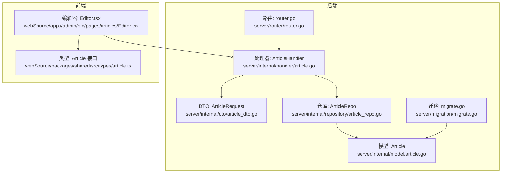
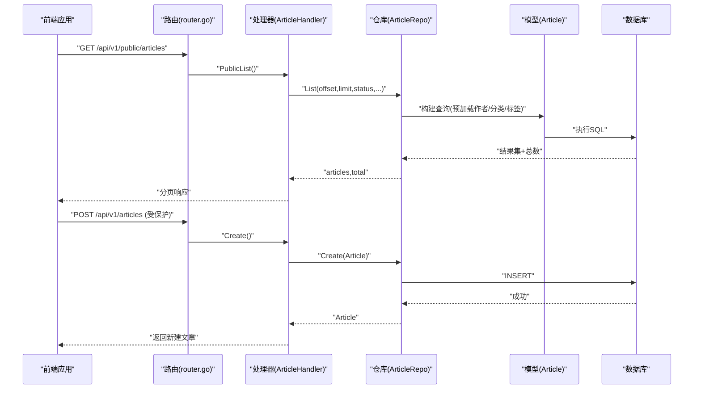
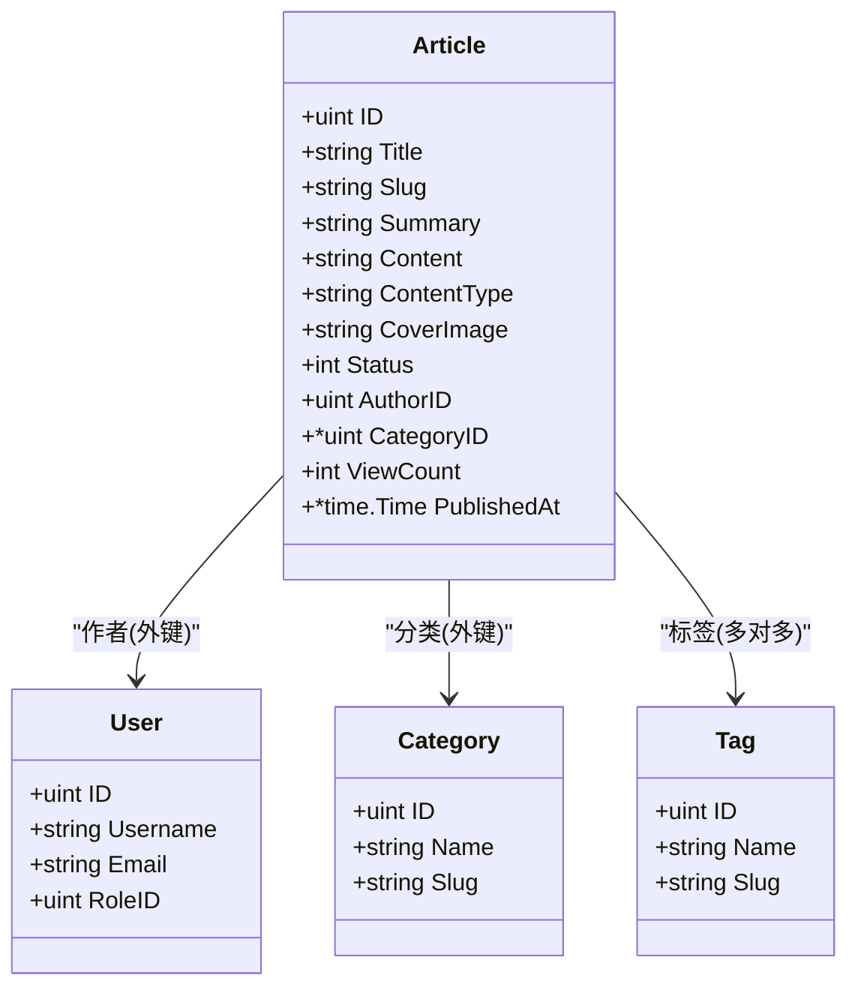

# Article文章实体

<cite>
**本文引用的文件**
- [server/internal/model/article.go](file://server/internal/model/article.go)
- [server/internal/dto/article_dto.go](file://server/internal/dto/article_dto.go)
- [server/internal/repository/article_repo.go](file://server/internal/repository/article_repo.go)
- [server/internal/handler/article.go](file://server/internal/handler/article.go)
- [server/internal/model/category.go](file://server/internal/model/category.go)
- [server/internal/model/tag.go](file://server/internal/model/tag.go)
- [server/internal/model/user.go](file://server/internal/model/user.go)
- [server/migration/migrate.go](file://server/migration/migrate.go)
- [server/router/router.go](file://server/router/router.go)
- [webSource/packages/shared/src/types/article.ts](file://webSource/packages/shared/src/types/article.ts)
- [webSource/apps/admin/src/pages/articles/Editor.tsx](file://webSource/apps/admin/src/pages/articles/Editor.tsx)
</cite>

## 目录
1. [简介](#简介)
2. [项目结构](#项目结构)
3. [核心组件](#核心组件)
4. [架构总览](#架构总览)
5. [详细组件分析](#详细组件分析)
6. [依赖分析](#依赖分析)
7. [性能考量](#性能考量)
8. [故障排查指南](#故障排查指南)
9. [结论](#结论)
10. [附录](#附录)

## 简介
本文件围绕Article文章实体进行系统化技术文档整理，覆盖字段设计、状态与内容类型管理、多对多标签关联、作者与分类的外键关系、索引与性能优化、CRUD操作流程与最佳实践、字段验证与安全注意事项，以及常见问题与解决方案。文档同时结合后端模型、仓库层、处理器层、路由层与前端类型定义，确保读者从数据库到接口再到界面的全链路理解。

## 项目结构
Article实体位于后端Go服务的模型层，配合DTO、仓库层、处理器层与路由层共同实现完整的CRUD与公开查询能力；前端共享类型与管理端编辑器页面用于校验与展示。

图表来源
- [server/internal/model/article.go:1-24](file://server/internal/model/article.go#L1-L24)
- [server/internal/dto/article_dto.go:1-44](file://server/internal/dto/article_dto.go#L1-L44)
- [server/internal/repository/article_repo.go:1-91](file://server/internal/repository/article_repo.go#L1-L91)
- [server/internal/handler/article.go:1-325](file://server/internal/handler/article.go#L1-L325)
- [server/router/router.go:1-104](file://server/router/router.go#L1-L104)
- [server/migration/migrate.go:1-126](file://server/migration/migrate.go#L1-L126)
- [webSource/packages/shared/src/types/article.ts:1-74](file://webSource/packages/shared/src/types/article.ts#L1-L74)
- [webSource/apps/admin/src/pages/articles/Editor.tsx:1-149](file://webSource/apps/admin/src/pages/articles/Editor.tsx#L1-L149)

章节来源
- [server/internal/model/article.go:1-24](file://server/internal/model/article.go#L1-L24)
- [server/router/router.go:1-104](file://server/router/router.go#L1-L104)

## 核心组件
- 模型层：Article实体定义字段、约束与关联关系，包含状态、内容类型、浏览量、发布时间等。
- DTO层：ArticleRequest定义请求体字段与绑定规则，如必填项、状态取值范围等。
- 仓库层：ArticleRepo封装增删改查、分页、统计、标签替换、浏览量自增等操作。
- 处理器层：ArticleHandler实现鉴权路由下的CRUD与状态变更，以及公开查询接口。
- 路由层：router.go注册公开与受保护的路由，绑定处理器。
- 迁移层：migrate.go自动迁移Article及相关模型。
- 前端类型：shared包中的Article接口与管理端编辑器Editor.tsx共同保证前后端字段一致与表单校验。

章节来源
- [server/internal/model/article.go:1-24](file://server/internal/model/article.go#L1-L24)
- [server/internal/dto/article_dto.go:1-44](file://server/internal/dto/article_dto.go#L1-L44)
- [server/internal/repository/article_repo.go:1-91](file://server/internal/repository/article_repo.go#L1-L91)
- [server/internal/handler/article.go:1-325](file://server/internal/handler/article.go#L1-L325)
- [server/router/router.go:1-104](file://server/router/router.go#L1-L104)
- [server/migration/migrate.go:1-126](file://server/migration/migrate.go#L1-L126)
- [webSource/packages/shared/src/types/article.ts:1-74](file://webSource/packages/shared/src/types/article.ts#L1-L74)
- [webSource/apps/admin/src/pages/articles/Editor.tsx:1-149](file://webSource/apps/admin/src/pages/articles/Editor.tsx#L1-L149)

## 架构总览
下图展示Article在系统中的端到端交互：前端通过公开或受保护路由访问后端，处理器解析请求、调用仓库层执行数据库操作，仓库层基于GORM模型完成持久化，迁移层负责初始化数据库结构。

图表来源
- [server/router/router.go:32-38](file://server/router/router.go#L32-L38)
- [server/internal/handler/article.go:31-75](file://server/internal/handler/article.go#L31-L75)
- [server/internal/handler/article.go:87-129](file://server/internal/handler/article.go#L87-L129)
- [server/internal/repository/article_repo.go:41-70](file://server/internal/repository/article_repo.go#L41-L70)
- [server/internal/model/article.go:5-23](file://server/internal/model/article.go#L5-L23)

## 详细组件分析

### 字段设计与约束
- ID 主键：自增整数，JSON序列化为数字。
- Title 标题：字符串，最大长度200，非空。
- Slug 别名：字符串，最大长度200，唯一索引，非空。
- Summary 摘要：字符串，最大长度500。
- Content 内容：长文本，存储原始内容（Markdown或富文本）。
- ContentType 内容类型：字符串，最大长度10，默认“markdown”，允许“markdown”或“richtext”。
- CoverImage 封面图：字符串，最大长度500。
- Status 状态：整数，默认0（草稿），公开查询默认仅返回1（已发布）。
- AuthorID 作者ID：整数，非空，外键关联User。
- CategoryID 分类ID：整数，可空，外键关联Category。
- ViewCount 浏览量：整数，默认0。
- PublishedAt 发布时间：时间戳，可空，用于记录首次发布时间。
- CreatedAt/UpdatedAt 时间戳：自动维护。

字段来源与约束
- [server/internal/model/article.go:5-23](file://server/internal/model/article.go#L5-L23)

章节来源
- [server/internal/model/article.go:5-23](file://server/internal/model/article.go#L5-L23)

### 关系与多对多标签
- 一对一/多对一：Article.Author(User)、Article.Category(Category)。
- 多对多：Article.Tags(Tag)，通过中间表article_tags维护。
- 预加载策略：仓库层在查询时统一预加载Author、Category、Tags，避免N+1查询。

关系与预加载
- [server/internal/model/article.go:15-18](file://server/internal/model/article.go#L15-L18)
- [server/internal/repository/article_repo.go:26](file://server/internal/repository/article_repo.go#L26)
- [server/internal/repository/article_repo.go:32](file://server/internal/repository/article_repo.go#L32)
- [server/internal/repository/article_repo.go:64](file://server/internal/repository/article_repo.go#L64)

章节来源
- [server/internal/model/article.go:15-18](file://server/internal/model/article.go#L15-L18)
- [server/internal/repository/article_repo.go:26-35](file://server/internal/repository/article_repo.go#L26-L35)
- [server/internal/repository/article_repo.go:64](file://server/internal/repository/article_repo.go#L64)

### 状态管理（草稿/已发布）
- 默认状态：创建时为草稿（0）。
- 更新状态：通过PUT /api/v1/articles/:id/status接收0/1。
- 首次设为已发布时，若PublishedAt为空则写入当前时间。
- 公开查询：默认仅返回状态为已发布的文章。

状态流转与公开过滤
- [server/internal/handler/article.go:109-111](file://server/internal/handler/article.go#L109-L111)
- [server/internal/handler/article.go:189-201](file://server/internal/handler/article.go#L189-L201)
- [server/internal/handler/article.go:211](file://server/internal/handler/article.go#L211)
- [server/internal/handler/article.go:262](file://server/internal/handler/article.go#L262)

章节来源
- [server/internal/handler/article.go:109-111](file://server/internal/handler/article.go#L109-L111)
- [server/internal/handler/article.go:189-201](file://server/internal/handler/article.go#L189-L201)
- [server/internal/handler/article.go:211](file://server/internal/handler/article.go#L211)
- [server/internal/handler/article.go:262](file://server/internal/handler/article.go#L262)

### 内容类型支持（markdown/rich text）
- 支持两种内容类型：markdown 与 richtext。
- 创建时若未指定类型，默认为“markdown”。
- 前端编辑器提供切换选项，类型变更影响内容渲染与占位提示。

内容类型处理
- [server/internal/handler/article.go:113-115](file://server/internal/handler/article.go#L113-L115)
- [webSource/apps/admin/src/pages/articles/Editor.tsx:94-97](file://webSource/apps/admin/src/pages/articles/Editor.tsx#L94-L97)
- [webSource/packages/shared/src/types/article.ts:7](file://webSource/packages/shared/src/types/article.ts#L7)

章节来源
- [server/internal/handler/article.go:113-115](file://server/internal/handler/article.go#L113-L115)
- [webSource/apps/admin/src/pages/articles/Editor.tsx:94-97](file://webSource/apps/admin/src/pages/articles/Editor.tsx#L94-L97)
- [webSource/packages/shared/src/types/article.ts:7](file://webSource/packages/shared/src/types/article.ts#L7)

### 多对多标签关联
- 请求体通过tag_ids传递标签ID集合。
- 仓库层使用Association("Tags").Replace进行标签替换，确保一致性。
- 查询时预加载Tags以避免额外查询。

标签关联与替换
- [server/internal/dto/article_dto.go:10](file://server/internal/dto/article_dto.go#L10)
- [server/internal/handler/article.go:123-126](file://server/internal/handler/article.go#L123-L126)
- [server/internal/handler/article.go:163-166](file://server/internal/handler/article.go#L163-L166)
- [server/internal/repository/article_repo.go:76-78](file://server/internal/repository/article_repo.go#L76-L78)

章节来源
- [server/internal/dto/article_dto.go:10](file://server/internal/dto/article_dto.go#L10)
- [server/internal/handler/article.go:123-126](file://server/internal/handler/article.go#L123-L126)
- [server/internal/handler/article.go:163-166](file://server/internal/handler/article.go#L163-L166)
- [server/internal/repository/article_repo.go:76-78](file://server/internal/repository/article_repo.go#L76-L78)

### 作者与分类的外键关系
- AuthorID 非空，外键指向User。
- CategoryID 可空，外键指向Category。
- 查询时统一预加载Author与Category，避免N+1。

外键与预加载
- [server/internal/model/article.go:14-17](file://server/internal/model/article.go#L14-L17)
- [server/internal/repository/article_repo.go:26](file://server/internal/repository/article_repo.go#L26)
- [server/internal/repository/article_repo.go:32](file://server/internal/repository/article_repo.go#L32)
- [server/internal/repository/article_repo.go:64](file://server/internal/repository/article_repo.go#L64)

章节来源
- [server/internal/model/article.go:14-17](file://server/internal/model/article.go#L14-L17)
- [server/internal/repository/article_repo.go:26](file://server/internal/repository/article_repo.go#L26)
- [server/internal/repository/article_repo.go:32](file://server/internal/repository/article_repo.go#L32)
- [server/internal/repository/article_repo.go:64](file://server/internal/repository/article_repo.go#L64)

### 索引设计与性能优化
- 独立索引
  - Status + PublishedAt 组合索引（命名 idx_status_pub），用于按状态与发布时间高效筛选。
  - CategoryID 单列索引，便于按分类过滤。
  - Slug 唯一索引，保障URL友好与去重。
- 预加载策略
  - 在列表与详情查询中统一预加载Author、Category、Tags，减少N+1查询。
- 浏览量自增
  - 使用UpdateColumn进行原子自增，避免并发读写竞争带来的不一致。
- 分页与排序
  - 默认按Created_at倒序，结合分页参数控制结果集大小。

索引与查询优化
- [server/internal/model/article.go:13](file://server/internal/model/article.go#L13)
- [server/internal/model/article.go:16](file://server/internal/model/article.go#L16)
- [server/internal/model/article.go:8](file://server/internal/model/article.go#L8)
- [server/internal/repository/article_repo.go:26](file://server/internal/repository/article_repo.go#L26)
- [server/internal/repository/article_repo.go:32](file://server/internal/repository/article_repo.go#L32)
- [server/internal/repository/article_repo.go:64](file://server/internal/repository/article_repo.go#L64)
- [server/internal/repository/article_repo.go:72-74](file://server/internal/repository/article_repo.go#L72-L74)

章节来源
- [server/internal/model/article.go:8](file://server/internal/model/article.go#L8)
- [server/internal/model/article.go:13](file://server/internal/model/article.go#L13)
- [server/internal/model/article.go:16](file://server/internal/model/article.go#L16)
- [server/internal/repository/article_repo.go:26](file://server/internal/repository/article_repo.go#L26)
- [server/internal/repository/article_repo.go:32](file://server/internal/repository/article_repo.go#L32)
- [server/internal/repository/article_repo.go:64](file://server/internal/repository/article_repo.go#L64)
- [server/internal/repository/article_repo.go:72-74](file://server/internal/repository/article_repo.go#L72-L74)

### CRUD操作流程与最佳实践
- 创建
  - 生成slug（若未提供），默认状态为草稿，内容类型默认“markdown”。
  - 成功后可选择性设置标签。
  - 路由：POST /api/v1/articles（需要文章创建权限）。
- 更新
  - 支持部分字段更新，必要时可更新slug、内容类型、封面图、分类与标签。
  - 路由：PUT /api/v1/articles/:id（需要文章更新权限）。
- 删除
  - 路由：DELETE /api/v1/articles/:id（需要文章删除权限）。
- 更新状态
  - 路由：PUT /api/v1/articles/:id/status（需要文章更新权限）。
- 列表与详情
  - 受保护路由：GET /api/v1/articles、GET /api/v1/articles/:id。
  - 公开路由：GET /api/v1/public/articles、GET /api/v1/public/articles/:slug、GET /api/v1/public/articles/search。

CRUD流程与路由
- [server/internal/handler/article.go:87-129](file://server/internal/handler/article.go#L87-L129)
- [server/internal/handler/article.go:131-168](file://server/internal/handler/article.go#L131-L168)
- [server/internal/handler/article.go:170-177](file://server/internal/handler/article.go#L170-L177)
- [server/internal/handler/article.go:179-202](file://server/internal/handler/article.go#L179-L202)
- [server/internal/handler/article.go:31-75](file://server/internal/handler/article.go#L31-L75)
- [server/internal/handler/article.go:77-85](file://server/internal/handler/article.go#L77-L85)
- [server/router/router.go:55-61](file://server/router/router.go#L55-L61)
- [server/router/router.go:32-38](file://server/router/router.go#L32-L38)

章节来源
- [server/internal/handler/article.go:87-129](file://server/internal/handler/article.go#L87-L129)
- [server/internal/handler/article.go:131-168](file://server/internal/handler/article.go#L131-L168)
- [server/internal/handler/article.go:170-177](file://server/internal/handler/article.go#L170-L177)
- [server/internal/handler/article.go:179-202](file://server/internal/handler/article.go#L179-L202)
- [server/internal/handler/article.go:31-75](file://server/internal/handler/article.go#L31-L75)
- [server/internal/handler/article.go:77-85](file://server/internal/handler/article.go#L77-L85)
- [server/router/router.go:55-61](file://server/router/router.go#L55-L61)
- [server/router/router.go:32-38](file://server/router/router.go#L32-L38)

### 字段验证规则与安全考虑
- 请求体验证
  - 标题与内容为必填；状态取值限定为0/1；标签ID数组为空时不会报错但会清空标签。
- 安全措施
  - 所有受保护路由均需登录认证与权限校验。
  - 公开接口仅返回已发布文章，且浏览量通过原子自增更新。
- 建议
  - 前端编辑器应限制内容长度与字符集，防止超长输入。
  - 对slug生成采用更严格的正则与保留字检查，避免冲突。

验证与安全
- [server/internal/dto/article_dto.go:3-16](file://server/internal/dto/article_dto.go#L3-L16)
- [server/router/router.go:46](file://server/router/router.go#L46)
- [server/internal/handler/article.go:315-324](file://server/internal/handler/article.go#L315-L324)

章节来源
- [server/internal/dto/article_dto.go:3-16](file://server/internal/dto/article_dto.go#L3-L16)
- [server/router/router.go:46](file://server/router/router.go#L46)
- [server/internal/handler/article.go:315-324](file://server/internal/handler/article.go#L315-L324)

### 公开查询与SEO友好
- 公开列表：仅返回已发布文章，支持按分类、关键词、标签过滤与分页。
- 按Slug查询：公开路由支持通过唯一slug访问文章，内部增加浏览量计数。
- 搜索：公开搜索接口支持关键词检索已发布文章。

公开查询流程
- [server/internal/handler/article.go:206-257](file://server/internal/handler/article.go#L206-L257)
- [server/internal/handler/article.go:259-291](file://server/internal/handler/article.go#L259-L291)
- [server/internal/handler/article.go:293-313](file://server/internal/handler/article.go#L293-L313)

章节来源
- [server/internal/handler/article.go:206-257](file://server/internal/handler/article.go#L206-L257)
- [server/internal/handler/article.go:259-291](file://server/internal/handler/article.go#L259-L291)
- [server/internal/handler/article.go:293-313](file://server/internal/handler/article.go#L293-L313)

## 依赖分析
- 模型依赖
  - Article依赖User（作者）、Category（分类）、Tag（标签，多对多）。
- 仓库依赖
  - ArticleRepo依赖gorm.DB，封装CRUD、分页、统计与标签替换。
- 处理器依赖
  - ArticleHandler依赖ArticleRepo与TagRepo，负责业务编排与HTTP响应。
- 路由依赖
  - router.go注册公开与受保护路由，绑定处理器并挂载鉴权与权限中间件。
- 前端依赖
  - shared类型与Editor表单确保前后端字段一致与表单校验。

依赖关系图

图表来源
- [server/internal/model/article.go:5-23](file://server/internal/model/article.go#L5-L23)
- [server/internal/model/user.go:5-16](file://server/internal/model/user.go#L5-L16)
- [server/internal/model/category.go:5-14](file://server/internal/model/category.go#L5-L14)
- [server/internal/model/tag.go:5-11](file://server/internal/model/tag.go#L5-L11)

章节来源
- [server/internal/model/article.go:5-23](file://server/internal/model/article.go#L5-L23)
- [server/internal/model/user.go:5-16](file://server/internal/model/user.go#L5-L16)
- [server/internal/model/category.go:5-14](file://server/internal/model/category.go#L5-L14)
- [server/internal/model/tag.go:5-11](file://server/internal/model/tag.go#L5-L11)

## 性能考量
- 索引策略
  - idx_status_pub：提升按状态与发布时间筛选效率。
  - CategoryID：提升按分类过滤效率。
  - Slug唯一索引：保障URL稳定性与去重。
- 预加载与N+1
  - 列表与详情统一预加载Author、Category、Tags，避免多次查询。
- 原子自增
  - 浏览量使用UpdateColumn进行列级更新，降低锁竞争。
- 分页与排序
  - 默认按创建时间倒序，结合分页参数控制结果集规模。

章节来源
- [server/internal/model/article.go:8](file://server/internal/model/article.go#L8)
- [server/internal/model/article.go:13](file://server/internal/model/article.go#L13)
- [server/internal/model/article.go:16](file://server/internal/model/article.go#L16)
- [server/internal/repository/article_repo.go:26](file://server/internal/repository/article_repo.go#L26)
- [server/internal/repository/article_repo.go:32](file://server/internal/repository/article_repo.go#L32)
- [server/internal/repository/article_repo.go:64](file://server/internal/repository/article_repo.go#L64)
- [server/internal/repository/article_repo.go:72-74](file://server/internal/repository/article_repo.go#L72-L74)

## 故障排查指南
- 文章不存在
  - 受保护路由与公开路由在找不到资源时返回相应错误。
- 参数错误
  - 请求体绑定失败或状态值不在允许范围内时返回错误。
- 发布时间异常
  - 更新状态为已发布时若PublishedAt为空，处理器会写入当前时间；若出现空值，检查客户端是否传入。
- 标签未生效
  - 更新文章时未传入tag_ids将导致标签被清空；确认前端提交的tag_ids数组。
- 浏览量不增长
  - 公开按Slug查询时才递增浏览量；若直接访问受保护详情接口不会自增。

章节来源
- [server/internal/handler/article.go:80-84](file://server/internal/handler/article.go#L80-L84)
- [server/internal/handler/article.go:89-92](file://server/internal/handler/article.go#L89-L92)
- [server/internal/handler/article.go:195-198](file://server/internal/handler/article.go#L195-L198)
- [server/internal/handler/article.go:163-166](file://server/internal/handler/article.go#L163-L166)
- [server/internal/handler/article.go:267-268](file://server/internal/handler/article.go#L267-L268)

## 结论
Article实体通过清晰的字段设计、明确的状态与内容类型管理、完善的多对多标签关联以及合理的索引与预加载策略，在保证功能完整性的同时兼顾了性能与可维护性。结合受保护与公开路由、权限中间件与前端类型约束，形成从前端到数据库的完整闭环。

## 附录
- 数据库迁移
  - Article模型随AutoMigrate一起初始化，确保Schema与索引同步。
- 前端类型与表单
  - shared类型定义与管理端编辑器表单共同确保字段一致性与表单校验。

章节来源
- [server/migration/migrate.go:13-38](file://server/migration/migrate.go#L13-L38)
- [webSource/packages/shared/src/types/article.ts:1-74](file://webSource/packages/shared/src/types/article.ts#L1-L74)
- [webSource/apps/admin/src/pages/articles/Editor.tsx:1-149](file://webSource/apps/admin/src/pages/articles/Editor.tsx#L1-L149)