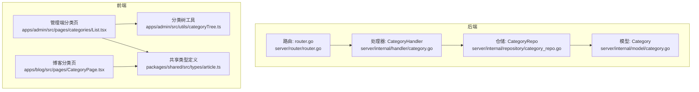
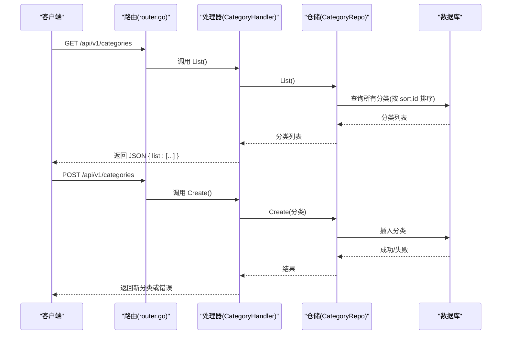
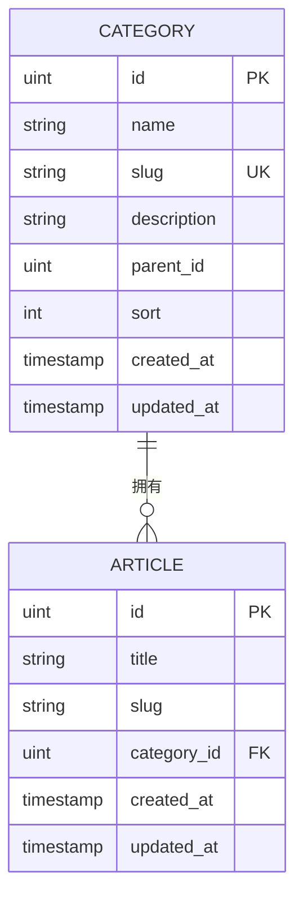
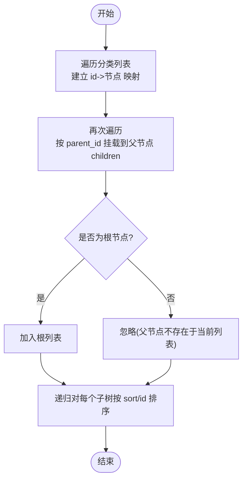
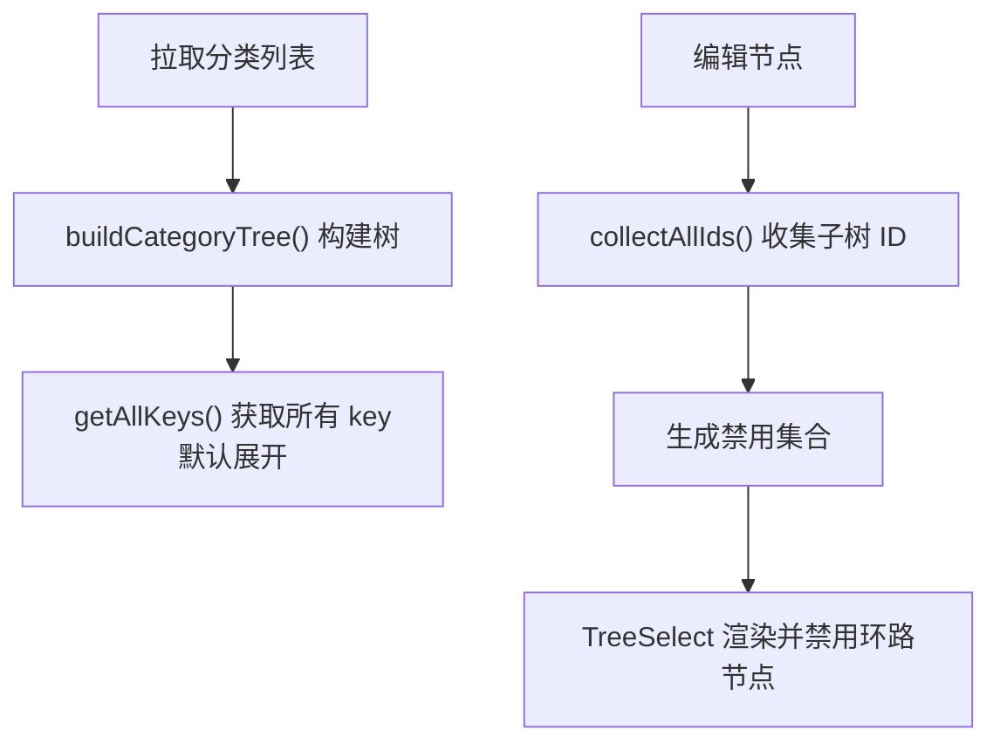
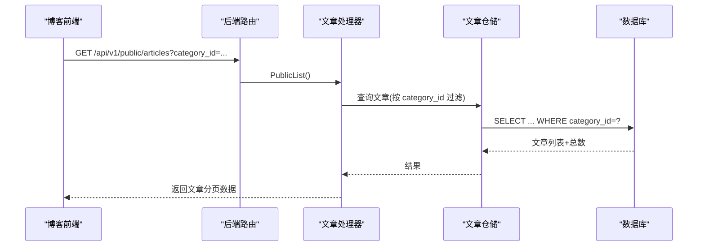
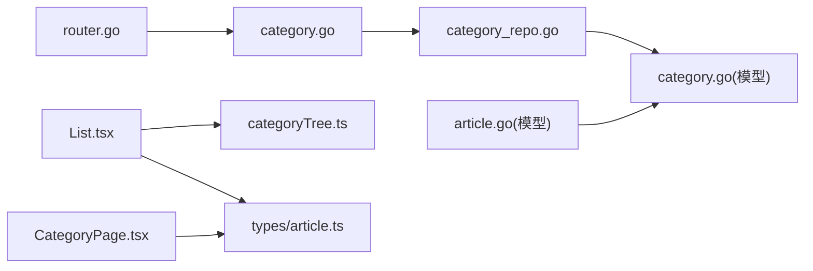

# Category分类实体

<cite>
**本文引用的文件**
- [server/internal/model/category.go](file://server/internal/model/category.go)
- [server/internal/repository/category_repo.go](file://server/internal/repository/category_repo.go)
- [server/internal/handler/category.go](file://server/internal/handler/category.go)
- [server/internal/model/article.go](file://server/internal/model/article.go)
- [webSource/apps/admin/src/utils/categoryTree.ts](file://webSource/apps/admin/src/utils/categoryTree.ts)
- [webSource/apps/admin/src/pages/categories/List.tsx](file://webSource/apps/admin/src/pages/categories/List.tsx)
- [webSource/apps/blog/src/pages/CategoryPage.tsx](file://webSource/apps/blog/src/pages/CategoryPage.tsx)
- [server/router/router.go](file://server/router/router.go)
- [webSource/packages/shared/src/types/article.ts](file://webSource/packages/shared/src/types/article.ts)
</cite>

## 目录
1. [简介](#简介)
2. [项目结构](#项目结构)
3. [核心组件](#核心组件)
4. [架构总览](#架构总览)
5. [详细组件分析](#详细组件分析)
6. [依赖分析](#依赖分析)
7. [性能考虑](#性能考虑)
8. [故障排查指南](#故障排查指南)
9. [结论](#结论)
10. [附录](#附录)

## 简介
本文件围绕 Category 分类实体进行系统化技术说明，涵盖字段设计、层级结构与树形实现、分类导航生成算法、与文章的多对一关系、分类统计能力、以及前后端交互流程。同时提供创建、编辑、删除、层级查询的代码示例路径与最佳实践建议。

## 项目结构
后端采用分层架构：模型(Model)、仓储(Repository)、处理器(Handler)、路由(Router)；前端使用 React + TypeScript，共享类型定义位于 packages/shared。

图表来源
- [server/internal/model/category.go:1-15](file://server/internal/model/category.go#L1-L15)
- [server/internal/repository/category_repo.go:1-51](file://server/internal/repository/category_repo.go#L1-L51)
- [server/internal/handler/category.go:1-90](file://server/internal/handler/category.go#L1-L90)
- [server/router/router.go:1-104](file://server/router/router.go#L1-L104)
- [webSource/apps/admin/src/pages/categories/List.tsx:1-215](file://webSource/apps/admin/src/pages/categories/List.tsx#L1-L215)
- [webSource/apps/admin/src/utils/categoryTree.ts:1-52](file://webSource/apps/admin/src/utils/categoryTree.ts#L1-L52)
- [webSource/apps/blog/src/pages/CategoryPage.tsx:1-45](file://webSource/apps/blog/src/pages/CategoryPage.tsx#L1-L45)
- [webSource/packages/shared/src/types/article.ts:1-74](file://webSource/packages/shared/src/types/article.ts#L1-L74)

章节来源
- [server/internal/model/category.go:1-15](file://server/internal/model/category.go#L1-L15)
- [server/internal/repository/category_repo.go:1-51](file://server/internal/repository/category_repo.go#L1-L51)
- [server/internal/handler/category.go:1-90](file://server/internal/handler/category.go#L1-L90)
- [server/router/router.go:1-104](file://server/router/router.go#L1-L104)
- [webSource/apps/admin/src/pages/categories/List.tsx:1-215](file://webSource/apps/admin/src/pages/categories/List.tsx#L1-L215)
- [webSource/apps/admin/src/utils/categoryTree.ts:1-52](file://webSource/apps/admin/src/utils/categoryTree.ts#L1-L52)
- [webSource/apps/blog/src/pages/CategoryPage.tsx:1-45](file://webSource/apps/blog/src/pages/CategoryPage.tsx#L1-L45)
- [webSource/packages/shared/src/types/article.ts:1-74](file://webSource/packages/shared/src/types/article.ts#L1-L74)

## 核心组件
- 模型(Category)
  - 字段：ID 主键、Name 名称、Slug 别名、Description 描述、ParentID 父分类 ID（可空）、Sort 排序、CreatedAt/UpdatedAt 时间戳
  - 约束：Slug 唯一索引；ParentID 建有索引；Sort 默认值 0
- 仓储(CategoryRepo)
  - 提供 Create/Update/Delete/FindByID/List/Count 等方法，删除时检查是否存在关联文章
- 处理器(CategoryHandler)
  - 对外暴露 CRUD 接口，绑定请求体 DTO，调用仓储并返回统一响应
- 路由(router.go)
  - 定义公开分类列表接口与鉴权后的分类 CRUD 路由
- 前端
  - 管理端：分类树渲染、增删改查、禁用环路选择
  - 博客端：按分类 ID 查询文章列表，展示分类名称
  - 工具：分类树构建、收集子节点 ID、生成 keys

章节来源
- [server/internal/model/category.go:5-14](file://server/internal/model/category.go#L5-L14)
- [server/internal/repository/category_repo.go:16-32](file://server/internal/repository/category_repo.go#L16-L32)
- [server/internal/handler/category.go:32-89](file://server/internal/handler/category.go#L32-L89)
- [server/router/router.go:40-42](file://server/router/router.go#L40-L42)
- [webSource/apps/admin/src/pages/categories/List.tsx:22-85](file://webSource/apps/admin/src/pages/categories/List.tsx#L22-L85)
- [webSource/apps/blog/src/pages/CategoryPage.tsx:9-29](file://webSource/apps/blog/src/pages/CategoryPage.tsx#L9-L29)
- [webSource/apps/admin/src/utils/categoryTree.ts:7-31](file://webSource/apps/admin/src/utils/categoryTree.ts#L7-L31)

## 架构总览
后端通过 Gin 路由分发到 CategoryHandler，Handler 调用 CategoryRepo 访问数据库；前端管理端使用分类树工具将扁平列表转换为树形结构，博客端根据分类 ID 查询文章列表。

图表来源
- [server/router/router.go:40-42](file://server/router/router.go#L40-L42)
- [server/internal/handler/category.go:23-52](file://server/internal/handler/category.go#L23-L52)
- [server/internal/repository/category_repo.go:40-44](file://server/internal/repository/category_repo.go#L40-L44)

## 详细组件分析

### 数据模型与字段设计
- 字段语义
  - ID：自增主键
  - Name：分类名称，最大长度 50，必填
  - Slug：URL 友好的别名，唯一索引，最大长度 50，必填
  - Description：描述，最大长度 200
  - ParentID：父分类 ID，支持空值，建立索引便于层级查询
  - Sort：排序权重，默认 0，用于稳定排序
  - CreatedAt/UpdatedAt：自动维护时间戳
- 关系映射
  - 文章与分类：Article.CategoryID -> Category.ID（多对一）

图表来源
- [server/internal/model/category.go:5-14](file://server/internal/model/category.go#L5-L14)
- [server/internal/model/article.go:15-18](file://server/internal/model/article.go#L15-L18)

章节来源
- [server/internal/model/category.go:5-14](file://server/internal/model/category.go#L5-L14)
- [server/internal/model/article.go:5-24](file://server/internal/model/article.go#L5-L24)

### 层级结构与树形实现
- 设计要点
  - 使用 ParentID 表达父子关系，根节点 ParentID 为空
  - 通过索引提升层级查询效率
  - 后端返回扁平列表，前端构建树形结构
- 树构建算法
  - 步骤
    1) 建立 id 到节点的映射
    2) 遍历一次，将每个节点挂到其父节点 children 下；若无父节点或父节点不存在，则作为根节点
    3) 对每个节点子树进行排序（先按 sort 再按 id）
  - 时间复杂度：O(n)，空间复杂度：O(n)

图表来源
- [webSource/apps/admin/src/utils/categoryTree.ts:7-31](file://webSource/apps/admin/src/utils/categoryTree.ts#L7-L31)

章节来源
- [webSource/apps/admin/src/utils/categoryTree.ts:7-31](file://webSource/apps/admin/src/utils/categoryTree.ts#L7-L31)

### 分类导航生成算法
- 算法目标：在管理端以树形控件展示分类，支持展开/折叠、父子联动禁选、快速定位
- 实现思路
  - 使用扁平数据构建树，生成所有节点 key 列表用于控制展开
  - 在编辑时，禁止将节点移动到其子孙节点下（通过收集被选中节点及其子树 ID 并禁用）
  - TreeSelect 的数据源基于树结构，结合禁用集合动态生成
- 辅助函数
  - 收集子树所有 ID：用于禁选环路
  - 生成所有 keys：用于默认展开全部

图表来源
- [webSource/apps/admin/src/pages/categories/List.tsx:22-36](file://webSource/apps/admin/src/pages/categories/List.tsx#L22-L36)
- [webSource/apps/admin/src/pages/categories/List.tsx:87-109](file://webSource/apps/admin/src/pages/categories/List.tsx#L87-L109)
- [webSource/apps/admin/src/utils/categoryTree.ts:33-51](file://webSource/apps/admin/src/utils/categoryTree.ts#L33-L51)

章节来源
- [webSource/apps/admin/src/pages/categories/List.tsx:22-36](file://webSource/apps/admin/src/pages/categories/List.tsx#L22-L36)
- [webSource/apps/admin/src/pages/categories/List.tsx:87-109](file://webSource/apps/admin/src/pages/categories/List.tsx#L87-L109)
- [webSource/apps/admin/src/utils/categoryTree.ts:33-51](file://webSource/apps/admin/src/utils/categoryTree.ts#L33-L51)

### 分类与文章的多对一关系
- 关系说明
  - 文章模型包含 CategoryID 外键，指向分类主键
  - 一个分类可对应多个文章
- 查询策略
  - 博客端：按分类 ID 查询文章列表，支持分页
  - 后端：文章查询接口支持 category_id 过滤
- 删除保护
  - 仓储在删除分类前检查是否存在关联文章，避免破坏外键约束

图表来源
- [server/router/router.go:32-38](file://server/router/router.go#L32-L38)
- [webSource/apps/blog/src/pages/CategoryPage.tsx:18-22](file://webSource/apps/blog/src/pages/CategoryPage.tsx#L18-L22)

章节来源
- [server/internal/model/article.go:15-18](file://server/internal/model/article.go#L15-L18)
- [server/router/router.go:32-38](file://server/router/router.go#L32-L38)
- [webSource/apps/blog/src/pages/CategoryPage.tsx:18-22](file://webSource/apps/blog/src/pages/CategoryPage.tsx#L18-L22)

### 分类统计功能
- 当前实现
  - 后端未提供分类文章数统计接口
  - 前端共享类型中 Category 定义了 article_count 字段，但当前未填充
- 建议扩展
  - 后端在分类列表接口中增加聚合统计（如按分类分组统计文章数量）
  - 前端接收 article_count 并展示在树节点或侧边栏

章节来源
- [webSource/packages/shared/src/types/article.ts:22-33](file://webSource/packages/shared/src/types/article.ts#L22-L33)

### CRUD 与层级查询示例（代码片段路径）
- 创建分类
  - 路由：POST /api/v1/categories
  - 处理器：CategoryHandler.Create
  - 仓储：CategoryRepo.Create
  - 示例路径：[server/router/router.go:64](file://server/router/router.go#L64)，[server/internal/handler/category.go:32-52](file://server/internal/handler/category.go#L32-L52)，[server/internal/repository/category_repo.go:16](file://server/internal/repository/category_repo.go#L16)
- 编辑分类
  - 路由：PUT /api/v1/categories/:id
  - 处理器：CategoryHandler.Update
  - 仓储：CategoryRepo.Update
  - 示例路径：[server/router/router.go:65](file://server/router/router.go#L65)，[server/internal/handler/category.go:54-76](file://server/internal/handler/category.go#L54-L76)，[server/internal/repository/category_repo.go:20](file://server/internal/repository/category_repo.go#L20)
- 删除分类
  - 路由：DELETE /api/v1/categories/:id
  - 处理器：CategoryHandler.Delete
  - 仓储：CategoryRepo.Delete（含外键约束检查）
  - 示例路径：[server/router/router.go:66](file://server/router/router.go#L66)，[server/internal/handler/category.go:78-89](file://server/internal/handler/category.go#L78-L89)，[server/internal/repository/category_repo.go:24-32](file://server/internal/repository/category_repo.go#L24-L32)
- 层级查询（列表）
  - 路由：GET /api/v1/categories
  - 处理器：CategoryHandler.List
  - 仓储：CategoryRepo.List（按 sort、id 排序）
  - 示例路径：[server/router/router.go:41](file://server/router/router.go#L41)，[server/internal/handler/category.go:23-30](file://server/internal/handler/category.go#L23-L30)，[server/internal/repository/category_repo.go:40-44](file://server/internal/repository/category_repo.go#L40-L44)

章节来源
- [server/router/router.go:41-66](file://server/router/router.go#L41-L66)
- [server/internal/handler/category.go:23-89](file://server/internal/handler/category.go#L23-L89)
- [server/internal/repository/category_repo.go:16-44](file://server/internal/repository/category_repo.go#L16-L44)

### 前端分类展示最佳实践
- 管理端
  - 使用 Tree 组件展示树形结构，TreeSelect 选择父分类时禁用环路
  - 默认展开全部，便于操作
  - 示例路径：[webSource/apps/admin/src/pages/categories/List.tsx:127-178](file://webSource/apps/admin/src/pages/categories/List.tsx#L127-L178)，[webSource/apps/admin/src/utils/categoryTree.ts:7-31](file://webSource/apps/admin/src/utils/categoryTree.ts#L7-L31)
- 博客端
  - 侧边栏加载分类列表，用于导航
  - 分类详情页按分类 ID 查询文章列表并分页展示
  - 示例路径：[webSource/apps/blog/src/pages/CategoryPage.tsx:11-29](file://webSource/apps/blog/src/pages/CategoryPage.tsx#L11-L29)

章节来源
- [webSource/apps/admin/src/pages/categories/List.tsx:127-178](file://webSource/apps/admin/src/pages/categories/List.tsx#L127-L178)
- [webSource/apps/admin/src/utils/categoryTree.ts:7-31](file://webSource/apps/admin/src/utils/categoryTree.ts#L7-L31)
- [webSource/apps/blog/src/pages/CategoryPage.tsx:11-29](file://webSource/apps/blog/src/pages/CategoryPage.tsx#L11-L29)

## 依赖分析
- 后端依赖链
  - 路由 -> 处理器 -> 仓储 -> 模型
  - 文章模型依赖分类模型（外键）
- 前端依赖链
  - 管理端页面 -> 分类树工具 -> 共享类型
  - 博客端页面 -> 共享类型

图表来源
- [server/router/router.go:11-23](file://server/router/router.go#L11-L23)
- [server/internal/handler/category.go:15-21](file://server/internal/handler/category.go#L15-L21)
- [server/internal/repository/category_repo.go:8-14](file://server/internal/repository/category_repo.go#L8-L14)
- [server/internal/model/category.go:5-14](file://server/internal/model/category.go#L5-L14)
- [server/internal/model/article.go:15-18](file://server/internal/model/article.go#L15-L18)
- [webSource/apps/admin/src/pages/categories/List.tsx:10](file://webSource/apps/admin/src/pages/categories/List.tsx#L10)
- [webSource/apps/admin/src/utils/categoryTree.ts:1](file://webSource/apps/admin/src/utils/categoryTree.ts#L1)
- [webSource/packages/shared/src/types/article.ts:22-33](file://webSource/packages/shared/src/types/article.ts#L22-L33)
- [webSource/apps/blog/src/pages/CategoryPage.tsx:7](file://webSource/apps/blog/src/pages/CategoryPage.tsx#L7)

章节来源
- [server/router/router.go:11-23](file://server/router/router.go#L11-L23)
- [server/internal/handler/category.go:15-21](file://server/internal/handler/category.go#L15-L21)
- [server/internal/repository/category_repo.go:8-14](file://server/internal/repository/category_repo.go#L8-L14)
- [server/internal/model/category.go:5-14](file://server/internal/model/category.go#L5-L14)
- [server/internal/model/article.go:15-18](file://server/internal/model/article.go#L15-L18)
- [webSource/apps/admin/src/pages/categories/List.tsx:10](file://webSource/apps/admin/src/pages/categories/List.tsx#L10)
- [webSource/apps/admin/src/utils/categoryTree.ts:1](file://webSource/apps/admin/src/utils/categoryTree.ts#L1)
- [webSource/packages/shared/src/types/article.ts:22-33](file://webSource/packages/shared/src/types/article.ts#L22-L33)
- [webSource/apps/blog/src/pages/CategoryPage.tsx:7](file://webSource/apps/blog/src/pages/CategoryPage.tsx#L7)

## 性能考虑
- 数据库层面
  - 为 ParentID 建索引，加速层级查询与更新
  - 为 Slug 建唯一索引，保证 URL 友好且去重
  - 列表查询按 sort、id 排序，确保稳定展示顺序
- 业务层面
  - 删除分类前检查关联文章，避免无效删除尝试
- 前端层面
  - 树构建为单次遍历 O(n)，适合大数据量
  - TreeSelect 使用禁用集合避免环路选择，减少无效交互
- 建议优化
  - 分类列表接口增加 article_count 聚合统计，减少二次查询
  - 分类树构建结果可缓存，避免重复计算

章节来源
- [server/internal/model/category.go:10](file://server/internal/model/category.go#L10)
- [server/internal/repository/category_repo.go:24-32](file://server/internal/repository/category_repo.go#L24-L32)
- [webSource/apps/admin/src/utils/categoryTree.ts:7-31](file://webSource/apps/admin/src/utils/categoryTree.ts#L7-L31)

## 故障排查指南
- 删除分类报错“该分类下存在文章”
  - 触发条件：分类仍有文章关联
  - 解决方案：先迁移或删除该分类下的文章，再执行删除
  - 参考路径：[server/internal/handler/category.go:78-89](file://server/internal/handler/category.go#L78-L89)，[server/internal/repository/category_repo.go:24-32](file://server/internal/repository/category_repo.go#L24-L32)
- 分类树显示异常或父子关系错乱
  - 检查 ParentID 是否正确，确认树构建逻辑
  - 参考路径：[webSource/apps/admin/src/utils/categoryTree.ts:7-31](file://webSource/apps/admin/src/utils/categoryTree.ts#L7-L31)
- 分类详情页无文章
  - 检查文章是否发布、是否属于该分类、分页参数是否正确
  - 参考路径：[webSource/apps/blog/src/pages/CategoryPage.tsx:18-22](file://webSource/apps/blog/src/pages/CategoryPage.tsx#L18-L22)

章节来源
- [server/internal/handler/category.go:78-89](file://server/internal/handler/category.go#L78-L89)
- [server/internal/repository/category_repo.go:24-32](file://server/internal/repository/category_repo.go#L24-L32)
- [webSource/apps/admin/src/utils/categoryTree.ts:7-31](file://webSource/apps/admin/src/utils/categoryTree.ts#L7-L31)
- [webSource/apps/blog/src/pages/CategoryPage.tsx:18-22](file://webSource/apps/blog/src/pages/CategoryPage.tsx#L18-L22)

## 结论
本项目对 Category 分类实体的设计清晰、扩展性强：通过 ParentID 实现灵活的层级结构，配合前端树形渲染与禁选环路机制，满足管理端的复杂操作需求；后端提供稳定的 CRUD 与层级查询接口，前端在博客端按分类 ID 查询文章列表，形成完整的分类体系。建议后续补充分类统计与缓存策略，进一步提升性能与用户体验。

## 附录
- 路由定义参考：[server/router/router.go:40-66](file://server/router/router.go#L40-L66)
- 分类模型定义：[server/internal/model/category.go:5-14](file://server/internal/model/category.go#L5-L14)
- 文章模型与分类关系：[server/internal/model/article.go:15-18](file://server/internal/model/article.go#L15-L18)
- 管理端分类页：[webSource/apps/admin/src/pages/categories/List.tsx:22-85](file://webSource/apps/admin/src/pages/categories/List.tsx#L22-L85)
- 博客端分类页：[webSource/apps/blog/src/pages/CategoryPage.tsx:18-29](file://webSource/apps/blog/src/pages/CategoryPage.tsx#L18-L29)
- 分类树工具：[webSource/apps/admin/src/utils/categoryTree.ts:7-31](file://webSource/apps/admin/src/utils/categoryTree.ts#L7-L31)