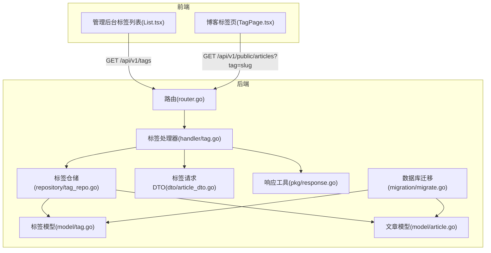
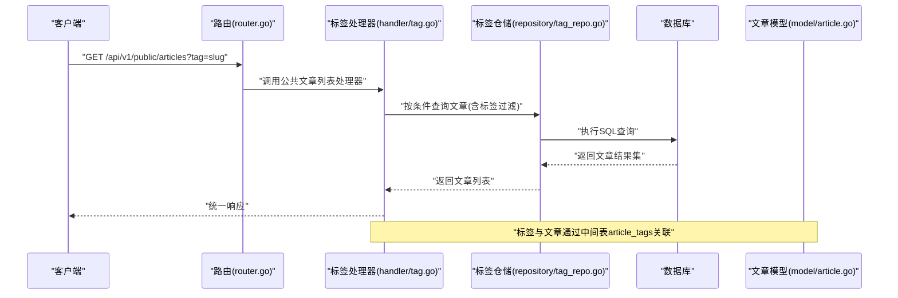
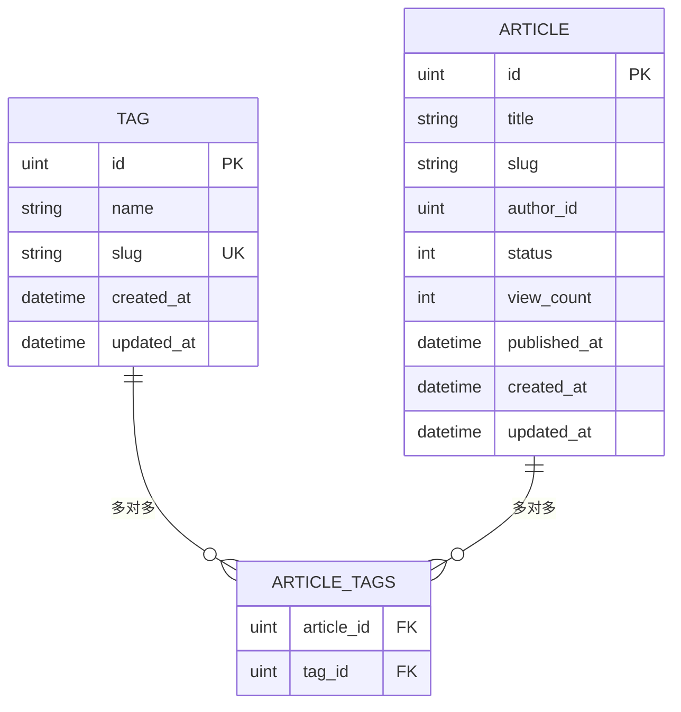
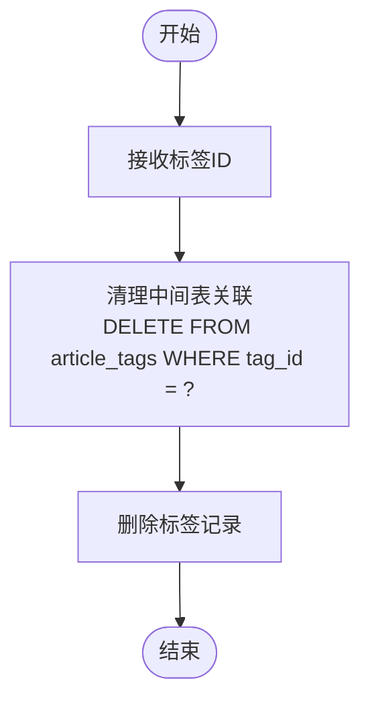
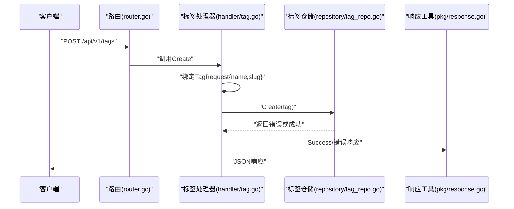
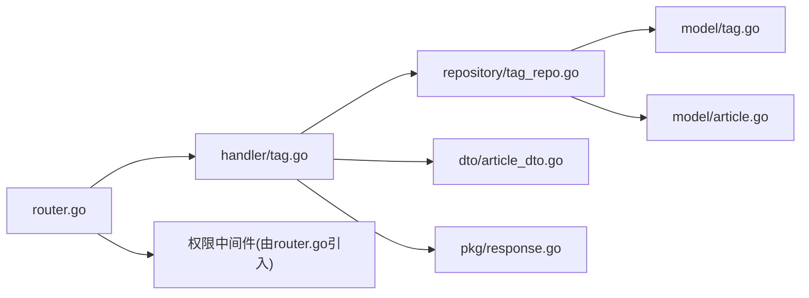

# 标签实体

<cite>
**本文引用的文件**
- [server/internal/model/tag.go](file://server/internal/model/tag.go)
- [server/internal/model/article.go](file://server/internal/model/article.go)
- [server/internal/repository/tag_repo.go](file://server/internal/repository/tag_repo.go)
- [server/internal/handler/tag.go](file://server/internal/handler/tag.go)
- [server/internal/dto/article_dto.go](file://server/internal/dto/article_dto.go)
- [server/router/router.go](file://server/router/router.go)
- [server/migration/migrate.go](file://server/migration/migrate.go)
- [server/internal/pkg/response.go](file://server/internal/pkg/response.go)
- [webSource/apps/admin/src/pages/tags/List.tsx](file://webSource/apps/admin/src/pages/tags/List.tsx)
- [webSource/apps/blog/src/pages/TagPage.tsx](file://webSource/apps/blog/src/pages/TagPage.tsx)
</cite>

## 目录
1. [简介](#简介)
2. [项目结构](#项目结构)
3. [核心组件](#核心组件)
4. [架构总览](#架构总览)
5. [详细组件分析](#详细组件分析)
6. [依赖分析](#依赖分析)
7. [性能考虑](#性能考虑)
8. [故障排查指南](#故障排查指南)
9. [结论](#结论)
10. [附录](#附录)

## 简介
本技术文档围绕“标签(Tag)”实体展开，系统性阐述其数据模型、字段约束、与文章的多对多关联、统计与标签云生成思路、创建/搜索/去重机制，以及完整的管理实现示例（新增、修改、删除、批量操作建议）。同时给出数据库索引优化、查询性能提升策略，以及前端标签展示的实现方案。

## 项目结构
后端采用分层架构：路由层负责请求映射；处理器层处理业务流程；仓储层封装数据库访问；模型层定义数据结构；迁移脚本完成数据库初始化。前端分为管理后台与博客前台两套应用，分别负责标签管理与标签页展示。

图表来源
- [server/router/router.go:11-104](file://server/router/router.go#L11-L104)
- [server/internal/handler/tag.go:15-75](file://server/internal/handler/tag.go#L15-L75)
- [server/internal/repository/tag_repo.go:8-56](file://server/internal/repository/tag_repo.go#L8-L56)
- [server/internal/model/tag.go:5-11](file://server/internal/model/tag.go#L5-L11)
- [server/internal/model/article.go:18](file://server/internal/model/article.go#L18)
- [server/internal/dto/article_dto.go:26-29](file://server/internal/dto/article_dto.go#L26-L29)
- [server/internal/pkg/response.go:22-70](file://server/internal/pkg/response.go#L22-L70)
- [server/migration/migrate.go:13-38](file://server/migration/migrate.go#L13-L38)
- [webSource/apps/admin/src/pages/tags/List.tsx:20-32](file://webSource/apps/admin/src/pages/tags/List.tsx#L20-L32)
- [webSource/apps/blog/src/pages/TagPage.tsx:16-22](file://webSource/apps/blog/src/pages/TagPage.tsx#L16-L22)

章节来源
- [server/router/router.go:11-104](file://server/router/router.go#L11-L104)
- [server/migration/migrate.go:13-38](file://server/migration/migrate.go#L13-L38)

## 核心组件
- 数据模型
  - 标签模型包含ID主键、名称、别名、创建/更新时间等字段，并在数据库层面设置唯一索引以保证别名唯一性。
  - 文章模型通过多对多关联声明与标签建立中间表连接。
- 仓储层
  - 提供创建、更新、删除、按ID查询、按ID集合查询、列表查询、计数等方法；删除时先清理中间表关联再删除标签记录。
- 处理器层
  - 对外暴露标签列表、创建、更新、删除接口；参数绑定使用标签请求DTO；统一返回响应格式。
- 路由层
  - 暴露公开标签列表接口给博客前端；管理端提供CRUD接口并受鉴权与权限控制。
- 前端
  - 管理后台标签列表页面支持增删改查；博客标签页根据URL参数查询对应标签的文章列表。

章节来源
- [server/internal/model/tag.go:5-11](file://server/internal/model/tag.go#L5-L11)
- [server/internal/model/article.go:18](file://server/internal/model/article.go#L18)
- [server/internal/repository/tag_repo.go:16-55](file://server/internal/repository/tag_repo.go#L16-L55)
- [server/internal/handler/tag.go:23-74](file://server/internal/handler/tag.go#L23-L74)
- [server/internal/dto/article_dto.go:26-29](file://server/internal/dto/article_dto.go#L26-L29)
- [server/router/router.go:40-72](file://server/router/router.go#L40-L72)
- [webSource/apps/admin/src/pages/tags/List.tsx:20-68](file://webSource/apps/admin/src/pages/tags/List.tsx#L20-L68)
- [webSource/apps/blog/src/pages/TagPage.tsx:16-22](file://webSource/apps/blog/src/pages/TagPage.tsx#L16-L22)

## 架构总览
下图展示了从HTTP请求到数据库访问再到响应返回的整体流程，以及标签与文章的多对多关联路径。

图表来源
- [server/router/router.go:32-38](file://server/router/router.go#L32-L38)
- [server/internal/handler/tag.go:23-30](file://server/internal/handler/tag.go#L23-L30)
- [server/internal/repository/tag_repo.go:36-49](file://server/internal/repository/tag_repo.go#L36-L49)
- [server/internal/model/article.go:18](file://server/internal/model/article.go#L18)

## 详细组件分析

### 数据模型与字段设计
- 字段说明
  - ID：自增主键，JSON序列化输出。
  - Name：标签名称，长度限制与非空约束。
  - Slug：标签别名，长度限制、唯一索引、非空约束，用于SEO友好链接与前端路由。
  - CreatedAt/UpdatedAt：时间戳，自动维护。
- 约束与索引
  - Slug字段具备唯一索引，确保全局唯一性，避免重复与冲突。
  - Article模型中通过多对多注解声明与Tag建立中间表关联，形成article_tags表。

图表来源
- [server/internal/model/tag.go:5-11](file://server/internal/model/tag.go#L5-L11)
- [server/internal/model/article.go:18](file://server/internal/model/article.go#L18)

章节来源
- [server/internal/model/tag.go:5-11](file://server/internal/model/tag.go#L5-L11)
- [server/internal/model/article.go:18](file://server/internal/model/article.go#L18)

### 仓储层实现与中间表清理
- 关键方法
  - Create：创建新标签。
  - Update：更新标签信息。
  - Delete：删除标签前先清理中间表关联，再删除标签记录。
  - FindByID/FindByIDs：按单个或多个ID查询标签。
  - List/Count：列出所有标签及总数。
- 中间表清理
  - 删除逻辑显式执行中间表清理，避免外键约束导致的删除失败。

图表来源
- [server/internal/repository/tag_repo.go:24-28](file://server/internal/repository/tag_repo.go#L24-L28)

章节来源
- [server/internal/repository/tag_repo.go:16-55](file://server/internal/repository/tag_repo.go#L16-L55)

### 处理器层与请求绑定
- 接口职责
  - List：返回标签列表。
  - Create：接收标签请求DTO，创建标签并返回。
  - Update：按ID查找标签，校验存在性，绑定请求DTO后保存。
  - Delete：按ID删除标签。
- 请求DTO
  - 标签请求DTO包含名称与别名两个字段，均要求必填。

图表来源
- [server/router/router.go:68-71](file://server/router/router.go#L68-L71)
- [server/internal/handler/tag.go:32-45](file://server/internal/handler/tag.go#L32-L45)
- [server/internal/dto/article_dto.go:26-29](file://server/internal/dto/article_dto.go#L26-L29)
- [server/internal/pkg/response.go:22-41](file://server/internal/pkg/response.go#L22-L41)

章节来源
- [server/internal/handler/tag.go:23-74](file://server/internal/handler/tag.go#L23-L74)
- [server/internal/dto/article_dto.go:26-29](file://server/internal/dto/article_dto.go#L26-L29)
- [server/internal/pkg/response.go:22-70](file://server/internal/pkg/response.go#L22-L70)

### 路由与权限控制
- 公开接口
  - GET /api/v1/categories：分类列表
  - GET /api/v1/tags：标签列表（公开）
- 管理接口
  - POST/PUT/DELETE /api/v1/tags：受鉴权与权限控制，模块为tag，动作分别为create、update、delete。

章节来源
- [server/router/router.go:40-72](file://server/router/router.go#L40-L72)

### 前端实现方案
- 管理后台
  - 标签列表页面支持加载、新增、编辑、删除；提交时调用后端REST接口；删除成功后刷新列表。
- 博客前端
  - 标签页根据URL参数中的slug查询对应标签下的文章列表，并支持分页。

章节来源
- [webSource/apps/admin/src/pages/tags/List.tsx:20-68](file://webSource/apps/admin/src/pages/tags/List.tsx#L20-L68)
- [webSource/apps/blog/src/pages/TagPage.tsx:16-22](file://webSource/apps/blog/src/pages/TagPage.tsx#L16-L22)

## 依赖分析
- 组件耦合
  - 路由层仅负责请求转发，不直接操作数据，保持低耦合。
  - 处理器层依赖仓储层，仓储层依赖GORM进行数据库访问。
  - 文章模型与标签模型通过多对多注解建立关联，形成中间表。
- 外部依赖
  - Gin框架提供HTTP路由与中间件能力。
  - GORM提供ORM映射与数据库迁移能力。

图表来源
- [server/router/router.go:11-104](file://server/router/router.go#L11-L104)
- [server/internal/handler/tag.go:15-21](file://server/internal/handler/tag.go#L15-L21)
- [server/internal/repository/tag_repo.go:8-14](file://server/internal/repository/tag_repo.go#L8-L14)
- [server/internal/model/tag.go:5-11](file://server/internal/model/tag.go#L5-L11)
- [server/internal/model/article.go:18](file://server/internal/model/article.go#L18)
- [server/internal/dto/article_dto.go:26-29](file://server/internal/dto/article_dto.go#L26-L29)
- [server/internal/pkg/response.go:22-70](file://server/internal/pkg/response.go#L22-L70)

## 性能考虑
- 索引优化
  - Slug字段具备唯一索引，适合高频等值查询与去重场景。
  - 文章状态与发布时间建立复合索引，有利于筛选已发布文章与分页查询。
- 查询优化
  - 列表查询按ID升序排序，便于分页与缓存命中。
  - 批量查询按ID集合查询，减少多次往返。
- 缓存策略
  - 标签列表可缓存短期有效数据，降低数据库压力。
  - 标签云生成可基于聚合统计结果缓存，定时刷新。
- 分页与限制
  - 合理设置每页大小上限，避免大页扫描造成延迟。

章节来源
- [server/internal/model/tag.go:8](file://server/internal/model/tag.go#L8)
- [server/internal/model/article.go:13](file://server/internal/model/article.go#L13)
- [server/internal/repository/tag_repo.go:45-49](file://server/internal/repository/tag_repo.go#L45-L49)

## 故障排查指南
- 创建/更新失败
  - 检查请求DTO绑定是否正确，确认必填字段已提供。
  - 关注唯一索引冲突（如slug重复）导致的写入异常。
- 删除失败
  - 确认是否存在文章关联；仓储层会先清理中间表再删除标签，若仍失败检查外键约束与事务。
- 查询异常
  - 检查路由映射是否正确，确认请求路径与权限中间件配置。
  - 使用统一响应工具定位错误码与消息。

章节来源
- [server/internal/handler/tag.go:32-45](file://server/internal/handler/tag.go#L32-L45)
- [server/internal/repository/tag_repo.go:24-28](file://server/internal/repository/tag_repo.go#L24-L28)
- [server/internal/pkg/response.go:43-70](file://server/internal/pkg/response.go#L43-L70)

## 结论
标签实体在数据模型上简洁明确，配合唯一索引与多对多关联，满足了标签管理与文章检索的核心需求。通过清晰的分层设计与统一响应规范，实现了前后端协作的高效与稳定。建议后续结合业务增长逐步引入标签统计与标签云缓存，进一步提升查询性能与用户体验。

## 附录

### 标签与文章多对多关联关系
- 关联方式
  - 文章模型声明与标签的多对多关联，底层通过中间表article_tags维护。
- 关联用途
  - 支持文章打标签、按标签筛选文章、统计标签使用情况等。

章节来源
- [server/internal/model/article.go:18](file://server/internal/model/article.go#L18)

### 标签统计与标签云生成思路
- 统计维度
  - 可按标签统计关联文章数量，作为标签云权重依据。
- 生成策略
  - 聚合查询统计各标签文章数，按数量排序，映射到不同字号或颜色等级。
- 展示建议
  - 前端渲染时可结合缓存与懒加载，提升首屏性能。

章节来源
- [server/internal/repository/tag_repo.go:51-55](file://server/internal/repository/tag_repo.go#L51-L55)

### 标签创建、搜索、去重机制
- 创建
  - 使用标签请求DTO绑定参数，调用仓储创建。
- 搜索
  - 可通过文章查询接口按标签过滤，或提供独立的标签搜索接口。
- 去重
  - 唯一索引保证slug全局唯一；创建前可先按slug查询避免重复。

章节来源
- [server/internal/dto/article_dto.go:26-29](file://server/internal/dto/article_dto.go#L26-L29)
- [server/internal/model/tag.go:8](file://server/internal/model/tag.go#L8)

### 标签管理完整实现示例（新增/修改/删除/批量操作）
- 新增
  - 调用POST /api/v1/tags，传入{name, slug}。
- 修改
  - 调用PUT /api/v1/tags/:id，传入{name, slug}。
- 删除
  - 调用DELETE /api/v1/tags/:id，内部会清理中间表关联。
- 批量操作
  - 当前实现未提供批量接口，可在处理器与仓储层扩展批量新增/删除方法，并在事务中执行以保证一致性。

章节来源
- [server/router/router.go:68-71](file://server/router/router.go#L68-L71)
- [server/internal/handler/tag.go:32-74](file://server/internal/handler/tag.go#L32-L74)
- [server/internal/repository/tag_repo.go:24-28](file://server/internal/repository/tag_repo.go#L24-L28)

### 数据库迁移与初始化
- 迁移范围
  - 自动迁移包含标签与文章模型，确保表结构与索引生效。
- 初始化
  - 种子数据包含默认管理员角色与权限，保障管理端可用。

章节来源
- [server/migration/migrate.go:13-38](file://server/migration/migrate.go#L13-L38)