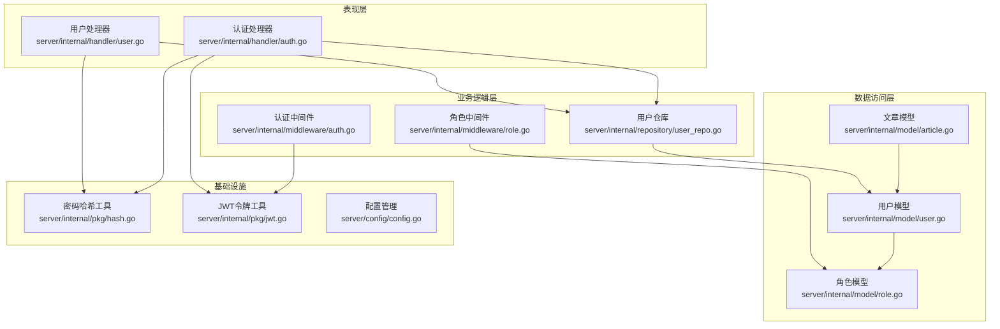
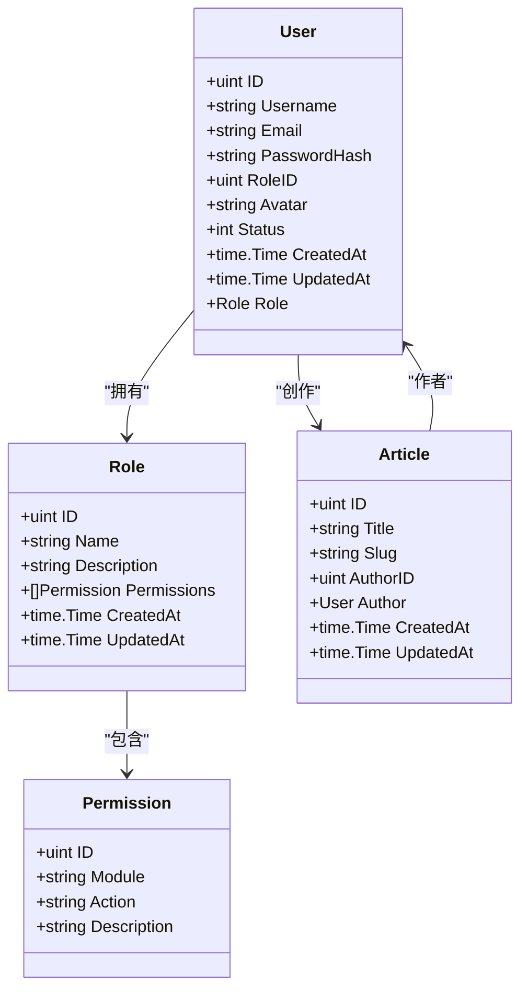
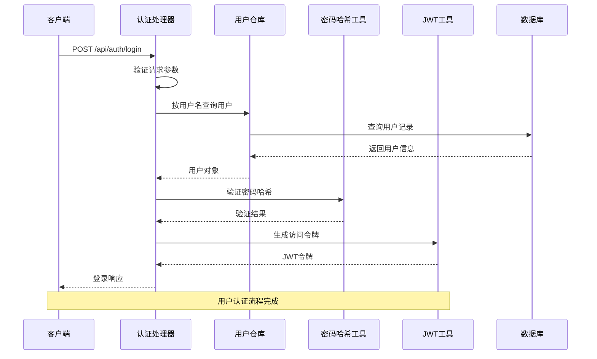
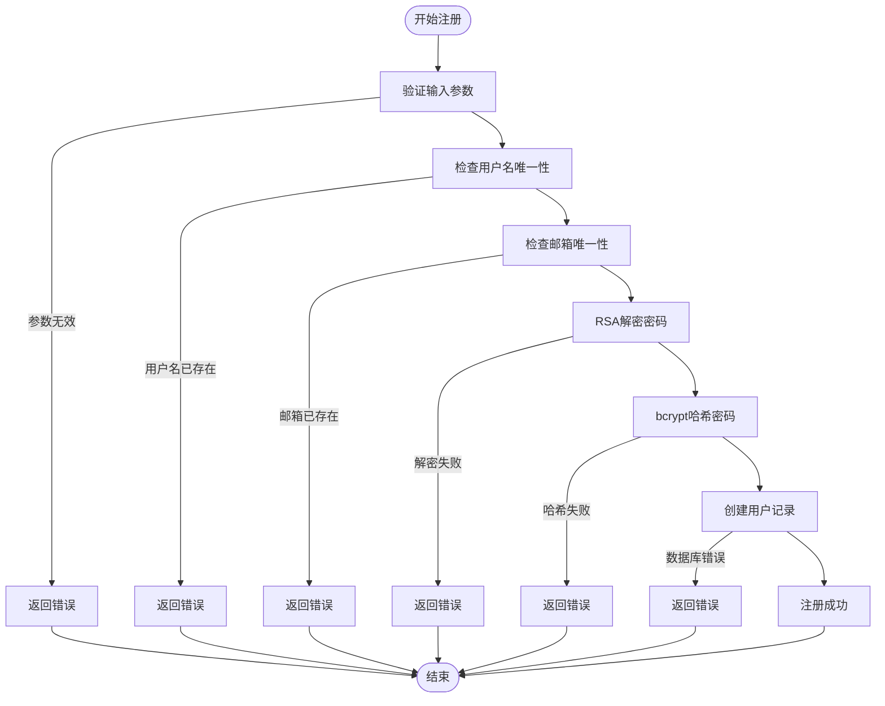
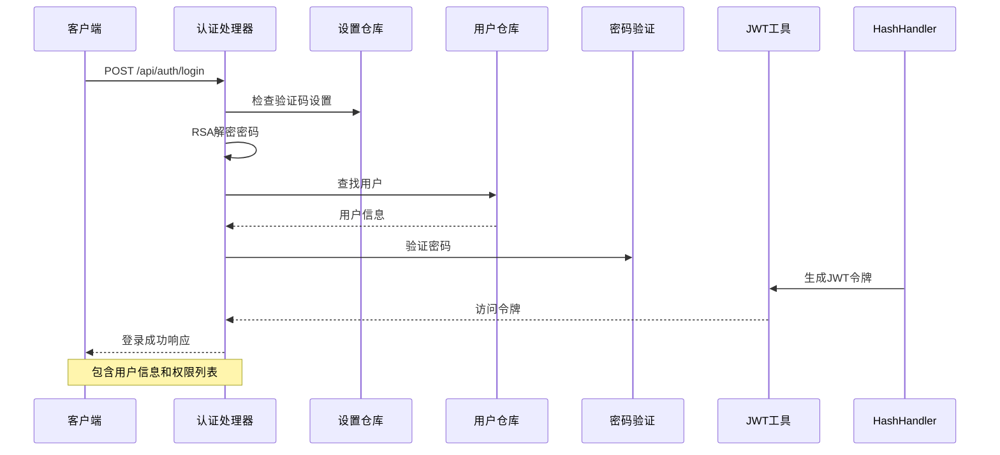
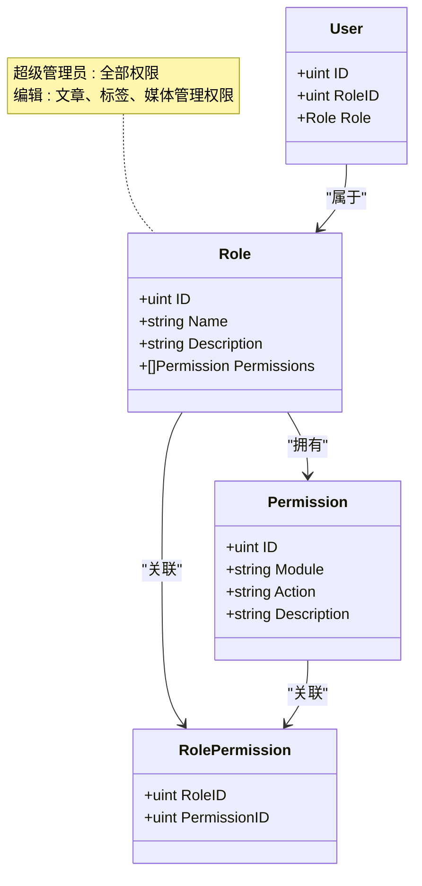
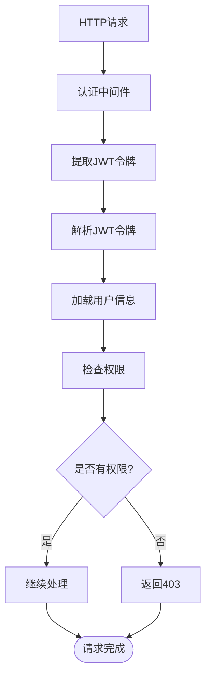
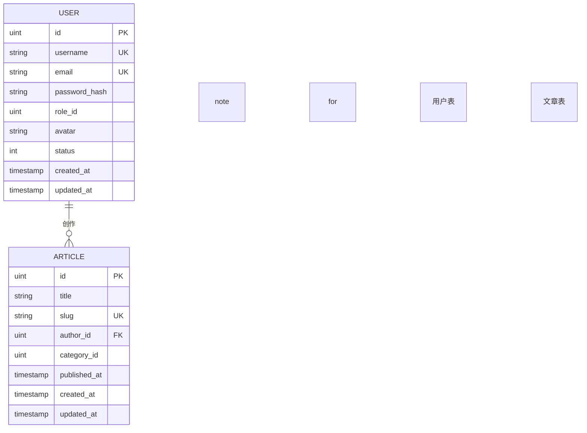
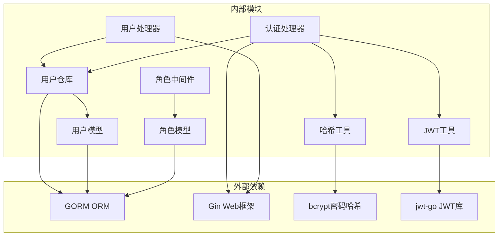

# 用户实体技术文档

<cite>
**本文档引用的文件**
- [server/internal/model/user.go](file://server/internal/model/user.go)
- [server/internal/repository/user_repo.go](file://server/internal/repository/user_repo.go)
- [server/internal/handler/user.go](file://server/internal/handler/user.go)
- [server/internal/model/role.go](file://server/internal/model/role.go)
- [server/internal/model/article.go](file://server/internal/model/article.go)
- [server/internal/handler/auth.go](file://server/internal/handler/auth.go)
- [server/internal/middleware/auth.go](file://server/internal/middleware/auth.go)
- [server/internal/middleware/role.go](file://server/internal/middleware/role.go)
- [server/internal/pkg/hash.go](file://server/internal/pkg/hash.go)
- [server/internal/pkg/jwt.go](file://server/internal/pkg/jwt.go)
- [server/internal/dto/auth_dto.go](file://server/internal/dto/auth_dto.go)
- [server/migration/migrate.go](file://server/migration/migrate.go)
- [server/config/config.go](file://server/config/config.go)
</cite>

## 目录
1. [简介](#简介)
2. [项目结构](#项目结构)
3. [核心组件](#核心组件)
4. [架构概览](#架构概览)
5. [详细组件分析](#详细组件分析)
6. [依赖关系分析](#依赖关系分析)
7. [性能考虑](#性能考虑)
8. [故障排除指南](#故障排除指南)
9. [结论](#结论)

## 简介

本文档为User用户实体提供了全面的技术文档，详细解释了用户实体的字段设计、数据模型、业务逻辑以及相关的安全机制。User实体是博客系统的核心组成部分，负责管理用户账户、身份验证、权限控制等功能。

## 项目结构

该博客系统的用户相关功能分布在以下层次中：

**图表来源**
- [server/internal/handler/user.go:1-146](file://server/internal/handler/user.go#L1-146)
- [server/internal/repository/user_repo.go:1-66](file://server/internal/repository/user_repo.go#L1-66)
- [server/internal/model/user.go:1-17](file://server/internal/model/user.go#L1-17)

**章节来源**
- [server/internal/handler/user.go:1-146](file://server/internal/handler/user.go#L1-146)
- [server/internal/repository/user_repo.go:1-66](file://server/internal/repository/user_repo.go#L1-66)
- [server/internal/model/user.go:1-17](file://server/internal/model/user.go#L1-17)

## 核心组件

### 用户实体模型

User实体是用户数据的核心表示，包含了用户的所有基本信息和关联关系。

**图表来源**
- [server/internal/model/user.go:5-16](file://server/internal/model/user.go#L5-16)
- [server/internal/model/role.go:5-19](file://server/internal/model/role.go#L5-19)
- [server/internal/model/article.go:5-23](file://server/internal/model/article.go#L5-23)

### 字段设计详解

#### 基础字段
- **ID**: 主键，自增整数，唯一标识用户
- **Username**: 用户名，长度限制50字符，唯一索引，必填
- **Email**: 邮箱地址，长度限制100字符，唯一索引，必填
- **PasswordHash**: 密码哈希值，长度限制255字符，必填

#### 关联字段
- **RoleID**: 角色ID，外键关联到角色表
- **Avatar**: 头像URL，长度限制500字符

#### 状态字段
- **Status**: 用户状态，默认值1（激活），0表示禁用

#### 时间戳字段
- **CreatedAt**: 创建时间
- **UpdatedAt**: 更新时间

**章节来源**
- [server/internal/model/user.go:5-16](file://server/internal/model/user.go#L5-16)

## 架构概览

用户系统的整体架构采用分层设计，确保了关注点分离和代码的可维护性。

**图表来源**
- [server/internal/handler/auth.go:31-93](file://server/internal/handler/auth.go#L31-93)
- [server/internal/repository/user_repo.go:24-28](file://server/internal/repository/user_repo.go#L24-28)
- [server/internal/pkg/hash.go:10-13](file://server/internal/pkg/hash.go#L10-13)
- [server/internal/pkg/jwt.go:16-28](file://server/internal/pkg/jwt.go#L16-28)

## 详细组件分析

### 用户注册流程

用户注册过程涉及多个安全检查和数据处理步骤：

**图表来源**
- [server/internal/handler/user.go:41-75](file://server/internal/handler/user.go#L41-75)
- [server/internal/pkg/hash.go:5-8](file://server/internal/pkg/hash.go#L5-8)

#### 注册流程关键实现

1. **参数验证**: 使用Gin框架的绑定机制验证请求参数
2. **密码安全**: 采用RSA公钥加密传输，服务端使用私钥解密
3. **哈希存储**: 使用bcrypt算法进行密码哈希存储
4. **唯一性检查**: 在数据库层面通过唯一索引保证用户名和邮箱的唯一性

**章节来源**
- [server/internal/handler/user.go:41-75](file://server/internal/handler/user.go#L41-75)
- [server/internal/dto/auth_dto.go:26-31](file://server/internal/dto/auth_dto.go#L26-31)

### 用户登录流程

用户登录流程包含身份验证和权限加载：

**图表来源**
- [server/internal/handler/auth.go:31-93](file://server/internal/handler/auth.go#L31-93)
- [server/internal/middleware/role.go:37-42](file://server/internal/middleware/role.go#L37-42)

#### 登录安全机制

1. **多层验证**: 支持可选的验证码验证
2. **密码验证**: 服务器端验证bcrypt哈希
3. **状态检查**: 确保用户账户处于激活状态
4. **令牌管理**: 使用JWT进行会话管理

**章节来源**
- [server/internal/handler/auth.go:31-93](file://server/internal/handler/auth.go#L31-93)

### 权限管理系统

系统采用基于角色的权限控制（RBAC）模型：

**图表来源**
- [server/internal/model/role.go:5-19](file://server/internal/model/role.go#L5-19)
- [server/migration/migrate.go:69-102](file://server/migration/migrate.go#L69-102)

#### 权限验证流程

**图表来源**
- [server/internal/middleware/auth.go:10-37](file://server/internal/middleware/auth.go#L10-37)
- [server/internal/middleware/role.go:10-35](file://server/internal/middleware/role.go#L10-35)

**章节来源**
- [server/internal/middleware/role.go:10-43](file://server/internal/middleware/role.go#L10-43)
- [server/migration/migrate.go:69-102](file://server/migration/migrate.go#L69-102)

### 用户与文章的关系

User实体与Article实体建立了一对多的关联关系：

**图表来源**
- [server/internal/model/user.go:5-16](file://server/internal/model/user.go#L5-16)
- [server/internal/model/article.go:5-23](file://server/internal/model/article.go#L5-23)

#### 作者关系实现

- **外键约束**: Article.AuthorID 引用 User.ID
- **级联关系**: 一个用户可以创作多篇文章
- **查询优化**: 使用Preload预加载作者信息

**章节来源**
- [server/internal/model/article.go:14-15](file://server/internal/model/article.go#L14-15)

## 依赖关系分析

### 组件依赖图

**图表来源**
- [server/internal/handler/user.go:3-11](file://server/internal/handler/user.go#L3-11)
- [server/internal/handler/auth.go:3-11](file://server/internal/handler/auth.go#L3-11)
- [server/internal/repository/user_repo.go:3-6](file://server/internal/repository/user_repo.go#L3-6)

### 数据流分析

用户系统的数据流遵循清晰的层次结构：

1. **请求层**: HTTP请求通过Gin路由进入
2. **业务层**: 处理器负责业务逻辑协调
3. **数据层**: 仓库模式封装数据库操作
4. **模型层**: GORM模型定义数据结构
5. **工具层**: 安全和加密工具提供基础功能

**章节来源**
- [server/internal/handler/user.go:13-23](file://server/internal/handler/user.go#L13-23)
- [server/internal/repository/user_repo.go:8-22](file://server/internal/repository/user_repo.go#L8-22)

## 性能考虑

### 查询优化

1. **索引策略**: 用户名和邮箱字段建立唯一索引
2. **预加载机制**: 使用Preload避免N+1查询问题
3. **分页查询**: 实现高效的分页机制
4. **批量操作**: 支持批量用户查询和更新

### 缓存策略

虽然当前实现未包含缓存层，但建议在生产环境中考虑：

1. **用户信息缓存**: 缓存活跃用户的权限信息
2. **令牌验证缓存**: 缓存JWT验证结果
3. **配置信息缓存**: 缓存系统配置和权限数据

### 安全最佳实践

1. **密码存储**: 使用bcrypt进行密码哈希，避免明文存储
2. **传输安全**: 所有敏感数据通过HTTPS传输
3. **输入验证**: 严格的参数验证和类型检查
4. **权限控制**: 最小权限原则和细粒度权限控制
5. **日志审计**: 记录重要的安全事件和操作

## 故障排除指南

### 常见问题及解决方案

#### 用户注册失败
- **问题**: 用户名或邮箱重复
- **原因**: 数据库唯一约束冲突
- **解决**: 检查用户名和邮箱的唯一性

#### 登录认证失败
- **问题**: 用户名或密码错误
- **原因**: 密码验证失败或用户被禁用
- **解决**: 验证用户状态和密码哈希

#### 权限不足
- **问题**: 访问受保护资源时返回403
- **原因**: 用户角色缺少相应权限
- **解决**: 检查用户角色和权限分配

#### JWT令牌过期
- **问题**: 请求返回认证失败
- **原因**: JWT令牌过期或无效
- **解决**: 重新登录获取新令牌

**章节来源**
- [server/internal/handler/user.go:69-74](file://server/internal/handler/user.go#L69-74)
- [server/internal/handler/auth.go:57-71](file://server/internal/handler/auth.go#L57-71)
- [server/internal/middleware/auth.go:26-31](file://server/internal/middleware/auth.go#L26-31)

## 结论

User用户实体作为博客系统的核心组件，实现了完整的用户管理功能。通过采用分层架构、RBAC权限模型和多重安全机制，系统确保了用户数据的安全性和系统的可扩展性。

主要特点包括：
- **安全可靠**: bcrypt密码哈希、JWT令牌、RSA加密传输
- **权限灵活**: 细粒度的模块化权限控制
- **性能优化**: 合理的索引设计和查询优化
- **易于扩展**: 清晰的架构设计支持功能扩展

建议在生产环境中进一步完善监控、日志和缓存机制，以提升系统的稳定性和性能表现。