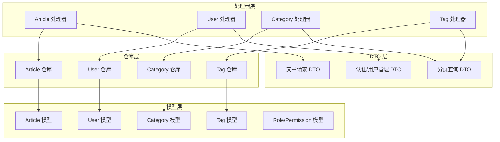
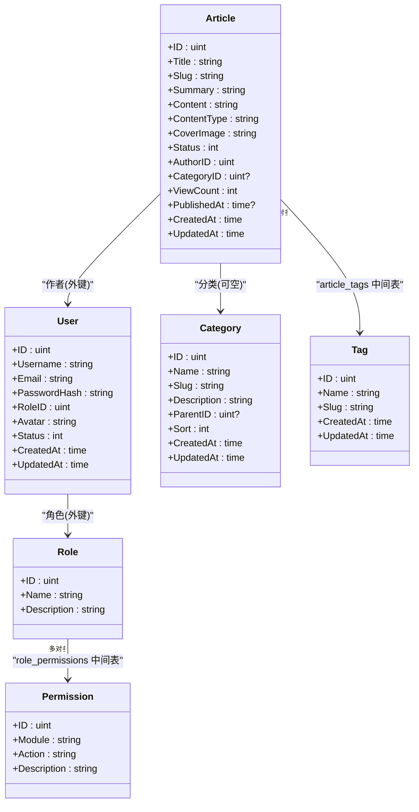
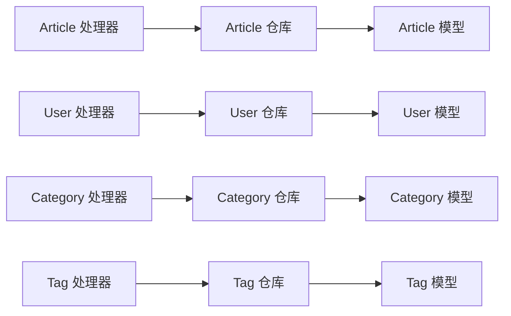

# 核心实体模型

<cite>
**本文引用的文件**
- [server/internal/model/article.go](file://server/internal/model/article.go)
- [server/internal/model/user.go](file://server/internal/model/user.go)
- [server/internal/model/category.go](file://server/internal/model/category.go)
- [server/internal/model/tag.go](file://server/internal/model/tag.go)
- [server/internal/model/role.go](file://server/internal/model/role.go)
- [server/internal/dto/article_dto.go](file://server/internal/dto/article_dto.go)
- [server/internal/dto/common.go](file://server/internal/dto/common.go)
- [server/internal/dto/auth_dto.go](file://server/internal/dto/auth_dto.go)
- [server/internal/repository/article_repo.go](file://server/internal/repository/article_repo.go)
- [server/internal/repository/user_repo.go](file://server/internal/repository/user_repo.go)
- [server/internal/repository/category_repo.go](file://server/internal/repository/category_repo.go)
- [server/internal/repository/tag_repo.go](file://server/internal/repository/tag_repo.go)
- [server/internal/handler/article.go](file://server/internal/handler/article.go)
- [server/internal/handler/user.go](file://server/internal/handler/user.go)
- [server/internal/handler/category.go](file://server/internal/handler/category.go)
- [server/internal/handler/tag.go](file://server/internal/handler/tag.go)
</cite>

## 目录
1. [引言](#引言)
2. [项目结构](#项目结构)
3. [核心组件](#核心组件)
4. [架构总览](#架构总览)
5. [详细组件分析](#详细组件分析)
6. [依赖分析](#依赖分析)
7. [性能考量](#性能考量)
8. [故障排查指南](#故障排查指南)
9. [结论](#结论)
10. [附录](#附录)

## 引言
本文件聚焦于Xiangmuzs博客平台的核心实体模型：Article（文章）、User（用户）、Category（分类）、Tag（标签）。我们将从设计理念、字段定义与约束、业务规则、实体间关系、使用场景与最佳实践、时间戳设计与自动更新机制，以及增删改查操作示例与注意事项等方面进行系统化说明，帮助开发者快速理解并正确使用这些实体。

## 项目结构
后端采用分层架构：模型（Model）负责数据结构与GORM映射；仓库（Repository）封装数据库访问；处理器（Handler）处理HTTP请求与响应；DTO用于接口入参校验与序列化；Role/Permission用于权限控制。

图表来源
- [server/internal/model/article.go:1-24](file://server/internal/model/article.go#L1-L24)
- [server/internal/model/user.go:1-17](file://server/internal/model/user.go#L1-L17)
- [server/internal/model/category.go:1-15](file://server/internal/model/category.go#L1-L15)
- [server/internal/model/tag.go:1-12](file://server/internal/model/tag.go#L1-L12)
- [server/internal/model/role.go:1-20](file://server/internal/model/role.go#L1-L20)
- [server/internal/repository/article_repo.go:1-91](file://server/internal/repository/article_repo.go#L1-L91)
- [server/internal/repository/user_repo.go:1-66](file://server/internal/repository/user_repo.go#L1-L66)
- [server/internal/repository/category_repo.go:1-51](file://server/internal/repository/category_repo.go#L1-L51)
- [server/internal/repository/tag_repo.go:1-56](file://server/internal/repository/tag_repo.go#L1-L56)
- [server/internal/handler/article.go:1-325](file://server/internal/handler/article.go#L1-L325)
- [server/internal/handler/user.go:1-146](file://server/internal/handler/user.go#L1-L146)
- [server/internal/handler/category.go:1-90](file://server/internal/handler/category.go#L1-L90)
- [server/internal/handler/tag.go:1-75](file://server/internal/handler/tag.go#L1-L75)
- [server/internal/dto/article_dto.go:1-44](file://server/internal/dto/article_dto.go#L1-L44)
- [server/internal/dto/common.go:1-21](file://server/internal/dto/common.go#L1-L21)
- [server/internal/dto/auth_dto.go:1-39](file://server/internal/dto/auth_dto.go#L1-L39)

章节来源
- [server/internal/model/article.go:1-24](file://server/internal/model/article.go#L1-L24)
- [server/internal/model/user.go:1-17](file://server/internal/model/user.go#L1-L17)
- [server/internal/model/category.go:1-15](file://server/internal/model/category.go#L1-L15)
- [server/internal/model/tag.go:1-12](file://server/internal/model/tag.go#L1-L12)
- [server/internal/model/role.go:1-20](file://server/internal/model/role.go#L1-L20)
- [server/internal/dto/article_dto.go:1-44](file://server/internal/dto/article_dto.go#L1-L44)
- [server/internal/dto/common.go:1-21](file://server/internal/dto/common.go#L1-L21)
- [server/internal/dto/auth_dto.go:1-39](file://server/internal/dto/auth_dto.go#L1-L39)

## 核心组件
本节概述四个核心实体的设计目标与职责边界：
- Article：承载文章内容、状态、作者、分类、标签等信息，支持草稿/发布状态切换与浏览计数。
- User：用户主体，绑定角色与状态，支持密码哈希存储与权限体系。
- Category：文章分类，支持层级父子关系与排序。
- Tag：文章标签，支持多对多关联到文章。

章节来源
- [server/internal/model/article.go:5-23](file://server/internal/model/article.go#L5-L23)
- [server/internal/model/user.go:5-16](file://server/internal/model/user.go#L5-L16)
- [server/internal/model/category.go:5-14](file://server/internal/model/category.go#L5-L14)
- [server/internal/model/tag.go:5-11](file://server/internal/model/tag.go#L5-L11)

## 架构总览
实体模型通过GORM映射到数据库表，处理器通过仓库层访问数据库，DTO用于请求参数校验与序列化。多对多关系通过中间表维护，预加载策略保证对外输出时关联数据完整。

图表来源
- [server/internal/model/article.go:5-23](file://server/internal/model/article.go#L5-L23)
- [server/internal/model/user.go:5-16](file://server/internal/model/user.go#L5-L16)
- [server/internal/model/category.go:5-14](file://server/internal/model/category.go#L5-L14)
- [server/internal/model/tag.go:5-11](file://server/internal/model/tag.go#L5-L11)
- [server/internal/model/role.go:5-19](file://server/internal/model/role.go#L5-L19)

## 详细组件分析

### Article 文章实体
- 设计理念
  - 支持Markdown与富文本两种内容类型，便于内容创作与渲染。
  - 状态字段区分草稿与发布，配合发布时间戳实现发布控制。
  - 通过多对多关联标签，支持灵活的内容标签化。
  - 预留封面图字段，便于展示优化。
- 字段定义与约束
  - ID：主键，自增。
  - Title：字符串，最大长度限制，必填。
  - Slug：字符串，唯一索引，必填，用于SEO友好的URL路径。
  - Summary：字符串，最大长度限制，摘要信息。
  - Content：长文本，存储文章正文。
  - ContentType：字符串，枚举值（markdown/richtext），默认markdown。
  - CoverImage：字符串，最大长度限制，封面图URL。
  - Status：整型，索引，0=草稿，1=已发布，默认草稿。
  - AuthorID：整型，必填，外键指向User。
  - CategoryID：整型，可空，外键指向Category。
  - ViewCount：整型，默认0，浏览计数。
  - PublishedAt：时间戳，可空，首次发布时写入。
  - CreatedAt/UpdatedAt：时间戳，GORM自动维护。
- 关联关系
  - 一对一：Article -> User（作者）
  - 一对一：Article -> Category（分类，可空）
  - 多对多：Article <-> Tag（通过中间表article_tags）
- 业务规则
  - 默认状态为草稿；当状态置为已发布且PublishedAt为空时，自动写入当前时间。
  - 列表查询支持按状态、分类、关键词、标签过滤。
  - 浏览权限仅对已发布文章开放；浏览后增加浏览计数。
- 使用场景与最佳实践
  - 编辑器保存默认为草稿，发布时设置状态并填充发布时间。
  - 标签批量更新通过替换关联集合完成，避免手动维护中间表。
  - 列表分页统一使用DTO中的分页参数，避免超大页大小。
- 时间戳与自动更新
  - CreatedAt/UpdatedAt由GORM自动维护。
  - 发布时若未设置PublishedAt，则在更新状态为已发布时自动写入。
- 增删改查示例与注意事项
  - 创建：处理器根据请求DTO组装Article对象，设置默认状态为草稿，必要字段缺失时回退默认值。
  - 更新：支持部分字段更新，标签通过FindByIDs后替换关联集合。
  - 删除：直接删除文章记录，不强制清理标签关联（由Tag仓库在删除标签时清理）。
  - 查询：支持按ID、Slug精确查询；列表支持多维过滤与预加载关联。
  - 公开接口：仅返回已发布文章，浏览后增加计数并返回精简视图。

章节来源
- [server/internal/model/article.go:5-23](file://server/internal/model/article.go#L5-L23)
- [server/internal/repository/article_repo.go:16-90](file://server/internal/repository/article_repo.go#L16-L90)
- [server/internal/handler/article.go:87-202](file://server/internal/handler/article.go#L87-L202)
- [server/internal/handler/article.go:206-291](file://server/internal/handler/article.go#L206-L291)
- [server/internal/dto/article_dto.go:3-16](file://server/internal/dto/article_dto.go#L3-L16)
- [server/internal/dto/common.go:3-21](file://server/internal/dto/common.go#L3-L21)

### User 用户实体
- 设计理念
  - 用户凭据以哈希形式存储，保障安全。
  - 通过Role建立权限基础，结合Permission实现细粒度授权。
  - 状态字段支持启用/禁用，便于账户治理。
- 字段定义与约束
  - ID：主键。
  - Username：字符串，唯一索引，必填。
  - Email：字符串，唯一索引，必填。
  - PasswordHash：字符串，存储密码哈希，不参与JSON序列化。
  - RoleID：整型，必填，外键指向Role。
  - Avatar：字符串，头像URL。
  - Status：整型，默认1=启用，0=禁用。
  - CreatedAt/UpdatedAt：时间戳，GORM自动维护。
- 关联关系
  - 一对一：User -> Role（角色）
- 业务规则
  - 创建用户时需提供用户名、邮箱、密码与角色ID；密码经RSA解密后再做哈希。
  - 更新用户时可修改邮箱、角色、状态与密码（如提供新密码）。
  - 禁止删除当前登录用户，防止自我移除。
- 使用场景与最佳实践
  - 用户管理界面中，列表分页与排序由仓库层统一处理。
  - 密码变更流程必须先解密再哈希，确保安全性。
- 时间戳与自动更新
  - CreatedAt/UpdatedAt由GORM自动维护。
- 增删改查示例与注意事项
  - 创建：解密RSA密码，生成哈希后入库。
  - 更新：支持选择性字段更新，密码变更需重新加密。
  - 删除：禁止删除当前用户，避免权限与会话异常。

章节来源
- [server/internal/model/user.go:5-16](file://server/internal/model/user.go#L5-L16)
- [server/internal/model/role.go:5-19](file://server/internal/model/role.go#L5-L19)
- [server/internal/repository/user_repo.go:36-65](file://server/internal/repository/user_repo.go#L36-L65)
- [server/internal/handler/user.go:41-145](file://server/internal/handler/user.go#L41-L145)
- [server/internal/dto/auth_dto.go:26-38](file://server/internal/dto/auth_dto.go#L26-L38)

### Category 分类实体
- 设计理念
  - 支持层级父子关系（ParentID），便于构建树形分类结构。
  - Sort字段控制同级排序，提升管理体验。
- 字段定义与约束
  - ID：主键。
  - Name：字符串，最大长度限制，必填。
  - Slug：字符串，唯一索引，必填。
  - Description：字符串，描述信息。
  - ParentID：整型，可空，父分类ID。
  - Sort：整型，默认0，排序权重。
  - CreatedAt/UpdatedAt：时间戳，GORM自动维护。
- 关联关系
  - 一对多：Category -> Article（反向：Article.CategoryID）
- 业务规则
  - 删除前检查是否存在文章引用，避免破坏外键完整性。
  - 列表按Sort升序、ID升序排列。
- 使用场景与最佳实践
  - 分类树构建与导航菜单生成可基于ParentID与Sort组合。
  - 批量导入或迁移时注意Slug唯一性与ParentID合法性。
- 时间戳与自动更新
  - CreatedAt/UpdatedAt由GORM自动维护。
- 增删改查示例与注意事项
  - 创建/更新：直接持久化字段，不做复杂校验。
  - 删除：若存在文章引用则拒绝删除并返回友好提示。

章节来源
- [server/internal/model/category.go:5-14](file://server/internal/model/category.go#L5-L14)
- [server/internal/repository/category_repo.go:16-50](file://server/internal/repository/category_repo.go#L16-L50)
- [server/internal/handler/category.go:32-89](file://server/internal/handler/category.go#L32-L89)

### Tag 标签实体
- 设计理念
  - 轻量级标签系统，支持多对多关联文章，便于内容检索与聚合。
- 字段定义与约束
  - ID：主键。
  - Name：字符串，最大长度限制，必填。
  - Slug：字符串，唯一索引，必填。
  - CreatedAt/UpdatedAt：时间戳，GORM自动维护。
- 关联关系
  - 多对多：Article <-> Tag（通过中间表article_tags）
- 业务规则
  - 删除标签时需先清理中间表关联，避免悬挂引用。
  - 列表按ID升序排列。
- 使用场景与最佳实践
  - 标签云与文章归档页面可直接基于Tag列表与关联统计。
  - 批量更新文章标签时，先通过FindByIDs获取标签集合，再替换关联。
- 时间戳与自动更新
  - CreatedAt/UpdatedAt由GORM自动维护。
- 增删改查示例与注意事项
  - 创建/更新：直接持久化字段。
  - 删除：先清理中间表，再删除Tag记录。

章节来源
- [server/internal/model/tag.go:5-11](file://server/internal/model/tag.go#L5-L11)
- [server/internal/repository/tag_repo.go:16-55](file://server/internal/repository/tag_repo.go#L16-L55)
- [server/internal/handler/tag.go:32-74](file://server/internal/handler/tag.go#L32-L74)

### 关系与中间表
- Article <-> Tag：多对多，中间表article_tags，仓库提供Replace方法批量更新标签集合。
- Role <-> Permission：多对多，中间表role_permissions，用于权限聚合。

章节来源
- [server/internal/model/article.go:18-18](file://server/internal/model/article.go#L18-L18)
- [server/internal/model/role.go:9-9](file://server/internal/model/role.go#L9-L9)
- [server/internal/repository/article_repo.go:76-78](file://server/internal/repository/article_repo.go#L76-L78)

## 依赖分析
- 组件耦合
  - Handler依赖对应Repository，Repository依赖Model，保持清晰的分层。
  - DTO仅用于输入校验与序列化，不直接参与业务逻辑。
- 外部依赖
  - GORM用于ORM映射与查询。
  - Gin用于HTTP路由与控制器。
- 关键依赖链
  - ArticleHandler -> ArticleRepo -> Article模型
  - UserHandler -> UserRepo -> User模型
  - CategoryHandler -> CategoryRepo -> Category模型
  - TagHandler -> TagRepo -> Tag模型

图表来源
- [server/internal/handler/article.go:19-29](file://server/internal/handler/article.go#L19-L29)
- [server/internal/handler/user.go:13-23](file://server/internal/handler/user.go#L13-L23)
- [server/internal/handler/category.go:15-21](file://server/internal/handler/category.go#L15-L21)
- [server/internal/handler/tag.go:15-21](file://server/internal/handler/tag.go#L15-L21)
- [server/internal/repository/article_repo.go:8-14](file://server/internal/repository/article_repo.go#L8-L14)
- [server/internal/repository/user_repo.go:8-22](file://server/internal/repository/user_repo.go#L8-L22)
- [server/internal/repository/category_repo.go:8-14](file://server/internal/repository/category_repo.go#L8-L14)
- [server/internal/repository/tag_repo.go:8-14](file://server/internal/repository/tag_repo.go#L8-L14)

## 性能考量
- 索引策略
  - Article：Status+PublishedAt复合索引用于高效筛选已发布文章；Slug唯一索引用于快速定位。
  - User/Tag/Category：唯一索引保证去重与快速查找。
- 预加载与N+1
  - 列表查询统一使用Preload预加载Author、Category、Tags，避免N+1查询。
- 计数与统计
  - 视频计数使用UpdateColumn原子递增，减少锁竞争。
  - 统计总数使用COALESCE与SUM避免NULL影响。
- 分页与过滤
  - 分页参数规范化，避免过大页大小导致内存压力。

章节来源
- [server/internal/model/article.go:13-20](file://server/internal/model/article.go#L13-L20)
- [server/internal/model/user.go:7-8](file://server/internal/model/user.go#L7-L8)
- [server/internal/model/tag.go:7-8](file://server/internal/model/tag.go#L7-L8)
- [server/internal/repository/article_repo.go:41-70](file://server/internal/repository/article_repo.go#L41-L70)
- [server/internal/repository/article_repo.go:72-74](file://server/internal/repository/article_repo.go#L72-L74)
- [server/internal/repository/article_repo.go:86-90](file://server/internal/repository/article_repo.go#L86-L90)
- [server/internal/dto/common.go:9-20](file://server/internal/dto/common.go#L9-L20)

## 故障排查指南
- 文章状态更新
  - 已发布但未设置发布时间：更新状态为已发布时会自动写入当前时间。
  - 浏览权限：公开详情仅对已发布文章开放，草稿返回“不存在”。
- 分类删除
  - 若分类下存在文章，删除会被拒绝并提示“该分类下存在文章，无法删除”。
- 标签删除
  - 删除前需清理中间表article_tags，否则可能出现悬挂引用。
- 用户管理
  - 禁止删除当前登录用户，避免权限与会话异常。
  - 创建/更新用户时，密码需先RSA解密再哈希，失败会返回参数错误或内部错误。

章节来源
- [server/internal/handler/article.go:179-202](file://server/internal/handler/article.go#L179-L202)
- [server/internal/handler/article.go:259-291](file://server/internal/handler/article.go#L259-L291)
- [server/internal/handler/category.go:78-88](file://server/internal/handler/category.go#L78-L88)
- [server/internal/repository/tag_repo.go:24-28](file://server/internal/repository/tag_repo.go#L24-L28)
- [server/internal/handler/user.go:127-145](file://server/internal/handler/user.go#L127-L145)
- [server/internal/handler/user.go:41-75](file://server/internal/handler/user.go#L41-L75)

## 结论
本实体模型围绕文章、用户、分类、标签四类核心资源构建，通过明确的字段约束、合理的索引策略与清晰的分层架构，实现了内容管理与权限控制的高内聚低耦合。遵循本文的最佳实践与注意事项，可在保证性能与安全的前提下高效扩展功能。

## 附录
- 字段级别注释建议
  - Title/Summary/Content：用于前端展示与SEO，注意长度与换行处理。
  - Slug：全局唯一，建议生成器统一处理非法字符。
  - ContentType：区分渲染与编辑体验，避免混用。
  - Status/PublishedAt：严格控制发布流程，避免脏数据。
  - AuthorID/CategoryID：外键一致性校验，避免悬空引用。
  - Tags：批量更新使用Replace，确保一致性。
  - PasswordHash：永不暴露明文，仅参与哈希比对。
  - RoleID/Status：用户治理关键字段，变更需审计。
- 常见问题
  - 如何生成Slug：标题转小写、去除非法字符、裁剪首尾连字符，空则回退时间戳方案。
  - 如何批量更新标签：先按ID集合查询标签，再调用Replace替换关联集合。
  - 如何统计浏览总量：使用COALESCE与SUM聚合，避免NULL干扰。