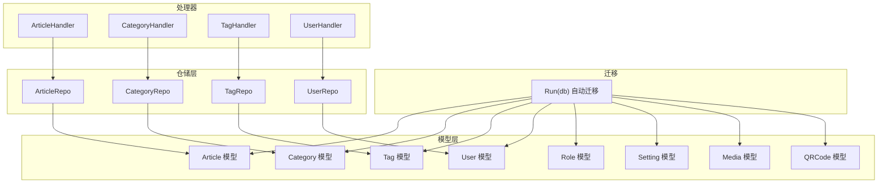
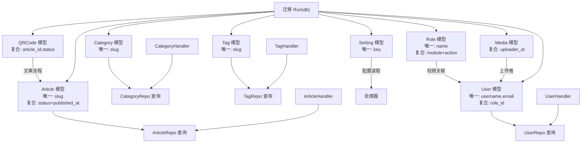
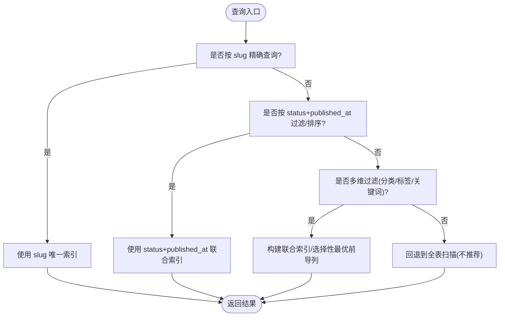
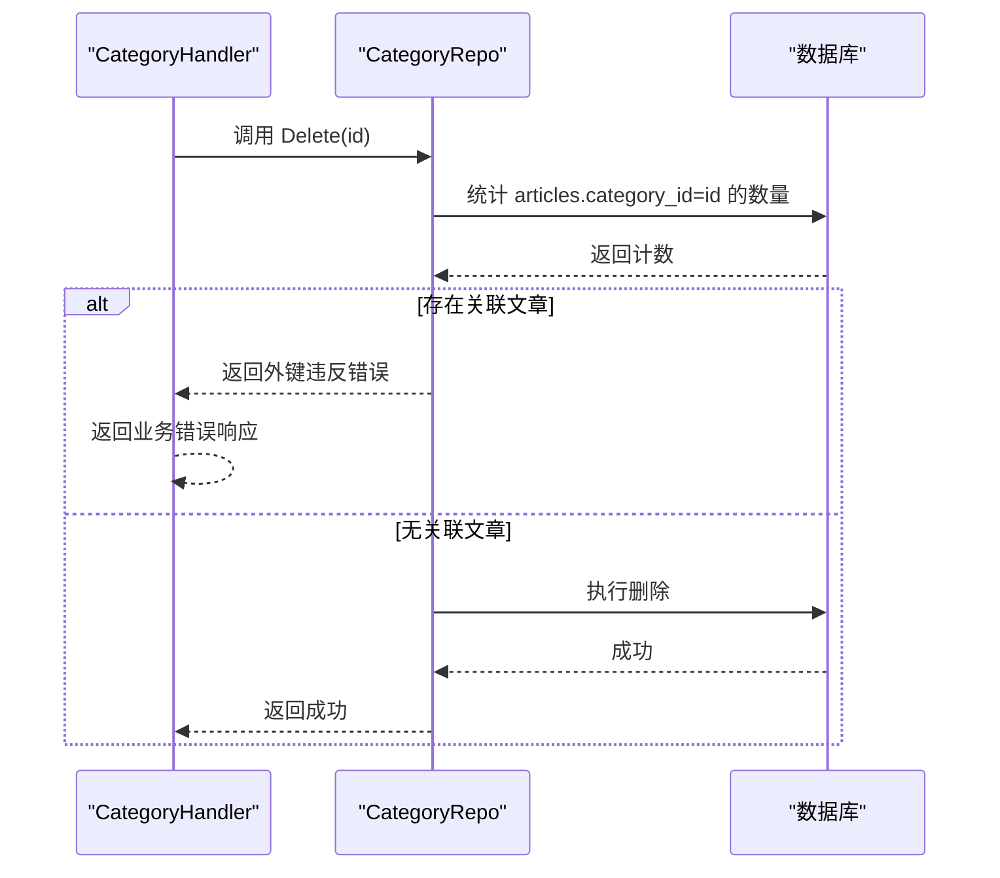
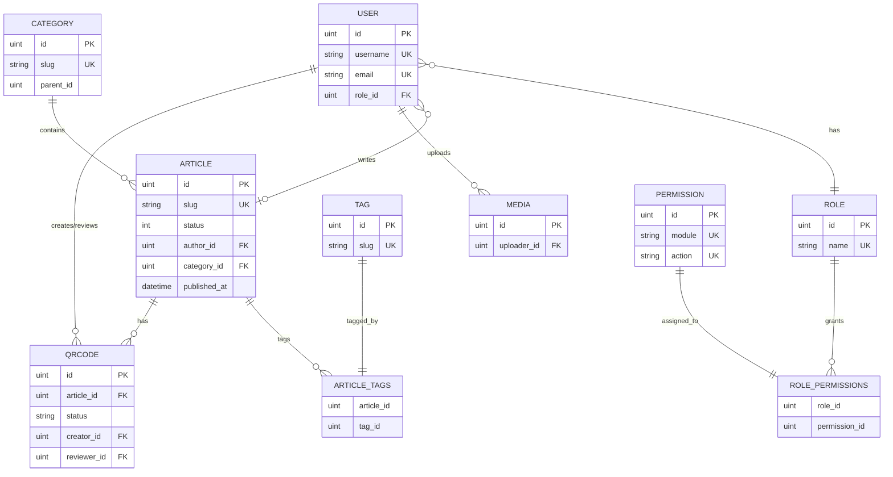

# 索引与约束

<cite>
**本文引用的文件**
- [server/internal/model/article.go](file://server/internal/model/article.go)
- [server/internal/model/category.go](file://server/internal/model/category.go)
- [server/internal/model/tag.go](file://server/internal/model/tag.go)
- [server/internal/model/user.go](file://server/internal/model/user.go)
- [server/internal/model/role.go](file://server/internal/model/role.go)
- [server/internal/model/setting.go](file://server/internal/model/setting.go)
- [server/internal/model/media.go](file://server/internal/model/media.go)
- [server/internal/model/qrcode.go](file://server/internal/model/qrcode.go)
- [server/migration/migrate.go](file://server/migration/migrate.go)
- [server/internal/repository/article_repo.go](file://server/internal/repository/article_repo.go)
- [server/internal/repository/category_repo.go](file://server/internal/repository/category_repo.go)
- [server/internal/repository/tag_repo.go](file://server/internal/repository/tag_repo.go)
- [server/internal/repository/user_repo.go](file://server/internal/repository/user_repo.go)
- [server/internal/handler/article.go](file://server/internal/handler/article.go)
- [server/internal/handler/category.go](file://server/internal/handler/category.go)
- [server/internal/handler/tag.go](file://server/internal/handler/tag.go)
- [server/internal/handler/user.go](file://server/internal/handler/user.go)
</cite>

## 目录
1. [简介](#简介)
2. [项目结构](#项目结构)
3. [核心组件](#核心组件)
4. [架构总览](#架构总览)
5. [详细组件分析](#详细组件分析)
6. [依赖分析](#依赖分析)
7. [性能考量](#性能考量)
8. [故障排查指南](#故障排查指南)
9. [结论](#结论)
10. [附录](#附录)

## 简介
本文件面向Xiangmuzs博客平台的数据库层，系统性梳理各表的主键、唯一索引、复合索引设计及其对性能的影响；解释slug、status、published_at等关键业务字段的索引策略；阐述外键约束的设计原则与性能权衡；给出索引使用最佳实践、查询优化建议、约束的业务意义与数据完整性保障、索引维护成本与策略、监控与调优方法，并针对常见查询模式提出索引设计方案。

## 项目结构
后端采用GORM模型定义与自动迁移机制，模型文件位于server/internal/model目录，迁移入口在server/migration/migrate.go中统一执行AutoMigrate。仓库层(repository)封装了常用查询，处理器(handler)承载业务路由与参数解析。

图表来源
- [server/migration/migrate.go:13-38](file://server/migration/migrate.go#L13-L38)
- [server/internal/model/article.go:5-23](file://server/internal/model/article.go#L5-L23)
- [server/internal/model/category.go:5-14](file://server/internal/model/category.go#L5-L14)
- [server/internal/model/tag.go:5-11](file://server/internal/model/tag.go#L5-L11)
- [server/internal/model/user.go:5-16](file://server/internal/model/user.go#L5-L16)
- [server/internal/model/role.go:5-19](file://server/internal/model/role.go#L5-L19)
- [server/internal/model/setting.go:5-10](file://server/internal/model/setting.go#L5-L10)
- [server/internal/model/media.go:5-13](file://server/internal/model/media.go#L5-L13)
- [server/internal/model/qrcode.go:6-22](file://server/internal/model/qrcode.go#L6-L22)
- [server/internal/handler/article.go:19-29](file://server/internal/handler/article.go#L19-L29)
- [server/internal/handler/category.go:15-21](file://server/internal/handler/category.go#L15-L21)
- [server/internal/handler/tag.go:15-21](file://server/internal/handler/tag.go#L15-L21)
- [server/internal/handler/user.go:13-23](file://server/internal/handler/user.go#L13-L23)

章节来源
- [server/migration/migrate.go:13-38](file://server/migration/migrate.go#L13-L38)

## 核心组件
本节聚焦各表的主键、唯一索引、复合索引与外键约束，结合查询模式与业务语义进行设计说明。

- 文章表(Article)
  - 主键：自增ID
  - 唯一索引：slug（用于公开访问路径）
  - 复合索引：status + published_at（用于按状态与发布时间筛选）
  - 外键：AuthorID → User(ID)，CategoryID → Category(ID)
  - 关键字段索引策略
    - slug：唯一且高频精确匹配，适合单独唯一索引
    - status + published_at：用于筛选已发布文章并排序，建议建立联合索引以避免排序开销
    - CategoryID：作为过滤条件之一，建议保持现有单列索引
  - 性能影响
    - 唯一索引确保slug不重复，写入时有唯一性检查成本
    - 联合索引可覆盖“已发布+时间”查询，减少回表与排序

- 分类表(Category)
  - 主键：自增ID
  - 唯一索引：slug（用于分类页URL）
  - 复合索引：ParentID（树形结构导航）
  - 外键：无显式外键声明，但删除时通过仓库层检查关联文章数量实现约束
  - 性能影响
    - slug唯一索引保障URL稳定性
    - ParentID索引支持层级查询与排序

- 标签表(Tag)
  - 主键：自增ID
  - 唯一索引：slug
  - 外键：无显式外键声明
  - 性能影响
    - slug唯一索引用于标签页访问

- 用户表(User)
  - 主键：自增ID
  - 唯一索引：username、email
  - 复合索引：RoleID（用于按角色分页/筛选）
  - 外键：RoleID → Role(ID)
  - 性能影响
    - 唯一索引保障登录凭据唯一性
    - RoleID索引支撑用户列表与角色筛选

- 角色表(Role)
  - 主键：自增ID
  - 唯一索引：name
  - 复合索引：module + action（权限模块与动作组合唯一）
  - 外键：无显式外键声明
  - 性能影响
    - name唯一索引用于角色检索
    - module+action唯一索引保障权限去重

- 设置表(Setting)
  - 主键：自增ID
  - 唯一索引：key
  - 外键：无
  - 性能影响
    - key唯一索引用于配置项快速定位

- 媒体表(Media)
  - 主键：自增ID
  - 复合索引：UploaderID（用于按上传者检索）
  - 外键：UploaderID → User(ID)
  - 性能影响
    - 上传者索引支撑媒体库分页与筛选

- 二维码表(QRCode)
  - 主键：自增ID
  - 复合索引：ArticleID、Status
  - 外键：ArticleID → Article(ID)，CreatorID → User(ID)，ReviewerID → User(ID)
  - 性能影响
    - ArticleID索引支撑按文章维度查询
    - Status索引支撑状态筛选与流程控制

章节来源
- [server/internal/model/article.go:5-23](file://server/internal/model/article.go#L5-L23)
- [server/internal/model/category.go:5-14](file://server/internal/model/category.go#L5-L14)
- [server/internal/model/tag.go:5-11](file://server/internal/model/tag.go#L5-L11)
- [server/internal/model/user.go:5-16](file://server/internal/model/user.go#L5-L16)
- [server/internal/model/role.go:5-19](file://server/internal/model/role.go#L5-L19)
- [server/internal/model/setting.go:5-10](file://server/internal/model/setting.go#L5-L10)
- [server/internal/model/media.go:5-13](file://server/internal/model/media.go#L5-L13)
- [server/internal/model/qrcode.go:6-22](file://server/internal/model/qrcode.go#L6-L22)

## 架构总览
下图展示模型、迁移、仓储与处理器之间的关系，以及关键索引与外键在查询中的作用。

图表来源
- [server/migration/migrate.go:13-38](file://server/migration/migrate.go#L13-L38)
- [server/internal/handler/article.go:19-29](file://server/internal/handler/article.go#L19-L29)
- [server/internal/handler/category.go:15-21](file://server/internal/handler/category.go#L15-L21)
- [server/internal/handler/tag.go:15-21](file://server/internal/handler/tag.go#L15-L21)
- [server/internal/handler/user.go:13-23](file://server/internal/handler/user.go#L13-L23)

## 详细组件分析

### 文章表(Article)索引与约束
- 设计要点
  - 主键：ID
  - 唯一索引：slug，保障公开URL稳定与去重
  - 复合索引：status + published_at，覆盖“已发布文章按时间倒序”典型查询
  - 单列索引：CategoryID，支持分类过滤
  - 外键：AuthorID → User(ID)，CategoryID → Category(ID)
- 查询模式与索引匹配
  - 公开详情页按slug精确查找：命中slug唯一索引
  - 公开列表按状态与分类/标签/关键词过滤：建议status+published_at联合索引提升排序与过滤效率
  - 后台管理列表：按状态、分类、关键词、标签多维过滤，建议联合索引或选择性最优的前导列
- 性能与维护
  - 唯一索引写入成本略高于普通索引，但换来查询确定性与URL稳定性
  - 联合索引可显著降低排序与回表成本，但会增加写入时的索引维护成本
- 最佳实践
  - 对高频过滤字段优先考虑联合索引
  - 避免冗余索引，定期清理未使用索引
  - 对大表定期统计信息更新与索引重建

图表来源
- [server/internal/handler/article.go:206-257](file://server/internal/handler/article.go#L206-L257)
- [server/internal/handler/article.go:259-291](file://server/internal/handler/article.go#L259-L291)
- [server/internal/repository/article_repo.go:41-70](file://server/internal/repository/article_repo.go#L41-L70)

章节来源
- [server/internal/model/article.go:5-23](file://server/internal/model/article.go#L5-L23)
- [server/internal/repository/article_repo.go:30-35](file://server/internal/repository/article_repo.go#L30-L35)
- [server/internal/repository/article_repo.go:41-70](file://server/internal/repository/article_repo.go#L41-L70)
- [server/internal/handler/article.go:206-257](file://server/internal/handler/article.go#L206-L257)
- [server/internal/handler/article.go:259-291](file://server/internal/handler/article.go#L259-L291)

### 分类表(Category)索引与约束
- 设计要点
  - 主键：ID
  - 唯一索引：slug
  - 复合索引：ParentID（树形结构导航）
  - 外键：无显式外键声明
- 查询模式与索引匹配
  - 列表按sort与ID排序：利用索引顺序
  - 树形层级查询：ParentID索引提升父子关系查询效率
- 外键约束与业务约束
  - 删除前检查是否存在文章关联，若存在则拒绝删除，保障引用完整性

图表来源
- [server/internal/handler/category.go:78-88](file://server/internal/handler/category.go#L78-L88)
- [server/internal/repository/category_repo.go:24-32](file://server/internal/repository/category_repo.go#L24-L32)

章节来源
- [server/internal/model/category.go:5-14](file://server/internal/model/category.go#L5-L14)
- [server/internal/repository/category_repo.go:24-32](file://server/internal/repository/category_repo.go#L24-L32)
- [server/internal/handler/category.go:78-88](file://server/internal/handler/category.go#L78-L88)

### 标签表(Tag)索引与约束
- 设计要点
  - 主键：ID
  - 唯一索引：slug
  - 外键：无显式外键声明
- 查询模式与索引匹配
  - 标签页按slug访问：命中唯一索引
  - 标签列表：ID升序
- 维护建议
  - 删除标签前先清理中间表关联，避免悬挂引用

章节来源
- [server/internal/model/tag.go:5-11](file://server/internal/model/tag.go#L5-L11)
- [server/internal/repository/tag_repo.go:24-28](file://server/internal/repository/tag_repo.go#L24-L28)

### 用户表(User)索引与约束
- 设计要点
  - 主键：ID
  - 唯一索引：username、email
  - 复合索引：RoleID
  - 外键：RoleID → Role(ID)
- 查询模式与索引匹配
  - 登录/按用户名查找：命中username唯一索引
  - 用户列表按ID倒序与按角色筛选：RoleID索引与默认主键索引协同
- 安全与一致性
  - 唯一索引确保登录凭据唯一，避免重复账户
  - 外键约束保障角色存在性

章节来源
- [server/internal/model/user.go:5-16](file://server/internal/model/user.go#L5-L16)
- [server/internal/repository/user_repo.go:24-28](file://server/internal/repository/user_repo.go#L24-L28)
- [server/internal/repository/user_repo.go:59-65](file://server/internal/repository/user_repo.go#L59-L65)

### 角色表(Role)与权限表(Permission)
- 设计要点
  - 主键：ID
  - 唯一索引：name
  - 复合唯一索引：module + action
  - 外键：无显式外键声明
- 查询模式与索引匹配
  - 按角色名查找：name唯一索引
  - 权限去重与组合：module+action唯一索引保障权限集合唯一性

章节来源
- [server/internal/model/role.go:5-19](file://server/internal/model/role.go#L5-L19)

### 设置表(Setting)
- 设计要点
  - 主键：ID
  - 唯一索引：key
- 查询模式与索引匹配
  - 按key读取配置：命中唯一索引

章节来源
- [server/internal/model/setting.go:5-10](file://server/internal/model/setting.go#L5-L10)

### 媒体表(Media)
- 设计要点
  - 主键：ID
  - 复合索引：UploaderID
  - 外键：UploaderID → User(ID)
- 查询模式与索引匹配
  - 按上传者检索媒体：UploaderID索引提升效率

章节来源
- [server/internal/model/media.go:5-13](file://server/internal/model/media.go#L5-L13)

### 二维码表(QRCode)
- 设计要点
  - 主键：ID
  - 复合索引：ArticleID、Status
  - 外键：ArticleID → Article(ID)，CreatorID → User(ID)，ReviewerID → User(ID)
- 查询模式与索引匹配
  - 按文章查询二维码：ArticleID索引
  - 按状态筛选：Status索引
- 流程控制
  - 状态机：pending → approved/published 或 rejected → 重新提交pending

章节来源
- [server/internal/model/qrcode.go:6-22](file://server/internal/model/qrcode.go#L6-L22)

## 依赖分析
- 外键关系
  - Article → User(AuthorID)
  - Article → Category(CategoryID)
  - QRCode → Article(ArticleID)
  - QRCode → User(CreatorID/ReviewerID)
  - Media → User(UploaderID)
  - User → Role(RoleID)
  - Permission 与 Role 多对多关联
- 内聚与耦合
  - 模型定义内聚于各自领域实体
  - 仓储层封装查询细节，降低处理器与底层SQL耦合
  - 迁移集中初始化所有表结构与索引

图表来源
- [server/internal/model/article.go:5-23](file://server/internal/model/article.go#L5-L23)
- [server/internal/model/category.go:5-14](file://server/internal/model/category.go#L5-L14)
- [server/internal/model/tag.go:5-11](file://server/internal/model/tag.go#L5-L11)
- [server/internal/model/user.go:5-16](file://server/internal/model/user.go#L5-L16)
- [server/internal/model/role.go:5-19](file://server/internal/model/role.go#L5-L19)
- [server/internal/model/media.go:5-13](file://server/internal/model/media.go#L5-L13)
- [server/internal/model/qrcode.go:6-22](file://server/internal/model/qrcode.go#L6-L22)

## 性能考量
- 索引选择性与基数
  - 唯一索引具有最高选择性，适合高区分度字段如slug、username、email、key
  - 复合索引需遵循前导列选择性原则，将区分度高的列置于前导位置
- 写入成本
  - 唯一性检查与索引维护会增加INSERT/UPDATE成本，应平衡查询收益
- 排序与回表
  - 覆盖索引可避免回表，联合索引可同时满足过滤与排序
- 统计信息与执行计划
  - 定期更新统计信息，确保查询优化器选择最优路径
- 并发与锁
  - 高并发写入场景下，唯一索引冲突可能导致锁等待，需结合业务削峰

## 故障排查指南
- 唯一索引冲突
  - 现象：插入/更新报唯一键冲突
  - 排查：确认slug、username、email、key是否重复
  - 处理：修改冲突值或清理历史数据
- 外键约束/业务约束拒绝删除
  - 现象：删除分类时报外键违反
  - 排查：确认是否存在关联文章
  - 处理：先迁移或删除关联内容再删除分类
- 查询慢
  - 现象：列表/搜索/详情接口响应慢
  - 排查：检查是否命中预期索引，是否存在回表或全表扫描
  - 处理：补充联合索引、调整查询条件、优化分页

章节来源
- [server/internal/repository/category_repo.go:24-32](file://server/internal/repository/category_repo.go#L24-L32)
- [server/internal/handler/category.go:78-88](file://server/internal/handler/category.go#L78-L88)

## 结论
本设计以业务查询为核心，围绕slug、status、published_at等关键字段建立了必要的唯一索引与复合索引，配合外键与业务层约束共同保障数据完整性。建议持续监控查询执行计划与索引使用率，按实际负载动态调整索引策略，确保查询性能与写入性能的平衡。

## 附录

### 常见查询模式与索引建议
- 公开文章详情：按slug精确查找 → 已有slug唯一索引
- 公开文章列表：按状态+发布时间倒序 → 建议status+published_at联合索引
- 后台文章列表：按状态/分类/关键词/标签多维过滤 → 建议联合索引或选择性最优前导列
- 用户登录/列表：按username/email/role_id → 已有username/email唯一索引与role_id索引
- 分类列表/树形查询：按sort/id与parent_id → 已有parent_id索引
- 标签页访问：按slug → 已有slug唯一索引
- 媒体库：按上传者 → 已有uploader_id索引
- 二维码：按文章/状态 → 已有article_id/status联合索引

### 索引维护与监控
- 维护策略
  - 定期重建碎片化索引
  - 清理长期未使用的索引
  - 在低峰期执行大规模DDL
- 监控方法
  - 使用EXPLAIN/执行计划对比索引使用情况
  - 关注慢查询日志与热点SQL
  - 指标：索引选择性、回表率、索引扫描比例