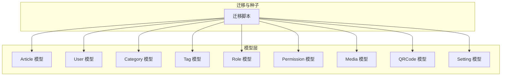
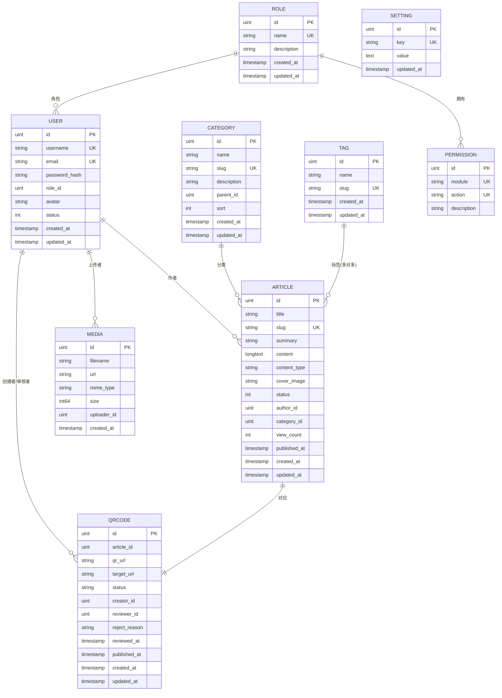
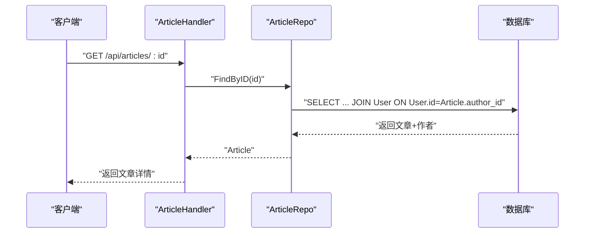
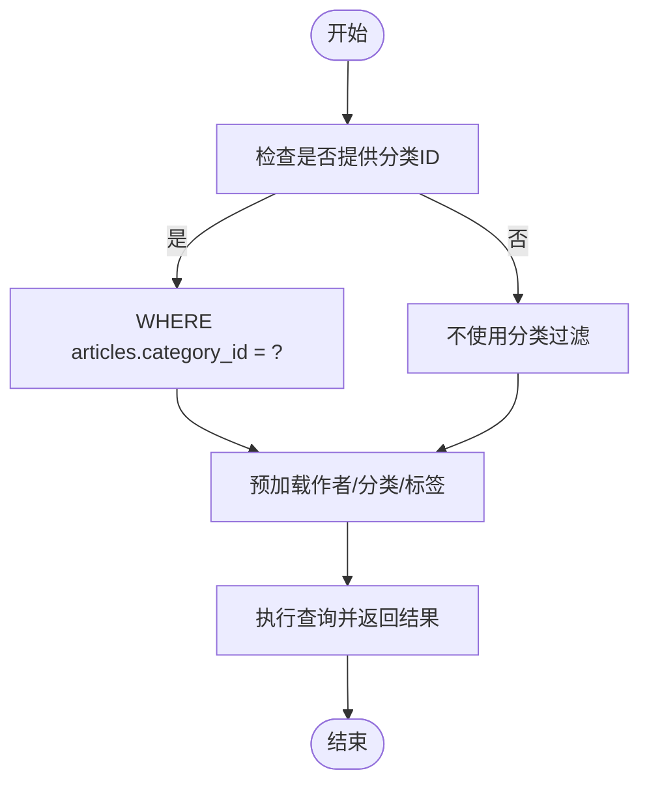
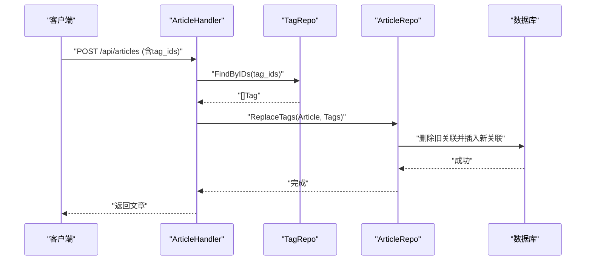
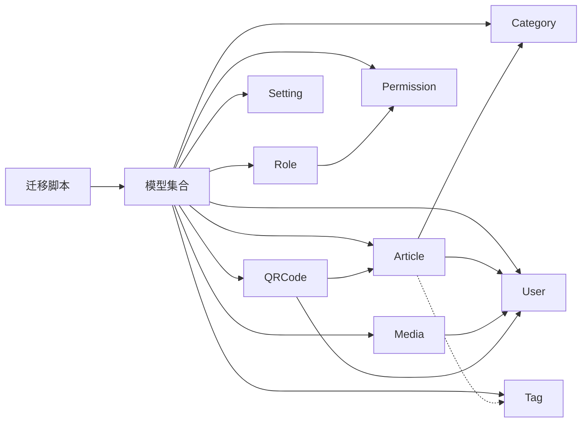

# 表关系设计

<cite>
**本文引用的文件**
- [server/internal/model/article.go](file://server/internal/model/article.go)
- [server/internal/model/user.go](file://server/internal/model/user.go)
- [server/internal/model/category.go](file://server/internal/model/category.go)
- [server/internal/model/tag.go](file://server/internal/model/tag.go)
- [server/internal/model/role.go](file://server/internal/model/role.go)
- [server/internal/model/media.go](file://server/internal/model/media.go)
- [server/internal/model/qrcode.go](file://server/internal/model/qrcode.go)
- [server/internal/model/setting.go](file://server/internal/model/setting.go)
- [server/migration/migrate.go](file://server/migration/migrate.go)
- [server/internal/repository/article_repo.go](file://server/internal/repository/article_repo.go)
- [server/internal/repository/tag_repo.go](file://server/internal/repository/tag_repo.go)
- [server/internal/handler/article.go](file://server/internal/handler/article.go)
</cite>

## 目录
1. [引言](#引言)
2. [项目结构](#项目结构)
3. [核心组件](#核心组件)
4. [架构总览](#架构总览)
5. [详细组件分析](#详细组件分析)
6. [依赖分析](#依赖分析)
7. [性能考量](#性能考量)
8. [故障排查指南](#故障排查指南)
9. [结论](#结论)
10. [附录](#附录)

## 引言
本文件面向Xiangmuzs博客平台的数据层表关系设计，聚焦于核心实体：Article（文章）、User（用户）、Category（分类）、Tag（标签）以及辅助实体：Role（角色）、Permission（权限）、Media（媒体）、QRCode（二维码）、Setting（系统设置）。文档从ER图与实体关系图出发，系统阐述外键约束与参照完整性、多对多关系实现（Article-Tag）、级联策略与一致性保障、查询优化与性能考虑，并结合业务背景讨论扩展性与软/硬删除策略。

## 项目结构
后端采用Go语言与GORM框架，模型定义位于server/internal/model，迁移脚本位于server/migration，仓储层位于server/internal/repository，处理器位于server/internal/handler。迁移脚本会自动迁移并初始化基础数据（权限、角色、管理员用户）。



图表来源
- [server/migration/migrate.go:13-38](file://server/migration/migrate.go#L13-L38)
- [server/internal/model/article.go:5-23](file://server/internal/model/article.go#L5-L23)
- [server/internal/model/user.go:5-16](file://server/internal/model/user.go#L5-L16)
- [server/internal/model/category.go:5-14](file://server/internal/model/category.go#L5-L14)
- [server/internal/model/tag.go:5-11](file://server/internal/model/tag.go#L5-L11)
- [server/internal/model/role.go:5-19](file://server/internal/model/role.go#L5-L19)
- [server/internal/model/media.go:5-13](file://server/internal/model/media.go#L5-L13)
- [server/internal/model/qrcode.go:6-22](file://server/internal/model/qrcode.go#L6-L22)
- [server/internal/model/setting.go:5-10](file://server/internal/model/setting.go#L5-L10)

章节来源
- [server/migration/migrate.go:13-38](file://server/migration/migrate.go#L13-L38)

## 核心组件
- Article（文章）
  - 关键字段：主键ID、标题、别名（Slug）、摘要、内容、内容类型、封面图、状态、作者ID、分类ID、浏览量、发布时间、时间戳。
  - 外键：AuthorID → User.ID；CategoryID → Category.ID。
  - 多对多：Tags（通过中间表article_tags关联）。
  - 索引：状态+发布时间复合索引、分类ID索引、Slug唯一索引。
- User（用户）
  - 关键字段：主键ID、用户名、邮箱、密码哈希、角色ID、头像、状态、时间戳。
  - 外键：RoleID → Role.ID。
  - 索引：用户名唯一索引、邮箱唯一索引。
- Category（分类）
  - 关键字段：主键ID、名称、别名（Slug）、描述、父分类ID、排序、时间戳。
  - 外键：ParentID → Category.ID（自引用）。
  - 索引：Slug唯一索引、ParentID索引。
- Tag（标签）
  - 关键字段：主键ID、名称、别名（Slug）、时间戳。
  - 索引：Slug唯一索引。
- Role/Permission（角色与权限）
  - 关键字段：Role主键ID、名称、描述、权限集合；Permission主键ID、模块、动作、描述。
  - 多对多：Role.Permissions（通过中间表role_permissions关联）。
  - 索引：模块+动作唯一索引。
- Media（媒体）
  - 关键字段：主键ID、文件名、URL、MIME类型、大小、上传者ID、时间戳。
  - 外键：UploaderID → User.ID。
- QRCode（二维码）
  - 关键字段：主键ID、文章ID、目标URL、状态、创建者ID、审核者ID、拒绝原因、审核/发布时间、时间戳。
  - 外键：ArticleID → Article.ID；CreatorID/ReviewerID → User.ID。
  - 索引：文章ID索引、状态索引。
- Setting（系统设置）
  - 关键字段：主键ID、键、值、更新时间。
  - 索引：键唯一索引。

章节来源
- [server/internal/model/article.go:5-23](file://server/internal/model/article.go#L5-L23)
- [server/internal/model/user.go:5-16](file://server/internal/model/user.go#L5-L16)
- [server/internal/model/category.go:5-14](file://server/internal/model/category.go#L5-L14)
- [server/internal/model/tag.go:5-11](file://server/internal/model/tag.go#L5-L11)
- [server/internal/model/role.go:5-19](file://server/internal/model/role.go#L5-L19)
- [server/internal/model/media.go:5-13](file://server/internal/model/media.go#L5-L13)
- [server/internal/model/qrcode.go:6-22](file://server/internal/model/qrcode.go#L6-L22)
- [server/internal/model/setting.go:5-10](file://server/internal/model/setting.go#L5-L10)

## 架构总览
下图给出Xiangmuzs博客平台核心实体的ER关系图，标注了外键、索引与多对多中间表。



图表来源
- [server/internal/model/article.go:5-23](file://server/internal/model/article.go#L5-L23)
- [server/internal/model/user.go:5-16](file://server/internal/model/user.go#L5-L16)
- [server/internal/model/category.go:5-14](file://server/internal/model/category.go#L5-L14)
- [server/internal/model/tag.go:5-11](file://server/internal/model/tag.go#L5-L11)
- [server/internal/model/role.go:5-19](file://server/internal/model/role.go#L5-L19)
- [server/internal/model/media.go:5-13](file://server/internal/model/media.go#L5-L13)
- [server/internal/model/qrcode.go:6-22](file://server/internal/model/qrcode.go#L6-L22)
- [server/internal/model/setting.go:5-10](file://server/internal/model/setting.go#L5-L10)

## 详细组件分析

### 文章与用户的关系（一对多）
- Article.AuthorID → User.ID
- 语义：一个用户可以发布多篇文章，一篇文章仅有一个作者。
- 查询路径：文章列表/详情预加载作者信息；公开接口按状态过滤已发布文章。



图表来源
- [server/internal/handler/article.go:77-85](file://server/internal/handler/article.go#L77-L85)
- [server/internal/repository/article_repo.go:24-35](file://server/internal/repository/article_repo.go#L24-L35)

章节来源
- [server/internal/model/article.go:14-15](file://server/internal/model/article.go#L14-L15)
- [server/internal/model/user.go:5-16](file://server/internal/model/user.go#L5-L16)
- [server/internal/handler/article.go:77-85](file://server/internal/handler/article.go#L77-L85)
- [server/internal/repository/article_repo.go:24-35](file://server/internal/repository/article_repo.go#L24-L35)

### 文章与分类的关系（一对多）
- Article.CategoryID → Category.ID
- 支持分类树形结构：Category.ParentID → Category.ID（自引用）。
- 查询路径：按分类筛选文章时使用CategoryID条件；前端支持树选择。



图表来源
- [server/internal/repository/article_repo.go:41-70](file://server/internal/repository/article_repo.go#L41-L70)
- [server/internal/model/article.go:16-17](file://server/internal/model/article.go#L16-L17)
- [server/internal/model/category.go:10](file://server/internal/model/category.go#L10)

章节来源
- [server/internal/model/article.go:16-17](file://server/internal/model/article.go#L16-L17)
- [server/internal/model/category.go:5-14](file://server/internal/model/category.go#L5-L14)
- [server/internal/repository/article_repo.go:41-70](file://server/internal/repository/article_repo.go#L41-L70)

### 文章与标签的多对多关系（中间表）
- Article.Tags 通过 GORM 的 many2many: article_tags 实现。
- 中间表article_tags存储article_id与tag_id，形成多对多映射。
- 业务流程：创建/更新文章时，先根据TagIDs查询Tag集合，再通过Association("Tags").Replace进行替换。



图表来源
- [server/internal/handler/article.go:122-126](file://server/internal/handler/article.go#L122-L126)
- [server/internal/repository/tag_repo.go:36-43](file://server/internal/repository/tag_repo.go#L36-L43)
- [server/internal/repository/article_repo.go:76-78](file://server/internal/repository/article_repo.go#L76-L78)
- [server/internal/model/article.go:18](file://server/internal/model/article.go#L18)

章节来源
- [server/internal/model/article.go:18](file://server/internal/model/article.go#L18)
- [server/internal/handler/article.go:122-126](file://server/internal/handler/article.go#L122-L126)
- [server/internal/repository/tag_repo.go:24-28](file://server/internal/repository/tag_repo.go#L24-L28)
- [server/internal/repository/article_repo.go:76-78](file://server/internal/repository/article_repo.go#L76-L78)

### 角色与权限的多对多关系
- Role.Permissions 通过 many2many: role_permissions 实现。
- 权限粒度：模块（如article、category等）+ 动作（create/read/update/delete）构成唯一索引，确保权限不重复。

```mermaid
classDiagram
class Role {
+uint id
+string name
+string description
+[]Permission permissions
}
class Permission {
+uint id
+string module
+string action
+string description
}
Role ||--o{ Permission : "拥有"
```

图表来源
- [server/internal/model/role.go:5-19](file://server/internal/model/role.go#L5-L19)

章节来源
- [server/internal/model/role.go:5-19](file://server/internal/model/role.go#L5-L19)

### 媒体与用户的外键关系
- Media.UploaderID → User.ID
- 语义：每张媒体由特定用户上传，便于审计与统计。

章节来源
- [server/internal/model/media.go:11](file://server/internal/model/media.go#L11)
- [server/internal/model/user.go:5-16](file://server/internal/model/user.go#L5-L16)

### 二维码与文章/用户的外键关系
- QRCode.ArticleID → Article.ID；QRCode.CreatorID/ReviewerID → User.ID
- 状态流转：pending → approved/published 或 pending → rejected → resubmit
- 查询路径：按文章ID或状态索引查询二维码记录。

章节来源
- [server/internal/model/qrcode.go:8-14](file://server/internal/model/qrcode.go#L8-L14)
- [server/internal/model/article.go:5-23](file://server/internal/model/article.go#L5-L23)
- [server/internal/model/user.go:5-16](file://server/internal/model/user.go#L5-L16)

## 依赖分析
- 迁移脚本负责自动迁移所有模型，并初始化权限、角色与管理员用户。
- 文章仓储在查询时通过Joins与Preload组合实现“按标签筛选+预加载关联”的复杂查询。
- 标签仓储在删除标签前显式清理中间表article_tags关联，避免孤儿记录。



图表来源
- [server/migration/migrate.go:13-38](file://server/migration/migrate.go#L13-L38)
- [server/internal/repository/article_repo.go:41-70](file://server/internal/repository/article_repo.go#L41-L70)
- [server/internal/repository/tag_repo.go:24-28](file://server/internal/repository/tag_repo.go#L24-L28)

章节来源
- [server/migration/migrate.go:13-38](file://server/migration/migrate.go#L13-L38)
- [server/internal/repository/article_repo.go:41-70](file://server/internal/repository/article_repo.go#L41-L70)
- [server/internal/repository/tag_repo.go:24-28](file://server/internal/repository/tag_repo.go#L24-L28)

## 性能考量
- 索引策略
  - 文章：状态+发布时间复合索引用于快速筛选已发布文章；分类ID索引用于按分类查询；Slug唯一索引用于按别名检索。
  - 分类：Slug唯一索引与ParentID索引用于树形查询与去重。
  - 标签：Slug唯一索引用于按别名检索。
  - 用户：用户名与邮箱唯一索引用于登录与去重。
  - QRCode：文章ID与状态索引用于按文章与状态查询。
- 预加载与连接
  - 列表查询中使用Preload预加载作者、分类、标签，减少N+1查询。
  - 按标签筛选时使用JOIN article_tags与tags，配合WHERE子句与LIKE查询。
- 计数与聚合
  - 浏览量增量使用UpdateColumn表达式原子递增，避免并发竞争。
  - 聚合计数使用COALESCE保护空值。
- 查询优化建议
  - 在高频筛选字段上建立合适索引（如文章状态、分类ID、标签Slug）。
  - 对LIKE查询使用前缀匹配或全文索引（需数据库支持）。
  - 使用分页参数控制LIMIT与OFFSET，避免全表扫描。
  - 对复杂连接查询评估执行计划，必要时拆分查询或引入物化视图/缓存。

章节来源
- [server/internal/model/article.go:12-20](file://server/internal/model/article.go#L12-L20)
- [server/internal/model/category.go:8-10](file://server/internal/model/category.go#L8-L10)
- [server/internal/model/tag.go:7](file://server/internal/model/tag.go#L7)
- [server/internal/model/user.go:7](file://server/internal/model/user.go#L7)
- [server/internal/model/qrcode.go:8-12](file://server/internal/model/qrcode.go#L8-L12)
- [server/internal/repository/article_repo.go:64-67](file://server/internal/repository/article_repo.go#L64-L67)
- [server/internal/repository/article_repo.go:56-60](file://server/internal/repository/article_repo.go#L56-L60)
- [server/internal/repository/article_repo.go:72-74](file://server/internal/repository/article_repo.go#L72-L74)
- [server/internal/repository/article_repo.go:86-89](file://server/internal/repository/article_repo.go#L86-L89)

## 故障排查指南
- 删除标签导致关联异常
  - 现象：删除标签后文章仍显示该标签。
  - 处理：仓储层在删除标签前显式清理中间表article_tags关联，确保参照完整性。
- 文章标签更新失败
  - 现象：更新文章标签未生效。
  - 处理：通过Association("Tags").Replace进行替换，确保中间表同步。
- 查询性能下降
  - 现象：按标签筛选或分页查询慢。
  - 处理：确认索引是否存在；检查SQL执行计划；优化LIKE模式或引入全文检索。
- 状态筛选无效
  - 现象：按状态查询未返回预期结果。
  - 处理：确认状态字段默认值与索引；检查查询参数传递与绑定。

章节来源
- [server/internal/repository/tag_repo.go:24-28](file://server/internal/repository/tag_repo.go#L24-L28)
- [server/internal/repository/article_repo.go:76-78](file://server/internal/repository/article_repo.go#L76-L78)
- [server/internal/repository/article_repo.go:41-70](file://server/internal/repository/article_repo.go#L41-L70)

## 结论
Xiangmuzs博客平台的表关系设计以简洁明确为核心：通过外键约束保证参照完整性，借助中间表实现Article-Tag的多对多关系；在查询层面采用预加载与连接优化，结合索引策略提升性能。整体设计兼顾业务可扩展性与数据一致性，适合后续在权限体系、媒体管理、二维码审核等方面平滑演进。

## 附录
- 业务背景与扩展性
  - 权限体系：基于模块+动作的细粒度权限，支持动态分配与角色继承。
  - 媒体管理：媒体与用户关联，便于统计与审计。
  - 二维码：围绕文章的审核流程，支持状态机与复审。
- 软删除与硬删除
  - 当前模型未见软删除字段（如deleted_at），删除操作为物理删除。
  - 若未来需要软删除，可在核心表增加deleted_at与deleted字段，并在查询中默认过滤未删除记录；同时在删除时改为更新标记而非删除行，以保留关联完整性。