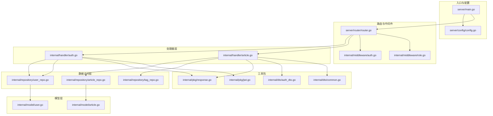
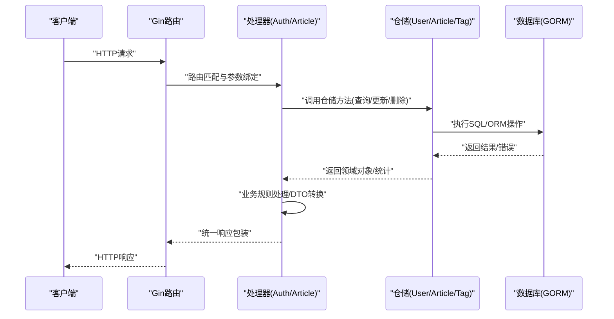
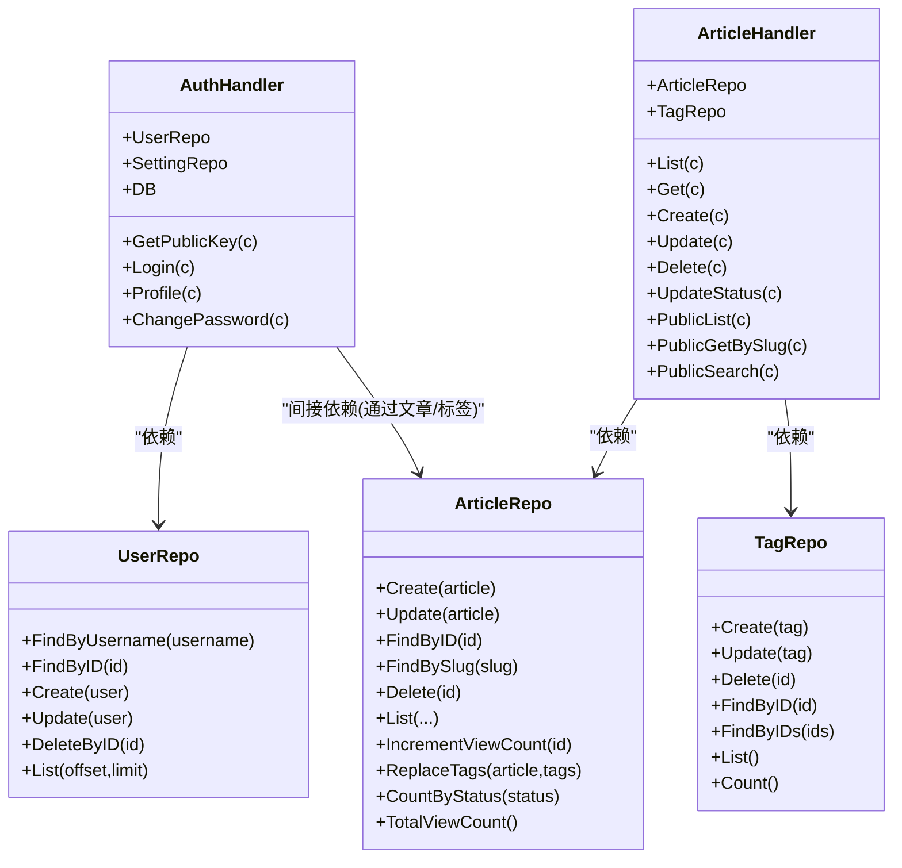
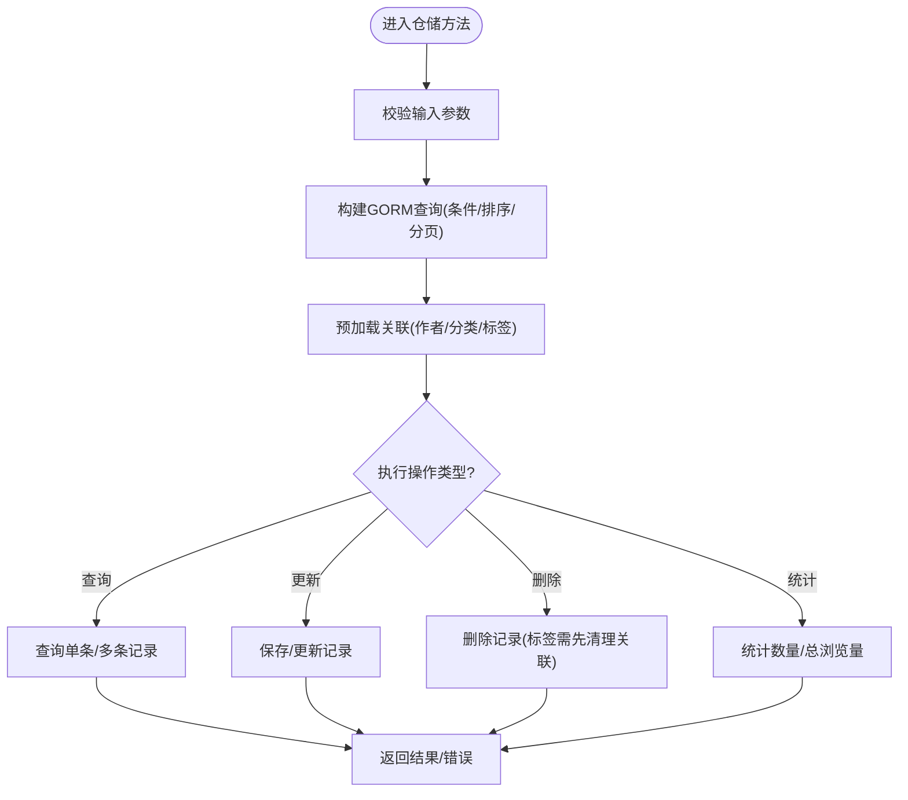
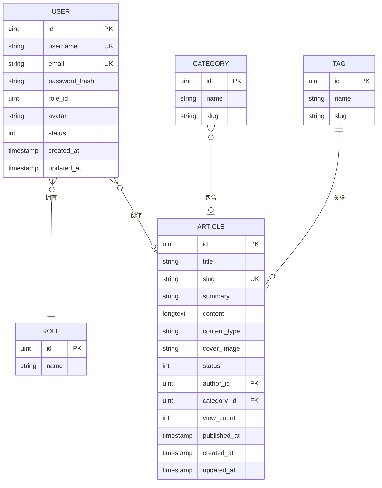
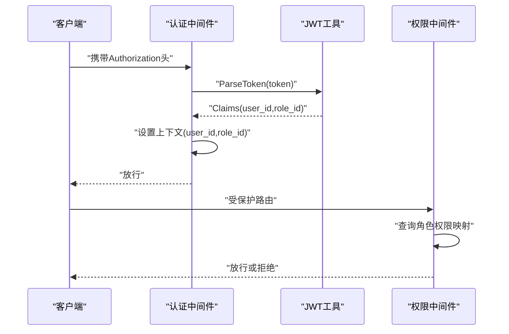
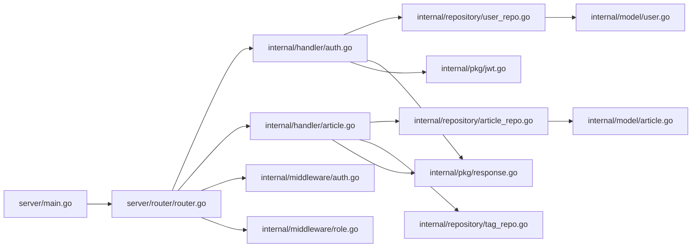

# 分层架构设计

<cite>
**本文档引用的文件**
- [server/main.go](file://server/main.go)
- [router/router.go](file://server/router/router.go)
- [config/config.go](file://server/config/config.go)
- [internal/handler/auth.go](file://server/internal/handler/auth.go)
- [internal/handler/article.go](file://server/internal/handler/article.go)
- [internal/repository/user_repo.go](file://server/internal/repository/user_repo.go)
- [internal/repository/article_repo.go](file://server/internal/repository/article_repo.go)
- [internal/repository/tag_repo.go](file://server/internal/repository/tag_repo.go)
- [internal/model/user.go](file://server/internal/model/user.go)
- [internal/model/article.go](file://server/internal/model/article.go)
- [internal/middleware/auth.go](file://server/internal/middleware/auth.go)
- [internal/middleware/role.go](file://server/internal/middleware/role.go)
- [internal/pkg/response.go](file://server/internal/pkg/response.go)
- [internal/pkg/jwt.go](file://server/internal/pkg/jwt.go)
- [internal/dto/auth_dto.go](file://server/internal/dto/auth_dto.go)
- [internal/dto/common.go](file://server/internal/dto/common.go)
- [server/go.mod](file://server/go.mod)
</cite>

## 目录
1. [引言](#引言)
2. [项目结构](#项目结构)
3. [核心组件](#核心组件)
4. [架构总览](#架构总览)
5. [详细组件分析](#详细组件分析)
6. [依赖分析](#依赖分析)
7. [性能考虑](#性能考虑)
8. [故障排查指南](#故障排查指南)
9. [结论](#结论)

## 引言
本文件面向Xiangmuzs博客平台的后端服务，系统化阐述基于Gin与GORM的四层架构设计与MVC模式落地实践。通过明确Handler层（控制器）、Service层（业务逻辑）、Repository层（数据访问）与Model层（数据模型）的职责边界、依赖关系与调用链路，帮助开发者理解如何在Go项目中实现高内聚、低耦合、易维护、易测试、易扩展的分层架构。

## 项目结构
后端采用“入口程序—路由—处理器—中间件—数据访问—模型—工具包”的组织方式，遵循模块化与分层原则：
- 入口程序负责配置加载、数据库连接、迁移初始化、静态资源与路由注册
- 路由模块集中管理REST接口与权限控制
- 处理器层承接HTTP请求，编排业务流程，返回统一响应
- 中间件层提供认证、授权、跨域等横切能力
- 数据访问层封装数据库操作，屏蔽ORM细节
- 模型层定义实体结构，承载GORM注解
- 工具包层提供通用响应、加密、JWT、上传等能力

**图表来源**
- [server/main.go:1-77](file://server/main.go#L1-L77)
- [router/router.go:1-104](file://server/router/router.go#L1-L104)
- [config/config.go:1-65](file://server/config/config.go#L1-L65)
- [internal/handler/auth.go:1-163](file://server/internal/handler/auth.go#L1-L163)
- [internal/handler/article.go:1-325](file://server/internal/handler/article.go#L1-L325)
- [internal/repository/user_repo.go:1-66](file://server/internal/repository/user_repo.go#L1-L66)
- [internal/repository/article_repo.go:1-91](file://server/internal/repository/article_repo.go#L1-L91)
- [internal/repository/tag_repo.go:1-56](file://server/internal/repository/tag_repo.go#L1-L56)
- [internal/model/user.go:1-17](file://server/internal/model/user.go#L1-L17)
- [internal/model/article.go:1-24](file://server/internal/model/article.go#L1-L24)
- [internal/middleware/auth.go:1-38](file://server/internal/middleware/auth.go#L1-L38)
- [internal/middleware/role.go:1-43](file://server/internal/middleware/role.go#L1-L43)
- [internal/pkg/response.go:1-70](file://server/internal/pkg/response.go#L1-L70)
- [internal/pkg/jwt.go:1-43](file://server/internal/pkg/jwt.go#L1-L43)
- [internal/dto/auth_dto.go:1-39](file://server/internal/dto/auth_dto.go#L1-L39)
- [internal/dto/common.go:1-21](file://server/internal/dto/common.go#L1-L21)

**章节来源**
- [server/main.go:1-77](file://server/main.go#L1-L77)
- [router/router.go:1-104](file://server/router/router.go#L1-L104)
- [config/config.go:1-65](file://server/config/config.go#L1-L65)

## 核心组件
- Handler层（控制器）
  - 职责：接收HTTP请求，参数绑定与校验，调用数据访问层，组装统一响应
  - 示例：登录、修改密码、文章增删改查、公开文章列表/详情/搜索等
- Repository层（数据访问）
  - 职责：封装数据库操作，提供领域内CRUD与查询方法，屏蔽ORM差异
  - 示例：用户、文章、标签的创建、更新、查询、关联替换等
- Model层（数据模型）
  - 职责：定义实体字段、索引、外键关系、JSON序列化标签
  - 示例：用户、文章、分类、标签等
- Service层（业务逻辑）
  - 现状：当前代码未显式拆分Service层，业务逻辑直接在Handler中完成
  - 建议：将复杂业务规则抽取到Service层，提升可测试性与复用性
- 中间件层
  - 认证中间件：解析Authorization头，校验JWT并注入用户上下文
  - 权限中间件：按模块+动作检查角色权限
- 工具包层
  - 统一响应：Success/Error系列函数，标准化HTTP响应体
  - JWT工具：生成与解析令牌，读取配置
  - DTO：请求/响应数据结构定义
  - 分页DTO：统一分页参数规范化

**章节来源**
- [internal/handler/auth.go:1-163](file://server/internal/handler/auth.go#L1-L163)
- [internal/handler/article.go:1-325](file://server/internal/handler/article.go#L1-L325)
- [internal/repository/user_repo.go:1-66](file://server/internal/repository/user_repo.go#L1-L66)
- [internal/repository/article_repo.go:1-91](file://server/internal/repository/article_repo.go#L1-L91)
- [internal/repository/tag_repo.go:1-56](file://server/internal/repository/tag_repo.go#L1-L56)
- [internal/model/user.go:1-17](file://server/internal/model/user.go#L1-L17)
- [internal/model/article.go:1-24](file://server/internal/model/article.go#L1-L24)
- [internal/middleware/auth.go:1-38](file://server/internal/middleware/auth.go#L1-L38)
- [internal/middleware/role.go:1-43](file://server/internal/middleware/role.go#L1-L43)
- [internal/pkg/response.go:1-70](file://server/internal/pkg/response.go#L1-L70)
- [internal/pkg/jwt.go:1-43](file://server/internal/pkg/jwt.go#L1-L43)
- [internal/dto/auth_dto.go:1-39](file://server/internal/dto/auth_dto.go#L1-L39)
- [internal/dto/common.go:1-21](file://server/internal/dto/common.go#L1-L21)

## 架构总览
下图展示了从HTTP请求到数据库访问的完整调用链，体现四层架构的职责与依赖方向。

**图表来源**
- [router/router.go:11-103](file://server/router/router.go#L11-L103)
- [internal/handler/auth.go:31-93](file://server/internal/handler/auth.go#L31-L93)
- [internal/handler/article.go:87-129](file://server/internal/handler/article.go#L87-L129)
- [internal/repository/user_repo.go:24-38](file://server/internal/repository/user_repo.go#L24-L38)
- [internal/repository/article_repo.go:16-22](file://server/internal/repository/article_repo.go#L16-L22)

## 详细组件分析

### Handler层（控制器）分析
- 职责边界
  - 参数校验：使用Gin的ShouldBind进行结构化解析
  - 业务编排：调用仓储层获取/更新数据，必要时进行业务规则处理
  - 统一响应：通过工具包输出标准响应体
- 关键交互
  - 认证处理器：登录时校验验证码、RSA解密、哈希比对、签发JWT；个人资料与改密流程
  - 文章处理器：列表/详情/创建/更新/删除/状态变更；公开端列表、详情、搜索
- 错误处理
  - 使用工具包的错误函数输出不同HTTP状态码与消息
- 依赖注入
  - Handler构造函数接收数据库连接，内部创建对应仓储实例

**图表来源**
- [internal/handler/auth.go:13-25](file://server/internal/handler/auth.go#L13-L25)
- [internal/handler/article.go:19-29](file://server/internal/handler/article.go#L19-L29)
- [internal/repository/user_repo.go:8-22](file://server/internal/repository/user_repo.go#L8-L22)
- [internal/repository/article_repo.go:8-14](file://server/internal/repository/article_repo.go#L8-L14)
- [internal/repository/tag_repo.go:8-14](file://server/internal/repository/tag_repo.go#L8-L14)

**章节来源**
- [internal/handler/auth.go:1-163](file://server/internal/handler/auth.go#L1-L163)
- [internal/handler/article.go:1-325](file://server/internal/handler/article.go#L1-L325)

### Repository层（数据访问）分析
- 职责边界
  - 封装GORM查询与写入，暴露领域方法
  - 预加载关联（作者、分类、标签），保证上层无需关心懒加载
- 关键方法
  - 用户：按用户名/ID查询、创建、更新、分页列表
  - 文章：创建、更新、按ID/Slug查询、分页列表（含状态、分类、关键词、标签过滤）、浏览量自增、标签替换、统计
  - 标签：创建、更新、删除（先清理关联）、按ID/IDs查询、全量列表、计数
- 复杂度与性能
  - 列表查询支持多条件组合，注意索引与预加载成本
  - 浏览量自增使用表达式避免并发问题

**图表来源**
- [internal/repository/user_repo.go:24-65](file://server/internal/repository/user_repo.go#L24-L65)
- [internal/repository/article_repo.go:41-70](file://server/internal/repository/article_repo.go#L41-L70)
- [internal/repository/tag_repo.go:24-28](file://server/internal/repository/tag_repo.go#L24-L28)

**章节来源**
- [internal/repository/user_repo.go:1-66](file://server/internal/repository/user_repo.go#L1-L66)
- [internal/repository/article_repo.go:1-91](file://server/internal/repository/article_repo.go#L1-L91)
- [internal/repository/tag_repo.go:1-56](file://server/internal/repository/tag_repo.go#L1-L56)

### Model层（数据模型）分析
- 职责边界
  - 定义实体字段、约束、索引与JSON标签
  - 通过GORM注解声明一对多/多对多关系
- 关键实体
  - 用户：主键、唯一用户名/邮箱、角色外键、状态、时间戳
  - 文章：标题、Slug唯一索引、摘要、内容、类型、封面、状态索引、作者外键、分类外键、标签多对多、浏览量、发布时间索引
- 设计要点
  - 字段长度与默认值约束清晰
  - JSON标签用于API序列化，敏感字段如密码哈希标记为不序列化

**图表来源**
- [internal/model/user.go:5-16](file://server/internal/model/user.go#L5-L16)
- [internal/model/article.go:5-23](file://server/internal/model/article.go#L5-L23)

**章节来源**
- [internal/model/user.go:1-17](file://server/internal/model/user.go#L1-L17)
- [internal/model/article.go:1-24](file://server/internal/model/article.go#L1-L24)

### 中间件与工具包分析
- 认证中间件
  - 解析Authorization头，校验Bearer格式
  - 解析JWT，注入user_id与role_id到上下文
- 权限中间件
  - 基于角色-权限映射表检查模块+动作权限
- 统一响应
  - 成功/分页/错误系列函数，固定响应结构
- JWT工具
  - 生成与解析令牌，读取配置

**图表来源**
- [internal/middleware/auth.go:10-37](file://server/internal/middleware/auth.go#L10-L37)
- [internal/middleware/role.go:10-35](file://server/internal/middleware/role.go#L10-L35)
- [internal/pkg/jwt.go:30-42](file://server/internal/pkg/jwt.go#L30-L42)

**章节来源**
- [internal/middleware/auth.go:1-38](file://server/internal/middleware/auth.go#L1-L38)
- [internal/middleware/role.go:1-43](file://server/internal/middleware/role.go#L1-L43)
- [internal/pkg/response.go:1-70](file://server/internal/pkg/response.go#L1-L70)
- [internal/pkg/jwt.go:1-43](file://server/internal/pkg/jwt.go#L1-L43)

## 依赖分析
- 模块依赖
  - Gin作为Web框架，GORM作为ORM，Viper用于配置，JWT用于鉴权
- 层间依赖
  - Handler依赖Repository与工具包
  - Repository依赖Model与GORM
  - 路由依赖Handler与中间件
  - 入口程序依赖配置、路由与迁移
- 循环依赖
  - 当前结构未见循环导入，分层清晰

**图表来源**
- [server/go.mod:5-12](file://server/go.mod#L5-L12)
- [server/main.go:3-16](file://server/main.go#L3-L16)
- [router/router.go:3-8](file://server/router/router.go#L3-L8)

**章节来源**
- [server/go.mod:1-60](file://server/go.mod#L1-L60)
- [server/main.go:1-77](file://server/main.go#L1-L77)
- [router/router.go:1-104](file://server/router/router.go#L1-L104)

## 性能考虑
- 查询优化
  - 列表查询建议在高频过滤字段（状态、分类、发布时间）建立复合索引
  - 预加载关联时注意N+1问题，优先使用Joins或Preload批量加载
- 并发安全
  - 浏览量自增使用表达式更新，避免竞态
- 缓存策略
  - 对热点数据（如公开文章详情、分类/标签列表）引入缓存
- 日志与监控
  - 在Debug模式开启GORM日志，生产环境关闭或降级
- 传输安全
  - 敏感操作启用HTTPS，密码使用RSA加密传输，JWT密钥妥善保管

## 故障排查指南
- 认证失败
  - 检查Authorization头格式是否为Bearer Token
  - 校验JWT签名与有效期
- 权限不足
  - 确认角色是否具备模块+动作权限
  - 检查权限映射表是否正确
- 数据库错误
  - 查看GORM日志定位SQL异常
  - 校验外键与唯一索引冲突
- 参数错误
  - 使用DTO绑定失败时检查请求体结构与必填字段
- 统一响应
  - 使用工具包错误函数快速定位HTTP状态与消息

**章节来源**
- [internal/middleware/auth.go:10-37](file://server/internal/middleware/auth.go#L10-L37)
- [internal/middleware/role.go:10-35](file://server/internal/middleware/role.go#L10-L35)
- [internal/pkg/response.go:43-69](file://server/internal/pkg/response.go#L43-L69)

## 结论
Xiangmuzs博客平台采用清晰的四层架构与MVC模式，Handler层专注请求处理与响应封装，Repository层隔离数据访问细节，Model层定义实体契约，中间件与工具包提供横切能力。当前代码在职责分离与可维护性方面表现良好，建议进一步将复杂业务逻辑迁移到Service层，以增强可测试性与可扩展性。通过索引优化、缓存策略与日志监控，可进一步提升系统性能与稳定性。